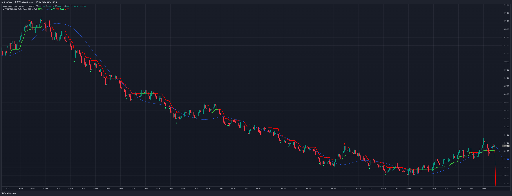
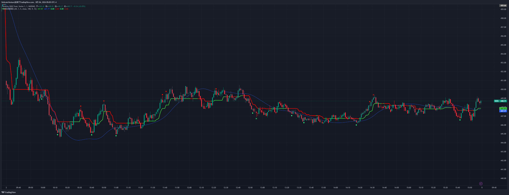

# 2024年8月

## 1日 

| 序号 |      交易明细       | 数量 | 买入价格 | 买入时间 | 卖出价格 | 卖出时间 | 盈亏  |
| :--: | :-----------------: | :--: | :------: | :------: | :------: | :------: | :---: |
|  1   | QQQ  8/1  465  Put  |  1   |   0.49   | 21:35:14 |   0.3    | 21:41:37 | -22.1 |
|  2   | QQQ  8/1  468  Put  |  1   |   0.5    | 21:46:32 |   2.97   | 23:17:52 | +245  |
|  3   | QQQ  8/1  469  Call |  2   |   0.4    | 00:22:17 |   0.29   | 0:34:56  | -25.7 |
|  4   | QQQ  8/1  467 Call  |  2   |   0.4    | 00:57:45 |   0.29   | 01:06:39 |  -25  |

今天的交易计划是开盘上涨后做空，然后寻找转折点做多。

开盘上涨五分钟后出现下跌，买入了第一手看跌期权，入场早了，不一会就止损出场了。如果不止损出场的话，后期还是有几倍的盈利的。

十五分钟左右上涨变缓慢，出现了一根锤子线，买入了第二手看跌期权，后续价格波段一段时间后开始下跌。十一点多一点的时候期权单价涨到4.0，收益为700%，我将出场价格调整到3.0，结果qqq价格回调接近2点，被动止盈出场了，错过了后续1700%甚至更高的收益。

之所以出现这样的状况还是担心利润回吐吧，没有留出更多的价格回调的空间。还有就是这个期权只买了一手，如果买了多手的话，我可以先止盈一部分，让剩余的部分的利润回调或者继续奔跑。

十二点多到时候看到了价格呈现了顶顶高，底底高的上升趋势结构，等价格再回调的时候了，买了两手看涨期权，被动止损出场了。

将近一点的时候，看见qqq价格两次接近462的时候都是大阳线将价格拉起来，然后买了两手看涨期权，然后被动止损出场了。

今天的下跌趋势相对来说比较缓慢且平稳吧。下跌的蜡烛线不是那种大蜡烛线（几根蜡烛线下跌好几点的那种），今天的下跌蜡烛线是比较连贯的小蜡烛线，下跌趋势中伴随中等大小阳线的回调，但是回调的也不多，不是那种下跌趋势50%的回调，可能这样的下跌会全天都是下跌，没有回调，可以观察一下之前的全天都是下跌趋势的蜡烛线的形态是不是有类似的情况。

## 2日

| 序号 |      交易明细       | 数量 | 买入价格 | 买入时间 | 卖出价格 | 卖出时间 | 盈亏  |
| :--: | :-----------------: | :--: | :------: | :------: | :------: | :------: | :---: |
|  1   | QQQ  8/2  435  Put  |  2   |   0.48   |  22:13   |   0.39   |  22:17   | -20.5 |
|  2   | QQQ  8/2  456  Call |  2   |   0.5    |  22:22   |   0.39   |  22:39   | -24.7 |
|  3   | QQQ  8/2  453  Call |  2   |   0.5    |  23:06   |   0.78   |   0:09   | +53.2 |
|  4   | QQQ  8/2  442 Call  |  2   |   0.49   |  00:13   |   0.39   |  00:17   | -22.7 |

今天的交易计划是开盘下跌后买看涨。

开盘下跌五分钟后，想买看涨期权，不知道是我的网卡，还是盈透的服务器卡，没买上，后续涨势很快，就没在追涨，错过了一波上涨的行情。

等到这波涨势到高点开始下跌，想买看跌期权犹豫了，又错过了一大波下跌的趋势。之前好像出现过类似的场景，快速上涨后，又开始快速下跌，不知道这部分快速上涨是不是空头平仓造成的。

22:13时候看下跌趋势依然存在，想追下跌趋势，结果买在地点，最后被止损出场。

被止损出场后，22:22买了看涨的期权，被后续的阶段性低点止损出场了，如果止损设置的再大一点，应该能熬过两次低点，后续应该是盈利的订单。

23:06看见三次低点了之后都没跌下去，买了看涨的期权。十二点到时候，三次冲击450点都没上去，这个时候应该在高点的时候就果断卖掉，结果被动止盈了，少了100多的利润。

00:13看见下跌趋势很强烈，想继续买下跌，结果被止损出场了。

今天开盘快速上涨后下跌的场景很特殊，看看是不是有相同的交易场景，以后可以再上涨的顶部抓住一波看跌的交易机会。

然后就是十点到十一点期间可以看做三重底形态吧，十一点半到十二点半之前是几重顶的形态，可以依据形态做一些交易。

