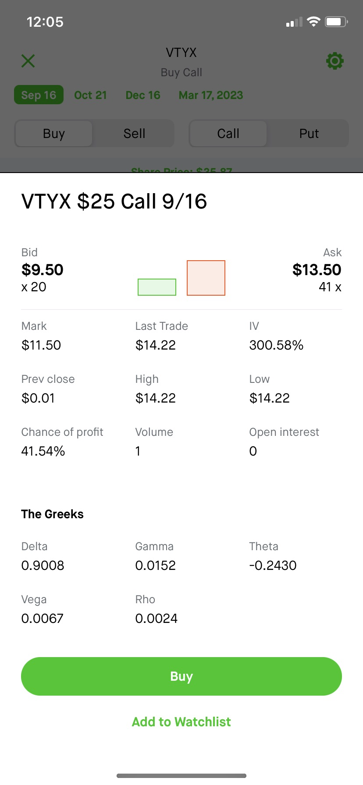
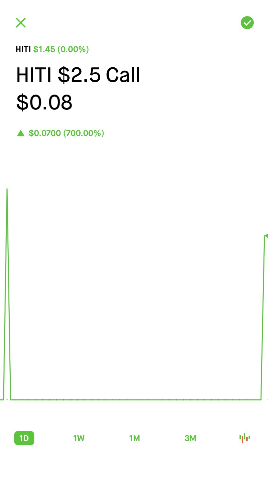
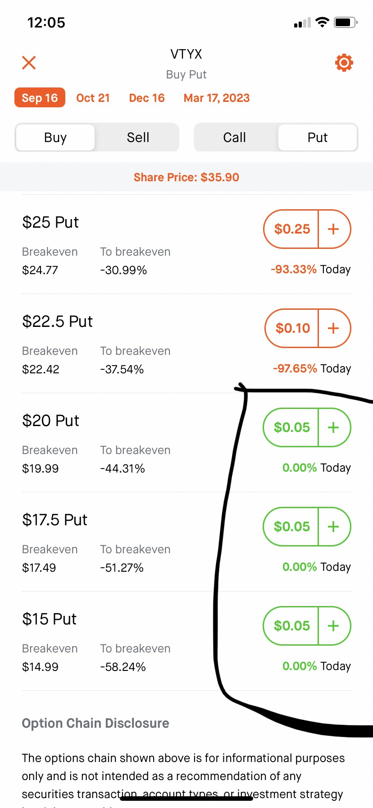
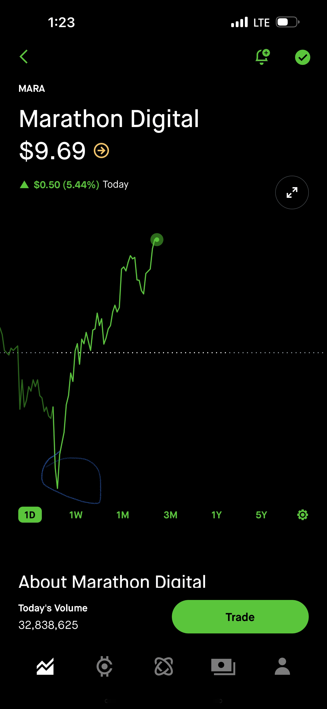
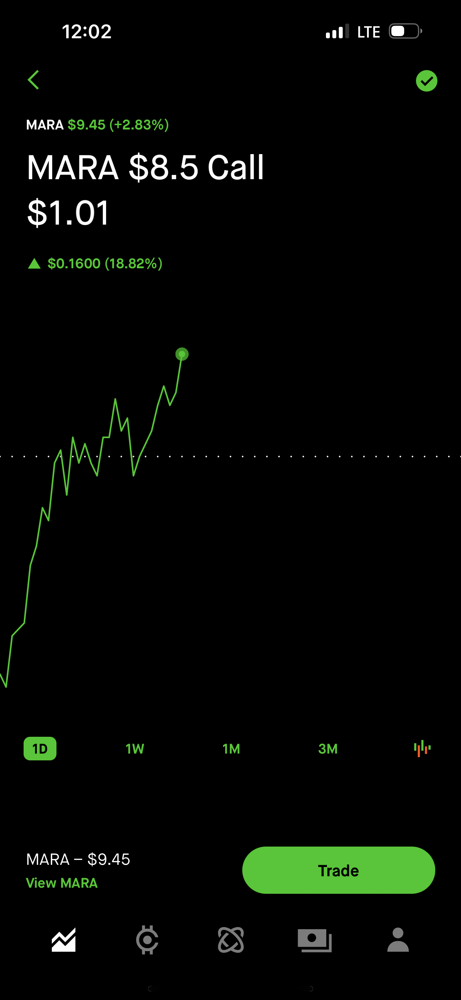
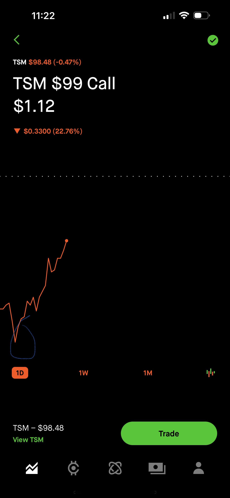
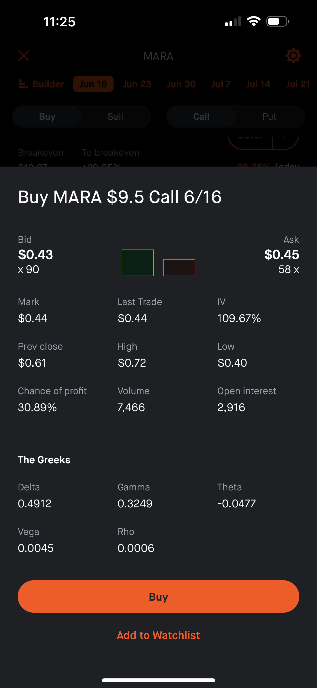
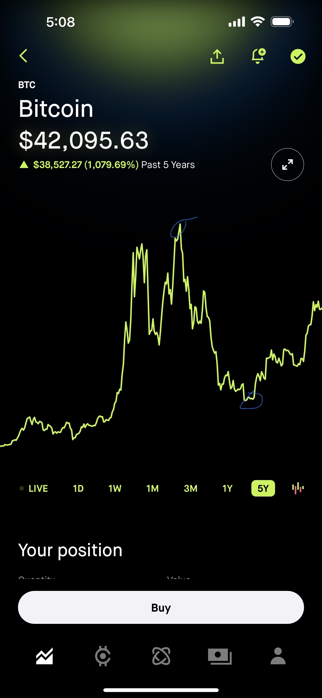
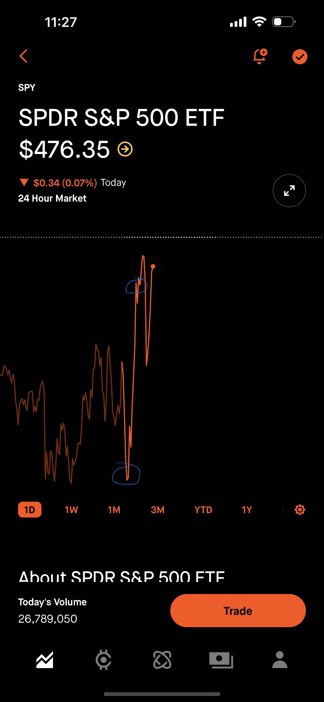

# 教程1

## basic1

Types of investing@everyone 

💰Day Trade Definition 💰

Buying and selling a stock within the same day

🏌️‍♂️Swing Trading Definition 🏌️‍♂️

When you buy a stock, and you sell within a couple of days

📈 Longterm Investing Definition 📈

When you buy a stock and don’t sell for years

投资类型@everyone 

 💰 日间交易定义 💰 

在同一天内买卖股票

 🏌️‍♂️ 波段交易定义 🏌️‍♂️ 

当你买入股票并在几天内卖出时

 📈 长期投资定义 📈 

当你买了一只股票并且多年不卖时.

Beginner Terms @everyone 

Options Trading: 

CALLS: you think a stock is going to go up📈

PUTS: you believe a stock is going to go down📉 

Share Trading: 

Long: you think a stock is going to go up📈

Short: you believe a stock will go down 📉

初学者术语@everyone 

期权交易：

电话：您认为股票将会上涨 📈 

看跌：您相信股票会下跌 📉  

股票交易：

Long ：你认为股票会上涨 📈 

空头：你相信股票会下跌 📉 

Stop Loss @everyone 

For share trading, I usually have a 7% stop. Make sure to have a stop loss below a critical level. For example. If you buy a stock at $1.07 and a 7% stop would be $1, but $1 is a crucial level of support, so you put your stop loss at $0.999

For options trading, you need to size down a lot. An option stop loss should be 30%. Don’t be surprised if your option goes to 0.

Trailing Stop loss

For share trading, If you’re up 7% make sure to either take some profits or have a stop loss at breakeven

止损@everyone 

对于股票交易，我通常设置 7 % 的止损。确保将止损设置在临界水平以下。例如。如果您以1 .07美元买入股票，7 % 的止损价为1 美元，但1 美元是一个关键的支撑位，因此您将止损设置为0 .999美元。

对于期权交易，你需要缩小很多规模。期权止损应该是30 % 。如果您的选项变为0 ，请不要感到惊讶。

追踪止损

对于股票交易，如果您上涨 7 %，请确保要么获利了结，要么在盈亏平衡点设置止损

## option-greeks

There are 5 options Greeks. Delta, gamma, theta, vega, and rho. These Greeks can help you calculate how much you’ll make if the underlying asset moves to a specific price @everyone

希腊人有5个选项。 Delta 、gamma 、theta 、vega和 rho 。这些希腊人可以帮助您计算如果基础资产移动到特定价格@everyone您将赚多少钱.

Delta @everyone  Deltas domain is price. It identifies how much the options premium may change if the underlying price changes by $1. For example, if an option contract costs $2, the delta is $1, and the underlying stock moves $5, the option will increase by $5, a 150% return. Delta could also predict the probability of it being in the money. If the delta is $0.1, there’s a 10% chance of the option expiring in the money

达美航空@大家  

Delta的域名是price 。它确定了如果标的价格变化1美元，期权溢价可能会发生多少变化。例如，如果一份期权合约的成本为2 美元，Delta 为1 美元，而标的股票变动5 美元，则期权将上涨5 美元，即 150 % 的回报。达美航空还可以预测其实现盈利的概率。如果 delta 为$ 0 .1 ，则期权有 10 % 的机会在价内到期

Gamma @everyone 

 Gamma measures deltas rate of change. If an option has a delta of $0.4 and a gamma of 0.05, the premium we expect to change to $0.40, with the first dollar move in the underlying. Then to figure out the impact of the next dollar move, add delta and gamma together to find the new delta, which would be $0.45 in this example

伽玛@everyone  

Gamma 测量 Delta 的变化率。如果期权的 Delta 为0.4美元，Gamma 为0.05 ，则当标的资产价格首次变动时，我们预计溢价将变为0.40美元。然后，为了计算下一次美元变动的影响，将 delta 和 gamma 加在一起以找到新的 delta ，在本例中为0 .45美元。

Vega @everyone  

Vega, whose domain is implied volatility. Vega estimates how much the premium may change with each one percentage point change in implied volatility. If an option has a Vega of $0.02 and implied volatility decreases one percentage point, the premium will be expected to drop by $0.02. The most common spike of implied volatility is earnings

维加@everyone  

Vega ，其域是隐含波动率。 Vega 估计隐含波动率每变化一个百分点，溢价可能会发生多少变化。如果期权的 Vega 为0.02美元并且隐含波动率下降 1 个百分点，则溢价预计将下降0美元。 0 2 .隐含波动率最常见的峰值是收益

Rho @everyone  

Rho identifies how much an option premium may move if interest rates change. Because rates change slowly, they have a very little impact on options trading

罗@everyone  

Rho 确定了利率变化时期权溢价可能变动的幅度。由于利率变化缓慢，因此对期权交易的影响很小

## option-levlel-2

Options level 2 and volume is very important @everyone

选项级别 2 和交易量非常重要@everyone

This is level 2 for options on Robinhood. You can see the bid is $1.80, and the ask is $1.81, a $0.01 spread, which is excellent. If you were going to buy at $1.81 remember that’s it’s actually $181 for 1 contract. You can see 197 on the bid which is equivalent to $35,460 because $180 times 197 is $35,460. You can see that the volume is close to 100k which is perfect. @everyone

这是 Robinhood 上选项的 2 级。您可以看到买价为1 .80美元，卖价为1 .81美元，价差为0 .01美元，非常好。如果您打算以1 .81美元的价格买入，请记住， 1 份合约的实际价格为 181 美元。您可以在出价上看到 197，相当于$35,460 ，因为$180 乘以 197 等于$35 , 4 6 0 。可以看到音量接近100k，已经很完美了。 @每个人

This is an example of a terrible options contract. The spreads are way too big, a $4 spread. The volume is awful (1). If this is the best option contract for this stock, I will buy shares instead. Do not enter these contracts unless you’re 100% confident that the stock will gap up a lot. @everyone

这是一个糟糕的期权合约的例子。点差太大了， 4 美元的点差。音量太糟糕了(1 ) 。如果这是该股票的最佳期权合约，我将购买股票。除非您 100 % 确信该股票会大幅上涨，否则不要签订这些合约。 @每个人

Here’s another example of a terrible option contract that will make you lose everything. We can see that the bid is $0, and the ask is $0.05. 99% of the time, these options contracts will close at $0. You will lose everything. It had a $2.5 call, and $Hiti went up to $1.96, a 35% gain, but the contract went to $0 because $Hiti had to close at $2.50 to break even. @everyone (已编辑)

这是另一个可怕的期权合约的例子，它会让你失去一切。我们可以看到买价是$0 ，卖价是$ 0 。 0 5 。 99 % 的情况下，这些期权合约的收盘价为0美元。你将失去一切。它有一个2 .5美元的看涨期权， $Hiti 上涨至1 .96美元，涨幅为 35% ，但合约价格为0 美元，因为$Hiti 必须收于2 .50美元才能实现盈亏平衡。 @每个人(已编辑)

Let’s say you want to yolo. You can see that a $15 put costs the same as a $20 put. Please buy a $20 put instead of a $15 put; you’ll make 10x more. You can also see that the breakeven price is -44%, which means the underlying stock has to drop 44% to break even. If I ever alert to short these stocks, click short on tradezero instead of a put. @everyone (已编辑)

假设您想要 yolo 。您可以看到15 美元的看跌期权的成本与20 美元的看跌期权的成本相同。请购买20 美元的看跌期权，而不是15 美元的看跌期权；你的收入将增加 10 倍。您还可以看到，盈亏平衡价格为-44 % ，这意味着标的股票必须下跌 44 % 才能实现盈亏平衡。如果我提醒要卖空这些股票，请点击 tradezero 做空而不是看跌期权。 @每个人(已编辑)

In this example, you can see that the $25 $Vtyx call went up 114,900%, which is very misleading. It didn’t go up that much. 90% of the time, you can’t get filled below $0.05. This means you would’ve made 26,000%, but that’s only if you got filled at $13.5. Since the volume is so low, you probably could only get out at $9.50 for an 18,900% gain. @everyone (已编辑)

在此示例中，您可以看到$25 $Vtyx 调用上涨了 114,900 % ，这是非常具有误导性的。没涨那么多。 90 % 的情况下，您无法以低于0美元的价格获得满足。 0 5 。这意味着您将赚到 26,000 % ，但前提是您的价格为1 3美元。 5 .由于交易量如此之低，您可能只能以9.50美元的价格卖出，获得 18,900 %的收益。 @每个人(已编辑)

Remember, only get in an option contract if the spreads are lower than 10%, has excellent volume, and it doesn’t have a bid at $0. If the option contract does not have these three things, I would choose a better contract or buy/short shares. @everyone (已编辑)

请记住，只有在价差低于 10 % 、交易量大且没有0美元的出价时才签订期权合约。如果期权合约没有这三件事，我会选择更好的合约或买入/做空股票。

## options-strategy

In this Chanel I will show you the dip and rip options strategy and the shorting the top @everyone

在这个 Chanel 中，我将向您展示下跌和下跌期权策略以及做空顶部@everyone

First off you need a watchlist. This is my real stocks list, with over 100 stocks. @everyone (已编辑)

首先，您需要一个监视列表。这是我真实的股票清单，有100多只股票。 @每个人

The dip and rip strategy. First, you need to check your list and see which stock dropped the most at 9:30-9:35. Second, ensure there was no news or earnings on that stock; it could keep dipping. Third, you buy the dip between 9:35-9:40. If you’re trading options, you must choose the right one. @everyone

倾斜和撕裂策略。首先，您需要检查您的列表，看看哪只股票在9:30至9 : 3 5期间跌幅最大。其次，确保该股票没有任何新闻或收益；它可能会继续下跌。第三，你在9 :35-9 : 40之间逢低买入。如果您要交易期权，您必须选择正确的期权。 @每个人

Choosing the right option is very important. Sometimes you need to select an option in the money and sometimes out of the money. Never go too far when buying a dip and rip, especially on Fridays. Check the spreads as well; make sure the ask and the bud aren’t too far apart; if they are, choose a different option. The out-the-money option shouldn’t be more than the initial 9:30 drop. @everyone (已编辑)

选择正确的选项非常重要。有时您需要选择价内期权，有时则需要选择价外期权。逢低买入时切勿走得太远，尤其是在周五。还要检查点差；确保花芽和芽的距离不要太远；如果是，请选择不同的选项。 out - the-money 选项不应超过最初的9:30下降。 @每个人(已编辑)

Shorting the top. First, once again, check your watchlist and find the stock pumping the most on the open. Second, ensure there was no news or earnings on that stock; it could keep pumping. Third, you short the top between 9:35-9:40. On options, choose the right one, never too far out the money. @everyone (已编辑)

做空顶部。首先，再次检查您的观察列表，找到开盘涨幅最大的股票。其次，确保该股票没有任何新闻或收益；它可以继续泵送。第三，你在9 :35-9 : 4 0之间做空顶部。在选择上，选对的，永远不要把钱花得太远。 @每个人(已编辑)

Very important for options. Make sure to never full port. This strategy has a 75% win percentage, and if it goes wrong, you can always play again. I recommend never using more than 10% of your portfolio size, depending on the account size. Whenever the dip and rip fails, you may lose 100% of your initial buy. Sometimes it may take a day to bounce or crash. Risk management is the most important for this strategy. If you’re ever up 100%, I recommend selling half, so you have nothing to lose. Monday options are usually the safest and have less upside and downside risk, while Friday is the opposite. On Fridays, I would recommend buying in-the-money options, bc if the underlying stock doesn’t move, you don’t lose 100%. @everyone

对于选择非常重要。确保永远不要充满端口。这个策略有75 %的胜率，如果出错了，你还可以再玩一次。我建议不要使用超过投资组合规模的 10% ，具体取决于账户规模。每当下跌和下跌失败时，您可能会损失 100 % 的初始购买金额。有时可能需要一天的时间才能反弹或崩溃。风险管理对于该战略来说是最重要的。如果你的股价上涨了 100 % ，我建议你卖掉一半，这样你就没有什么可损失的。周一期权通常是最安全的，上行和下行风险较小，而周五则相反。周五，我建议购买实值期权，因为如果标的股票没有变动，您不会损失 100 % 。 @每个人

## spy-strategy

Trading $SPY and $QQQ is quite simple. It’s not about support or resistance. It’s simple time. @everyone (已编辑)

交易$SPY 和$QQQ 非常简单。这与支撑或阻力无关。这是简单的时间。 @每个人

Time is the most important thing about trading $SPY.  Time got me to buy Bitcoins bottom. With Bitcoin, we see that every 4 years, we hit a new all time high. Bitcoins's bottom was exactly 1 year ago from its top, and same thing happened in the 2017 cycle.  Time was the reason I bought the bottom. We also see Bitcoin break its ATH after the having and top almost exactly 3 years from its bottom. @everyone (已编辑)

对于交易$SPY来说，时间是最重要的。 时间让我在底部买入比特币。通过比特币，我们看到每四年，我们就会创下历史新高。比特币的底部距离顶部正好是一年前，同样的事情也发生在 2017 年周期中。 时间是我抄底的原因。我们还看到比特币在达到最高点后突破了最高点，并在距离底部几乎整整三年的时间里达到了顶峰。 @每个人(已编辑)

The most crucial time for $SPY The most critical times we tend to see a reversal are 10am, 11am, and 1pm EST This is when $SPY usually shifts the other way. Let’s say $SPY is going up from 9:30 to 9:50. The short entry would likely be at 9:55, before by 5 minutes from the critical time is always the best. @everyone

$SPY最关键的时刻 我们最容易看到反转的关键时间是上午 10 点、上午 11 点和下午 1 点（美国东部标准时间） 这就是$SPY 通常会向另一个方向转变的时候。假设$SPY 从9 :30上涨到9 : 5 0 。空头入场时间可能是在9 点55 分，距离关键时间 5 分钟之前总是最好的。 @每个人

The A+ $SPY set up @everyone 

The perfect setup for a dip buy at a 9:55am would be a gap down and $SPY dropping from 9:30 to 9:55am.

Here are the probabilities of winning a $SPY trade in certain situations 

$SPY gaps down and drops from 9:30-9:55am and you dip buy. 80% ✅

$SPY gaps down and consolidates from 9:30-9:55am and you dip buy. 70% ✅

$SPY gaps up and drops from 9:30-9:55am and you dip buy. 60% ✅

$SPY gaps up and goes up from 9:30-9:55am and you short. 80% ✅

$SPY gaps up and consolidates from 9:30-9:55am and you short. 65% ✅

$SPY gaps down and goes up from 9:30-9:55am and you short. 60% ✅

A gap down means it opens red and a gap up means it opens green btw 

A + $SPY 设置@everyone 

在上午 9:55逢低买入的完美设置是向下跳空，并且$SPY 从上午 9:30下跌到上午9:55 。

以下是在某些情况下赢得 $SPY 交易的概率

$SPY 跳空向下，从上午 9:30到9:55下跌，您可以逢低买入。 80 % ✅ 

上午 9:30至9:55之间，$SPY 跳空下跌并盘整，您可以逢低买入。 70 % ✅ 

$SPY 从上午 9:30到9:55之间跳空上涨并下跌，您可以逢低买入。 60 % ✅ 

$SPY 跳空上涨，从上午 9:30到9:55上涨，然后您做空。 80 % ✅ 

$SPY上午 9:30至9:55之间跳空并盘整，您可以做空。 65 % ✅ 

$SPY 在上午 9:30至9:55之间跳空下跌并上涨，您可以做空。 60 % ✅ 

顺便说一句，向下跳空意味着开盘为红色，向上跳空意味着开盘为绿色

$SPY and $QQQ entry and exit for options

When I buy an option, I usually only do $1 out of the money. Doing more will make you make an extra 10%, but your risk increases by 2x. Definitely not worth it 

Entry example: $QQQ just gapped down 0.5% and is dropping from 9:30-9:55am. The current price of $QQQ is $433.75. The option to buy for a dip buy would be $434 Call 0de

KEY NOTE. Get in for a dip buy at 9:55 am only if it hits a new low of the day; same could be said about a short, new high of day.

Remember this as well with 0de, you can lose everything and make a lot of money. Note: never full port on 0de. This $SPY strategy has a high win rate, but if it goes wrong, you don’t want to be out of the market. 

The exit is quite simple. I always sell before the critical time, 11am; I would recommend selling half at 10:55am; if you want to let it ride, the second time to sell would be 1am EST. @everyone 

$SPY 和$QQQ 进入和退出选项

当我购买期权时，我通常只花1 美元。做得更多会让你多赚 10 % ，但你的风险也会增加 2 倍。绝对不值得

入场示例： $QQQ 刚刚跳空下跌0 .5 % ，并在上午 9:30至9:55期间下跌。 $QQQ当前价格为$ 4 3 3 。 7 5 .逢低买入的期权价格为434 美元 Call 0de

要点。只有在上午9:55触及当日新低时才逢低买入；对于当天的短暂新高也可以这样说。

记住这一点，使用 0de ，您可能会失去一切并赚很多钱。注意：永远不要在 0de 上使用完整端口。这种$SPY 策略的胜率很高，但如果出了问题，你也不想被赶出市场。

退出相当简单。我总是在关键时间上午11点之前卖出；我建议在凌晨1 点0:55卖掉一半；如果你想让它继续行驶，第二次出售的时间是美国东部时间凌晨 1 点。 @每个人

## position-size

Learning how to position size is one of the most important things about the 0dte trades. @everyone

学习如何确定头寸大小是 0dte 交易最重要的事情之一。 @每个人

First, let’s start with a basic option. A weekly call or puts option. If it’s 5 days out of the money, you can trade with no more than 30%, but with every 0dte trade, you must do at most 20%. You never want to blow up your account @everyone  Now, in this instance, we have $NVDA weekly calls, and let’s say you wanted to buy the dip at 10am; you would go in with 30% or less since it’s a weekly option, and you won’t lose your entire investment. Now, if you wanted to get in again at 10:55am, another crucial time you buy another 30% of your whole account, and the option must be closer itm. We’ll then bounce. Your first option will likely be down 30%, but your second one will be up 100%. Averaging down is a great strategy since the stock market doesn’t just crash down without bouncing. (已编辑)

首先，让我们从一个基本选项开始。每周看涨期权或看跌期权。如果是5天没钱，你可以交易不超过30 % ，但每0dte交易，你最多只能做20 % 。你永远不想毁掉你的帐户@everyone  现在，在这种情况下，我们有$NVDA 每周看涨期权，假设您想在上午 10 点逢低买入；您可以选择 30 % 或更少，因为这是每周选项，而且您不会损失全部投资。现在，如果您想在凌晨1点0 点 55 分再次入场，又是一个关键时刻，您又购买了整个账户的 30% ，而且选择的机会必须更接近 itm 。然后我们就会弹跳。您的第一个选择可能会下跌 30 % ，但您的第二个选择将上涨 100 % 。平均下跌是一个很好的策略，因为股市不会只是暴跌而不反弹。 

Now, position sizing on 0dte trades varies on your account size since most 0dte option trades cost a minimum of $100. @everyone 

If your account is below $500, I would go in with $100 per 0dte option trade and expect to either lose or make that $100 since options go up 100% and down 100%.

If you only have $100, you will be full porting, and this trade would have to be an A+ setup; I would recommend depositing more, but practicing with $100 is fine

现在，0dte 交易的头寸规模因您的账户规模而异，因为大多数 0dte 期权交易的成本至少为1 0 0美元。 @每个人 

如果您的账户低于500 美元，我会以每 0dte 期权交易 100 美元进行交易，并预计会亏损或盈利100 美元，因为期权上涨 100 % 或下跌 100 % 。

如果您只有100 美元，您将完全移植，并且此交易必须是 A + 设置；我建议存更多的钱，但是用100美元练习就可以了

Now for accounts from $1,000-$10,000 range @everyone 

I would trade with 15-20% of your portfolio per trade. For every 0dte option trade, you’ll be risking 20% of your portfolio or expecting to make 20% of your portfolio. A key note: 0dte options move by 100%. The best part is that you’re only risking 100% of your position, but you could make 200%, 300%, or even 500% on your position

现在适用于1,000美元- 10,000美元范围的账户@everyone 

我会在每笔交易中使用您投资组合的15 -20 % 进行交易。对于每笔 0dte 期权交易，您将冒投资组合 20% 的风险，或期望获得投资组合 20% 的收益。重要提示：0dte 期权变动 100 % 。最好的部分是，您只用 100 % 的仓位冒险，但您可以从您的仓位中赚取 200 % 、300 %甚至 500 % 的收益

The averaging down method @everyone 

Now, these days are rare; if your first trade goes south and it’s setting up for a dip buy, take it.

Here’s a great example: I have a $1,000 account, and I see a dip at 10am and decide to put $200, then we dump, and I choose to throw another $200 at 11am. Note on the second dip buy, and you won’t be buying the exact option; you’ll be purchasing another one closer itm. Since we never just crash, a bounce is due. Usually, after we bounce, the first position will return to breakeven or down 50%, while the second position is up 100% or more. Averaging down is a great strategy; just remember to size accordingly 

向下平均法@everyone 

现在，这样的日子已经很少见了；如果你的第一笔交易失败并且准备逢低买入，那就接受吧。

这是一个很好的例子：我有一个1,000美元的账户，我在上午 10 点看到价格下跌，决定投入200 美元，然后我们抛售，我选择在上午 11 点再投入 200 美元。注意第二次逢低买入，您将不会购买确切的期权；您将在更近的地方购买另一件。因为我们从来不会崩溃，所以反弹是必然的。通常，在我们反弹之后，第一个仓位会恢复盈亏平衡或下跌50 % ，而第二个仓位则上涨100 %或更多。平均下来是一个很好的策略；只需记住相应的尺寸即可

The aggressive average down method @everyone 

This is the same as the last, but you will be more aggressive when the trade goes south.

Your first entry will be 15% of your account size, but if it goes south, your second entry will be 30% of your portfolio. Now, this is aggressive but could work perfectly if you nail the bottom

For example. You have a $1,000 account and you go in with $150 for you first entry, it goes wrong and you lose $100, your second entry, likely at 10:55am, a critical time will be $300, once the option bounces 100% for example you will make $300 and likely only be down $70 on your other trade. $230 profit in total and $450 total traded during that session.

I do not recommend this, but if you truly believe we should reverse do it

激进的平均下降方法@everyone 

这与上一个相同，但是当交易失败时你会更加激进。

您的第一次投资将占您账户规模的 15% ，但如果情况不佳，您的第二次投资将占您投资组合的 30% 。现在，这有点激进，但如果你能抓住底部，就可以完美地发挥作用。

例如。你有一个1 000美元的账户，第一次入场时投入了150美元，出了问题，你损失了100美元，你的第二次入场可能是在凌晨1点0点55分，一旦期权反弹100 % ，关键时刻将是300美元。例如，您将赚取300 美元，而其他交易可能只损失70 美元。该时段的总利润为 230 美元，交易总额为 450 美元。

我不建议这样做，但如果你真的相信我们应该逆向去做

Pretty much to some everything up @everyone 

Go in with 15-20% of your account size per trade

Expect to lose or make 100% for every 0dte option trade

Average down if it so fits, and remember to buy a closer ITM option when averaging down

In the long run, you will win

几乎所有事情都完成了@everyone 

每笔交易投入账户规模的15 -20 %

每笔 0dte 期权交易预计亏损或盈利 100%

如果适合则平均下跌，并记住在平均下跌时购买更接近的 ITM 期权

从长远来看，你会赢

