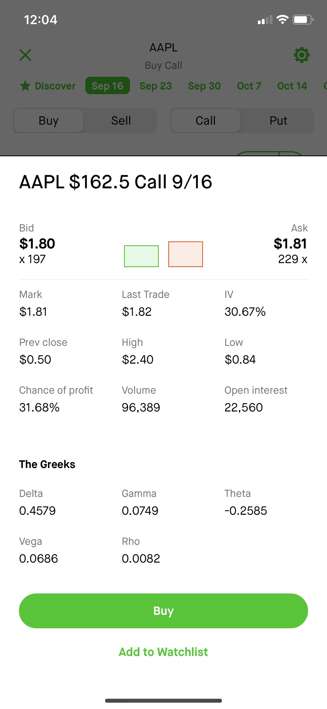
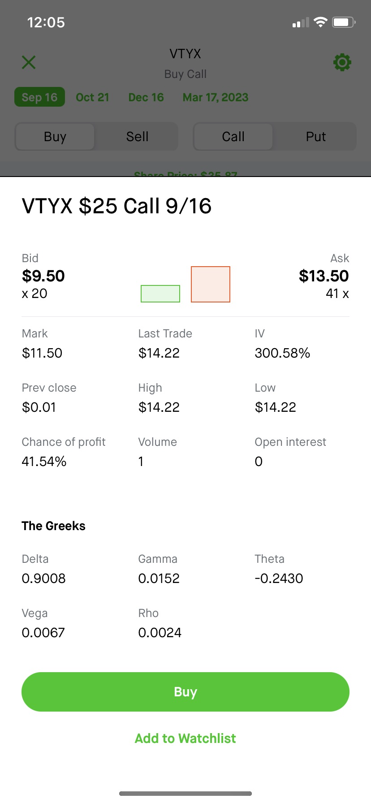
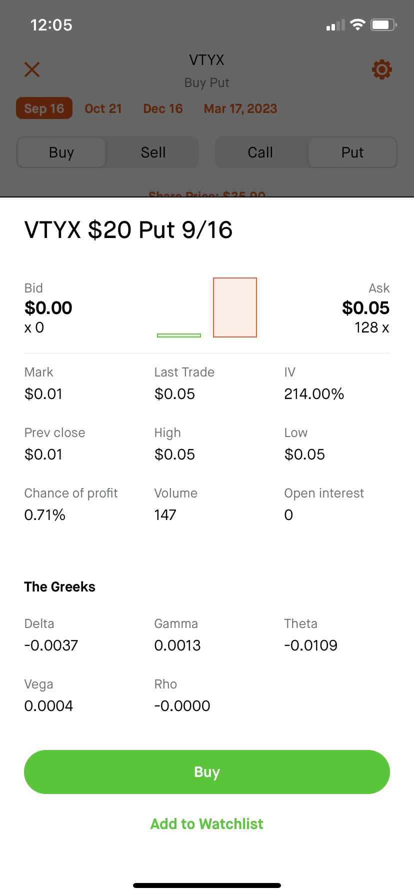
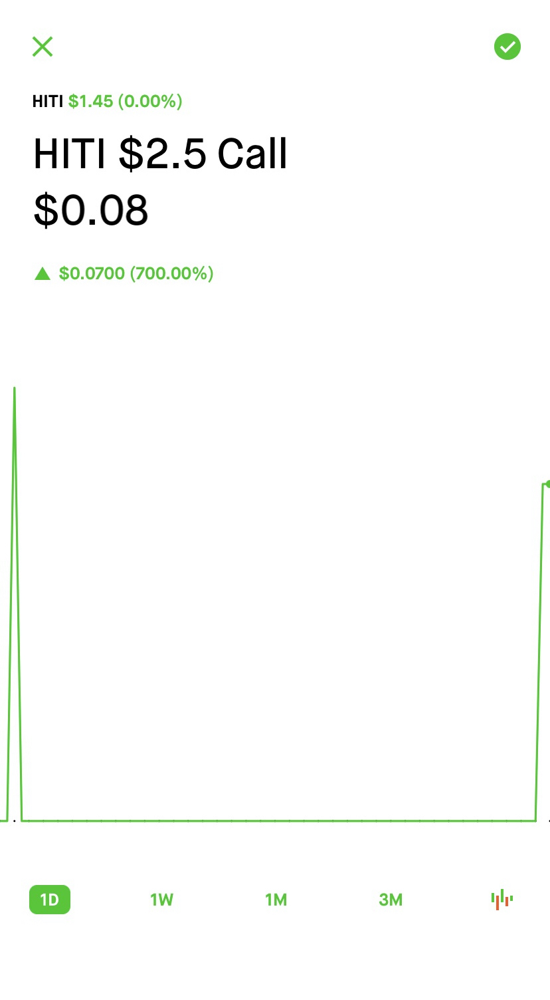
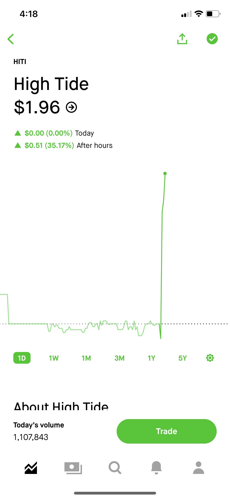
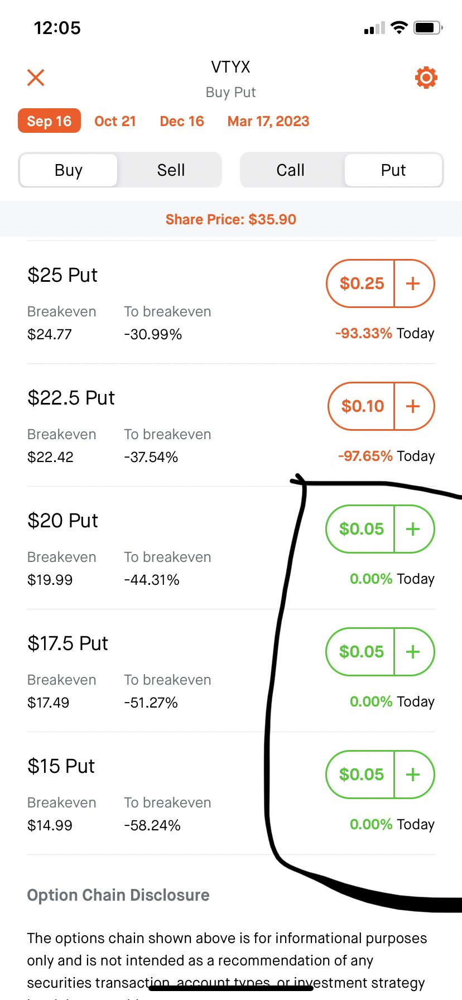
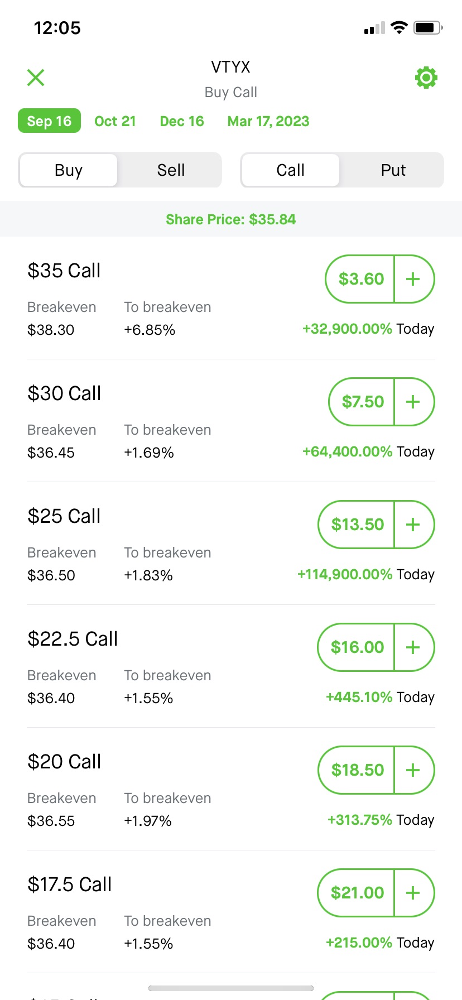

# 教程1

## basic1

Types of investing@everyone 

💰Day Trade Definition 💰

Buying and selling a stock within the same day

🏌️‍♂️Swing Trading Definition 🏌️‍♂️

When you buy a stock, and you sell within a couple of days

📈 Longterm Investing Definition 📈

When you buy a stock and don’t sell for years

投资类型@everyone 

 💰 日间交易定义 💰 

在同一天内买卖股票

 🏌️‍♂️ 波段交易定义 🏌️‍♂️ 

当你买入股票并在几天内卖出时

 📈 长期投资定义 📈 

当你买了一只股票并且多年不卖时.

Beginner Terms @everyone 

Options Trading: 

CALLS: you think a stock is going to go up📈

PUTS: you believe a stock is going to go down📉 

Share Trading: 

Long: you think a stock is going to go up📈

Short: you believe a stock will go down 📉

初学者术语@everyone 

期权交易：

电话：您认为股票将会上涨 📈 

看跌：您相信股票会下跌 📉  

股票交易：

Long ：你认为股票会上涨 📈 

空头：你相信股票会下跌 📉 

Stop Loss @everyone 

For share trading, I usually have a 7% stop. Make sure to have a stop loss below a critical level. For example. If you buy a stock at $1.07 and a 7% stop would be $1, but $1 is a crucial level of support, so you put your stop loss at $0.999

For options trading, you need to size down a lot. An option stop loss should be 30%. Don’t be surprised if your option goes to 0.

Trailing Stop loss

For share trading, If you’re up 7% make sure to either take some profits or have a stop loss at breakeven

止损@everyone 

对于股票交易，我通常设置 7 % 的止损。确保将止损设置在临界水平以下。例如。如果您以1 .07美元买入股票，7 % 的止损价为1 美元，但1 美元是一个关键的支撑位，因此您将止损设置为0 .999美元。

对于期权交易，你需要缩小很多规模。期权止损应该是30 % 。如果您的选项变为0 ，请不要感到惊讶。

追踪止损

对于股票交易，如果您上涨 7 %，请确保要么获利了结，要么在盈亏平衡点设置止损

## option-greeks

There are 5 options Greeks. Delta, gamma, theta, vega, and rho. These Greeks can help you calculate how much you’ll make if the underlying asset moves to a specific price @everyone

希腊人有5个选项。 Delta 、gamma 、theta 、vega和 rho 。这些希腊人可以帮助您计算如果基础资产移动到特定价格@everyone您将赚多少钱.

Delta @everyone  Deltas domain is price. It identifies how much the options premium may change if the underlying price changes by $1. For example, if an option contract costs $2, the delta is $1, and the underlying stock moves $5, the option will increase by $5, a 150% return. Delta could also predict the probability of it being in the money. If the delta is $0.1, there’s a 10% chance of the option expiring in the money

达美航空@大家  

Delta的域名是price 。它确定了如果标的价格变化1美元，期权溢价可能会发生多少变化。例如，如果一份期权合约的成本为2 美元，Delta 为1 美元，而标的股票变动5 美元，则期权将上涨5 美元，即 150 % 的回报。达美航空还可以预测其实现盈利的概率。如果 delta 为$ 0 .1 ，则期权有 10 % 的机会在价内到期

Gamma @everyone 

 Gamma measures deltas rate of change. If an option has a delta of $0.4 and a gamma of 0.05, the premium we expect to change to $0.40, with the first dollar move in the underlying. Then to figure out the impact of the next dollar move, add delta and gamma together to find the new delta, which would be $0.45 in this example

伽玛@everyone  

Gamma 测量 Delta 的变化率。如果期权的 Delta 为0.4美元，Gamma 为0.05 ，则当标的资产价格首次变动时，我们预计溢价将变为0.40美元。然后，为了计算下一次美元变动的影响，将 delta 和 gamma 加在一起以找到新的 delta ，在本例中为0 .45美元。

Vega @everyone  

Vega, whose domain is implied volatility. Vega estimates how much the premium may change with each one percentage point change in implied volatility. If an option has a Vega of $0.02 and implied volatility decreases one percentage point, the premium will be expected to drop by $0.02. The most common spike of implied volatility is earnings

维加@everyone  

Vega ，其域是隐含波动率。 Vega 估计隐含波动率每变化一个百分点，溢价可能会发生多少变化。如果期权的 Vega 为0.02美元并且隐含波动率下降 1 个百分点，则溢价预计将下降0美元。 0 2 .隐含波动率最常见的峰值是收益

Rho @everyone  

Rho identifies how much an option premium may move if interest rates change. Because rates change slowly, they have a very little impact on options trading

罗@everyone  

Rho 确定了利率变化时期权溢价可能变动的幅度。由于利率变化缓慢，因此对期权交易的影响很小

## option-levlel-2

Options level 2 and volume is very important @everyone

选项级别 2 和交易量非常重要@everyone

This is level 2 for options on Robinhood. You can see the bid is $1.80, and the ask is $1.81, a $0.01 spread, which is excellent. If you were going to buy at $1.81 remember that’s it’s actually $181 for 1 contract. You can see 197 on the bid which is equivalent to $35,460 because $180 times 197 is $35,460. You can see that the volume is close to 100k which is perfect. @everyone

这是 Robinhood 上选项的 2 级。您可以看到买价为1 .80美元，卖价为1 .81美元，价差为0 .01美元，非常好。如果您打算以1 .81美元的价格买入，请记住， 1 份合约的实际价格为 181 美元。您可以在出价上看到 197，相当于$35,460 ，因为$180 乘以 197 等于$35 , 4 6 0 。可以看到音量接近100k，已经很完美了。 @每个人

This is an example of a terrible options contract. The spreads are way too big, a $4 spread. The volume is awful (1). If this is the best option contract for this stock, I will buy shares instead. Do not enter these contracts unless you’re 100% confident that the stock will gap up a lot. @everyone

这是一个糟糕的期权合约的例子。点差太大了， 4 美元的点差。音量太糟糕了(1 ) 。如果这是该股票的最佳期权合约，我将购买股票。除非您 100 % 确信该股票会大幅上涨，否则不要签订这些合约。 @每个人

Here’s another example of a terrible option contract that will make you lose everything. We can see that the bid is $0, and the ask is $0.05. 99% of the time, these options contracts will close at $0. You will lose everything. It had a $2.5 call, and $Hiti went up to $1.96, a 35% gain, but the contract went to $0 because $Hiti had to close at $2.50 to break even. @everyone (已编辑)

这是另一个可怕的期权合约的例子，它会让你失去一切。我们可以看到买价是$0 ，卖价是$ 0 。 0 5 。 99 % 的情况下，这些期权合约的收盘价为0美元。你将失去一切。它有一个2 .5美元的看涨期权， $Hiti 上涨至1 .96美元，涨幅为 35% ，但合约价格为0 美元，因为$Hiti 必须收于2 .50美元才能实现盈亏平衡。 @每个人(已编辑)

Let’s say you want to yolo. You can see that a $15 put costs the same as a $20 put. Please buy a $20 put instead of a $15 put; you’ll make 10x more. You can also see that the breakeven price is -44%, which means the underlying stock has to drop 44% to break even. If I ever alert to short these stocks, click short on tradezero instead of a put. @everyone (已编辑)

假设您想要 yolo 。您可以看到15 美元的看跌期权的成本与20 美元的看跌期权的成本相同。请购买20 美元的看跌期权，而不是15 美元的看跌期权；你的收入将增加 10 倍。您还可以看到，盈亏平衡价格为-44 % ，这意味着标的股票必须下跌 44 % 才能实现盈亏平衡。如果我提醒要卖空这些股票，请点击 tradezero 做空而不是看跌期权。 @每个人(已编辑)

In this example, you can see that the $25 $Vtyx call went up 114,900%, which is very misleading. It didn’t go up that much. 90% of the time, you can’t get filled below $0.05. This means you would’ve made 26,000%, but that’s only if you got filled at $13.5. Since the volume is so low, you probably could only get out at $9.50 for an 18,900% gain. @everyone (已编辑)

在此示例中，您可以看到$25 $Vtyx 调用上涨了 114,900 % ，这是非常具有误导性的。没涨那么多。 90 % 的情况下，您无法以低于0美元的价格获得满足。 0 5 。这意味着您将赚到 26,000 % ，但前提是您的价格为1 3美元。 5 .由于交易量如此之低，您可能只能以9.50美元的价格卖出，获得 18,900 %的收益。 @每个人(已编辑)

Remember, only get in an option contract if the spreads are lower than 10%, has excellent volume, and it doesn’t have a bid at $0. If the option contract does not have these three things, I would choose a better contract or buy/short shares. @everyone (已编辑)

请记住，只有在价差低于 10 % 、交易量大且没有0美元的出价时才签订期权合约。如果期权合约没有这三件事，我会选择更好的合约或买入/做空股票。

