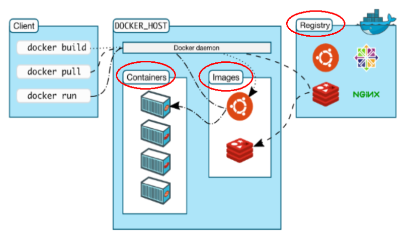
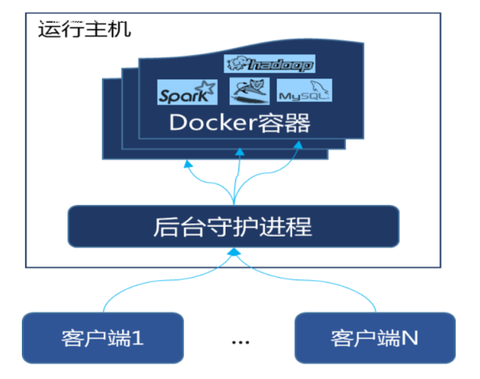
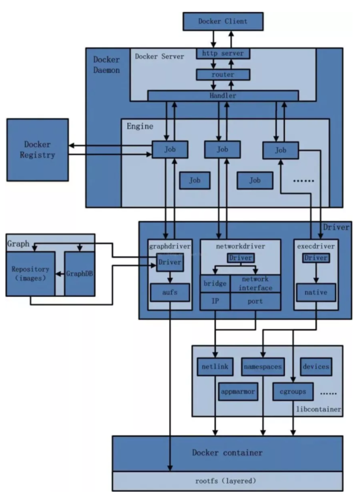
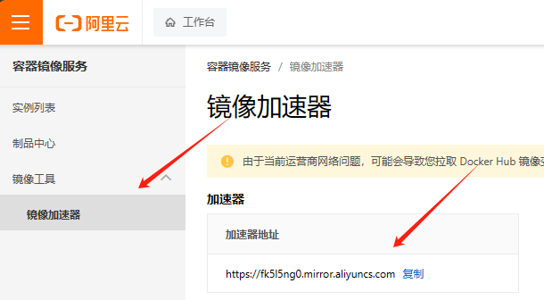
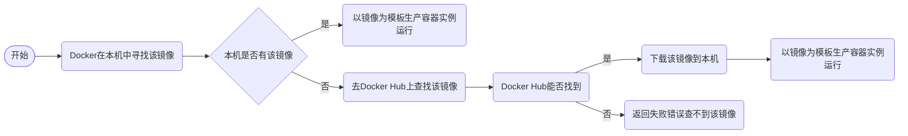
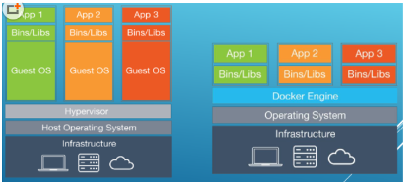

# Docker安装

## 1 前提说明

**CentOS Docker 安装**

Docker并非是一个通用的容器工具，它依赖于已存在并运行的Linux内核环境。

Docker实质上是在已经运行的Linux下制造了一个隔离的文件环境，因此它执行的效率几乎等同于所部署的Linux主机。因此，Docker 必须部署在Linux内核的系统上。如果其他系统想部署Docker 就必须安装一个虚拟Linux环境。

在Windows上部署Docker的方法都是先安装一个虚拟机，并在安装Linux系统的的虚拟机中运行Docker。

**前提条件**

目前，CentOS 仅发行版本中的内核支持 Docker。Docker 运行在CentOS 7 (64-bit)上，要求系统为64位、Linux系统内核版本为 3.8以上，这里选用Centos7.x 

**查看自己的内核**

uname命令用于打印当前系统相关信息（内核版本号、硬件架构、主机名称和操作系统类型等）。

```sh
[root@192 ~]# cat /etc/redhat-release
CentOS Linux release 7.9.2009 (Core)
[root@192 ~]# uname -r
3.10.0-1160.el7.x86_64
```

## 2 Docker的基本组成

### 2.1 镜像(image)

Docker 镜像（Image）就是一个**只读**的模板。镜像可以用来创建 Docker 容器，**一个镜像可以创建很多容器。**

它也相当于是一个root文件系统。比如官方镜像 centos:7 就包含了完整的一套 centos:7 最小系统的 root 文件系统。

相当于容器的“源代码”，**docker镜像文件类似于Java的类模板，而docker容器实例类似于java中new出来的实例对象。**

| Docker | 面向对象 |
| ------ | -------- |
| 容器   | 对象     |
| 镜像   | 类       |

### 2.2 容器(container)

**从面向对象角度**

Docker 利用容器（Container）独立运行的一个或一组应用，应用程序或服务运行在容器里面，容器就类似于一个虚拟化的运行环境，**容器是用镜像创建的运行实例**。就像是Java中的类和实例对象一样，镜像是静态的定义，容器是镜像运行时的实体。容器为镜像提供了一个标准的和隔离的运行环境，它可以被启动、开始、停止、删除。每个容器都是相互隔离的、保证安全的平台

**从镜像容器角度**

**可以把容器看做是一个简易版的 Linux 环境（**包括root用户权限、进程空间、用户空间和网络空间等）和运行在其中的应用程序。

### 2.3 仓库(repository)

仓库（Repository）是**集中存放镜像文件**的场所。

类似于

Maven仓库，存放各种jar包的地方；

github仓库，存放各种git项目的地方；

Docker公司提供的官方registry被称为Docker Hub，存放各种镜像模板的地方。


仓库分为公开仓库（Public）和私有仓库（Private）两种形式。

**最大的公开仓库是 Docker Hub(https://hub.docker.com/)，**

存放了数量庞大的镜像供用户下载。国内的公开仓库包括阿里云 、网易云等

### 2.4 总结

**需要正确的理解仓库/镜像/容器这几个概念:**

Docker 本身是一个容器运行载体或称之为管理引擎。我们把应用程序和配置依赖打包好形成一个可交付的运行环境，这个打包好的运行环境就是image镜像文件。只有通过这个镜像文件才能生成Docker容器实例(类似Java中new出来一个对象)。

image文件可以看作是容器的模板。Docker 根据 image 文件生成容器的实例。同一个 image 文件，可以生成多个同时运行的容器实例。

**镜像文件**：image 文件生成的容器实例，本身也是一个文件，称为镜像文件。

**容器实例**：一个容器运行一种服务，当我们需要的时候，就可以通过docker客户端创建一个对应的运行实例，也就是我们的容器

**仓库**：就是放一堆镜像的地方，我们可以把镜像发布到仓库中，需要的时候再从仓库中拉下来就可以了。

### 2.5 Docker平台架构（入门）



**工作原理：**

Docker是一个Client-Server结构的系统，Docker守护进程运行在主机上， 然后通过Socket连接从客户端访问，守护进程从客户端接受命令并管理运行在主机上的容器。 **容器，是一个运行时环境，就是我们前面说到的集装箱。可以对比mysql演示对比讲解**



## 3 Docker平台架构（架构版）

首次懵逼正常，后续深入，先有大概轮廓，混个眼熟

**整体架构及底层通信原理简述**

Docker 是一个 C/S 模式的架构，后端是一个松耦合架构，众多模块各司其职。 



Docker 运行的基本流程为:

1. 用户是使用 Docker Client与 Docker Daemon 建立通信，并发送请求给后者。
2. Docker Daemon 作为 Docker 架构中的主体部分，首先提供 Docker Server 的功能使其可以接受 Docker Cient 的请求。
3. Docker Engine 执行 Docker 内部的一系列工作，每一项工作都是以一个 Job 的形式的存在。
4. Job 的运行过程中，当需要容器像时，则从 Docker Redisty 中下载镜像，并通过镜像管理驱动 Graph driver将下载镜像以Graph的形式存储。
5. 当需要为 Docker创建网络环境时，通过网络管理驱动 Network driver 创建并配置 Docker容器网络环境。
6. 当需要限制 Docker容器运行资源或执行用户指令等操作时，则通过 Exec driver 来完成。
7. Libcontainer是一项独立的容器管理包，Network driver以及Exec driver都是通过Libcontainer来实现具体对容器进行的操作。

## 4 安装步骤

**CentOS7安装Docker**：https://docs.docker.com/engine/install/centos/

### 4.1 确定你是CentOS7及以上版本 

```sh
[root@192 ~]# cat /etc/redhat-release
CentOS Linux release 7.9.2009 (Core)
```

### 4.2 卸载旧版本

**Uninstall old versions**

Older versions of Docker went by `docker` or `docker-engine`. Uninstall any such older versions before attempting to install a new version, along with associated dependencies.

```sh
$ sudo yum remove docker \
                  docker-client \
                  docker-client-latest \
                  docker-common \
                  docker-latest \
                  docker-latest-logrotate \
                  docker-logrotate \
                  docker-engine
```

`yum` might report that you have none of these packages installed.

Images, containers, volumes, and networks stored in `/var/lib/docker/` aren't automatically removed when you uninstall Docker.

### 4.3 yum安装gcc相关

确保CentOS7能上外网

```sh
yum -y install gcc
yum -y install gcc-c++

[root@192 ~]# yum -y install gcc
已加载插件：fastestmirror, langpacks
Determining fastest mirrors
 * base: mirrors.163.com
 * extras: mirrors.163.com
 * updates: mirrors.163.com
base                                                                                                            | 3.6 kB  00:00:00
extras                                                                                                          | 2.9 kB  00:00:00
updates                                                                                                         | 2.9 kB  00:00:00
updates/7/x86_64/primary_db                                                                                     |  24 MB  00:00:15
软件包 gcc-4.8.5-44.el7.x86_64 已安装并且是最新版本
无须任何处理
[root@192 ~]# yum -y install gcc-c++
已加载插件：fastestmirror, langpacks
Loading mirror speeds from cached hostfile
 * base: mirrors.163.com
 * extras: mirrors.163.com
 * updates: mirrors.163.com
正在解决依赖关系
--> 正在检查事务
---> 软件包 gcc-c++.x86_64.0.4.8.5-44.el7 将被 安装
--> 正在处理依赖关系 libstdc++-devel = 4.8.5-44.el7，它被软件包 gcc-c++-4.8.5-44.el7.x86_64 需要
--> 正在检查事务
---> 软件包 libstdc++-devel.x86_64.0.4.8.5-44.el7 将被 安装
--> 解决依赖关系完成

依赖关系解决

=======================================================================================================================================
 Package                              架构                        版本                                 源                         大小
=======================================================================================================================================
正在安装:
 gcc-c++                              x86_64                      4.8.5-44.el7                         base                      7.2 M
为依赖而安装:
 libstdc++-devel                      x86_64                      4.8.5-44.el7                         base                      1.5 M

事务概要
=======================================================================================================================================
安装  1 软件包 (+1 依赖软件包)

总下载量：8.7 M
安装大小：25 M
Downloading packages:
(1/2): libstdc++-devel-4.8.5-44.el7.x86_64.rpm                                                                  | 1.5 MB  00:00:03
(2/2): gcc-c++-4.8.5-44.el7.x86_64.rpm                                                                          | 7.2 MB  00:00:06
---------------------------------------------------------------------------------------------------------------------------------------
总计                                                                                                   1.4 MB/s | 8.7 MB  00:00:06
Running transaction check
Running transaction test
Transaction test succeeded
Running transaction
  正在安装    : libstdc++-devel-4.8.5-44.el7.x86_64                                                                                1/2
  正在安装    : gcc-c++-4.8.5-44.el7.x86_64                                                                                        2/2
  验证中      : gcc-c++-4.8.5-44.el7.x86_64                                                                                        1/2
  验证中      : libstdc++-devel-4.8.5-44.el7.x86_64                                                                                2/2

已安装:
  gcc-c++.x86_64 0:4.8.5-44.el7

作为依赖被安装:
  libstdc++-devel.x86_64 0:4.8.5-44.el7

完毕！
```

### 4.4 安装需要的软件包

**官网要求：**

You can install Docker Engine in different ways, depending on your needs:

- You can [set up Docker's repositories](https://docs.docker.com/engine/install/centos/#install-using-the-repository) and install from them, for ease of installation and upgrade tasks. This is the recommended approach.
- You can download the RPM package, [install it manually](https://docs.docker.com/engine/install/centos/#install-from-a-package), and manage upgrades completely manually. This is useful in situations such as installing Docker on air-gapped systems with no access to the internet.
- In testing and development environments, you can use automated [convenience scripts](https://docs.docker.com/engine/install/centos/#install-using-the-convenience-script) to install Docker.

**Install using the rpm repository**

Before you install Docker Engine for the first time on a new host machine, you need to set up the Docker repository. Afterward, you can install and update Docker from the repository.

**Set up the repository**

Install the `yum-utils` package (which provides the `yum-config-manager` utility) and set up the repository.

```sh
$ sudo yum install -y yum-utils
$ sudo yum-config-manager --add-repo https://download.docker.com/linux/centos/docker-ce.repo
```

执行命令

```sh
yum install -y yum-utils

[root@192 ~]# yum install -y yum-utils
已加载插件：fastestmirror, langpacks
Loading mirror speeds from cached hostfile
 * base: mirrors.163.com
 * extras: mirrors.163.com
 * updates: mirrors.163.com
软件包 yum-utils-1.1.31-54.el7_8.noarch 已安装并且是最新版本
无须任何处理
```

### 4.5 设置stable镜像仓库

**大坑**

```
yum-config-manager --add-repo https://download.docker.com/linux/centos/docker-ce.repo
```

报错：

- [Errno 14] curl#35 - TCP connection reset by peer
- [Errno 12] curl#35 - Timeout

**推荐**

```sh
yum-config-manager --add-repo http://mirrors.aliyun.com/docker-ce/linux/centos/docker-ce.repo

[root@192 ~]# yum-config-manager --add-repo http://mirrors.aliyun.com/docker-ce/linux/centos/docker-ce.repo
已加载插件：fastestmirror, langpacks
adding repo from: http://mirrors.aliyun.com/docker-ce/linux/centos/docker-ce.repo
grabbing file http://mirrors.aliyun.com/docker-ce/linux/centos/docker-ce.repo to /etc/yum.repos.d/docker-ce.repo
repo saved to /etc/yum.repos.d/docker-ce.repo
```

### 4.6 更新yum软件包索引

```sh
yum makecache fast

[root@192 ~]# yum makecache fast
已加载插件：fastestmirror, langpacks
Loading mirror speeds from cached hostfile
 * base: mirrors.163.com
 * extras: mirrors.163.com
 * updates: mirrors.163.com
base                                                                                                            | 3.6 kB  00:00:00
docker-ce-stable                                                                                                | 3.5 kB  00:00:00
extras                                                                                                          | 2.9 kB  00:00:00
updates                                                                                                         | 2.9 kB  00:00:00
(1/2): docker-ce-stable/7/x86_64/updateinfo                                                                     |   55 B  00:00:02
(2/2): docker-ce-stable/7/x86_64/primary_db                                                                     | 118 kB  00:00:02
元数据缓存已建立
```

### 4.7 安装DOCKER CE

```
yum -y install docker-ce docker-ce-cli containerd.io
```

**官网要求：**

**Install Docker Engine**

1. Install Docker Engine, containerd, and Docker Compose:

   Latest Specific version

   ------

   To install the latest version, run:

   ```console
   $ sudo yum install docker-ce docker-ce-cli containerd.io docker-buildx-plugin docker-compose-plugin
   ```

**执行结果：**

```sh
[root@192 ~]# yum -y install docker-ce docker-ce-cli containerd.io
已加载插件：fastestmirror, langpacks
Loading mirror speeds from cached hostfile
 * base: mirrors.163.com
 * extras: mirrors.163.com
 * updates: mirrors.163.com
正在解决依赖关系
--> 正在检查事务
---> 软件包 containerd.io.x86_64.0.1.6.25-3.1.el7 将被 安装
--> 正在处理依赖关系 container-selinux >= 2:2.74，它被软件包 containerd.io-1.6.25-3.1.el7.x86_64 需要
---> 软件包 docker-ce.x86_64.3.24.0.7-1.el7 将被 安装
--> 正在处理依赖关系 docker-ce-rootless-extras，它被软件包 3:docker-ce-24.0.7-1.el7.x86_64 需要
---> 软件包 docker-ce-cli.x86_64.1.24.0.7-1.el7 将被 安装
--> 正在处理依赖关系 docker-buildx-plugin，它被软件包 1:docker-ce-cli-24.0.7-1.el7.x86_64 需要
--> 正在处理依赖关系 docker-compose-plugin，它被软件包 1:docker-ce-cli-24.0.7-1.el7.x86_64 需要
--> 正在检查事务
---> 软件包 container-selinux.noarch.2.2.119.2-1.911c772.el7_8 将被 安装
---> 软件包 docker-buildx-plugin.x86_64.0.0.11.2-1.el7 将被 安装
---> 软件包 docker-ce-rootless-extras.x86_64.0.24.0.7-1.el7 将被 安装
--> 正在处理依赖关系 fuse-overlayfs >= 0.7，它被软件包 docker-ce-rootless-extras-24.0.7-1.el7.x86_64 需要
--> 正在处理依赖关系 slirp4netns >= 0.4，它被软件包 docker-ce-rootless-extras-24.0.7-1.el7.x86_64 需要
---> 软件包 docker-compose-plugin.x86_64.0.2.21.0-1.el7 将被 安装
--> 正在检查事务
---> 软件包 fuse-overlayfs.x86_64.0.0.7.2-6.el7_8 将被 安装
--> 正在处理依赖关系 libfuse3.so.3(FUSE_3.2)(64bit)，它被软件包 fuse-overlayfs-0.7.2-6.el7_8.x86_64 需要
--> 正在处理依赖关系 libfuse3.so.3(FUSE_3.0)(64bit)，它被软件包 fuse-overlayfs-0.7.2-6.el7_8.x86_64 需要
--> 正在处理依赖关系 libfuse3.so.3()(64bit)，它被软件包 fuse-overlayfs-0.7.2-6.el7_8.x86_64 需要
---> 软件包 slirp4netns.x86_64.0.0.4.3-4.el7_8 将被 安装
--> 正在检查事务
---> 软件包 fuse3-libs.x86_64.0.3.6.1-4.el7 将被 安装
--> 解决依赖关系完成

依赖关系解决

=======================================================================================================================================
 Package                                架构                版本                                   源                             大小
=======================================================================================================================================
正在安装:
 containerd.io                          x86_64              1.6.25-3.1.el7                         docker-ce-stable               34 M
 docker-ce                              x86_64              3:24.0.7-1.el7                         docker-ce-stable               24 M
 docker-ce-cli                          x86_64              1:24.0.7-1.el7                         docker-ce-stable               13 M
为依赖而安装:
 container-selinux                      noarch              2:2.119.2-1.911c772.el7_8              extras                         40 k
 docker-buildx-plugin                   x86_64              0.11.2-1.el7                           docker-ce-stable               13 M
 docker-ce-rootless-extras              x86_64              24.0.7-1.el7                           docker-ce-stable              9.1 M
 docker-compose-plugin                  x86_64              2.21.0-1.el7                           docker-ce-stable               13 M
 fuse-overlayfs                         x86_64              0.7.2-6.el7_8                          extras                         54 k
 fuse3-libs                             x86_64              3.6.1-4.el7                            extras                         82 k
 slirp4netns                            x86_64              0.4.3-4.el7_8                          extras                         81 k

事务概要
=======================================================================================================================================
安装  3 软件包 (+7 依赖软件包)

总下载量：107 M
安装大小：378 M
Downloading packages:
(1/10): container-selinux-2.119.2-1.911c772.el7_8.noarch.rpm                                                    |  40 kB  00:00:01
warning: /var/cache/yum/x86_64/7/docker-ce-stable/packages/docker-buildx-plugin-0.11.2-1.el7.x86_64.rpm: Header V4 RSA/SHA512 Signature, key ID 621e9f35: NOKEY
docker-buildx-plugin-0.11.2-1.el7.x86_64.rpm 的公钥尚未安装
(2/10): docker-buildx-plugin-0.11.2-1.el7.x86_64.rpm                                                            |  13 MB  00:00:40
(3/10): containerd.io-1.6.25-3.1.el7.x86_64.rpm                                                                 |  34 MB  00:01:28
(4/10): docker-ce-24.0.7-1.el7.x86_64.rpm                                                                       |  24 MB  00:00:54
(5/10): docker-ce-rootless-extras-24.0.7-1.el7.x86_64.rpm                                                       | 9.1 MB  00:00:19
(6/10): slirp4netns-0.4.3-4.el7_8.x86_64.rpm                                                                    |  81 kB  00:00:00
(7/10): docker-ce-cli-24.0.7-1.el7.x86_64.rpm                                                                   |  13 MB  00:00:26
(8/10): fuse3-libs-3.6.1-4.el7.x86_64.rpm                                                                       |  82 kB  00:00:01
(9/10): docker-compose-plugin-2.21.0-1.el7.x86_64.rpm                                                           |  13 MB  00:00:18
(10/10): fuse-overlayfs-0.7.2-6.el7_8.x86_64.rpm                                                                |  54 kB  00:00:27
---------------------------------------------------------------------------------------------------------------------------------------
总计                                                                                                   774 kB/s | 107 MB  00:02:21
从 https://mirrors.aliyun.com/docker-ce/linux/centos/gpg 检索密钥
导入 GPG key 0x621E9F35:
 用户ID     : "Docker Release (CE rpm) <docker@docker.com>"
 指纹       : 060a 61c5 1b55 8a7f 742b 77aa c52f eb6b 621e 9f35
 来自       : https://mirrors.aliyun.com/docker-ce/linux/centos/gpg
Running transaction check
Running transaction test
Transaction test succeeded
Running transaction
  正在安装    : 2:container-selinux-2.119.2-1.911c772.el7_8.noarch                                                                1/10
  正在安装    : containerd.io-1.6.25-3.1.el7.x86_64                                                                               2/10
  正在安装    : docker-buildx-plugin-0.11.2-1.el7.x86_64                                                                          3/10
  正在安装    : fuse3-libs-3.6.1-4.el7.x86_64                                                                                     4/10
  正在安装    : fuse-overlayfs-0.7.2-6.el7_8.x86_64                                                                               5/10
  正在安装    : slirp4netns-0.4.3-4.el7_8.x86_64                                                                                  6/10
  正在安装    : docker-compose-plugin-2.21.0-1.el7.x86_64                                                                         7/10
  正在安装    : 1:docker-ce-cli-24.0.7-1.el7.x86_64                                                                               8/10
  正在安装    : docker-ce-rootless-extras-24.0.7-1.el7.x86_64                                                                     9/10
  正在安装    : 3:docker-ce-24.0.7-1.el7.x86_64                                                                                  10/10
  验证中      : containerd.io-1.6.25-3.1.el7.x86_64                                                                               1/10
  验证中      : 3:docker-ce-24.0.7-1.el7.x86_64                                                                                   2/10
  验证中      : docker-ce-rootless-extras-24.0.7-1.el7.x86_64                                                                     3/10
  验证中      : docker-compose-plugin-2.21.0-1.el7.x86_64                                                                         4/10
  验证中      : slirp4netns-0.4.3-4.el7_8.x86_64                                                                                  5/10
  验证中      : 2:container-selinux-2.119.2-1.911c772.el7_8.noarch                                                                6/10
  验证中      : 1:docker-ce-cli-24.0.7-1.el7.x86_64                                                                               7/10
  验证中      : fuse3-libs-3.6.1-4.el7.x86_64                                                                                     8/10
  验证中      : docker-buildx-plugin-0.11.2-1.el7.x86_64                                                                          9/10
  验证中      : fuse-overlayfs-0.7.2-6.el7_8.x86_64                                                                              10/10

已安装:
  containerd.io.x86_64 0:1.6.25-3.1.el7          docker-ce.x86_64 3:24.0.7-1.el7          docker-ce-cli.x86_64 1:24.0.7-1.el7

作为依赖被安装:
  container-selinux.noarch 2:2.119.2-1.911c772.el7_8                    docker-buildx-plugin.x86_64 0:0.11.2-1.el7
  docker-ce-rootless-extras.x86_64 0:24.0.7-1.el7                       docker-compose-plugin.x86_64 0:2.21.0-1.el7
  fuse-overlayfs.x86_64 0:0.7.2-6.el7_8                                 fuse3-libs.x86_64 0:3.6.1-4.el7
  slirp4netns.x86_64 0:0.4.3-4.el7_8

完毕！
```

### 4.8 启动docker

```sh
# 检查Docker是否已经安装并可用
docker version

# 启动docker服务
systemctl start docker

# 开机自动启动Docker服务
systemctl enable docker
```

### 4.9 测试

```sh
docker version

[root@192 ~]# docker version
Client: Docker Engine - Community
 Version:           24.0.7
 API version:       1.43
 Go version:        go1.20.10
 Git commit:        afdd53b
 Built:             Thu Oct 26 09:11:35 2023
 OS/Arch:           linux/amd64
 Context:           default

Server: Docker Engine - Community
 Engine:
  Version:          24.0.7
  API version:      1.43 (minimum version 1.12)
  Go version:       go1.20.10
  Git commit:       311b9ff
  Built:            Thu Oct 26 09:10:36 2023
  OS/Arch:          linux/amd64
  Experimental:     false
 containerd:
  Version:          1.6.25
  GitCommit:        d8f198a4ed8892c764191ef7b3b06d8a2eeb5c7f
 runc:
  Version:          1.1.10
  GitCommit:        v1.1.10-0-g18a0cb0
 docker-init:
  Version:          0.19.0
  GitCommit:        de40ad0

```

```sh
docker run hello-world

[root@192 ~]# docker run hello-world
Unable to find image 'hello-world:latest' locally
latest: Pulling from library/hello-world
719385e32844: Pull complete
Digest: sha256:c79d06dfdfd3d3eb04cafd0dc2bacab0992ebc243e083cabe208bac4dd7759e0
Status: Downloaded newer image for hello-world:latest

Hello from Docker!
This message shows that your installation appears to be working correctly.

To generate this message, Docker took the following steps:
 1. The Docker client contacted the Docker daemon.
 2. The Docker daemon pulled the "hello-world" image from the Docker Hub.
    (amd64)
 3. The Docker daemon created a new container from that image which runs the
    executable that produces the output you are currently reading.
 4. The Docker daemon streamed that output to the Docker client, which sent it
    to your terminal.

To try something more ambitious, you can run an Ubuntu container with:
 $ docker run -it ubuntu bash

Share images, automate workflows, and more with a free Docker ID:
 https://hub.docker.com/

For more examples and ideas, visit:
 https://docs.docker.com/get-started/


```

###  4.10 卸载

**Uninstall Docker Engine**

1. Uninstall the Docker Engine, CLI, containerd, and Docker Compose packages:

   ```console
   $ sudo yum remove docker-ce docker-ce-cli containerd.io docker-buildx-plugin docker-compose-plugin docker-ce-rootless-extras
   ```

2. Images, containers, volumes, or custom configuration files on your host aren't automatically removed. To delete all images, containers, and volumes:

   ```console
   $ sudo rm -rf /var/lib/docker
   $ sudo rm -rf /var/lib/containerd
   ```

You have to delete any edited configuration files manually.

```sh
systemctl stop docker 
yum remove docker-ce docker-ce-cli containerd.io
rm -rf /var/lib/docker
rm -rf /var/lib/containerd
```

## 5 阿里云镜像加速

官网：https://promotion.aliyun.com/ntms/act/kubernetes.html

1.登陆阿里云开发者平台

2.点击控制台

3.选择容器镜像服务


4.获取加速器地址



5.配置镜像加速器

针对Docker客户端版本大于 1.10.0 的用户

您可以通过修改daemon配置文件/etc/docker/daemon.json来使用加速器

```sh
sudo mkdir -p /etc/docker
sudo tee /etc/docker/daemon.json <<-'EOF'
{
  "registry-mirrors": ["https://fk5l5ng0.mirror.aliyuncs.com"]
}
EOF
sudo systemctl daemon-reload
sudo systemctl restart docker

[root@192 ~]# sudo mkdir -p /etc/docker
[root@192 ~]# sudo tee /etc/docker/daemon.json <<-'EOF'
> {
>   "registry-mirrors": ["https://fk5l5ng0.mirror.aliyuncs.com"]
> }
> EOF
{
  "registry-mirrors": ["https://fk5l5ng0.mirror.aliyuncs.com"]
}
[root@192 ~]# sudo systemctl daemon-reload
[root@192 ~]# sudo systemctl restart docker
```


## 6 HelloWorld

启动Docker后台容器(测试运行 hello-world)

```sh
docker run hello-world

[root@192 ~]# docker run hello-world
# 由于本地没有hello-world这个镜像，所以会下载一个hello-world的镜像，并在容器内运行。
Unable to find image 'hello-world:latest' locally
latest: Pulling from library/hello-world
719385e32844: Pull complete
Digest: sha256:c79d06dfdfd3d3eb04cafd0dc2bacab0992ebc243e083cabe208bac4dd7759e0
Status: Downloaded newer image for hello-world:latest

Hello from Docker!
This message shows that your installation appears to be working correctly.

To generate this message, Docker took the following steps:
 1. The Docker client contacted the Docker daemon.
 2. The Docker daemon pulled the "hello-world" image from the Docker Hub.
    (amd64)
 3. The Docker daemon created a new container from that image which runs the
    executable that produces the output you are currently reading.
 4. The Docker daemon streamed that output to the Docker client, which sent it
    to your terminal.

To try something more ambitious, you can run an Ubuntu container with:
 $ docker run -it ubuntu bash

Share images, automate workflows, and more with a free Docker ID:
 https://hub.docker.com/

For more examples and ideas, visit:
 https://docs.docker.com/get-started/


```

输出这段提示以后，hello world就会停止运行，容器自动终止。

docker run命令做了什么?



## 7 底层原理

为什么Docker会比VM虚拟机快

- docker有着比虚拟机更少的抽象层

由于docker不需要Hypervisor(虚拟机)实现硬件资源虚拟化，运行在docker容器上的程序直接使用的都是实际物理机的硬件资源。因此在CPU、内存利用率上docker将会在效率上有明显优势。

- docker利用的是宿主机的内核,而不需要加载操作系统OS内核


当新建一个容器时，docker不需要和虚拟机一样重新加载一个操作系统内核。进而避免引寻、加载操作系统内核返回等比较费时费资源的过程，当新建一个虚拟机时，虚拟机软件需要加载OS，返回新建过程是分钟级别的。而docker由于直接利用宿主机的操作系统，则省略了返回过程，因此新建一个docker容器只需要几秒钟。

虚拟机与Docker架构对比图：



|            | Docker容器              | 虚拟机(VM)                  |
| ---------- | ----------------------- | --------------------------- |
| 操作系统   | 与宿主机共享OS          | 宿主机OS上运行虚拟机OS      |
| 存储大小   | 镜像小，便于存储与传输  | 镜像庞大 (vmdk、vdi等)      |
| 运行性能   | 几乎无额外性能损失      | 操作系统额外的CPU、内存消耗 |
| 移植性     | 轻便、灵活，适应于Linux | 笨重，与虚拟化技术耦合度高  |
| 硬件亲和性 | 面向软件开发者          | 面向硬件运维者              |
| 部署速度   | 快速，秒级              | 较慢，10s以上               |