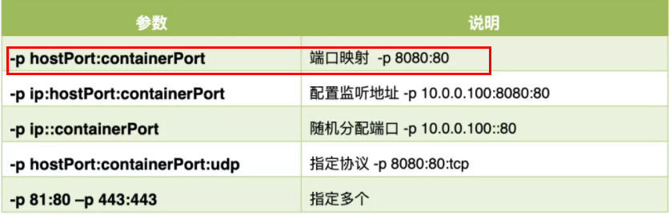
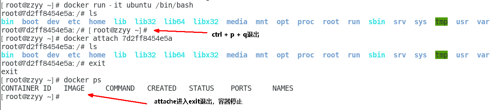
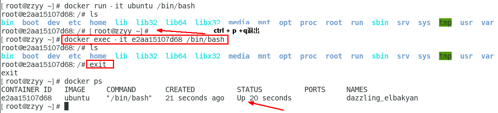

# Docker常用命令

## 1 帮助启动类命令

- 启动docker： `systemctl start docker`
- 停止docker： `systemctl stop docker`
- 重启docker： `systemctl restart docker`
- 查看docker状态： `systemctl status docker`
- 开机启动： `systemctl enable docker`
- 查看docker概要信息： `docker info`
- 查看docker总体帮助文档： `docker --help`
- 查看docker命令帮助文档：` docker 具体命令 --help`

## 2 镜像命令

### 2.1 列出本地镜像

命令：`docker images [OPTIONS]`

```sh
[root@192 ~]# docker images
REPOSITORY    TAG       IMAGE ID       CREATED        SIZE
hello-world   latest    9c7a54a9a43c   7 months ago   13.3kB
```

各个选项说明:

| 参数       | 说明             |
| ---------- | ---------------- |
| REPOSITORY | 表示镜像的仓库源 |
| TAG        | 镜像的标签版本号 |
| IMAGE ID   | 镜像ID           |
| CREATED    | 镜像创建时间     |
| SIZE       | 镜像大小         |

 同一仓库源可以有多个 TAG版本，代表这个仓库源的不同个版本，我们使用 REPOSITORY:TAG 来定义不同的镜像。

如果你不指定一个镜像的版本标签，例如你只使用 ubuntu，docker 将默认使用 ubuntu:latest 镜像

OPTIONS说明：

| 参数 | 说明                               |
| ---- | ---------------------------------- |
| -a   | 列出本地所有的镜像（含历史映像层） |
| -q   | 只显示镜像ID。                     |

### 2.2 搜索镜像

网站：https://hub.docker.com

命令：`docker search [OPTIONS] 镜像名字`

```sh
[root@192 ~]# docker search redis
NAME                                DESCRIPTION                                      STARS     OFFICIAL   AUTOMATED
redis                               Redis is an open source key-value store that…   12532     [OK]
redislabs/redisearch                Redis With the RedisSearch module pre-loaded…   61
redislabs/redisinsight              RedisInsight - The GUI for Redis                 94
redis/redis-stack-server            redis-stack-server installs a Redis server w…   62
redis/redis-stack                   redis-stack installs a Redis server with add…   85
redislabs/rebloom                   A probablistic datatypes module for Redis        25                   [OK]
redislabs/redis                     Clustered in-memory database engine compatib…   40
redislabs/rejson                    RedisJSON - Enhanced JSON data type processi…   53
redislabs/redisgraph                A graph database module for Redis                26                   [OK]
redislabs/redismod                  An automated build of redismod - latest Redi…   41                   [OK]
redislabs/redistimeseries           A time series database module for Redis          12
redislabs/operator                                                                   7
redislabs/operator-internal         This repository contains pre-released versio…   1
redislabs/redis-py                                                                   5
redislabs/redis-webcli              A tiny Flask app to provide access to Redis …   5                    [OK]
redislabs/redisgears                An automated build of RedisGears                 4
redislabs/k8s-controller-internal                                                    0
redislabs/k8s-controller                                                             2
redislabs/memtier_benchmark         Docker image to run memtier_benchmark            0
redislabs/ng-redis-raft             Redis with redis raft module                     0
redislabs/redisai                                                                    6
redislabs/olmtest                   Test artefact for OLM CSV                        1
bitnami/redis                       Bitnami Redis Docker Image                       271                  [OK]
redislabs/olm-bundle                                                                 0
redislabs/redisml                   A Redis module that implements several machi…   3                    [OK]
```

各个选项说明:

| 参数        | 说明           |
| ----------- | -------------- |
| NAME        | 镜像名称       |
| DESCRIPTION | 镜像说明       |
| STARS       | 点赞数量       |
| OFFICIAL    | 是否官方的     |
| AUTOMATED   | 是否自动构建的 |

OPTIONS说明：

| 参数    | 说明                    |
| ------- | ----------------------- |
| --limit | 只列出N个镜像，默认25个 |

```sh
[root@192 ~]# docker search --limit 5 redis
NAME                       DESCRIPTION                                      STARS     OFFICIAL   AUTOMATED
redis                      Redis is an open source key-value store that…   12532     [OK]
redislabs/redisearch       Redis With the RedisSearch module pre-loaded…   61
redislabs/redisinsight     RedisInsight - The GUI for Redis                 94
redis/redis-stack-server   redis-stack-server installs a Redis server w…   62
redis/redis-stack          redis-stack installs a Redis server with add…   85
```

### 2.3 下载镜像

命令：`docker pull 某个XXX镜像名字`

```sh
# 下载指定版本镜像
docker pull 镜像名字[:TAG]
# 没有TAG就是最新版
docker pull 镜像名字
# 等价于
docker pull 镜像名字:latest

docker pull ubuntu

[root@192 ~]# docker pull ubuntu
Using default tag: latest
latest: Pulling from library/ubuntu
7b1a6ab2e44d: Pull complete
Digest: sha256:626ffe58f6e7566e00254b638eb7e0f3b11d4da9675088f4781a50ae288f3322
Status: Downloaded newer image for ubuntu:latest
docker.io/library/ubuntu:latest
[root@192 ~]# docker images
REPOSITORY    TAG       IMAGE ID       CREATED        SIZE
hello-world   latest    9c7a54a9a43c   7 months ago   13.3kB
ubuntu        latest    ba6acccedd29   2 years ago    72.8MB
```

### 2.4 查看镜像/容器/数据卷所占的空间

命令：`docker system df `

```sh
# 查看镜像/容器/数据卷所占的空间
docker system df

[root@192 ~]# docker system df
TYPE            TOTAL     ACTIVE    SIZE      RECLAIMABLE
Images          2         1         72.79MB   72.78MB (99%)
Containers      2         0         0B        0B
Local Volumes   0         0         0B        0B
Build Cache     0         0         0B        0B
```

### 2.5 删除镜像

命令：`docker rmi 某个XXX镜像名字ID`

```sh
# 删除单个
docker rmi -f 镜像ID
# 删除多个
docker rmi -f 镜像名1:TAG 镜像名2:TAG 
# 删除全部
docker rmi -f $(docker images -qa)
```

### 2.6 虚悬镜像

定义：仓库名、标签都是`<none>`的镜像，俗称虚悬镜像dangling image

后续Dockerfile章节介绍

## 3 容器命令

### 3.1 先下载镜像

```sh
docker pull centos
docker pull ubuntu

[root@192 ~]# docker pull ubuntu
Using default tag: latest
latest: Pulling from library/ubuntu
7b1a6ab2e44d: Pull complete
Digest: sha256:626ffe58f6e7566e00254b638eb7e0f3b11d4da9675088f4781a50ae288f3322
Status: Downloaded newer image for ubuntu:latest
docker.io/library/ubuntu:latest
[root@192 ~]# docker pull centos
Using default tag: latest
latest: Pulling from library/centos
a1d0c7532777: Pull complete
Digest: sha256:a27fd8080b517143cbbbab9dfb7c8571c40d67d534bbdee55bd6c473f432b177
Status: Downloaded newer image for centos:latest
docker.io/library/centos:latest
[root@192 ~]# docker images
REPOSITORY    TAG       IMAGE ID       CREATED        SIZE
hello-world   latest    9c7a54a9a43c   7 months ago   13.3kB
ubuntu        latest    ba6acccedd29   2 years ago    72.8MB
centos        latest    5d0da3dc9764   2 years ago    231MB
```

### 3.2 新建并启动容器

```
docker run [OPTIONS] IMAGE [COMMAND] [ARG...]
```

**OPTIONS说明**：

有些是一个减号，有些是两个减号

| 参数   | 说明                                                   |
| ------ | ------------------------------------------------------ |
| --name | 为容器指定一个名称                                     |
| -d     | 后台运行容器并返回容器ID，也即启动守护式容器(后台运行) |
| -i     | 以交互模式运行容器，通常与 -t 同时使用                 |
| -t     | 为容器重新分配一个伪输入终端，通常与 -i 同时使用       |
| -P     | 随机端口映射，大写P                                    |
| -p     | 指定端口映射，小写p                                    |



启动交互式容器(前台命令行)

```sh
# 使用镜像centos:latest以交互模式启动一个容器,在容器内执行/bin/bash命令。
docker run -it centos /bin/bash 

[root@192 ~]# docker run -it centos /bin/bash
[root@d0fdd96c1acd /]# ps -ef
UID         PID   PPID  C STIME TTY          TIME CMD
root          1      0  0 07:59 pts/0    00:00:00 /bin/bash
root         15      1  0 08:00 pts/0    00:00:00 ps -ef
[root@d0fdd96c1acd /]# exit
exit
```

**参数说明：**

| 参数      | 说明                                                         |
| --------- | ------------------------------------------------------------ |
| -i        | 交互式操作。                                                 |
| -t        | 终端                                                         |
| centos    | centos 镜像。                                                |
| /bin/bash | 放在镜像名后的命令，这里我们希望有个交互式 Shell，因此用的是 /bin/bash |

要退出终端，直接输入 exit。

### 3.3 列出当前所有正在运行的容器

```
docker ps [OPTIONS]
```

OPTIONS说明（常用）：

-a ：列出当前所有正在运行的容器+**历史上运行过**的

-l ：显示最近创建的容器。

-n：显示最近n个创建的容器。

-q ：静默模式，只显示容器编号。

### 3.4 退出容器

两种退出方式：

```sh
# 方式一：run进入容器，exit退出，容器停止
exit
# 方式二：run进入容器，ctrl+p+q退出，容器不停止
ctrl+p+q
```

### 3.5 启动已停止运行的容器

```
docker start 容器ID或者容器名
```

### 3.6 重启容器

```sh
docker restart 容器ID或者容器名

# 创建容器的时候设置容器自动启动
docker run -d --restart=always --name 容器名
# 已有容器设置容器自动启动
docker update --restart=always 容器名（容器id）

--restart具体参数值详细信息：
no　　　　　　　   // 默认策略,容器退出时不重启容器；
on-failure　　   // 在容器非正常退出时（退出状态非0）才重新启动容器；
on-failure:3    // 在容器非正常退出时重启容器，最多重启3次；
always　　　　    // 无论退出状态是如何，都重启容器；
unless-stopped  // 在容器退出时总是重启容器，但是不考虑在 Docker 守护进程启动时就已经停止了的容器。
```

### 3.7 停止容器

```
docker stop 容器ID或者容器名
```

### 3.8 强制停止容器

```
docker kill 容器ID或容器名
```

### 3.9 删除已停止的容器

```sh
# 删除容器
docker rm 容器ID
# 一次性删除多个容器实例
docker rm -f $(docker ps -a -q)
docker ps -a -q | xargs docker rm
```

### 3.10 前后台启动

**启动守护式容器(后台服务器)**

在大部分的场景下，我们希望 docker 的服务是在后台运行的， 我们可以过 -d 指定容器的后台运行模式。

```sh
# 启动守护式容器
docker run -d 容器名
# 使用镜像centos:latest以后台模式启动一个容器
docker run -d centos

[root@192 ~]# docker run -d centos
1ab739ee91994e9f0b9b871abfea2317a299b2822351167a2162125c56755924
[root@192 ~]# docker ps
CONTAINER ID   IMAGE     COMMAND   CREATED   STATUS    PORTS     NAMES
[root@192 ~]# docker ps -a
CONTAINER ID   IMAGE         COMMAND       CREATED          STATUS                      PORTS     NAMES
1ab739ee9199   centos        "/bin/bash"   32 seconds ago   Exited (0) 31 seconds ago             busy_beaver
d0fdd96c1acd   centos        "/bin/bash"   27 minutes ago   Exited (0) 25 minutes ago             heuristic_euclid
8251c9623349   hello-world   "/hello"      3 hours ago      Exited (0) 3 hours ago                ecstatic_varahamihira
7c8de6523094   hello-world   "/hello"      4 hours ago      Exited (0) 4 hours ago                pedantic_thompson
```

**问题**：然后docker ps -a 进行查看, 会发现容器已经退出

很重要的要说明的一点: **Docker容器后台运行,就必须有一个前台进程。**

容器运行的命令如果不是那些**一直挂起的命令**（比如运行top，tail），就是会自动退出的。

这个是docker的机制问题，比如你的web容器，我们以nginx为例，正常情况下,我们配置启动服务只需要启动响应的service即可。例如service nginx start。但是，这样做nginx为后台进程模式运行，就导致docker前台没有运行的应用，这样的容器后台启动后，会立即自杀因为他觉得他没事可做了。所以，最佳的解决方案是将你要运行的程序以前台进程的形式运行，常见就是命令行模式，表示我还有交互操作，别中断。


**redis 前后台启动演示case**

先下载一个Redis6.0.8镜像

```sh
[root@192 ~]# docker pull redis:6.0.8
6.0.8: Pulling from library/redis
bb79b6b2107f: Pull complete
1ed3521a5dcb: Pull complete
5999b99cee8f: Pull complete
3f806f5245c9: Pull complete
f8a4497572b2: Pull complete
eafe3b6b8d06: Pull complete
Digest: sha256:21db12e5ab3cc343e9376d655e8eabbdbe5516801373e95a8a9e66010c5b8819
Status: Downloaded newer image for redis:6.0.8
docker.io/library/redis:6.0.8
```

前台交互式启动

```sh
docker run -it redis:6.0.8

[root@192 ~]# docker run -it redis:6.0.8
1:C 09 Dec 2023 08:30:24.742 # oO0OoO0OoO0Oo Redis is starting oO0OoO0OoO0Oo
1:C 09 Dec 2023 08:30:24.742 # Redis version=6.0.8, bits=64, commit=00000000, modified=0, pid=1, just started
1:C 09 Dec 2023 08:30:24.742 # Warning: no config file specified, using the default config. In order to specify a config file use redis-server /path/to/redis.conf
                _._
           _.-``__ ''-._
      _.-``    `.  `_.  ''-._           Redis 6.0.8 (00000000/0) 64 bit
  .-`` .-```.  ```\/    _.,_ ''-._
 (    '      ,       .-`  | `,    )     Running in standalone mode
 |`-._`-...-` __...-.``-._|'` _.-'|     Port: 6379
 |    `-._   `._    /     _.-'    |     PID: 1
  `-._    `-._  `-./  _.-'    _.-'
 |`-._`-._    `-.__.-'    _.-'_.-'|
 |    `-._`-._        _.-'_.-'    |           http://redis.io
  `-._    `-._`-.__.-'_.-'    _.-'
 |`-._`-._    `-.__.-'    _.-'_.-'|
 |    `-._`-._        _.-'_.-'    |
  `-._    `-._`-.__.-'_.-'    _.-'
      `-._    `-.__.-'    _.-'
          `-._        _.-'
              `-.__.-'

1:M 09 Dec 2023 08:30:24.743 # WARNING: The TCP backlog setting of 511 cannot be enforced because /proc/sys/net/core/somaxconn is set to the lower value of 128.
1:M 09 Dec 2023 08:30:24.743 # Server initialized
1:M 09 Dec 2023 08:30:24.743 # WARNING overcommit_memory is set to 0! Background save may fail under low memory condition. To fix this issue add 'vm.overcommit_memory = 1' to /etc/sysctl.conf and then reboot or run the command 'sysctl vm.overcommit_memory=1' for this to take effect.
1:M 09 Dec 2023 08:30:24.743 # WARNING you have Transparent Huge Pages (THP) support enabled in your kernel. This will create latency and memory usage issues with Redis. To fix this issue run the command 'echo madvise > /sys/kernel/mm/transparent_hugepage/enabled' as root, and add it to your /etc/rc.local in order to retain the setting after a reboot. Redis must be restarted after THP is disabled (set to 'madvise' or 'never').
1:M 09 Dec 2023 08:30:24.744 * Ready to accept connections
```

后台守护式启动

```sh
docker run -d redis:6.0.8

[root@192 ~]# docker run -d redis:6.0.8
d57d5938a2eeefb299b7d1a115a859f00cdba13286ebdb51cd61b4839d5351e3
```

### 3.11 查看容器日志

```sh
docker logs 容器ID

[root@192 ~]# docker logs d57d5938a2eeefb299b7d1a115a859f00cdba13286ebdb51cd61b4839d5351e3
1:C 09 Dec 2023 08:31:05.239 # oO0OoO0OoO0Oo Redis is starting oO0OoO0OoO0Oo
1:C 09 Dec 2023 08:31:05.239 # Redis version=6.0.8, bits=64, commit=00000000, modified=0, pid=1, just started
1:C 09 Dec 2023 08:31:05.239 # Warning: no config file specified, using the default config. In order to specify a config file use redis-server /path/to/redis.conf
1:M 09 Dec 2023 08:31:05.241 * Running mode=standalone, port=6379.
1:M 09 Dec 2023 08:31:05.241 # WARNING: The TCP backlog setting of 511 cannot be enforced because /proc/sys/net/core/somaxconn is set to the lower value of 128.
1:M 09 Dec 2023 08:31:05.241 # Server initialized
1:M 09 Dec 2023 08:31:05.241 # WARNING overcommit_memory is set to 0! Background save may fail under low memory condition. To fix this issue add 'vm.overcommit_memory = 1' to /etc/sysctl.conf and then reboot or run the command 'sysctl vm.overcommit_memory=1' for this to take effect.
1:M 09 Dec 2023 08:31:05.241 # WARNING you have Transparent Huge Pages (THP) support enabled in your kernel. This will create latency and memory usage issues with Redis. To fix this issue run the command 'echo madvise > /sys/kernel/mm/transparent_hugepage/enabled' as root, and add it to your /etc/rc.local in order to retain the setting after a reboot. Redis must be restarted after THP is disabled (set to 'madvise' or 'never').
1:M 09 Dec 2023 08:31:05.242 * Ready to accept connections

```

### 3.12 查看容器内运行的进程

```sh
docker top 容器ID

[root@192 ~]# docker top d57d5938a2ee
UID                 PID                 PPID                C                   STIME               TTY                 TIME                CMD
polkitd             128967              128948              0                   16:31               ?                   00:00:00            redis-server *:6379
```

### 3.13 查看容器内部细节

```sh
docker inspect 容器ID

[root@192 ~]# docker inspect d57d5938a2ee
[
    {
        "Id": "d57d5938a2eeefb299b7d1a115a859f00cdba13286ebdb51cd61b4839d5351e3",
        "Created": "2023-12-09T08:31:04.940199311Z",
        "Path": "docker-entrypoint.sh",
        "Args": [
            "redis-server"
        ],
        "State": {
            "Status": "running",
            "Running": true,
            "Paused": false,
            "Restarting": false,
            "OOMKilled": false,
            "Dead": false,
            "Pid": 128967,
            "ExitCode": 0,
            "Error": "",
            "StartedAt": "2023-12-09T08:31:05.229035407Z",
            "FinishedAt": "0001-01-01T00:00:00Z"
        },
        "Image": "sha256:16ecd277293476392b71021cdd585c40ad68f4a7488752eede95928735e39df4",
        "ResolvConfPath": "/var/lib/docker/containers/d57d5938a2eeefb299b7d1a115a859f00cdba13286ebdb51cd61b4839d5351e3/resolv.conf",
        "HostnamePath": "/var/lib/docker/containers/d57d5938a2eeefb299b7d1a115a859f00cdba13286ebdb51cd61b4839d5351e3/hostname",
        "HostsPath": "/var/lib/docker/containers/d57d5938a2eeefb299b7d1a115a859f00cdba13286ebdb51cd61b4839d5351e3/hosts",
        "LogPath": "/var/lib/docker/containers/d57d5938a2eeefb299b7d1a115a859f00cdba13286ebdb51cd61b4839d5351e3/d57d5938a2eeefb299b7d1a115a859f00cdba13286ebdb51cd61b4839d5351e3-json.log",
        "Name": "/objective_rhodes",
        "RestartCount": 0,
        "Driver": "overlay2",
        "Platform": "linux",
        "MountLabel": "",
        "ProcessLabel": "",
        "AppArmorProfile": "",
        "ExecIDs": null,
        "HostConfig": {
            "Binds": null,
            "ContainerIDFile": "",
            "LogConfig": {
                "Type": "json-file",
                "Config": {}
            },
            "NetworkMode": "default",
            "PortBindings": {},
            "RestartPolicy": {
                "Name": "no",
                "MaximumRetryCount": 0
            },
            "AutoRemove": false,
            "VolumeDriver": "",
            "VolumesFrom": null,
            "ConsoleSize": [
                81,
                135
            ],
            "CapAdd": null,
            "CapDrop": null,
            "CgroupnsMode": "host",
            "Dns": [],
            "DnsOptions": [],
            "DnsSearch": [],
            "ExtraHosts": null,
            "GroupAdd": null,
            "IpcMode": "private",
            "Cgroup": "",
            "Links": null,
            "OomScoreAdj": 0,
            "PidMode": "",
            "Privileged": false,
            "PublishAllPorts": false,
            "ReadonlyRootfs": false,
            "SecurityOpt": null,
            "UTSMode": "",
            "UsernsMode": "",
            "ShmSize": 67108864,
            "Runtime": "runc",
            "Isolation": "",
            "CpuShares": 0,
            "Memory": 0,
            "NanoCpus": 0,
            "CgroupParent": "",
            "BlkioWeight": 0,
            "BlkioWeightDevice": [],
            "BlkioDeviceReadBps": [],
            "BlkioDeviceWriteBps": [],
            "BlkioDeviceReadIOps": [],
            "BlkioDeviceWriteIOps": [],
            "CpuPeriod": 0,
            "CpuQuota": 0,
            "CpuRealtimePeriod": 0,
            "CpuRealtimeRuntime": 0,
            "CpusetCpus": "",
            "CpusetMems": "",
            "Devices": [],
            "DeviceCgroupRules": null,
            "DeviceRequests": null,
            "MemoryReservation": 0,
            "MemorySwap": 0,
            "MemorySwappiness": null,
            "OomKillDisable": false,
            "PidsLimit": null,
            "Ulimits": null,
            "CpuCount": 0,
            "CpuPercent": 0,
            "IOMaximumIOps": 0,
            "IOMaximumBandwidth": 0,
            "MaskedPaths": [
                "/proc/asound",
                "/proc/acpi",
                "/proc/kcore",
                "/proc/keys",
                "/proc/latency_stats",
                "/proc/timer_list",
                "/proc/timer_stats",
                "/proc/sched_debug",
                "/proc/scsi",
                "/sys/firmware",
                "/sys/devices/virtual/powercap"
            ],
            "ReadonlyPaths": [
                "/proc/bus",
                "/proc/fs",
                "/proc/irq",
                "/proc/sys",
                "/proc/sysrq-trigger"
            ]
        },
        "GraphDriver": {
            "Data": {
                "LowerDir": "/var/lib/docker/overlay2/61a7ebc36b282073014876746f26bdc4de54f72e3f7f660dd3deeda93e0fe611-init/diff:/var/lib/docker/overlay2/4e45bfa9ca59bda98d6b2fe03af2fa2ce287303e5bdff3513d82a4f760895021/diff:/var/lib/docker/overlay2/77f79090e95761d6c9e7cbb94fd1a86b3a1e80b08a7c576e8ebb8e827cf2247a/diff:/var/lib/docker/overlay2/bc9b1cf55c46bda07cb5b4abbe29dca5b5dd3e270fc2db13131240b5e47d8021/diff:/var/lib/docker/overlay2/5f070fabd74df8575674ad98674532f835c1bd6a6b706d3864feeb10e21533a2/diff:/var/lib/docker/overlay2/c6f03c472826e1e279e1bcc52263cd797a37641892d946abab23c9f80cdfe52f/diff:/var/lib/docker/overlay2/b83813e2065169bd59a8e110838d6e0837af494c979d1245f0fb2e2083c9f263/diff",
                "MergedDir": "/var/lib/docker/overlay2/61a7ebc36b282073014876746f26bdc4de54f72e3f7f660dd3deeda93e0fe611/merged",
                "UpperDir": "/var/lib/docker/overlay2/61a7ebc36b282073014876746f26bdc4de54f72e3f7f660dd3deeda93e0fe611/diff",
                "WorkDir": "/var/lib/docker/overlay2/61a7ebc36b282073014876746f26bdc4de54f72e3f7f660dd3deeda93e0fe611/work"
            },
            "Name": "overlay2"
        },
        "Mounts": [
            {
                "Type": "volume",
                "Name": "a872635a8cdf45ec3a18b4dcd52d52f5ba6709965db2cb5f589a4385b7bac6d1",
                "Source": "/var/lib/docker/volumes/a872635a8cdf45ec3a18b4dcd52d52f5ba6709965db2cb5f589a4385b7bac6d1/_data",
                "Destination": "/data",
                "Driver": "local",
                "Mode": "",
                "RW": true,
                "Propagation": ""
            }
        ],
        "Config": {
            "Hostname": "d57d5938a2ee",
            "Domainname": "",
            "User": "",
            "AttachStdin": false,
            "AttachStdout": false,
            "AttachStderr": false,
            "ExposedPorts": {
                "6379/tcp": {}
            },
            "Tty": false,
            "OpenStdin": false,
            "StdinOnce": false,
            "Env": [
                "PATH=/usr/local/sbin:/usr/local/bin:/usr/sbin:/usr/bin:/sbin:/bin",
                "GOSU_VERSION=1.12",
                "REDIS_VERSION=6.0.8",
                "REDIS_DOWNLOAD_URL=http://download.redis.io/releases/redis-6.0.8.tar.gz",
                "REDIS_DOWNLOAD_SHA=04fa1fddc39bd1aecb6739dd5dd73858a3515b427acd1e2947a66dadce868d68"
            ],
            "Cmd": [
                "redis-server"
            ],
            "Image": "redis:6.0.8",
            "Volumes": {
                "/data": {}
            },
            "WorkingDir": "/data",
            "Entrypoint": [
                "docker-entrypoint.sh"
            ],
            "OnBuild": null,
            "Labels": {}
        },
        "NetworkSettings": {
            "Bridge": "",
            "SandboxID": "c311507c1479592690c63dd72d6f943d9ad0fc3a88baf6252307af643776b9e6",
            "HairpinMode": false,
            "LinkLocalIPv6Address": "",
            "LinkLocalIPv6PrefixLen": 0,
            "Ports": {
                "6379/tcp": null
            },
            "SandboxKey": "/var/run/docker/netns/c311507c1479",
            "SecondaryIPAddresses": null,
            "SecondaryIPv6Addresses": null,
            "EndpointID": "158f3f892e664358ead2cb078846dd0f1e01a5c9664cc1440d28aa32f464151e",
            "Gateway": "172.17.0.1",
            "GlobalIPv6Address": "",
            "GlobalIPv6PrefixLen": 0,
            "IPAddress": "172.17.0.2",
            "IPPrefixLen": 16,
            "IPv6Gateway": "",
            "MacAddress": "02:42:ac:11:00:02",
            "Networks": {
                "bridge": {
                    "IPAMConfig": null,
                    "Links": null,
                    "Aliases": null,
                    "NetworkID": "ec46267af6972d3e6ee14f5712b2b2681a3e381be9087a5f87d8c26c12dd3e8d",
                    "EndpointID": "158f3f892e664358ead2cb078846dd0f1e01a5c9664cc1440d28aa32f464151e",
                    "Gateway": "172.17.0.1",
                    "IPAddress": "172.17.0.2",
                    "IPPrefixLen": 16,
                    "IPv6Gateway": "",
                    "GlobalIPv6Address": "",
                    "GlobalIPv6PrefixLen": 0,
                    "MacAddress": "02:42:ac:11:00:02",
                    "DriverOpts": null
                }
            }
        }
    }
]
```

### 3.14 进入正在运行的容器并以命令行交互

```sh
docker exec -it 容器ID bashShell

[root@192 ~]# docker ps
CONTAINER ID   IMAGE         COMMAND                   CREATED          STATUS          PORTS      NAMES
d57d5938a2ee   redis:6.0.8   "docker-entrypoint.s…"   15 minutes ago   Up 15 minutes   6379/tcp   objective_rhodes
[root@192 ~]# docker exec -it d57d5938a2ee /bin/bash
root@d57d5938a2ee:/data#
root@d57d5938a2ee:/data# exit
exit
```

```sh
[root@192 ~]# docker exec --help

Usage:  docker exec [OPTIONS] CONTAINER COMMAND [ARG...]

Execute a command in a running container

Aliases:
  docker container exec, docker exec

Options:
  -d, --detach               Detached mode: run command in the background
      --detach-keys string   Override the key sequence for detaching a container
  -e, --env list             Set environment variables
      --env-file list        Read in a file of environment variables
  -i, --interactive          Keep STDIN open even if not attached
      --privileged           Give extended privileges to the command
  -t, --tty                  Allocate a pseudo-TTY
  -u, --user string          Username or UID (format: "<name|uid>[:<group|gid>]")
  -w, --workdir string       Working directory inside the container
```

重新进入`docker attach 容器ID`

```sh
[root@192 ~]# docker attach --help

Usage:  docker attach [OPTIONS] CONTAINER

Attach local standard input, output, and error streams to a running container

Aliases:
  docker container attach, docker attach

Options:
      --detach-keys string   Override the key sequence for detaching a container
      --no-stdin             Do not attach STDIN
      --sig-proxy            Proxy all received signals to the process (default true)
```


**上述两个区别？**

attach 直接进入容器启动命令的终端，不会启动新的进程 用exit退出，会导致容器的停止。



exec 是在容器中打开新的终端，并且可以启动新的进程 用exit退出，不会导致容器的停止。



**推荐大家使用 docker exec 命令，因为退出容器终端，不会导致容器的停止。**


用之前的redis容器实例进入试试

进入redis服务

```sh
docker exec -it 容器ID /bin/bash
docker exec -it 容器ID redis-cli

[root@192 ~]# docker ps
CONTAINER ID   IMAGE         COMMAND                   CREATED          STATUS         PORTS      NAMES
d57d5938a2ee   redis:6.0.8   "docker-entrypoint.s…"   27 minutes ago   Up 6 seconds   6379/tcp   objective_rhodes
[root@192 ~]# docker exec -it d57d5938a2ee /bin/bash
root@d57d5938a2ee:/data# redis-cli -p 6379
127.0.0.1:6379> ping
PONG
127.0.0.1:6379> set k1 v1
OK
127.0.0.1:6379> get k1
"v1"
127.0.0.1:6379> exit
root@d57d5938a2ee:/data# exit
exit

[root@192 ~]# docker exec -it d57d5938a2ee redis-cli
127.0.0.1:6379> ping
PONG
127.0.0.1:6379> get k1
"v1"
127.0.0.1:6379> exit
```

### 3.15 从容器内拷贝文件到主机上

容器→主机

```sh
docker cp 容器ID:容器内路径 目的主机路径

[root@192 ~]# docker run -it ubuntu
root@10f63e8136be:/# cd /tmp
root@10f63e8136be:/tmp# touch a.txt
root@10f63e8136be:/tmp# ls
a.txt

[root@192 ~]# docker ps
CONTAINER ID   IMAGE     COMMAND   CREATED          STATUS          PORTS     NAMES
10f63e8136be   ubuntu    "bash"    13 seconds ago   Up 13 seconds             elastic_heyrovsky
[root@192 ~]# docker cp 10f63e8136be:/tmp/a.txt /tmp/a.txt
Successfully copied 1.54kB to /tmp/a.txt
[root@192 ~]# cd /tmp
[root@192 tmp]# ll
总用量 0
-rw-r--r--. 1 root root 0 12月  9 17:06 a.txt
```

### 3.16 导入和导出容器

`export `导出容器的内容留作为一个tar归档文件[对应import命令]

`import `从tar包中的内容创建一个新的文件系统再导入为镜像[对应export]

案例：

导出容器

```sh
docker export 容器ID > 文件名.tar

[root@192 tmp]# docker ps
CONTAINER ID   IMAGE     COMMAND   CREATED         STATUS         PORTS     NAMES
10f63e8136be   ubuntu    "bash"    4 minutes ago   Up 4 minutes             elastic_heyrovsky
[root@192 tmp]# docker export 10f63e8136be > abcd.tar.gz
[root@192 tmp]# ll
总用量 73400
-rw-r--r--. 1 root root 75158016 12月  9 17:11 abcd.tar.gz
-rw-r--r--. 1 root root        0 12月  9 17:06 a.txt
```

导入镜像

```sh
cat 文件名.tar | docker import - 镜像用户/镜像名:镜像版本号

[root@192 tmp]# docker ps
CONTAINER ID   IMAGE     COMMAND   CREATED         STATUS         PORTS     NAMES
10f63e8136be   ubuntu    "bash"    5 minutes ago   Up 5 minutes             elastic_heyrovsky
[root@192 tmp]# docker stop 10f63e8136be
10f63e8136be
[root@192 tmp]# docker ps
CONTAINER ID   IMAGE     COMMAND   CREATED   STATUS    PORTS     NAMES
[root@192 tmp]# docker images
REPOSITORY    TAG       IMAGE ID       CREATED        SIZE
hello-world   latest    9c7a54a9a43c   7 months ago   13.3kB
ubuntu        latest    ba6acccedd29   2 years ago    72.8MB
centos        latest    5d0da3dc9764   2 years ago    231MB
redis         6.0.8     16ecd2772934   3 years ago    104MB
[root@192 tmp]# docker rmi -f ubuntu
Untagged: ubuntu:latest
Untagged: ubuntu@sha256:626ffe58f6e7566e00254b638eb7e0f3b11d4da9675088f4781a50ae288f3322
Deleted: sha256:ba6acccedd2923aee4c2acc6a23780b14ed4b8a5fa4e14e252a23b846df9b6c1
[root@192 tmp]# cat abcd.tar.gz | docker import - gm/ubuntu:2.1
sha256:30f0992678cbb79ace53d88dc0021602970daaf76fb75ccc7527702e8e540a5f
[root@192 tmp]# docker images
REPOSITORY    TAG       IMAGE ID       CREATED         SIZE
gm/ubuntu     2.1       30f0992678cb   3 seconds ago   72.8MB
hello-world   latest    9c7a54a9a43c   7 months ago    13.3kB
centos        latest    5d0da3dc9764   2 years ago     231MB
redis         6.0.8     16ecd2772934   3 years ago     104MB
[root@192 tmp]# docker run -it gm/ubuntu:2.1 /bin/bash
root@bb24dfdf55fa:/# cd /tmp
root@bb24dfdf55fa:/tmp# ls
a.txt
root@bb24dfdf55fa:/tmp# exit
exit
```

## 4 总结


```sh
attach    Attach to a running container                 # 当前 shell 下 attach 连接指定运行镜像

build     Build an image from a Dockerfile              # 通过 Dockerfile 定制镜像

commit    Create a new image from a container changes   # 提交当前容器为新的镜像

cp        Copy files/folders from the containers filesystem to the host path   #从容器中拷贝指定文件或者目录到宿主机中

create    Create a new container                        # 创建一个新的容器，同 run，但不启动容器

diff      Inspect changes on a container's filesystem   # 查看 docker 容器变化

events    Get real time events from the server          # 从 docker 服务获取容器实时事件

exec      Run a command in an existing container        # 在已存在的容器上运行命令

export    Stream the contents of a container as a tar archive   # 导出容器的内容流作为一个 tar 归档文件[对应 import ]

history   Show the history of an image                  # 展示一个镜像形成历史

images    List images                                   # 列出系统当前镜像

import    Create a new filesystem image from the contents of a tarball # 从tar包中的内容创建一个新的文件系统映像[对应export]

info      Display system-wide information               # 显示系统相关信息

inspect   Return low-level information on a container   # 查看容器详细信息

kill      Kill a running container                      # kill 指定 docker 容器

load      Load an image from a tar archive              # 从一个 tar 包中加载一个镜像[对应 save]

login     Register or Login to the docker registry server    # 注册或者登陆一个 docker 源服务器

logout    Log out from a Docker registry server          # 从当前 Docker registry 退出

logs      Fetch the logs of a container                 # 输出当前容器日志信息

port      Lookup the public-facing port which is NAT-ed to PRIVATE_PORT    # 查看映射端口对应的容器内部源端口

pause     Pause all processes within a container        # 暂停容器

ps        List containers                               # 列出容器列表

pull      Pull an image or a repository from the docker registry server   # 从docker镜像源服务器拉取指定镜像或者库镜像

push      Push an image or a repository to the docker registry server    # 推送指定镜像或者库镜像至docker源服务器

restart   Restart a running container                   # 重启运行的容器

rm        Remove one or more containers                 # 移除一个或者多个容器

rmi       Remove one or more images       # 移除一个或多个镜像[无容器使用该镜像才可删除，否则需删除相关容器才可继续或 -f 强制删除]

run       Run a command in a new container              # 创建一个新的容器并运行一个命令

save      Save an image to a tar archive                # 保存一个镜像为一个 tar 包[对应 load]

search    Search for an image on the Docker Hub         # 在 docker hub 中搜索镜像

start     Start a stopped containers                    # 启动容器

stop      Stop a running containers                     # 停止容器

tag       Tag an image into a repository                # 给源中镜像打标签

top       Lookup the running processes of a container   # 查看容器中运行的进程信息

unpause   Unpause a paused container                    # 取消暂停容器

version   Show the docker version information           # 查看 docker 版本号

wait      Block until a container stops, then print its exit code   # 截取容器停止时的退出状态值
```


