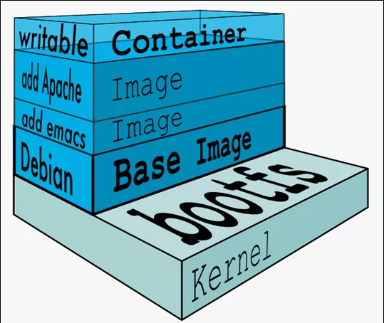

# Docker镜像

## 1 是什么

镜像是一种轻量级、可执行的独立软件包，它包含运行某个软件所需的所有内容，我们把应用程序和配置依赖打包好形成一个可交付的运行环境(包括代码、运行时需要的库、环境变量和配置文件等)，这个打包好的运行环境就是image镜像文件。

只有通过这个镜像文件才能生成Docker容器实例(类似Java中new出来一个对象)。

### 1.1 分层的镜像

以我们的pull为例，在下载的过程中我们可以看到docker的镜像好像是在一层一层的在下载

```sh
[root@192 tmp]# docker pull tomcat
Using default tag: latest
latest: Pulling from library/tomcat
0e29546d541c: Pull complete
9b829c73b52b: Pull complete
cb5b7ae36172: Pull complete
6494e4811622: Pull complete
668f6fcc5fa5: Pull complete
dc120c3e0290: Pull complete
8f7c0eebb7b1: Pull complete
77b694f83996: Pull complete
0f611256ec3a: Pull complete
4f25def12f23: Pull complete
Digest: sha256:9dee185c3b161cdfede1f5e35e8b56ebc9de88ed3a79526939701f3537a52324
Status: Downloaded newer image for tomcat:latest
docker.io/library/tomcat:latest
```

### 1.2 UnionFS（联合文件系统）

**UnionFS**（联合文件系统）：Union文件系统（UnionFS）是一种分层、轻量级并且高性能的文件系统，**它支持对文件系统的修改作为一次提交来一层层的叠加**，同时可以将不同目录挂载到同一个虚拟文件系统下(unite several directories into a single virtual filesystem)。Union 文件系统是 Docker 镜像的基础。**镜像可以通过分层来进行继承**，基于基础镜像（没有父镜像），可以制作各种具体的应用镜像。

特性：一次同时加载多个文件系统，但从外面看起来，只能看到一个文件系统，联合加载会把各层文件系统叠加起来，这样最终的文件系统会包含所有底层的文件和目录

###  1.3 Docker镜像加载原理

docker的镜像实际上由一层一层的文件系统组成，这种层级的文件系统UnionFS。

**bootfs(boot file system)**主要包含**bootloader**和**kernel**, bootloader主要是引导加载kernel, Linux刚启动时会加载bootfs文件系统，在Docker镜像的最底层是引导文件系统bootfs。这一层与我们典型的Linux/Unix系统是一样的，包含boot加载器和内核。当boot加载完成之后整个内核就都在内存中了，此时内存的使用权已由bootfs转交给内核，此时系统也会卸载bootfs。

rootfs (root file system) ，在bootfs之上。包含的就是典型 Linux 系统中的 /dev, /proc, /bin, /etc 等标准目录和文件。rootfs就是各种不同的操作系统发行版，比如Ubuntu，Centos等等。 


 平时我们安装进虚拟机的CentOS都是好几个G，为什么docker这里才200M？？

```sh
[root@192 tmp]# docker images centos
REPOSITORY   TAG       IMAGE ID       CREATED       SIZE
centos       latest    5d0da3dc9764   2 years ago   231MB
```

对于一个精简的OS，rootfs可以很小，只需要包括最基本的命令、工具和程序库就可以了，因为底层直接用Host的kernel，自己只需要提供 rootfs 就行了。由此可见对于不同的linux发行版, bootfs基本是一致的, rootfs会有差别, 因此不同的发行版可以公用bootfs。

### 1.4 为什么 Docker 镜像要采用这种分层结构呢

镜像分层最大的一个好处就是共享资源，方便复制迁移，**就是为了复用。**

比如说有多个镜像都从相同的 base 镜像构建而来，那么 Docker Host 只需在磁盘上保存一份 base 镜像；

同时内存中也只需加载一份 base 镜像，就可以为所有容器服务了。而且镜像的每一层都可以被共享。

## 2 重点理解

**Docker镜像层都是只读的，容器层是可写的。**

当容器启动时，一个新的可写层被加载到镜像的顶部。 这一层通常被称作“容器层”，“容器层”之下的都叫“镜像层”。

所有对容器的改动 - 无论添加、删除、还是修改文件都只会发生在容器层中。只有容器层是可写的，容器层下面的所有镜像层都是只读的。



## 3 Docker镜像commit操作案例

docker commit 提交容器副本使之成为一个新的镜像

```
docker commit -m="提交的描述信息" -a="作者" 容器ID 要创建的目标镜像名:[标签名]
```

### 3.1 案例演示ubuntu安装vim

1.从Hub上下载ubuntu镜像到本地并成功运行

```sh
[root@192 tmp]# docker pull ubuntu
Using default tag: latest
latest: Pulling from library/ubuntu
7b1a6ab2e44d: Already exists
Digest: sha256:626ffe58f6e7566e00254b638eb7e0f3b11d4da9675088f4781a50ae288f3322
Status: Downloaded newer image for ubuntu:latest
docker.io/library/ubuntu:latest
```

2.原始的默认Ubuntu镜像是不带着vim命令的

```sh
[root@192 tmp]# docker images
REPOSITORY    TAG       IMAGE ID       CREATED         SIZE
hello-world   latest    9c7a54a9a43c   7 months ago    13.3kB
tomcat        latest    fb5657adc892   23 months ago   680MB
ubuntu        latest    ba6acccedd29   2 years ago     72.8MB
centos        latest    5d0da3dc9764   2 years ago     231MB
redis         6.0.8     16ecd2772934   3 years ago     104MB
[root@192 tmp]# docker run -it ubuntu /bin/bash
root@7261a186130e:/# vim a.txt
bash: vim: command not found
```

3.外网连通的情况下，安装vim

docker容器内执行上述两条命令：

```sh
# 先更新包管理工具
apt-get update
# 然后安装vim
apt-get -y install vim

root@7261a186130e:/# apt-get update
Get:1 http://archive.ubuntu.com/ubuntu focal InRelease [265 kB]
Get:2 http://security.ubuntu.com/ubuntu focal-security InRelease [114 kB]
...
Get:17 http://archive.ubuntu.com/ubuntu focal-backports/main amd64 Packages [55.2 kB]
Get:18 http://archive.ubuntu.com/ubuntu focal-backports/universe amd64 Packages [28.6 kB]
Fetched 29.5 MB in 14s (2147 kB/s)
Reading package lists... Done

root@7261a186130e:/# apt-get -y install vim
Reading package lists... Done
Building dependency tree
Reading state information... Done
The following additional packages will be installed:
  alsa-topology-conf alsa-ucm-conf file libasound2 libasound2-data libcanberra0 libexpat1 libgpm2 libltdl7
  libmagic-mgc libmagic1 libmpdec2 libogg0 libpython3.8 libpython3.8-minimal 
 ... 
update-alternatives: warning: skip creation of /usr/share/man/ru/man1/editor.1.gz because associated file /usr/share/man/ru/man1/vim.1.gz (of link group editor) doesn't exist
update-alternatives: warning: skip creation of /usr/share/man/man1/editor.1.gz because associated file /usr/share/man/man1/vim.1.gz (of link group editor) doesn't exist
Processing triggers for libc-bin (2.31-0ubuntu9.2) ...
root@7261a186130e:/# vim a.txt
root@7261a186130e:/# pwd
/
root@7261a186130e:/# ls
a.txt  boot  etc   lib    lib64   media  opt   root  sbin  sys  usr
bin    dev   home  lib32  libx32  mnt    proc  run   srv   tmp  var
root@7261a186130e:/# cat a.txt
abcd
```

4.安装完成后，commit我们自己的新镜像

```sh
[root@192 ~]# docker ps
CONTAINER ID   IMAGE     COMMAND       CREATED         STATUS         PORTS     NAMES
7261a186130e   ubuntu    "/bin/bash"   8 minutes ago   Up 8 minutes             exciting_hopper
[root@192 ~]# docker commit -m="add vim cmd" -a="gm" 7261a186130e gm/myubuntu:1.1
sha256:6bf1a66c3f230412c9408226329cf3a2843283ece488d2c7a14e03ba33924e2a
[root@192 ~]# docker images
REPOSITORY    TAG       IMAGE ID       CREATED          SIZE
gm/myubuntu   1.1       6bf1a66c3f23   10 seconds ago   189MB
hello-world   latest    9c7a54a9a43c   7 months ago     13.3kB
tomcat        latest    fb5657adc892   23 months ago    680MB
ubuntu        latest    ba6acccedd29   2 years ago      72.8MB
centos        latest    5d0da3dc9764   2 years ago      231MB
redis         6.0.8     16ecd2772934   3 years ago      104MB
```

5.启动我们的新镜像并和原来的对比

```sh
[root@192 ~]# docker ps
CONTAINER ID   IMAGE     COMMAND   CREATED   STATUS    PORTS     NAMES
[root@192 ~]# docker images
REPOSITORY    TAG       IMAGE ID       CREATED         SIZE
gm/myubuntu   1.1       6bf1a66c3f23   3 minutes ago   189MB
hello-world   latest    9c7a54a9a43c   7 months ago    13.3kB
tomcat        latest    fb5657adc892   23 months ago   680MB
ubuntu        latest    ba6acccedd29   2 years ago     72.8MB
centos        latest    5d0da3dc9764   2 years ago     231MB
redis         6.0.8     16ecd2772934   3 years ago     104MB
[root@192 ~]# docker run -it ubuntu /bin/bash
root@1d4473e58e7f:/# vim a.txt
bash: vim: command not found
root@1d4473e58e7f:/# exit
exit
[root@192 ~]# docker run -it 6bf1a66c3f23 /bin/bash
vroot@c3d967508fc5:/# vim a.txt
root@c3d967508fc5:/# ls
a.txt  bin  boot  dev  etc  home  lib  lib32  lib64  libx32  media  mnt  opt  proc  root  run  sbin  srv  sys  tmp  usr  var
root@c3d967508fc5:/# cat a.txt
abcd
1234
```

官网是默认下载的Ubuntu没有vim命令

我们自己commit构建的镜像，新增加了vim功能，可以成功使用。

### 3.2 小总结

Docker中的镜像分层，支持通过扩展现有镜像，创建新的镜像。类似Java继承于一个Base基础类，自己再按需扩展。

新镜像是从 base 镜像一层一层叠加生成的。每安装一个软件，就在现有镜像的基础上增加一层

