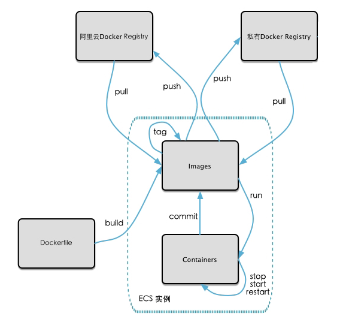
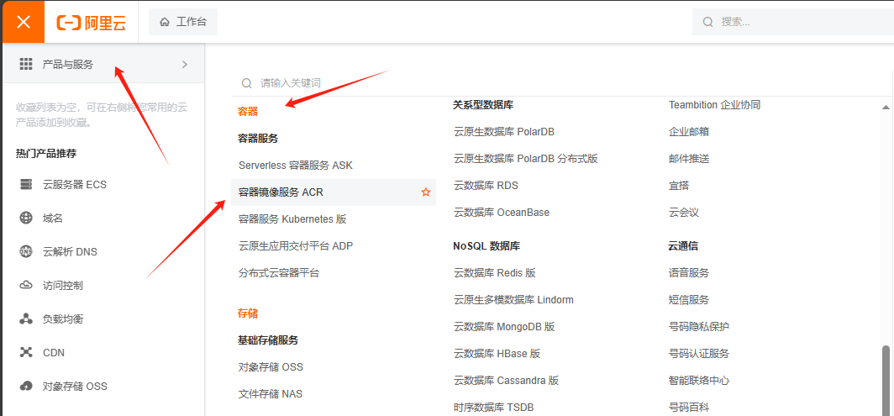
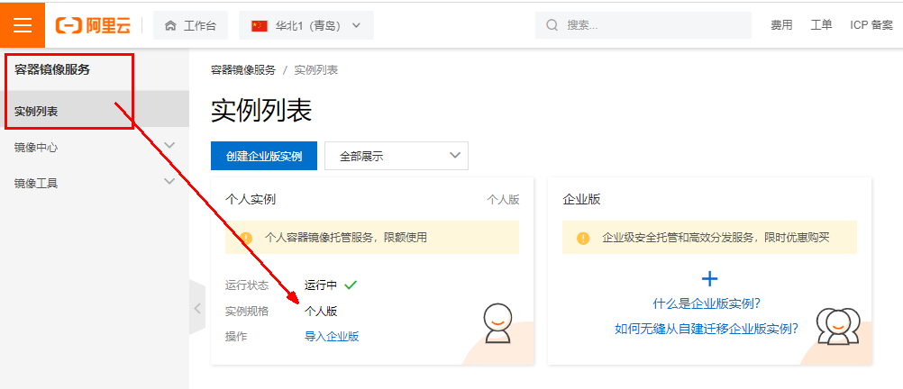
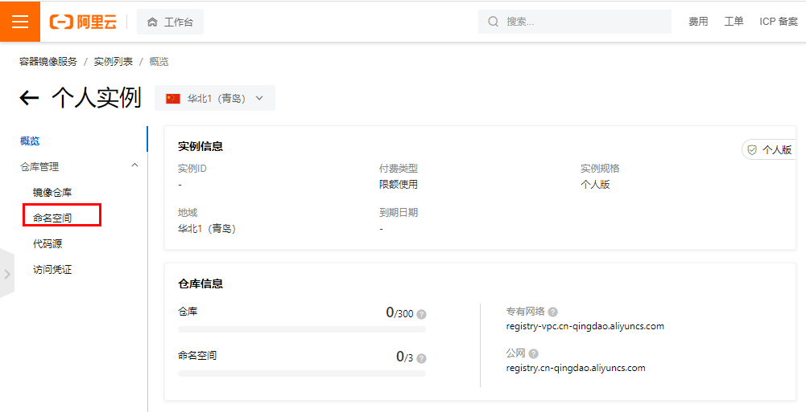
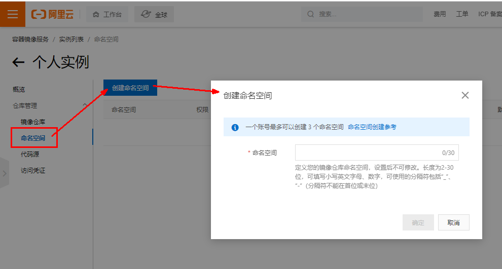
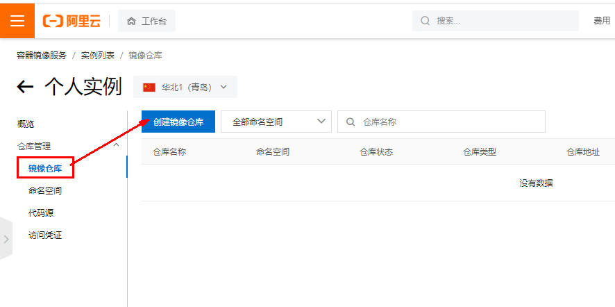
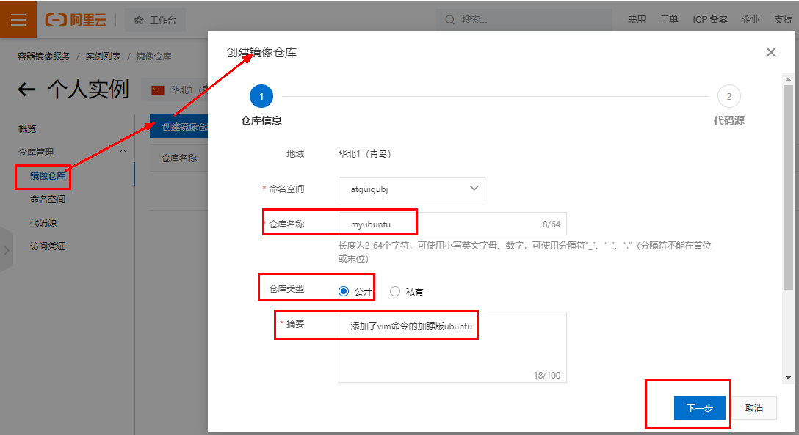
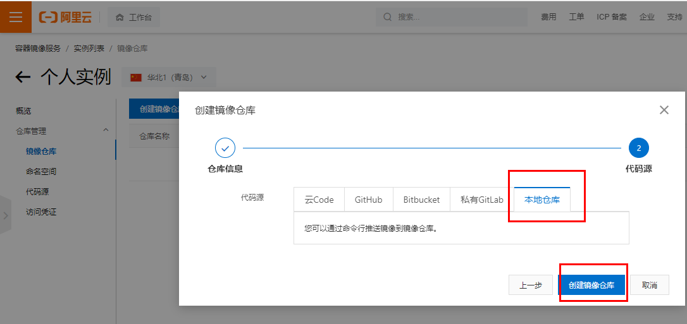
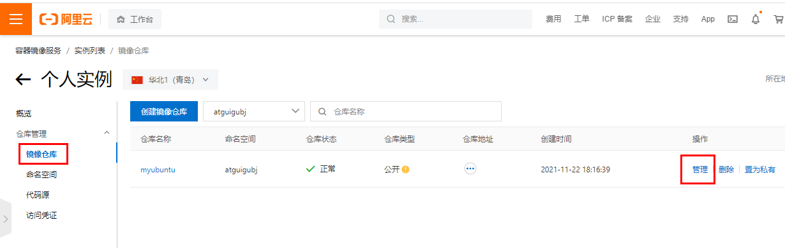
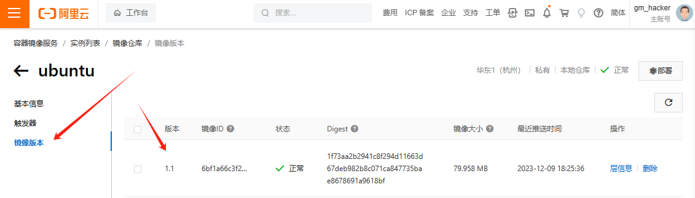

# 本地镜像发布到阿里云

## 1 本地镜像发布到阿里云流程

阿里云ECS Docker生态如下图所示：



## 2 镜像的生成方法

基于当前容器创建一个新的镜像，新功能增强 `docker commit [OPTIONS] 容器ID [REPOSITORY[:TAG]]`

OPTIONS说明：

-a :提交的镜像作者；

-m :提交时的说明文字；

## 3 将本地镜像推送到阿里云

本地镜像素材原型

```sh
[root@192 ~]# docker images
REPOSITORY    TAG       IMAGE ID       CREATED          SIZE
gm/myubuntu   1.1       6bf1a66c3f23   11 minutes ago   189MB
```

登录阿里云开发者平台https://promotion.aliyun.com/ntms/act/kubernetes.html

### 3.1 创建仓库镜像

1.选择控制台，进入容器镜像服务



2.选择个人实例



3.命名空间





4.仓库名称







5.进入管理界面获得脚本



### 3.2 将镜像推送到阿里云

1.管理界面脚本

```sh
1. 登录阿里云Docker Registry
$ docker login --username=gm_hacker registry.cn-hangzhou.aliyuncs.com
用于登录的用户名为阿里云账号全名，密码为开通服务时设置的密码。
您可以在访问凭证页面修改凭证密码。

2. 从Registry中拉取镜像
$ docker pull registry.cn-hangzhou.aliyuncs.com/gm-namespace/ubuntu:[镜像版本号]

3. 将镜像推送到Registry
$ docker login --username=gm_hacker registry.cn-hangzhou.aliyuncs.com
$ docker tag [ImageId] registry.cn-hangzhou.aliyuncs.com/gm-namespace/ubuntu:[镜像版本号]
$ docker push registry.cn-hangzhou.aliyuncs.com/gm-namespace/ubuntu:[镜像版本号]
请根据实际镜像信息替换示例中的[ImageId]和[镜像版本号]参数。

4. 选择合适的镜像仓库地址
从ECS推送镜像时，可以选择使用镜像仓库内网地址。推送速度将得到提升并且将不会损耗您的公网流量。
如果您使用的机器位于VPC网络，请使用 registry-vpc.cn-hangzhou.aliyuncs.com 作为Registry的域名登录。

5. 示例
使用"docker tag"命令重命名镜像，并将它通过专有网络地址推送至Registry。

$ docker images
REPOSITORY                                                         TAG                 IMAGE ID            CREATED             VIRTUAL SIZE
registry.aliyuncs.com/acs/agent                                    0.7-dfb6816         37bb9c63c8b2        7 days ago          37.89 MB

$ docker tag 37bb9c63c8b2 registry-vpc.cn-hangzhou.aliyuncs.com/acs/agent:0.7-dfb6816

使用 "docker push" 命令将该镜像推送至远程。
$ docker push registry-vpc.cn-hangzhou.aliyuncs.com/acs/agent:0.7-dfb6816
```

2.脚本实例

```
$ docker login --username=gm_hacker registry.cn-hangzhou.aliyuncs.com
$ docker tag 6bf1a66c3f23 registry.cn-hangzhou.aliyuncs.com/gm-namespace/ubuntu:1.1
$ docker push registry.cn-hangzhou.aliyuncs.com/gm-namespace/ubuntu:1.1
```

```sh
[root@192 ~]# docker login --username=gm_hacker registry.cn-hangzhou.aliyuncs.com
Password:
WARNING! Your password will be stored unencrypted in /root/.docker/config.json.
Configure a credential helper to remove this warning. See
https://docs.docker.com/engine/reference/commandline/login/#credentials-store

Login Succeeded
[root@192 ~]# docker tag 6bf1a66c3f23 registry.cn-hangzhou.aliyuncs.com/gm-namespace/ubuntu:1.1
[root@192 ~]# docker push registry.cn-hangzhou.aliyuncs.com/gm-namespace/ubuntu:1.1
The push refers to repository [registry.cn-hangzhou.aliyuncs.com/gm-namespace/ubuntu]
e9ea2504fa75: Pushed
9f54eef41275: Pushed
1.1: digest: sha256:1f73aa2b2941c8f294d11663d67deb982b8c071ca847735bae8678691a9618bf size: 741
```

3.镜像信息



## 4 将阿里云上的镜像下载到本地

```sh
$ docker pull registry.cn-hangzhou.aliyuncs.com/gm-namespace/ubuntu:1.1

[root@192 ~]# docker rmi -f 6bf1a66c3f23
Untagged: gm/myubuntu:1.1
Untagged: registry.cn-hangzhou.aliyuncs.com/gm-namespace/ubuntu:1.1
Untagged: registry.cn-hangzhou.aliyuncs.com/gm-namespace/ubuntu@sha256:1f73aa2b2941c8f294d11663d67deb982b8c071ca847735bae8678691a9618bf
Deleted: sha256:6bf1a66c3f230412c9408226329cf3a2843283ece488d2c7a14e03ba33924e2a
[root@192 ~]# docker images
REPOSITORY    TAG       IMAGE ID       CREATED         SIZE
hello-world   latest    9c7a54a9a43c   7 months ago    13.3kB
tomcat        latest    fb5657adc892   23 months ago   680MB
ubuntu        latest    ba6acccedd29   2 years ago     72.8MB
centos        latest    5d0da3dc9764   2 years ago     231MB
redis         6.0.8     16ecd2772934   3 years ago     104MB
[root@192 ~]# docker pull registry.cn-hangzhou.aliyuncs.com/gm-namespace/ubuntu:1.1
1.1: Pulling from gm-namespace/ubuntu
7b1a6ab2e44d: Already exists
07773d7148ed: Already exists
Digest: sha256:1f73aa2b2941c8f294d11663d67deb982b8c071ca847735bae8678691a9618bf
Status: Downloaded newer image for registry.cn-hangzhou.aliyuncs.com/gm-namespace/ubuntu:1.1
registry.cn-hangzhou.aliyuncs.com/gm-namespace/ubuntu:1.1
[root@192 ~]# docker images
REPOSITORY                                              TAG       IMAGE ID       CREATED          SIZE
registry.cn-hangzhou.aliyuncs.com/gm-namespace/ubuntu   1.1       6bf1a66c3f23   36 minutes ago   189MB
hello-world                                             latest    9c7a54a9a43c   7 months ago     13.3kB
tomcat                                                  latest    fb5657adc892   23 months ago    680MB
ubuntu                                                  latest    ba6acccedd29   2 years ago      72.8MB
centos                                                  latest    5d0da3dc9764   2 years ago      231MB
redis                                                   6.0.8     16ecd2772934   3 years ago      104MB
[root@192 ~]# docker run -it 6bf1a66c3f23 /bin/bash
root@c580ffa33150:/# ls
a.txt  bin  boot  dev  etc  home  lib  lib32  lib64  libx32  media  mnt  opt  proc  root  run  sbin  srv  sys  tmp  usr  var
root@c580ffa33150:/# cat a.txt
abcd
```