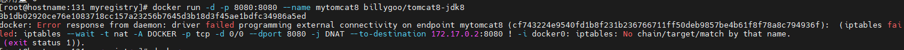

# Docker常规安装简介

## 1 总体步骤

1. 搜索镜像
2. 拉取镜像
3. 查看镜像
4. 启动镜像 - 服务端口映射
5. 停止容器
6. 移除容器

## 2 安装tomcat

1.docker hub上面查找tomcat镜像

```sh
docker search tomcat

[root@192 ~]# docker search tomcat
NAME                          DESCRIPTION                                      STARS     OFFICIAL   AUTOMATED
tomcat                        Apache Tomcat is an open source implementati…   3615      [OK]
tomee                         Apache TomEE is an all-Apache Java EE certif…   113       [OK]
bitnami/tomcat                Bitnami Tomcat Docker Image                      51                   [OK]
bitnamicharts/tomcat                                                           0
secoresearch/tomcat-varnish   Tomcat and Varnish 5.0                           0                    [OK]
vulhub/tomcat                                                                  0
islandora/tomcat                                                               0
wnprcehr/tomcat                                                                0
hivdb/tomcat-with-nucamino                                                     0
jumpserver/tomcat                                                              0
sismics/tomcat                Apache Tomcat Servlet Container                  1
eclipse/rdf4j-workbench       Dockerfile for Eclipse RDF4J Server and Work…   6
semoss/docker-tomcat          Tomcat, Java, Maven, and Git on top of debian    0                    [OK]
eclipse/hadoop-dev            Ubuntu 14.04, Maven 3.3.9, JDK8, Tomcat 8        0                    [OK]
gbif/ipt                      The GBIF Integrated Publishing Toolkit (IPT)…   2
dhis2/base-dev                Images in this repository contains DHIS2 WAR…   0
eclipse/alpine_jdk8           Based on Alpine 3.3. JDK 1.8, Maven 3.3.9, T…   1                    [OK]
misolims/miso-base            MySQL 5.7 Database and Tomcat 8 Server neede…   0
dhis2/base                    Images in this repository contains DHIS2 WAR…   0
jelastic/tomcat               An image of the Tomcat Java application serv…   4
cfje/tomcat-resource          Tomcat Concourse Resource                        2
rightctrl/tomcat              CentOS , Oracle Java, tomcat application ssl…   7                    [OK]
amd64/tomcat                  Apache Tomcat is an open source implementati…   8
arm64v8/tomcat                Apache Tomcat is an open source implementati…   9
softwareplant/tomcat          Tomcat images for jira-cloud testing             0                    [OK]
```

2.从docker hub上拉取tomcat镜像到本地

```
docker pull tomcat
```

3.docker images查看是否有拉取到的tomcat

```sh
[root@192 ~]# docker images tomcat
REPOSITORY   TAG       IMAGE ID       CREATED         SIZE
tomcat       latest    fb5657adc892   23 months ago   680MB
```

4.使用tomcat镜像创建容器实例(也叫运行镜像)

```sh
docker run -it -p 8080:8080 tomcat

[root@192 ~]# docker run -it -p 8080:8080 tomcat
Using CATALINA_BASE:   /usr/local/tomcat
Using CATALINA_HOME:   /usr/local/tomcat
Using CATALINA_TMPDIR: /usr/local/tomcat/temp
Using JRE_HOME:        /usr/local/openjdk-11
Using CLASSPATH:       /usr/local/tomcat/bin/bootstrap.jar:/usr/local/tomcat/bin/tomcat-juli.jar
Using CATALINA_OPTS:
NOTE: Picked up JDK_JAVA_OPTIONS:  --add-opens=java.base/java.lang=ALL-UNNAMED --add-opens=java.base/java.io=ALL-UNNAMED --add-opens=java.base/java.util=ALL-UNNAMED --add-opens=java.base/java.util.concurrent=ALL-UNNAMED --add-opens=java.rmi/sun.rmi.transport=ALL-UNNAMED
09-Dec-2023 14:53:26.503 INFO [main] org.apache.catalina.startup.VersionLoggerListener.log Server version name:   Apache Tomcat/10.0.14
09-Dec-2023 14:53:26.505 INFO [main] org.apache.catalina.startup.VersionLoggerListener.log Server built:          Dec 2 2021 22:01:36 UTC
09-Dec-2023 14:53:26.506 INFO [main] org.apache.catalina.startup.VersionLoggerListener.log Server version number: 10.0.14.0
...
09-Dec-2023 14:53:26.832 INFO [main] org.apache.catalina.core.StandardEngine.startInternal Starting Servlet engine: [Apache Tomcat/10.0.14]
09-Dec-2023 14:53:26.839 INFO [main] org.apache.coyote.AbstractProtocol.start Starting ProtocolHandler ["http-nio-8080"]
09-Dec-2023 14:53:26.847 INFO [main] org.apache.catalina.startup.Catalina.start Server startup in [58] milliseconds

[root@192 ~]# docker ps
CONTAINER ID   IMAGE      COMMAND                   CREATED              STATUS              PORTS                                       NAMES
30ed7159d98f   tomcat     "catalina.sh run"         About a minute ago   Up About a minute   0.0.0.0:8080->8080/tcp, :::8080->8080/tcp   nice_bassi
2ee03a1af4cd   registry   "/entrypoint.sh /etc…"   2 hours ago          Up About an hour    0.0.0.0:5000->5000/tcp, :::5000->5000/tcp   kind_cannon

```

5.访问tomcat首页

http://192.168.11.132:8080

问题：HTTP状态 404 - 未找到

解决：

- 可能没有映射端口或者没有关闭防火墙
- 把webapps.dist目录换成webapps

```sh
[root@192 ~]# docker ps
CONTAINER ID   IMAGE      COMMAND                   CREATED          STATUS             PORTS                                       NAMES
30ed7159d98f   tomcat     "catalina.sh run"         12 minutes ago   Up 12 minutes      0.0.0.0:8080->8080/tcp, :::8080->8080/tcp   nice_bassi
2ee03a1af4cd   registry   "/entrypoint.sh /etc…"   2 hours ago      Up About an hour   0.0.0.0:5000->5000/tcp, :::5000->5000/tcp   kind_cannon
[root@192 ~]# docker exec -it 30ed7159d98f /bin/bash
root@30ed7159d98f:/usr/local/tomcat# pwd
/usr/local/tomcat
root@30ed7159d98f:/usr/local/tomcat# ls -l
total 196
-rw-r--r--. 1 root root 18994 Dec  2  2021 BUILDING.txt
-rw-r--r--. 1 root root  6210 Dec  2  2021 CONTRIBUTING.md
-rw-r--r--. 1 root root 60269 Dec  2  2021 LICENSE
-rw-r--r--. 1 root root  2333 Dec  2  2021 NOTICE
-rw-r--r--. 1 root root  3378 Dec  2  2021 README.md
-rw-r--r--. 1 root root  6905 Dec  2  2021 RELEASE-NOTES
-rw-r--r--. 1 root root 16517 Dec  2  2021 RUNNING.txt
drwxr-xr-x. 2 root root  4096 Dec 22  2021 bin
drwxr-xr-x. 1 root root  4096 Dec  9 14:53 conf
drwxr-xr-x. 2 root root  4096 Dec 22  2021 lib
drwxrwxrwx. 1 root root  4096 Dec  9 14:53 logs
drwxr-xr-x. 2 root root  4096 Dec 22  2021 native-jni-lib
drwxrwxrwx. 2 root root  4096 Dec 22  2021 temp
drwxr-xr-x. 2 root root  4096 Dec 22  2021 webapps
drwxr-xr-x. 7 root root  4096 Dec  2  2021 webapps.dist
drwxrwxrwx. 2 root root  4096 Dec  2  2021 work
root@30ed7159d98f:/usr/local/tomcat# rm -r webapps
root@30ed7159d98f:/usr/local/tomcat# mv webapps.dist webapps
root@30ed7159d98f:/usr/local/tomcat# ls -l
total 188
-rw-r--r--. 1 root root 18994 Dec  2  2021 BUILDING.txt
-rw-r--r--. 1 root root  6210 Dec  2  2021 CONTRIBUTING.md
-rw-r--r--. 1 root root 60269 Dec  2  2021 LICENSE
-rw-r--r--. 1 root root  2333 Dec  2  2021 NOTICE
-rw-r--r--. 1 root root  3378 Dec  2  2021 README.md
-rw-r--r--. 1 root root  6905 Dec  2  2021 RELEASE-NOTES
-rw-r--r--. 1 root root 16517 Dec  2  2021 RUNNING.txt
drwxr-xr-x. 2 root root  4096 Dec 22  2021 bin
drwxr-xr-x. 1 root root  4096 Dec  9 14:53 conf
drwxr-xr-x. 2 root root  4096 Dec 22  2021 lib
drwxrwxrwx. 1 root root  4096 Dec  9 15:07 logs
drwxr-xr-x. 2 root root  4096 Dec 22  2021 native-jni-lib
drwxrwxrwx. 2 root root  4096 Dec 22  2021 temp
drwxr-xr-x. 7 root root  4096 Dec  2  2021 webapps
drwxrwxrwx. 1 root root  4096 Dec  9 15:07 work
```

再次访问：http://192.168.11.132:8080，访问成功。

6.免修改版说明

```
docker pull billygoo/tomcat8-jdk8
docker run -d -p 8080:8080 --name tomcat8 billygoo/tomcat8-jdk8
```

问题：

创建容器时报错：



iptables: No chain/target/match by that name.

问题原因：再docker运行的时候，关闭了防火墙，docker chain 设置未更新 ！

解决方案：重启docker

解决问题的帖子：https://blog.csdn.net/qq_24452475/article/details/83901620

## 3 安装mysql

### 3.1 搜索mysql镜像

```sh
[root@192 ~]# docker search mysql
NAME                            DESCRIPTION                                      STARS     OFFICIAL   AUTOMATED
mysql                           MySQL is a widely used, open-source relation…   14685     [OK]
mariadb                         MariaDB Server is a high performing open sou…   5600      [OK]
percona                         Percona Server is a fork of the MySQL relati…   623       [OK]
phpmyadmin                      phpMyAdmin - A web interface for MySQL and M…   910       [OK]
bitnami/mysql                   Bitnami MySQL Docker Image                       105                  [OK]
bitnami/mysqld-exporter                                                          5
cimg/mysql                                                                       2
ubuntu/mysql                    MySQL open source fast, stable, multi-thread…   55
rapidfort/mysql                 RapidFort optimized, hardened image for MySQL    25
rapidfort/mysql8-ib             RapidFort optimized, hardened image for MySQ…   9
google/mysql                    MySQL server for Google Compute Engine           25                   [OK]
rapidfort/mysql-official        RapidFort optimized, hardened image for MySQ…   9
hashicorp/mysql-portworx-demo                                                    0
elestio/mysql                   Mysql, verified and packaged by Elestio          0
bitnamicharts/mysql                                                              0
newrelic/mysql-plugin           New Relic Plugin for monitoring MySQL databa…   1                    [OK]
databack/mysql-backup           Back up mysql databases to... anywhere!          104
linuxserver/mysql               A Mysql container, brought to you by LinuxSe…   41
mirantis/mysql                                                                   0
docksal/mysql                   MySQL service images for Docksal - https://d…   0
linuxserver/mysql-workbench                                                      54
vitess/mysqlctld                vitess/mysqlctld                                 1                    [OK]
eclipse/mysql                   Mysql 5.7, curl, rsync                           1                    [OK]
drupalci/mysql-5.5              https://www.drupal.org/project/drupalci          3                    [OK]
drupalci/mysql-5.7              https://www.drupal.org/project/drupalci          0

```

### 3.2 拉取mysql:5.7镜像

```sh
[root@192 ~]# docker pull mysql:5.7
5.7: Pulling from library/mysql
72a69066d2fe: Pull complete
93619dbc5b36: Pull complete
99da31dd6142: Pull complete
626033c43d70: Pull complete
37d5d7efb64e: Pull complete
ac563158d721: Pull complete
d2ba16033dad: Pull complete
0ceb82207cd7: Pull complete
37f2405cae96: Pull complete
e2482e017e53: Pull complete
70deed891d42: Pull complete
Digest: sha256:f2ad209efe9c67104167fc609cca6973c8422939491c9345270175a300419f94
Status: Downloaded newer image for mysql:5.7
docker.io/library/mysql:5.7
[root@192 ~]# docker images
REPOSITORY                     TAG       IMAGE ID       CREATED         SIZE
192.168.11.132:5000/myubuntu   1.2       776f0b498306   2 hours ago     122MB
tomcat                         latest    fb5657adc892   23 months ago   680MB
mysql                          5.7       c20987f18b13   23 months ago   448MB
registry                       latest    b8604a3fe854   2 years ago     26.2MB
ubuntu                         latest    ba6acccedd29   2 years ago     72.8MB
centos                         latest    5d0da3dc9764   2 years ago     231MB
redis                          6.0.8     16ecd2772934   3 years ago     104MB
```

### 3.3 创建容器

#### 简单版

```
docker run -p 3306:3306 -e MYSQL_ROOT_PASSWORD=root -d mysql:5.7
docker ps
docker exec -it 容器ID /bin/bash
mysql -uroot -p
```

```sh
[root@192 ~]# docker run -p 3306:3306 -e MYSQL_ROOT_PASSWORD=root -d mysql:5.7
eb8d0f4c7bd642a103a33e4ee1871464e7709ac85c34f5f6bb65df97cebee713

[root@192 ~]# docker ps
CONTAINER ID   IMAGE       COMMAND                   CREATED         STATUS         PORTS                                                  NAMES
eb8d0f4c7bd6   mysql:5.7   "docker-entrypoint.s…"   4 seconds ago   Up 3 seconds   0.0.0.0:3306->3306/tcp, :::3306->3306/tcp, 33060/tcp   determined_raman

[root@192 ~]# docker exec -it eb8d0f4c7bd6 /bin/bash
root@eb8d0f4c7bd6:/# mysql -uroot -p
Enter password:
Welcome to the MySQL monitor.  Commands end with ; or \g.
Your MySQL connection id is 2
Server version: 5.7.36 MySQL Community Server (GPL)

Copyright (c) 2000, 2021, Oracle and/or its affiliates.

Oracle is a registered trademark of Oracle Corporation and/or its
affiliates. Other names may be trademarks of their respective
owners.

Type 'help;' or '\h' for help. Type '\c' to clear the current input statement.

mysql> create database db01;
Query OK, 1 row affected (0.00 sec)

mysql> use db01;
Database changed
mysql> create table aa(id int,name varchar(11));
Query OK, 0 rows affected (0.00 sec)

mysql> insert into aa values(1,'gm');
Query OK, 1 row affected (0.01 sec)

mysql> select * from aa;
+------+------+
| id   | name |
+------+------+
|    1 | gm   |
+------+------+
1 row in set (0.00 sec)
```

外部客户端也可连接运行在dokcer上的mysql容器实例服务。

**问题**：

插入中文数据报错：

insert into aa values(2,'张三')

1366 - Incorrect string value: '\xE5\xBC\xA0\xE4\xB8\x89' for column 'name' at row 1

**为什么报错?**

docker上默认字符集编码隐患，docker里面的mysql容器实例查看，内容如下：

```sql
SHOW VARIABLES LIKE 'character%';

mysql> SHOW VARIABLES LIKE 'character%';
+--------------------------+----------------------------+
| Variable_name            | Value                      |
+--------------------------+----------------------------+
| character_set_client     | latin1                     |
| character_set_connection | latin1                     |
| character_set_database   | latin1                     |
| character_set_filesystem | binary                     |
| character_set_results    | latin1                     |
| character_set_server     | latin1                     |
| character_set_system     | utf8                       |
| character_sets_dir       | /usr/share/mysql/charsets/ |
+--------------------------+----------------------------+
8 rows in set (0.00 sec)
```

删除容器后，里面的mysql数据怎么办？

#### 实战版

新建mysql容器实例

```shell
docker run -d -p 3306:3306 --privileged=true -v /data/mysql/log:/var/log/mysql -v /data/mysql/data:/var/lib/mysql -v /data/mysql/conf:/etc/mysql/conf.d -e MYSQL_ROOT_PASSWORD=root --name mysql mysql:5.7
```

```sh
[root@192 ~]# docker images
REPOSITORY                     TAG       IMAGE ID       CREATED         SIZE
192.168.11.132:5000/myubuntu   1.2       776f0b498306   2 hours ago     122MB
tomcat                         latest    fb5657adc892   23 months ago   680MB
mysql                          5.7       c20987f18b13   23 months ago   448MB
registry                       latest    b8604a3fe854   2 years ago     26.2MB
ubuntu                         latest    ba6acccedd29   2 years ago     72.8MB
centos                         latest    5d0da3dc9764   2 years ago     231MB
redis                          6.0.8     16ecd2772934   3 years ago     104MB
[root@192 ~]# docker run -d -p 3306:3306 --privileged=true -v /data/mysql/log:/var/log/mysql -v /data/mysql/data:/var/lib/mysql -v /data/mysql/conf:/etc/mysql/conf.d -e MYSQL_ROOT_PASSWORD=root --name mysql mysql:5.7
80439175ed68999f1c51d5eed78ed7db5fba50cc139c103c42164d6a415a16cc
[root@192 ~]# cd /data/mysql/conf
[root@192 conf]# vim my.cnf
[root@192 conf]# cat my.cnf
[client]
default_character_set=utf8
[mysqld]
collation_server = utf8_general_ci
character_set_server = utf8
```

新建my.cnf，通过容器卷同步给mysql容器实例

```shell
[client]
default_character_set=utf8
[mysqld]
collation_server = utf8_general_ci
character_set_server = utf8
```

重新启动mysql容器实例再重新进入并查看字符编码

```sh
[root@192 conf]# docker restart mysql
mysql
[root@192 conf]# docker exec -it mysql /bin/bash
root@80439175ed68:/# mysql -uroot -p
Enter password:
Welcome to the MySQL monitor.  Commands end with ; or \g.
Your MySQL connection id is 3
Server version: 5.7.36 MySQL Community Server (GPL)

Copyright (c) 2000, 2021, Oracle and/or its affiliates.

Oracle is a registered trademark of Oracle Corporation and/or its
affiliates. Other names may be trademarks of their respective
owners.

Type 'help;' or '\h' for help. Type '\c' to clear the current input statement.

mysql> SHOW VARIABLES LIKE 'character%';
+--------------------------+----------------------------+
| Variable_name            | Value                      |
+--------------------------+----------------------------+
| character_set_client     | utf8                       |
| character_set_connection | utf8                       |
| character_set_database   | utf8                       |
| character_set_filesystem | binary                     |
| character_set_results    | utf8                       |
| character_set_server     | utf8                       |
| character_set_system     | utf8                       |
| character_sets_dir       | /usr/share/mysql/charsets/ |
+--------------------------+----------------------------+
8 rows in set (0.01 sec)
```

再新建库新建表即可插入中文

## 4 安装redis

1.从docker hub上(阿里云加速器)拉取redis镜像到本地标签为6.0.8

```sh
[root@192 conf]# docker pull redis:6.0.8
6.0.8: Pulling from library/redis
Digest: sha256:21db12e5ab3cc343e9376d655e8eabbdbe5516801373e95a8a9e66010c5b8819
Status: Image is up to date for redis:6.0.8
docker.io/library/redis:6.0.8
[root@192 conf]# docker images
REPOSITORY                     TAG       IMAGE ID       CREATED         SIZE
192.168.11.132:5000/myubuntu   1.2       776f0b498306   2 hours ago     122MB
tomcat                         latest    fb5657adc892   23 months ago   680MB
mysql                          5.7       c20987f18b13   23 months ago   448MB
registry                       latest    b8604a3fe854   2 years ago     26.2MB
ubuntu                         latest    ba6acccedd29   2 years ago     72.8MB
centos                         latest    5d0da3dc9764   2 years ago     231MB
redis                          6.0.8     16ecd2772934   3 years ago     104MB
```

2.入门命令

```sh
[root@192 conf]# docker run -d -p 6379:6379 redis:6.0.8
882c54bfdeab3a71474bb784261b02af118dbccd5d0d3e61045026c5e3539c76
[root@192 conf]# docker ps
CONTAINER ID   IMAGE         COMMAND                   CREATED         STATUS         PORTS                                                  NAMES
882c54bfdeab   redis:6.0.8   "docker-entrypoint.s…"   4 seconds ago   Up 3 seconds   0.0.0.0:6379->6379/tcp, :::6379->6379/tcp              nervous_wilson
80439175ed68   mysql:5.7     "docker-entrypoint.s…"   8 minutes ago   Up 6 minutes   0.0.0.0:3306->3306/tcp, :::3306->3306/tcp, 33060/tcp   mysql
[root@192 conf]# docker exec -it 882c54bfdeab /bin/bash
root@882c54bfdeab:/data# redis-cli
127.0.0.1:6379> set k1 v1
OK
127.0.0.1:6379> get k1
"v1"
127.0.0.1:6379> ping
PONG
127.0.0.1:6379>
```

3.命令提醒：容器卷记得加入--privileged=true

Docker挂载主机目录Docker访问出现cannot open directory .: Permission denied

解决办法：在挂载目录后多加一个--privileged=true参数即可

4.在CentOS宿主机下新建目录/app/redis

```sh
mkdir -p /app/redis

[root@192 conf]# mkdir -p /app/redis
[root@192 conf]# cd /app/redis/
```

5.将一个redis.conf文件模板拷贝进/app/redis目录下

将准备好的redis.conf文件放进/app/redis目录下

6.修改redis.conf文件

```sh
1 开启redis验证 可选
requirepass 123
2 允许redis外地连接  必须
注释掉 # bind 127.0.0.1
3 daemonize no
将daemonize yes注释起来或者 daemonize no设置，因为该配置和docker run中-d参数冲突，会导致容器一直启动失败
4 开启redis数据持久化  appendonly yes  可选
5 关闭保护模式 protected-mode no
```

修改后的配置文件

```sh
requirepass 123
protected-mode no
port 6379
tcp-backlog 511
timeout 0
tcp-keepalive 300
daemonize no
supervised no
pidfile /var/run/redis_6379.pid
loglevel notice
logfile ""
databases 16
always-show-logo yes 
save 900 1
save 300 10
save 60 10000
stop-writes-on-bgsave-error yes
rdbcompression yes
rdbchecksum yes
dbfilename dump.rdb
dir ./
replica-serve-stale-data yes
replica-read-only yes
repl-diskless-sync no
repl-diskless-sync-delay 5
repl-disable-tcp-nodelay no
replica-priority 100 
lazyfree-lazy-eviction no
lazyfree-lazy-expire no
lazyfree-lazy-server-del no
replica-lazy-flush no 
appendonly yes 
appendfilename "appendonly.aof"
appendfsync everysec 
no-appendfsync-on-rewrite no 
auto-aof-rewrite-percentage 100
auto-aof-rewrite-min-size 64mb 
aof-load-truncated yes
aof-use-rdb-preamble yes 
lua-time-limit 5000
slowlog-log-slower-than 10000
slowlog-max-len 128 
latency-monitor-threshold 0
notify-keyspace-events Ex
hash-max-ziplist-entries 512
hash-max-ziplist-value 64
list-max-ziplist-size -2
list-compress-depth 0 
set-max-intset-entries 512
zset-max-ziplist-entries 128
zset-max-ziplist-value 64
hll-sparse-max-bytes 3000
stream-node-max-bytes 4096
stream-node-max-entries 100
activerehashing yes
client-output-buffer-limit normal 0 0 0
client-output-buffer-limit replica 256mb 64mb 60
client-output-buffer-limit pubsub 32mb 8mb 60
hz 10
dynamic-hz yes
aof-rewrite-incremental-fsync yes
rdb-save-incremental-fsync yes 
```

7.使用redis6.0.8镜像创建容器(也叫运行镜像)

```shell
docker run -p 6379:6379 --name myr3 --privileged=true -v /app/redis/redis.conf:/etc/redis/redis.conf -v /app/redis/data:/data -d redis:6.0.8 redis-server /etc/redis/redis.conf

[root@192 redis]# docker run -p 6379:6379 --name myr3 --privileged=true -v /app/redis/redis.conf:/etc/redis/redis.conf -v /app/redis/data:/data -d redis:6.0.8 redis-server /etc/redis/redis.conf
08d0615c96ea69dafc45a01735b96465f906aa68dfd3700b0c95935264414d8f
[root@192 redis]# docker ps
CONTAINER ID   IMAGE         COMMAND                   CREATED          STATUS          PORTS                                                  NAMES
08d0615c96ea   redis:6.0.8   "docker-entrypoint.s…"   4 seconds ago    Up 3 seconds    0.0.0.0:6379->6379/tcp, :::6379->6379/tcp              myr3
80439175ed68   mysql:5.7     "docker-entrypoint.s…"   30 minutes ago   Up 28 minutes   0.0.0.0:3306->3306/tcp, :::3306->3306/tcp, 33060/tcp   mysql

```

8.测试redis-cli连接上来

```sh
[root@192 redis]# docker exec -it myr3 /bin/bash
root@08d0615c96ea:/data# redis-cli
127.0.0.1:6379> set k1 v1
(error) NOAUTH Authentication required.
127.0.0.1:6379> auth 123
OK
127.0.0.1:6379> set k1 v1
OK
127.0.0.1:6379> get k1
"v1"
127.0.0.1:6379>
```

## 5 安装Nginx

见高级篇Portainer