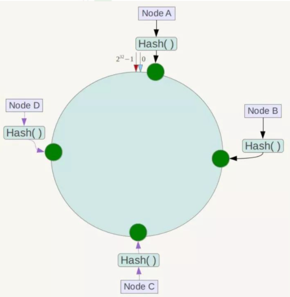
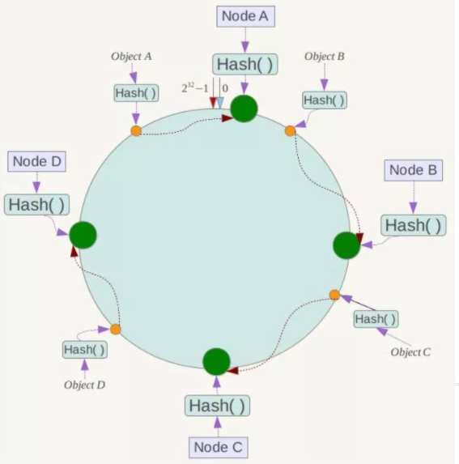
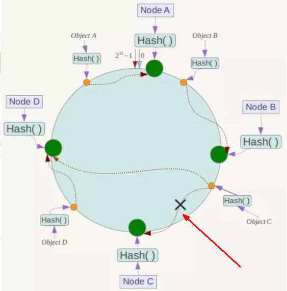
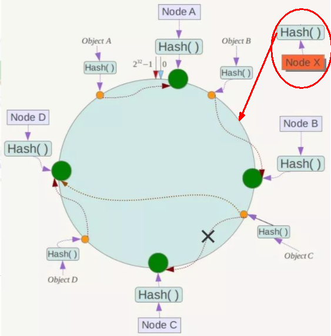
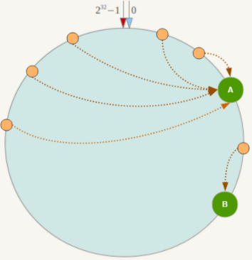
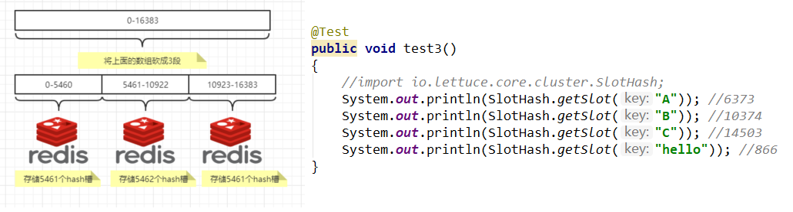

# Docker复杂安装详说

## 1 安装MySQL主从复制

### 1.1 主从复制原理

见MySQL高级篇

### 1.2 主从搭建步骤

1.新建主服务器容器实例3307

```shell
docker run -p 3307:3306 --name mysql-master \
-v /mydata/mysql-master/log:/var/log/mysql \
-v /mydata/mysql-master/data:/var/lib/mysql \
-v /mydata/mysql-master/conf:/etc/mysql \
-e MYSQL_ROOT_PASSWORD=root \
-d mysql:5.7

[root@192 ~]# docker run -p 3307:3306 --name mysql-master \
> -v /mydata/mysql-master/log:/var/log/mysql \
> -v /mydata/mysql-master/data:/var/lib/mysql \
> -v /mydata/mysql-master/conf:/etc/mysql \
> -e MYSQL_ROOT_PASSWORD=root \
> -d mysql:5.7
deca9b0c23442aa1ad193fc517cef1aadb7dc9dad5a3a1eb64c8677aec3bb140
[root@192 ~]# docker ps
CONTAINER ID   IMAGE       COMMAND                   CREATED          STATUS          PORTS                                                  NAMES
deca9b0c2344   mysql:5.7   "docker-entrypoint.s…"   11 seconds ago   Up 10 seconds   33060/tcp, 0.0.0.0:3307->3306/tcp, :::3307->3306/tcp   mysql-master
```

2.进入/mydata/mysql-master/conf目录下新建my.cnf

```sh
cd /mydata/mysql-master/conf
vim my.cnf

[mysqld]
## 设置server_id，同一局域网中需要唯一
server_id=101 
## 指定不需要同步的数据库名称
binlog-ignore-db=mysql  
## 开启二进制日志功能
log-bin=mall-mysql-bin  
## 设置二进制日志使用内存大小（事务）
binlog_cache_size=1M  
## 设置使用的二进制日志格式（mixed,statement,row）
binlog_format=mixed  
## 二进制日志过期清理时间。默认值为0，表示不自动清理。
expire_logs_days=7  
## 跳过主从复制中遇到的所有错误或指定类型的错误，避免slave端复制中断。
## 如：1062错误是指一些主键重复，1032错误是因为主从数据库数据不一致
slave_skip_errors=1062
```

3.修改完配置后重启master实例

```
docker restart mysql-master
```

4.进入mysql-master容器

```
docker exec -it mysql-master /bin/bash
mysql -uroot -proot
```

5.master容器实例内创建数据同步用户

```sql
CREATE USER 'slave'@'%' IDENTIFIED BY '123456';
GRANT REPLICATION SLAVE, REPLICATION CLIENT ON *.* TO 'slave'@'%';
```

6.新建从服务器容器实例3308

```sh
docker run -p 3308:3306 --name mysql-slave \
-v /mydata/mysql-slave/log:/var/log/mysql \
-v /mydata/mysql-slave/data:/var/lib/mysql \
-v /mydata/mysql-slave/conf:/etc/mysql \
-e MYSQL_ROOT_PASSWORD=root \
-d mysql:5.7

[root@192 conf]# docker run -p 3308:3306 --name mysql-slave \
> -v /mydata/mysql-slave/log:/var/log/mysql \
> -v /mydata/mysql-slave/data:/var/lib/mysql \
> -v /mydata/mysql-slave/conf:/etc/mysql \
> -e MYSQL_ROOT_PASSWORD=root \
> -d mysql:5.7
a525f3074f9b300fcd5f416efc706484f5fc547940f7a104f11da8214c544291
[root@192 conf]# docker ps
CONTAINER ID   IMAGE       COMMAND                   CREATED         STATUS         PORTS                                                  NAMES
a525f3074f9b   mysql:5.7   "docker-entrypoint.s…"   4 seconds ago   Up 3 seconds   33060/tcp, 0.0.0.0:3308->3306/tcp, :::3308->3306/tcp   mysql-slave
deca9b0c2344   mysql:5.7   "docker-entrypoint.s…"   5 minutes ago   Up 2 minutes   33060/tcp, 0.0.0.0:3307->3306/tcp, :::3307->3306/tcp   mysql-master
```

7.进入/mydata/mysql-slave/conf目录下新建my.cnf

```sh
cd /mydata/mysql-slave/conf
vim my.cnf

[mysqld]
## 设置server_id，同一局域网中需要唯一
server_id=102
## 指定不需要同步的数据库名称
binlog-ignore-db=mysql  
## 开启二进制日志功能，以备Slave作为其它数据库实例的Master时使用
log-bin=mall-mysql-slave1-bin  
## 设置二进制日志使用内存大小（事务）
binlog_cache_size=1M  
## 设置使用的二进制日志格式（mixed,statement,row）
binlog_format=mixed  
## 二进制日志过期清理时间。默认值为0，表示不自动清理。
expire_logs_days=7  
## 跳过主从复制中遇到的所有错误或指定类型的错误，避免slave端复制中断。
## 如：1062错误是指一些主键重复，1032错误是因为主从数据库数据不一致
slave_skip_errors=1062  
## relay_log配置中继日志
relay_log=mall-mysql-relay-bin  
## log_slave_updates表示slave将复制事件写进自己的二进制日志
log_slave_updates=1  
## slave设置为只读（具有super权限的用户除外）
read_only=1
```

8.修改完配置后重启slave实例

```
docker restart mysql-slave
```

9.在主数据库中查看主从同步状态

```sql
show master status;

mysql> show master status;
+-----------------------+----------+--------------+------------------+-------------------+
| File                  | Position | Binlog_Do_DB | Binlog_Ignore_DB | Executed_Gtid_Set |
+-----------------------+----------+--------------+------------------+-------------------+
| mall-mysql-bin.000001 |      617 |              | mysql            |                   |
+-----------------------+----------+--------------+------------------+-------------------+
1 row in set (0.00 sec)
```

10.进入mysql-slave容器

```sh
docker exec -it mysql-slave /bin/bash
mysql -uroot -proot
```

11.在从数据库中配置主从复制

```sql
change master to master_host='192.168.11.132', master_user='slave', master_password='123456', 
master_port=3307, master_log_file='mall-mysql-bin.000001', master_log_pos=617, master_connect_retry=30;


[root@192 ~]# docker exec -it mysql-slave /bin/bash
root@a525f3074f9b:/# mysql -uroot -proot
mysql: [Warning] Using a password on the command line interface can be insecure.
Welcome to the MySQL monitor.  Commands end with ; or \g.
Your MySQL connection id is 2
Server version: 5.7.36-log MySQL Community Server (GPL)

Copyright (c) 2000, 2021, Oracle and/or its affiliates.

Oracle is a registered trademark of Oracle Corporation and/or its
affiliates. Other names may be trademarks of their respective
owners.

Type 'help;' or '\h' for help. Type '\c' to clear the current input statement.

mysql> change master to master_host='192.168.11.132', master_user='slave', master_password='123456',
    -> master_port=3307, master_log_file='mall-mysql-bin.000001', master_log_pos=617, master_connect_retry=30;
Query OK, 0 rows affected, 2 warnings (0.01 sec)
```

**主从复制命令参数说明:**

master_host：主数据库的IP地址；

master_port：主数据库的运行端口；

master_user：在主数据库创建的用于同步数据的用户账号；

master_password：在主数据库创建的用于同步数据的用户密码；

master_log_file：指定从数据库要复制数据的日志文件，通过查看主数据的状态，获取File参数；

master_log_pos：指定从数据库从哪个位置开始复制数据，通过查看主数据的状态，获取Position参数；

master_connect_retry：连接失败重试的时间间隔，单位为秒。

12.在从数据库中查看主从同步状态s

```sql
show slave status \G;

mysql> show slave status \G;
*************************** 1. row ***************************
               Slave_IO_State:
                  Master_Host: 192.168.11.132
                  Master_User: slave
                  Master_Port: 3307
                Connect_Retry: 30
              Master_Log_File: mall-mysql-bin.000001
          Read_Master_Log_Pos: 617
               Relay_Log_File: mall-mysql-relay-bin.000001
                Relay_Log_Pos: 4
        Relay_Master_Log_File: mall-mysql-bin.000001
             Slave_IO_Running: No #还未开始主从同步
            Slave_SQL_Running: No #还未开始主从同步
              Replicate_Do_DB:
          Replicate_Ignore_DB:
           Replicate_Do_Table:
       Replicate_Ignore_Table:
      Replicate_Wild_Do_Table:
  Replicate_Wild_Ignore_Table:
                   Last_Errno: 0
                   Last_Error:
                 Skip_Counter: 0
          Exec_Master_Log_Pos: 617
              Relay_Log_Space: 154
              Until_Condition: None
               Until_Log_File:
                Until_Log_Pos: 0
           Master_SSL_Allowed: No
           Master_SSL_CA_File:
           Master_SSL_CA_Path:
              Master_SSL_Cert:
            Master_SSL_Cipher:
               Master_SSL_Key:
        Seconds_Behind_Master: NULL
Master_SSL_Verify_Server_Cert: No
                Last_IO_Errno: 0
                Last_IO_Error:
               Last_SQL_Errno: 0
               Last_SQL_Error:
  Replicate_Ignore_Server_Ids:
             Master_Server_Id: 0
                  Master_UUID:
             Master_Info_File: /var/lib/mysql/master.info
                    SQL_Delay: 0
          SQL_Remaining_Delay: NULL
      Slave_SQL_Running_State:
           Master_Retry_Count: 86400
                  Master_Bind:
      Last_IO_Error_Timestamp:
     Last_SQL_Error_Timestamp:
               Master_SSL_Crl:
           Master_SSL_Crlpath:
           Retrieved_Gtid_Set:
            Executed_Gtid_Set:
                Auto_Position: 0
         Replicate_Rewrite_DB:
                 Channel_Name:
           Master_TLS_Version:
1 row in set (0.00 sec)

ERROR:
No query specified
```

13.在从数据库中开启主从同步

```
start slave;

mysql> start slave;
Query OK, 0 rows affected (0.01 sec)
```

14.查看从数据库状态发现已经同步

```sql
mysql> show slave status \G;
*************************** 1. row ***************************
               Slave_IO_State: Waiting for master to send event
                  Master_Host: 192.168.11.132
                  Master_User: slave
                  Master_Port: 3307
                Connect_Retry: 30
              Master_Log_File: mall-mysql-bin.000001
          Read_Master_Log_Pos: 617
               Relay_Log_File: mall-mysql-relay-bin.000002
                Relay_Log_Pos: 325
        Relay_Master_Log_File: mall-mysql-bin.000001
             Slave_IO_Running: Yes # 已开始主从同步
            Slave_SQL_Running: Yes # 已开始主从同步
              Replicate_Do_DB:
          Replicate_Ignore_DB:
           Replicate_Do_Table:
       Replicate_Ignore_Table:
      Replicate_Wild_Do_Table:
  Replicate_Wild_Ignore_Table:
                   Last_Errno: 0
                   Last_Error:
                 Skip_Counter: 0
          Exec_Master_Log_Pos: 617
              Relay_Log_Space: 537
              Until_Condition: None
               Until_Log_File:
                Until_Log_Pos: 0
           Master_SSL_Allowed: No
           Master_SSL_CA_File:
           Master_SSL_CA_Path:
              Master_SSL_Cert:
            Master_SSL_Cipher:
               Master_SSL_Key:
        Seconds_Behind_Master: 0
Master_SSL_Verify_Server_Cert: No
                Last_IO_Errno: 0
                Last_IO_Error:
               Last_SQL_Errno: 0
               Last_SQL_Error:
  Replicate_Ignore_Server_Ids:
             Master_Server_Id: 101
                  Master_UUID: b8f3b5fc-9735-11ee-9b95-0242ac110002
             Master_Info_File: /var/lib/mysql/master.info
                    SQL_Delay: 0
          SQL_Remaining_Delay: NULL
      Slave_SQL_Running_State: Slave has read all relay log; waiting for more updates
           Master_Retry_Count: 86400
                  Master_Bind:
      Last_IO_Error_Timestamp:
     Last_SQL_Error_Timestamp:
               Master_SSL_Crl:
           Master_SSL_Crlpath:
           Retrieved_Gtid_Set:
            Executed_Gtid_Set:
                Auto_Position: 0
         Replicate_Rewrite_DB:
                 Channel_Name:
           Master_TLS_Version:
1 row in set (0.00 sec)

ERROR:
No query specified
```

15.主从复制测试

- 主机新建库-使用库-新建表-插入数据，ok
- 从机使用库-查看记录，ok

## 2 安装redis集群

cluster(集群)模式-docker版

哈希槽分区进行亿级数据存储

### 2.1 面试题

1~2亿条数据需要缓存，请问如何设计这个存储案例？

回答：单机单台100%不可能，肯定是分布式存储，用redis如何落地？

上述问题阿里P6~P7工程案例和场景设计类必考题目， 一般业界有3种解决方案

#### 哈希取余分区

2亿条记录就是2亿个k,v，我们单机不行必须要分布式多机，假设有3台机器构成一个集群，用户每次读写操作都是根据公式：

hash(key) % N个机器台数，计算出哈希值，用来决定数据映射到哪一个节点上。

- 优点：


简单粗暴，直接有效，只需要预估好数据规划好节点，例如3台、8台、10台，就能保证一段时间的数据支撑。使用Hash算法让固定的一部分请求落到同一台服务器上，这样每台服务器固定处理一部分请求（并维护这些请求的信息），起到负载均衡+分而治之的作用。

- 缺点：


原来规划好的节点，进行扩容或者缩容就比较麻烦了额，不管扩缩，每次数据变动导致节点有变动，映射关系需要重新进行计算，在服务器个数固定不变时没有问题，如果需要弹性扩容或故障停机的情况下，原来的取模公式就会发生变化：Hash(key)/3会变成Hash(key) /?。此时地址经过取余运算的结果将发生很大变化，根据公式获取的服务器也会变得不可控。

某个redis机器宕机了，由于台数数量变化，会导致hash取余全部数据重新洗牌。

#### 一致性哈希算法分区

一致性哈希算法在1997年由麻省理工学院中提出的，设计目标是为了解决分布式缓存数据变动和映射问题，某个机器宕机了，分母数量改变了，自然取余数不OK了。

提出一致性Hash解决方案。 目的是当服务器个数发生变动时， 尽量减少影响客户端到服务器的映射关系。

- 算法构建一致性哈希环

一致性哈希环：一致性哈希算法必然有个hash函数并按照算法产生hash值，这个算法的所有可能哈希值会构成一个全量集，这个集合可以成为一个hash空间[0,2^32-1]，这个是一个线性空间，但是在算法中，我们通过适当的逻辑控制将它首尾相连(0 = 2^32),这样让它逻辑上形成了一个环形空间。

​        它也是按照使用取模的方法，前面笔记介绍的节点取模法是对节点（服务器）的数量进行取模。而一致性Hash算法是对2^32取模，简单来说，一致性Hash算法将整个哈希值空间组织成一个虚拟的圆环，如假设某哈希函数H的值空间为0-2^32-1（即哈希值是一个32位无符号整形），整个哈希环如下图：整个空间按顺时针方向组织，圆环的正上方的点代表0，0点右侧的第一个点代表1，以此类推，2、3、4、……直到2^32-1，也就是说0点左侧的第一个点代表2^32-1， 0和2^32-1在零点中方向重合，我们把这个由2^32个点组成的圆环称为Hash环。


- 服务器IP节点映射

节点映射：将集群中各个IP节点映射到环上的某一个位置。

将各个服务器使用Hash进行一个哈希，具体可以选择服务器的IP或主机名作为关键字进行哈希，这样每台机器就能确定其在哈希环上的位置。假如4个节点NodeA、B、C、D，经过IP地址的哈希函数计算(hash(ip))，使用IP地址哈希后在环空间的位置如下：  



- key落到服务器的落键规则

当我们需要存储一个kv键值对时，首先计算key的hash值，hash(key)，将这个key使用相同的函数Hash计算出哈希值并确定此数据在环上的位置，从此位置沿环顺时针“行走”，第一台遇到的服务器就是其应该定位到的服务器，并将该键值对存储在该节点上。

如我们有Object A、Object B、Object C、Object D四个数据对象，经过哈希计算后，在环空间上的位置如下：根据一致性Hash算法，数据A会被定为到Node A上，B被定为到Node B上，C被定为到Node C上，D被定为到Node D上。



- 优点：

容错性：假设Node C宕机，可以看到此时对象A、B、D不会受到影响，只有C对象被重定位到Node D。一般的，在一致性Hash算法中，如果一台服务器不可用，则受影响的数据仅仅是此服务器到其环空间中前一台服务器（即沿着逆时针方向行走遇到的第一台服务器）之间数据，其它不会受到影响。简单说，就是C挂了，受到影响的只是B、C之间的数据，并且这些数据会转移到D进行存储。



扩展性：数据量增加了，需要增加一台节点NodeX，X的位置在A和B之间，那收到影响的也就是A到X之间的数据，重新把A到X的数据录入到X上即可，不会导致hash取余全部数据重新洗牌。



- 缺点

倾斜问题：一致性Hash算法在服务节点太少时，容易因为节点分布不均匀而造成数据倾斜（被缓存的对象大部分集中缓存在某一台服务器上）问题，例如系统中只有两台服务器：



- 小总结

为了在节点数目发生改变时尽可能少的迁移数据，将所有的存储节点排列在收尾相接的Hash环上，每个key在计算Hash后会顺时针找到临近的存储节点存放。而当有节点加入或退出时仅影响该节点在Hash环上顺时针相邻的后续节点。  

优点：加入和删除节点只影响哈希环中顺时针方向的相邻的节点，对其他节点无影响。

缺点：数据的分布和节点的位置有关，因为这些节点不是均匀的分布在哈希环上的，所以数据在进行存储时达不到均匀分布的效果。

#### 哈希槽分区

哈希槽实质就是一个数组，数组[0,2^14 -1]形成hash slot空间，解决均匀分配的问题。

在数据和节点之间又加入了一层，把这层称为哈希槽（slot），用于管理数据和节点之间的关系，现在就相当于节点上放的是槽，槽里放的是数据。

槽解决的是粒度问题，相当于把粒度变大了，这样便于数据移动。

哈希解决的是映射问题，使用key的哈希值来计算所在的槽，便于数据分配。

一个集群只能有16384个槽，编号0-16383（0-2^14-1）。这些槽会分配给集群中的所有主节点，分配策略没有要求。可以指定哪些编号的槽分配给哪个主节点。集群会记录节点和槽的对应关系。解决了节点和槽的关系后，接下来就需要对key求哈希值，然后对16384取余，余数是几key就落入对应的槽里。slot = CRC16(key) % 16384。以槽为单位移动数据，因为槽的数目是固定的，处理起来比较容易，这样数据移动问题就解决了。

Redis 集群中内置了 16384 个哈希槽，redis 会根据节点数量大致均等的将哈希槽映射到不同的节点。当需要在 Redis 集群中放置一个 key-value时，redis 先对 key 使用 crc16 算法算出一个结果，然后把结果对 16384 求余数，这样每个 key 都会对应一个编号在 0-16383 之间的哈希槽，也就是映射到某个节点上。如下代码，key之A 、B在Node2， key之C落在Node3上



### 2.3 搭建步骤

#### 2.3.1 3主3从redis集群配置

1.关闭防火墙+启动docker后台服务

```sh
systemctl status firewalld
systemctl stop firewalld

systemctl start docker
```

2.新建6个docker容器redis实例

```bash
docker run -d --name redis-node-1 --net host --privileged=true -v /data/redis/share/redis-node-1:/data redis:6.0.8 --cluster-enabled yes --appendonly yes --port 6381 

docker run -d --name redis-node-2 --net host --privileged=true -v /data/redis/share/redis-node-2:/data redis:6.0.8 --cluster-enabled yes --appendonly yes --port 6382 

docker run -d --name redis-node-3 --net host --privileged=true -v /data/redis/share/redis-node-3:/data redis:6.0.8 --cluster-enabled yes --appendonly yes --port 6383 

docker run -d --name redis-node-4 --net host --privileged=true -v /data/redis/share/redis-node-4:/data redis:6.0.8 --cluster-enabled yes --appendonly yes --port 6384 

docker run -d --name redis-node-5 --net host --privileged=true -v /data/redis/share/redis-node-5:/data redis:6.0.8 --cluster-enabled yes --appendonly yes --port 6385 

docker run -d --name redis-node-6 --net host --privileged=true -v /data/redis/share/redis-node-6:/data redis:6.0.8 --cluster-enabled yes --appendonly yes --port 6386
```

**如果运行成功，效果如下：**

```sh
CONTAINER ID   IMAGE         COMMAND                   CREATED          STATUS          PORTS     NAMES
e62f7c7e668d   redis:6.0.8   "docker-entrypoint.s…"   8 seconds ago    Up 7 seconds              redis-node-6
cdf63d219b6e   redis:6.0.8   "docker-entrypoint.s…"   15 seconds ago   Up 14 seconds             redis-node-5
53ac5078d3f5   redis:6.0.8   "docker-entrypoint.s…"   15 seconds ago   Up 15 seconds             redis-node-4
93a8aee35cc7   redis:6.0.8   "docker-entrypoint.s…"   16 seconds ago   Up 15 seconds             redis-node-3
24ed2fb15a39   redis:6.0.8   "docker-entrypoint.s…"   16 seconds ago   Up 15 seconds             redis-node-2
89796c9e6038   redis:6.0.8   "docker-entrypoint.s…"   16 seconds ago   Up 16 seconds             redis-node-1
```

3.进入容器redis-node-1并为6台机器构建集群关系

```sh
# 进入容器
docker exec -it redis-node-1 /bin/bash
# 构建主从关系 
# --cluster-replicas 1 表示为每个master创建一个slave节点
redis-cli --cluster create 192.168.11.132:6381 192.168.11.132:6382 192.168.11.132:6383 192.168.11.132:6384 192.168.11.132:6385 192.168.11.132:6386 --cluster-replicas 1

[root@192 ~]# docker exec -it redis-node-1 /bin/bash
root@192:/data# redis-cli --cluster create 192.168.11.132:6381 192.168.11.132:6382 192.168.11.132:6383 192.168.11.132:6384 192.168.11.132:6385 192.168.11.132:6386 --cluster-replicas 1
>>> Performing hash slots allocation on 6 nodes...
Master[0] -> Slots 0 - 5460
Master[1] -> Slots 5461 - 10922
Master[2] -> Slots 10923 - 16383
Adding replica 192.168.11.132:6385 to 192.168.11.132:6381
Adding replica 192.168.11.132:6386 to 192.168.11.132:6382
Adding replica 192.168.11.132:6384 to 192.168.11.132:6383
>>> Trying to optimize slaves allocation for anti-affinity
[WARNING] Some slaves are in the same host as their master
M: b8396c0d397205ff0c723282d34d2a2df4c25509 192.168.11.132:6381
   slots:[0-5460] (5461 slots) master
M: 9289dedaeec9688ff34847ea510d1ebc699d06b1 192.168.11.132:6382
   slots:[5461-10922] (5462 slots) master
M: be58b22446f397296f9dd86d20cd4c61ef874bb7 192.168.11.132:6383
   slots:[10923-16383] (5461 slots) master
S: 16c17787a83ed2afd98ada1df024d1a59e9fb3ff 192.168.11.132:6384
   replicates b8396c0d397205ff0c723282d34d2a2df4c25509
S: 4c7535c00e20c901f19e6fdbc746797187bc0d11 192.168.11.132:6385
   replicates 9289dedaeec9688ff34847ea510d1ebc699d06b1
S: a8efc6e815f6d7747bf20e873970776fd8d20658 192.168.11.132:6386
   replicates be58b22446f397296f9dd86d20cd4c61ef874bb7
Can I set the above configuration? (type 'yes' to accept): yes
>>> Nodes configuration updated
>>> Assign a different config epoch to each node
>>> Sending CLUSTER MEET messages to join the cluster
Waiting for the cluster to join
..
>>> Performing Cluster Check (using node 192.168.11.132:6381)
M: b8396c0d397205ff0c723282d34d2a2df4c25509 192.168.11.132:6381
   slots:[0-5460] (5461 slots) master
   1 additional replica(s)
M: 9289dedaeec9688ff34847ea510d1ebc699d06b1 192.168.11.132:6382
   slots:[5461-10922] (5462 slots) master
   1 additional replica(s)
M: be58b22446f397296f9dd86d20cd4c61ef874bb7 192.168.11.132:6383
   slots:[10923-16383] (5461 slots) master
   1 additional replica(s)
S: 16c17787a83ed2afd98ada1df024d1a59e9fb3ff 192.168.11.132:6384
   slots: (0 slots) slave
   replicates b8396c0d397205ff0c723282d34d2a2df4c25509
S: 4c7535c00e20c901f19e6fdbc746797187bc0d11 192.168.11.132:6385
   slots: (0 slots) slave
   replicates 9289dedaeec9688ff34847ea510d1ebc699d06b1
S: a8efc6e815f6d7747bf20e873970776fd8d20658 192.168.11.132:6386
   slots: (0 slots) slave
   replicates be58b22446f397296f9dd86d20cd4c61ef874bb7
[OK] All nodes agree about slots configuration.
>>> Check for open slots...
>>> Check slots coverage...
[OK] All 16384 slots covered.
```

一切OK的话，3主3从搞定。

4.链接进入6381作为切入点，查看集群状态

链接进入6381作为切入点，查看节点状态

```sh
# 查看集群状态
cluster info
# 查看节点状态
cluster nodes

root@192:/data# redis-cli -p 6381
127.0.0.1:6381> cluster info
cluster_state:ok
cluster_slots_assigned:16384
cluster_slots_ok:16384
cluster_slots_pfail:0
cluster_slots_fail:0
cluster_known_nodes:6
cluster_size:3
cluster_current_epoch:6
cluster_my_epoch:1
cluster_stats_messages_ping_sent:185
cluster_stats_messages_pong_sent:181
cluster_stats_messages_sent:366
cluster_stats_messages_ping_received:176
cluster_stats_messages_pong_received:185
cluster_stats_messages_meet_received:5
cluster_stats_messages_received:366

127.0.0.1:6381> cluster nodes
9289dedaeec9688ff34847ea510d1ebc699d06b1 192.168.11.132:6382@16382 master - 0 1702201043297 2 connected 5461-10922
be58b22446f397296f9dd86d20cd4c61ef874bb7 192.168.11.132:6383@16383 master - 0 1702201040230 3 connected 10923-16383
16c17787a83ed2afd98ada1df024d1a59e9fb3ff 192.168.11.132:6384@16384 slave b8396c0d397205ff0c723282d34d2a2df4c25509 0 1702201042277 1 connected
4c7535c00e20c901f19e6fdbc746797187bc0d11 192.168.11.132:6385@16385 slave 9289dedaeec9688ff34847ea510d1ebc699d06b1 0 1702201044323 2 connected
b8396c0d397205ff0c723282d34d2a2df4c25509 192.168.11.132:6381@16381 myself,master - 0 1702201041000 1 connected 0-5460
a8efc6e815f6d7747bf20e873970776fd8d20658 192.168.11.132:6386@16386 slave be58b22446f397296f9dd86d20cd4c61ef874bb7 0 1702201043000 3 connected
```

#### 2.3.2 主从容错切换迁移案例

##### 1、数据读写存储

```sh
# 启动6机构成的集群并通过exec进入
# 对6381新增两个key
[root@192 ~]# docker exec -it redis-node-1 /bin/bash
root@192:/data# redis-cli -p 6381
127.0.0.1:6381> keys *
(empty array)
127.0.0.1:6381> set k1 v1
(error) MOVED 12706 192.168.11.132:6383

# 加入参数-c，优化路由
root@192:/data# redis-cli -p 6381 -c
127.0.0.1:6381> set k1 v1
-> Redirected to slot [12706] located at 192.168.11.132:6383
OK
192.168.11.132:6383> set k2 v2
-> Redirected to slot [449] located at 192.168.11.132:6381
OK

root@192:/data# redis-cli -p 6382 -c
127.0.0.1:6382> get k1
-> Redirected to slot [12706] located at 192.168.11.132:6383
"v1"
192.168.11.132:6383> get k2
-> Redirected to slot [449] located at 192.168.11.132:6381
"v2"
```

查看集群信息

```sh
redis-cli --cluster check 192.168.11.132:6381

root@192:/data# redis-cli --cluster check 192.168.11.132:6381
192.168.11.132:6381 (b8396c0d...) -> 1 keys | 5461 slots | 1 slaves.
192.168.11.132:6382 (9289deda...) -> 0 keys | 5462 slots | 1 slaves.
192.168.11.132:6383 (be58b224...) -> 1 keys | 5461 slots | 1 slaves.
[OK] 2 keys in 3 masters.
0.00 keys per slot on average.
>>> Performing Cluster Check (using node 192.168.11.132:6381)
M: b8396c0d397205ff0c723282d34d2a2df4c25509 192.168.11.132:6381
   slots:[0-5460] (5461 slots) master
   1 additional replica(s)
M: 9289dedaeec9688ff34847ea510d1ebc699d06b1 192.168.11.132:6382
   slots:[5461-10922] (5462 slots) master
   1 additional replica(s)
M: be58b22446f397296f9dd86d20cd4c61ef874bb7 192.168.11.132:6383
   slots:[10923-16383] (5461 slots) master
   1 additional replica(s)
S: 16c17787a83ed2afd98ada1df024d1a59e9fb3ff 192.168.11.132:6384
   slots: (0 slots) slave
   replicates b8396c0d397205ff0c723282d34d2a2df4c25509
S: 4c7535c00e20c901f19e6fdbc746797187bc0d11 192.168.11.132:6385
   slots: (0 slots) slave
   replicates 9289dedaeec9688ff34847ea510d1ebc699d06b1
S: a8efc6e815f6d7747bf20e873970776fd8d20658 192.168.11.132:6386
   slots: (0 slots) slave
   replicates be58b22446f397296f9dd86d20cd4c61ef874bb7
[OK] All nodes agree about slots configuration.
>>> Check for open slots...
>>> Check slots coverage...
[OK] All 16384 slots covered.
```

##### 2、容错切换迁移

**主机6381和从机6384切换，先停止主机6381**

```sh
[root@192 ~]# docker ps
CONTAINER ID   IMAGE         COMMAND                   CREATED          STATUS          PORTS     NAMES
e62f7c7e668d   redis:6.0.8   "docker-entrypoint.s…"   56 minutes ago   Up 56 minutes             redis-node-6
cdf63d219b6e   redis:6.0.8   "docker-entrypoint.s…"   56 minutes ago   Up 56 minutes             redis-node-5
53ac5078d3f5   redis:6.0.8   "docker-entrypoint.s…"   56 minutes ago   Up 56 minutes             redis-node-4
93a8aee35cc7   redis:6.0.8   "docker-entrypoint.s…"   56 minutes ago   Up 56 minutes             redis-node-3
24ed2fb15a39   redis:6.0.8   "docker-entrypoint.s…"   56 minutes ago   Up 56 minutes             redis-node-2
89796c9e6038   redis:6.0.8   "docker-entrypoint.s…"   56 minutes ago   Up 56 minutes             redis-node-1
[root@192 ~]# docker stop redis-node-1
redis-node-1

# 再次查看集群信息
[root@192 ~]# docker exec -it redis-node-2 /bin/bash
root@192:/data# redis-cli -p 6382 -c
127.0.0.1:6382> cluster nodes
9289dedaeec9688ff34847ea510d1ebc699d06b1 192.168.11.132:6382@16382 myself,master - 0 1702203984000 2 connected 5461-10922
16c17787a83ed2afd98ada1df024d1a59e9fb3ff 192.168.11.132:6384@16384 master - 0 1702203986403 7 connected 0-5460
b8396c0d397205ff0c723282d34d2a2df4c25509 192.168.11.132:6381@16381 master,fail - 1702203948617 1702203944000 1 disconnected
4c7535c00e20c901f19e6fdbc746797187bc0d11 192.168.11.132:6385@16385 slave 9289dedaeec9688ff34847ea510d1ebc699d06b1 0 1702203985000 2 connected
be58b22446f397296f9dd86d20cd4c61ef874bb7 192.168.11.132:6383@16383 master - 0 1702203987424 3 connected 10923-16383
a8efc6e815f6d7747bf20e873970776fd8d20658 192.168.11.132:6386@16386 slave be58b22446f397296f9dd86d20cd4c61ef874bb7 0 1702203986000 3 connected

```

可以看到6381节点（@16381 master,fail）宕机了，6384节点上位成为了新的master节点。


**先还原之前的3主3从状态**

先启动redis-node-1节点，然后查看集群状态。

```sh
docker start redis-node-1

[root@192 ~]# docker ps
CONTAINER ID   IMAGE         COMMAND                   CREATED             STATUS             PORTS     NAMES
e62f7c7e668d   redis:6.0.8   "docker-entrypoint.s…"   About an hour ago   Up About an hour             redis-node-6
cdf63d219b6e   redis:6.0.8   "docker-entrypoint.s…"   About an hour ago   Up About an hour             redis-node-5
53ac5078d3f5   redis:6.0.8   "docker-entrypoint.s…"   About an hour ago   Up About an hour             redis-node-4
93a8aee35cc7   redis:6.0.8   "docker-entrypoint.s…"   About an hour ago   Up About an hour             redis-node-3
24ed2fb15a39   redis:6.0.8   "docker-entrypoint.s…"   About an hour ago   Up About an hour             redis-node-2
[root@192 ~]# docker start redis-node-1
redis-node-1
[root@192 ~]# docker ps
CONTAINER ID   IMAGE         COMMAND                   CREATED             STATUS             PORTS     NAMES
e62f7c7e668d   redis:6.0.8   "docker-entrypoint.s…"   About an hour ago   Up About an hour             redis-node-6
cdf63d219b6e   redis:6.0.8   "docker-entrypoint.s…"   About an hour ago   Up About an hour             redis-node-5
53ac5078d3f5   redis:6.0.8   "docker-entrypoint.s…"   About an hour ago   Up About an hour             redis-node-4
93a8aee35cc7   redis:6.0.8   "docker-entrypoint.s…"   About an hour ago   Up About an hour             redis-node-3
24ed2fb15a39   redis:6.0.8   "docker-entrypoint.s…"   About an hour ago   Up About an hour             redis-node-2
89796c9e6038   redis:6.0.8   "docker-entrypoint.s…"   About an hour ago   Up 4 seconds                 redis-node-1

# 查看集群状态发现6381成为了6384的从节点
127.0.0.1:6382> cluster nodes
9289dedaeec9688ff34847ea510d1ebc699d06b1 192.168.11.132:6382@16382 myself,master - 0 1702204286000 2 connected 5461-10922
16c17787a83ed2afd98ada1df024d1a59e9fb3ff 192.168.11.132:6384@16384 master - 0 1702204287533 7 connected 0-5460
b8396c0d397205ff0c723282d34d2a2df4c25509 192.168.11.132:6381@16381 slave 16c17787a83ed2afd98ada1df024d1a59e9fb3ff 0 1702204288558 7 connected
4c7535c00e20c901f19e6fdbc746797187bc0d11 192.168.11.132:6385@16385 slave 9289dedaeec9688ff34847ea510d1ebc699d06b1 0 1702204286000 2 connected
be58b22446f397296f9dd86d20cd4c61ef874bb7 192.168.11.132:6383@16383 master - 0 1702204285000 3 connected 10923-16383
a8efc6e815f6d7747bf20e873970776fd8d20658 192.168.11.132:6386@16386 slave be58b22446f397296f9dd86d20cd4c61ef874bb7 0 1702204286513 3 connected
```

停止6384，查看集群状态：

```sh
docker stop redis-node-4

# 6384节点fail，6381节点成为master
127.0.0.1:6382> cluster nodes
9289dedaeec9688ff34847ea510d1ebc699d06b1 192.168.11.132:6382@16382 myself,master - 0 1702204493000 2 connected 5461-10922
16c17787a83ed2afd98ada1df024d1a59e9fb3ff 192.168.11.132:6384@16384 master,fail - 1702204478310 1702204474250 7 disconnected
b8396c0d397205ff0c723282d34d2a2df4c25509 192.168.11.132:6381@16381 master - 0 1702204493564 8 connected 0-5460
4c7535c00e20c901f19e6fdbc746797187bc0d11 192.168.11.132:6385@16385 slave 9289dedaeec9688ff34847ea510d1ebc699d06b1 0 1702204495605 2 connected
be58b22446f397296f9dd86d20cd4c61ef874bb7 192.168.11.132:6383@16383 master - 0 1702204494000 3 connected 10923-16383
a8efc6e815f6d7747bf20e873970776fd8d20658 192.168.11.132:6386@16386 slave be58b22446f397296f9dd86d20cd4c61ef874bb7 0 1702204495000 3 connected
```

启动6384，查看集群状态：

```sh
docker start redis-node-4

# 6384成为6381的从节点
127.0.0.1:6382> cluster nodes
9289dedaeec9688ff34847ea510d1ebc699d06b1 192.168.11.132:6382@16382 myself,master - 0 1702204586000 2 connected 5461-10922
16c17787a83ed2afd98ada1df024d1a59e9fb3ff 192.168.11.132:6384@16384 slave b8396c0d397205ff0c723282d34d2a2df4c25509 0 1702204589437 8 connected
b8396c0d397205ff0c723282d34d2a2df4c25509 192.168.11.132:6381@16381 master - 0 1702204587408 8 connected 0-5460
4c7535c00e20c901f19e6fdbc746797187bc0d11 192.168.11.132:6385@16385 slave 9289dedaeec9688ff34847ea510d1ebc699d06b1 0 1702204588425 2 connected
be58b22446f397296f9dd86d20cd4c61ef874bb7 192.168.11.132:6383@16383 master - 0 1702204589000 3 connected 10923-16383
a8efc6e815f6d7747bf20e873970776fd8d20658 192.168.11.132:6386@16386 slave be58b22446f397296f9dd86d20cd4c61ef874bb7 0 1702204587000 3 connected
```

主从机器分配情况以实际情况为准

**查看集群状态**

```sh
[root@192 ~]# docker exec -it redis-node-1 /bin/bash
root@192:/data# redis-cli --cluster check 192.168.11.132:6381
192.168.11.132:6381 (b8396c0d...) -> 1 keys | 5461 slots | 1 slaves.
192.168.11.132:6382 (9289deda...) -> 0 keys | 5462 slots | 1 slaves.
192.168.11.132:6383 (be58b224...) -> 1 keys | 5461 slots | 1 slaves.
[OK] 2 keys in 3 masters.
0.00 keys per slot on average.
>>> Performing Cluster Check (using node 192.168.11.132:6381)
M: b8396c0d397205ff0c723282d34d2a2df4c25509 192.168.11.132:6381
   slots:[0-5460] (5461 slots) master
   1 additional replica(s)
S: a8efc6e815f6d7747bf20e873970776fd8d20658 192.168.11.132:6386
   slots: (0 slots) slave
   replicates be58b22446f397296f9dd86d20cd4c61ef874bb7
M: 9289dedaeec9688ff34847ea510d1ebc699d06b1 192.168.11.132:6382
   slots:[5461-10922] (5462 slots) master
   1 additional replica(s)
S: 4c7535c00e20c901f19e6fdbc746797187bc0d11 192.168.11.132:6385
   slots: (0 slots) slave
   replicates 9289dedaeec9688ff34847ea510d1ebc699d06b1
S: 16c17787a83ed2afd98ada1df024d1a59e9fb3ff 192.168.11.132:6384
   slots: (0 slots) slave
   replicates b8396c0d397205ff0c723282d34d2a2df4c25509
M: be58b22446f397296f9dd86d20cd4c61ef874bb7 192.168.11.132:6383
   slots:[10923-16383] (5461 slots) master
   1 additional replica(s)
[OK] All nodes agree about slots configuration.
>>> Check for open slots...
>>> Check slots coverage...
[OK] All 16384 slots covered.
```

#### 3、主从扩容案例

**新建6387、6388两个节点+新建后启动+查看是否8节点**

```sh
docker run -d --name redis-node-7 --net host --privileged=true -v /data/redis/share/redis-node-7:/data redis:6.0.8 --cluster-enabled yes --appendonly yes --port 6387

docker run -d --name redis-node-8 --net host --privileged=true -v /data/redis/share/redis-node-8:/data redis:6.0.8 --cluster-enabled yes --appendonly yes --port 6388

docker ps

[root@192 ~]# docker ps
CONTAINER ID   IMAGE         COMMAND                   CREATED             STATUS             PORTS     NAMES
4d568cd5b097   redis:6.0.8   "docker-entrypoint.s…"   4 seconds ago       Up 3 seconds                 redis-node-8
d1f72f16d80f   redis:6.0.8   "docker-entrypoint.s…"   6 seconds ago       Up 5 seconds                 redis-node-7
e62f7c7e668d   redis:6.0.8   "docker-entrypoint.s…"   About an hour ago   Up About an hour             redis-node-6
cdf63d219b6e   redis:6.0.8   "docker-entrypoint.s…"   About an hour ago   Up About an hour             redis-node-5
53ac5078d3f5   redis:6.0.8   "docker-entrypoint.s…"   About an hour ago   Up 3 minutes                 redis-node-4
93a8aee35cc7   redis:6.0.8   "docker-entrypoint.s…"   About an hour ago   Up About an hour             redis-node-3
24ed2fb15a39   redis:6.0.8   "docker-entrypoint.s…"   About an hour ago   Up About an hour             redis-node-2
89796c9e6038   redis:6.0.8   "docker-entrypoint.s…"   About an hour ago   Up 9 minutes                 redis-node-1
```

**将新增的6387节点(空槽号)作为master节点加入原集群**

进入6387容器实例内部：docker exec -it redis-node-7 /bin/bash

将新增的6387作为master节点加入集群：redis-cli --cluster add-node 自己实际IP地址:6387 自己实际IP地址:6381

6387 就是将要作为master新增节点

6381 就是原来集群节点里面的领路人，相当于6387拜拜6381的码头从而找到组织加入集群

```sh
[root@192 ~]# docker exec -it redis-node-7 /bin/bash
root@192:/data# redis-cli --cluster add-node 192.168.11.132:6387 192.168.11.132:6381
>>> Adding node 192.168.11.132:6387 to cluster 192.168.11.132:6381
>>> Performing Cluster Check (using node 192.168.11.132:6381)
M: b8396c0d397205ff0c723282d34d2a2df4c25509 192.168.11.132:6381
   slots:[0-5460] (5461 slots) master
   1 additional replica(s)
S: a8efc6e815f6d7747bf20e873970776fd8d20658 192.168.11.132:6386
   slots: (0 slots) slave
   replicates be58b22446f397296f9dd86d20cd4c61ef874bb7
M: 9289dedaeec9688ff34847ea510d1ebc699d06b1 192.168.11.132:6382
   slots:[5461-10922] (5462 slots) master
   1 additional replica(s)
S: 4c7535c00e20c901f19e6fdbc746797187bc0d11 192.168.11.132:6385
   slots: (0 slots) slave
   replicates 9289dedaeec9688ff34847ea510d1ebc699d06b1
S: 16c17787a83ed2afd98ada1df024d1a59e9fb3ff 192.168.11.132:6384
   slots: (0 slots) slave
   replicates b8396c0d397205ff0c723282d34d2a2df4c25509
M: be58b22446f397296f9dd86d20cd4c61ef874bb7 192.168.11.132:6383
   slots:[10923-16383] (5461 slots) master
   1 additional replica(s)
[OK] All nodes agree about slots configuration.
>>> Check for open slots...
>>> Check slots coverage...
[OK] All 16384 slots covered.
>>> Send CLUSTER MEET to node 192.168.11.132:6387 to make it join the cluster.
[OK] New node added correctly.
```

**检查集群情况：第1次**

redis-cli --cluster check 真实ip地址:6381

```sh
root@192:/data# redis-cli --cluster check 192.168.11.132:6381
192.168.11.132:6381 (b8396c0d...) -> 1 keys | 5461 slots | 1 slaves.
192.168.11.132:6387 (0db98e40...) -> 0 keys | 0 slots | 0 slaves.  # 新增节点无hash槽，无从节点
192.168.11.132:6382 (9289deda...) -> 0 keys | 5462 slots | 1 slaves.
192.168.11.132:6383 (be58b224...) -> 1 keys | 5461 slots | 1 slaves.
[OK] 2 keys in 4 masters.
0.00 keys per slot on average.
>>> Performing Cluster Check (using node 192.168.11.132:6381)
M: b8396c0d397205ff0c723282d34d2a2df4c25509 192.168.11.132:6381
   slots:[0-5460] (5461 slots) master
   1 additional replica(s)
M: 0db98e4051af1e9d853540e6dc6a63fd38b099ab 192.168.11.132:6387
   slots: (0 slots) master
S: a8efc6e815f6d7747bf20e873970776fd8d20658 192.168.11.132:6386
   slots: (0 slots) slave
   replicates be58b22446f397296f9dd86d20cd4c61ef874bb7
M: 9289dedaeec9688ff34847ea510d1ebc699d06b1 192.168.11.132:6382
   slots:[5461-10922] (5462 slots) master
   1 additional replica(s)
S: 4c7535c00e20c901f19e6fdbc746797187bc0d11 192.168.11.132:6385
   slots: (0 slots) slave
   replicates 9289dedaeec9688ff34847ea510d1ebc699d06b1
S: 16c17787a83ed2afd98ada1df024d1a59e9fb3ff 192.168.11.132:6384
   slots: (0 slots) slave
   replicates b8396c0d397205ff0c723282d34d2a2df4c25509
M: be58b22446f397296f9dd86d20cd4c61ef874bb7 192.168.11.132:6383
   slots:[10923-16383] (5461 slots) master
   1 additional replica(s)
[OK] All nodes agree about slots configuration.
>>> Check for open slots...
>>> Check slots coverage...
[OK] All 16384 slots covered.
```

**重新分派槽号**

命令:redis-cli --cluster reshard IP地址:端口号

```sh
redis-cli --cluster reshard 192.168.11.132:6381

root@192:/data# redis-cli --cluster reshard 192.168.11.132:6381
>>> Performing Cluster Check (using node 192.168.11.132:6381)
M: b8396c0d397205ff0c723282d34d2a2df4c25509 192.168.11.132:6381
   slots:[0-5460] (5461 slots) master
   1 additional replica(s)
M: 0db98e4051af1e9d853540e6dc6a63fd38b099ab 192.168.11.132:6387
   slots: (0 slots) master
S: a8efc6e815f6d7747bf20e873970776fd8d20658 192.168.11.132:6386
   slots: (0 slots) slave
   replicates be58b22446f397296f9dd86d20cd4c61ef874bb7
M: 9289dedaeec9688ff34847ea510d1ebc699d06b1 192.168.11.132:6382
   slots:[5461-10922] (5462 slots) master
   1 additional replica(s)
S: 4c7535c00e20c901f19e6fdbc746797187bc0d11 192.168.11.132:6385
   slots: (0 slots) slave
   replicates 9289dedaeec9688ff34847ea510d1ebc699d06b1
S: 16c17787a83ed2afd98ada1df024d1a59e9fb3ff 192.168.11.132:6384
   slots: (0 slots) slave
   replicates b8396c0d397205ff0c723282d34d2a2df4c25509
M: be58b22446f397296f9dd86d20cd4c61ef874bb7 192.168.11.132:6383
   slots:[10923-16383] (5461 slots) master
   1 additional replica(s)
[OK] All nodes agree about slots configuration.
>>> Check for open slots...
>>> Check slots coverage...
[OK] All 16384 slots covered.
How many slots do you want to move (from 1 to 16384)? 4096  # 16384/4
What is the receiving node ID? 0db98e4051af1e9d853540e6dc6a63fd38b099ab # 6387节点的ID
Please enter all the source node IDs.
  Type 'all' to use all the nodes as source nodes for the hash slots.
  Type 'done' once you entered all the source nodes IDs.
Source node #1: all # 原所有节点

Ready to move 4096 slots.
  Source nodes:
    M: b8396c0d397205ff0c723282d34d2a2df4c25509 192.168.11.132:6381
       slots:[0-5460] (5461 slots) master
       1 additional replica(s)
    M: 9289dedaeec9688ff34847ea510d1ebc699d06b1 192.168.11.132:6382
       slots:[5461-10922] (5462 slots) master
       1 additional replica(s)
    M: be58b22446f397296f9dd86d20cd4c61ef874bb7 192.168.11.132:6383
       slots:[10923-16383] (5461 slots) master
       1 additional replica(s)
  Destination node:
    M: 0db98e4051af1e9d853540e6dc6a63fd38b099ab 192.168.11.132:6387
       slots: (0 slots) master
  Resharding plan:
    Moving slot 5461 from 9289dedaeec9688ff34847ea510d1ebc699d06b1
    Moving slot 5462 from 9289dedaeec9688ff34847ea510d1ebc699d06b1
...
    Moving slot 12286 from be58b22446f397296f9dd86d20cd4c61ef874bb7
    Moving slot 12287 from be58b22446f397296f9dd86d20cd4c61ef874bb7
Do you want to proceed with the proposed reshard plan (yes/no)? yes
Moving slot 5461 from 192.168.11.132:6382 to 192.168.11.132:6387:
Moving slot 5462 from 192.168.11.132:6382 to 192.168.11.132:6387:
...
```

**检查集群情况第2次**

redis-cli --cluster check 真实ip地址:6381

所有主节点的槽数都变为4096，6387是3个新的区间，以前的还是连续。

为什么6387是3个新的区间，以前的还是连续？

重新分配成本太高，所以前3家各自匀出来一部分，从6381/6382/6383三个旧节点分别匀出1364个坑位给新节点6387。

```sh
root@192:/data# redis-cli --cluster check 192.168.11.132:6381
192.168.11.132:6381 (b8396c0d...) -> 0 keys | 4096 slots | 1 slaves.
192.168.11.132:6387 (0db98e40...) -> 1 keys | 4096 slots | 0 slaves.
192.168.11.132:6382 (9289deda...) -> 0 keys | 4096 slots | 1 slaves.
192.168.11.132:6383 (be58b224...) -> 1 keys | 4096 slots | 1 slaves.
[OK] 2 keys in 4 masters.
0.00 keys per slot on average.
>>> Performing Cluster Check (using node 192.168.11.132:6381)
M: b8396c0d397205ff0c723282d34d2a2df4c25509 192.168.11.132:6381
   slots:[1365-5460] (4096 slots) master
   1 additional replica(s)
M: 0db98e4051af1e9d853540e6dc6a63fd38b099ab 192.168.11.132:6387
   slots:[0-1364],[5461-6826],[10923-12287] (4096 slots) master
S: a8efc6e815f6d7747bf20e873970776fd8d20658 192.168.11.132:6386
   slots: (0 slots) slave
   replicates be58b22446f397296f9dd86d20cd4c61ef874bb7
M: 9289dedaeec9688ff34847ea510d1ebc699d06b1 192.168.11.132:6382
   slots:[6827-10922] (4096 slots) master
   1 additional replica(s)
S: 4c7535c00e20c901f19e6fdbc746797187bc0d11 192.168.11.132:6385
   slots: (0 slots) slave
   replicates 9289dedaeec9688ff34847ea510d1ebc699d06b1
S: 16c17787a83ed2afd98ada1df024d1a59e9fb3ff 192.168.11.132:6384
   slots: (0 slots) slave
   replicates b8396c0d397205ff0c723282d34d2a2df4c25509
M: be58b22446f397296f9dd86d20cd4c61ef874bb7 192.168.11.132:6383
   slots:[12288-16383] (4096 slots) master
   1 additional replica(s)
[OK] All nodes agree about slots configuration.
>>> Check for open slots...
>>> Check slots coverage...
[OK] All 16384 slots covered.
```

**为主节点6387分配从节点6388**

命令：redis-cli --cluster add-node ip:slave端口 ip:master端口 --cluster-slave --cluster-master-id master节点ID 

```sh
redis-cli --cluster add-node 192.168.11.132:6388 192.168.11.132:6387 --cluster-slave --cluster-master-id 0db98e4051af1e9d853540e6dc6a63fd38b099ab

root@192:/data# redis-cli --cluster add-node 192.168.11.132:6388 192.168.11.132:6387 --cluster-slave --cluster-master-id 0db98e4051af1e9d853540e6dc6a63fd38b099ab
>>> Adding node 192.168.11.132:6388 to cluster 192.168.11.132:6387
>>> Performing Cluster Check (using node 192.168.11.132:6387)
M: 0db98e4051af1e9d853540e6dc6a63fd38b099ab 192.168.11.132:6387
   slots:[0-1364],[5461-6826],[10923-12287] (4096 slots) master
S: 4c7535c00e20c901f19e6fdbc746797187bc0d11 192.168.11.132:6385
   slots: (0 slots) slave
   replicates 9289dedaeec9688ff34847ea510d1ebc699d06b1
M: be58b22446f397296f9dd86d20cd4c61ef874bb7 192.168.11.132:6383
   slots:[12288-16383] (4096 slots) master
   1 additional replica(s)
M: 9289dedaeec9688ff34847ea510d1ebc699d06b1 192.168.11.132:6382
   slots:[6827-10922] (4096 slots) master
   1 additional replica(s)
M: b8396c0d397205ff0c723282d34d2a2df4c25509 192.168.11.132:6381
   slots:[1365-5460] (4096 slots) master
   1 additional replica(s)
S: a8efc6e815f6d7747bf20e873970776fd8d20658 192.168.11.132:6386
   slots: (0 slots) slave
   replicates be58b22446f397296f9dd86d20cd4c61ef874bb7
S: 16c17787a83ed2afd98ada1df024d1a59e9fb3ff 192.168.11.132:6384
   slots: (0 slots) slave
   replicates b8396c0d397205ff0c723282d34d2a2df4c25509
[OK] All nodes agree about slots configuration.
>>> Check for open slots...
>>> Check slots coverage...
[OK] All 16384 slots covered.
>>> Send CLUSTER MEET to node 192.168.11.132:6388 to make it join the cluster.
Waiting for the cluster to join

>>> Configure node as replica of 192.168.11.132:6387.
[OK] New node added correctly.
```

**检查集群情况第3次**

```sh
root@192:/data# redis-cli --cluster check 192.168.11.132:6382
192.168.11.132:6382 (9289deda...) -> 0 keys | 4096 slots | 1 slaves.
192.168.11.132:6381 (b8396c0d...) -> 0 keys | 4096 slots | 1 slaves.
192.168.11.132:6383 (be58b224...) -> 1 keys | 4096 slots | 1 slaves.
192.168.11.132:6387 (0db98e40...) -> 1 keys | 4096 slots | 1 slaves.
[OK] 2 keys in 4 masters.
0.00 keys per slot on average.
>>> Performing Cluster Check (using node 192.168.11.132:6382)
M: 9289dedaeec9688ff34847ea510d1ebc699d06b1 192.168.11.132:6382
   slots:[6827-10922] (4096 slots) master
   1 additional replica(s)
S: 16c17787a83ed2afd98ada1df024d1a59e9fb3ff 192.168.11.132:6384
   slots: (0 slots) slave
   replicates b8396c0d397205ff0c723282d34d2a2df4c25509
M: b8396c0d397205ff0c723282d34d2a2df4c25509 192.168.11.132:6381
   slots:[1365-5460] (4096 slots) master
   1 additional replica(s)
S: 4c7535c00e20c901f19e6fdbc746797187bc0d11 192.168.11.132:6385
   slots: (0 slots) slave
   replicates 9289dedaeec9688ff34847ea510d1ebc699d06b1
M: be58b22446f397296f9dd86d20cd4c61ef874bb7 192.168.11.132:6383
   slots:[12288-16383] (4096 slots) master
   1 additional replica(s)
S: a8efc6e815f6d7747bf20e873970776fd8d20658 192.168.11.132:6386
   slots: (0 slots) slave
   replicates be58b22446f397296f9dd86d20cd4c61ef874bb7
S: 1ce1cd458d59a31b614c123f6346f41a78119aae 192.168.11.132:6388
   slots: (0 slots) slave
   replicates 0db98e4051af1e9d853540e6dc6a63fd38b099ab
M: 0db98e4051af1e9d853540e6dc6a63fd38b099ab 192.168.11.132:6387
   slots:[0-1364],[5461-6826],[10923-12287] (4096 slots) master
   1 additional replica(s)
[OK] All nodes agree about slots configuration.
>>> Check for open slots...
>>> Check slots coverage...
[OK] All 16384 slots covered.
```

#### 4、主从缩容案例

**目的：6387和6388下线**

**检查集群情况，获得6388的节点ID**

```sh
root@192:/data# redis-cli --cluster check 192.168.11.132:6381
192.168.11.132:6381 (b8396c0d...) -> 0 keys | 4096 slots | 1 slaves.
192.168.11.132:6387 (0db98e40...) -> 1 keys | 4096 slots | 1 slaves.
192.168.11.132:6382 (9289deda...) -> 0 keys | 4096 slots | 1 slaves.
192.168.11.132:6383 (be58b224...) -> 1 keys | 4096 slots | 1 slaves.
[OK] 2 keys in 4 masters.
0.00 keys per slot on average.
>>> Performing Cluster Check (using node 192.168.11.132:6381)
M: b8396c0d397205ff0c723282d34d2a2df4c25509 192.168.11.132:6381
   slots:[1365-5460] (4096 slots) master
   1 additional replica(s)
M: 0db98e4051af1e9d853540e6dc6a63fd38b099ab 192.168.11.132:6387
   slots:[0-1364],[5461-6826],[10923-12287] (4096 slots) master
   1 additional replica(s)
S: a8efc6e815f6d7747bf20e873970776fd8d20658 192.168.11.132:6386
   slots: (0 slots) slave
   replicates be58b22446f397296f9dd86d20cd4c61ef874bb7
M: 9289dedaeec9688ff34847ea510d1ebc699d06b1 192.168.11.132:6382
   slots:[6827-10922] (4096 slots) master
   1 additional replica(s)
S: 4c7535c00e20c901f19e6fdbc746797187bc0d11 192.168.11.132:6385
   slots: (0 slots) slave
   replicates 9289dedaeec9688ff34847ea510d1ebc699d06b1
S: 16c17787a83ed2afd98ada1df024d1a59e9fb3ff 192.168.11.132:6384
   slots: (0 slots) slave
   replicates b8396c0d397205ff0c723282d34d2a2df4c25509
S: 1ce1cd458d59a31b614c123f6346f41a78119aae 192.168.11.132:6388  # 6388节点
   slots: (0 slots) slave
   replicates 0db98e4051af1e9d853540e6dc6a63fd38b099ab
M: be58b22446f397296f9dd86d20cd4c61ef874bb7 192.168.11.132:6383
   slots:[12288-16383] (4096 slots) master
   1 additional replica(s)
[OK] All nodes agree about slots configuration.
>>> Check for open slots...
>>> Check slots coverage...
[OK] All 16384 slots covered.
```

**将6388删除 **

命令：redis-cli --cluster del-node ip:从机端口 从机6388节点ID 

```sh
root@192:/data# redis-cli --cluster del-node 192.168.11.132:6388 1ce1cd458d59a31b614c123f6346f41a78119aae
>>> Removing node 1ce1cd458d59a31b614c123f6346f41a78119aae from cluster 192.168.11.132:6388
>>> Sending CLUSTER FORGET messages to the cluster...
>>> Sending CLUSTER RESET SOFT to the deleted node.
```

查看集群状态，发现6388节点被删除了，只剩下7台机器了。

```sh
root@192:/data# redis-cli --cluster check 192.168.11.132:6381
192.168.11.132:6381 (b8396c0d...) -> 0 keys | 4096 slots | 1 slaves.
192.168.11.132:6387 (0db98e40...) -> 1 keys | 4096 slots | 0 slaves.
192.168.11.132:6382 (9289deda...) -> 0 keys | 4096 slots | 1 slaves.
192.168.11.132:6383 (be58b224...) -> 1 keys | 4096 slots | 1 slaves.
[OK] 2 keys in 4 masters.
0.00 keys per slot on average.
>>> Performing Cluster Check (using node 192.168.11.132:6381)
M: b8396c0d397205ff0c723282d34d2a2df4c25509 192.168.11.132:6381
   slots:[1365-5460] (4096 slots) master
   1 additional replica(s)
M: 0db98e4051af1e9d853540e6dc6a63fd38b099ab 192.168.11.132:6387
   slots:[0-1364],[5461-6826],[10923-12287] (4096 slots) master
S: a8efc6e815f6d7747bf20e873970776fd8d20658 192.168.11.132:6386
   slots: (0 slots) slave
   replicates be58b22446f397296f9dd86d20cd4c61ef874bb7
M: 9289dedaeec9688ff34847ea510d1ebc699d06b1 192.168.11.132:6382
   slots:[6827-10922] (4096 slots) master
   1 additional replica(s)
S: 4c7535c00e20c901f19e6fdbc746797187bc0d11 192.168.11.132:6385
   slots: (0 slots) slave
   replicates 9289dedaeec9688ff34847ea510d1ebc699d06b1
S: 16c17787a83ed2afd98ada1df024d1a59e9fb3ff 192.168.11.132:6384
   slots: (0 slots) slave
   replicates b8396c0d397205ff0c723282d34d2a2df4c25509
M: be58b22446f397296f9dd86d20cd4c61ef874bb7 192.168.11.132:6383
   slots:[12288-16383] (4096 slots) master
   1 additional replica(s)
[OK] All nodes agree about slots configuration.
>>> Check for open slots...
>>> Check slots coverage...
[OK] All 16384 slots covered.
```

**将6387的槽号清空，重新分配给6381**

```sh
redis-cli --cluster reshard 192.168.11.132:6381

root@192:/data# redis-cli --cluster reshard 192.168.11.132:6381
>>> Performing Cluster Check (using node 192.168.11.132:6381)
M: b8396c0d397205ff0c723282d34d2a2df4c25509 192.168.11.132:6381
   slots:[1365-5460] (4096 slots) master
   1 additional replica(s)
M: 0db98e4051af1e9d853540e6dc6a63fd38b099ab 192.168.11.132:6387
   slots:[0-1364],[5461-6826],[10923-12287] (4096 slots) master
S: a8efc6e815f6d7747bf20e873970776fd8d20658 192.168.11.132:6386
   slots: (0 slots) slave
   replicates be58b22446f397296f9dd86d20cd4c61ef874bb7
M: 9289dedaeec9688ff34847ea510d1ebc699d06b1 192.168.11.132:6382
   slots:[6827-10922] (4096 slots) master
   1 additional replica(s)
S: 4c7535c00e20c901f19e6fdbc746797187bc0d11 192.168.11.132:6385
   slots: (0 slots) slave
   replicates 9289dedaeec9688ff34847ea510d1ebc699d06b1
S: 16c17787a83ed2afd98ada1df024d1a59e9fb3ff 192.168.11.132:6384
   slots: (0 slots) slave
   replicates b8396c0d397205ff0c723282d34d2a2df4c25509
M: be58b22446f397296f9dd86d20cd4c61ef874bb7 192.168.11.132:6383
   slots:[12288-16383] (4096 slots) master
   1 additional replica(s)
[OK] All nodes agree about slots configuration.
>>> Check for open slots...
>>> Check slots coverage...
[OK] All 16384 slots covered.
How many slots do you want to move (from 1 to 16384)? 4096 # 要分类的槽数
What is the receiving node ID? b8396c0d397205ff0c723282d34d2a2df4c25509 # 分配给6381
Please enter all the source node IDs.
  Type 'all' to use all the nodes as source nodes for the hash slots.
  Type 'done' once you entered all the source nodes IDs.
Source node #1: 0db98e4051af1e9d853540e6dc6a63fd38b099ab # 来源于6387
Source node #2: done

Ready to move 4096 slots.
  Source nodes:
    M: 0db98e4051af1e9d853540e6dc6a63fd38b099ab 192.168.11.132:6387
       slots:[0-1364],[5461-6826],[10923-12287] (4096 slots) master
  Destination node:
    M: b8396c0d397205ff0c723282d34d2a2df4c25509 192.168.11.132:6381
       slots:[1365-5460] (4096 slots) master
       1 additional replica(s)
  Resharding plan:
    Moving slot 0 from 0db98e4051af1e9d853540e6dc6a63fd38b099ab
    Moving slot 1 from 0db98e4051af1e9d853540e6dc6a63fd38b099ab
...
    Moving slot 12286 from 0db98e4051af1e9d853540e6dc6a63fd38b099ab
    Moving slot 12287 from 0db98e4051af1e9d853540e6dc6a63fd38b099ab
Do you want to proceed with the proposed reshard plan (yes/no)? yes
Moving slot 0 from 192.168.11.132:6387 to 192.168.11.132:6381:
Moving slot 1 from 192.168.11.132:6387 to 192.168.11.132:6381:
...
```

**检查集群情况第二次**

redis-cli --cluster check 192.168.11.132:6381

4096个槽位都指给6381，它变成了8192个槽位，相当于全部都给6381了，不然要输入3次，一锅端

```sh
root@192:/data# redis-cli --cluster check 192.168.11.132:6381
192.168.11.132:6381 (b8396c0d...) -> 1 keys | 8192 slots | 1 slaves.
192.168.11.132:6387 (0db98e40...) -> 0 keys | 0 slots | 0 slaves.
192.168.11.132:6382 (9289deda...) -> 0 keys | 4096 slots | 1 slaves.
192.168.11.132:6383 (be58b224...) -> 1 keys | 4096 slots | 1 slaves.
[OK] 2 keys in 4 masters.
0.00 keys per slot on average.
>>> Performing Cluster Check (using node 192.168.11.132:6381)
M: b8396c0d397205ff0c723282d34d2a2df4c25509 192.168.11.132:6381
   slots:[0-6826],[10923-12287] (8192 slots) master
   1 additional replica(s)
M: 0db98e4051af1e9d853540e6dc6a63fd38b099ab 192.168.11.132:6387
   slots: (0 slots) master
S: a8efc6e815f6d7747bf20e873970776fd8d20658 192.168.11.132:6386
   slots: (0 slots) slave
   replicates be58b22446f397296f9dd86d20cd4c61ef874bb7
M: 9289dedaeec9688ff34847ea510d1ebc699d06b1 192.168.11.132:6382
   slots:[6827-10922] (4096 slots) master
   1 additional replica(s)
S: 4c7535c00e20c901f19e6fdbc746797187bc0d11 192.168.11.132:6385
   slots: (0 slots) slave
   replicates 9289dedaeec9688ff34847ea510d1ebc699d06b1
S: 16c17787a83ed2afd98ada1df024d1a59e9fb3ff 192.168.11.132:6384
   slots: (0 slots) slave
   replicates b8396c0d397205ff0c723282d34d2a2df4c25509
M: be58b22446f397296f9dd86d20cd4c61ef874bb7 192.168.11.132:6383
   slots:[12288-16383] (4096 slots) master
   1 additional replica(s)
[OK] All nodes agree about slots configuration.
>>> Check for open slots...
>>> Check slots coverage...
[OK] All 16384 slots covered.
```

**将6387删除**

命令：redis-cli --cluster del-node ip:端口 6387节点ID 

```sh
redis-cli --cluster del-node 192.168.11.132:6387 0db98e4051af1e9d853540e6dc6a63fd38b099ab

root@192:/data# redis-cli --cluster del-node 192.168.11.132:6387 0db98e4051af1e9d853540e6dc6a63fd38b099ab
>>> Removing node 0db98e4051af1e9d853540e6dc6a63fd38b099ab from cluster 192.168.11.132:6387
>>> Sending CLUSTER FORGET messages to the cluster...
>>> Sending CLUSTER RESET SOFT to the deleted node.
```

**检查集群情况第三次**

```sh
root@192:/data# redis-cli --cluster check 192.168.11.132:6381
192.168.11.132:6381 (b8396c0d...) -> 1 keys | 8192 slots | 1 slaves.
192.168.11.132:6382 (9289deda...) -> 0 keys | 4096 slots | 1 slaves.
192.168.11.132:6383 (be58b224...) -> 1 keys | 4096 slots | 1 slaves.
[OK] 2 keys in 3 masters.
0.00 keys per slot on average.
>>> Performing Cluster Check (using node 192.168.11.132:6381)
M: b8396c0d397205ff0c723282d34d2a2df4c25509 192.168.11.132:6381
   slots:[0-6826],[10923-12287] (8192 slots) master
   1 additional replica(s)
S: a8efc6e815f6d7747bf20e873970776fd8d20658 192.168.11.132:6386
   slots: (0 slots) slave
   replicates be58b22446f397296f9dd86d20cd4c61ef874bb7
M: 9289dedaeec9688ff34847ea510d1ebc699d06b1 192.168.11.132:6382
   slots:[6827-10922] (4096 slots) master
   1 additional replica(s)
S: 4c7535c00e20c901f19e6fdbc746797187bc0d11 192.168.11.132:6385
   slots: (0 slots) slave
   replicates 9289dedaeec9688ff34847ea510d1ebc699d06b1
S: 16c17787a83ed2afd98ada1df024d1a59e9fb3ff 192.168.11.132:6384
   slots: (0 slots) slave
   replicates b8396c0d397205ff0c723282d34d2a2df4c25509
M: be58b22446f397296f9dd86d20cd4c61ef874bb7 192.168.11.132:6383
   slots:[12288-16383] (4096 slots) master
   1 additional replica(s)
[OK] All nodes agree about slots configuration.
>>> Check for open slots...
>>> Check slots coverage...
[OK] All 16384 slots covered.
```