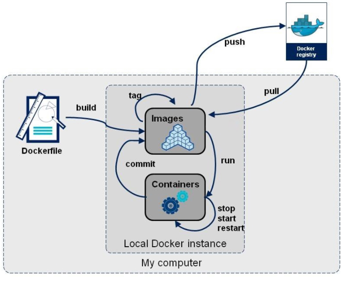
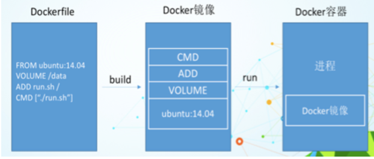
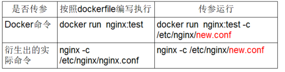

# DockerFile解析

## 1 概述

Dockerfile是用来构建Docker镜像的文本文件，是由一条条构建镜像所需的指令和参数构成的脚本。



**官网**：https://docs.docker.com/engine/reference/builder/

**构建三步骤**：

1. 编写Dockerfile文件
2. docker build 命令构建镜像
3. docker run 镜像 运行容器实例

## 2 DockerFile构建过程解析

### 2.1 Dockerfile内容基础知识

1. 每条保留字指令都**必须为大写字母**且后面要跟随至少一个参数
2. 指令按照从上到下，顺序执行
3. \#表示注释
4. 每条指令都会创建一个新的镜像层并对镜像进行提交

### 2.2 Docker执行Dockerfile的大致流程

1. docker从基础镜像运行一个容器
2. 执行一条指令并对容器作出修改
3. 执行类似docker commit的操作提交一个新的镜像层
4. docker再基于刚提交的镜像运行一个新容器
5. 执行dockerfile中的下一条指令直到所有指令都执行完成

### 2.3 小总结

从应用软件的角度来看，Dockerfile、Docker镜像与Docker容器分别代表软件的三个不同阶段，

- Dockerfile是软件的原材料
- Docker镜像是软件的交付品
- Docker容器则可以认为是软件镜像的运行态，也即依照镜像运行的容器实例

Dockerfile面向开发，Docker镜像成为交付标准，Docker容器则涉及部署与运维，三者缺一不可，合力充当Docker体系的基石。



1. Dockerfile，需要定义一个Dockerfile，Dockerfile定义了进程需要的一切东西。Dockerfile涉及的内容包括执行代码或者是文件、环境变量、依赖包、运行时环境、动态链接库、操作系统的发行版、服务进程和内核进程(当应用进程需要和系统服务和内核进程打交道，这时需要考虑如何设计namespace的权限控制)等等;
2. Docker镜像，在用Dockerfile定义一个文件之后，docker build时会产生一个Docker镜像，当运行 Docker镜像时会真正开始提供服务;
3. Docker容器，容器是直接提供服务的。

## 3 DockerFile常用保留字指令

**参考tomcat8的dockerfile入门**：https://github.com/docker-library/tomcat

**FROM**：基础镜像，当前新镜像是基于哪个镜像的，指定一个已经存在的镜像作为模板，第一条必须是from

**MAINTAINER**：镜像维护者的姓名和邮箱地址

**RUN**：容器构建时需要运行的命令，RUN是在 docker build时运行

```dockerfile
两种格式:
1.shell格式
RUN <命令行命令>
# <命令行命令> 等同于，在终端操作的shell命令。

2.exec格式
RUN ["可执行文件", "参数1", "参数2"]
# 例如：
# RUN ["./test.php", "dev", "offline"] 等价于 RUN ./test.php dev offline
```

**EXPOSE**：当前容器对外暴露出的端口

**WORKDIR**：指定在创建容器后，终端默认登陆的进来工作目录，一个落脚点

**USER**：指定该镜像以什么样的用户去执行，如果都不指定，默认是root

**ENV**：用来在构建镜像过程中设置环境变量

```dockerfile
ENV MY_PATH /usr/mytest

# 这个环境变量可以在后续的任何RUN指令中使用，这就如同在命令前面指定了环境变量前缀一样；
# 也可以在其它指令中直接使用这些环境变量。
# 比如：`WORKDIR $MY_PATH`
```

**ADD**：将宿主机目录下的文件拷贝进镜像且会自动处理URL和解压tar压缩包

**COPY**：类似ADD，拷贝文件和目录到镜像中

```dockerfile
# 将从构建上下文目录中 <源路径> 的文件/目录复制到新的一层的镜像内的 <目标路径> 位置
COPY src dest
COPY ["src", "dest"]
# <src源路径>：源文件或者源目录
# <dest目标路径>：容器内的指定路径，该路径不用事先建好，路径不存在的话，会自动创建。
```

**VOLUME**：容器数据卷，用于数据保存和持久化工作

**CMD**：指定容器启动后的要干的事情（容器启动的命令）

```sh
CMD指令格式和RUN相似，也有两种格式：
shell格式：CMD <命令>
exec格式：CMD["可执行文件", "参数1", "参数2"...]
参数列表格式：CMD["参数1", "参数2"...] 在指定了ENTRYPOINT指令后，用CMD指定具体的参数。
```

**注意：**Dockerfile 中可以有多个 CMD 指令，**但只有最后一个生效，CMD 会被 docker run 之后的参数替换**。

参考官网Tomcat的dockerfile演示讲解：

官网最后一行命令

```dockerfile
EXPOSE 8080
CMD ["catalina.sh", "run"]
```

我们演示自己的覆盖操作

```sh
# CMD ["catalina.sh", "run"] 会被“/bin/bash” 替换掉
docker run -it -p 8080:8080 tomcat /bin/bash
```

它和前面RUN命令的区别

- CMD是在docker run 时运行。
- RUN是在 docker build 时运行。

**ENTRYPOINT**：也是用来指定一个容器启动时要运行的命令

类似于 CMD 指令，**但是ENTRYPOINT不会被docker run后面的命令覆盖， 而且这些命令行参数会被当作参数送给 ENTRYPOINT 指令指定的程序。**

 命令格式：

```dockerfile
ENTRYPOINT ["<executeable>","<param1>","<param2>",...]
```

ENTRYPOINT可以和CMD一起用，一般是变参才会使用 CMD ，这里的 CMD 等于是在给 ENTRYPOINT 传参。

当指定了ENTRYPOINT后，CMD的含义就发生了变化，不再是直接运行其命令而是将CMD的内容作为参数传递给ENTRYPOINT指令，他两个组合会变成

```dockerfile
ENTRYPOINT "<CMD>"
```

案例如下：假设已通过 Dockerfile 构建了 nginx:test 镜像：

```dockerfile
FROM nginx

ENTRYPOINT ["nginx", "-c"] # 定参
CMD ["/etc/nginx/nginx.conf"] # 变参
```

| 是否传参         | 按照dockerfile编写执行         | 传参运行                                       |
| ---------------- | ------------------------------ | ---------------------------------------------- |
| Docker命令       | docker run nginx:test          | docker run nginx:test -c /etc/nginx/nginx.conf |
| 衍生出的实际命令 | nginx -c /etc/nginx/nginx.conf | nginx -c /etc/nginx/nginx.conf                 |



优点：在执行docker run的时候可以指定 ENTRYPOINT 运行所需的参数。

注意：如果 Dockerfile 中如果存在多个 ENTRYPOINT 指令，仅最后一个生效。

## 4 案例

### 4.1 自定义镜像mycentosjava8

**要求**:Centos7镜像具备vim + ifconfig + jdk8

```sh
[root@192 myfile]# pwd
/myfile
[root@192 myfile]# ll
总用量 189500
-rw-r--r--. 1 root root         0 12月 10 22:20 Dockerfile
-rw-r--r--. 1 root root 194042837 12月 10 22:18 jdk-8u202-linux-x64.tar.gz
```

JDK的下载镜像地址：https://www.oracle.com/java/technologies/downloads/#java8

华为镜像地址：[Index of java-local/jdk (huaweicloud.com)](https://repo.huaweicloud.com/java/jdk/)

**编写**

准备编写Dockerfile文件，大写字母D

```dockerfile
FROM centos:7
MAINTAINER gm<gm@126.com>

ENV MYPATH /usr/local
WORKDIR $MYPATH

#安装vim编辑器
RUN yum -y install vim
#安装ifconfig命令查看网络IP
RUN yum -y install net-tools
#安装java8及lib库
RUN yum -y install glibc.i686
RUN mkdir /usr/local/java
#ADD 是相对路径jar,把jdk-8u202-linux-x64.tar.gz添加到容器中,安装包必须要和Dockerfile文件在同一位置
ADD jdk-8u202-linux-x64.tar.gz /usr/local/java/
#配置java环境变量
ENV JAVA_HOME /usr/local/java/jdk1.8.0_202
ENV JRE_HOME $JAVA_HOME/jre
ENV CLASSPATH $JAVA_HOME/lib/dt.jar:$JAVA_HOME/lib/tools.jar:$JRE_HOME/lib:$CLASSPATH
ENV PATH $JAVA_HOME/bin:$PATH

EXPOSE 80

CMD echo $MYPATH
CMD echo "success--------------ok"
CMD /bin/bash
```

**构建**

docker build -t 新镜像名字:TAG .

**注意**：上面TAG后面有个空格，有个点

```sh
[root@192 myfile]# docker build -t centos7java8:1.5 .
[+] Building 15.8s (12/12) FINISHED                                                                                     docker:default
 => [internal] load build definition from Dockerfile                                                                              0.0s
 => => transferring dockerfile: 824B                                                                                              0.0s
 => [internal] load .dockerignore                                                                                                 0.0s
 => => transferring context: 2B                                                                                                   0.0s
 => [internal] load metadata for docker.io/library/centos:7                                                                      15.7s
 => [1/7] FROM docker.io/library/centos:7@sha256:9d4bcbbb213dfd745b58be38b13b996ebb5ac315fe75711bd618426a630e0987                 0.0s
 => [internal] load build context                                                                                                 0.0s
 => => transferring context: 110B                                                                                                 0.0s
 => CACHED [2/7] WORKDIR /usr/local                                                                                               0.0s
 => CACHED [3/7] RUN yum -y install vim                                                                                           0.0s
 => CACHED [4/7] RUN yum -y install net-tools                                                                                     0.0s
 => CACHED [5/7] RUN yum -y install glibc.i686                                                                                    0.0s
 => CACHED [6/7] RUN mkdir /usr/local/java                                                                                        0.0s
 => CACHED [7/7] ADD jdk-8u202-linux-x64.tar.gz /usr/local/java/                                                                  0.0s
 => exporting to image                                                                                                            0.0s
 => => exporting layers                                                                                                           0.0s
 => => writing image sha256:95e10f5755c2f464001e0741aec492655d3801701d313c137d1a964942edb9f2                                      0.0s
 => => naming to docker.io/library/centos7java8:1.5                                                                               0.0s
```

**运行**

docker run -it 新镜像名字:TAG 

```sh
docker run -it centos7java8:1.5 /bin/bash

[root@192 myfile]# docker images
REPOSITORY                     TAG       IMAGE ID       CREATED         SIZE
centos7java8                   1.5       95e10f5755c2   7 minutes ago   1.33GB
192.168.11.132:5000/myubuntu   1.2       776f0b498306   25 hours ago    122MB
tomcat                         latest    fb5657adc892   23 months ago   680MB
mysql                          5.7       c20987f18b13   23 months ago   448MB
registry                       latest    b8604a3fe854   2 years ago     26.2MB
ubuntu                         latest    ba6acccedd29   2 years ago     72.8MB
centos                         latest    5d0da3dc9764   2 years ago     231MB
redis                          6.0.8     16ecd2772934   3 years ago     104MB
[root@192 myfile]# docker run -it centos7java8:1.5 /bin/bash
[root@ec310c9e85b7 local]# pwd
/usr/local
[root@ec310c9e85b7 local]# java -version
java version "1.8.0_202"
Java(TM) SE Runtime Environment (build 1.8.0_202-b08)
Java HotSpot(TM) 64-Bit Server VM (build 25.202-b08, mixed mode)
[root@ec310c9e85b7 local]# ifconfig
eth0: flags=4163<UP,BROADCAST,RUNNING,MULTICAST>  mtu 1500
        inet 172.17.0.2  netmask 255.255.0.0  broadcast 172.17.255.255
        ether 02:42:ac:11:00:02  txqueuelen 0  (Ethernet)
        RX packets 8  bytes 656 (656.0 B)
        RX errors 0  dropped 0  overruns 0  frame 0
        TX packets 0  bytes 0 (0.0 B)
        TX errors 0  dropped 0 overruns 0  carrier 0  collisions 0

lo: flags=73<UP,LOOPBACK,RUNNING>  mtu 65536
        inet 127.0.0.1  netmask 255.0.0.0
        loop  txqueuelen 1000  (Local Loopback)
        RX packets 0  bytes 0 (0.0 B)
        RX errors 0  dropped 0  overruns 0  frame 0
        TX packets 0  bytes 0 (0.0 B)
        TX errors 0  dropped 0 overruns 0  carrier 0  collisions 0

[root@ec310c9e85b7 local]# vim a.txt
[root@ec310c9e85b7 local]# cat a.txt
centos7+java8+vim+ifconfig
```

**再体会下UnionFS（联合文件系统）**

UnionFS（联合文件系统）：Union文件系统（UnionFS）是一种分层、轻量级并且高性能的文件系统，它支持对文件系统的修改作为一次提交来一层层的叠加，同时可以将不同目录挂载到同一个虚拟文件系统下(unite several directories into a single virtual filesystem)。Union 文件系统是 Docker 镜像的基础。镜像可以通过分层来进行继承，基于基础镜像（没有父镜像），可以制作各种具体的应用镜像。

特性：一次同时加载多个文件系统，但从外面看起来，只能看到一个文件系统，联合加载会把各层文件系统叠加起来，这样最终的文件系统会包含所有底层的文件和目录

### 4.2 虚悬镜像

仓库名、标签都是`<none>`的镜像，俗称dangling image

编写一个Dockerfile

```dockerfile
FROM ubuntu
CMD echo 'action is success'
```

构建：docker build .

```sh
[root@192 test]# docker build .
[+] Building 0.1s (5/5) FINISHED                                                                                        docker:default
 => [internal] load build definition from Dockerfile                                                                              0.0s
 => => transferring dockerfile: 135B                                                                                              0.0s
 => [internal] load .dockerignore                                                                                                 0.0s
 => => transferring context: 2B                                                                                                   0.0s
 => [internal] load metadata for docker.io/library/ubuntu:latest                                                                  0.0s
 => [1/1] FROM docker.io/library/ubuntu                                                                                           0.0s
 => exporting to image                                                                                                            0.0s
 => => exporting layers                                                                                                           0.0s
 => => writing image sha256:881b06ce6e2ca7da861f68c50d728757d1477506c7eb073afc2bdb07ce78ae2a                                      0.0s
[root@192 test]# docker images
REPOSITORY                     TAG       IMAGE ID       CREATED          SIZE
centos7java8                   1.5       95e10f5755c2   18 minutes ago   1.33GB
192.168.11.132:5000/myubuntu   1.2       776f0b498306   25 hours ago     122MB
tomcat                         latest    fb5657adc892   23 months ago    680MB
mysql                          5.7       c20987f18b13   23 months ago    448MB
registry                       latest    b8604a3fe854   2 years ago      26.2MB
ubuntu                         latest    ba6acccedd29   2 years ago      72.8MB
<none>                         <none>    881b06ce6e2c   2 years ago      72.8MB
centos                         latest    5d0da3dc9764   2 years ago      231MB
redis                          6.0.8     16ecd2772934   3 years ago      104MB
```

**查看虚悬镜像**

```sh
docker image ls -f dangling=true

[root@192 test]# docker image ls -f dangling=true
REPOSITORY   TAG       IMAGE ID       CREATED       SIZE
<none>       <none>    881b06ce6e2c   2 years ago   72.8MB
```

**删除虚悬镜像**

虚悬镜像已经失去存在价值，可以删除

```sh
docker image prune

[root@192 test]# docker image prune
WARNING! This will remove all dangling images.
Are you sure you want to continue? [y/N] y
Deleted Images:
deleted: sha256:881b06ce6e2ca7da861f68c50d728757d1477506c7eb073afc2bdb07ce78ae2a

Total reclaimed space: 0B
[root@192 test]# docker image ls -f dangling=true
REPOSITORY   TAG       IMAGE ID   CREATED   SIZE
```

### 4.3 自定义镜像myubuntu

编写DockerFile文件

```dockerfile
FROM ubuntu
MAINTAINER gm<gm@126.com>
 
ENV MYPATH /usr/local
WORKDIR $MYPATH
 
RUN apt-get update
RUN apt-get install net-tools
#RUN apt-get install -y iproute2
#RUN apt-get install -y inetutils-ping
 
EXPOSE 80
 
CMD echo $MYPATH
CMD echo "install inconfig cmd into ubuntu success--------------ok"
CMD /bin/bash
```

**构建**

```
docker build -t 新镜像名字:TAG .
```

**运行**

```
docker run -it 新镜像名字:TAG 
```
