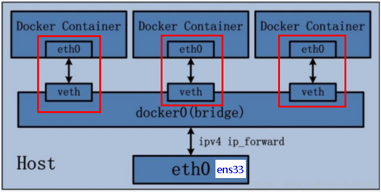
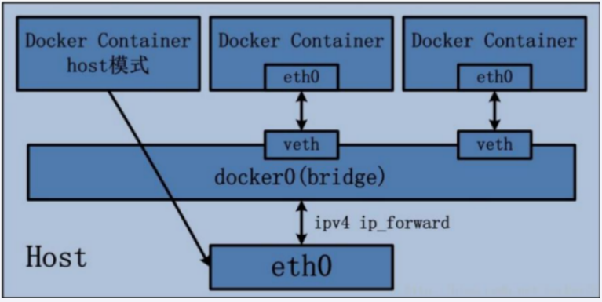
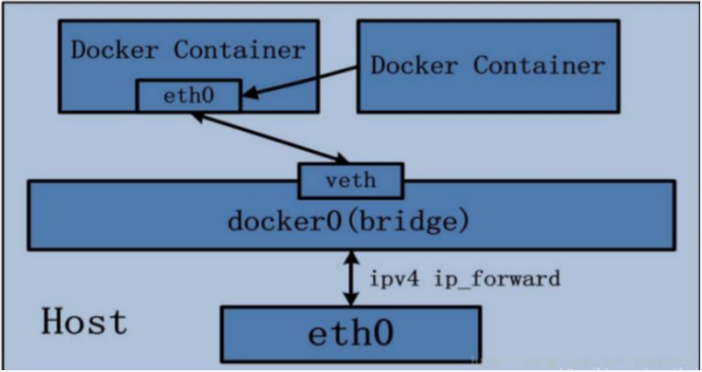

# Docker网络

## 1 概述

**在停止docker时提示：**

```sh
[root@192 ~]# systemctl stop docker
Warning: Stopping docker.service, but it can still be activated by:
  docker.socket
```

**原因：**

```
This is because in addition to the docker.service unit file, there is a docker.socket unit file… this is for socket activation. The warning means if you try to connect to the docker socket while the docker service is not running, then systemd will automatically start docker for you. You can get rid of this by removing /lib/systemd/system/docker.socket… you may also need to remove -H fd:// from the docker.service unit file.
```

**解释**

这是因为除了docker.service单元文件，还有一个docker.socket单元文件…docker.socket这是用于套接字激活。
该警告意味着：如果你试图连接到docker socket，而docker服务没有运行，系统将自动启动docker。

**解决方案**

- 方案一

你可以删除 /lib/systemd/system/docker.socket

从docker中 docker.service 文件 删除 fd://，即remove -H fd://

- 方案二

如果不想被访问时自动启动服务

输入命令：sudo systemctl stop docker.socket

**docker不启动，默认网络情况**

```sh
[root@192 ~]# docker images
Cannot connect to the Docker daemon at unix:///var/run/docker.sock. Is the docker daemon running?
[root@192 ~]# ifconfig
ens33: flags=4163<UP,BROADCAST,RUNNING,MULTICAST>  mtu 1500
        inet 192.168.11.132  netmask 255.255.255.0  broadcast 192.168.11.255
        inet6 fe80::479b:a71c:fa6b:e660  prefixlen 64  scopeid 0x20<link>
        ether 00:50:56:2f:34:83  txqueuelen 1000  (Ethernet)
        RX packets 211  bytes 19674 (19.2 KiB)
        RX errors 0  dropped 0  overruns 0  frame 0
        TX packets 267  bytes 36824 (35.9 KiB)
        TX errors 0  dropped 0 overruns 0  carrier 0  collisions 0

lo: flags=73<UP,LOOPBACK,RUNNING>  mtu 65536
        inet 127.0.0.1  netmask 255.0.0.0
        inet6 ::1  prefixlen 128  scopeid 0x10<host>
        loop  txqueuelen 1000  (Local Loopback)
        RX packets 48  bytes 4080 (3.9 KiB)
        RX errors 0  dropped 0  overruns 0  frame 0
        TX packets 48  bytes 4080 (3.9 KiB)
        TX errors 0  dropped 0 overruns 0  carrier 0  collisions 0

virbr0: flags=4099<UP,BROADCAST,MULTICAST>  mtu 1500
        inet 192.168.122.1  netmask 255.255.255.0  broadcast 192.168.122.255
        ether 52:54:00:50:70:8e  txqueuelen 1000  (Ethernet)
        RX packets 0  bytes 0 (0.0 B)
        RX errors 0  dropped 0  overruns 0  frame 0
        TX packets 0  bytes 0 (0.0 B)
        TX errors 0  dropped 0 overruns 0  carrier 0  collisions 0

```

ens33：192.168.11.132宿主机的地址

lo：local：本地回环链路：127.0.0.1

virbr0：在CentOS7的安装过程中如果有**选择相关虚拟化的的服务安装系统后**，启动网卡时会发现有一个以网桥连接的私网地址的virbr0网卡(virbr0网卡：它还有一个固定的默认IP地址192.168.122.1)，是做虚拟机网桥的使用的，其作用是为连接其上的虚机网卡提供 NAT访问外网的功能。

 我们之前学习Linux安装，勾选安装系统的时候附带了libvirt服务才会生成的一个东西，如果不需要可以直接将libvirtd服务卸载，`yum remove libvirt-libs.x86_64`

```sh
[root@192 ~]# ip addr
1: lo: <LOOPBACK,UP,LOWER_UP> mtu 65536 qdisc noqueue state UNKNOWN group default qlen 1000
    link/loopback 00:00:00:00:00:00 brd 00:00:00:00:00:00
    inet 127.0.0.1/8 scope host lo
       valid_lft forever preferred_lft forever
    inet6 ::1/128 scope host
       valid_lft forever preferred_lft forever
2: ens33: <BROADCAST,MULTICAST,UP,LOWER_UP> mtu 1500 qdisc pfifo_fast state UP group default qlen 1000
    link/ether 00:50:56:2f:34:83 brd ff:ff:ff:ff:ff:ff
    inet 192.168.11.132/24 brd 192.168.11.255 scope global noprefixroute ens33
       valid_lft forever preferred_lft forever
    inet6 fe80::479b:a71c:fa6b:e660/64 scope link noprefixroute
       valid_lft forever preferred_lft forever
3: virbr0: <NO-CARRIER,BROADCAST,MULTICAST,UP> mtu 1500 qdisc noqueue state DOWN group default qlen 1000
    link/ether 52:54:00:50:70:8e brd ff:ff:ff:ff:ff:ff
    inet 192.168.122.1/24 brd 192.168.122.255 scope global virbr0
       valid_lft forever preferred_lft forever
4: virbr0-nic: <BROADCAST,MULTICAST> mtu 1500 qdisc pfifo_fast master virbr0 state DOWN group default qlen 1000
    link/ether 52:54:00:50:70:8e brd ff:ff:ff:ff:ff:ff
```

**docker启动后，网络情况**

会产生一个名为docker0的虚拟网桥

```sh
[root@192 ~]# ifconfig
docker0: flags=4099<UP,BROADCAST,MULTICAST>  mtu 1500
        inet 172.17.0.1  netmask 255.255.0.0  broadcast 172.17.255.255
        ether 02:42:25:b3:56:3b  txqueuelen 0  (Ethernet)
        RX packets 0  bytes 0 (0.0 B)
        RX errors 0  dropped 0  overruns 0  frame 0
        TX packets 0  bytes 0 (0.0 B)
        TX errors 0  dropped 0 overruns 0  carrier 0  collisions 0

ens33: flags=4163<UP,BROADCAST,RUNNING,MULTICAST>  mtu 1500
        inet 192.168.11.132  netmask 255.255.255.0  broadcast 192.168.11.255
        inet6 fe80::479b:a71c:fa6b:e660  prefixlen 64  scopeid 0x20<link>
        ether 00:50:56:2f:34:83  txqueuelen 1000  (Ethernet)
        RX packets 2277  bytes 160994 (157.2 KiB)
        RX errors 0  dropped 0  overruns 0  frame 0
        TX packets 3397  bytes 406350 (396.8 KiB)
        TX errors 0  dropped 0 overruns 0  carrier 0  collisions 0

lo: flags=73<UP,LOOPBACK,RUNNING>  mtu 65536
        inet 127.0.0.1  netmask 255.0.0.0
        inet6 ::1  prefixlen 128  scopeid 0x10<host>
        loop  txqueuelen 1000  (Local Loopback)
        RX packets 48  bytes 4080 (3.9 KiB)
        RX errors 0  dropped 0  overruns 0  frame 0
        TX packets 48  bytes 4080 (3.9 KiB)
        TX errors 0  dropped 0 overruns 0  carrier 0  collisions 0

virbr0: flags=4099<UP,BROADCAST,MULTICAST>  mtu 1500
        inet 192.168.122.1  netmask 255.255.255.0  broadcast 192.168.122.255
        ether 52:54:00:50:70:8e  txqueuelen 1000  (Ethernet)
        RX packets 0  bytes 0 (0.0 B)
        RX errors 0  dropped 0  overruns 0  frame 0
        TX packets 0  bytes 0 (0.0 B)
        TX errors 0  dropped 0 overruns 0  carrier 0  collisions 0
```

查看docker网络模式命令，默认创建3大网络模式。

```sh
[root@192 ~]# docker network ls
NETWORK ID     NAME      DRIVER    SCOPE
747ee8aa1e50   bridge    bridge    local
fe569c6d7d60   host      host      local
3193701f6959   none      null      local
```

## 2 常用基本命令

**All命令**

```sh
[root@192 ~]# docker network --help

Usage:  docker network COMMAND

Manage networks

Commands:
  connect     Connect a container to a network
  create      Create a network
  disconnect  Disconnect a container from a network
  inspect     Display detailed information on one or more networks
  ls          List networks
  prune       Remove all unused networks
  rm          Remove one or more networks

Run 'docker network COMMAND --help' for more information on a command.
```

**创建网络**

```sh
docker network create XXX网络名字

[root@192 ~]# docker network create aa_network
69d5b1e7969b8ab285436b9de26715e5d9762b855f026dc4a22c58fcb5d57bab
```

**查看网络**

```sh
docker network ls

[root@192 ~]# docker network ls
NETWORK ID     NAME         DRIVER    SCOPE
69d5b1e7969b   aa_network   bridge    local
747ee8aa1e50   bridge       bridge    local
fe569c6d7d60   host         host      local
3193701f6959   none         null      local

```

**查看网络源数据**

```sh
docker network inspect XXX网络名字

[root@192 ~]# docker network inspect aa_network
[
    {
        "Name": "aa_network",
        "Id": "69d5b1e7969b8ab285436b9de26715e5d9762b855f026dc4a22c58fcb5d57bab",
        "Created": "2023-12-11T22:30:13.821670767+08:00",
        "Scope": "local",
        "Driver": "bridge",
        "EnableIPv6": false,
        "IPAM": {
            "Driver": "default",
            "Options": {},
            "Config": [
                {
                    "Subnet": "172.18.0.0/16",
                    "Gateway": "172.18.0.1"
                }
            ]
        },
        "Internal": false,
        "Attachable": false,
        "Ingress": false,
        "ConfigFrom": {
            "Network": ""
        },
        "ConfigOnly": false,
        "Containers": {},
        "Options": {},
        "Labels": {}
    }
]
```

**删除网络**

```sh
docker network rm XXX网络名字

[root@192 ~]# docker network rm aa_network
aa_network
```

## 3 作用

容器间的互联和通信以及端口映射

容器IP变动时候可以通过服务名直接网络通信而不受到影响

## 4 网络模式

### 4.1 总体介绍

| 网络模式  | 简介                                                         |
| --------- | ------------------------------------------------------------ |
| bridge    | 为每一个容器分配、设置IP等，并将容器连接到`docker0`<br />虚拟网桥，默认为该模式。 |
| host      | 容器将不会虚拟出自己的网卡，配置自己的IP等，而是使用宿主机的IP和端口。 |
| none      | 容器有独立的Network namespace，但并没有对其进行任何网络设置，如分配veth pair和网桥连接，IP等。 |
| container | 新创建的容器不会创建自己的网卡和配置自己的IP，而是和一个指定的容器共享IP、端口范围等。 |

bridge模式：使用--network bridge指定，默认使用docker0

host模式：使用--network host指定

none模式：使用--network none指定

container模式：使用--network container:NAME或者容器ID指定

### 4.2 容器内默认网络IP生产规则

1、先启动两个ubuntu容器实例

```sh
[root@192 ~]# docker run -it --name u1 ubuntu bash
root@1f23f97fddb0:/# [root@192 ~]#
[root@192 ~]# docker run -it --name u2 ubuntu bash
root@d709730ebe09:/# [root@192 ~]#
[root@192 ~]# docker ps
CONTAINER ID   IMAGE     COMMAND   CREATED          STATUS          PORTS     NAMES
d709730ebe09   ubuntu    "bash"    9 seconds ago    Up 8 seconds              u2
1f23f97fddb0   ubuntu    "bash"    18 seconds ago   Up 17 seconds             u1
```

2、docker inspect 容器ID or 容器名字

```sh
[root@192 ~]# docker inspect u1 | tail -n 20
            "Networks": {
                "bridge": {
                    "IPAMConfig": null,
                    "Links": null,
                    "Aliases": null,
                    "NetworkID": "747ee8aa1e50b138707a1b858b8d5a467a83849ee4258aa54a14c51c7e44eeec",
                    "EndpointID": "a87814307525e47eba7a2ec6512bfcdff758f9e9ec01a476ef54dd8e614928da",
                    "Gateway": "172.17.0.1",
                    "IPAddress": "172.17.0.2",  #u1 IP地址
                    "IPPrefixLen": 16,
                    "IPv6Gateway": "",
                    "GlobalIPv6Address": "",
                    "GlobalIPv6PrefixLen": 0,
                    "MacAddress": "02:42:ac:11:00:02",
                    "DriverOpts": null
                }
            }
        }
    }
]
[root@192 ~]# docker inspect u2 | tail -n 20
            "Networks": {
                "bridge": {
                    "IPAMConfig": null,
                    "Links": null,
                    "Aliases": null,
                    "NetworkID": "747ee8aa1e50b138707a1b858b8d5a467a83849ee4258aa54a14c51c7e44eeec",
                    "EndpointID": "1c71f8d0ef9c2b105232377cd97ceb36be5e96abb8f2ac7767a8d65f987f2129",
                    "Gateway": "172.17.0.1",
                    "IPAddress": "172.17.0.3", #u2 IP地址
                    "IPPrefixLen": 16,
                    "IPv6Gateway": "",
                    "GlobalIPv6Address": "",
                    "GlobalIPv6PrefixLen": 0,
                    "MacAddress": "02:42:ac:11:00:03",
                    "DriverOpts": null
                }
            }
        }
    }
]

```

3、关闭u2实例，新建u3，查看ip变化

```sh
[root@192 ~]# docker stop u2
u2
[root@192 ~]# docker ps
CONTAINER ID   IMAGE     COMMAND   CREATED         STATUS         PORTS     NAMES
1f23f97fddb0   ubuntu    "bash"    4 minutes ago   Up 4 minutes             u1
[root@192 ~]# docker run -it --name u3 ubuntu bash
root@3d293c585a93:/# [root@192 ~]#
[root@192 ~]#
[root@192 ~]# docker inspect u3 | tail -n 20
            "Networks": {
                "bridge": {
                    "IPAMConfig": null,
                    "Links": null,
                    "Aliases": null,
                    "NetworkID": "747ee8aa1e50b138707a1b858b8d5a467a83849ee4258aa54a14c51c7e44eeec",
                    "EndpointID": "f7f75b574cd0bc7ca484c5590ce4ef2497f13e9e067780ede63003028532def5",
                    "Gateway": "172.17.0.1",
                    "IPAddress": "172.17.0.3", #u3 IP地址
                    "IPPrefixLen": 16,
                    "IPv6Gateway": "",
                    "GlobalIPv6Address": "",
                    "GlobalIPv6PrefixLen": 0,
                    "MacAddress": "02:42:ac:11:00:03",
                    "DriverOpts": null
                }
            }
        }
    }
]
```

结论：docker容器内部的ip是有可能会发生改变的

### 4.3 bridge

Docker 服务默认会创建一个 docker0 网桥（其上有一个 docker0 内部接口），该桥接网络的名称为docker0，它在**内核层**连通了其他的物理或虚拟网卡，这就将所有容器和本地主机都放到**同一个物理网络**。Docker 默认指定了 docker0 接口 的 IP 地址和子网掩码，**让主机和容器之间可以通过网桥相互通信。**

```sh
# 查看 bridge 网络的详细信息，并通过 grep 获取名称项

[root@192 ~]# docker network inspect bridge
[
    {
        "Name": "bridge",
        "Id": "747ee8aa1e50b138707a1b858b8d5a467a83849ee4258aa54a14c51c7e44eeec",
        "Created": "2023-12-11T22:23:31.137536958+08:00",
        "Scope": "local",
        "Driver": "bridge",
        "EnableIPv6": false,
        "IPAM": {
            "Driver": "default",
            "Options": null,
            "Config": [
                {
                    "Subnet": "172.17.0.0/16",
                    "Gateway": "172.17.0.1"
                }
            ]
        },
        "Internal": false,
        "Attachable": false,
        "Ingress": false,
        "ConfigFrom": {
            "Network": ""
        },
        "ConfigOnly": false,
        "Containers": {
            "1f23f97fddb04d1ca1fc3653a96608bf27f28d32aab2876a08f5e586c42cc52a": {
                "Name": "u1",
                "EndpointID": "a87814307525e47eba7a2ec6512bfcdff758f9e9ec01a476ef54dd8e614928da",
                "MacAddress": "02:42:ac:11:00:02",
                "IPv4Address": "172.17.0.2/16",
                "IPv6Address": ""
            },
            "3d293c585a93e194eff4f165d629d59bfdb8d1cb49da2afa7bbaf6633819ff50": {
                "Name": "u3",
                "EndpointID": "f7f75b574cd0bc7ca484c5590ce4ef2497f13e9e067780ede63003028532def5",
                "MacAddress": "02:42:ac:11:00:03",
                "IPv4Address": "172.17.0.3/16",
                "IPv6Address": ""
            }
        },
        "Options": {
            "com.docker.network.bridge.default_bridge": "true",
            "com.docker.network.bridge.enable_icc": "true",
            "com.docker.network.bridge.enable_ip_masquerade": "true",
            "com.docker.network.bridge.host_binding_ipv4": "0.0.0.0",
            "com.docker.network.bridge.name": "docker0",
            "com.docker.network.driver.mtu": "1500"
        },
        "Labels": {}
    }
]
[root@192 ~]# docker network inspect bridge | grep name
            "com.docker.network.bridge.name": "docker0",

[root@192 ~]# ifconfig
docker0: flags=4163<UP,BROADCAST,RUNNING,MULTICAST>  mtu 1500
        inet 172.17.0.1  netmask 255.255.0.0  broadcast 172.17.255.255
        inet6 fe80::42:25ff:feb3:563b  prefixlen 64  scopeid 0x20<link>
        ether 02:42:25:b3:56:3b  txqueuelen 0  (Ethernet)
        RX packets 0  bytes 0 (0.0 B)
        RX errors 0  dropped 0  overruns 0  frame 0
        TX packets 13  bytes 1752 (1.7 KiB)
        TX errors 0  dropped 0 overruns 0  carrier 0  collisions 0

[root@192 ~]# ifconfig | grep docker
docker0: flags=4163<UP,BROADCAST,RUNNING,MULTICAST>  mtu 1500        
```

**说明**

1. Docker使用Linux桥接，在宿主机虚拟一个Docker容器网桥(docker0)，Docker启动一个容器时会根据Docker网桥的网段分配给容器一个IP地址，称为Container-IP，同时Docker网桥是每个容器的默认网关。因为在同一宿主机内的容器都接入同一个网桥，这样容器之间就能够通过容器的Container-IP直接通信。
2. docker run 的时候，没有指定network的话默认使用的网桥模式就是bridge，使用的就是docker0。在宿主机ifconfig，就可以看到docker0和自己create的network(后面讲)eth0，eth1，eth2……代表网卡一，网卡二，网卡三……，lo代表127.0.0.1，即localhost，inet addr用来表示网卡的IP地址
3. 网桥docker0创建一对对等虚拟设备接口一个叫veth，另一个叫eth0，成对匹配。

   - 整个宿主机的网桥模式都是docker0，类似一个交换机有一堆接口，每个接口叫veth，在本地主机和容器内分别创建一个虚拟接口，并让他们彼此联通（这样一对接口叫veth pair）；

   - 每个容器实例内部也有一块网卡，每个接口叫eth0；

   - docker0上面的每个veth匹配某个容器实例内部的eth0，两两配对，一一匹配。


通过上述，将宿主机上的所有容器都连接到这个内部网络上，两个容器在同一个网络下,会从这个网关下各自拿到分配的ip，此时两个容器的网络是互通的。



**代码**

docker run -d -p 8081:8080 --name tomcat81 billygoo/tomcat8-jdk8

docker run -d -p 8082:8080 --name tomcat82 billygoo/tomcat8-jdk8

**两两匹配验证**

```sh
[root@192 ~]# docker run -d -p 8081:8080 --name tomcat81 billygoo/tomcat8-jdk8
465ff5f3348023a7568e05725dd552fa67968a90d9240668e2dcb57057eae7c6
[root@192 ~]# docker run -d -p 8082:8080 --name tomcat82 billygoo/tomcat8-jdk8
be3b6163e007001f3d68223bba0850216e81badefaf07e7ddb9fdb302b69dda7
[root@192 ~]# docker ps
CONTAINER ID   IMAGE                   COMMAND             CREATED          STATUS          PORTS                                       NAMES
be3b6163e007   billygoo/tomcat8-jdk8   "catalina.sh run"   11 seconds ago   Up 10 seconds   0.0.0.0:8082->8080/tcp, :::8082->8080/tcp   tomcat82
465ff5f33480   billygoo/tomcat8-jdk8   "catalina.sh run"   15 seconds ago   Up 14 seconds   0.0.0.0:8081->8080/tcp, :::8081->8080/tcp   tomcat81
[root@192 ~]# ip addr | tail -n 8
18: veth65f09a9@if17: <BROADCAST,MULTICAST,UP,LOWER_UP> mtu 1500 qdisc noqueue master docker0 state UP group default
    link/ether ba:c9:57:8a:cb:38 brd ff:ff:ff:ff:ff:ff link-netnsid 0
    inet6 fe80::b8c9:57ff:fe8a:cb38/64 scope link
       valid_lft forever preferred_lft forever
20: vethde93240@if19: <BROADCAST,MULTICAST,UP,LOWER_UP> mtu 1500 qdisc noqueue master docker0 state UP group default
    link/ether 6a:f7:31:bc:2b:9b brd ff:ff:ff:ff:ff:ff link-netnsid 1
    inet6 fe80::68f7:31ff:febc:2b9b/64 scope link
       valid_lft forever preferred_lft forever

[root@192 ~]# docker exec -it tomcat81 bash
root@465ff5f33480:/usr/local/tomcat# ip addr
1: lo: <LOOPBACK,UP,LOWER_UP> mtu 65536 qdisc noqueue state UNKNOWN group default qlen 1000
    link/loopback 00:00:00:00:00:00 brd 00:00:00:00:00:00
    inet 127.0.0.1/8 scope host lo
       valid_lft forever preferred_lft forever
17: eth0@if18: <BROADCAST,MULTICAST,UP,LOWER_UP> mtu 1500 qdisc noqueue state UP group default
    link/ether 02:42:ac:11:00:02 brd ff:ff:ff:ff:ff:ff link-netnsid 0
    inet 172.17.0.2/16 brd 172.17.255.255 scope global eth0
       valid_lft forever preferred_lft forever
root@465ff5f33480:/usr/local/tomcat# exit
exit

[root@192 ~]# docker exec -it tomcat82 bash
root@be3b6163e007:/usr/local/tomcat# ip addr
1: lo: <LOOPBACK,UP,LOWER_UP> mtu 65536 qdisc noqueue state UNKNOWN group default qlen 1000
    link/loopback 00:00:00:00:00:00 brd 00:00:00:00:00:00
    inet 127.0.0.1/8 scope host lo
       valid_lft forever preferred_lft forever
19: eth0@if20: <BROADCAST,MULTICAST,UP,LOWER_UP> mtu 1500 qdisc noqueue state UP group default
    link/ether 02:42:ac:11:00:03 brd ff:ff:ff:ff:ff:ff link-netnsid 0
    inet 172.17.0.3/16 brd 172.17.255.255 scope global eth0
       valid_lft forever preferred_lft forever

```

### 4.4 host

直接使用宿主机的 IP 地址与外界进行通信，不再需要额外进行NAT 转换。

容器将**不会获得**一个独立的Network Namespace， 而是和宿主机共用一个Network Namespace。**容器将不会虚拟出自己的网卡而是使用宿主机的IP和端口。**



**告警代码**：docker run -d -p 8083:8080 --network host --name tomcat83 billygoo/tomcat8-jdk8

```sh
[root@192 ~]# docker run -d -p 8083:8080 --network host --name tomcat83 billygoo/tomcat8-jdk8
WARNING: Published ports are discarded when using host network mode
d37d287674777e4a5a70887ac0d070e6ef634e793b8e01eb7b050ba455283031
[root@192 ~]# docker ps
CONTAINER ID   IMAGE                   COMMAND             CREATED          STATUS          PORTS                                       NAMES
d37d28767477   billygoo/tomcat8-jdk8   "catalina.sh run"   6 seconds ago    Up 5 seconds                                                tomcat83
be3b6163e007   billygoo/tomcat8-jdk8   "catalina.sh run"   13 minutes ago   Up 13 minutes   0.0.0.0:8082->8080/tcp, :::8082->8080/tcp   tomcat82
465ff5f33480   billygoo/tomcat8-jdk8   "catalina.sh run"   13 minutes ago   Up 13 minutes   0.0.0.0:8081->8080/tcp, :::8081->8080/tcp   tomcat81
```

**问题：**docke启动时遇见标题中的警告

**原因：**docker启动时指定--network=host或-net=host，如果还指定了-p映射端口，那这个时候就会有此警告，并且通过-p设置的参数将不会起到任何作用，端口号会以主机端口号为主，重复时则递增。

**解决:**解决的办法就是使用docker的其他网络模式，例如--network=bridge，这样就可以解决问题，或者直接无视


**正确代码**：docker run -d --network host --name tomcat83 billygoo/tomcat8-jdk8

```sh
[root@192 ~]# docker run -d --network host --name tomcat83 billygoo/tomcat8-jdk8
44b01b732afd649d74101aa9b30aa0996d30b9043f900a418172ef2f922bdb28
[root@192 ~]# docker ps
CONTAINER ID   IMAGE                   COMMAND             CREATED          STATUS          PORTS                                       NAMES
44b01b732afd   billygoo/tomcat8-jdk8   "catalina.sh run"   10 seconds ago   Up 9 seconds                                                tomcat83
be3b6163e007   billygoo/tomcat8-jdk8   "catalina.sh run"   17 minutes ago   Up 17 minutes   0.0.0.0:8082->8080/tcp, :::8082->8080/tcp   tomcat82
465ff5f33480   billygoo/tomcat8-jdk8   "catalina.sh run"   17 minutes ago   Up 17 minutes   0.0.0.0:8081->8080/tcp, :::8081->8080/tcp   tomcat81
```

**查看宿主机Ip地址发现没有新增的地址**

```sh
[root@192 ~]# ip addr
1: lo: <LOOPBACK,UP,LOWER_UP> mtu 65536 qdisc noqueue state UNKNOWN group default qlen 1000
    link/loopback 00:00:00:00:00:00 brd 00:00:00:00:00:00
    inet 127.0.0.1/8 scope host lo
       valid_lft forever preferred_lft forever
    inet6 ::1/128 scope host
       valid_lft forever preferred_lft forever
2: ens33: <BROADCAST,MULTICAST,UP,LOWER_UP> mtu 1500 qdisc pfifo_fast state UP group default qlen 1000
    link/ether 00:50:56:2f:34:83 brd ff:ff:ff:ff:ff:ff
    inet 192.168.11.132/24 brd 192.168.11.255 scope global noprefixroute ens33
       valid_lft forever preferred_lft forever
    inet6 fe80::479b:a71c:fa6b:e660/64 scope link noprefixroute
       valid_lft forever preferred_lft forever
3: virbr0: <NO-CARRIER,BROADCAST,MULTICAST,UP> mtu 1500 qdisc noqueue state DOWN group default qlen 1000
    link/ether 52:54:00:50:70:8e brd ff:ff:ff:ff:ff:ff
    inet 192.168.122.1/24 brd 192.168.122.255 scope global virbr0
       valid_lft forever preferred_lft forever
4: virbr0-nic: <BROADCAST,MULTICAST> mtu 1500 qdisc pfifo_fast master virbr0 state DOWN group default qlen 1000
    link/ether 52:54:00:50:70:8e brd ff:ff:ff:ff:ff:ff
5: docker0: <BROADCAST,MULTICAST,UP,LOWER_UP> mtu 1500 qdisc noqueue state UP group default
    link/ether 02:42:25:b3:56:3b brd ff:ff:ff:ff:ff:ff
    inet 172.17.0.1/16 brd 172.17.255.255 scope global docker0
       valid_lft forever preferred_lft forever
    inet6 fe80::42:25ff:feb3:563b/64 scope link
       valid_lft forever preferred_lft forever
18: veth65f09a9@if17: <BROADCAST,MULTICAST,UP,LOWER_UP> mtu 1500 qdisc noqueue master docker0 state UP group default
    link/ether ba:c9:57:8a:cb:38 brd ff:ff:ff:ff:ff:ff link-netnsid 0
    inet6 fe80::b8c9:57ff:fe8a:cb38/64 scope link
       valid_lft forever preferred_lft forever
20: vethde93240@if19: <BROADCAST,MULTICAST,UP,LOWER_UP> mtu 1500 qdisc noqueue master docker0 state UP group default
    link/ether 6a:f7:31:bc:2b:9b brd ff:ff:ff:ff:ff:ff link-netnsid 1
    inet6 fe80::68f7:31ff:febc:2b9b/64 scope link
       valid_lft forever preferred_lft forever
```

**进入容器内部查看网络配置**：网络配置与宿主机网络配置相同，说明用的宿主机的网络

```sh
[root@192 ~]# docker exec -it tomcat83 bash
root@192:/usr/local/tomcat# ip addr
1: lo: <LOOPBACK,UP,LOWER_UP> mtu 65536 qdisc noqueue state UNKNOWN group default qlen 1000
    link/loopback 00:00:00:00:00:00 brd 00:00:00:00:00:00
    inet 127.0.0.1/8 scope host lo
       valid_lft forever preferred_lft forever
    inet6 ::1/128 scope host
       valid_lft forever preferred_lft forever
2: ens33: <BROADCAST,MULTICAST,UP,LOWER_UP> mtu 1500 qdisc pfifo_fast state UP group default qlen 1000
    link/ether 00:50:56:2f:34:83 brd ff:ff:ff:ff:ff:ff
    inet 192.168.11.132/24 brd 192.168.11.255 scope global noprefixroute ens33
       valid_lft forever preferred_lft forever
    inet6 fe80::479b:a71c:fa6b:e660/64 scope link noprefixroute
       valid_lft forever preferred_lft forever
3: virbr0: <NO-CARRIER,BROADCAST,MULTICAST,UP> mtu 1500 qdisc noqueue state DOWN group default qlen 1000
    link/ether 52:54:00:50:70:8e brd ff:ff:ff:ff:ff:ff
    inet 192.168.122.1/24 brd 192.168.122.255 scope global virbr0
       valid_lft forever preferred_lft forever
4: virbr0-nic: <BROADCAST,MULTICAST> mtu 1500 qdisc pfifo_fast master virbr0 state DOWN group default qlen 1000
    link/ether 52:54:00:50:70:8e brd ff:ff:ff:ff:ff:ff
5: docker0: <BROADCAST,MULTICAST,UP,LOWER_UP> mtu 1500 qdisc noqueue state UP group default
    link/ether 02:42:25:b3:56:3b brd ff:ff:ff:ff:ff:ff
    inet 172.17.0.1/16 brd 172.17.255.255 scope global docker0
       valid_lft forever preferred_lft forever
    inet6 fe80::42:25ff:feb3:563b/64 scope link
       valid_lft forever preferred_lft forever
18: veth65f09a9@if17: <BROADCAST,MULTICAST,UP,LOWER_UP> mtu 1500 qdisc noqueue master docker0 state UP group default
    link/ether ba:c9:57:8a:cb:38 brd ff:ff:ff:ff:ff:ff link-netnsid 0
    inet6 fe80::b8c9:57ff:fe8a:cb38/64 scope link
       valid_lft forever preferred_lft forever
20: vethde93240@if19: <BROADCAST,MULTICAST,UP,LOWER_UP> mtu 1500 qdisc noqueue master docker0 state UP group default
    link/ether 6a:f7:31:bc:2b:9b brd ff:ff:ff:ff:ff:ff link-netnsid 1
    inet6 fe80::68f7:31ff:febc:2b9b/64 scope link
       valid_lft forever preferred_lft forever
root@192:/usr/local/tomcat# exit
exit
```

**看容器实例内部**

```sh
[root@192 ~]# docker inspect tomcat83 | tail -n 20
            "Networks": {
                "host": {
                    "IPAMConfig": null,
                    "Links": null,
                    "Aliases": null,
                    "NetworkID": "fe569c6d7d6098d04f104ccdf8f2551c5e079f02d7f7bbe99410ffda1ddfc40c",
                    "EndpointID": "5eb4585c607b397847421494441c7d13f600b1cc9ed687aaf5781ac316591f55",
                    "Gateway": "",
                    "IPAddress": "",
                    "IPPrefixLen": 0,
                    "IPv6Gateway": "",
                    "GlobalIPv6Address": "",
                    "GlobalIPv6PrefixLen": 0,
                    "MacAddress": "",
                    "DriverOpts": null
                }
            }
        }
    }
]
```

**没有设置-p的端口映射了，如何访问启动的tomcat83？？**

http://宿主机IP:8080/

http://192.168.11.132:8080/

在CentOS里面用默认的火狐浏览器访问容器内的tomcat83看到访问成功，因为此时容器的IP借用主机的，

所以容器共享宿主机网络IP，这样的好处是**外部主机与容器可以直接通信**。

### 4.5 none

禁用网络功能，只有lo标识(就是127.0.0.1表示本地回环)

在none模式下，并不为Docker容器进行任何网络配置。 

也就是说，这个Docker容器没有网卡、IP、路由等信息，只有一个lo

需要我们自己为Docker容器添加网卡、配置IP等。

**代码**

docker run -d -p 8084:8080 --network none --name tomcat84 billygoo/tomcat8-jdk8

```sh
[root@192 ~]# docker run -d -p 8084:8080 --network none --name tomcat84 billygoo/tomcat8-jdk8
e4ff2fa83ad68ac09c8fc510a82b8a147ce5b82e270dd5eb28646320efbbd7a0
[root@192 ~]# docker ps
CONTAINER ID   IMAGE                   COMMAND             CREATED          STATUS          PORTS                                       NAMES
e4ff2fa83ad6   billygoo/tomcat8-jdk8   "catalina.sh run"   13 seconds ago   Up 12 seconds                                               tomcat84
44b01b732afd   billygoo/tomcat8-jdk8   "catalina.sh run"   10 minutes ago   Up 10 minutes                                               tomcat83
be3b6163e007   billygoo/tomcat8-jdk8   "catalina.sh run"   27 minutes ago   Up 27 minutes   0.0.0.0:8082->8080/tcp, :::8082->8080/tcp   tomcat82
465ff5f33480   billygoo/tomcat8-jdk8   "catalina.sh run"   27 minutes ago   Up 27 minutes   0.0.0.0:8081->8080/tcp, :::8081->8080/tcp   tomcat81
```

**进入容器内部查看**

```sh
[root@192 ~]# docker exec -it tomcat84 bash
root@e4ff2fa83ad6:/usr/local/tomcat# ip addr
1: lo: <LOOPBACK,UP,LOWER_UP> mtu 65536 qdisc noqueue state UNKNOWN group default qlen 1000
    link/loopback 00:00:00:00:00:00 brd 00:00:00:00:00:00
    inet 127.0.0.1/8 scope host lo
       valid_lft forever preferred_lft forever
```

**在容器外部查看**

```sh
[root@192 ~]# docker inspect tomcat84 | tail -n 20
            "Networks": {
                "none": {
                    "IPAMConfig": null,
                    "Links": null,
                    "Aliases": null,
                    "NetworkID": "3193701f69596da933ed9da24232dd4c97bd4a945441f3e459b5ca3e60c2108d",
                    "EndpointID": "24342ac95aee739d6c11fab4f0d6c1a34835bcbbeeeffab8e63ed8a43958b8b1",
                    "Gateway": "",
                    "IPAddress": "",
                    "IPPrefixLen": 0,
                    "IPv6Gateway": "",
                    "GlobalIPv6Address": "",
                    "GlobalIPv6PrefixLen": 0,
                    "MacAddress": "",
                    "DriverOpts": null
                }
            }
        }
    }
]
```

### 4.6 container

新建的容器和已经存在的一个容器共享一个网络ip配置而不是和宿主机共享。新创建的容器不会创建自己的网卡、配置自己的IP，而是和一个指定的容器共享IP、端口范围等。同样，两个容器除了网络方面，其他的如文件系统、进程列表等还是隔离的。



**错误案例**：

docker run -d -p 8085:8080 --name tomcat85 billygoo/tomcat8-jdk8

docker run -d -p 8086:8080 --network container:tomcat85 --name tomcat86 billygoo/tomcat8-jdk8

**运行结果**

```sh
[root@192 ~]# docker run -d -p 8085:8080 --name tomcat85 billygoo/tomcat8-jdk8
a4ed5b8dcd2d51868a8e5eff932c0d3cd63e8a797252004b726c0d4ebb3b5d20
[root@192 ~]# docker run -d -p 8086:8080 --network container:tomcat85 --name tomcat86 billygoo/tomcat8-jdk8
docker: Error response from daemon: conflicting options: port publishing and the container type network mode.
See 'docker run --help'.
```

相当于tomcat86和tomcat85公用同一个ip同一个端口，导致端口冲突

本案例用tomcat演示不合适

换一个镜像给大家演示

**正确案例**：

**Alpine操作系统是一个面向安全的轻型 Linux发行版**

Alpine Linux 是一款独立的、非商业的通用 Linux 发行版，专为追求安全性、简单性和资源效率的用户而设计。 可能很多人没听说过这个 Linux 发行版本，但是经常用 Docker 的朋友可能都用过，因为他小，简单，安全而著称，所以作为基础镜像是非常好的一个选择，可谓是麻雀虽小但五脏俱全，镜像非常小巧，不到 6M的大小，所以特别适合容器打包。

```sh
docker run -it                             --name alpine1 alpine /bin/sh
docker run -it --network container:alpine1 --name alpine2 alpine /bin/sh
```

**运行结果，验证共用搭桥**

```sh
[root@192 ~]# docker run -it                             --name alpine1 alpine /bin/sh
/ # ipaddr
1: lo: <LOOPBACK,UP,LOWER_UP> mtu 65536 qdisc noqueue state UNKNOWN qlen 1000
    link/loopback 00:00:00:00:00:00 brd 00:00:00:00:00:00
    inet 127.0.0.1/8 scope host lo
       valid_lft forever preferred_lft forever
23: eth0@if24: <BROADCAST,MULTICAST,UP,LOWER_UP,M-DOWN> mtu 1500 qdisc noqueue state UP
    link/ether 02:42:ac:11:00:02 brd ff:ff:ff:ff:ff:ff
    inet 172.17.0.2/16 brd 172.17.255.255 scope global eth0
       valid_lft forever preferred_lft forever
/ #

[root@192 ~]# docker run -it --network container:alpine1 --name alpine2 alpine /bin/sh
/ # ip addr
1: lo: <LOOPBACK,UP,LOWER_UP> mtu 65536 qdisc noqueue state UNKNOWN qlen 1000
    link/loopback 00:00:00:00:00:00 brd 00:00:00:00:00:00
    inet 127.0.0.1/8 scope host lo
       valid_lft forever preferred_lft forever
23: eth0@if24: <BROADCAST,MULTICAST,UP,LOWER_UP,M-DOWN> mtu 1500 qdisc noqueue state UP
    link/ether 02:42:ac:11:00:02 brd ff:ff:ff:ff:ff:ff
    inet 172.17.0.2/16 brd 172.17.255.255 scope global eth0
       valid_lft forever preferred_lft forever
/ #

```

**假如此时关闭alpine1，再看看alpine2**

```sh
[root@192 ~]# docker ps
CONTAINER ID   IMAGE     COMMAND     CREATED         STATUS         PORTS     NAMES
61623d40a9bf   alpine    "/bin/sh"   2 minutes ago   Up 2 minutes             alpine2
```

**23: eth0@if24: 消失了**

```sh
[root@192 ~]# docker run -it --network container:alpine1 --name alpine2 alpine /bin/sh
/ # ip addr
1: lo: <LOOPBACK,UP,LOWER_UP> mtu 65536 qdisc noqueue state UNKNOWN qlen 1000
    link/loopback 00:00:00:00:00:00 brd 00:00:00:00:00:00
    inet 127.0.0.1/8 scope host lo
       valid_lft forever preferred_lft forever
23: eth0@if24: <BROADCAST,MULTICAST,UP,LOWER_UP,M-DOWN> mtu 1500 qdisc noqueue state UP
    link/ether 02:42:ac:11:00:02 brd ff:ff:ff:ff:ff:ff
    inet 172.17.0.2/16 brd 172.17.255.255 scope global eth0
       valid_lft forever preferred_lft forever
/ # ip addr
1: lo: <LOOPBACK,UP,LOWER_UP> mtu 65536 qdisc noqueue state UNKNOWN qlen 1000
    link/loopback 00:00:00:00:00:00 brd 00:00:00:00:00:00
    inet 127.0.0.1/8 scope host lo
       valid_lft forever preferred_lft forever
/ #
```

### 4.7 自定义网络

#### before

```sh
docker run -d -p 8081:8080 --name tomcat81 billygoo/tomcat8-jdk8
docker run -d -p 8082:8080 --name tomcat82 billygoo/tomcat8-jdk8
```

上述成功启动并用docker exec进入各自容器实例内部

**按照IP地址ping是OK的**

```sh
[root@192 ~]# docker exec -it tomcat81 bash
root@c0994243389a:/usr/local/tomcat# ip addr
1: lo: <LOOPBACK,UP,LOWER_UP> mtu 65536 qdisc noqueue state UNKNOWN group default qlen 1000
    link/loopback 00:00:00:00:00:00 brd 00:00:00:00:00:00
    inet 127.0.0.1/8 scope host lo
       valid_lft forever preferred_lft forever
25: eth0@if26: <BROADCAST,MULTICAST,UP,LOWER_UP> mtu 1500 qdisc noqueue state UP group default
    link/ether 02:42:ac:11:00:02 brd ff:ff:ff:ff:ff:ff link-netnsid 0
    inet 172.17.0.2/16 brd 172.17.255.255 scope global eth0
       valid_lft forever preferred_lft forever
root@c0994243389a:/usr/local/tomcat# ping 172.17.0.3
PING 172.17.0.3 (172.17.0.3) 56(84) bytes of data.
64 bytes from 172.17.0.3: icmp_seq=1 ttl=64 time=0.067 ms
64 bytes from 172.17.0.3: icmp_seq=2 ttl=64 time=0.098 ms
64 bytes from 172.17.0.3: icmp_seq=3 ttl=64 time=0.095 ms
^C
--- 172.17.0.3 ping statistics ---
4 packets transmitted, 4 received, 0% packet loss, time 3005ms
rtt min/avg/max/mdev = 0.067/0.084/0.098/0.014 ms
```

```sh
[root@192 ~]# docker exec -it tomcat82 bash
root@5e8e72fc7988:/usr/local/tomcat# ip addr
1: lo: <LOOPBACK,UP,LOWER_UP> mtu 65536 qdisc noqueue state UNKNOWN group default qlen 1000
    link/loopback 00:00:00:00:00:00 brd 00:00:00:00:00:00
    inet 127.0.0.1/8 scope host lo
       valid_lft forever preferred_lft forever
27: eth0@if28: <BROADCAST,MULTICAST,UP,LOWER_UP> mtu 1500 qdisc noqueue state UP group default
    link/ether 02:42:ac:11:00:03 brd ff:ff:ff:ff:ff:ff link-netnsid 0
    inet 172.17.0.3/16 brd 172.17.255.255 scope global eth0
       valid_lft forever preferred_lft forever
root@5e8e72fc7988:/usr/local/tomcat# ping 172.17.0.2
PING 172.17.0.2 (172.17.0.2) 56(84) bytes of data.
64 bytes from 172.17.0.2: icmp_seq=1 ttl=64 time=0.084 ms
64 bytes from 172.17.0.2: icmp_seq=2 ttl=64 time=0.097 ms
64 bytes from 172.17.0.2: icmp_seq=3 ttl=64 time=0.120 ms
^C
--- 172.17.0.2 ping statistics ---
7 packets transmitted, 7 received, 0% packet loss, time 6007ms
rtt min/avg/max/mdev = 0.074/0.091/0.120/0.014 ms
```

按照服务名ping，结果：Name or service not known

```sh
root@c0994243389a:/usr/local/tomcat# ping tomcat82
ping: tomcat82: Name or service not known

root@5e8e72fc7988:/usr/local/tomcat# ping tomcat81
ping: tomcat81: Name or service not known
```

#### after

自定义桥接网络，自定义网络默认使用的是桥接网络bridge

**新建自定义网络gm_network**

```sh
[root@192 ~]# docker network ls
NETWORK ID     NAME      DRIVER    SCOPE
747ee8aa1e50   bridge    bridge    local
fe569c6d7d60   host      host      local
3193701f6959   none      null      local
[root@192 ~]# docker network create gm_network
1e0f05386b5b0fec62f600365bd4f7fe07692c4c0ab9937a130a049830345137
[root@192 ~]# docker network ls
NETWORK ID     NAME         DRIVER    SCOPE
747ee8aa1e50   bridge       bridge    local
1e0f05386b5b   gm_network   bridge    local
fe569c6d7d60   host         host      local
3193701f6959   none         null      local
```

**新建容器加入上一步新建的自定义网络**

```sh
docker run -d -p 8081:8080 --network gm_network --name tomcat81 billygoo/tomcat8-jdk8
docker run -d -p 8082:8080 --network gm_network --name tomcat82 billygoo/tomcat8-jdk8
```

**互相ping测试**

```sh
[root@192 ~]# docker ps
CONTAINER ID   IMAGE                   COMMAND             CREATED          STATUS          PORTS                                       NAMES
c60e474c0503   billygoo/tomcat8-jdk8   "catalina.sh run"   26 seconds ago   Up 26 seconds   0.0.0.0:8082->8080/tcp, :::8082->8080/tcp   tomcat82
e4c900d68bd5   billygoo/tomcat8-jdk8   "catalina.sh run"   45 seconds ago   Up 44 seconds   0.0.0.0:8081->8080/tcp, :::8081->8080/tcp   tomcat81

[root@192 ~]# docker exec -it tomcat81 bash
root@e4c900d68bd5:/usr/local/tomcat# ping tomcat82
PING tomcat82 (172.19.0.3) 56(84) bytes of data.
64 bytes from tomcat82.gm_network (172.19.0.3): icmp_seq=1 ttl=64 time=0.210 ms
64 bytes from tomcat82.gm_network (172.19.0.3): icmp_seq=2 ttl=64 time=0.070 ms
64 bytes from tomcat82.gm_network (172.19.0.3): icmp_seq=3 ttl=64 time=0.076 ms
^C
--- tomcat82 ping statistics ---
3 packets transmitted, 3 received, 0% packet loss, time 2003ms
rtt min/avg/max/mdev = 0.070/0.118/0.210/0.065 ms
root@e4c900d68bd5:/usr/local/tomcat#


root@c60e474c0503:/usr/local/tomcat# ping tomcat81
PING tomcat81 (172.19.0.2) 56(84) bytes of data.
64 bytes from tomcat81.gm_network (172.19.0.2): icmp_seq=1 ttl=64 time=0.060 ms
64 bytes from tomcat81.gm_network (172.19.0.2): icmp_seq=2 ttl=64 time=0.072 ms
64 bytes from tomcat81.gm_network (172.19.0.2): icmp_seq=3 ttl=64 time=0.085 ms
^C
--- tomcat81 ping statistics ---
3 packets transmitted, 3 received, 0% packet loss, time 2001ms
rtt min/avg/max/mdev = 0.060/0.072/0.085/0.012 ms
root@c60e474c0503:/usr/local/tomcat#
```

**结论：自定义网络本身就维护好了主机名和ip的对应关系（ip和域名都能通）**

**结论：自定义网络本身就维护好了主机名和ip的对应关系（ip和域名都能通）**

**结论：自定义网络本身就维护好了主机名和ip的对应关系（ip和域名都能通）**


