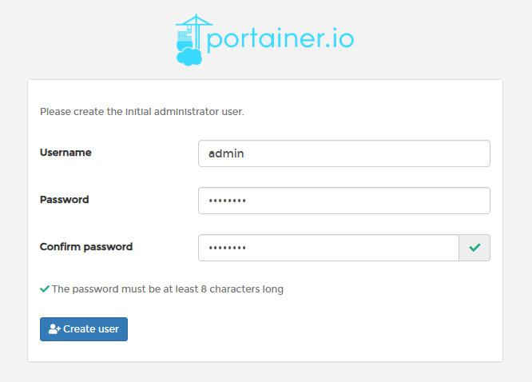
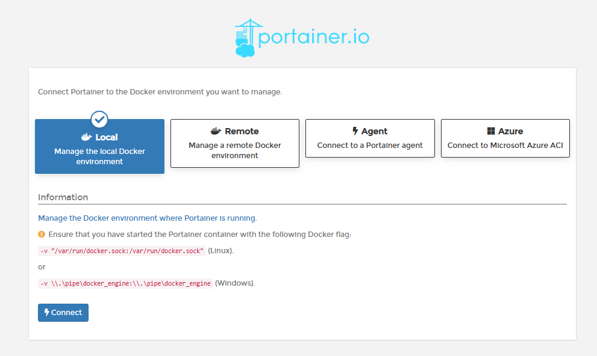
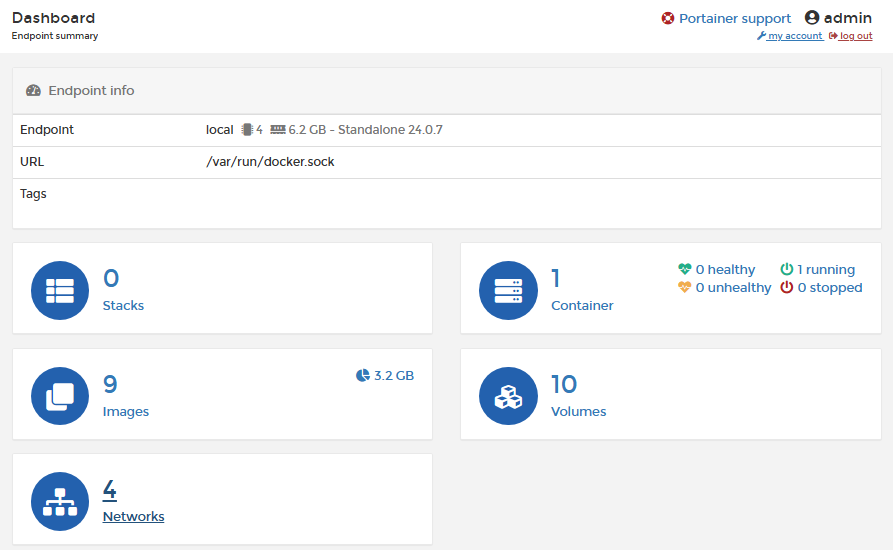

# Docker轻量级可视化工具Portainer

## 1 概述

Portainer 是一款轻量级的应用，它提供了图形化界面，用于方便地管理Docker环境，包括单机环境和集群环境。

**官网**：

https://www.portainer.io/

https://docs.portainer.io/v/ce-2.9/start/install/server/docker/linux

## 1 安装步骤

### docker命令安装

```bash
docker run -d -p 8000:8000 -p 9000:9000 \
--name portainer --restart=always \
-v /var/run/docker.sock:/var/run/docker.sock \
-v portainer_data:/data portainer/portainer 

[root@192 mydocker]# docker search portainer
NAME                                  DESCRIPTION                                      STARS     OFFICIAL   AUTOMATED
portainer/portainer                   This Repo is now deprecated, use portainer/p…   2475
portainer/portainer-ce                Portainer CE - a lightweight service deliver…   2094
portainer/agent                       An agent used to manage all the resources in…   221

[root@192 mydocker]# docker run -d -p 8000:8000 -p 9000:9000 \
> --name portainer --restart=always \
> -v /var/run/docker.sock:/var/run/docker.sock \
> -v portainer_data:/data portainer/portainer
Unable to find image 'portainer/portainer:latest' locally
latest: Pulling from portainer/portainer
94cfa856b2b1: Pull complete
49d59ee0881a: Pull complete
a2300fd28637: Pull complete
Digest: sha256:fb45b43738646048a0a0cc74fcee2865b69efde857e710126084ee5de9be0f3f
Status: Downloaded newer image for portainer/portainer:latest
e95ed0657283e0d4adebcda48f9030d2ce74bf0bc3640c315d5339dd32e70cee
[root@192 mydocker]# docker ps
CONTAINER ID   IMAGE                 COMMAND        CREATED              STATUS              PORTS                                                                                  NAMES
e95ed0657283   portainer/portainer   "/portainer"   About a minute ago   Up About a minute   0.0.0.0:8000->8000/tcp, :::8000->8000/tcp, 0.0.0.0:9000->9000/tcp, :::9000->9000/tcp   portainer
```

### 登录

访问地址：http://192.168.11.132:9000/

第一次登录需创建admin，用户名用默认admin，密码记得8位，随便写。



设置admin用户和密码后首次登陆，选择local，监控本地的docker引擎



选择local选项卡后，本地docker详细信息展示：



上一步的图形展示，能想得起对应命令吗？

```sh
[root@192 mydocker]# docker system df
TYPE            TOTAL     ACTIVE    SIZE      RECLAIMABLE
Images          9         1         2.509GB   2.43GB (96%)
Containers      1         1         0B        0B
Local Volumes   10        1         269.5MB   269.3MB (99%)
Build Cache     35        0         1.433GB   1.433GB
```

## 登陆并演示介绍常用操作case