# Docker容器监控之 CAdvisor+InfluxDB+Granfana

## 1 问题

**docker stats命令的结果**

```sh
[root@192 mydocker]# docker ps
CONTAINER ID   IMAGE                 COMMAND                   CREATED          STATUS          PORTS                                                                                  NAMES
d66fd4e6be4e   gm_docker:1.7         "java -jar /gm_docke…"   3 minutes ago    Up 3 minutes    0.0.0.0:6001->6001/tcp, :::6001->6001/tcp                                              ms01
1755e36695ea   redis:6.0.8           "docker-entrypoint.s…"   3 minutes ago    Up 3 minutes    0.0.0.0:6379->6379/tcp, :::6379->6379/tcp                                              mydocker-redis-1
592d9312e1db   mysql:5.7             "docker-entrypoint.s…"   3 minutes ago    Up 3 minutes    0.0.0.0:3306->3306/tcp, :::3306->3306/tcp, 33060/tcp                                   mydocker-mysql-1
41548b90e8a8   nginx:latest          "/docker-entrypoint.…"   13 minutes ago   Up 13 minutes   0.0.0.0:80->80/tcp, :::80->80/tcp                                                      mynginx
e95ed0657283   portainer/portainer   "/portainer"              28 minutes ago   Up 23 minutes   0.0.0.0:8000->8000/tcp, :::8000->8000/tcp, 0.0.0.0:9000->9000/tcp, :::9000->9000/tcp   portainer
[root@192 mydocker]# docker stat
```

```sh
CONTAINER ID   NAME               CPU %     MEM USAGE / LIMIT     MEM %     NET I/O           BLOCK I/O     PIDS
d66fd4e6be4e   ms01               0.22%     586.5MiB / 5.808GiB   9.86%     2.92kB / 0B       0B / 0B       25
1755e36695ea   mydocker-redis-1   0.12%     8.836MiB / 5.808GiB   0.15%     3.42kB / 0B       0B / 0B       5
592d9312e1db   mydocker-mysql-1   0.11%     180.6MiB / 5.808GiB   3.04%     3.6kB / 0B        0B / 12.7MB   27
41548b90e8a8   mynginx            0.00%     3.191MiB / 5.808GiB   0.05%     2.97kB / 2.66kB   0B / 4.1kB    5
e95ed0657283   portainer          0.00%     13.14MiB / 5.808GiB   0.22%     403kB / 647kB     0B / 414kB    11
```

通过docker stats命令可以很方便的看到当前宿主机上所有容器的CPU,内存以及网络流量等数据，一般小公司够用了。。。。

但是，docker stats统计结果只能是当前宿主机的全部容器，数据资料是实时的，没有地方存储、没有健康指标过线预警等功能。

## 2 容器监控3剑客

CAdvisor监控收集+InfluxDB存储数据+Granfana展示图表

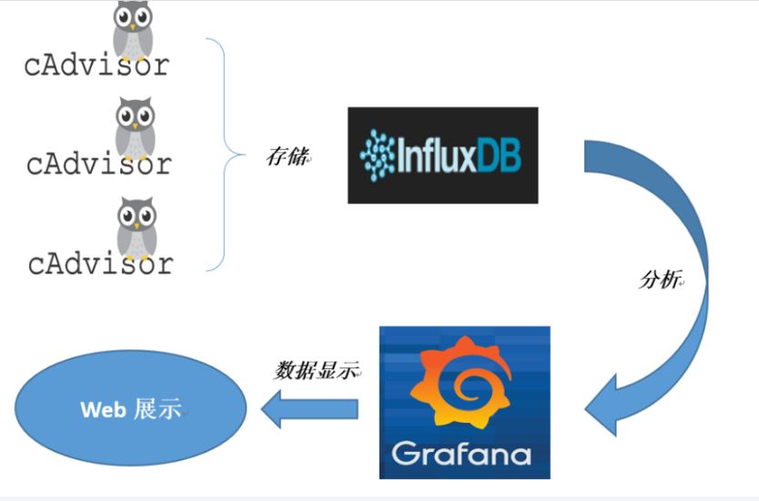

### CAdvisor

CAdvisor是一个容器资源监控工具，包括容器的内存、CPU、网络IO、磁盘IO等监控，同时提供了一个WEB页面用于查看容器的实时运行状态。CAdvisor默认存储2分钟的数据，而且只是针对单物理机。不过，CAdvisor提供了很多数据集成接口，支持nfluxDB、Redis、Kafka、Elasticsearch等集成，可以加上对应配置将监控数据发往这些数据库存储起来。

CAdvisor功能主要有两点

- 展示Host和容器两个层次的监控数据
- 展示历史变化数据。

### InfluxDB

InfluxDB是用Go语言编写的一个开源分布式时序、事件和指标数据库,无需外部依赖。

CAdvisor默认只在本机保存最近2分钟的数据，为了持久化存储数据和统一收集展示监控数据，需要将数据存储到InfluxDB中。InfluxDB是一个时序数据库，专门用于存储时序相关数据，很适合存储CAdvisor的数据。而且，CAdvisor本身已经提供了InfluxDB的集成方法，丰启动容器时指定配置即可。

InfluxDB主要功能:

- 基于时间序列，支持与时间有关的相关函数(如最大、最小、求和等)
- 可度量性：你可以实时对大量数据进行计算
- 基于事件：它支持任意的事件数据

### Granfana

Grafana是一个开源的数据监控分析可视化平台，支持多种数据源配置(支持的数据源包括InfluxDB，MySQL，Elasticsearch，OpenTSDB，Graphite等)和丰富的插件及模板功能支持图表权限控制和报警。

Grafan主要特性:

- 灵活丰富的图形化选项
- 可以混合多种风格
- 支持白天和夜间模式
- 多个数据源

### 总结

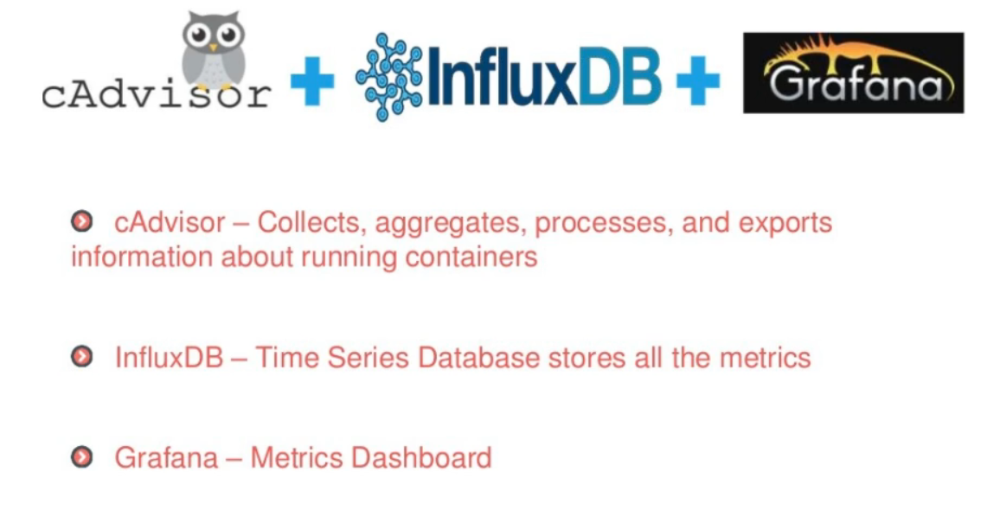


## 3 安装

新建目录cig

```sh
[root@192 cig]# pwd
/mydocker/cig
[root@192 cig]# ll
总用量 4
-rw-r--r--. 1 root root 960 12月 12 22:56 docker-compose.yml
```

编写docker-compose.yml

```yaml
version: '3.1'

volumes:
  grafana_data: {}
services:
 influxdb:
  image: tutum/influxdb:0.9
  restart: always
  environment:
    - PRE_CREATE_DB=cadvisor
  ports:
    - "8083:8083"
    - "8086:8086"
  volumes:
    - ./data/influxdb:/data
    
 cadvisor:
  image: google/cadvisor
  links:
    - influxdb:influxsrv
  command: -storage_driver=influxdb -storage_driver_db=cadvisor -storage_driver_host=influxsrv:8086
  restart: always
  ports:
    - "8080:8080"
  volumes:
    - /:/rootfs:ro
    - /var/run:/var/run:rw
    - /sys:/sys:ro
    - /var/lib/docker/:/var/lib/docker:ro

 grafana:
  user: "104"
  image: grafana/grafana
  restart: always
  links:
    - influxdb:influxsrv
  ports:
    - "3000:3000"
  volumes:
    - grafana_data:/var/lib/grafana
  environment:
    - HTTP_USER=admin
    - HTTP_PASS=admin
    - INFLUXDB_HOST=influxsrv
    - INFLUXDB_PORT=8086
    - INFLUXDB_NAME=cadvisor
    - INFLUXDB_USER=root
    - INFLUXDB_PASS=root
```

启动docker-compose.yml文件

```sh
docker compose up -d

[root@192 cig]# docker compose up -d
[+] Running 3/3
 ✔ Container cig-influxdb-1  Started                                                                                                                                                                      0.0s
 ✔ Container cig-grafana-1   Started                                                                                                                                                                      0.0s
 ✔ Container cig-cadvisor-1  Started                                                                                                                                                                      0.0s
```

查看三个服务容器是否启动

```sh
[root@192 cig]# docker ps
CONTAINER ID   IMAGE                COMMAND                   CREATED              STATUS              PORTS                                                                                  NAMES
d8eefa77db20   google/cadvisor      "/usr/bin/cadvisor -…"   About a minute ago   Up About a minute   0.0.0.0:8080->8080/tcp, :::8080->8080/tcp                                              cig-cadvisor-1
a3ea75730d90   grafana/grafana      "/run.sh"                 About a minute ago   Up About a minute   0.0.0.0:3000->3000/tcp, :::3000->3000/tcp                                              cig-grafana-1
63a165395fd8   tutum/influxdb:0.9   "/run.sh"                 About a minute ago   Up About a minute   0.0.0.0:8083->8083/tcp, :::8083->8083/tcp, 0.0.0.0:8086->8086/tcp, :::8086->8086/tcp   cig-influxdb-1
```

## 4 测试

### CAdvisor收集服务

http://192.168.11.132:8080/

cadvisor也有基础的图形展现功能，这里主要用它来作数据采集

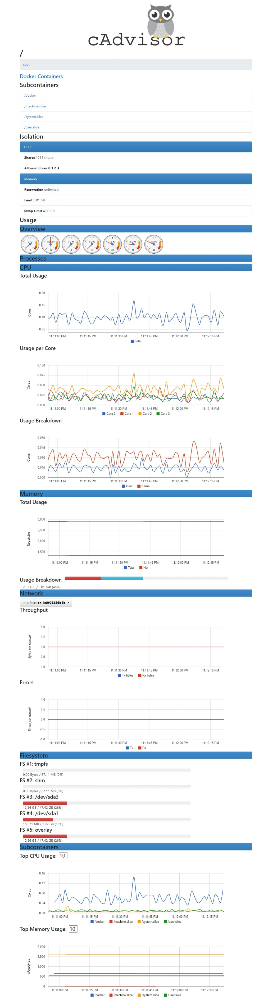

### influxdb存储服务

http://192.168.11.132:8083/

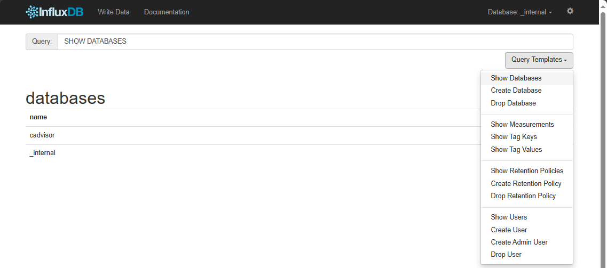

### grafana展示服务

http://192.168.11.132:3000

默认帐户密码（admin/admin）

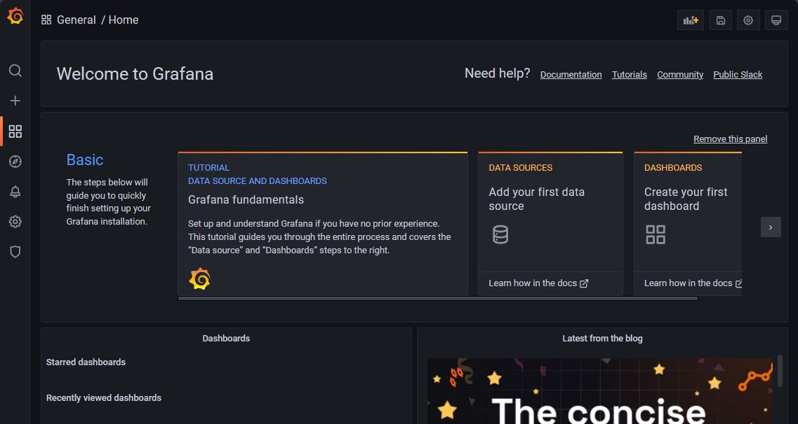

### 配置步骤

#### 配置数据源

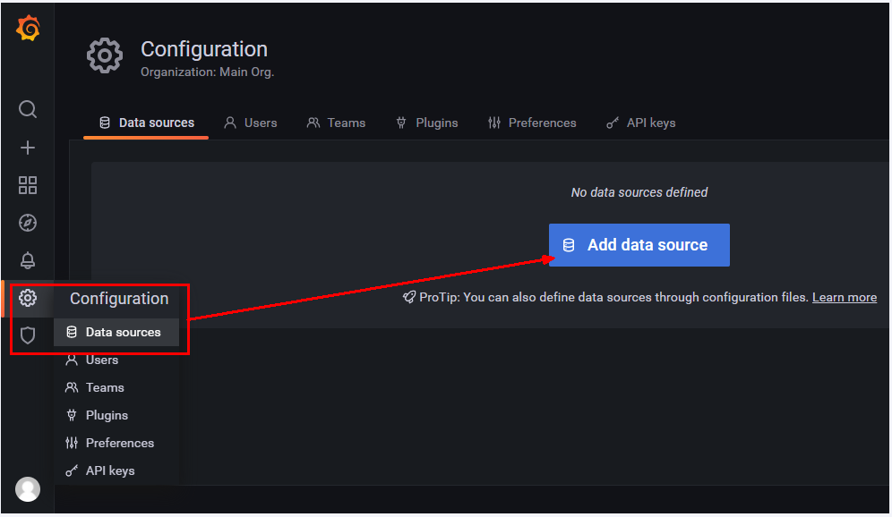

#### 选择influxdb数据源

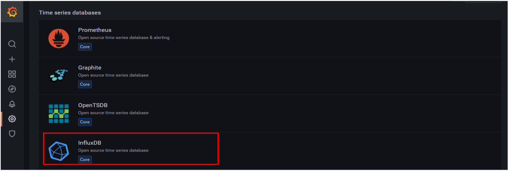

#### 配置细节

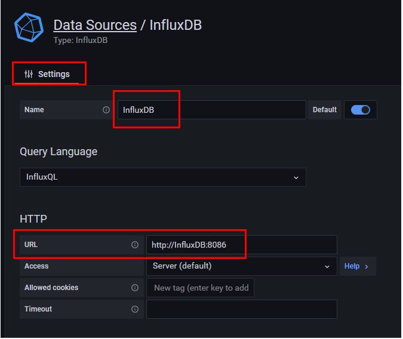

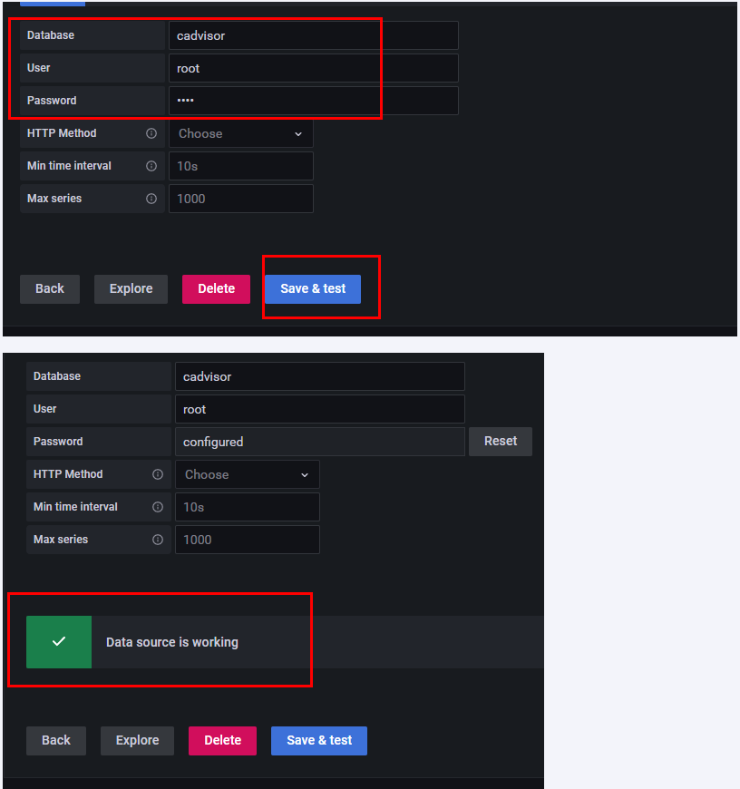

#### 配置面板panel

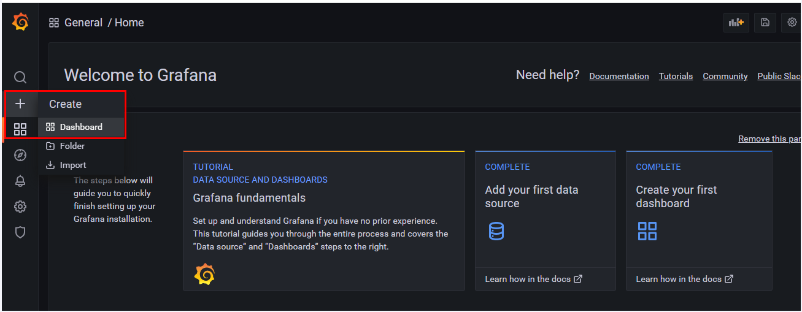

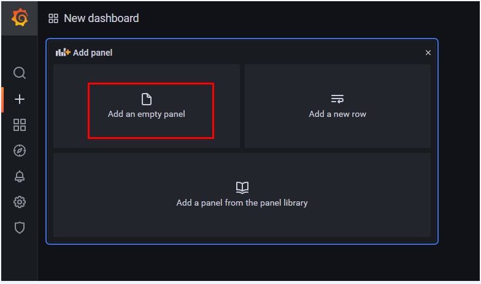

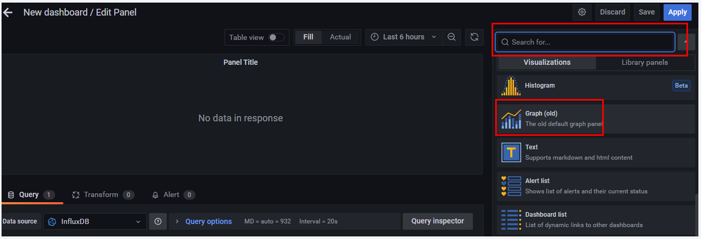

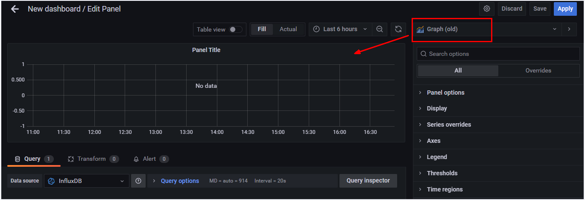

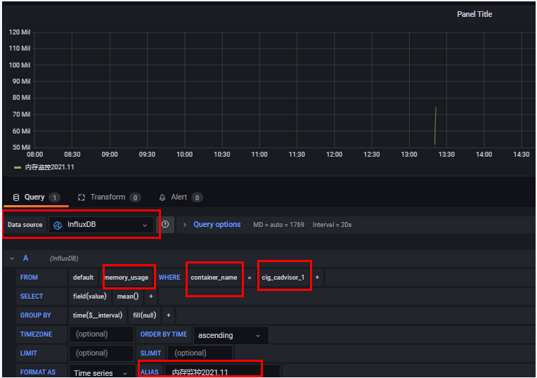

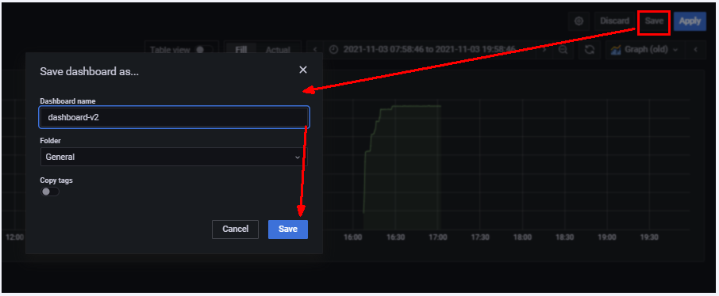

到这里cAdvisor+InfluxDB+Grafana容器监控系统就部署完成了