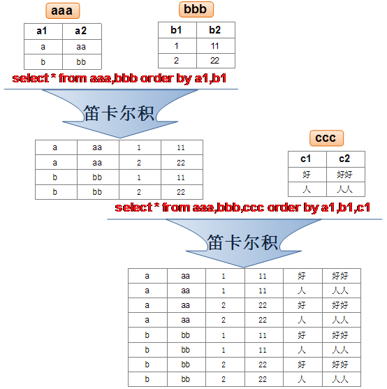
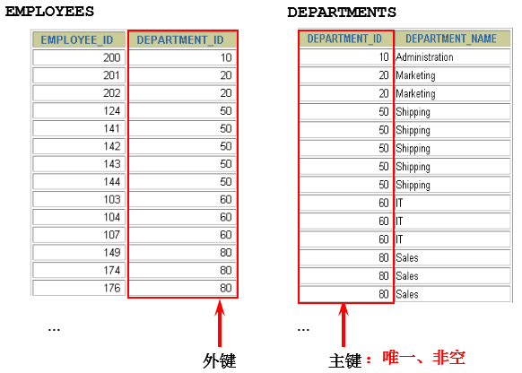
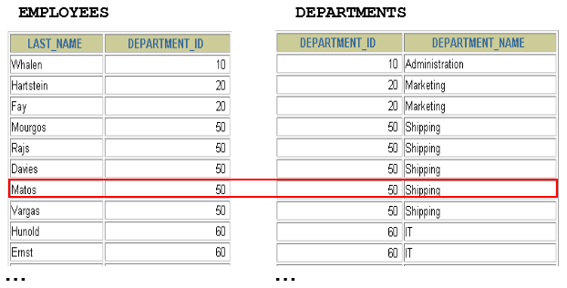

# 多表查询

多表查询，也称为关联查询，指两个或更多个表一起完成查询操作。

前提条件：这些一起查询的表之间是有关系的（一对一、一对多），它们之间一定是有关联字段，这个关联字段可能建立了外键，也可能没有建立外键。比如：员工表和部门表，这两个表依靠“部门编号”进行关联。

## 1. 一个案例引发的多表连接

### 1.1 案例说明  


从多个表中获取数据： 根据员工表的部门id获取对应的部门名称


```sql
#案例：查询员工的姓名及其部门名称
SELECT last_name, department_name
FROM employees, departments;
```


```sql
mysql> SELECT last_name, department_name
    -> FROM employees, departments;
+-------------+----------------------+
| last_name   | department_name      |
+-------------+----------------------+
| King        | Administration       |
| King        | Marketing            |
| King        | Purchasing           |
| King        | Human Resources      |
| King        | Shipping             |
| King        | IT                   |
...
| Gietz       | NOC                  |
| Gietz       | IT Helpdesk          |
| Gietz       | Government Sales     |
| Gietz       | Retail Sales         |
| Gietz       | Recruiting           |
| Gietz       | Payroll              |
+-------------+----------------------+
2889 rows in set (0.03 sec)
```

分析错误情况： 

```sql
SELECT COUNT(employee_id) FROM employees;
#输出107行
SELECT COUNT(department_id)FROM departments;
#输出27行
SELECT 107*27 FROM dual;
#2889
```

我们把上述多表查询中出现的问题称为：笛卡尔积的错误。

### 1.2 笛卡尔积

笛卡尔乘积是一个数学运算。假设我有两个集合 X 和 Y，那么 X 和 Y 的笛卡尔积就是 X 和 Y 的所有可能组合，也就是第一个对象来自于 X，第二个对象来自于 Y 的所有可能。组合的个数即为两个集合中元素个数的乘积数。



SQL92中，笛卡尔积也称为 **交叉连接** ，英文是 **CROSS JOIN** 。在 SQL99 中也是使用 CROSS JOIN表示交叉连接。它的作用就是可以把任意表进行连接，即使这两张表不相关。在MySQL中如下情况会出现笛卡尔积：  

```sql
#查询员工姓名和所在部门名称
SELECT last_name,department_name FROM employees,departments;
SELECT last_name,department_name FROM employees CROSS JOIN departments;
SELECT last_name,department_name FROM employees INNER JOIN departments;
SELECT last_name,department_name FROM employees JOIN departments;
```

### 1.3 案例分析与问题解决

- 笛卡尔积的错误会在下面条件下产生：
  - 省略多个表的连接条件（或关联条件）
  - 连接条件（或关联条件）无效
  - 所有表中的所有行互相连接

- 为了避免笛卡尔积， 可以在 WHERE 加入有效的连接条件。
  - 加入连接条件后，查询语法： 


```sql
SELECT table1.column, table2.column
FROM table1, table2
WHERE table1.column1 = table2.column2; #连接条件
```

- 正确写法： 

```sql
#案例：查询员工的姓名及其部门名称
SELECT last_name, department_name
FROM employees, departments
WHERE employees.department_id = departments.department_id;
```

- 在表中有相同列时，在列名之前加上表名前缀  

## 2. 多表查询分类讲解

### 分类1：等值连接 vs 非等值连接

#### 等值连接 



```sql
mysql> SELECT employees.employee_id, employees.last_name,
    -> employees.department_id, departments.department_id,
    -> departments.location_id
    -> FROM employees, departments
    -> WHERE employees.department_id = departments.department_id;
+-------------+-------------+---------------+---------------+-------------+
| employee_id | last_name   | department_id | department_id | location_id |
+-------------+-------------+---------------+---------------+-------------+
|         103 | Hunold      |            60 |            60 |        1400 |
|         104 | Ernst       |            60 |            60 |        1400 |
|         105 | Austin      |            60 |            60 |        1400 |
...
|         177 | Livingston  |            80 |            80 |        2500 |
|         179 | Johnson     |            80 |            80 |        2500 |
|         204 | Baer        |            70 |            70 |        2700 |
+-------------+-------------+---------------+---------------+-------------+
106 rows in set (0.36 sec)
```

**拓展1：多个连接条件与 AND 操作符** 



**拓展2：区分重复的列名**

- 多个表中有相同列时，必须在列名之前加上表名前缀。
- 在不同表中具有相同列名的列可以用 **表名** 加以区分。 

```sql
SELECT employees.last_name, departments.department_name,employees.department_id
FROM employees, departments
WHERE employees.department_id = departments.department_id;
```

**拓展3：表的别名**

- 使用别名可以简化查询。
- 列名前使用表名前缀可以提高查询效率。 

```sql
SELECT e.employee_id, e.last_name, e.department_id,
d.department_id, d.location_id
FROM employees e , departments d
WHERE e.department_id = d.department_id;
```

需要注意的是，如果我们使用了表的别名，在查询字段中、过滤条件中就只能使用别名进行代替，不能使用原有的表名，否则就会报错。

**阿里开发规范** ：

【 **强制** 】对于数据库中表记录的查询和变更，只要涉及多个表，都需要在列名前加表的别名（或表名）进行限定。

**说明** ：对多表进行查询记录、更新记录、删除记录时，如果对操作列没有限定表的别名（或表名），并且操作列在多个表中存在时，就会抛异常。

**正例** ：select t1.name from table_first as t1 , table_second as t2 where t1.id=t2.id;

**反例** ：在某业务中，由于多表关联查询语句没有加表的别名（或表名）的限制，正常运行两年后，最近在 某个表中增加一个同名字段，在预发布环境做数据库变更后，线上查询语句出现出1052 异常：Column 'name' in field list is ambiguous。   

**拓展4：连接多个表** 


**总结：连接 n个表,至少需要n-1个连接条件**。比如，连接三个表，至少需要两个连接条件。

```sql
# 练习：查询出公司员工的 last_name,department_name, city
mysql> select e.last_name, d.department_name, l.city
    -> FROM employees e , departments d, locations l
    -> WHERE e.department_id = d.department_id
    -> and d.location_id = l.location_id;
+-------------+------------------+---------------------+
| last_name   | department_name  | city                |
+-------------+------------------+---------------------+
| Whalen      | Administration   | Seattle             |
| Hartstein   | Marketing        | Toronto             |
| Fay         | Marketing        | Toronto             |
...
| Popp        | Finance          | Seattle             |
| Higgins     | Accounting       | Seattle             |
| Gietz       | Accounting       | Seattle             |
+-------------+------------------+---------------------+
106 rows in set (0.38 sec)
```

#### 非等值连接


