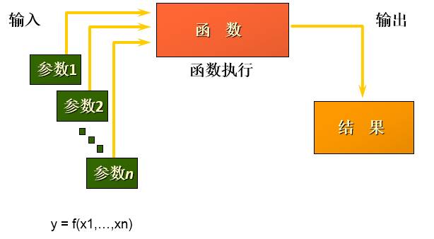
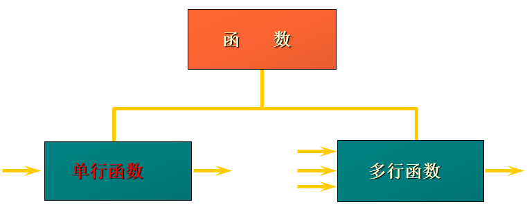

# 单行函数

## 1. 函数的理解

### 1.1 什么是函数

函数在计算机语言的使用中贯穿始终，函数的作用是什么呢？它可以把我们经常使用的代码封装起来，需要的时候直接调用即可。这样既 **提高了代码效率** ，又 **提高了可维护性** 。在 SQL 中我们也可以使用函数对检索出来的数据进行函数操作。使用这些函数，可以极大地 **提高用户对数据库的管理效率** 。  



从函数定义的角度出发，我们可以将函数分成 **内置函数** 和 **自定义函数** 。在 SQL 语言中，同样也包括了内置函数和自定义函数。内置函数是系统内置的通用函数，而自定义函数是我们根据自己的需要编写的，本章及下一章讲解的是 SQL 的内置函数。

### 1.2 不同DBMS函数的差异

我们在使用 SQL 语言的时候，不是直接和这门语言打交道，而是通过它使用不同的数据库软件，即DBMS。DBMS 之间的差异性很大，远大于同一个语言不同版本之间的差异。实际上，只有很少的函数是被 DBMS 同时支持的。比如，大多数 DBMS 使用（||）或者（+）来做拼接符，而在 MySQL 中的字符串拼接函数为concat()。大部分 DBMS 会有自己特定的函数，这就意味着采用 SQL 函数的代码可移植性是很差的，因此在使用函数的时候需要特别注意。 

### 1.3 MySQL的内置函数及分类

MySQL提供了丰富的内置函数，这些函数使得数据的维护与管理更加方便，能够更好地提供数据的分析与统计功能，在一定程度上提高了开发人员进行数据分析与统计的效率。

MySQL提供的内置函数从 **实现的功能角度** 可以分为数值函数、字符串函数、日期和时间函数、流程控制函数、加密与解密函数、获取MySQL信息函数、聚合函数等。这里，我将这些丰富的内置函数再分为两类： **单行函数 、 聚合函数（或分组函数） 。**

两种SQL函数 



**单行函数**

- 操作数据对象
- 接受参数返回一个结果
- **只对一行进行变换**
- **每行返回一个结果**
- 可以嵌套
- 参数可以是一列或一个值 

## 2. 数值函数

### 2.1 基本函数 

| 函数                | 用法                                                         |
| ------------------- | ------------------------------------------------------------ |
| ABS(x)              | 返回x的绝对值                                                |
| SIGN(X)             | 返回X的符号。正数返回1，负数返回-1，0返回0                   |
| PI()                | 返回圆周率的值                                               |
| CEIL(x)，CEILING(x) | 返回大于或等于某个值的最小整数                               |
| FLOOR(x)            | 返回小于或等于某个值的最大整数                               |
| LEAST(e1,e2,e3…)    | 返回列表中的最小值                                           |
| GREATEST(e1,e2,e3…) | 返回列表中的最大值                                           |
| MOD(x,y)            | 返回X除以Y后的余数                                           |
| RAND()              | 返回0~1的随机值                                              |
| RAND(x)             | 返回0~1的随机值，其中x的值用作种子值，相同的X值会产生相同的随机数 |
| ROUND(x)            | 返回一个对x的值进行四舍五入后，最接近于X的整数               |
| ROUND(x,y)          | 返回一个对x的值进行四舍五入后最接近X的值，并保留到小数点后面Y位 |
| TRUNCATE(x,y)       | 返回数字x截断为y位小数的结果                                 |
| SQRT(x)             | 返回x的平方根。当X的值为负数时，返回NULL                     |

```sql
mysql> SELECT ABS(-123), ABS(32), SIGN(-23), SIGN(43), PI(), CEIL(32.32), CEILING(-43.23), FLOOR(32.32), FLOOR(-43.23), MOD(12,5)
    -> FROM DUAL;
+-----------+---------+-----------+----------+----------+-------------+-----------------+--------------+---------------+-----------+
| ABS(-123) | ABS(32) | SIGN(-23) | SIGN(43) | PI()     | CEIL(32.32) | CEILING(-43.23) | FLOOR(32.32) | FLOOR(-43.23) | MOD(12,5) |
+-----------+---------+-----------+----------+----------+-------------+-----------------+--------------+---------------+-----------+
|       123 |      32 |        -1 |        1 | 3.141593 |          33 |             -43 |           32 |           -44 |         2 |
+-----------+---------+-----------+----------+----------+-------------+-----------------+--------------+---------------+-----------+
1 row in set (0.00 sec)


mysql> SELECT RAND(),RAND(),RAND(10),RAND(10),RAND(-1),RAND(-1)
    -> FROM DUAL;
+--------------------+--------------------+--------------------+--------------------+--------------------+--------------------+
| RAND()             | RAND()             | RAND(10)           | RAND(10)           | RAND(-1)           | RAND(-1)           |
+--------------------+--------------------+--------------------+--------------------+--------------------+--------------------+
| 0.4563242257165948 | 0.5017840391972885 | 0.6570515219653505 | 0.6570515219653505 | 0.9050373219931845 | 0.9050373219931845 |
+--------------------+--------------------+--------------------+--------------------+--------------------+--------------------+
1 row in set (0.01 sec)

mysql> SELECT ROUND(12.33),ROUND(12.343,2),ROUND(12.324,-1),TRUNCATE(12.66,1),TRUNCATE(12.66,-1)
    -> FROM DUAL;
+--------------+-----------------+------------------+-------------------+--------------------+
| ROUND(12.33) | ROUND(12.343,2) | ROUND(12.324,-1) | TRUNCATE(12.66,1) | TRUNCATE(12.66,-1) |
+--------------+-----------------+------------------+-------------------+--------------------+
|           12 |           12.34 |               10 |              12.6 |                 10 |
+--------------+-----------------+------------------+-------------------+--------------------+
1 row in set (0.01 sec)
```

### 2.2 角度与弧度互换函数 

| 函数       | 用法                                  |
| ---------- | ------------------------------------- |
| RADIANS(x) | 将角度转化为弧度，其中，参数x为角度值 |
| DEGREES(x) | 将弧度转化为角度，其中，参数x为弧度值 |

```sql
mysql> SELECT RADIANS(30),RADIANS(60),RADIANS(90),DEGREES(2*PI()),DEGREES(RADIANS(90))
    -> FROM DUAL;
+--------------------+--------------------+--------------------+-----------------+----------------------+
| RADIANS(30)        | RADIANS(60)        | RADIANS(90)        | DEGREES(2*PI()) | DEGREES(RADIANS(90)) |
+--------------------+--------------------+--------------------+-----------------+----------------------+
| 0.5235987755982988 | 1.0471975511965976 | 1.5707963267948966 |             360 |                   90 |
+--------------------+--------------------+--------------------+-----------------+----------------------+
1 row in set (0.00 sec)
```

### 2.3 三角函数 

| 函数       | 用法                                                         |
| ---------- | ------------------------------------------------------------ |
| SIN(x)     | 返回x的正弦值，其中，参数x为弧度值                           |
| ASIN(x)    | 返回x的反正弦值，即获取正弦为x的值。如果x的值不在-1到1之间，则返回NULL |
| COS(x)     | 返回x的余弦值，其中，参数x为弧度值                           |
| ACOS(x)    | 返回x的反余弦值，即获取余弦为x的值。如果x的值不在-1到1之间，则返回NULL |
| TAN(x)     | 返回x的正切值，其中，参数x为弧度值                           |
| ATAN(x)    | 返回x的反正切值，即返回正切值为x的值                         |
| ATAN2(m,n) | 返回两个参数的反正切值                                       |
| COT(x)     | 返回x的余切值，其中，X为弧度值                               |

举例：

ATAN2(M,N)函数返回两个参数的反正切值。与ATAN(X)函数相比，ATAN2(M,N)需要两个参数。

例如有两个点point(x1,y1)和point(x2,y2)，使用ATAN(X)函数计算反正切值为ATAN((y2-y1)/(x2-x1))，使用ATAN2(M,N)计算反正切值则为ATAN2(y2-y1,x2-x1)。

由使用方式可以看出，当x2-x1等于0时，ATAN(X)函数会报错，而ATAN2(M,N)函数则仍然可以计算。

ATAN2(M,N)函数的使用示例如下： 

```sql
mysql> SELECT SIN(RADIANS(30)),DEGREES(ASIN(1)),TAN(RADIANS(45)),DEGREES(ATAN(1)),DEGREES(ATAN2(1,1))
    -> FROM DUAL;
+---------------------+------------------+--------------------+------------------+---------------------+
| SIN(RADIANS(30))    | DEGREES(ASIN(1)) | TAN(RADIANS(45))   | DEGREES(ATAN(1)) | DEGREES(ATAN2(1,1)) |
+---------------------+------------------+--------------------+------------------+---------------------+
| 0.49999999999999994 |               90 | 0.9999999999999999 |               45 |                  45 |
+---------------------+------------------+--------------------+------------------+---------------------+
1 row in set (0.01 sec)
```

### 2.4 指数与对数 

| 函数                 | 用法                                                 |
| -------------------- | ---------------------------------------------------- |
| POW(x,y)，POWER(X,Y) | 返回x的y次方                                         |
| EXP(X)               | 返回e的X次方，其中e是一个常数，2.718281828459045     |
| LN(X)，LOG(X)        | 返回以e为底的X的对数，当X <= 0 时，返回的结果为NULL  |
| LOG10(X)             | 返回以10为底的X的对数，当X <= 0 时，返回的结果为NULL |
| LOG2(X)              | 返回以2为底的X的对数，当X <= 0 时，返回NULL          |

```sql
mysql> SELECT POW(2,5),POWER(2,4),EXP(2),LN(10),LOG10(10),LOG2(4)
    -> FROM DUAL;
+----------+------------+------------------+-------------------+-----------+---------+
| POW(2,5) | POWER(2,4) | EXP(2)           | LN(10)            | LOG10(10) | LOG2(4) |
+----------+------------+------------------+-------------------+-----------+---------+
|       32 |         16 | 7.38905609893065 | 2.302585092994046 |         1 |       2 |
+----------+------------+------------------+-------------------+-----------+---------+
1 row in set (0.00 sec)
```

### 2.5 进制间的转换 

| 函数          | 用法                     |
| ------------- | ------------------------ |
| BIN(x)        | 返回x的二进制编码        |
| HEX(x)        | 返回x的十六进制编码      |
| OCT(x)        | 返回x的八进制编码        |
| CONV(x,f1,f2) | 返回f1进制数变成f2进制数 |

```sql
mysql> SELECT BIN(10),HEX(10),OCT(10),CONV(10,2,8)
    -> FROM DUAL;
+---------+---------+---------+--------------+
| BIN(10) | HEX(10) | OCT(10) | CONV(10,2,8) |
+---------+---------+---------+--------------+
| 1010    | A       | 12      | 2            |
+---------+---------+---------+--------------+
1 row in set (0.00 sec)
```

## 3. 字符串函数 

| 函数                             | 用法                                                         |
| -------------------------------- | ------------------------------------------------------------ |
| ASCII(S)                         | 返回字符串S中的第一个字符的ASCII码值                         |
| CHAR_LENGTH(s)                   | 返回字符串s的字符数。作用与CHARACTER_LENGTH(s)相同           |
| LENGTH(s)                        | 返回字符串s的字节数，和字符集有关                            |
| CONCAT(s1,s2,......,sn)          | 连接s1,s2,......,sn为一个字符串                              |
| CONCAT_WS(x,s1,s2,......,sn)     | 同CONCAT(s1,s2,...)函数，但是每个字符串之间要加上x           |
| INSERT(str, idx, len,replacestr) | 将字符串str从第idx位置开始，len个字符长的子串替换为字符串replacestr |
| REPLACE(str, a, b)               | 用字符串b替换字符串str中所有出现的字符串a                    |
| UPPER(s) 或 UCASE(s)             | 将字符串s的所有字母转成大写字母                              |
| LOWER(s) 或LCASE(s)              | 将字符串s的所有字母转成小写字母                              |
| LEFT(str,n)                      | 返回字符串str最左边的n个字符                                 |
| RIGHT(str,n)                     | 返回字符串str最右边的n个字符                                 |
| LPAD(str, len, pad)              | 用字符串pad对str最左边进行填充，直到str的长度为len个字符     |
| RPAD(str ,len, pad)              | 用字符串pad对str最右边进行填充，直到str的长度为len个字符     |
| LTRIM(s)                         | 去掉字符串s左侧的空格                                        |
| RTRIM(s)                         | 去掉字符串s右侧的空格                                        |
| TRIM(s)                          | 去掉字符串s开始与结尾的空格                                  |
| TRIM(s1 FROM s)                  | 去掉字符串s开始与结尾的s1                                    |
| TRIM(LEADING s1 FROM s)          | 去掉字符串s开始处的s1                                        |
| TRIM(TRAILING s1 FROM s)         | 去掉字符串s结尾处的s1                                        |
| REPEAT(str, n)                   | 返回str重复n次的结果                                         |
| SPACE(n)                         | 返回n个空格                                                  |
| STRCMP(s1,s2)                    | 比较字符串s1,s2的ASCII码值的大小                             |
| SUBSTR(s,index,len)              | 返回从字符串s的index位置其len个字符，作用与SUBSTRING(s,n,len)、MID(s,n,len)相同 |
| LOCATE(substr,str)               | 返回字符串substr在字符串str中首次出现的位置，作用于POSITION(substrIN str)、INSTR(str,substr)相同。未找到，返回0 |
| ELT(m,s1,s2,…,sn)                | 返回指定位置的字符串，如果m=1，则返回s1，如果m=2，则返回s2，如果m=n，则返回sn |
| FIELD(s,s1,s2,…,sn)              | 返回字符串s在字符串列表中第一次出现的位置                    |
| FIND_IN_SET(s1,s2)               | 返回字符串s1在字符串s2中出现的位置。其中，字符串s2是一个以逗号分隔的字符串 |
| REVERSE(s)                       | 返回s反转后的字符串                                          |
| NULLIF(value1,value2)            | 比较两个字符串，如果value1与value2相等，则返回NULL，否则返回value1 |

**注意：MySQL中，字符串的位置是从1开始的。** 

```sql
mysql> SELECT FIELD('mm','hello','msm','amma'),FIND_IN_SET('mm','hello,mm,amma') FROM DUAL;
+----------------------------------+-----------------------------------+
| FIELD('mm','hello','msm','amma') | FIND_IN_SET('mm','hello,mm,amma') |
+----------------------------------+-----------------------------------+
|                                0 |                                 2 |
+----------------------------------+-----------------------------------+
1 row in set (0.00 sec)

mysql> SELECT NULLIF('mysql','mysql'),NULLIF('mysql', '');
+-------------------------+---------------------+
| NULLIF('mysql','mysql') | NULLIF('mysql', '') |
+-------------------------+---------------------+
| NULL                    | mysql               |
+-------------------------+---------------------+
1 row in set (0.00 sec)

mysql> SELECT ASCII('Abcdfsf'),CHAR_LENGTH('hello'),CHAR_LENGTH('我们'),
    -> LENGTH('hello'),LENGTH('我们')
    -> FROM DUAL;
+------------------+----------------------+-----------------------+-----------------+------------------+
| ASCII('Abcdfsf') | CHAR_LENGTH('hello') | CHAR_LENGTH('我们')   | LENGTH('hello') | LENGTH('我们')   |
+------------------+----------------------+-----------------------+-----------------+------------------+
|               65 |                    5 |                     2 |               5 |                6 |
+------------------+----------------------+-----------------------+-----------------+------------------+
1 row in set (0.00 sec)

# xxx worked for yyy
SELECT CONCAT(emp.last_name,' worked for ',mgr.last_name) "details"
FROM employees emp JOIN employees mgr
WHERE emp.`manager_id` = mgr.employee_id;

mysql> SELECT CONCAT_WS('-','hello','world','hello','beijing')
    -> FROM DUAL;
+--------------------------------------------------+
| CONCAT_WS('-','hello','world','hello','beijing') |
+--------------------------------------------------+
| hello-world-hello-beijing                        |
+--------------------------------------------------+
1 row in set (0.00 sec)

#字符串的索引是从1开始的！
mysql> SELECT INSERT('helloworld',2,3,'aaaaa'),REPLACE('hello','lol','mmm')
    -> FROM DUAL;
+----------------------------------+------------------------------+
| INSERT('helloworld',2,3,'aaaaa') | REPLACE('hello','lol','mmm') |
+----------------------------------+------------------------------+
| haaaaaoworld                     | hello                        |
+----------------------------------+------------------------------+
1 row in set (0.00 sec)

mysql> SELECT UPPER('HelLo'),LOWER('HelLo')
    -> FROM DUAL;
+----------------+----------------+
| UPPER('HelLo') | LOWER('HelLo') |
+----------------+----------------+
| HELLO          | hello          |
+----------------+----------------+
1 row in set (0.00 sec)

mysql> SELECT last_name,salary
    -> FROM employees
    -> WHERE LOWER(last_name) = 'King';
+-----------+----------+
| last_name | salary   |
+-----------+----------+
| King      | 24000.00 |
| King      | 10000.00 |
+-----------+----------+
2 rows in set (0.00 sec)

mysql> SELECT LEFT('hello',2),RIGHT('hello',3),RIGHT('hello',13)
    -> FROM DUAL;
+-----------------+------------------+-------------------+
| LEFT('hello',2) | RIGHT('hello',3) | RIGHT('hello',13) |
+-----------------+------------------+-------------------+
| he              | llo              | hello             |
+-----------------+------------------+-------------------+
1 row in set (0.00 sec)

mysql> SELECT employee_id,last_name,LPAD(salary,10,' ')
    -> FROM employees;
+-------------+-------------+---------------------+
| employee_id | last_name   | LPAD(salary,10,' ') |
+-------------+-------------+---------------------+
|         100 | King        |   24000.00          |
|         101 | Kochhar     |   17000.00          |
|         102 | De Haan     |   17000.00          |
|         103 | Hunold      |    9000.00          |
|         104 | Ernst       |    6000.00          |
|         105 | Austin      |    4800.00          |
...
|         203 | Mavris      |    6500.00          |
|         204 | Baer        |   10000.00          |
|         205 | Higgins     |   12000.00          |
|         206 | Gietz       |    8300.00          |
+-------------+-------------+---------------------+
107 rows in set (0.00 sec)

mysql> SELECT CONCAT('---',LTRIM('    h  el  lo   '),'***'),
    -> TRIM('oo' FROM 'ooheollo')
    -> FROM DUAL;
+-----------------------------------------------+----------------------------+
| CONCAT('---',LTRIM('    h  el  lo   '),'***') | TRIM('oo' FROM 'ooheollo') |
+-----------------------------------------------+----------------------------+
| ---h  el  lo   ***                            | heollo                     |
+-----------------------------------------------+----------------------------+
1 row in set (0.00 sec)

mysql> SELECT REPEAT('hello',4),LENGTH(SPACE(5)),STRCMP('abc','abe')
    -> FROM DUAL;
+----------------------+------------------+---------------------+
| REPEAT('hello',4)    | LENGTH(SPACE(5)) | STRCMP('abc','abe') |
+----------------------+------------------+---------------------+
| hellohellohellohello |                5 |                  -1 |
+----------------------+------------------+---------------------+
1 row in set (0.00 sec)

mysql> SELECT SUBSTR('hello',2,2),LOCATE('lll','hello')
    -> FROM DUAL;
+---------------------+-----------------------+
| SUBSTR('hello',2,2) | LOCATE('lll','hello') |
+---------------------+-----------------------+
| el                  |                     0 |
+---------------------+-----------------------+
1 row in set (0.00 sec)

mysql> SELECT ELT(2,'a','b','c','d'),FIELD('mm','gg','jj','mm','dd','mm'),
    -> FIND_IN_SET('mm','gg,mm,jj,dd,mm,gg')
    -> FROM DUAL;
+------------------------+--------------------------------------+---------------------------------------+
| ELT(2,'a','b','c','d') | FIELD('mm','gg','jj','mm','dd','mm') | FIND_IN_SET('mm','gg,mm,jj,dd,mm,gg') |
+------------------------+--------------------------------------+---------------------------------------+
| b                      |                                    3 |                                     2 |
+------------------------+--------------------------------------+---------------------------------------+
1 row in set (0.00 sec)

SELECT employee_id,NULLIF(LENGTH(first_name),LENGTH(last_name)) "compare"
FROM employees;
```

## 4. 日期和时间函数

### 4.1 获取日期、时间 

| 函数                                                         | 用法                           |
| ------------------------------------------------------------ | ------------------------------ |
| CURDATE() ，CURRENT_DATE()                                   | 返回当前日期，只包含年、月、日 |
| CURTIME() ， CURRENT_TIME()                                  | 返回当前时间，只包含时、分、秒 |
| NOW() / SYSDATE() / CURRENT_TIMESTAMP() / LOCALTIME() / LOCALTIMESTAMP() | 返回当前系统日期和时间         |
| UTC_DATE()                                                   | 返回UTC（世界标准时间）日期    |
| UTC_TIME()                                                   | 返回UTC（世界标准时间）时间    |

举例： 

```sql
mysql> SELECT CURDATE(),CURTIME(),NOW(),SYSDATE()+0,UTC_DATE(),UTC_DATE()+0,UTC_TIME(),UTC_TIME()+0
    -> FROM DUAL;
+------------+-----------+---------------------+----------------+------------+--------------+------------+--------------+
| CURDATE()  | CURTIME() | NOW()               | SYSDATE()+0    | UTC_DATE() | UTC_DATE()+0 | UTC_TIME() | UTC_TIME()+0 |
+------------+-----------+---------------------+----------------+------------+--------------+------------+--------------+
| 2023-11-24 | 01:35:17  | 2023-11-24 01:35:17 | 20231124013517 | 2023-11-24 |     20231124 | 01:35:17   |        13517 |
+------------+-----------+---------------------+----------------+------------+--------------+------------+--------------+
1 row in set (0.00 sec)

#3.1  获取日期、时间
mysql> SELECT CURDATE(),CURRENT_DATE(),CURTIME(),NOW(),SYSDATE(),
    -> UTC_DATE(),UTC_TIME()
    -> FROM DUAL;
+------------+----------------+-----------+---------------------+---------------------+------------+------------+
| CURDATE()  | CURRENT_DATE() | CURTIME() | NOW()               | SYSDATE()           | UTC_DATE() | UTC_TIME() |
+------------+----------------+-----------+---------------------+---------------------+------------+------------+
| 2022-07-24 | 2022-07-24     | 13:40:24  | 2022-07-24 13:40:24 | 2022-07-24 13:40:24 | 2022-07-24 | 05:40:24   |
+------------+----------------+-----------+---------------------+---------------------+------------+------------+
1 row in set (0.00 sec)

mysql> SELECT CURDATE(),CURDATE() + 0,CURTIME() + 0,NOW() + 0
    -> FROM DUAL;
+------------+---------------+---------------+----------------+
| CURDATE()  | CURDATE() + 0 | CURTIME() + 0 | NOW() + 0      |
+------------+---------------+---------------+----------------+
| 2022-07-24 |      20220724 |        134035 | 20220724134035 |
+------------+---------------+---------------+----------------+
1 row in set (0.00 sec)
```

### 4.2 日期与时间戳的转换 

| 函数                     | 用法                                                         |
| ------------------------ | ------------------------------------------------------------ |
| UNIX_TIMESTAMP()         | 以UNIX时间戳的形式返回当前时间。SELECT UNIX_TIMESTAMP() ->1634348884 |
| UNIX_TIMESTAMP(date)     | 将时间date以UNIX时间戳的形式返回。                           |
| FROM_UNIXTIME(timestamp) | 将UNIX时间戳的时间转换为普通格式的时间                       |

 举例：

```sql
mysql> SELECT UNIX_TIMESTAMP(now());
+-----------------------+
| UNIX_TIMESTAMP(now()) |
+-----------------------+
| 1576380910 |
+-----------------------+
1 row in set (0.01 sec)

mysql> SELECT UNIX_TIMESTAMP(CURDATE());
+---------------------------+
| UNIX_TIMESTAMP(CURDATE()) |
+---------------------------+
| 1576339200 |
+---------------------------+
1 row in set (0.00 sec)

mysql> SELECT UNIX_TIMESTAMP(CURTIME());
+---------------------------+
| UNIX_TIMESTAMP(CURTIME()) |
+---------------------------+
| 1576380969 |
+---------------------------+
1 row in set (0.00 sec)

mysql> SELECT UNIX_TIMESTAMP('2011-11-11 11:11:11')
+---------------------------------------+
| UNIX_TIMESTAMP('2011-11-11 11:11:11') |
+---------------------------------------+
| 1320981071 |
+---------------------------------------+
1 row in set (0.00 sec)

mysql> SELECT FROM_UNIXTIME(1576380910);
+---------------------------+
| FROM_UNIXTIME(1576380910) |
+---------------------------+
| 2019-12-15 11:35:10 |
+---------------------------+
1 row in set (0.00 sec)

#3.2 日期与时间戳的转换
mysql> SELECT UNIX_TIMESTAMP(),UNIX_TIMESTAMP('2021-10-01 12:12:32'), FROM_UNIXTIME(1635173853),FROM_UNIXTIME(1633061552) FROM DUAL;
+------------------+---------------------------------------+---------------------------+---------------------------+
| UNIX_TIMESTAMP() | UNIX_TIMESTAMP('2021-10-01 12:12:32') | FROM_UNIXTIME(1635173853) | FROM_UNIXTIME(1633061552) |
+------------------+---------------------------------------+---------------------------+---------------------------+
|       1658641335 |                            1633061552 | 2021-10-25 22:57:33       | 2021-10-01 12:12:32       |
+------------------+---------------------------------------+---------------------------+---------------------------+
1 row in set (0.00 sec)
```

### 4.3 获取月份、星期、星期数、天数等函数 

| 函数                                     | 用法                                            |
| ---------------------------------------- | ----------------------------------------------- |
| YEAR(date) / MONTH(date) / DAY(date)     | 返回具体的日期值                                |
| HOUR(time) / MINUTE(time) / SECOND(time) | 返回具体的时间值                                |
| MONTHNAME(date)                          | 返回月份：January，...                          |
| DAYNAME(date)                            | 返回星期几：MONDAY，TUESDAY.....SUNDAY          |
| WEEKDAY(date)                            | 返回周几，注意，周1是0，周2是1，。。。周日是6   |
| QUARTER(date)                            | 返回日期对应的季度，范围为1～4                  |
| WEEK(date) ， WEEKOFYEAR(date)           | 返回一年中的第几周                              |
| DAYOFYEAR(date)                          | 返回日期是一年中的第几天                        |
| DAYOFMONTH(date)                         | 返回日期位于所在月份的第几天                    |
| DAYOFWEEK(date)                          | 返回周几，注意：周日是1，周一是2，。。。周六是7 |

举例： 

```sql
mysql> SELECT YEAR(CURDATE()),MONTH(CURDATE()),DAY(CURDATE()),
    -> HOUR(CURTIME()),MINUTE(NOW()),SECOND(SYSDATE())
    -> FROM DUAL;
+-----------------+------------------+----------------+-----------------+---------------+-------------------+
| YEAR(CURDATE()) | MONTH(CURDATE()) | DAY(CURDATE()) | HOUR(CURTIME()) | MINUTE(NOW()) | SECOND(SYSDATE()) |
+-----------------+------------------+----------------+-----------------+---------------+-------------------+
|            2023 |               11 |             24 |               1 |            55 |                49 |
+-----------------+------------------+----------------+-----------------+---------------+-------------------+
1 row in set (0.00 sec)

mysql> SELECT MONTHNAME('2021-10-26'),DAYNAME('2021-10-26'),WEEKDAY('2021-10-26')
    -> FROM DUAL;
+-------------------------+-----------------------+-----------------------+
| MONTHNAME('2021-10-26') | DAYNAME('2021-10-26') | WEEKDAY('2021-10-26') |
+-------------------------+-----------------------+-----------------------+
| October                 | Tuesday               |                     1 |
+-------------------------+-----------------------+-----------------------+
1 row in set (0.00 sec)

mysql> SELECT QUARTER(CURDATE()),WEEK(CURDATE()),DAYOFYEAR(NOW()),DAYOFMONTH(NOW()),DAYOFWEEK(NOW())
    -> FROM DUAL;
+--------------------+-----------------+------------------+-------------------+------------------+
| QUARTER(CURDATE()) | WEEK(CURDATE()) | DAYOFYEAR(NOW()) | DAYOFMONTH(NOW()) | DAYOFWEEK(NOW()) |
+--------------------+-----------------+------------------+-------------------+------------------+
|                  4 |              47 |              328 |                24 |                6 |
+--------------------+-----------------+------------------+-------------------+------------------+
1 row in set (0.01 sec)

```

### 4.4 日期的操作函数 

| 函数                    | 用法                                       |
| ----------------------- | ------------------------------------------ |
| EXTRACT(type FROM date) | 返回指定日期中特定的部分，type指定返回的值 |

EXTRACT(type FROM date)函数中type的取值与含义： 

| type取值           | 含义                         |
| ------------------ | ---------------------------- |
| MICROSECOND        | 返回毫秒数                   |
| SECOND             | 返回秒数                     |
| MINUTE             | 返回分钟数                   |
| HOUR               | 返回小时数                   |
| DAY                | 返回天数                     |
| WEEK               | 返回日期在一年中的第几个星期 |
| MONTH              | 返回日期在一年中的第几个月   |
| QUARTER            | 返回日期在一年中的第几个季度 |
| YEAR               | 返回日期的年份               |
| SECOND_MICROSECOND | 返回秒和毫秒值               |
| MINUTE_MICROSECOND | 返回分钟和毫秒值             |
| MINUTE_SECOND      | 返回分钟和秒值               |
| HOUR_MICROSECOND   | 返回小时和毫秒值             |
| HOUR_SECOND        | 返回小时和秒值               |
| HOUR_MINUTE        | 返回小时和分钟值             |
| DAY_MICROSECOND    | 返回天和毫秒值               |
| DAY_SECOND         | 返回天和秒值                 |
| DAY_MINUTE         | 返回天和分钟值               |
| DAY_HOUR           | 返回天和小时                 |
| YEAR MONTH         | 返回年和月                   |

```sql
mysql> SELECT EXTRACT(MINUTE FROM NOW()),EXTRACT( WEEK FROM NOW()),
    -> EXTRACT( QUARTER FROM NOW()),EXTRACT( MINUTE_SECOND FROM NOW())
    -> FROM DUAL;
+----------------------------+---------------------------+------------------------------+------------------------------------+
| EXTRACT(MINUTE FROM NOW()) | EXTRACT( WEEK FROM NOW()) | EXTRACT( QUARTER FROM NOW()) | EXTRACT( MINUTE_SECOND FROM NOW()) |
+----------------------------+---------------------------+------------------------------+------------------------------------+
|                         14 |                        47 |                            4 |                               1430 |
+----------------------------+---------------------------+------------------------------+------------------------------------+
1 row in set (0.00 sec)
```

### 4.5 时间和秒钟转换的函数 

| 函数                 | 用法                                                         |
| -------------------- | ------------------------------------------------------------ |
| TIME_TO_SEC(time)    | 将 time 转化为秒并返回结果值。转化的公式为： 小时*3600+分钟*60+秒 |
| SEC_TO_TIME(seconds) | 将 seconds 描述转化为包含小时、分钟和秒的时间                |

举例： 

```sql
mysql> SELECT TIME_TO_SEC(NOW());
+--------------------+
| TIME_TO_SEC(NOW()) |
+--------------------+
| 78774 |
+--------------------+
1 row in set (0.00 sec)

mysql> SELECT SEC_TO_TIME(78774);
+--------------------+
| SEC_TO_TIME(78774) |
+--------------------+
| 21:52:54 |
+--------------------+
1 row in set (0.12 sec)
```

### 4.6 计算日期和时间的函数

| 函数                                                         | 用法                                           |
| ------------------------------------------------------------ | ---------------------------------------------- |
| DATE_ADD(datetime, INTERVAL expr type)， ADDDATE(date,INTERVAL expr type) | 返回与给定日期时间相差INTERVAL时间段的日期时间 |
| DATE_SUB(date,INTERVAL expr type)， SUBDATE(date,INTERVAL expr type) | 返回与date相差INTERVAL时间间隔的日期           |

上述函数中type的取值： 

| 间隔类型      | 含义       |
| ------------- | ---------- |
| HOUR          | 小时       |
| MINUTE        | 分钟       |
| SECOND        | 秒         |
| YEAR          | 年         |
| MONTH         | 月         |
| DAY           | 日         |
| YEAR_MONTH    | 年和月     |
| DAY_HOUR      | 日和小时   |
| DAY_MINUTE    | 日和分钟   |
| DAY_SECOND    | 日和秒     |
| HOUR_MINUTE   | 小时和分钟 |
| HOUR_SECOND   | 小时和秒   |
| MINUTE_SECOND | 分钟和秒   |

举例： 

```sql
SELECT ADDDATE('2021-10-21 23:32:12',INTERVAL 1 SECOND) AS col3,
DATE_ADD('2021-10-21 23:32:12',INTERVAL '1_1' MINUTE_SECOND) AS col4,
DATE_ADD(NOW(), INTERVAL -1 YEAR) AS col5, #可以是负数
DATE_ADD(NOW(), INTERVAL '1_1' YEAR_MONTH) AS col6 #需要单引号
FROM DUAL;

mysql> SELECT ADDDATE('2021-10-21 23:32:12',INTERVAL 1 SECOND) AS col3,
    -> DATE_ADD('2021-10-21 23:32:12',INTERVAL '1_1' MINUTE_SECOND) AS col4,
    -> DATE_ADD(NOW(), INTERVAL -1 YEAR) AS col5, #可以是负数
    -> DATE_ADD(NOW(), INTERVAL '1_1' YEAR_MONTH) AS col6 #需要单引号
    -> FROM DUAL;
+---------------------+---------------------+---------------------+---------------------+
| col3                | col4                | col5                | col6                |
+---------------------+---------------------+---------------------+---------------------+
| 2021-10-21 23:32:13 | 2021-10-21 23:33:13 | 2021-07-24 14:12:29 | 2023-08-24 14:12:29 |
+---------------------+---------------------+---------------------+---------------------+
1 row in set (0.00 sec)

SELECT DATE_SUB('2021-01-21',INTERVAL 31 DAY) AS col1,
SUBDATE('2021-01-21',INTERVAL 31 DAY) AS col2,
DATE_SUB('2021-01-21 02:01:01',INTERVAL '1 1' DAY_HOUR) AS col3
FROM DUAL;

mysql> SELECT DATE_SUB('2021-01-21',INTERVAL 31 DAY) AS col1,
    -> SUBDATE('2021-01-21',INTERVAL 31 DAY) AS col2,
    -> DATE_SUB('2021-01-21 02:01:01',INTERVAL '1 1' DAY_HOUR) AS col3
    -> FROM DUAL;
+------------+------------+---------------------+
| col1       | col2       | col3                |
+------------+------------+---------------------+
| 2020-12-21 | 2020-12-21 | 2021-01-20 01:01:01 |
+------------+------------+---------------------+
1 row in set (0.00 sec)
```

| 函数                         | 用法                                                         |
| ---------------------------- | ------------------------------------------------------------ |
| ADDTIME(time1,time2)         | 返回time1加上time2的时间。当time2为一个数字时，代表的是秒 ，可以为负数 |
| SUBTIME(time1,time2)         | 返回time1减去time2后的时间。当time2为一个数字时，代表的是 秒 ，可以为负数 |
| DATEDIFF(date1,date2)        | 返回date1 - date2的日期间隔天数                              |
| TIMEDIFF(time1, time2)       | 返回time1 - time2的时间间隔                                  |
| FROM_DAYS(N)                 | 返回从0000年1月1日起，N天以后的日期                          |
| TO_DAYS(date)                | 返回日期date距离0000年1月1日的天数                           |
| LAST_DAY(date)               | 返回date所在月份的最后一天的日期                             |
| MAKEDATE(year,n)             | 针对给定年份与所在年份中的天数返回一个日期                   |
| MAKETIME(hour,minute,second) | 将给定的小时、分钟和秒组合成时间并返回                       |
| PERIOD_ADD(time,n)           | 返回time加上n后的时间                                        |

 举例： 

```sql
SELECT
ADDTIME(NOW(),20),SUBTIME(NOW(),30),SUBTIME(NOW(),'1:1:3'),DATEDIFF(NOW(),'2021-10-01'),
TIMEDIFF(NOW(),'2021-10-25 22:10:10'),FROM_DAYS(366),TO_DAYS('0000-12-25'),
LAST_DAY(NOW()),MAKEDATE(YEAR(NOW()),12),MAKETIME(10,21,23),PERIOD_ADD(20200101010101,10)
FROM DUAL;

mysql> SELECT ADDTIME(NOW(), 50);
+---------------------+
| ADDTIME(NOW(), 50) |
+---------------------+
| 2019-12-15 22:17:47 |
+---------------------+
1 row in set (0.00 sec)

mysql> SELECT ADDTIME(NOW(), '1:1:1');
+-------------------------+
| ADDTIME(NOW(), '1:1:1') |
+-------------------------+
| 2019-12-15 23:18:46 |
+-------------------------+
1 row in set (0.00 sec)

mysql> SELECT SUBTIME(NOW(), '1:1:1');
+-------------------------+
| SUBTIME(NOW(), '1:1:1') |
+-------------------------+
|     2019-12-15 21:23:50 |
+-------------------------+
1 row in set (0.00 sec)

mysql> SELECT SUBTIME(NOW(), '-1:-1:-1');
+----------------------------+
| SUBTIME(NOW(), '-1:-1:-1') |
+----------------------------+
|        2019-12-15 22:25:11 |
+----------------------------+
1 row in set, 1 warning (0.00 sec)

mysql> SELECT FROM_DAYS(366);
+----------------+
| FROM_DAYS(366) |
+----------------+
|     0001-01-01 |
+----------------+
1 row in set (0.00 sec)

mysql> SELECT MAKEDATE(2020,1);
+------------------+
| MAKEDATE(2020,1) |
+------------------+
|       2020-01-01 |
+------------------+
1 row in set (0.00 sec)

mysql> SELECT MAKEDATE(2020,32);
+-------------------+
| MAKEDATE(2020,32) |
+-------------------+
|        2020-02-01 |
+-------------------+
1 row in set (0.00 sec)

mysql> SELECT MAKETIME(1,1,1);
+-----------------+
| MAKETIME(1,1,1) |
+-----------------+
|        01:01:01 |
+-----------------+
1 row in set (0.00 sec)

mysql> SELECT PERIOD_ADD(20200101010101,1);
+------------------------------+
| PERIOD_ADD(20200101010101,1) |
+------------------------------+
|               20200101010102 |
+------------------------------+
1 row in set (0.00 sec)

mysql> SELECT TO_DAYS(NOW());
+----------------+
| TO_DAYS(NOW()) |
+----------------+
|         737773 |
+----------------+
1 row in set (0.00 sec)
```

举例：查询 7 天内的新增用户数有多少？ 

```sql
SELECT COUNT(*) as num FROM new_user WHERE TO_DAYS(NOW())-TO_DAYS(regist_time)<=7
```

### 4.7 日期的格式化与解析 

| 函数                              | 用法                                       |
| --------------------------------- | ------------------------------------------ |
| DATE_FORMAT(date,fmt)             | 按照字符串fmt格式化日期date值              |
| TIME_FORMAT(time,fmt)             | 按照字符串fmt格式化时间time值              |
| GET_FORMAT(date_type,format_type) | 返回日期字符串的显示格式                   |
| STR_TO_DATE(str, fmt)             | 按照字符串fmt对str进行解析，解析为一个日期 |

 上述 **非GET_FORMAT** 函数中fmt参数常用的格式符： 

| 格 式 符 | 说明                                                        | 格式符  | 说明                                                        |
| -------- | ----------------------------------------------------------- | ------- | ----------------------------------------------------------- |
| %Y       | 4位数字表示年份                                             | %y      | 表示两位数字表示年份                                        |
| %M       | 月名表示月份（January,....）                                | %m      | 两位数字表示月份 （01,02,03。。。）                         |
| %b       | 缩写的月名（Jan.，Feb.，....）                              | %c      | 数字表示月份（1,2,3,...）                                   |
| %D       | 英文后缀表示月中的天数（1st,2nd,3rd,...）                   | %d      | 两位数字表示月中的天数(01,02...)                            |
| %e       | 数字形式表示月中的天数 （1,2,3,4,5.....）                   |         |                                                             |
| %H       | 两位数字表示小数，24小时制 （01,02..）                      | %h 和%I | 两位数字表示小时，12小时制 （01,02..）                      |
| %k       | 数字形式的小时，24小时制(1,2,3)                             | %l      | 数字形式表示小时，12小时制 （1,2,3,4....）                  |
| %i       | 两位数字表示分钟（00,01,02）                                | %S 和%s | 两位数字表示秒(00,01,02...)                                 |
| %W       | 一周中的星期名称（Sunday...）                               | %a      | 一周中的星期缩写（Sun.， Mon.,Tues.，..）                   |
| %w       | 以数字表示周中的天数(0=Sunday,1=Monday....)                 |         |                                                             |
| %j       | 以3位数字表示年中的天数(001,002...)                         | %U      | 以数字表示年中的第几周，（1,2,3。。）其中Sunday为周中第一天 |
| %u       | 以数字表示年中的第几周，（1,2,3。。）其中Monday为周中第一天 |         |                                                             |
| %T       | 24小时制                                                    | %r      | 12小时制                                                    |
| %p       | AM或PM                                                      | %%      | 表示%                                                       |

 GET_FORMAT函数中date_type和format_type参数取值如下： 

| 日期类型 | 格式化类型 | 返回的格式化字符串 |
| -------- | ---------- | ------------------ |
| DATE     | USA        | %m.%d.%Y           |
| DATE     | JIS        | %Y-%m-%d           |
| DATE     | ISO        | %Y-%m-%d           |
| DATE     | EUR        | %d.%m.%Y           |
| DATE     | INTERNAL   | %Y-%m-%d           |
| TIME     | USA        | %h:%i:%s %p        |
| TIME     | JIS        | %H:%i:%s           |
| TIME     | ISO        | %H:%i:%s           |
| TIME     | EUR        | %H.%i.%s           |
| TIME     | INTERNAL   | %H%i%s             |
| DATETIME | USA        | %Y-%m-%d %H.%i.%s  |
| DATETIME | JIS        | %Y-%m-%d %H:%i:%s  |
| DATETIME | ISO        | %Y-%m-%d %H:%i:%s  |
| DATETIME | EUR        | %Y-%m-%d %H.%i.%s  |
| DATETIME | INTERNAL   | %Y%m%d%H%i%s       |

举例： 

```sql
mysql> SELECT DATE_FORMAT(NOW(), '%H:%i:%s');
+--------------------------------+
| DATE_FORMAT(NOW(), '%H:%i:%s') |
+--------------------------------+
|                       22:57:34 |
+--------------------------------+
1 row in set (0.00 sec)

SELECT STR_TO_DATE('09/01/2009','%m/%d/%Y')
FROM DUAL;

mysql> SELECT STR_TO_DATE('09/01/2009','%m/%d/%Y')
    -> FROM DUAL;
+--------------------------------------+
| STR_TO_DATE('09/01/2009','%m/%d/%Y') |
+--------------------------------------+
| 2009-09-01                           |
+--------------------------------------+
1 row in set (0.00 sec)

SELECT STR_TO_DATE('20140422154706','%Y%m%d%H%i%s')
FROM DUAL;

mysql> SELECT STR_TO_DATE('20140422154706','%Y%m%d%H%i%s')
    -> FROM DUAL;
+----------------------------------------------+
| STR_TO_DATE('20140422154706','%Y%m%d%H%i%s') |
+----------------------------------------------+
| 2014-04-22 15:47:06                          |
+----------------------------------------------+
1 row in set (0.00 sec)

SELECT STR_TO_DATE('2014-04-22 15:47:06','%Y-%m-%d %H:%i:%s')
FROM DUAL;

mysql> SELECT STR_TO_DATE('2014-04-22 15:47:06','%Y-%m-%d %H:%i:%s')
    -> FROM DUAL;
+--------------------------------------------------------+
| STR_TO_DATE('2014-04-22 15:47:06','%Y-%m-%d %H:%i:%s') |
+--------------------------------------------------------+
| 2014-04-22 15:47:06                                    |
+--------------------------------------------------------+
1 row in set (0.00 sec)

mysql> SELECT GET_FORMAT(DATE, 'USA');
+-------------------------+
| GET_FORMAT(DATE, 'USA') |
+-------------------------+
|                %m.%d.%Y |
+-------------------------+
1 row in set (0.00 sec)

SELECT DATE_FORMAT(NOW(),GET_FORMAT(DATE,'USA'))
FROM DUAL;

mysql> SELECT DATE_FORMAT(NOW(),GET_FORMAT(DATE,'USA'))
    -> FROM DUAL;
+-------------------------------------------+
| DATE_FORMAT(NOW(),GET_FORMAT(DATE,'USA')) |
+-------------------------------------------+
| 07.24.2022                                |
+-------------------------------------------+
1 row in set (0.00 sec)

mysql> SELECT STR_TO_DATE('2020-01-01 00:00:00','%Y-%m-%d');
+-----------------------------------------------+
| STR_TO_DATE('2020-01-01 00:00:00','%Y-%m-%d') |
+-----------------------------------------------+
|                                    2020-01-01 |
+-----------------------------------------------+
1 row in set, 1 warning (0.00 sec)
```

## 5. 流程控制函数 

流程处理函数可以根据不同的条件，执行不同的处理流程，可以在SQL语句中实现不同的条件选择。MySQL中的流程处理函数主要包括IF()、IFNULL()和CASE()函数。 

| 函数                                                         | 用法                                            |
| ------------------------------------------------------------ | ----------------------------------------------- |
| IF(value,value1,value2)                                      | 如果value的值为TRUE，返回value1，否则返回value2 |
| IFNULL(value1, value2)                                       | 如果value1不为NULL，返回value1，否则返回value2  |
| CASE WHEN 条件1     THEN 结果1 WHEN 条件2    THEN 结果2.... [ELSE resultn] END | 相当于Java的if...else if...else...              |
| CASE expr WHEN 常量值1 THEN 值1 WHEN 常量值1 THEN值1 .... [ELSE 值n] END | 相当于Java的switch...case...                    |

```sql
SELECT IF(1 > 0,'正确','错误') FROM DUAL;
->正确

SELECT IFNULL(null,'Hello Word')FROM DUAL;
->Hello Word

SELECT CASE
WHEN 1 > 0
THEN '1 > 0'
WHEN 2 > 0
THEN '2 > 0'
ELSE '3 > 0'
END;
->1 > 0

SELECT CASE 1
WHEN 1 THEN '我是1'
WHEN 2 THEN '我是2'
ELSE '你是谁'
END;
->我是1 

SELECT employee_id,salary, CASE WHEN salary>=15000 THEN '高薪'
WHEN salary>=10000 THEN '潜力股'
WHEN salary>=8000 THEN '屌丝'
ELSE '草根' END "描述"
FROM employees;

SELECT oid,`status`, 
CASE `status` 
WHEN 1 THEN '未付款'
WHEN 2 THEN '已付款'
WHEN 3 THEN '已发货'
WHEN 4 THEN '确认收货'
ELSE '无效订单' END
FROM t_order;

mysql> SELECT CASE WHEN 1 > 0 THEN 'yes' WHEN 1 <= 0 THEN 'no' ELSE 'unknown' END;
+---------------------------------------------------------------------+
| CASE WHEN 1 > 0 THEN 'yes' WHEN 1 <= 0 THEN 'no' ELSE 'unknown' END |
+---------------------------------------------------------------------+
| yes                                                                 |
+---------------------------------------------------------------------+
1 row in set (0.00 sec)


mysql> SELECT CASE WHEN 1 < 0 THEN 'yes' WHEN 1 = 0 THEN 'no' ELSE 'unknown' END;
+--------------------------------------------------------------------+
| CASE WHEN 1 < 0 THEN 'yes' WHEN 1 = 0 THEN 'no' ELSE 'unknown' END |
+--------------------------------------------------------------------+
| unknown                                                            |
+--------------------------------------------------------------------+
1 row in set (0.00 sec)


mysql> SELECT CASE 1 WHEN 0 THEN 0 WHEN 1 THEN 1 ELSE -1 END;
+------------------------------------------------+
| CASE 1 WHEN 0 THEN 0 WHEN 1 THEN 1 ELSE -1 END |
+------------------------------------------------+
|                                              1 |
+------------------------------------------------+
1 row in set (0.00 sec)


mysql> SELECT CASE -1 WHEN 0 THEN 0 WHEN 1 THEN 1 ELSE -1 END;
+-------------------------------------------------+
| CASE -1 WHEN 0 THEN 0 WHEN 1 THEN 1 ELSE -1 END |
+-------------------------------------------------+
|                                              -1 |
+-------------------------------------------------+
1 row in set (0.00 sec)

SELECT employee_id,12 * salary * (1 + IFNULL(commission_pct,0))
FROM employees;

mysql> SELECT last_name, job_id, salary,
    -> CASE job_id
    -> WHEN 'IT_PROG' THEN 1.10*salary
    -> WHEN 'ST_CLERK' THEN 1.15*salary
    -> WHEN 'SA_REP' THEN 1.20*salary
    -> ELSE salary
    -> END "REVISED_SALARY"
    -> FROM employees;
+-------------+------------+----------+----------------+
| last_name   | job_id     | salary   | REVISED_SALARY |
+-------------+------------+----------+----------------+
| King        | AD_PRES    | 24000.00 |       24000.00 |
| Kochhar     | AD_VP      | 17000.00 |       17000.00 |
| De Haan     | AD_VP      | 17000.00 |       17000.00 |
| Hunold      | IT_PROG    |  9000.00 |        9900.00 |
...
| Baer        | PR_REP     | 10000.00 |       10000.00 |
| Higgins     | AC_MGR     | 12000.00 |       12000.00 |
| Gietz       | AC_ACCOUNT |  8300.00 |        8300.00 |
+-------------+------------+----------+----------------+
107 rows in set (0.00 sec)
```

**练习：查询部门号为 10,20, 30 的员工信息, 若部门号为 10, 则打印其工资的 1.1 倍, 20 号部门, 则打印其工资的 1.2 倍, 30 号部门打印其工资的 1.3 倍数。** 

```sql
SELECT employee_id,last_name,department_id,salary,
	CASE department_id 
		WHEN 10 THEN salary * 1.1
		WHEN 20 THEN salary * 1.2		WHEN 30 THEN salary * 1.3
		ELSE salary * 1.4 
	END "details"
FROM employees;
```

## 6. 加密与解密函数

加密与解密函数主要用于对数据库中的数据进行加密和解密处理，以防止数据被他人窃取。这些函数在保证数据库安全时非常有用。 

| 函数                        | 用法                                                         |
| --------------------------- | ------------------------------------------------------------ |
| PASSWORD(str)               | 返回字符串str的加密版本，41位长的字符串。加密结果 不可逆 ，常用于用户的密码加密**8.0中已经删除，不能执行** |
| MD5(str)                    | 返回字符串str的md5加密后的值，也是一种加密方式。若参数为NULL，则会返回NULL |
| SHA(str)                    | 从原明文密码str计算并返回加密后的密码字符串，当参数为NULL时，返回NULL。 SHA加密算法比MD5更加安全 。 |
| ENCODE(value,password_seed) | 返回使用password_seed作为加密密码加密value**8.0中已经删除，不能执行** |
| DECODE(value,password_seed) | 返回使用password_seed作为加密密码解密value**8.0中已经删除，不能执行** |

可以看到，ENCODE(value,password_seed)函数与DECODE(value,password_seed)函数互为反函数。

举例： 

```sql
# PASSWORD(str)函数在8.0中已经删除，不能执行
mysql> SELECT PASSWORD('mysql'), PASSWORD(NULL);
+-------------------------------------------+----------------+
| PASSWORD('mysql')                         | PASSWORD(NULL) |
+-------------------------------------------+----------------+
| *E74858DB86EBA20BC33D0AECAE8A8108C56B17FA |                |
+-------------------------------------------+----------------+
1 row in set, 1 warning (0.00 sec)

mysql> SELECT md5('123');
+----------------------------------+
| md5('123')                       |
+----------------------------------+
| 202cb962ac59075b964b07152d234b70 |
+----------------------------------+
1 row in set (0.00 sec)

mysql> SELECT SHA('Tom123');
+------------------------------------------+
| SHA('Tom123')                            |
+------------------------------------------+
| c7c506980abc31cc390a2438c90861d0f1216d50 |
+------------------------------------------+
1 row in set (0.00 sec)


mysql> SELECT ENCODE('mysql', 'mysql');
+--------------------------+
| ENCODE('mysql', 'mysql') |
+--------------------------+
|                  íg ¼ ìÉ |
+--------------------------+
1 row in set, 1 warning (0.01 sec)

mysql> SELECT DECODE(ENCODE('mysql','mysql'),'mysql');
+-----------------------------------------+
| DECODE(ENCODE('mysql','mysql'),'mysql') |
+-----------------------------------------+
|                                   mysql |
+-----------------------------------------+
1 row in set, 2 warnings (0.00 sec)
```

## 7. MySQL信息函数

MySQL中内置了一些可以查询MySQL信息的函数，这些函数主要用于帮助数据库开发或运维人员更好地对数据库进行维护工作。  

| 函数                                                  | 用法                                                     |
| ----------------------------------------------------- | -------------------------------------------------------- |
| VERSION()                                             | 返回当前MySQL的版本号                                    |
| CONNECTION_ID()                                       | 返回当前MySQL服务器的连接数                              |
| DATABASE()，SCHEMA()                                  | 返回MySQL命令行当前所在的数据库                          |
| USER()，CURRENT_USER()、SYSTEM_USER()，SESSION_USER() | 返回当前连接MySQL的用户名，返回结果格式为“主机名@用户名” |
| CHARSET(value)                                        | 返回字符串value自变量的字符集                            |
| COLLATION(value)                                      | 返回字符串value的比较规则                                |

举例： 

```sql
mysql> SELECT DATABASE();
+------------+
| DATABASE() |
+------------+
| atguigudb  |
+------------+
1 row in set (0.00 sec)

mysql> SELECT SCHEMA();
+-----------+
| SCHEMA()  |
+-----------+
| atguigudb |
+-----------+
1 row in set (0.00 sec)

mysql> SELECT USER(), CURRENT_USER(), SYSTEM_USER(),SESSION_USER();
+----------------+----------------+----------------+----------------+
| USER()         | CURRENT_USER() | SYSTEM_USER()  | SESSION_USER() |
+----------------+----------------+----------------+----------------+
| root@localhost | root@%         | root@localhost | root@localhost |
+----------------+----------------+----------------+----------------+
1 row in set (0.00 sec)

mysql> SELECT CHARSET('ABC');
+----------------+
| CHARSET('ABC') |
+----------------+
|        utf8mb4 |
+----------------+
1 row in set (0.00 sec)

mysql> SELECT COLLATION('ABC');
+--------------------+
|   COLLATION('ABC') |
+--------------------+
| utf8mb4_general_ci |
+--------------------+
1 row in set (0.00 sec)
```

## 8. 其他函数 

MySQL中有些函数无法对其进行具体的分类，但是这些函数在MySQL的开发和运维过程中也是不容忽视的。 

| 函数                           | 用法                                                         |
| ------------------------------ | ------------------------------------------------------------ |
| FORMAT(value,n)                | 返回对数字value进行格式化后的结果数据。n表示 四舍五入 后保留到小数点后n位 |
| CONV(value,from,to)            | 将value的值进行不同进制之间的转换                            |
| INET_ATON(ipvalue)             | 将以点分隔的IP地址转化为一个数字                             |
| INET_NTOA(value)               | 将数字形式的IP地址转化为以点分隔的IP地址                     |
| BENCHMARK(n,expr)              | 将表达式expr重复执行n次。用于测试MySQL处理expr表达式所耗费的时间 |
| CONVERT(value USING char_code) | 将value所使用的字符编码修改为char_code                       |

 举例： 

```sql
# 如果n的值小于或者等于0，则只保留整数部分
mysql> SELECT FORMAT(123.123, 2), FORMAT(123.523, 0), FORMAT(123.123, -2);
+--------------------+--------------------+---------------------+
| FORMAT(123.123, 2) | FORMAT(123.523, 0) | FORMAT(123.123, -2) |
+--------------------+--------------------+---------------------+
| 123.12             | 124                | 123                 |
+--------------------+--------------------+---------------------+
1 row in set (0.00 sec)

mysql> SELECT CONV(16, 10, 2), CONV(8888,10,16), CONV(NULL, 10, 2);
+-----------------+------------------+-------------------+
| CONV(16, 10, 2) | CONV(8888,10,16) | CONV(NULL, 10, 2) |
+-----------------+------------------+-------------------+
| 10000           | 22B8             | NULL              |
+-----------------+------------------+-------------------+
1 row in set (0.01 sec)

mysql> SELECT INET_ATON('192.168.1.100');
+----------------------------+
| INET_ATON('192.168.1.100') |
+----------------------------+
|                 3232235876 |
+----------------------------+
1 row in set (0.00 sec)

# 以“192.168.1.100”为例，计算方式为192乘以256的3次方，加上168乘以256的2次方，加上1乘以256，再加上
100。
mysql> SELECT INET_NTOA(3232235876);
+-----------------------+
| INET_NTOA(3232235876) |
+-----------------------+
|         192.168.1.100 |
+-----------------------+
1 row in set (0.00 sec)

mysql> SELECT BENCHMARK(1, MD5('mysql'));
+----------------------------+
| BENCHMARK(1, MD5('mysql')) |
+----------------------------+
|                          0 |
+----------------------------+
1 row in set (0.00 sec)

mysql> SELECT BENCHMARK(1000000, MD5('mysql'));
+----------------------------------+
| BENCHMARK(1000000, MD5('mysql')) |
+----------------------------------+
|                                0 |
+----------------------------------+
1 row in set (0.20 sec)

mysql> SELECT CHARSET('mysql'), CHARSET(CONVERT('mysql' USING 'utf8'));
+------------------+----------------------------------------+
| CHARSET('mysql') | CHARSET(CONVERT('mysql' USING 'utf8')) |
+------------------+----------------------------------------+
|          utf8mb4 |                                   utf8 |
+------------------+----------------------------------------+
1 row in set, 1 warning (0.00 sec)
```

## 9. 章节练习

1.显示系统时间(注：日期+时间) 

```sql
SELECT NOW()
FROM DUAL;
```

2.查询员工号，姓名，工资，以及工资提高百分之20%后的结果（newsalary）  

```sql
SELECT employee_id, last_name, salary, salary * 1.2 "new salary"
FROM employees;
```

3.将员工的姓名按首字母排序，并写出姓名的长度（length）  

```sql
SELECT last_name, LENGTH(last_name)
FROM employees
ORDER BY last_name DESC;
```

4.查询员工id,last_name,salary，并作为一个列输出，别名为OUT_PUT 

```sql
SELECT CONCAT(employee_id, ',' , last_name , ',', salary) OUT_PUT
FROM employees;
```

5.查询公司各员工工作的年数、工作的天数，并按工作年数的降序排序。 

```sql
SELECT DATEDIFF(SYSDATE(), hire_date) / 365 worked_years, DATEDIFF(SYSDATE(),hire_date) worked_days
FROM employees
ORDER BY worked_years DESC;
```

6.查询员工姓名，hire_date , department_id，满足以下条件：雇用时间在1997年之后，department_id 为80 或 90 或110, commission_pct不为空  

```sql
SELECT last_name, hire_date, department_id
FROM employees
#WHERE hire_date >= '1997-01-01'
#WHERE hire_date >= STR_TO_DATE('1997-01-01', '%Y-%m-%d')
WHERE DATE_FORMAT(hire_date,'%Y') >= '1997'
AND department_id IN (80, 90, 110)
AND commission_pct IS NOT NULL;
```

7.查询公司中入职超过10000天的员工姓名、入职时间 

```sql
SELECT last_name,hire_date
FROM employees
#WHERE TO_DAYS(NOW()) - to_days(hire_date) > 10000;
WHERE DATEDIFF(NOW(),hire_date) > 10000;
```

8.做一个查询，产生下面的结果 

```sql
-- <last_name> earns `<salary>` monthly but wants <salary*3>
-- Dream Salary
-- King earns 24000 monthly but wants 72000

SELECT CONCAT(last_name, ' earns ', TRUNCATE(salary, 0) , ' monthly but wants ',
TRUNCATE(salary * 3, 0)) "Dream Salary"
FROM employees;
```

9.使用case-when，按照下面的条件：  

```sql
-- job       grade
-- AD_PRES   A
-- ST_MAN    B
-- IT_PROG   C
-- SA_REP    D
-- ST_CLERK  E

-- 产生下面的结果
-- Last_name     Job_id     Grade
-- king          AD_PRES    A

SELECT
	last_name Last_name,
	job_id Job_id,
CASE
		job_id 
		WHEN 'AD_PRES' THEN
		'A' 
		WHEN 'ST_MAN' THEN
		'B' 
		WHEN 'IT_PROG' THEN
		'C' 
		WHEN 'SA_REP' THEN
		'D' 
		WHEN 'ST_CLERK' THEN
		'E' ELSE 'F' 
	END "grade" 
FROM
	employees;
```

