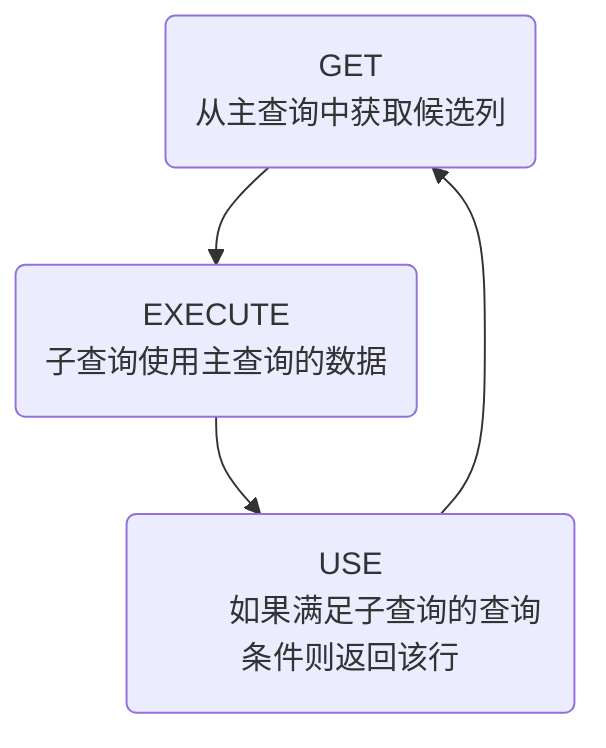

# 子查询

子查询指一个查询语句嵌套在另一个查询语句内部的查询，这个特性从MySQL 4.1开始引入。

SQL 中子查询的使用大大增强了 SELECT 查询的能力，因为很多时候查询需要从结果集中获取数据，或者需要从同一个表中先计算得出一个数据结果，然后与这个数据结果（可能是某个标量，也可能是某个集合）进行比较。 

## 1. 需求分析与问题解决

### 1.1 实际问题 

MainQuery：谁的工资比Abel高？

SubQuery：Abel的工资是多少？

现有解决方式：  

```sql
#方式一：
SELECT salary
FROM employees
WHERE last_name = 'Abel';

SELECT last_name,salary
FROM employees
WHERE salary > 11000;

#方式二：自连接
SELECT e2.last_name,e2.salary
FROM employees e1,employees e2
WHERE e1.last_name = 'Abel'
AND e1.`salary` < e2.`salary`;

#方式三：子查询
SELECT last_name,salary
FROM employees
WHERE salary > (
    SELECT salary
    FROM employees
    WHERE last_name = 'Abel'
);

+-----------+----------+
| last_name | salary   |
+-----------+----------+
| King      | 24000.00 |
| Kochhar   | 17000.00 |
| De Haan   | 17000.00 |
| Greenberg | 12000.00 |
| Russell   | 14000.00 |
| Partners  | 13500.00 |
| Errazuriz | 12000.00 |
| Ozer      | 11500.00 |
| Hartstein | 13000.00 |
| Higgins   | 12000.00 |
+-----------+----------+
10 rows in set (0.00 sec)
```

### 1.2 子查询的基本使用

- 子查询的基本语法结构： 

```sql
SELECT 	select_list
FROM	table
WHERE	expr operator
    (SELECT		select list
     FROM	    table);
```

- 子查询（内查询）在主查询之前一次执行完成。
- 子查询的结果被主查询（外查询）使用 。
- **注意事项**
  - 子查询要包含在括号内
  - 将子查询放在比较条件的右侧
  - 单行操作符对应单行子查询，多行操作符对应多行子查询 


### 1.3 子查询的分类

**分类方式1：**

我们按内查询的结果返回一条还是多条记录，将子查询分为 **单行子查询 、 多行子查询** 。

- 单行子查询   


- 多行子查询 


**分类方式2：**

我们按内查询是否被执行多次，将子查询划分为 **相关(或关联)子查询 和 不相关(或非关联)子查询 。**

子查询从数据表中查询了数据结果，如果这个数据结果只执行一次，然后这个数据结果作为主查询的条件进行执行，那么这样的子查询叫做不相关子查询。

同样，如果子查询需要执行多次，即采用循环的方式，先从外部查询开始，每次都传入子查询进行查询，然后再将结果反馈给外部，这种嵌套的执行方式就称为相关子查询。  

## 2. 单行子查询

### 2.1 单行比较操作符 

| 操作符 | 含义                     |
| ------ | ------------------------ |
| =      | equal to                 |
| >      | greater than             |
| >=     | greater than or equal to |
| <      | less than                |
| <=     | less than or equal to    |
| <>     | not equal to             |

### 2.2 代码示例

**题目：查询工资大于149号员工工资的员工的信息** 

```sql
mysql> select last_name
    -> from employees
    -> where salary > (
    -> 		select salary
    ->     	from employees
    ->    	where employee_id = 149
    -> );
+-----------+
| last_name |
+-----------+
| King      |
| Kochhar   |
| De Haan   |
| Greenberg |
| Raphaely  |
| Russell   |
| Partners  |
| Errazuriz |
| Cambrault |
| Ozer      |
| Abel      |
| Hartstein |
| Higgins   |
+-----------+
13 rows in set (0.00 sec)
```

**题目：返回job_id与141号员工相同，salary比143号员工多的员工姓名，job_id和工资**  

```sql
mysql> SELECT last_name, job_id, salary
    -> FROM employees
    -> WHERE job_id =
    -> (SELECT job_id
    -> FROM employees
    -> WHERE employee_id = 141)
    -> AND salary >
    -> (SELECT salary
    -> FROM employees
    -> WHERE employee_id = 143);
+-------------+----------+---------+
| last_name   | job_id   | salary  |
+-------------+----------+---------+
| Nayer       | ST_CLERK | 3200.00 |
| Mikkilineni | ST_CLERK | 2700.00 |
| Bissot      | ST_CLERK | 3300.00 |
| Atkinson    | ST_CLERK | 2800.00 |
| Mallin      | ST_CLERK | 3300.00 |
| Rogers      | ST_CLERK | 2900.00 |
| Ladwig      | ST_CLERK | 3600.00 |
| Stiles      | ST_CLERK | 3200.00 |
| Seo         | ST_CLERK | 2700.00 |
| Rajs        | ST_CLERK | 3500.00 |
| Davies      | ST_CLERK | 3100.00 |
+-------------+----------+---------+
11 rows in set (0.00 sec)
```

**题目：返回公司工资最少的员工的last_name,job_id和salary** 

```sql
mysql> SELECT last_name, job_id, salary
    -> FROM employees
    -> WHERE salary =
    -> (SELECT MIN(salary)
    -> FROM employees);
+-----------+----------+---------+
| last_name | job_id   | salary  |
+-----------+----------+---------+
| Olson     | ST_CLERK | 2100.00 |
+-----------+----------+---------+
1 row in set (0.00 sec)
```

**题目：查询与141号或174号员工的manager_id和department_id相同的其他员工的employee_id，manager_id，department_id**  

实现方式1：不成对比较 

```sql
SELECT employee_id, manager_id, department_id
FROM employees
WHERE manager_id IN
(SELECT manager_id
FROM employees
WHERE employee_id IN (174,141))
AND department_id IN
(SELECT department_id
FROM employees
WHERE employee_id IN (174,141))
AND employee_id NOT IN(174,141);
```

实现方式2：成对比较 

```sql
SELECT employee_id, manager_id, department_id
FROM employees
WHERE (manager_id, department_id) IN
(SELECT manager_id, department_id
FROM employees
WHERE employee_id IN (141,174))
AND employee_id NOT IN (141,174);

+-------------+------------+---------------+
| employee_id | manager_id | department_id |
+-------------+------------+---------------+
|         142 |        124 |            50 |
|         143 |        124 |            50 |
|         144 |        124 |            50 |
|         196 |        124 |            50 |
|         197 |        124 |            50 |
|         198 |        124 |            50 |
|         199 |        124 |            50 |
|         175 |        149 |            80 |
|         176 |        149 |            80 |
|         177 |        149 |            80 |
|         179 |        149 |            80 |
+-------------+------------+---------------+
11 rows in set (0.00 sec)
```

### 2.3 HAVING 中的子查询

- 首先执行子查询。
- 向主查询中的HAVING 子句返回结果。

题目：查询最低工资大于50号部门最低工资的部门id和其最低工资 

```sql
SELECT department_id, MIN(salary)
FROM employees
GROUP BY department_id
HAVING MIN(salary) >
  (SELECT MIN(salary)
  FROM employees
  WHERE department_id = 50);
```

### 2.4 CASE中的子查询

在CASE表达式中使用单列子查询：

题目：显式员工的employee_id,last_name和location。其中，若员工department_id与location_id为800的department_id相同，则location为’Canada’，其余则为’USA’。  

```sql
SELECT employee_id, last_name,
(CASE department_id
WHEN
(SELECT department_id FROM departments
WHERE location_id = 1800)
THEN 'Canada' ELSE 'USA' END) location
FROM employees;
```

### 2.5 子查询中的空值问题  

```sql
mysql> SELECT last_name, job_id
    -> FROM employees
    -> WHERE job_id =
    ->   (SELECT job_id
    ->   FROM employees
    ->   WHERE last_name = 'Haas');
Empty set (0.01 sec)
或
now rows selected
```

子查询不返回任何行 

### 2.6 非法使用子查询 

```sql
mysql> SELECT employee_id, last_name
    -> FROM employees
    -> WHERE salary =
    ->   (SELECT MIN(salary)
    ->   FROM employees
    ->   GROUP BY department_id);
ERROR 1242 (21000): Subquery returns more than 1 row
```

多行子查询使用单行比较符

## 3. 多行子查询

- 也称为集合比较子查询
- 内查询返回多行
- 使用多行比较操作符

### 3.1 多行比较操作符 

| 操作符 | 含义                                                     |
| ------ | -------------------------------------------------------- |
| IN     | 等于列表中的任意一个                                     |
| ANY    | 需要和单行比较操作符一起使用，和子查询返回的某一个值比较 |
| ALL    | 需要和单行比较操作符一起使用，和子查询返回的所有值比较   |
| SOME   | 实际上是ANY的别名，作用相同，一般常使用ANY               |

体会 ANY 和 ALL 的区别 

### 3.2 代码示例

题目：返回其它job_id中比job_id为‘IT_PROG’部门任一工资低的员工的员工号、姓名、job_id 以及salary 

```sql
mysql> SELECT employee_id, last_name, job_id, salary
    -> FROM   employees
    -> WHERE  salary < ANY
    ->                    (SELECT salary
    ->                     FROM employees
    ->                     WHERE job_id = 'IT_PROG')
    -> AND    job_id <> 'IT_PROG';
+-------------+-------------+------------+---------+
| employee_id | last_name   | job_id     | salary  |
+-------------+-------------+------------+---------+
|         110 | Chen        | FI_ACCOUNT | 8200.00 |
|         111 | Sciarra     | FI_ACCOUNT | 7700.00 |
|         112 | Urman       | FI_ACCOUNT | 7800.00 |
...
|         202 | Fay         | MK_REP     | 6000.00 |
|         203 | Mavris      | HR_REP     | 6500.00 |
|         206 | Gietz       | AC_ACCOUNT | 8300.00 |
+-------------+-------------+------------+---------+
76 rows in set (0.01 sec)
```

**题目：返回其它job_id中比job_id为‘IT_PROG’部门所有工资都低的员工的员工号、姓名、job_id以及salary**  

```sql
mysql> SELECT employee_id, last_name, job_id, salary
    -> FROM   employees
    -> WHERE  salary < ALL
    ->                     (SELECT salary
    ->                      FROM employees
    ->                      WHERE job_id = 'IT_PROG')
    -> AND    job_id <> 'IT_PROG';
+-------------+-------------+----------+---------+
| employee_id | last_name   | job_id   | salary  |
+-------------+-------------+----------+---------+
|         115 | Khoo        | PU_CLERK | 3100.00 |
|         116 | Baida       | PU_CLERK | 2900.00 |
|         117 | Tobias      | PU_CLERK | 2800.00 |
...
|         197 | Feeney      | SH_CLERK | 3000.00 |
|         198 | OConnell    | SH_CLERK | 2600.00 |
|         199 | Grant       | SH_CLERK | 2600.00 |
+-------------+-------------+----------+---------+
44 rows in set (0.00 sec)
```

**题目：查询平均工资最低的部门id** 

```sql
#方式1：
SELECT department_id
FROM employees
GROUP BY department_id
HAVING AVG(salary) = (
        SELECT MIN(avg_sal)
        FROM (
                SELECT AVG(salary) avg_sal
                FROM employees
                GROUP BY department_id
        ) dept_avg_sal
)

#方式2：
SELECT department_id
FROM employees
GROUP BY department_id
HAVING AVG(salary) <= ALL (
    SELECT AVG(salary) avg_sal
    FROM employees
    GROUP BY department_id
)
```

### 3.3 空值问题 

```sql
mysql> SELECT last_name
    -> FROM employees
    -> WHERE employee_id NOT IN (
    ->     SELECT manager_id
    ->     FROM employees);
Empty set (0.00 sec)
或
now rows selected
```

## 4. 相关子查询  

### 4.1 相关子查询执行流程

如果子查询的执行依赖于外部查询，通常情况下都是因为子查询中的表用到了外部的表，并进行了条件关联，因此每执行一次外部查询，子查询都要重新计算一次，这样的子查询就称之为 **关联子查询** 。

相关子查询按照一行接一行的顺序执行，主查询的每一行都执行一次子查询。



```sql
SELECT	column1, column2, ...
FROM	table1 outer
WHERE	column1 operator
						(SELECT column1, column2
                         FROM	table2
                         WHERE 	expr1 = outer.expr2);
```

说明：子查询中使用主查询中的列 

### 4.2 代码示例

题目：查询员工中工资大于本部门平均工资的员工的last_name,salary和其department_id

**方式一：相关子查询** 

```sql
SELECT  a.last_name, a.salary, a.department_id
FROM    employees a
WHERE   a.salary > (SELECT AVG(b.salary)
                    FROM   employees b
                    WHERE  b.department_id = a.department_id);

+-----------+----------+---------------+
| last_name | salary   | department_id |
+-----------+----------+---------------+
| King      | 24000.00 |            90 |
| Hunold    |  9000.00 |            60 |
| Ernst     |  6000.00 |            60 |
...
| Everett   |  3900.00 |            50 |
| Hartstein | 13000.00 |            20 |
| Higgins   | 12000.00 |           110 |
+-----------+----------+---------------+
38 rows in set (0.01 sec)
```

**方式二：在 FROM 中使用子查询** 

```sql
SELECT last_name,salary,e1.department_id
FROM employees e1,(SELECT department_id,AVG(salary) dept_avg_sal 
                   FROM employees                        
                   GROUP BY department_id) e2
WHERE e1.`department_id` = e2.department_id
AND e2.dept_avg_sal < e1.`salary`;
```

在ORDER BY 中使用子查询：  

**题目：查询员工的id,salary,按照department_name 排序**  

```sql
SELECT employee_id,salary
FROM employees e
ORDER BY (
    SELECT department_name
    FROM departments d
    WHERE e.`department_id` = d.`department_id`
);
```

**题目：若employees表中employee_id与job_history表中employee_id相同的数目不小于2，输出这些相同id的员工的employee_id,last_name和其job_id** 

```sql
SELECT e.employee_id, last_name,e.job_id
FROM employees e
WHERE 2 <= (SELECT COUNT(*)
  FROM job_history
  WHERE employee_id = e.employee_id);
```

### 4.3 EXISTS与NOT EXISTS关键字

- 关联子查询通常也会和 EXISTS操作符一起来使用，用来检查在子查询中是否存在满足条件的行。
- 如果在子查询中不存在满足条件的行：
  - 条件返回 FALSE
  - 继续在子查询中查找

- 如果在子查询中存在满足条件的行：
  - 不在子查询中继续查找
  - 条件返回 TRUE

- NOT EXISTS关键字表示如果不存在某种条件，则返回TRUE，否则返回FALSE。

**题目：查询公司管理者的employee_id，last_name，job_id，department_id信息**

方式一： 

```sql
SELECT employee_id, last_name, job_id, department_id
FROM employees e1
WHERE EXISTS ( SELECT *
FROM employees e2
WHERE e2.manager_id =
e1.employee_id);
```

方式二：自连接 

```sql
SELECT DISTINCT e1.employee_id, e1.last_name, e1.job_id, e1.department_id
FROM employees e1 JOIN employees e2
WHERE e1.employee_id = e2.manager_id;
```

方式三： 

```sql
SELECT employee_id,last_name,job_id,department_id
FROM employees
WHERE employee_id IN (
SELECT DISTINCT manager_id
FROM employees);
```

**题目：查询departments表中，不存在于employees表中的部门的department_id和department_name** 

```sql
SELECT department_id, department_name
FROM departments d
WHERE NOT EXISTS (SELECT 'X'
FROM employees
WHERE department_id = d.department_id);

+---------------+----------------------+
| department_id | department_name      |
+---------------+----------------------+
|           120 | Treasury             |
|           130 | Corporate Tax        |
|           140 | Control And Credit   |
...
|           250 | Retail Sales         |
|           260 | Recruiting           |
|           270 | Payroll              |
+---------------+----------------------+
16 rows in set (0.00 sec)
```

### 4.4 相关更新 

```sql
UPDATE table1 alias1
SET column = (SELECT expression
  FROM table2 alias2
  WHERE alias1.column = alias2.column);
```

使用相关子查询依据一个表中的数据更新另一个表的数据。

题目：在employees中增加一个department_name字段，数据为员工对应的部门名称 

```sql
# 1）
ALTER TABLE employees
ADD(department_name VARCHAR2(14));

# 2）
UPDATE employees e
SET department_name = (SELECT department_name
FROM departments d
WHERE e.department_id = d.department_id);
```

### 4.5 相关删除  

```sql
DELETE FROM table1 alias1
WHERE column operator (SELECT expression
                      FROM table2 alias2
                      WHERE alias1.column = alias2.column);
```

使用相关子查询依据一个表中的数据删除另一个表的数据。

题目：删除表employees中，其与emp_history表皆有的数据  

```sql
DELETE FROM employees e
WHERE employee_id in
      (SELECT employee_id
      FROM emp_history
      WHERE employee_id = e.employee_id);
```

## 5. 抛一个思考题

问题：谁的工资比Abel的高？

解答： 

```sql
#方式1：自连接
SELECT e2.last_name,e2.salary
FROM employees e1,employees e2
WHERE e1.last_name = 'Abel'
AND e1.`salary` < e2.`salary`;

#方式2：子查询
SELECT last_name,salary
FROM employees
WHERE salary > (
SELECT salary
FROM employees
WHERE last_name = 'Abel');
```

**问题**：以上两种方式有好坏之分吗？

**解答**：**自连接方式好！**

目中可以使用子查询，也可以使用自连接。一般情况建议你使用自连接，因为在许多 DBMS 的处理过程中，对于自连接的处理速度要比子查询快得多。

可以这样理解：子查询实际上是通过未知表进行查询后的条件判断，而自连接是通过已知的自身数据表进行条件判断，因此在大部分 DBMS 中都对自连接处理进行了优化。 

## 6. 章节练习

1.查询和Zlotkey相同部门的员工姓名和工资 

```sql
SELECT last_name, salary
FROM employees
WHERE department_id = (
  SELECT department_id
  FROM employees
  WHERE last_name = 'Zlotkey'
)
```

2.查询工资比公司平均工资高的员工的员工号，姓名和工资 

```sql
SELECT employee_id, last_name, salary
FROM employees
WHERE salary > (
  SELECT AVG(salary)
  FROM employees
)
```

3.选择工资大于所有JOB_ID = 'SA_MAN'的员工的工资的员工的last_name,job_id, salary 

```sql
SELECT last_name,job_id,salary
FROM employees
WHERE salary > ALL (
  SELECT salary
  FROM employees
  WHERE job_id = 'SA_MAN'
)
```

4.查询和姓名中包含字母u的员工在相同部门的员工的员工号和姓名 

```sql
SELECT employee_id, last_name
FROM employees
WHERE department_id = ANY(
  SELECT DISTINCT department_id
  FROM employees
  WHERE last_name LIKE '%u%'
)
```

5.查询在部门的location_id为1700的部门工作的员工的员工号 

```sql
SELECT employee_id
FROM employees
WHERE department_id IN (
  SELECT department_id
  FROM departments
  WHERE location_id = 1700
)
```

6.查询管理者是King的员工姓名和工资 

```sql
SELECT last_name, salary
FROM employees
WHERE manager_id IN (
  SELECT employee_id
  FROM employees
  WHERE last_name = 'King'
)
```

7.查询工资最低的员工信息: last_name, salary 

```sql
SELECT last_name,salary
FROM employees
WHERE salary = (
  SELECT MIN(salary)
  FROM employees
);
```

8.查询平均工资最低的部门信息 

```sql
#方式一：
SELECT *
FROM departments
WHERE department_id = (
      SELECT department_id
      FROM employees
      GROUP BY department_id
      HAVING AVG(salary) = (
              SELECT MIN(dept_avgsal)
              FROM (
                    SELECT AVG(salary) dept_avgsal
                    FROM employees
                    GROUP BY department_id
                    ) avg_sal
              )
      );
#方式二：
SELECT *
FROM departments
WHERE department_id = (
      SELECT department_id
      FROM employees
      GROUP BY department_id
      HAVING AVG(salary) <= ALL(
            SELECT AVG(salary) avg_sal
            FROM employees
            GROUP BY department_id
            )
      );
#方式三：
SELECT *
FROM departments
WHERE department_id = (
      SELECT department_id
      FROM employees
      GROUP BY department_id
      HAVING AVG(salary) = (
              SELECT AVG(salary) avg_sal
              FROM employees
              GROUP BY department_id
              ORDER BY avg_sal
              LIMIT 0,1
              )
      )
#方式四：
SELECT d.*
FROM departments d,(
      SELECT department_id,AVG(salary) avg_sal
      FROM employees
      GROUP BY department_id
      ORDER BY avg_sal
      LIMIT 0,1) dept_avg_sal
WHERE d.department_id = dept_avg_sal.department_id;
```

9.查询平均工资最低的部门信息和该部门的平均工资（相关子查询） 

```sql
#方式一：
SELECT d.*,(SELECT AVG(salary) FROM employees WHERE department_id = d.department_id)
avg_sal
FROM departments d
WHERE department_id = (
      SELECT department_id
      FROM employees
      GROUP BY department_id
      HAVING AVG(salary) = (
            SELECT MIN(dept_avgsal)
            FROM (
                  SELECT AVG(salary) dept_avgsal
                  FROM employees
                  GROUP BY department_id
                  ) avg_sal
            )
      );

#方式二：
SELECT d.*,(SELECT AVG(salary) FROM employees WHERE department_id = d.`department_id`)
avg_sal
FROM departments d
WHERE department_id = (
      SELECT department_id
      FROM employees
      GROUP BY department_id
      HAVING AVG(salary) <= ALL(
            SELECT AVG(salary) avg_sal
            FROM employees
            GROUP BY department_id
            )
      );

#方式三：
SELECT d.*,(SELECT AVG(salary) FROM employees WHERE department_id = d.department_id)
avg_sal
FROM departments d
WHERE department_id = (
      SELECT department_id
      FROM employees
      GROUP BY department_id
      HAVING AVG(salary) = (
              SELECT AVG(salary) avg_sal
              FROM employees
              GROUP BY department_id
              ORDER BY avg_sal
              LIMIT 0,1
              )
      )  

#方式四：
SELECT d.*,dept_avg_sal.avg_sal
FROM departments d,(
      SELECT department_id,AVG(salary) avg_sal
      FROM employees
      GROUP BY department_id
      ORDER BY avg_sal
      LIMIT 0,1) dept_avg_sal
WHERE d.department_id = dept_avg_sal.department_id;
```

10.查询平均工资最高的 job 信息 

```sql
#方式一：
SELECT *
FROM jobs
WHERE job_id = (
      SELECT job_id
      FROM employees
      GROUP BY job_id
      HAVING AVG(salary) = (
              SELECT MAX(avg_sal)
              FROM(
                    SELECT AVG(salary) avg_sal
                    FROM employees
                    GROUP BY job_id
                    ) job_avgsal
              )
      );
#方式二：
SELECT *
FROM jobs
WHERE job_id = (
      SELECT job_id
      FROM employees
      GROUP BY job_id
      HAVING AVG(salary) >= ALL(
              SELECT AVG(salary)
              FROM employees
              GROUP BY job_id
              )
      );  
#方式三：
SELECT *
FROM jobs
WHERE job_id = (
      SELECT job_id
      FROM employees
      GROUP BY job_id
      HAVING AVG(salary) = (
            SELECT AVG(salary) avg_sal
            FROM employees
            GROUP BY job_id
            ORDER BY avg_sal DESC
            LIMIT 0,1
            )
      );
#方式四：
SELECT j.*
FROM jobs j,(
      SELECT job_id,AVG(salary) avg_sal
      FROM employees
      GROUP BY job_id
      ORDER BY avg_sal DESC
      LIMIT 0,1 ) job_avg_sal
WHERE j.job_id = job_avg_sal.job_id;
```

11.查询平均工资高于公司平均工资的部门有哪些? 

```sql
SELECT department_id
FROM employees
WHERE department_id IS NOT NULL
GROUP BY department_id
HAVING AVG(salary) > (
      SELECT AVG(salary)
      FROM employees
);
```

12.查询出公司中所有 manager 的详细信息. 

```sql
#方式1：
SELECT employee_id,last_name,salary
FROM employees
WHERE employee_id IN (
      SELECT DISTINCT manager_id
      FROM employees
);

#方式2：
SELECT DISTINCT e1.employee_id, e1.last_name, e1.salary
FROM employees e1 JOIN employees e2
WHERE e1.employee_id = e2.manager_id;

#方式3：
SELECT employee_id, last_name, salary
FROM employees e1
WHERE EXISTS ( SELECT *
              FROM employees e2
              WHERE e2.manager_id = e1.employee_id);
```

13.各个部门中 最高工资中最低的那个部门的 最低工资是多少? 

```sql
#方式1:
SELECT MIN(salary)
FROM employees
WHERE department_id = (
      SELECT department_id
      FROM employees
      GROUP BY department_id
      HAVING MAX(salary) = (
              SELECT MIN(max_sal)
              FROM (
              SELECT MAX(salary) max_sal
              FROM employees
              GROUP BY department_id) dept_max_sal
              )
      );
# 验证
SELECT *
FROM employees
WHERE department_id = 10;

#方式2:
SELECT MIN(salary)
FROM employees
WHERE department_id = (
      SELECT department_id
      FROM employees
      GROUP BY department_id
      HAVING MAX(salary) <= ALL(
              SELECT MAX(salary) max_sal
              FROM employees
              GROUP BY department_id
              )
      );
      
#方式3：
SELECT MIN(salary)
FROM employees
WHERE department_id = (
      SELECT department_id
      FROM employees
      GROUP BY department_id
      HAVING MAX(salary) = (
              SELECT MAX(salary) max_sal
              FROM employees
              GROUP BY department_id
              ORDER BY max_sal
              LIMIT 0,1
              )
      )
      
#方式4：
SELECT employee_id,MIN(salary)
FROM employees e,
      (SELECT department_id,MAX(salary) max_sal
      FROM employees
      GROUP BY department_id
      ORDER BY max_sal
      LIMIT 0,1) dept_max_sal
WHERE e.department_id = dept_max_sal.department_id
```

14.查询平均工资最高的部门的 manager 的详细信息: last_name,department_id, email, salary 

```sql
#方式一：
SELECT employee_id,last_name, department_id, email, salary
FROM employees
WHERE employee_id IN (
      SELECT DISTINCT manager_id
      FROM employees
      WHERE department_id = (
            SELECT department_id
            FROM employees
            GROUP BY department_id
            HAVING AVG(salary) = (
                  SELECT MAX(avg_sal)
                  FROM(
                        SELECT AVG(salary) avg_sal
                        FROM employees
                        GROUP BY department_id
                        ) dept_sal
                  )
            )
      );
#方式二：
SELECT employee_id,last_name, department_id, email, salary
FROM employees
WHERE employee_id IN (
      SELECT DISTINCT manager_id
      FROM employees
      WHERE department_id = (
            SELECT department_id
            FROM employees e
            GROUP BY department_id
            HAVING AVG(salary)>=ALL(
                  SELECT AVG(salary)
                  FROM employees
                  GROUP BY department_id
                  )
            )
      );
#方式三：
SELECT *
FROM employees
WHERE employee_id IN (
      SELECT DISTINCT manager_id
      FROM employees e,(
            SELECT department_id,AVG(salary) avg_sal
            FROM employees
            GROUP BY department_id
            ORDER BY avg_sal DESC
            LIMIT 0,1) dept_avg_sal
      WHERE e.department_id = dept_avg_sal.department_id
      )
```

15.查询部门的部门号，其中不包括job_id是"ST_CLERK"的部门号 

```sql
#方法一：
SELECT department_id
FROM departments d
WHERE department_id NOT IN (
      SELECT DISTINCT department_id
      FROM employees
      WHERE job_id = 'ST_CLERK'
      );

#方法二：
SELECT department_id
FROM departments d
WHERE NOT EXISTS (
      SELECT *
      FROM employees e
      WHERE d.`department_id` = e.`department_id`
      AND job_id = 'ST_CLERK'
      ); 
```

16.选择所有没有管理者的员工的last_name 

```sql
SELECT last_name
FROM employees e1
WHERE NOT EXISTS (
      SELECT *
      FROM employees e2
      WHERE e1.manager_id = e2.employee_id
      );
```

17.查询员工号、姓名、雇用时间、工资，其中员工的管理者为 'De Haan' 

```sql
#方式1：
SELECT employee_id, last_name, hire_date, salary
FROM employees
WHERE manager_id = (
      SELECT employee_id
      FROM employees
      WHERE last_name = 'De Haan'
)
#方式2：
SELECT employee_id, last_name, hire_date, salary
FROM employees e1
WHERE EXISTS (
      SELECT *
      FROM employees e2
      WHERE e2.`employee_id` = e1.manager_id
      AND e2.last_name = 'De Haan'
);
```

18.查询各部门中工资比本部门平均工资高的员工的员工号, 姓名和工资(难) 

```sql
#方式一：相关子查询
SELECT employee_id,last_name,salary
FROM employees e1
WHERE salary > (
      # 查询某员工所在部门的平均
      SELECT AVG(salary)
      FROM employees e2
      WHERE e2.department_id = e1.`department_id`
);
#方式二：
SELECT employee_id,last_name,salary
FROM employees e1,
(SELECT department_id,AVG(salary) avg_sal
FROM employees e2 GROUP BY department_id
) dept_avg_sal
WHERE e1.`department_id` = dept_avg_sal.department_id
AND e1.`salary` > dept_avg_sal.avg_sal;
```

19.查询每个部门下的部门人数大于 5 的部门名称 

```sql
SELECT department_name,department_id
FROM departments d
WHERE 5 < (
      SELECT COUNT(*)
      FROM employees e
      WHERE d.`department_id` = e.`department_id`
      );
```

20.查询每个国家下的部门个数大于 2 的国家编号 

```sql
SELECT country_id
FROM locations l
WHERE 2 < (
      SELECT COUNT(*)
      FROM departments d
      WHERE l.`location_id` = d.`location_id`);
```
