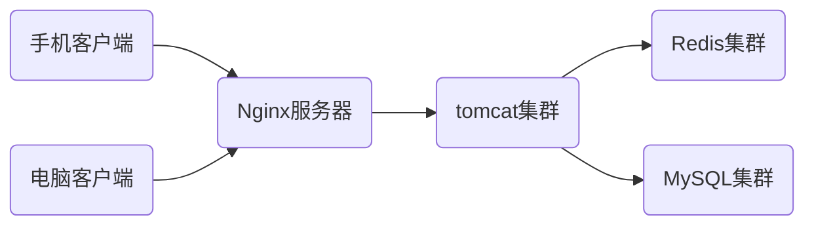
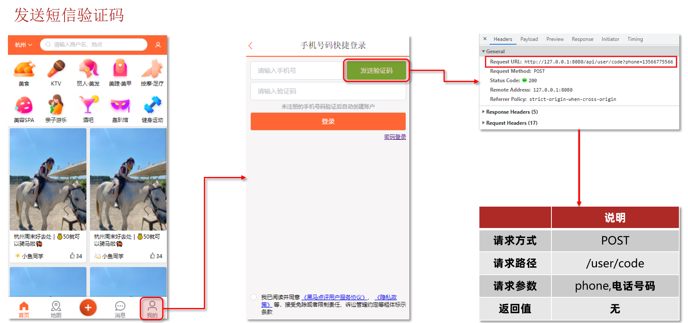
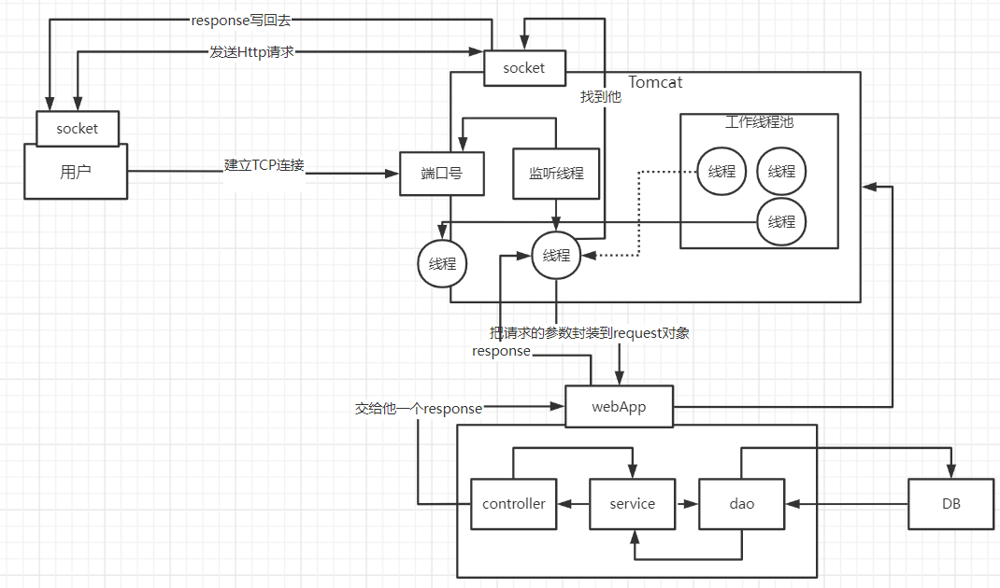
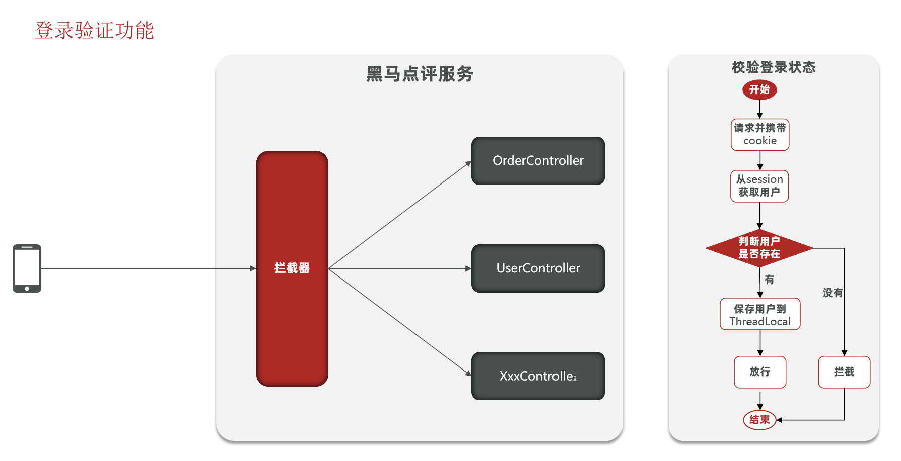
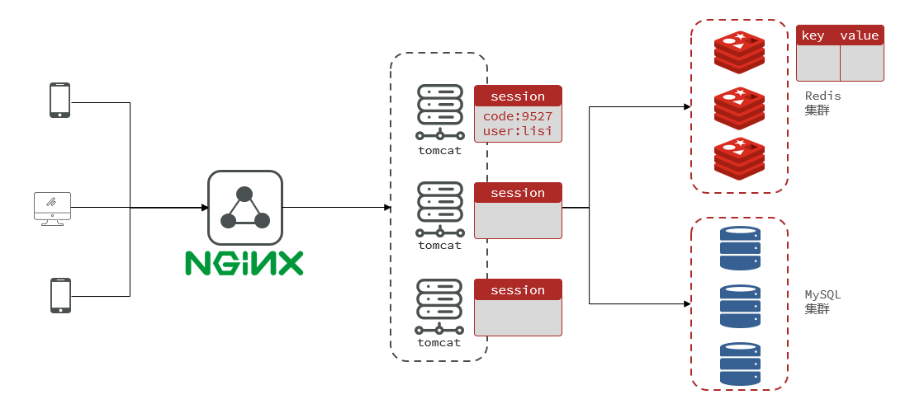
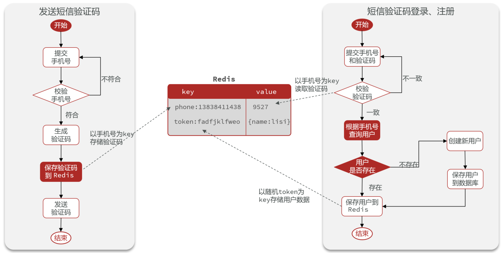
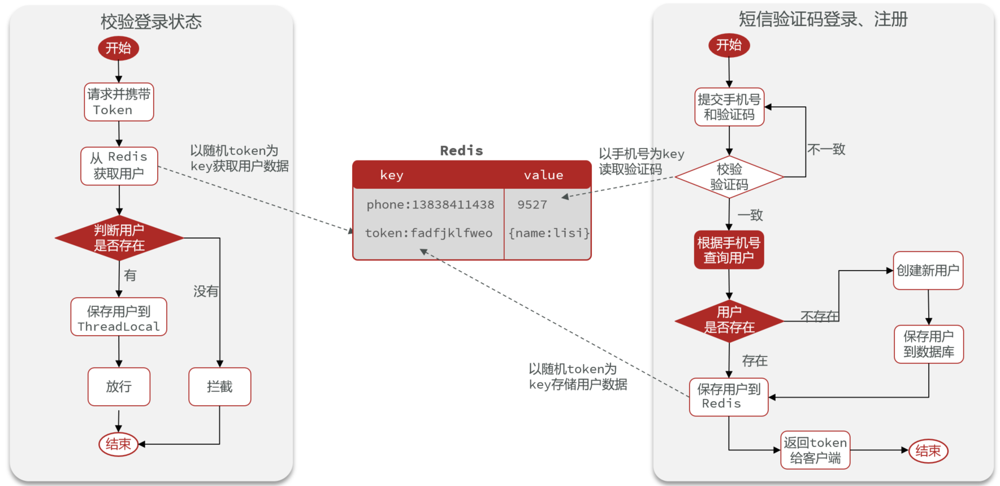
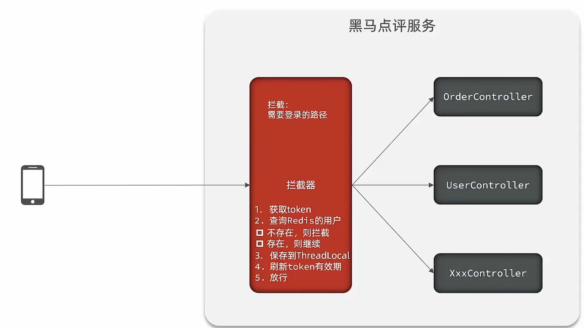
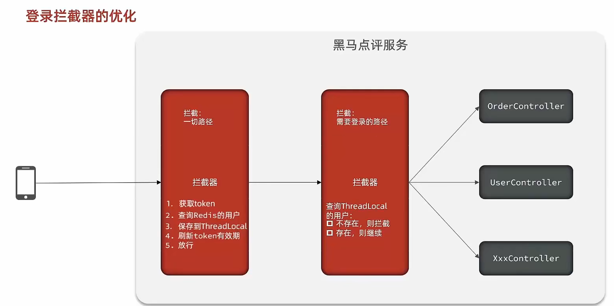

# 实战篇

## 开篇导读

亲爱的小伙伴们大家好，马上咱们就开始实战篇的内容了，相信通过本章的学习，小伙伴们就能理解各种redis的使用啦，接下来咱们来一起看看实战篇我们要学习一些什么样的内容

* 短信登录

这一块我们会使用redis共享session来实现

* 商户查询缓存

通过本章节，我们会理解缓存击穿，缓存穿透，缓存雪崩等问题，让小伙伴的对于这些概念的理解不仅仅是停留在概念上，更是能在代码中看到对应的内容

* 优惠卷秒杀

通过本章节，我们可以学会Redis的计数器功能， 结合Lua完成高性能的redis操作，同时学会Redis分布式锁的原理，包括Redis的三种消息队列

* 附近的商户

我们利用Redis的GEOHash来完成对于地理坐标的操作

* UV统计

主要是使用Redis来完成统计功能

* 用户签到

使用Redis的BitMap数据统计功能

* 好友关注

基于Set集合的关注、取消关注，共同关注等等功能，这一块知识咱们之前就讲过，这次我们在项目中来使用一下

* 打人探店

基于List来完成点赞列表的操作，同时基于SortedSet来完成点赞的排行榜功能

以上这些内容咱们统统都会给小伙伴们讲解清楚，让大家充分理解如何使用Redis

## 1.短信登录

### 1.1.导入黑马点评项目

#### 1.1.1.导入SQL

hmdp.sql（Mysql的版本采用5.7及以上版本）

**其中的表有：**

- tb_user：用户表
- tb_user_info：用户详情表
- tb_shop：商户信息表
- tb_shop_type：商户类型表
- tb_blog：用户日记表（达人探店日记）
- tb_follow：用户关注表
- tb_voucher：优惠券表
- tb_voucher_order：优惠券的订单表

#### 1.1.2.有关当前模型

手机或者app端发起请求，请求我们的nginx服务器，nginx基于七层模型走的事HTTP协议，可以实现基于Lua直接绕开tomcat访问redis，也可以作为静态资源服务器，轻松扛下上万并发， 负载均衡到下游tomcat服务器，打散流量，我们都知道一台4核8G的tomcat，在优化和处理简单业务的加持下，大不了就处理1000左右的并发， 经过nginx的负载均衡分流后，利用集群支撑起整个项目，同时nginx在部署了前端项目后，更是可以做到动静分离，进一步降低tomcat服务的压力，这些功能都得靠nginx起作用，所以nginx是整个项目中重要的一环。

在tomcat支撑起并发流量后，我们如果让tomcat直接去访问Mysql，根据经验Mysql企业级服务器只要上点并发，一般是16或32 核心cpu，32 或64G内存，像企业级mysql加上固态硬盘能够支撑的并发，大概就是4000起~7000左右，上万并发， 瞬间就会让Mysql服务器的cpu，硬盘全部打满，容易崩溃，所以我们在高并发场景下，会选择使用mysql集群，同时为了进一步降低Mysql的压力，同时增加访问的性能，我们也会加入Redis，同时使用Redis集群使得Redis对外提供更好的服务。



#### 1.1.3.导入后端项目

在资料中提供了一个项目源码：hm-dianping，将其复制到idea工作空间，然后用idea打卡即可。

修改application.yaml文件中的mysql、redis地址信息。

启动项目后，在浏览器访问：http://localhost:8081/shop-type/list

如果可以看到数据则证明运行没有问题。

#### 1.1.4.导入前端工程

在资料中提供了一个nginx文件夹：nginx-1.18.0

将其复制到任意目录，要确保该目录不包含中文、特殊字符和空格。

#### 1.1.5.运行前端项目

在nginx所在目录下打开一个CMD窗口，输入命令：

```sh
start nginx.exe
```

打开chrome浏览器，在空白页面点击鼠标右键，选择检查，即可打开开发者工具，然后打开手机模式：

然后访问: [http://127.0.0.1:8080](http://127.0.0.1:8080/) ，即可看到页面。

### 1.2 基于Session实现登录流程

**发送验证码：**

用户在提交手机号后，会校验手机号是否合法，如果不合法，则要求用户重新输入手机号。

如果手机号合法，后台此时生成对应的验证码，同时将验证码进行保存，然后再通过短信的方式将验证码发送给用户

**短信验证码登录、注册：**

用户将验证码和手机号进行输入，后台从session中拿到当前验证码，然后和用户输入的验证码进行校验，如果不一致，则无法通过校验，如果一致，则后台根据手机号查询用户，如果用户不存在，则为用户创建账号信息，保存到数据库，无论是否存在，都会将用户信息保存到session中，方便后续获得当前登录信息。

**校验登录状态:**

用户在请求时候，会从cookie中携带者JsessionId到后台，后台通过JsessionId从session中拿到用户信息，如果没有session信息，则进行拦截，如果有session信息，则将用户信息保存到threadLocal中，并且放行。


### 1.3.实现发送短信验证码功能

**页面流程**




**具体代码如下**

**贴心小提示：**

具体逻辑上文已经分析，我们仅仅只需要按照提示的逻辑写出代码即可。

* 发送验证码

```java
    @Override
    public Result sendCode(String phone, HttpSession session) {
        // 1.校验手机号
        if (RegexUtils.isPhoneInvalid(phone)) {
            // 2.如果不符合，返回错误信息
            return Result.fail("手机号格式错误！");
        }
        // 3.符合，生成验证码
        String code = RandomUtil.randomNumbers(6);

        // 4.保存验证码到 session
        session.setAttribute("code",code);
        // 5.发送验证码
        log.debug("发送短信验证码成功，验证码：{}", code);
        // 返回ok
        return Result.ok();
    }
```

* 登录

```java
    @Override
    public Result login(LoginFormDTO loginForm, HttpSession session) {
        // 1.校验手机号
        String phone = loginForm.getPhone();
        if (RegexUtils.isPhoneInvalid(phone)) {
            // 2.如果不符合，返回错误信息
            return Result.fail("手机号格式错误！");
        }
        // 3.校验验证码
        Object cacheCode = session.getAttribute("code");
        String code = loginForm.getCode();
        if(cacheCode == null || !cacheCode.toString().equals(code)){
             //3.不一致，报错
            return Result.fail("验证码错误");
        }
        //一致，根据手机号查询用户
        User user = query().eq("phone", phone).one();

        //5.判断用户是否存在
        if(user == null){
            //不存在，则创建
            user =  createUserWithPhone(phone);
        }
        //7.保存用户信息到session中
        session.setAttribute("user",user);

        return Result.ok();
    }
```

### 1.4.实现登录拦截功能

馨小贴士：tomcat的运行原理**



当用户发起请求时，会访问我们像tomcat注册的端口，任何程序想要运行，都需要有一个线程对当前端口号进行监听，tomcat也不例外，当监听线程知道用户想要和tomcat连接连接时，那会由监听线程创建socket连接，socket都是成对出现的，用户通过socket像互相传递数据，当tomcat端的socket接受到数据后，此时监听线程会从tomcat的线程池中取出一个线程执行用户请求，在我们的服务部署到tomcat后，线程会找到用户想要访问的工程，然后用这个线程转发到工程中的controller，service，dao中，并且访问对应的DB，在用户执行完请求后，再统一返回，再找到tomcat端的socket，再将数据写回到用户端的socket，完成请求和响应

通过以上讲解，我们可以得知 每个用户其实对应都是去找tomcat线程池中的一个线程来完成工作的， 使用完成后再进行回收，既然每个请求都是独立的，所以在每个用户去访问我们的工程时，我们可以使用threadlocal来做到线程隔离，每个线程操作自己的一份数据。


**温馨小贴士：关于threadlocal**

如果小伙伴们看过threadLocal的源码，你会发现在threadLocal中，无论是他的put方法和他的get方法， 都是先从获得当前用户的线程，然后从线程中取出线程的成员变量map，只要线程不一样，map就不一样，所以可以通过这种方式来做到线程隔离。



拦截器代码

```Java
public class LoginInterceptor implements HandlerInterceptor {

    @Override
    public boolean preHandle(HttpServletRequest request, HttpServletResponse response, Object handler) throws Exception {
       //1.获取session
        HttpSession session = request.getSession();
        //2.获取session中的用户
        Object user = session.getAttribute("user");
        //3.判断用户是否存在
        if(user == null){
              //4.不存在，拦截，返回401状态码
              response.setStatus(401);
              return false;
        }
        //5.存在，保存用户信息到Threadlocal
        UserHolder.saveUser((User)user);
        //6.放行
        return true;
    }
}
```

让拦截器生效

```java
@Configuration
public class MvcConfig implements WebMvcConfigurer {

    @Resource
    private StringRedisTemplate stringRedisTemplate;

    @Override
    public void addInterceptors(InterceptorRegistry registry) {
        // 登录拦截器
        registry.addInterceptor(new LoginInterceptor())
                .excludePathPatterns(
                        "/shop/**",
                        "/voucher/**",
                        "/shop-type/**",
                        "/upload/**",
                        "/blog/hot",
                        "/user/code",
                        "/user/login"
                ).order(1);
        // token刷新的拦截器
        registry.addInterceptor(new RefreshTokenInterceptor(stringRedisTemplate)).addPathPatterns("/**").order(0);
    }
}
```

### 1.5.隐藏用户敏感信息

我们通过浏览器观察到此时用户的全部信息都在，这样极为不靠谱，所以我们应当在返回用户信息之前，将用户的敏感信息进行隐藏，采用的核心思路就是书写一个UserDto对象，这个UserDto对象就没有敏感信息了，我们在返回前，将有用户敏感信息的User对象转化成没有敏感信息的UserDto对象，那么就能够避免这个尴尬的问题了

**在登录方法处修改**

```java
//7.保存用户信息到session中
session.setAttribute("user", BeanUtils.copyProperties(user,UserDTO.class));
```

**在拦截器处：**

```java
//5.存在，保存用户信息到Threadlocal
UserHolder.saveUser((UserDTO) user);
```

**在UserHolder处：将user对象换成UserDTO**

```java
public class UserHolder {
    private static final ThreadLocal<UserDTO> tl = new ThreadLocal<>();

    public static void saveUser(UserDTO user){
        tl.set(user);
    }

    public static UserDTO getUser(){
        return tl.get();
    }

    public static void removeUser(){
        tl.remove();
    }
}
```

### 1.6.session共享问题

**核心思路分析：**

每个tomcat中都有一份属于自己的session,假设用户第一次访问第一台tomcat，并且把自己的信息存放到第一台服务器的session中，但是第二次这个用户访问到了第二台tomcat，那么在第二台服务器上，肯定没有第一台服务器存放的session，所以此时 整个登录拦截功能就会出现问题，我们能如何解决这个问题呢？早期的方案是session拷贝，就是说虽然每个tomcat上都有不同的session，但是每当任意一台服务器的session修改时，都会同步给其他的Tomcat服务器的session，这样的话，就可以实现session的共享了

但是这种方案具有两个大问题

1、每台服务器中都有完整的一份session数据，服务器压力过大。

2、session拷贝数据时，可能会出现延迟

所以咱们后来采用的方案都是基于redis来完成，我们把session换成redis，redis数据本身就是共享的，就可以避免session共享的问题了

**session共享问题**：多台Tomcat并不共享session存储空间，当请求切换到不同tomcat服务时导致数据丢失的问题。

session的替代方案应该满足：

- 数据共享
- 内存存储
- key、value结构



### 1.7.Redis代替session的业务流程

#### 1.7.1.设计key的结构

首先我们要思考一下利用redis来存储数据，那么到底使用哪种结构呢？由于存入的数据比较简单，我们可以考虑使用String，或者是使用哈希，如下图，如果使用String，同学们注意他的value，用多占用一点空间，如果使用哈希，则他的value中只会存储他数据本身，如果不是特别在意内存，其实使用String就可以啦。

保存登录的用户信息，可以使用String结构，以JSON字符串来保存，比较直观：

| **KEY**          | **VALUE**                       |
| ---------------- | ------------------------------- |
| **heima:user:1** | **{"name": "Jack", "age": 21}** |
| **heima:user:2** | **{"name": "Rose", "age": 18}** |

Hash结构可以将对象中的每个字段独立存储，可以针对单个字段做CRUD，并且内存占用更少：

<table>
    <tr>
    	<td rowspan="2">KEY</td>
        <td colspan="2">VALUE</td> 
    </tr>
    <tr>
    	<td>field</td>
        <td>Value</td> 
    </tr>
    <tr>
        <td rowspan="2">heima:user:1</td>
    	<td>name</td>
        <td>Jack</td> 
    </tr>
    <tr>
    	<td>age</td>
        <td>21</td> 
    </tr>
    <tr>
        <td rowspan="2">heima:user:2</td>
    	<td>name</td>
        <td>Rose</td> 
    </tr>
    <tr>
    	<td >age</td>
        <td>18</td> 
    </tr>
</table>

#### 1.7.2.设计key的具体细节

所以我们可以使用String结构，就是一个简单的key，value键值对的方式，但是关于key的处理，session他是每个用户都有自己的session，但是redis的key是共享的，咱们就不能使用code了

在设计这个key的时候，我们之前讲过需要满足两点

1、key要具有唯一性

2、key要方便携带

如果我们采用phone：手机号这个的数据来存储当然是可以的，但是如果把这样的敏感数据存储到redis中并且从页面中带过来毕竟不太合适，所以我们在后台生成一个随机串token，然后让前端带来这个token就能完成我们的整体逻辑了

#### 1.7.3.整体访问流程

当注册完成后，用户去登录会去校验用户提交的手机号和验证码，是否一致，如果一致，则根据手机号查询用户信息，不存在则新建，最后将用户数据保存到redis，并且生成token作为redis的key，当我们校验用户是否登录时，会去携带着token进行访问，从redis中取出token对应的value，判断是否存在这个数据，如果没有则拦截，如果存在则将其保存到threadLocal中，并且放行。






### 1.8.基于Redis实现短信登录

**UserServiceImpl代码**

```java
    @Resource
    private StringRedisTemplate stringRedisTemplate;

    @Override
    public Result sendCode(String phone, HttpSession session) {
        // 1.校验手机号
        if (RegexUtils.isPhoneInvalid(phone)) {
            // 2.如果不符合，返回错误信息
            return Result.fail("手机号格式错误！");
        }
        // 3.符合，生成验证码
        String code = RandomUtil.randomNumbers(6);

        // 4.保存验证码到 session
        stringRedisTemplate.opsForValue().set(LOGIN_CODE_KEY + phone, code, LOGIN_CODE_TTL, TimeUnit.MINUTES);

        // 5.发送验证码
        log.debug("发送短信验证码成功，验证码：{}", code);
        // 返回ok
        return Result.ok();
    }

    @Override
    public Result login(LoginFormDTO loginForm, HttpSession session) {
        // 1.校验手机号
        String phone = loginForm.getPhone();
        if (RegexUtils.isPhoneInvalid(phone)) {
            // 2.如果不符合，返回错误信息
            return Result.fail("手机号格式错误！");
        }
        // 3.从redis获取验证码并校验
        String cacheCode = stringRedisTemplate.opsForValue().get(LOGIN_CODE_KEY + phone);
        String code = loginForm.getCode();
        if (cacheCode == null || !cacheCode.equals(code)) {
            // 不一致，报错
            return Result.fail("验证码错误");
        }

        // 4.一致，根据手机号查询用户 select * from tb_user where phone = ?
        User user = query().eq("phone", phone).one();

        // 5.判断用户是否存在
        if (user == null) {
            // 6.不存在，创建新用户并保存
            user = createUserWithPhone(phone);
        }

        // 7.保存用户信息到 redis中
        // 7.1.随机生成token，作为登录令牌
        String token = UUID.randomUUID().toString(true);
        // 7.2.将User对象转为HashMap存储
        UserDTO userDTO = BeanUtil.copyProperties(user, UserDTO.class);
        Map<String, Object> userMap = BeanUtil.beanToMap(userDTO, new HashMap<>(),
                CopyOptions.create()
                        .setIgnoreNullValue(true)
                        .setFieldValueEditor((fieldName, fieldValue) -> fieldValue.toString()));
        // 7.3.存储
        String tokenKey = LOGIN_USER_KEY + token;
        stringRedisTemplate.opsForHash().putAll(tokenKey, userMap);
        // 7.4.设置token有效期
        stringRedisTemplate.expire(tokenKey, LOGIN_USER_TTL, TimeUnit.MINUTES);

        // 8.返回token
        return Result.ok(token);
    }
```

### 1.9.解决状态登录刷新问题

#### 1.9.1.初始方案思路总结：

在这个方案中，他确实可以使用对应路径的拦截，同时刷新登录token令牌的存活时间，但是现在这个拦截器他只是拦截需要被拦截的路径，假设当前用户访问了一些不需要拦截的路径，那么这个拦截器就不会生效，所以此时令牌刷新的动作实际上就不会执行，所以这个方案他是存在问题的



####  1.9.2.优化方案

既然之前的拦截器无法对不需要拦截的路径生效，那么我们可以添加一个拦截器，在第一个拦截器中拦截所有的路径，把第二个拦截器做的事情放入到第一个拦截器中，同时刷新令牌，因为第一个拦截器有了threadLocal的数据，所以此时第二个拦截器只需要判断拦截器中的user对象是否存在即可，完成整体刷新功能。



**MvcConfig**

```java
@Configuration
public class MvcConfig implements WebMvcConfigurer {

    @Resource
    private StringRedisTemplate stringRedisTemplate;

    @Override
    public void addInterceptors(InterceptorRegistry registry) {
        // 登录拦截器
        registry.addInterceptor(new LoginInterceptor())
                .excludePathPatterns(
                        "/shop/**",
                        "/voucher/**",
                        "/shop-type/**",
                        "/upload/**",
                        "/blog/hot",
                        "/user/code",
                        "/user/login"
                ).order(1);
        // token刷新的拦截器
        registry.addInterceptor(new RefreshTokenInterceptor(stringRedisTemplate)).addPathPatterns("/**").order(0);
    }
}
```

**RefreshTokenInterceptor**

```java
public class RefreshTokenInterceptor implements HandlerInterceptor {

    private StringRedisTemplate stringRedisTemplate;

    public RefreshTokenInterceptor(StringRedisTemplate stringRedisTemplate) {
        this.stringRedisTemplate = stringRedisTemplate;
    }

    @Override
    public boolean preHandle(HttpServletRequest request, HttpServletResponse response, Object handler) throws Exception {
        // 1.获取请求头中的token
        String token = request.getHeader("authorization");
        if (StrUtil.isBlank(token)) {
            return true;
        }
        // 2.基于TOKEN获取redis中的用户
        String key  = LOGIN_USER_KEY + token;
        Map<Object, Object> userMap = stringRedisTemplate.opsForHash().entries(key);
        // 3.判断用户是否存在
        if (userMap.isEmpty()) {
            return true;
        }
        // 5.将查询到的hash数据转为UserDTO
        UserDTO userDTO = BeanUtil.fillBeanWithMap(userMap, new UserDTO(), false);
        // 6.存在，保存用户信息到 ThreadLocal
        UserHolder.saveUser(userDTO);
        // 7.刷新token有效期
        stringRedisTemplate.expire(key, LOGIN_USER_TTL, TimeUnit.MINUTES);
        // 8.放行
        return true;
    }

    @Override
    public void afterCompletion(HttpServletRequest request, HttpServletResponse response, Object handler, Exception ex) throws Exception {
        // 移除用户
        UserHolder.removeUser();
    }
}
	
```

**LoginInterceptor**

```java
public class LoginInterceptor implements HandlerInterceptor {

    @Override
    public boolean preHandle(HttpServletRequest request, HttpServletResponse response, Object handler) throws Exception {
        // 1.判断是否需要拦截（ThreadLocal中是否有用户）
        if (UserHolder.getUser() == null) {
            // 没有，需要拦截，设置状态码
            response.setStatus(401);
            // 拦截
            return false;
        }
        // 有用户，则放行
        return true;
    }
}
```


