# 实战篇(二)

## 3. 优惠卷秒杀

### 3.1 全局唯一ID

每个店铺都可以发布优惠券。

当用户抢购时，就会生成订单并保存到tb_voucher_order这张表中，而订单表如果使用数据库自增ID就存在一些问题：

* id的规律性太明显
* 受单表数据量的限制

场景分析：如果我们的id具有太明显的规则，用户或者说商业对手很容易猜测出来我们的一些敏感信息，比如商城在一天时间内，卖出了多少单，这明显不合适。

场景分析二：随着我们商城规模越来越大，mysql的单表的容量不宜超过500W，数据量过大之后，我们要进行拆库拆表，但拆分表了之后，他们从逻辑上讲他们是同一张表，所以他们的id是不能一样的， 于是乎我们需要保证id的唯一性。

**全局ID生成器**，是一种在分布式系统下用来生成全局唯一ID的工具，一般要满足下列特性：

- 唯一性
- 高可用
- 高性能
- 递增性
- 安全性

为了增加ID的安全性，我们可以不直接使用Redis自增的数值，而是拼接一些其它信息：

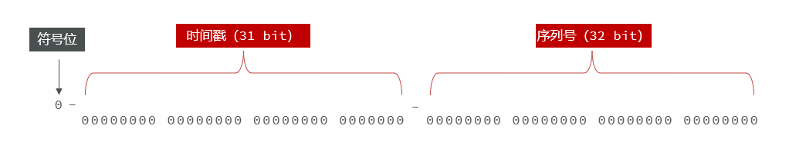

ID的组成部分：符号位：1bit，永远为0

时间戳：31bit，以秒为单位，可以使用69年

序列号：32bit，秒内的计数器，支持每秒产生2^32个不同ID

### 3.2 Redis实现全局唯一Id

```java
@Component
public class RedisIdWorker {
    /**
     * 开始时间戳
     */
    private static final long BEGIN_TIMESTAMP = 1640995200L;
    /**
     * 序列号的位数
     */
    private static final int COUNT_BITS = 32;

    private StringRedisTemplate stringRedisTemplate;

    public RedisIdWorker(StringRedisTemplate stringRedisTemplate) {
        this.stringRedisTemplate = stringRedisTemplate;
    }

    public long nextId(String keyPrefix) {
        // 1.生成时间戳
        LocalDateTime now = LocalDateTime.now();
        long nowSecond = now.toEpochSecond(ZoneOffset.UTC);
        long timestamp = nowSecond - BEGIN_TIMESTAMP;

        // 2.生成序列号
        // 2.1.获取当前日期，精确到天
        String date = now.format(DateTimeFormatter.ofPattern("yyyy:MM:dd"));
        // 2.2.自增长
        long count = stringRedisTemplate.opsForValue().increment("icr:" + keyPrefix + ":" + date);

        // 3.拼接并返回
        return timestamp << COUNT_BITS | count;
    }
}
```

测试类

知识小贴士：关于countdownlatch

countdownlatch名为信号枪：主要的作用是同步协调在多线程的等待于唤醒问题

我们如果没有CountDownLatch ，那么由于程序是异步的，当异步程序没有执行完时，主线程就已经执行完了，然后我们期望的是分线程全部走完之后，主线程再走，所以我们此时需要使用到CountDownLatch

CountDownLatch 中有两个最重要的方法

1、countDown

2、await

await 方法是阻塞方法，我们担心分线程没有执行完时，main线程就先执行，所以使用await可以让main线程阻塞。

那么什么时候main线程不再阻塞呢？

当CountDownLatch  内部维护的 变量变为0时，就不再阻塞，直接放行。

那么什么时候CountDownLatch   维护的变量变为0 呢？

我们只需要调用一次countDown ，内部变量就减少1，我们让分线程和变量绑定， 执行完一个分线程就减少一个变量，当分线程全部走完，CountDownLatch 维护的变量就是0，此时await就不再阻塞，统计出来的时间也就是所有分线程执行完后的时间。

```java
@Test
void testIdWorker() throws InterruptedException {
    CountDownLatch latch = new CountDownLatch(300);

    Runnable task = () -> {
        for (int i = 0; i < 100; i++) {
            long id = redisIdWorker.nextId("order");
            System.out.println("id = " + id);
        }
        latch.countDown();
    };
    long begin = System.currentTimeMillis();
    for (int i = 0; i < 300; i++) {
        es.submit(task);
    }
    latch.await();
    long end = System.currentTimeMillis();
    System.out.println("time = " + (end - begin));
}
```

**全局唯一ID生成策略：**

- UUID
- Redis自增
- snowflake算法
- 数据库自增

**Redis自增ID策略：**

- 每天一个key，方便统计订单量
- ID构造是 时间戳 + 计数器

### 3.3 添加优惠卷

每个店铺都可以发布优惠券，分为平价券和特价券。平价券可以任意购买，而特价券需要秒杀抢购：


tb_voucher：优惠券的基本信息，优惠金额、使用规则等
tb_seckill_voucher：优惠券的库存、开始抢购时间，结束抢购时间。特价优惠券才需要填写这些信息

平价卷由于优惠力度并不是很大，所以是可以任意领取

而代金券由于优惠力度大，所以像第二种卷，就得限制数量，从表结构上也能看出，特价卷除了具有优惠卷的基本信息以外，还具有库存，抢购时间，结束时间等等字段

**新增普通卷代码**：VoucherController

```java
@PostMapping
public Result addVoucher(@RequestBody Voucher voucher) {
    voucherService.save(voucher);
    return Result.ok(voucher.getId());
}
```

**新增秒杀卷代码：**

**VoucherController**

```java
@PostMapping("seckill")
public Result addSeckillVoucher(@RequestBody Voucher voucher) {
    voucherService.addSeckillVoucher(voucher);
    return Result.ok(voucher.getId());
}
```

**VoucherServiceImpl**

```java
@Override
@Transactional
public void addSeckillVoucher(Voucher voucher) {
    // 保存优惠券
    save(voucher);
    // 保存秒杀信息
    SeckillVoucher seckillVoucher = new SeckillVoucher();
    seckillVoucher.setVoucherId(voucher.getId());
    seckillVoucher.setStock(voucher.getStock());
    seckillVoucher.setBeginTime(voucher.getBeginTime());
    seckillVoucher.setEndTime(voucher.getEndTime());
    seckillVoucherService.save(seckillVoucher);
    // 保存秒杀库存到Redis中
    stringRedisTemplate.opsForValue().set(SECKILL_STOCK_KEY + voucher.getId(), voucher.getStock().toString());
}
```

### 3.4 实现秒杀下单

下单核心思路：当我们点击抢购时，会触发右侧的请求，我们只需要编写对应的controller即可

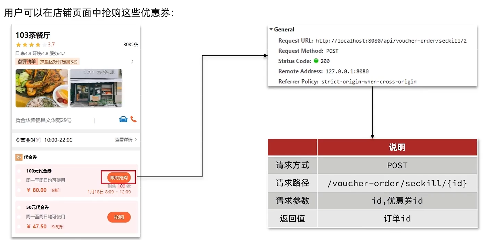

秒杀下单应该思考的内容：

下单时需要判断两点：

* 秒杀是否开始或结束，如果尚未开始或已经结束则无法下单
* 库存是否充足，不足则无法下单

下单核心逻辑分析：

当用户开始进行下单，我们应当去查询优惠卷信息，查询到优惠卷信息，判断是否满足秒杀条件

比如时间是否充足，如果时间充足，则进一步判断库存是否足够，如果两者都满足，则扣减库存，创建订单，然后返回订单id，如果有一个条件不满足则直接结束。


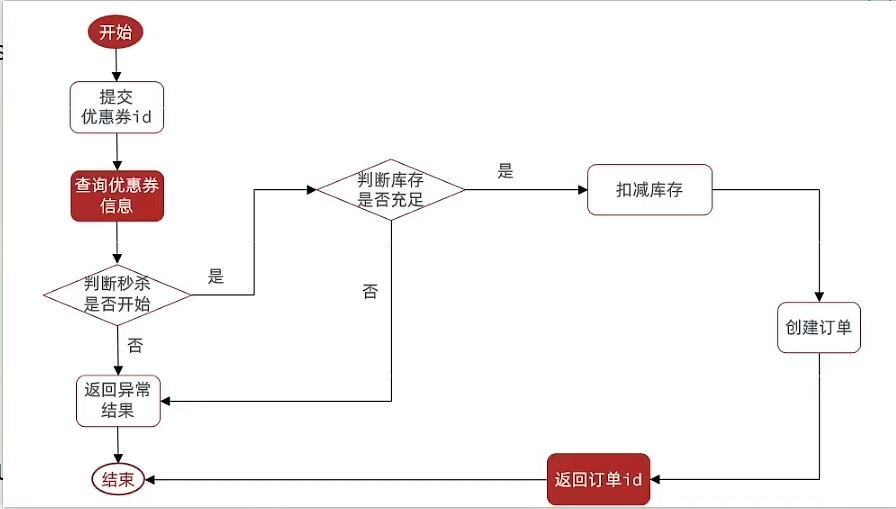

VoucherOrderServiceImpl

```java
@Override
public Result seckillVoucher(Long voucherId) {
    // 1.查询优惠券
    SeckillVoucher voucher = seckillVoucherService.getById(voucherId);
    // 2.判断秒杀是否开始
    if (voucher.getBeginTime().isAfter(LocalDateTime.now())) {
        // 尚未开始
        return Result.fail("秒杀尚未开始！");
    }
    // 3.判断秒杀是否已经结束
    if (voucher.getEndTime().isBefore(LocalDateTime.now())) {
        // 尚未开始
        return Result.fail("秒杀已经结束！");
    }
    // 4.判断库存是否充足
    if (voucher.getStock() < 1) {
        // 库存不足
        return Result.fail("库存不足！");
    }
    //5，扣减库存
    boolean success = seckillVoucherService.update()
            .setSql("stock= stock -1")
            .eq("voucher_id", voucherId).update();
    if (!success) {
        //扣减库存
        return Result.fail("库存不足！");
    }
    //6.创建订单
    VoucherOrder voucherOrder = new VoucherOrder();
    // 6.1.订单id
    long orderId = redisIdWorker.nextId("order");
    voucherOrder.setId(orderId);
    // 6.2.用户id
    Long userId = UserHolder.getUser().getId();
    voucherOrder.setUserId(userId);
    // 6.3.代金券id
    voucherOrder.setVoucherId(voucherId);
    save(voucherOrder);

    return Result.ok(orderId);
 
}
```

### 3.5 库存超卖问题分析

有关超卖问题分析：在我们原有代码中是这么写的

```java
 if (voucher.getStock() < 1) {
        // 库存不足
        return Result.fail("库存不足！");
    }
    //5，扣减库存
    boolean success = seckillVoucherService.update()
            .setSql("stock= stock -1")
            .eq("voucher_id", voucherId).update();
    if (!success) {
        //扣减库存
        return Result.fail("库存不足！");
    }
```

假设线程1过来查询库存，判断出来库存大于1，正准备去扣减库存，但是还没有来得及去扣减，此时线程2过来，线程2也去查询库存，发现这个数量一定也大于1，那么这两个线程都会去扣减库存，最终多个线程相当于一起去扣减库存，此时就会出现库存的超卖问题。

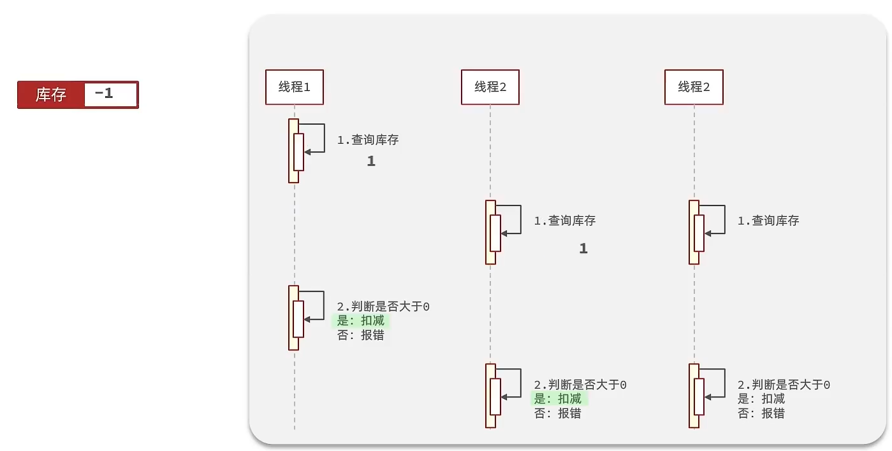

超卖问题是典型的多线程安全问题，针对这一问题的常见解决方案就是加锁：而对于加锁，我们通常有两种解决方案：

**悲观锁：**

认为线程安全问题一定会发生，因此在操作数据之前先获取锁，确保线程串行执行。

悲观锁可以实现对于数据的串行化执行，比如Synchronized、Lock都是悲观锁的代表，同时，悲观锁中又可以再细分为公平锁，非公平锁，可重入锁等等。

**乐观锁：**

认为线程安全问题不一定会发生，因此不加锁，只是在更新数据时去判断有没有其它线程对数据做了修改。

- 如果没有修改则认为是安全的，自己才更新数据。
- 如果已经被其它线程修改说明发生了安全问题，此时可以重试或异常

乐观锁会有一个版本号，每次操作数据会对版本号+1，再提交回数据时，会去校验是否比之前的版本大1 ，如果大1 ，则进行操作成功，这套机制的核心逻辑在于，如果在操作过程中，版本号只比原来大1 ，那么就意味着操作过程中没有人对他进行过修改，他的操作就是安全的，如果不大1，则数据被修改过，当然乐观锁还有一些变种的处理方式比如cas

乐观锁的典型代表就是cas，利用cas进行无锁化机制加锁，var5 是操作前读取的内存值，while中的var1+var2 是预估值，如果预估值 == 内存值，则代表中间没有被人修改过，此时就将新值去替换 内存值

  其中do while 是为了在操作失败时，再次进行自旋操作，即把之前的逻辑再操作一次。

```java
int var5;
do {
    var5 = this.getIntVolatile(var1, var2);
} while(!this.compareAndSwapInt(var1, var2, var5, var5 + var4));
return var5;
```

**课程中的使用方式：**

课程中的使用方式是没有像cas一样带自旋的操作，也没有对version的版本号+1 ，他的操作逻辑是在操作时，对版本号进行+1 操作，然后要求version 如果是1 的情况下，才能操作，那么第一个线程在操作后，数据库中的version变成了2，但是他自己满足version=1 ，所以没有问题，此时线程2执行，线程2 最后也需要加上条件version =1 ，但是现在由于线程1已经操作过了，所以线程2，操作时就不满足version=1 的条件了，所以线程2无法执行成功.

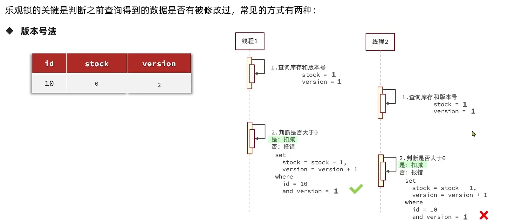

### 3.6 乐观锁解决超卖问题

**修改代码方案一、**

VoucherOrderServiceImpl 在扣减库存时，改为：

```java
boolean success = seckillVoucherService.update()
            .setSql("stock= stock -1") //set stock = stock -1
            .eq("voucher_id", voucherId).eq("stock",voucher.getStock()).update(); //where id = ？ and stock = ?
```

以上逻辑的核心含义是：只要我扣减库存时的库存和之前我查询到的库存是一样的，就意味着没有人在中间修改过库存，那么此时就是安全的，但是以上这种方式通过测试发现会有很多失败的情况，失败的原因在于：在使用乐观锁过程中假设100个线程同时都拿到了100的库存，然后大家一起去进行扣减，但是100个人中只有1个人能扣减成功，其他的人在处理时，他们在扣减时，库存已经被修改过了，所以此时其他线程都会失败。

**修改代码方案二、**

之前的方式要修改前后都保持一致，但是这样我们分析过，成功的概率太低，所以我们的乐观锁需要变一下，改成stock大于0 即可

```java
boolean success = seckillVoucherService.update()
            .setSql("stock= stock -1")
            .eq("voucher_id", voucherId).update().gt("stock",0); //where id = ? and stock > 0
```

**知识小扩展：**

针对cas中的自旋压力过大，我们可以使用Longaddr这个类去解决

Java8 提供的一个对AtomicLong改进后的一个类，LongAdder

大量线程并发更新一个原子性的时候，天然的问题就是自旋，会导致并发性问题，当然这也比我们直接使用syn来的好。

所以利用这么一个类，LongAdder来进行优化。

如果获取某个值，则会对cell和base的值进行递增，最后返回一个完整的值。

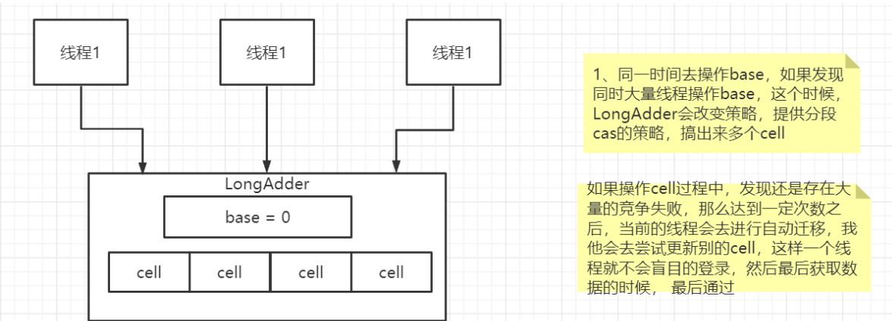

### 3.6 优惠券秒杀-一人一单

需求：修改秒杀业务，要求同一个优惠券，一个用户只能下一单

**现在的问题在于：**

优惠卷是为了引流，但是目前的情况是，一个人可以无限制的抢这个优惠卷，所以我们应当增加一层逻辑，让一个用户只能下一个单，而不是让一个用户下多个单

具体操作逻辑如下：比如时间是否充足，如果时间充足，则进一步判断库存是否足够，然后再根据优惠卷id和用户id查询是否已经下过这个订单，如果下过这个订单，则不再下单，否则进行下单。

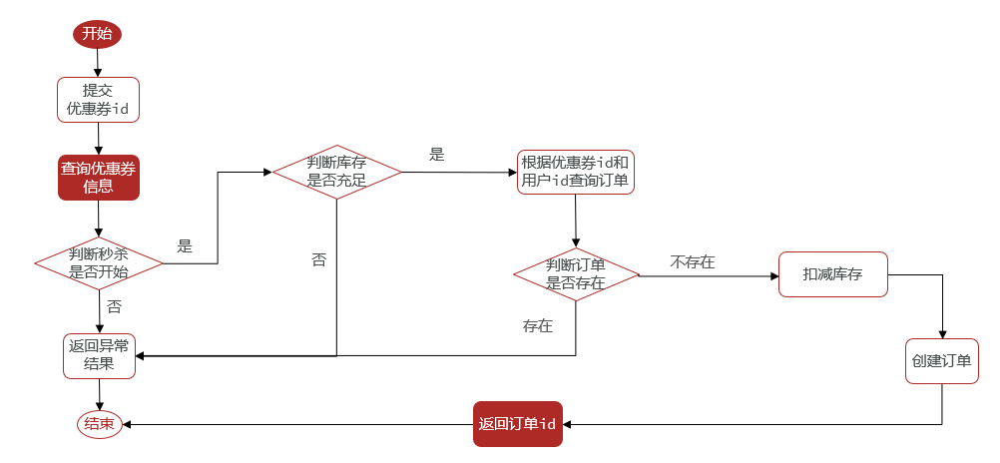

VoucherOrderServiceImpl  

**初步代码：增加一人一单逻辑**

```java
@Override
public Result seckillVoucher(Long voucherId) {
    // 1.查询优惠券
    SeckillVoucher voucher = seckillVoucherService.getById(voucherId);
    // 2.判断秒杀是否开始
    if (voucher.getBeginTime().isAfter(LocalDateTime.now())) {
        // 尚未开始
        return Result.fail("秒杀尚未开始！");
    }
    // 3.判断秒杀是否已经结束
    if (voucher.getEndTime().isBefore(LocalDateTime.now())) {
        // 尚未开始
        return Result.fail("秒杀已经结束！");
    }
    // 4.判断库存是否充足
    if (voucher.getStock() < 1) {
        // 库存不足
        return Result.fail("库存不足！");
    }
    // 5.一人一单逻辑
    // 5.1.用户id
    Long userId = UserHolder.getUser().getId();
    int count = query().eq("user_id", userId).eq("voucher_id", voucherId).count();
    // 5.2.判断是否存在
    if (count > 0) {
        // 用户已经购买过了
        return Result.fail("用户已经购买过一次！");
    }

    //6，扣减库存
    boolean success = seckillVoucherService.update()
            .setSql("stock= stock -1")
            .eq("voucher_id", voucherId).update();
    if (!success) {
        //扣减库存
        return Result.fail("库存不足！");
    }
    //7.创建订单
    VoucherOrder voucherOrder = new VoucherOrder();
    // 7.1.订单id
    long orderId = redisIdWorker.nextId("order");
    voucherOrder.setId(orderId);

    voucherOrder.setUserId(userId);
    // 7.3.代金券id
    voucherOrder.setVoucherId(voucherId);
    save(voucherOrder);

    return Result.ok(orderId);

}
```

**存在问题**：现在的问题还是和之前一样，并发过来，查询数据库，都不存在订单，所以我们还是需要加锁，但是乐观锁比较适合更新数据，而现在是插入数据，所以我们需要使用悲观锁操作。

**注意**：在这里提到了非常多的问题，我们需要慢慢的来思考，首先我们的初始方案是封装了一个createVoucherOrder方法，同时为了确保他线程安全，在方法上添加了一把synchronized 锁。

```java
@Transactional
public synchronized Result createVoucherOrder(Long voucherId) {

	Long userId = UserHolder.getUser().getId();
         // 5.1.查询订单
        int count = query().eq("user_id", userId).eq("voucher_id", voucherId).count();
        // 5.2.判断是否存在
        if (count > 0) {
            // 用户已经购买过了
            return Result.fail("用户已经购买过一次！");
        }

        // 6.扣减库存
        boolean success = seckillVoucherService.update()
                .setSql("stock = stock - 1") // set stock = stock - 1
                .eq("voucher_id", voucherId).gt("stock", 0) // where id = ? and stock > 0
                .update();
        if (!success) {
            // 扣减失败
            return Result.fail("库存不足！");
        }

        // 7.创建订单
        VoucherOrder voucherOrder = new VoucherOrder();
        // 7.1.订单id
        long orderId = redisIdWorker.nextId("order");
        voucherOrder.setId(orderId);
        // 7.2.用户id
        voucherOrder.setUserId(userId);
        // 7.3.代金券id
        voucherOrder.setVoucherId(voucherId);
        save(voucherOrder);

        // 7.返回订单id
        return Result.ok(orderId);
}
```

但是这样添加锁，锁的粒度太粗了，在使用锁过程中，控制**锁粒度** 是一个非常重要的事情，因为如果锁的粒度太大，会导致每个线程进来都会锁住，所以我们需要去控制锁的粒度，对userId进行加锁，但是有问题。

以下这段代码需要修改：如果我们直接使用userId.toString() 他拿到的对象实际上是不同的对象，new出来的对象，我们使用锁必须保证锁必须是同一把，所以我们需要使用intern()方法，intern() 这个方法是从常量池中拿到数据，只要获取的字符串的值是相同的，就能保证是同一把锁。

```java
@Transactional
public  Result createVoucherOrder(Long voucherId) {
	Long userId = UserHolder.getUser().getId();
	synchronized(userId.toString().intern()){
         // 5.1.查询订单
        int count = query().eq("user_id", userId).eq("voucher_id", voucherId).count();
        // 5.2.判断是否存在
        if (count > 0) {
            // 用户已经购买过了
            return Result.fail("用户已经购买过一次！");
        }

        // 6.扣减库存
        boolean success = seckillVoucherService.update()
                .setSql("stock = stock - 1") // set stock = stock - 1
                .eq("voucher_id", voucherId).gt("stock", 0) // where id = ? and stock > 0
                .update();
        if (!success) {
            // 扣减失败
            return Result.fail("库存不足！");
        }

        // 7.创建订单
        VoucherOrder voucherOrder = new VoucherOrder();
        // 7.1.订单id
        long orderId = redisIdWorker.nextId("order");
        voucherOrder.setId(orderId);
        // 7.2.用户id
        voucherOrder.setUserId(userId);
        // 7.3.代金券id
        voucherOrder.setVoucherId(voucherId);
        save(voucherOrder);

        // 7.返回订单id
        return Result.ok(orderId);
    }
}
```

但是以上代码还是存在问题，问题的原因在于当前方法被spring的事务控制，如果你在方法内部加锁，可能会导致当前方法事务还没有提交，但是锁已经释放也会导致问题，所以我们选择将当前方法整体包裹起来，确保事务不会出现问题：如下：

在seckillVoucher 方法中，添加以下逻辑，这样就能保证事务的特性，同时也控制了锁的粒度:

```java
        Long userId = UserHolder.getUser().getId();
        synchronized (userId.toString().intern()) {
            return this.createVoucherOrder(voucherId);
        }
```

但是以上做法依然有问题，因为你调用的方法，其实是this.的方式调用的，事务想要生效，还得利用代理来生效，所以这个地方，我们需要获得原始的事务对象， 来操作事务:

```java
        Long userId = UserHolder.getUser().getId();
        synchronized (userId.toString().intern()) {
            // 获取代理对象（事务）
            IVoucherOrderService proxy = (IVoucherOrderService) AopContext.currentProxy();
            return proxy.createVoucherOrder(voucherId);
        }
```

### 3.7 集群环境下的并发问题

通过加锁可以解决在单机情况下的一人一单安全问题，但是在集群模式下就不行了。

1、我们将服务启动两份，端口分别为8081和8082：

2、然后修改nginx的conf目录下的nginx.conf文件，配置反向代理和负载均衡：

```sh
upstream backend {
	server 127.0.0.1:8081 max_fails=5 fail_timeout=10s weight=1;
	server 127.0.0.1:8082 max_fails=5 fail_timeout=10s weight=1;
}
```

**有关锁失效原因分析**

由于现在我们部署了多个tomcat，每个tomcat都有一个属于自己的jvm，那么假设在服务器A的tomcat内部，有两个线程，这两个线程由于使用的是同一份代码，那么他们的锁对象是同一个，是可以实现互斥的，但是如果现在是服务器B的tomcat内部，又有两个线程，但是他们的锁对象写的虽然和服务器A一样，但是锁对象却不是同一个，所以线程3和线程4可以实现互斥，但是却无法和线程1和线程2实现互斥，这就是 集群环境下，syn锁失效的原因，在这种情况下，我们就需要使用分布式锁来解决这个问题。

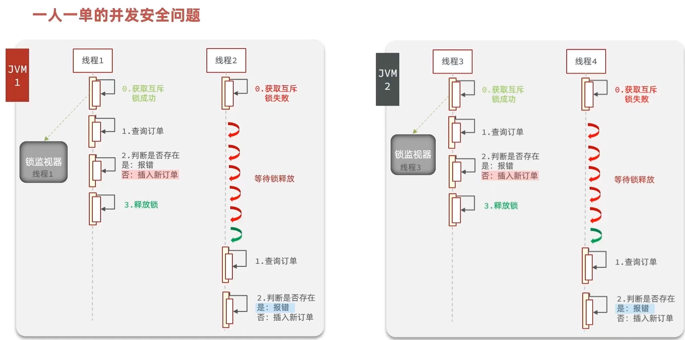

## 4 分布式锁

### 4.1 基本原理和实现方式对比

分布式锁：满足分布式系统或集群模式下多进程可见并且互斥的锁。

分布式锁的核心思想就是让大家都使用同一把锁，只要大家使用的是同一把锁，那么我们就能锁住线程，不让线程进行，让程序串行执行，这就是分布式锁的核心思路

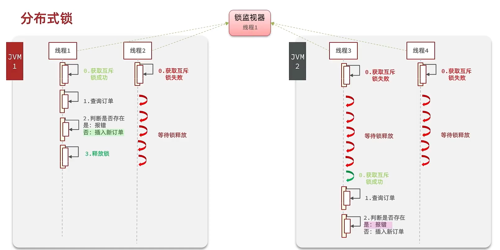

那么分布式锁他应该满足一些什么样的条件呢？

可见性：多个线程都能看到相同的结果，注意：这个地方说的可见性并不是并发编程中指的内存可见性，只是说多个进程之间都能感知到变化的意思

互斥：互斥是分布式锁的最基本的条件，使得程序串行执行

高可用：程序不易崩溃，时时刻刻都保证较高的可用性

高性能：由于加锁本身就让性能降低，所有对于分布式锁本身需要他就较高的加锁性能和释放锁性能

安全性：安全也是程序中必不可少的一环

**常见的分布式锁有三种**：

Mysql：mysql本身就带有锁机制，但是由于mysql性能本身一般，所以采用分布式锁的情况下，其实使用mysql作为分布式锁比较少见

Redis：redis作为分布式锁是非常常见的一种使用方式，现在企业级开发中基本都使用redis或者zookeeper作为分布式锁，利用setnx这个方法，如果插入key成功，则表示获得到了锁，如果有人插入成功，其他人插入失败则表示无法获得到锁，利用这套逻辑来实现分布式锁

Zookeeper：zookeeper也是企业级开发中较好的一个实现分布式锁的方案，由于本套视频并不讲解zookeeper的原理和分布式锁的实现，所以不过多阐述

|            | **MySQL**                 | **Redis**                | **Zookeeper**                    |
| ---------- | ------------------------- | ------------------------ | -------------------------------- |
| **互斥**   | 利用mysql本身的互斥锁机制 | 利用setnx这样的互斥命令  | 利用节点的唯一性和有序性实现互斥 |
| **高可用** | 好                        | 好                       | 好                               |
| **高性能** | 一般                      | 好                       | 一般                             |
| **安全性** | 断开连接，自动释放锁      | 利用锁超时时间，到期释放 | 临时节点，断开连接自动释放       |

### 4.2 Redis分布式锁的实现核心思路

实现分布式锁时需要实现的两个基本方法：

* 获取锁：

  * 互斥：确保只能有一个线程获取锁

  ```sh
  # 添加锁，利用setnx的互斥特性
  127.0.0.0:6379> SETNX lock thread1
  (intrger) 1
  127.0.0.0:6379> SETNX lock thread1
  (intrger) 0
  # 添加锁过期时间，避免服务宕机引起的死锁
  127.0.0.0:6379> EXPIRE lock 5
  (intrger) 1
  # 保证添加锁与过期时间的原子性
  127.0.0.0:6379> SET lock thread1 EX 10 NX
  OK
  # 重复设置无效
  127.0.0.0:6379> SET lock thread1 EX 10 NX
  (nil)
  ```

  * 非阻塞：尝试一次，成功返回true，失败返回false

* 释放锁：

  * 手动释放

  ```sh
  # 释放锁，删除即可
  127.0.0.0:6379> DEL lock
  (intrger) 1
  ```

  * 超时释放：获取锁时添加一个超时时间

**核心思路**：

我们利用redis 的setNx 方法，当有多个线程进入时，我们就利用该方法，第一个线程进入时，redis 中就有这个key 了，返回了1，如果结果是1，则表示他抢到了锁，那么他去执行业务，然后再删除锁，退出锁逻辑，没有抢到锁的哥们，等待一定时间后重试即可。

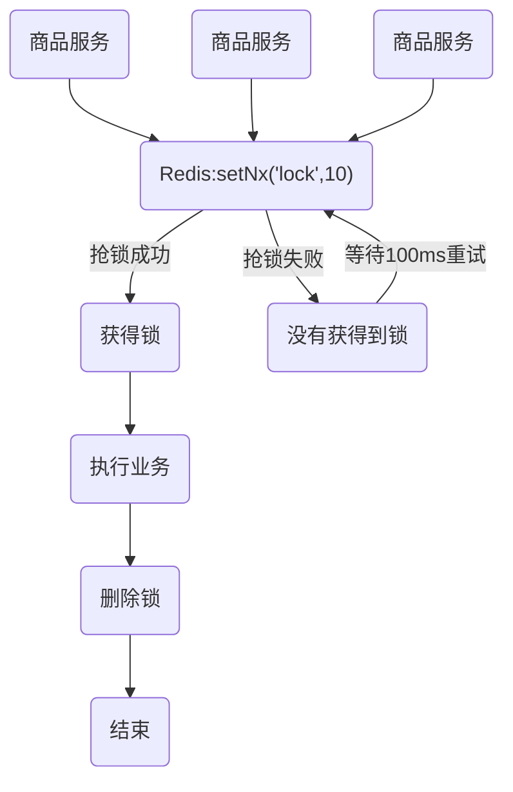

### 4.3 实现分布式锁版本一

* 加锁逻辑

**锁的基本接口**

```java
public interface ILock {

    /**
     * 尝试获取锁
     * @param timeoutSec 锁持有的超时时间，过期后自动释放
     * @return true代表获取锁成功; false代表获取锁失败
     */
    boolean tryLock(long timeoutSec);

    /**
     * 释放锁
     */
    void unlock();
}
```

**SimpleRedisLock**

利用setnx方法进行加锁，同时增加过期时间，防止死锁，此方法可以保证加锁和增加过期时间具有原子性。

```java
public class SimpleRedisLock implements ILock {

    private String name;
    private StringRedisTemplate stringRedisTemplate;

    public SimpleRedisLock(String name, StringRedisTemplate stringRedisTemplate) {
        this.name = name;
        this.stringRedisTemplate = stringRedisTemplate;
    }

    private static final String KEY_PREFIX = "lock:";

    @Override
    public boolean tryLock(long timeoutSec) {
        // 获取线程标示
        String threadId = Thread.currentThread().getId();
        // 获取锁
        Boolean success = stringRedisTemplate.opsForValue()
                .setIfAbsent(KEY_PREFIX + name, threadId + "", timeoutSec, TimeUnit.SECONDS);
        return Boolean.TRUE.equals(success);
    }
}
```

* 释放锁逻辑

SimpleRedisLock

释放锁，防止删除别人的锁

```java
public void unlock() {
    //通过del删除锁
    stringRedisTemplate.delete(KEY_PREFIX + name);
}
```

* 修改业务代码

```java
  @Override
    public Result seckillVoucher(Long voucherId) {
        // 1.查询优惠券
        SeckillVoucher voucher = seckillVoucherService.getById(voucherId);
        // 2.判断秒杀是否开始
        if (voucher.getBeginTime().isAfter(LocalDateTime.now())) {
            // 尚未开始
            return Result.fail("秒杀尚未开始！");
        }
        // 3.判断秒杀是否已经结束
        if (voucher.getEndTime().isBefore(LocalDateTime.now())) {
            // 尚未开始
            return Result.fail("秒杀已经结束！");
        }
        // 4.判断库存是否充足
        if (voucher.getStock() < 1) {
            // 库存不足
            return Result.fail("库存不足！");
        }
        Long userId = UserHolder.getUser().getId();
        //创建锁对象(新增代码)
        SimpleRedisLock lock = new SimpleRedisLock("order:" + userId, stringRedisTemplate);
        //获取锁对象
        boolean isLock = lock.tryLock(1200);
		//加锁失败
        if (!isLock) {
            return Result.fail("不允许重复下单");
        }
        try {
            //获取代理对象(事务)
            IVoucherOrderService proxy = (IVoucherOrderService) AopContext.currentProxy();
            return proxy.createVoucherOrder(voucherId);
        } finally {
            //释放锁
            lock.unlock();
        }
    }
```

### 4.4 Redis分布式锁误删情况说明

逻辑说明：

持有锁的线程1在锁的内部出现了阻塞，导致他的锁超时自动释放，这时其他线程，线程2来尝试获得锁，就拿到了这把锁，然后线程2在持有锁执行过程中，线程1反应过来，继续执行，而线程1执行过程中，走到了删除锁逻辑，此时就会把本应该属于线程2的锁进行删除，这就是误删别人锁的情况说明

解决方案：解决方案就是在每个线程释放锁的时候，去判断一下当前这把锁是否属于自己，如果属于自己，则不进行锁的删除，假设还是上边的情况，线程1卡顿，锁自动释放，线程2进入到锁的内部执行逻辑，此时线程1反应过来，然后删除锁，但是线程1，一看当前这把锁不是属于自己，于是不进行删除锁逻辑，当线程2走到删除锁逻辑时，如果没有卡过自动释放锁的时间点，则判断当前这把锁是属于自己的，于是删除这把锁。

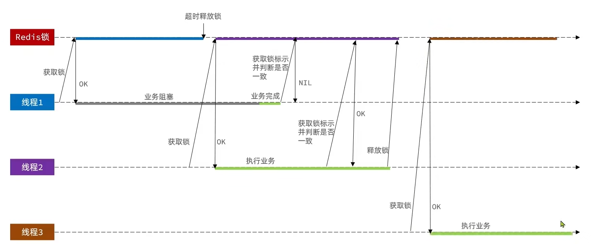

### 4.5 解决Redis分布式锁误删问题

需求：修改之前的分布式锁实现，

满足：在获取锁时存入线程标示（可以用UUID表示），在释放锁时先获取锁中的线程标示，判断是否与当前线程标示一致

* 如果一致则释放锁
* 如果不一致则不释放锁

**核心逻辑**：

在存入锁时，放入自己线程的标识，在删除锁时，判断当前这把锁的标识是不是自己存入的，如果是，则进行删除，如果不是，则不进行删除。

具体代码如下：

**加锁**

```java
private static final String ID_PREFIX = UUID.randomUUID().toString(true) + "-";
@Override
public boolean tryLock(long timeoutSec) {
   // 获取线程标示
   String threadId = ID_PREFIX + Thread.currentThread().getId();
   // 获取锁
   Boolean success = stringRedisTemplate.opsForValue()
                .setIfAbsent(KEY_PREFIX + name, threadId, timeoutSec, TimeUnit.SECONDS);
   return Boolean.TRUE.equals(success);
}
```

**释放锁**

```java
public void unlock() {
    // 获取线程标示
    String threadId = ID_PREFIX + Thread.currentThread().getId();
    // 获取锁中的标示
    String id = stringRedisTemplate.opsForValue().get(KEY_PREFIX + name);
    // 判断标示是否一致
    if(threadId.equals(id)) {
        // 释放锁
        stringRedisTemplate.delete(KEY_PREFIX + name);
    }
}
```

**有关代码实操说明：**

在我们修改完此处代码后，我们重启工程，然后启动两个线程，第一个线程持有锁后，手动释放锁，第二个线程 此时进入到锁内部，再放行第一个线程，此时第一个线程由于锁的value值并非是自己，所以不能释放锁，也就无法删除别人的锁，此时第二个线程能够正确释放锁，通过这个案例初步说明我们解决了锁误删的问题。

### 4.6 分布式锁的原子性问题

更为极端的误删逻辑说明：

线程1现在持有锁之后，在执行业务逻辑过程中，他正准备删除锁，而且已经走到了条件判断的过程中，比如他已经拿到了当前这把锁确实是属于他自己的，正准备删除锁，但是此时他的锁到期了，那么此时线程2进来，但是线程1他会接着往后执行，当他卡顿结束后，他直接就会执行删除锁那行代码，相当于条件判断并没有起到作用，这就是删锁时的原子性问题，之所以有这个问题，是因为线程1的拿锁，比锁，删锁，实际上并不是原子性的，我们要防止刚才的情况发生。

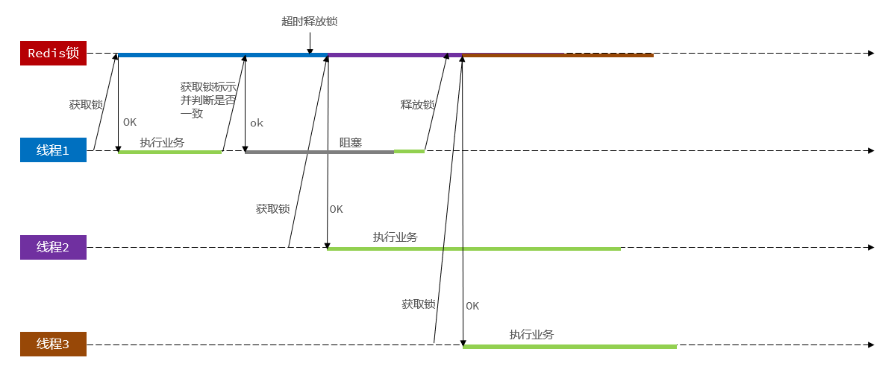

### 4.7 Lua脚本解决多条命令原子性问题

Redis提供了Lua脚本功能，在一个脚本中编写多条Redis命令，确保多条命令执行时的原子性。Lua是一种编程语言，它的基本语法大家可以参考网站：https://www.runoob.com/lua/lua-tutorial.html，这里重点介绍Redis提供的调用函数，我们可以使用lua去操作redis，又能保证他的原子性，这样就可以实现拿锁比锁删锁是一个原子性动作了，作为Java程序员这一块并不作一个简单要求，并不需要大家过于精通，只需要知道他有什么作用即可。

这里重点介绍Redis提供的调用函数，语法如下：

```lua
redis.call('命令名称', 'key', '其它参数', ...)
```

例如，我们要执行set name jack，则脚本是这样：

```lua
# 执行 set name jack
redis.call('set', 'name', 'jack')
```

例如，我们要先执行set name Rose，再执行get name，则脚本如下：

```lua
# 先执行 set name jack
redis.call('set', 'name', 'Rose')
# 再执行 get name
local name = redis.call('get', 'name')
# 返回
return name
```

写好脚本以后，需要用Redis命令来调用脚本，调用脚本的常见命令如下：

```sh
127.0.0.1:6379> help @scripting

  EVAL script numkeys key [key ...] arg [arg ...]
  summary: Execute a Lua script server side
  since: 2.6.0
```

例如，我们要执行 redis.call('set', 'name', 'jack') 这个脚本，语法如下：

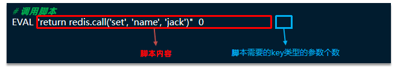

如果脚本中的key、value不想写死，可以作为参数传递。key类型参数会放入KEYS数组，其它参数会放入ARGV数组，在脚本中可以从KEYS和ARGV数组获取这些参数：


接下来我们来回一下我们释放锁的逻辑：

释放锁的业务流程是这样的

​	1、获取锁中的线程标示

​	2、判断是否与指定的标示（当前线程标示）一致

​	3、如果一致则释放锁（删除）

​	4、如果不一致则什么都不做

如果用Lua脚本来表示则是这样的：

最终我们操作redis的拿锁比锁删锁的lua脚本就会变成这样

```lua
-- 这里的 KEYS[1] 就是锁的key，这里的ARGV[1] 就是当前线程标示
-- 获取锁中的标示，判断是否与当前线程标示一致
if (redis.call('GET', KEYS[1]) == ARGV[1]) then
  -- 一致，则删除锁
  return redis.call('DEL', KEYS[1])
end
-- 不一致，则直接返回
return 0
```

### 4.8 利用Java代码调用Lua脚本改造分布式锁

lua脚本本身并不需要大家花费太多时间去研究，只需要知道如何调用，大致是什么意思即可，所以在笔记中并不会详细的去解释这些lua表达式的含义。

我们的RedisTemplate中，可以利用execute方法去执行lua脚本，参数对应关系就如下图:

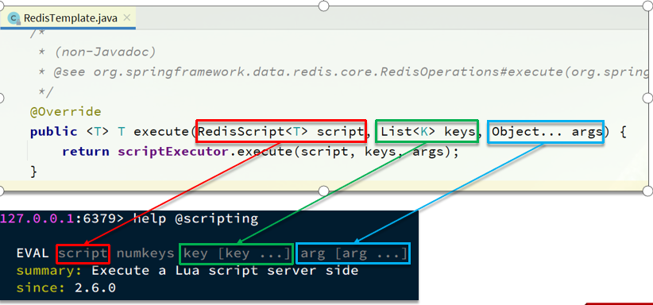

```java
private static final DefaultRedisScript<Long> UNLOCK_SCRIPT;
    static {
        UNLOCK_SCRIPT = new DefaultRedisScript<>();
        UNLOCK_SCRIPT.setLocation(new ClassPathResource("unlock.lua"));
        UNLOCK_SCRIPT.setResultType(Long.class);
    }

public void unlock() {
    // 调用lua脚本
    stringRedisTemplate.execute(
            UNLOCK_SCRIPT,
            Collections.singletonList(KEY_PREFIX + name),
            ID_PREFIX + Thread.currentThread().getId());
}
```

经过以上代码改造后，我们就能够实现 拿锁比锁删锁的原子性动作了。

**小总结：**

基于Redis的分布式锁实现思路：

* 利用set nx ex获取锁，并设置过期时间，保存线程标示
* 释放锁时先判断线程标示是否与自己一致，一致则删除锁
  * 特性：
    * 利用set nx满足互斥性
    * 利用set ex保证故障时锁依然能释放，避免死锁，提高安全性
    * 利用Redis集群保证高可用和高并发特性

笔者总结：我们一路走来，利用添加过期时间，防止死锁问题的发生，但是有了过期时间之后，可能出现误删别人锁的问题，这个问题我们开始是利用删之前 通过拿锁，比锁，删锁这个逻辑来解决的，也就是删之前判断一下当前这把锁是否是属于自己的，但是现在还有原子性问题，也就是我们没法保证拿锁比锁删锁是一个原子性的动作，最后通过lua表达式来解决这个问题

但是目前还剩下一个问题锁不住，什么是锁不住呢，你想一想，如果当过期时间到了之后，我们可以给他续期一下，比如续个30s，就好像是网吧上网， 网费到了之后，然后说，来，网管，再给我来10块的，是不是后边的问题都不会发生了，那么续期问题怎么解决呢，可以依赖于我们接下来要学习redission。

**测试逻辑：**

第一个线程进来，得到了锁，手动删除锁，模拟锁超时了，其他线程会执行lua来抢锁，当第一个线程利用lua删除锁时，lua能保证他不能删别人的锁，第二个线程删除锁时，利用lua同样可以保证不会删除别人的锁，同时还能保证原子性。


