# 数据结构

## 1、动态字符串

我们都知道Redis中保存的Key是字符串，value往往是字符串或者字符串的集合。可见字符串是Redis中最常用的一种数据结构。

不过Redis没有直接使用C语言中的字符串，因为C语言字符串存在很多问题：

```c
// c语言，声明字符串
char* s = "hello"
// 本质是字符数组： {'h', 'e', 'l', 'l', 'o', '\0'}
```

- 获取字符串长度的需要通过运算
- 非二进制安全
- 不可修改

Redis构建了一种新的字符串结构，称为简单动态字符串（Simple Dynamic String），简称SDS。

例如，我们执行命令：

```sh
127.0.0.1:6379> set name 虎哥
OK
```

那么Redis将在底层创建两个SDS，其中一个是包含“name”的SDS，另一个是包含“虎哥”的SDS。

Redis是C语言实现的，其中SDS是一个结构体，源码如下：

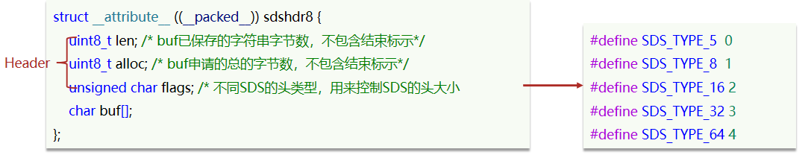

例如，一个包含字符串“name”的sds结构如下：

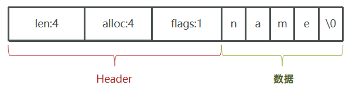

SDS之所以叫做动态字符串，是因为它具备动态扩容的能力，例如一个内容为“hi”的SDS：

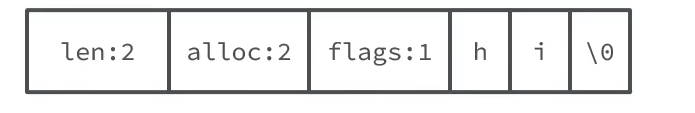

假如我们要给SDS追加一段字符串“,Amy”，这里首先会申请新内存空间：

如果新字符串小于1M，则新空间为扩展后字符串长度的两倍+1；

如果新字符串大于1M，则新空间为扩展后字符串长度+1M+1。称为内存预分配。

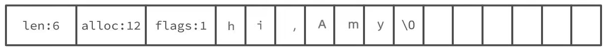

**优点**：

- 获取字符串长度的时间复杂度为O(1)
- 支持动态扩容
- 减少内存分配次数
- 二进制安全

## 2、Intset

IntSet是Redis中set集合的一种实现方式，基于整数数组来实现，并且具备长度可变、有序等特征。

结构如下：

```c
typedef struct intset {
    uint32_t encoding; /* 编码方式，支持存放16位、32位、64位整数*/
    uint32_t length; /* 元素个数 */
    int8_t contents[]; /* 整数数组，保存集合数据*/
} intset;
```

其中的encoding包含三种模式，表示存储的整数大小不同：

```c
/* Note that these encodings are ordered, so:
 * INTSET_ENC_INT16 < INTSET_ENC_INT32 < INTSET_ENC_INT64. */
#define INTSET_ENC_INT16 (sizeof(int16_t)) /* 2字节整数，范围类似java的short*/
#define INTSET_ENC_INT32 (sizeof(int32_t)) /* 4字节整数，范围类似java的int */
#define INTSET_ENC_INT64 (sizeof(int64_t)) /* 8字节整数，范围类似java的long */
```

为了方便查找，Redis会将intset中所有的整数按照升序依次保存在contents数组中，结构如图：

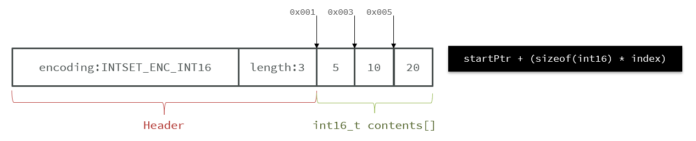

现在，数组中每个数字都在int16_t的范围内，因此采用的编码方式是INTSET_ENC_INT16，每部分占用的字节大小为：

encoding：4字节

length：4字节

contents：2字节 * 3  = 6字节

**IntSet升级**

现在，假设有一个intset，元素为{5,10，20}，采用的编码是INTSET_ENC_INT16，则每个整数占2字节：

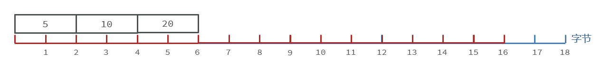

我们向该其中添加一个数字：50000，这个数字超出了int16_t的范围，intset会自动**升级**编码方式到合适的大小。

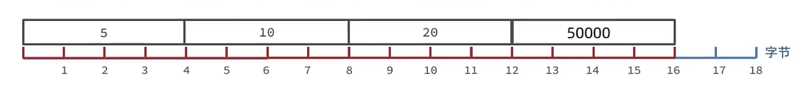

以当前案例来说流程如下：

- 升级编码为INTSET_ENC_INT32, 每个整数占4字节，并按照新的编码方式及元素个数扩容数组
- 倒序依次将数组中的元素拷贝到扩容后的正确位置
- 将待添加的元素放入数组末尾
- 最后，将inset的encoding属性改为INTSET_ENC_INT32，将length属性改为4

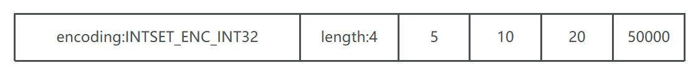

源码如下：

```c
intset *intsetAdd(intset *is, int64_t value, uint8_t *success) {
    uint8_t valenc = _intsetValueEncoding(value);// 获取当前值编码
    uint32_t pos; // 要插入的位置
    if (success) *success = 1;
    // 判断编码是不是超过了当前intset的编码
    if (valenc > intrev32ifbe(is->encoding)) {
        // 超出编码，需要升级
        return intsetUpgradeAndAdd(is,value);
    } else {
        // 在当前intset中查找值与value一样的元素的角标pos
        if (intsetSearch(is,value,&pos)) {
            if (success) *success = 0; //如果找到了，则无需插入，直接结束并返回失败
            return is;
        }
        // 数组扩容
        is = intsetResize(is,intrev32ifbe(is->length)+1);
        // 移动数组中pos之后的元素到pos+1，给新元素腾出空间
        if (pos < intrev32ifbe(is->length)) intsetMoveTail(is,pos,pos+1);
    }
    // 插入新元素
    _intsetSet(is,pos,value);
    // 重置元素长度
    is->length = intrev32ifbe(intrev32ifbe(is->length)+1);
    return is;
}
```

```c
static intset *intsetUpgradeAndAdd(intset *is, int64_t value) {
    // 获取当前intset编码
    uint8_t curenc = intrev32ifbe(is->encoding);
    // 获取新编码
    uint8_t newenc = _intsetValueEncoding(value);
    // 获取元素个数
    int length = intrev32ifbe(is->length); 
    // 判断新元素是大于0还是小于0 ，小于0插入队首、大于0插入队尾
    int prepend = value < 0 ? 1 : 0;
    // 重置编码为新编码
    is->encoding = intrev32ifbe(newenc);
    // 重置数组大小
    is = intsetResize(is,intrev32ifbe(is->length)+1);
    // 倒序遍历，逐个搬运元素到新的位置，_intsetGetEncoded按照旧编码方式查找旧元素
    while(length--) // _intsetSet按照新编码方式插入新元素
        _intsetSet(is,length+prepend,_intsetGetEncoded(is,length,curenc));
    /* 插入新元素，prepend决定是队首还是队尾*/
    if (prepend)
        _intsetSet(is,0,value);
    else
        _intsetSet(is,intrev32ifbe(is->length),value);
    // 修改数组长度
    is->length = intrev32ifbe(intrev32ifbe(is->length)+1);
    return is;
}
```

**小总结**：

Intset可以看做是特殊的整数数组，具备一些特点：

* Redis会确保Intset中的元素唯一、有序
* 具备类型升级机制，可以节省内存空间
* 底层采用二分查找方式来查询

## 3、Dict

我们知道Redis是一个键值型（Key-Value Pair）的数据库，我们可以根据键实现快速的增删改查。而键与值的映射关系正是通过Dict来实现的。

Dict由三部分组成，分别是：哈希表（DictHashTable）、哈希节点（DictEntry）、字典（Dict）

```c
typedef struct dictht {
    // entry数组
    // 数组中保存的是指向entry的指针
    dictEntry **table; 
    // 哈希表大小
    unsigned long size;     
    // 哈希表大小的掩码，总等于size - 1
    unsigned long sizemask;     
    // entry个数
    unsigned long used; 
} dictht;
```

```c
typedef struct dictEntry {
    void *key; // 键
    union {
        void *val;
        uint64_t u64;
        int64_t s64;
        double d;
    } v; // 值
    // 下一个Entry的指针
    struct dictEntry *next; 
} dictEntry;
```

当我们向Dict添加键值对时，Redis首先根据key计算出hash值（h），然后利用 h & sizemask来计算元素应该存储到数组中的哪个索引位置。我们存储k1=v1，假设k1的哈希值h =1，则1&3 =1，因此k1=v1要存储到数组角标1位置。

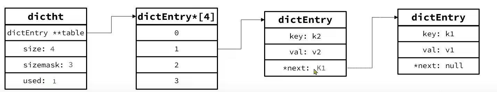

Dict由三部分组成，分别是：哈希表（DictHashTable）、哈希节点（DictEntry）、字典（Dict）

```c
typedef struct dict {
    dictType *type; // dict类型，内置不同的hash函数
    void *privdata;     // 私有数据，在做特殊hash运算时用
    dictht ht[2]; // 一个Dict包含两个哈希表，其中一个是当前数据，另一个一般是空，rehash时使用
    long rehashidx;   // rehash的进度，-1表示未进行
    int16_t pauserehash; // rehash是否暂停，1则暂停，0则继续
} dict;
```

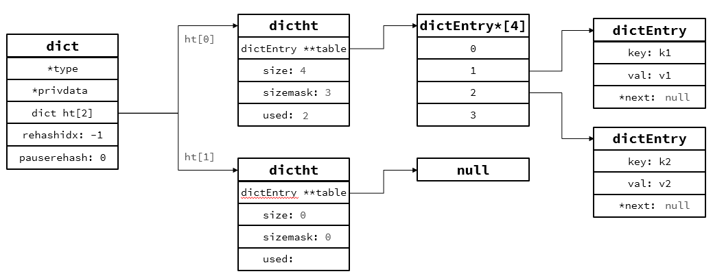

Dict中的HashTable就是数组结合单向链表的实现，当集合中元素较多时，必然导致哈希冲突增多，链表过长，则查询效率会大大降低。

Dict在每次新增键值对时都会检查负载因子（LoadFactor = used/size） ，满足以下两种情况时会触发哈希表扩容：

哈希表的 LoadFactor >= 1，并且服务器没有执行 BGSAVE 或者 BGREWRITEAOF 等后台进程；

哈希表的 LoadFactor > 5 ；

```c
static int _dictExpandIfNeeded(dict *d){
    // 如果正在rehash，则返回ok
    if (dictIsRehashing(d)) return DICT_OK;    // 如果哈希表为空，则初始化哈希表为默认大小：4
    if (d->ht[0].size == 0) return dictExpand(d, DICT_HT_INITIAL_SIZE);
    // 当负载因子（used/size）达到1以上，并且当前没有进行bgrewrite等子进程操作
    // 或者负载因子超过5，则进行 dictExpand ，也就是扩容
    if (d->ht[0].used >= d->ht[0].size &&
        (dict_can_resize || d->ht[0].used/d->ht[0].size > dict_force_resize_ratio){
        // 扩容大小为used + 1，底层会对扩容大小做判断，实际上找的是第一个大于等于 used+1 的 2^n
        return dictExpand(d, d->ht[0].used + 1);
    }
    return DICT_OK;
}
```

Dict除了扩容以外，每次删除元素时，也会对负载因子做检查，当LoadFactor < 0.1 时，会做哈希表收缩：

```c
// t_hash.c # hashTypeDeleted() 
...
if (dictDelete((dict*)o->ptr, field) == C_OK) {
    deleted = 1;
    // 删除成功后，检查是否需要重置Dict大小，如果需要则调用dictResize重置    /* Always check if the dictionary needs a resize after a delete. */
    if (htNeedsResize(o->ptr)) dictResize(o->ptr);
}
...
```

```c
// server.c 文件
int htNeedsResize(dict *dict) {
    long long size, used;
    // 哈希表大小
    size = dictSlots(dict);
    // entry数量
    used = dictSize(dict);
    // size > 4（哈希表初识大小）并且 负载因子低于0.1
    return (size > DICT_HT_INITIAL_SIZE && (used*100/size < HASHTABLE_MIN_FILL));
}
```

```c
int dictResize(dict *d){
    unsigned long minimal;
    // 如果正在做bgsave或bgrewriteof或rehash，则返回错误
    if (!dict_can_resize || dictIsRehashing(d)) 
        return DICT_ERR;
    // 获取used，也就是entry个数
    minimal = d->ht[0].used;
    // 如果used小于4，则重置为4
    if (minimal < DICT_HT_INITIAL_SIZE)
        minimal = DICT_HT_INITIAL_SIZE;
    // 重置大小为minimal，其实是第一个大于等于minimal的2^n
    return dictExpand(d, minimal);
}
```

**Dict的rehash**

不管是扩容还是收缩，必定会创建新的哈希表，导致哈希表的size和sizemask变化，而key的查询与sizemask有关。因此必须对哈希表中的每一个key重新计算索引，插入新的哈希表，这个过程称为rehash。过程是这样的：

1. 计算新hash表的realeSize，值取决于当前要做的是扩容还是收缩：
   * 如果是扩容，则新size为第一个大于等于dict.ht[0].used + 1的2^n
   * 如果是收缩，则新size为第一个大于等于dict.ht[0].used的2^n （不得小于4）

2. 按照新的realeSize申请内存空间，创建dictht，并赋值给dict.ht[1]
3. 设置dict.rehashidx = 0，标示开始rehash
4. 将dict.ht[0]中的每一个dictEntry都rehash到dict.ht[1]
5. 将dict.ht[1]赋值给dict.ht[0]，给dict.ht[1]初始化为空哈希表，释放原来的dict.ht[0]的内存
6. 将rehashidx赋值为-1，代表rehash结束
7. 在rehash过程中，新增操作，则直接写入ht[1]，查询、修改和删除则会在dict.ht[0]和dict.ht[1]依次查找并执行。这样可以确保ht[0]的数据只减不增，随着rehash最终为空

整个过程可以描述成：

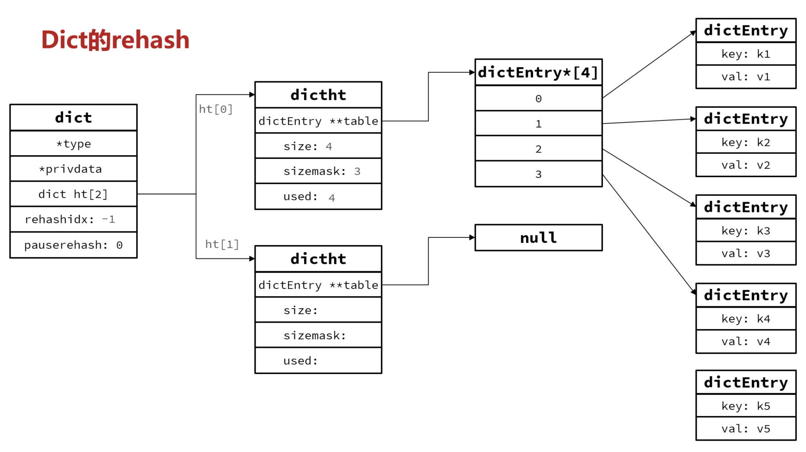

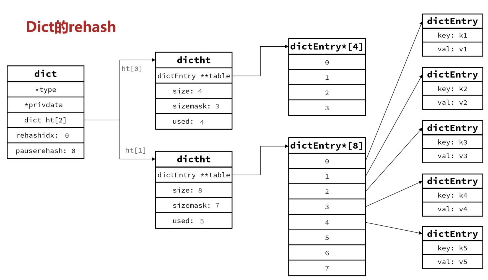


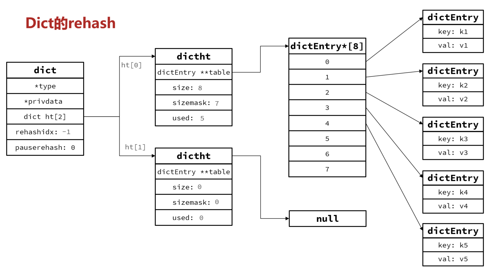

Dict的rehash并不是一次性完成的。试想一下，如果Dict中包含数百万的entry，要在一次rehash完成，极有可能导致主线程阻塞。因此Dict的rehash是分多次、渐进式的完成，因此称为**渐进式**rehash。流程如下：

1. 计算新hash表的size，值取决于当前要做的是扩容还是收缩：
   - 如果是扩容，则新size为第一个大于等于dict.ht[0].used + 1的2^n
   - 如果是收缩，则新size为第一个大于等于dict.ht[0].used的2^n （不得小于4）
2. 按照新的size申请内存空间，创建dictht，并赋值给dict.ht[1]
3. 设置dict.rehashidx = 0，标示开始rehash
4. **每次执行新增、查询、修改、删除操作时，都检查一下dict.rehashidx是否大于-1，如果是则将dict.ht[0].table[rehashidx]的entry链表rehash到dict.ht[1]，并且将rehashidx++。直至dict.ht[0]的所有数据都rehash到dict.ht[1]**
5. 将dict.ht[1]赋值给dict.ht[0]，给dict.ht[1]初始化为空哈希表，释放原来的dict.ht[0]的内存
6. **将rehashidx赋值为-1，代表rehash结束**
7. **在rehash过程中，新增操作，则直接写入ht[1]，查询、修改和删除则会在dict.ht[0]和dict.ht[1]依次查找并执行。这样可以确保ht[0]的数据只减不增，随着rehash最终为空**

**小总结**：

Dict的结构：

* 类似java的HashTable，底层是数组加链表来解决哈希冲突
* Dict包含两个哈希表，ht[0]平常用，ht[1]用来rehash

Dict的伸缩：

* 当LoadFactor大于5或者LoadFactor大于1并且没有子进程任务时，Dict扩容
* 当LoadFactor小于0.1时，Dict收缩
* 扩容大小为第一个大于等于used + 1的2^n
* 收缩大小为第一个大于等于used 的2^n
* Dict采用渐进式rehash，每次访问Dict时执行一次rehash
* rehash时ht[0]只减不增，新增操作只在ht[1]执行，其它操作在两个哈希表

## 4、ZipList

ZipList 是一种特殊的“双端链表” ，由一系列特殊编码的连续内存块组成。可以在任意一端进行压入/弹出操作, 并且该操作的时间复杂度为 O(1)。

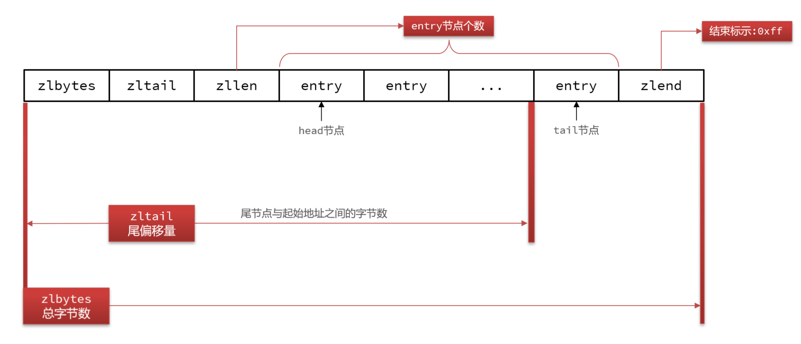

| **属性** | **类型** | **长度** | **用途**                                                     |
| -------- | -------- | -------- | ------------------------------------------------------------ |
| zlbytes  | uint32_t | 4 字节   | 记录整个压缩列表占用的内存字节数                             |
| zltail   | uint32_t | 4 字节   | 记录压缩列表表尾节点距离压缩列表的起始地址有多少字节，通过这个偏移量，可以确定表尾节点的地址。 |
| zllen    | uint16_t | 2 字节   | 记录了压缩列表包含的节点数量。 最大值为UINT16_MAX （65534），如果超过这个值，此处会记录为65535，但节点的真实数量需要遍历整个压缩列表才能计算得出。 |
| entry    | 列表节点 | 不定     | 压缩列表包含的各个节点，节点的长度由节点保存的内容决定。     |
| zlend    | uint8_t  | 1 字节   | 特殊值 0xFF （十进制 255 ），用于标记压缩列表的末端。        |

ZipList 中的Entry并不像普通链表那样记录前后节点的指针，因为记录两个指针要占用16个字节，浪费内存。而是采用了下面的结构：

| previous_entry_length | encoding | content |
| --------------------- | -------- | ------- |

* previous_entry_length：前一节点的长度，占1个或5个字节。
  * 如果前一节点的长度小于254字节，则采用1个字节来保存这个长度值
  * 如果前一节点的长度大于254字节，则采用5个字节来保存这个长度值，第一个字节为0xfe，后四个字节才是真实长度数据

* encoding：编码属性，记录content的数据类型（字符串还是整数）以及长度，占用1个、2个或5个字节
* contents：负责保存节点的数据，可以是字符串或整数

ZipList中所有存储长度的数值均采用小端字节序，即低位字节在前，高位字节在后。例如：数值0x1234，采用小端字节序后实际存储值为：0x3412

**Encoding编码**

ZipListEntry中的encoding编码分为字符串和整数两种：

- 字符串：如果encoding是以“00”、“01”或者“10”开头，则证明content是字符串

| **编码**                                             | **编码长度** | **字符串大小**      |
| ---------------------------------------------------- | ------------ | ------------------- |
| \|00pppppp\|                                         | 1 bytes      | <= 63 bytes         |
| \|01pppppp\|qqqqqqqq\|                               | 2 bytes      | <= 16383 bytes      |
| \|10000000\|qqqqqqqq\|rrrrrrrr\|ssssssss\|tttttttt\| | 5 bytes      | <= 4294967295 bytes |

例如，我们要保存字符串：“ab”和 “bc”

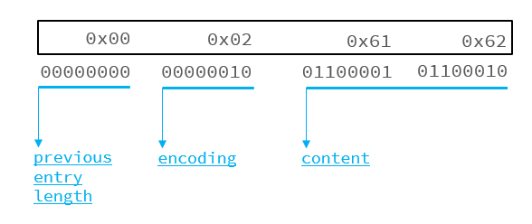

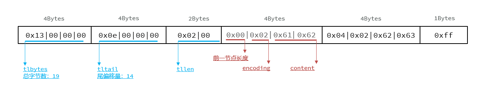

* 整数：如果encoding是以“11”开始，则证明content是整数，且encoding固定只占用1个字节

| **编码** | **编码长度** | **整数类型**                                               |
| -------- | ------------ | ---------------------------------------------------------- |
| 11000000 | 1            | int16_t（2 bytes）                                         |
| 11010000 | 1            | int32_t（4 bytes）                                         |
| 11100000 | 1            | int64_t（8 bytes）                                         |
| 11110000 | 1            | 24位有符整数(3 bytes)                                      |
| 11111110 | 1            | 8位有符整数(1 bytes)                                       |
| 1111xxxx | 1            | 直接在xxxx位置保存数值，范围从0001~1101，减1后结果为实际值 |

例如，一个ZipList中包含两个整数值：“2”和“5”

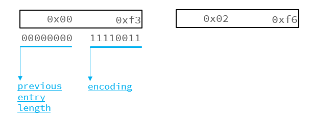

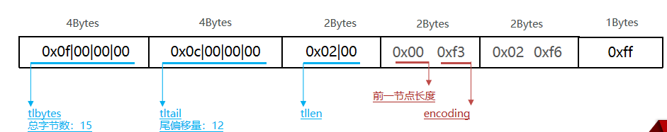

## 5、ZipList的连锁更新问题

ZipList的每个Entry都包含previous_entry_length来记录上一个节点的大小，长度是1个或5个字节：

- 如果前一节点的长度小于254字节，则采用1个字节来保存这个长度值
- 如果前一节点的长度大于等于254字节，则采用5个字节来保存这个长度值，第一个字节为0xfe，后四个字节才是真实长度数据

现在，假设我们有N个连续的、长度为250~253字节之间的entry，因此entry的previous_entry_length属性用1个字节即可表示，如图所示：

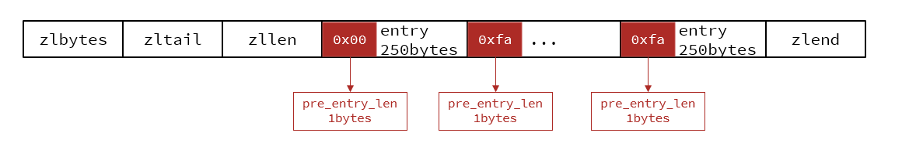

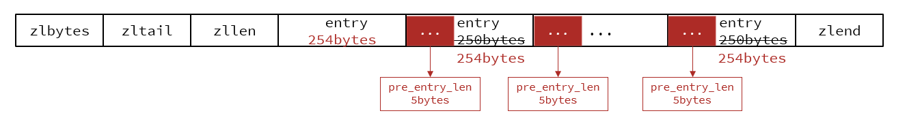

ipList这种特殊情况下产生的连续多次空间扩展操作称之为连锁更新（Cascade Update）。新增、删除都可能导致连锁更新的发生。

**小总结：**

**ZipList特性：**

* 压缩列表的可以看做一种连续内存空间的"双向链表"
* 列表的节点之间不是通过指针连接，而是记录上一节点和本节点长度来寻址，内存占用较低
* 如果列表数据过多，导致链表过长，可能影响查询性能
* 增或删较大数据时有可能发生连续更新问题

## 6、QuickList

问题1：ZipList虽然节省内存，但申请内存必须是连续空间，如果内存占用较多，申请内存效率很低。怎么办？

​	答：为了缓解这个问题，我们必须限制ZipList的长度和entry大小。

问题2：但是我们要存储大量数据，超出了ZipList最佳的上限该怎么办？

​	答：我们可以创建多个ZipList来分片存储数据。

问题3：数据拆分后比较分散，不方便管理和查找，这多个ZipList如何建立联系？

​	答：Redis在3.2版本引入了新的数据结构QuickList，它是一个双端链表，只不过链表中的每个节点都是一个ZipList。

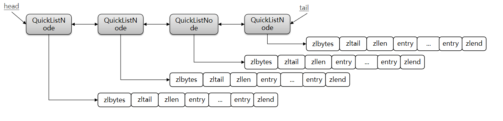


为了避免QuickList中的每个ZipList中entry过多，Redis提供了一个配置项：list-max-ziplist-size来限制。

- 如果值为正，则代表ZipList的允许的entry个数的最大值

- 如果值为负，则代表ZipList的最大内存大小，分5种情况：

  - -1：每个ZipList的内存占用不能超过4kb

  - -2：每个ZipList的内存占用不能超过8kb

  - -3：每个ZipList的内存占用不能超过16kb

  - -4：每个ZipList的内存占用不能超过32kb

  - -5：每个ZipList的内存占用不能超过64kb

默认值为 -2：

```sh
127.0.0.1:6379> config get list-max-ziplist-size
1) "list-max-ziplist-size"
2) "-2"
```

除了控制ZipList的大小，QuickList还可以对节点的ZipList做压缩。通过配置项list-compress-depth来控制。因为链表一般都是从首尾访问较多，所以首尾是不压缩的。这个参数是控制首尾不压缩的节点个数：

- 0：特殊值，代表不压缩
- 1：标示QuickList的首尾各有1个节点不压缩，中间节点压缩
- 2：标示QuickList的首尾各有2个节点不压缩，中间节点压缩

- 以此类推

默认值为0：

```sh
127.0.0.1:6379> config get list-compress-depth
1) "list-compress-depth"
2) "0"
```

以下是QuickList的和QuickListNode的结构源码：

```c
typedef struct quicklist {
    // 头节点指针
    quicklistNode *head; 
    // 尾节点指针
    quicklistNode *tail; 
    // 所有ziplist的entry的数量
    unsigned long count;    
    // ziplists总数量
    unsigned long len;
    // ziplist的entry上限，默认值 -2 
    int fill : QL_FILL_BITS;         // 首尾不压缩的节点数量
    unsigned int compress : QL_COMP_BITS;
    // 内存重分配时的书签数量及数组，一般用不到
    unsigned int bookmark_count: QL_BM_BITS;
    quicklistBookmark bookmarks[];
} quicklist;
```

```c
typedef struct quicklistNode {
    // 前一个节点指针
    struct quicklistNode *prev;
    // 下一个节点指针
    struct quicklistNode *next;
    // 当前节点的ZipList指针
    unsigned char *zl;
    // 当前节点的ZipList的字节大小
    unsigned int sz;
    // 当前节点的ZipList的entry个数
    unsigned int count : 16;  
    // 编码方式：1，ZipList; 2，lzf压缩模式
    unsigned int encoding : 2;
    // 数据容器类型（预留）：1，其它；2，ZipList
    unsigned int container : 2;
    // 是否被解压缩。1：则说明被解压了，将来要重新压缩
    unsigned int recompress : 1;
    unsigned int attempted_compress : 1; //测试用
    unsigned int extra : 10; /*预留字段*/
} quicklistNode;
```

我们接下来用一段流程图来描述当前的这个结构:

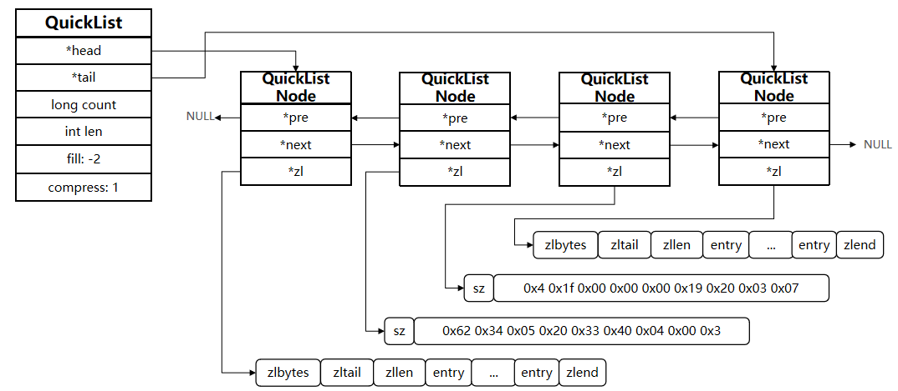

**QuickList的特点**：

* 是一个节点为ZipList的双端链表
* 节点采用ZipList，解决了传统链表的内存占用问题
* 控制了ZipList大小，解决连续内存空间申请效率问题
* 中间节点可以压缩，进一步节省了内存

## 7、SkipList

SkipList（跳表）首先是链表，但与传统链表相比有几点差异：

- 元素按照升序排列存储
- 节点可能包含多个指针，指针跨度不同

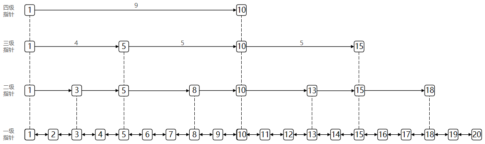

```c
// t_zset.c
typedef struct zskiplist {
    // 头尾节点指针
    struct zskiplistNode *header, *tail;
    // 节点数量
    unsigned long length;
    // 最大的索引层级，默认是1
    int level;
} zskiplist;
```

```c
// t_zset.c
typedef struct zskiplistNode {
    sds ele; // 节点存储的值
    double score;// 节点分数，排序、查找用
    struct zskiplistNode *backward; // 前一个节点指针
    struct zskiplistLevel {
        struct zskiplistNode *forward; // 下一个节点指针
        unsigned long span; // 索引跨度
    } level[]; // 多级索引数组
} zskiplistNode;
```

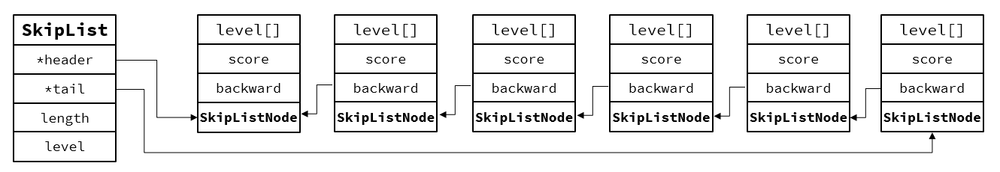

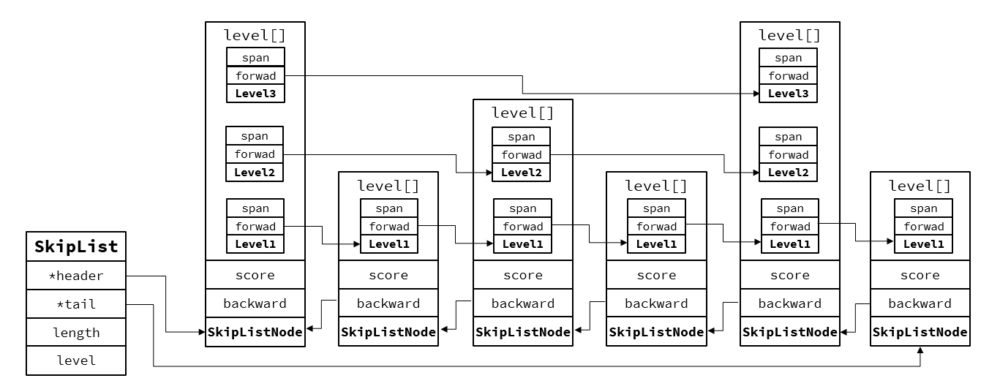

SkipList的特点：

* 跳跃表是一个双向链表，每个节点都包含score和ele值
* 节点按照score值排序，score值一样则按照ele字典排序
* 每个节点都可以包含多层指针，层数是1到32之间的随机数
* 不同层指针到下一个节点的跨度不同，层级越高，跨度越大
* 增删改查效率与红黑树基本一致，实现却更简单

## 8、RedisObject

Redis中的任意数据类型的键和值都会被封装为一个RedisObject，也叫做Redis对象，源码如下：

什么是redisObject：

从Redis的使用者的角度来看，⼀个Redis节点包含多个database（非cluster模式下默认是16个，cluster模式下只能是1个），而一个database维护了从key space到object space的映射关系。这个映射关系的key是string类型，⽽value可以是多种数据类型，比如：string, list, hash、set、sorted set等。我们可以看到，key的类型固定是string，而value可能的类型是多个。

⽽从Redis内部实现的⾓度来看，database内的这个映射关系是用⼀个dict来维护的。dict的key固定用⼀种数据结构来表达就够了，这就是动态字符串sds。而value则比较复杂，为了在同⼀个dict内能够存储不同类型的value，这就需要⼀个通⽤的数据结构，这个通用的数据结构就是robj，全名是redisObject。

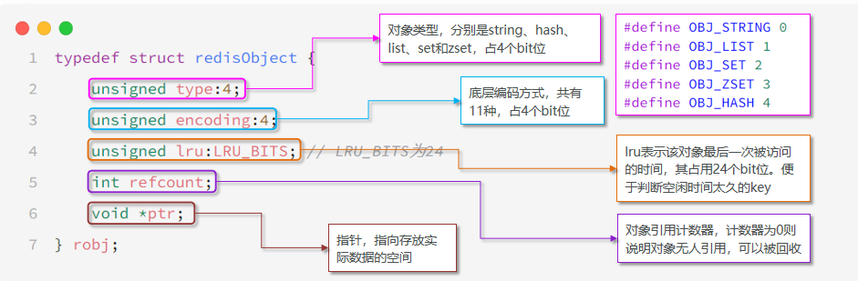

Redis的编码方式

Redis中会根据存储的数据类型不同，选择不同的编码方式，共包含11种不同类型：

| **编号** | **编码方式**            | **说明**               |
| -------- | ----------------------- | ---------------------- |
| 0        | OBJ_ENCODING_RAW        | raw编码动态字符串      |
| 1        | OBJ_ENCODING_INT        | long类型的整数的字符串 |
| 2        | OBJ_ENCODING_HT         | hash表（字典dict）     |
| 3        | OBJ_ENCODING_ZIPMAP     | 已废弃                 |
| 4        | OBJ_ENCODING_LINKEDLIST | 双端链表               |
| 5        | OBJ_ENCODING_ZIPLIST    | 压缩列表               |
| 6        | OBJ_ENCODING_INTSET     | 整数集合               |
| 7        | OBJ_ENCODING_SKIPLIST   | 跳表                   |
| 8        | OBJ_ENCODING_EMBSTR     | embstr的动态字符串     |
| 9        | OBJ_ENCODING_QUICKLIST  | 快速列表               |
| 10       | OBJ_ENCODING_STREAM     | Stream流               |

五种数据结构

Redis中会根据存储的数据类型不同，选择不同的编码方式。每种数据类型的使用的编码方式如下：

| **数据类型** | **编码方式**                                       |
| ------------ | -------------------------------------------------- |
| OBJ_STRING   | int、embstr、raw                                   |
| OBJ_LIST     | LinkedList和ZipList(3.2以前)、QuickList（3.2以后） |
| OBJ_SET      | intset、HT                                         |
| OBJ_ZSET     | ZipList、HT、SkipList                              |
| OBJ_HASH     | ZipList、HT                                        |

## 9、String

String是Redis中最常见的数据存储类型：

- 其基本编码方式是**RAW**，基于简单动态字符串（SDS）实现，存储上限为512mb。

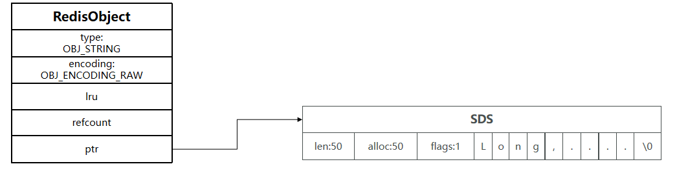

- 如果存储的SDS长度小于44字节，则会采用**EMBSTR**编码，此时object head与SDS是一段连续空间。申请内存时只需要调用一次内存分配函数，效率更高。


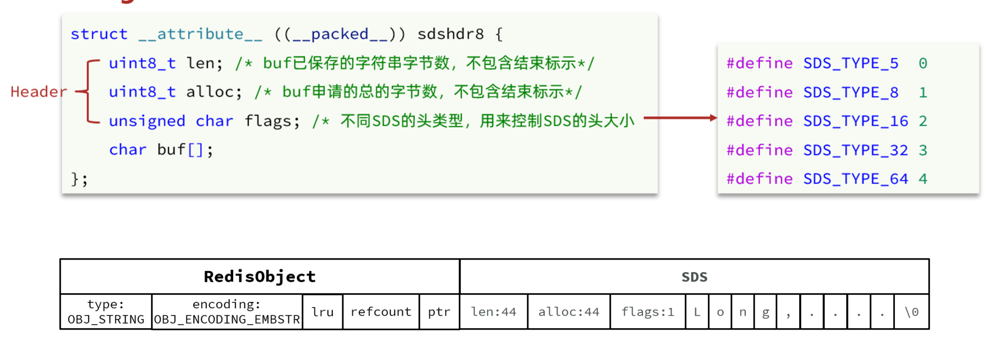

- 如果存储的字符串是整数值，并且大小在LONG_MAX范围内，则会采用INT编码：直接将数据保存在RedisObject的ptr指针位置（刚好8字节），不再需要SDS了。

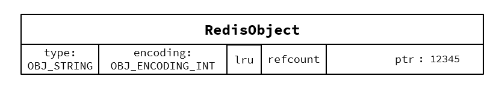

**总结**：

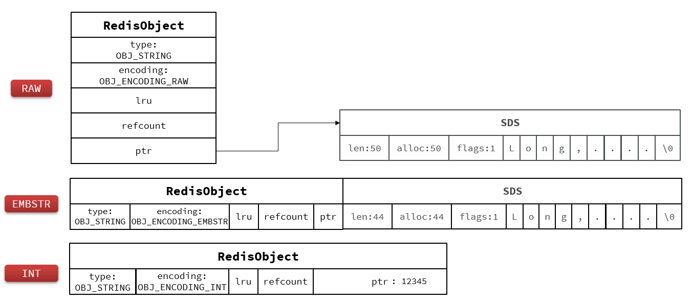

确切地说，String在Redis中是⽤⼀个robj来表示的。

用来表示String的robj可能编码成3种内部表⽰：OBJ_ENCODING_RAW，OBJ_ENCODING_EMBSTR，OBJ_ENCODING_INT。

其中前两种编码使⽤的是sds来存储，最后⼀种OBJ_ENCODING_INT编码直接把string存成了long型。

在对string进行incr, decr等操作的时候，如果它内部是OBJ_ENCODING_INT编码，那么可以直接行加减操作；如果它内部是OBJ_ENCODING_RAW或OBJ_ENCODING_EMBSTR编码，那么Redis会先试图把sds存储的字符串转成long型，如果能转成功，再进行加减操作。

对⼀个内部表示成long型的string执行append, setbit, getrange这些命令，针对的仍然是string的值（即⼗进制表示的字符串），而不是针对内部表⽰的long型进⾏操作。比如字符串”32”，如果按照字符数组来解释，它包含两个字符，它们的ASCII码分别是0x33和0x32。当我们执行命令setbit key 7 0的时候，相当于把字符0x33变成了0x32，这样字符串的值就变成了”22”。⽽如果将字符串”32”按照内部的64位long型来解释，那么它是0x0000000000000020，在这个基础上执⾏setbit位操作，结果就完全不对了。因此，在这些命令的实现中，会把long型先转成字符串再进行相应的操作。

## 10、List

Redis的List类型可以从首、尾操作列表中的元素：

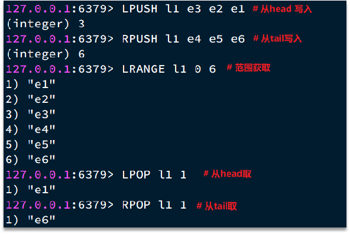

哪一个数据结构能满足上述特征？

* LinkedList ：普通链表，可以从双端访问，内存占用较高，内存碎片较多
* ZipList ：压缩列表，可以从双端访问，内存占用低，存储上限低
* QuickList：LinkedList + ZipList，可以从双端访问，内存占用较低，包含多个ZipList，存储上限高

Redis的List结构类似一个双端链表，可以从首、尾操作列表中的元素：

- 在3.2版本之前，Redis采用ZipList和LinkedList来实现List，当元素数量小于512并且元素大小小于64字节时采用ZipList编码，超过则采用LinkedList编码。

- 在3.2版本之后，Redis统一采用QuickList来实现List：

```c
void pushGenericCommand(client *c, int where, int xx) {
    int j;
    // 尝试找到KEY对应的list
    robj *lobj = lookupKeyWrite(c->db, c->argv[1]);
    // 检查类型是否正确
    if (checkType(c,lobj,OBJ_LIST)) return;
    // 检查是否为空
    if (!lobj) {
        if (xx) {
            addReply(c, shared.czero);
            return;
        }
        // 为空，则创建新的QuickList
        lobj = createQuicklistObject();
        quicklistSetOptions(lobj->ptr, server.list_max_ziplist_size,
                            server.list_compress_depth);
        dbAdd(c->db,c->argv[1],lobj);
    }
    // 略 ...
}
```

```c
robj *createQuicklistObject(void) {
    // 申请内存并初始化QuickList
    quicklist *l = quicklistCreate();
    // 创建RedisObject，type为OBJ_LIST
    // ptr指向 QuickList
    robj *o = createObject(OBJ_LIST,l);
    // 设置编码为 QuickList
    o->encoding = OBJ_ENCODING_QUICKLIST;
    return o;
}
```

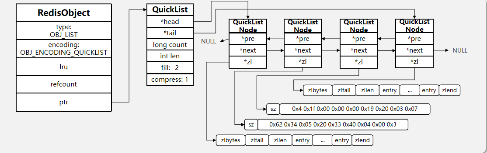

## 11、Set

Set是Redis中的单列集合，满足下列特点：

* 不保证有序性
* 保证元素唯一
* 求交集、并集、差集

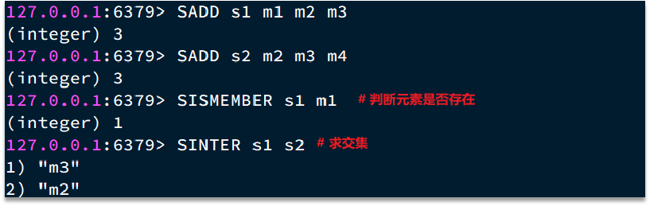

可以看出，Set对查询元素的效率要求非常高，思考一下，什么样的数据结构可以满足？

- HashTable，也就是Redis中的Dict，不过Dict是双列集合（可以存键、值对）

Set是Redis中的集合，不一定确保元素有序，可以满足元素唯一、查询效率要求极高。

- 为了查询效率和唯一性，set采用HT编码（Dict）。Dict中的key用来存储元素，value统一为null。
- 当存储的所有数据都是整数，并且元素数量不超过set-max-intset-entries时，Set会采用IntSet编码，以节省内存（set-max-intset-entries的默认值是512）

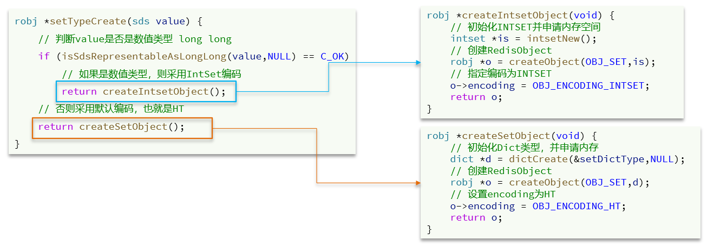

如果插入的数据不是long类型了，会对数据进行转码：

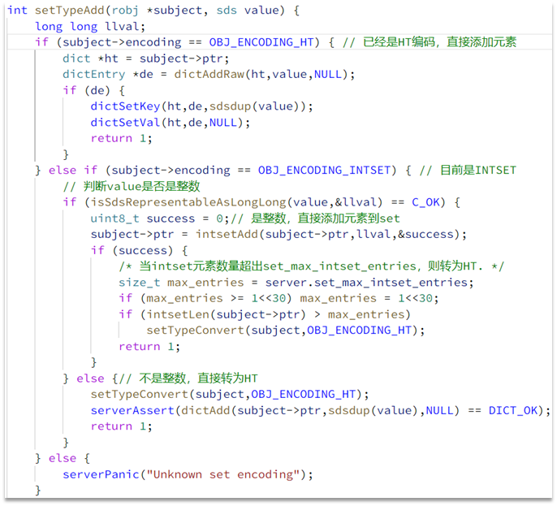

结构如下：

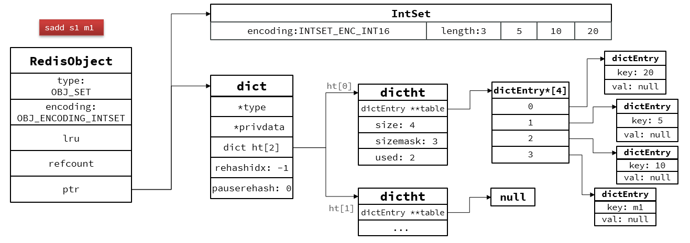

## 12、Zset

ZSet也就是SortedSet，其中每一个元素都需要指定一个score值和member值：

* 可以根据score值排序后
* member必须唯一
* 可以根据member查询分数

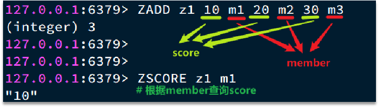

因此，zset底层数据结构必须满足**键值存储、键必须唯一、可排序**这几个需求。之前学习的哪种编码结构可以满足？

* SkipList：可以排序，并且可以同时存储score和ele值（member）
* HT（Dict）：可以键值存储，并且可以根据key找value

```c
// zset结构
typedef struct zset {
    // Dict指针
    dict *dict;
    // SkipList指针
    zskiplist *zsl;
} zset;
```

```c
robj *createZsetObject(void) {
    zset *zs = zmalloc(sizeof(*zs));
    robj *o;
    // 创建Dict
    zs->dict = dictCreate(&zsetDictType,NULL);
    // 创建SkipList
    zs->zsl = zslCreate(); 
    o = createObject(OBJ_ZSET,zs);
    o->encoding = OBJ_ENCODING_SKIPLIST;
    return o;
}
```

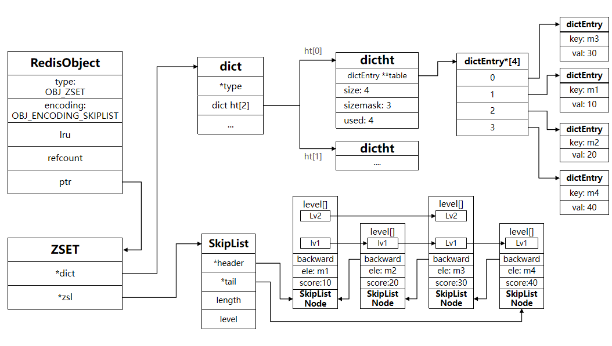

当元素数量不多时，HT和SkipList的优势不明显，而且更耗内存。因此zset还会采用ZipList结构来节省内存，不过需要同时满足两个条件：

* 元素数量小于zset_max_ziplist_entries，默认值128
* 每个元素都小于zset_max_ziplist_value字节，默认值64

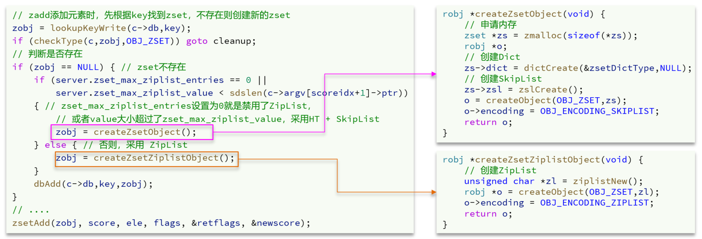

在触发上述两个条件的时候发生转码：

```c
int zsetAdd(robj *zobj, double score, sds ele, int in_flags, int *out_flags, double *newscore) {
    /* 判断编码方式*/
    if (zobj->encoding == OBJ_ENCODING_ZIPLIST) {// 是ZipList编码
        unsigned char *eptr;
        // 判断当前元素是否已经存在，已经存在则更新score即可
        if ((eptr = zzlFind(zobj->ptr,ele,&curscore)) != NULL) {
            //...略
            return 1;
        } else if (!xx) {
            // 元素不存在，需要新增，则判断ziplist长度有没有超、元素的大小有没有超
            if (zzlLength(zobj->ptr)+1 > server.zset_max_ziplist_entries
 		|| sdslen(ele) > server.zset_max_ziplist_value 
 		|| !ziplistSafeToAdd(zobj->ptr, sdslen(ele)))
            { // 如果超出，则需要转为SkipList编码
                zsetConvert(zobj,OBJ_ENCODING_SKIPLIST);
            } else {
                zobj->ptr = zzlInsert(zobj->ptr,ele,score);
                if (newscore) *newscore = score;
                *out_flags |= ZADD_OUT_ADDED;
                return 1;
            }
        } else {
            *out_flags |= ZADD_OUT_NOP;
            return 1;
        }
    }   
	// 本身就是SKIPLIST编码，无需转换
    if (zobj->encoding == OBJ_ENCODING_SKIPLIST) {
       // ...略
    } else {
        serverPanic("Unknown sorted set encoding");
    }
    return 0; /* Never reached. */
}
```

ziplist本身没有排序功能，而且没有键值对的概念，因此需要有zset通过编码实现：

* ZipList是连续内存，因此score和element是紧挨在一起的两个entry， element在前，score在后
* score越小越接近队首，score越大越接近队尾，按照score值升序排列

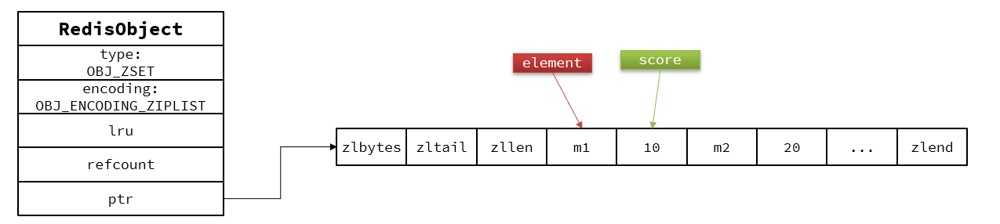

## 13、Hash

hash结构如下：

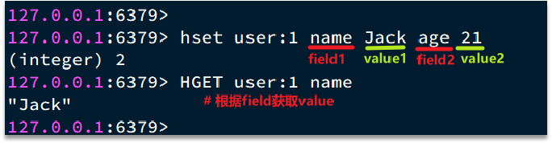

zset集合如下：

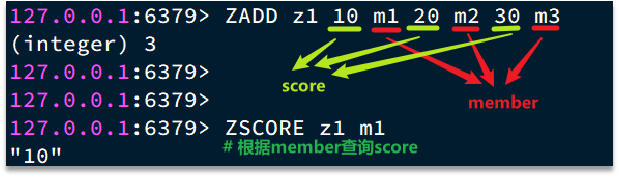

Hash结构与Redis中的Zset非常类似：

* 都是键值存储
* 都需求根据键获取值
* 键必须唯一

区别如下：

* zset的键是member，值是score；hash的键和值都是任意值
* zset要根据score排序；hash则无需排序


因此，Hash底层采用的编码与Zset也基本一致，只需要把排序有关的SkipList去掉即可：

- Hash结构默认采用ZipList编码，用以节省内存。 ZipList中相邻的两个entry 分别保存field和value


- 当数据量较大时，Hash结构会转为HT编码，也就是Dict，触发条件有两个：

  * ZipList中的元素数量超过了hash-max-ziplist-entries（默认512）

  * ZipList中的任意entry大小超过了hash-max-ziplist-value（默认64字节）

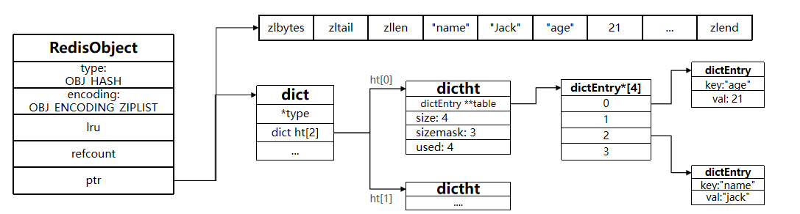

```c
void hsetCommand(client *c) {// hset user1 name Jack age 21
    int i, created = 0;
    robj *o; // 略 ...
    // 判断hash的key是否存在，不存在则创建一个新的，默认采用ZipList编码
    if ((o = hashTypeLookupWriteOrCreate(c,c->argv[1])) == NULL) return;
    // 判断是否需要把ZipList转为Dict
    hashTypeTryConversion(o,c->argv,2,c->argc-1);
    // 循环遍历每一对field和value，并执行hset命令
    for (i = 2; i < c->argc; i += 2)
        created += !hashTypeSet(o,c->argv[i]->ptr,c->argv[i+1]->ptr,HASH_SET_COPY);    // 略 ...
}
```

```c
robj *hashTypeLookupWriteOrCreate(client *c, robj *key) {
    // 查找key
    robj *o = lookupKeyWrite(c->db,key);
    if (checkType(c,o,OBJ_HASH)) return NULL;
    // 不存在，则创建新的
    if (o == NULL) {
        o = createHashObject();
        dbAdd(c->db,key,o);
    }
    return o;
}
```

```c
robj *createHashObject(void) {
    // 默认采用ZipList编码，申请ZipList内存空间
    unsigned char *zl = ziplistNew();
    robj *o = createObject(OBJ_HASH, zl);
    // 设置编码
    o->encoding = OBJ_ENCODING_ZIPLIST;
    return o;
}
```

```c
void hashTypeTryConversion(robj *o, robj **argv, int start, int end) {
    int i;
    size_t sum = 0;
    // 本来就不是ZipList编码，什么都不用做了
    if (o->encoding != OBJ_ENCODING_ZIPLIST) return;
    // 依次遍历命令中的field、value参数
    for (i = start; i <= end; i++) {
        if (!sdsEncodedObject(argv[i]))
            continue;
        size_t len = sdslen(argv[i]->ptr);
        // 如果field或value超过hash_max_ziplist_value，则转为HT
        if (len > server.hash_max_ziplist_value) {
            hashTypeConvert(o, OBJ_ENCODING_HT);
            return;
        }
        sum += len;
    }// ziplist大小超过1G，也转为HT
    if (!ziplistSafeToAdd(o->ptr, sum))
        hashTypeConvert(o, OBJ_ENCODING_HT);
}
```

```c
int hashTypeSet(robj *o, sds field, sds value, int flags) {
    int update = 0;
    // 判断是否为ZipList编码
    if (o->encoding == OBJ_ENCODING_ZIPLIST) {
        unsigned char *zl, *fptr, *vptr;
        zl = o->ptr;
        // 查询head指针
        fptr = ziplistIndex(zl, ZIPLIST_HEAD);
        if (fptr != NULL) { // head不为空，说明ZipList不为空，开始查找key
            fptr = ziplistFind(zl, fptr, (unsigned char*)field, sdslen(field), 1);
            if (fptr != NULL) {// 判断是否存在，如果已经存在则更新
                update = 1;
                zl = ziplistReplace(zl, vptr, (unsigned char*)value,
                        sdslen(value));
            }
        }
        // 不存在，则直接push
        if (!update) { // 依次push新的field和value到ZipList的尾部
            zl = ziplistPush(zl, (unsigned char*)field, sdslen(field),
                    ZIPLIST_TAIL);
            zl = ziplistPush(zl, (unsigned char*)value, sdslen(value),
                    ZIPLIST_TAIL);
        }
        o->ptr = zl;
        /* 插入了新元素，检查list长度是否超出，超出则转为HT */
        if (hashTypeLength(o) > server.hash_max_ziplist_entries)
            hashTypeConvert(o, OBJ_ENCODING_HT);
    } else if (o->encoding == OBJ_ENCODING_HT) {
        // HT编码，直接插入或覆盖
    } else {
        serverPanic("Unknown hash encoding");
    }
    return update;
}
```

