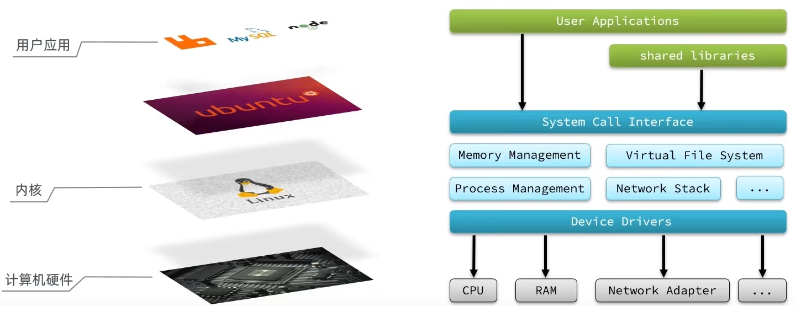
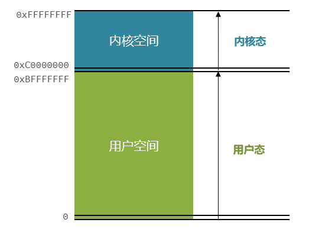
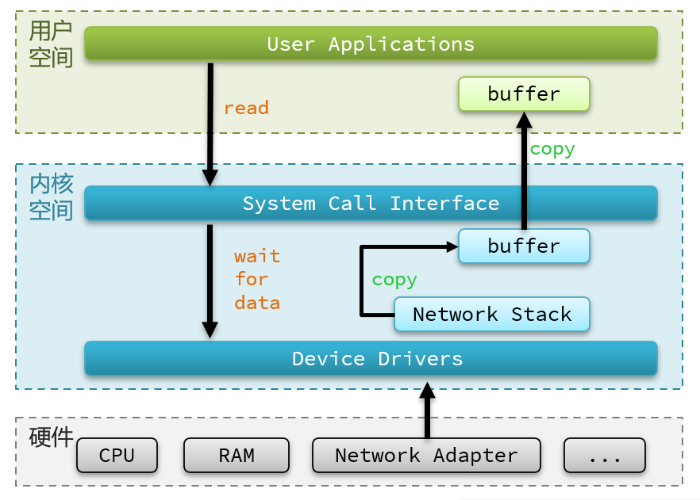
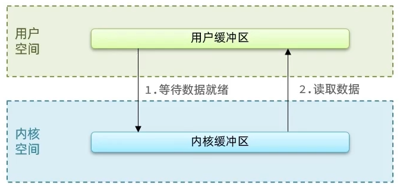
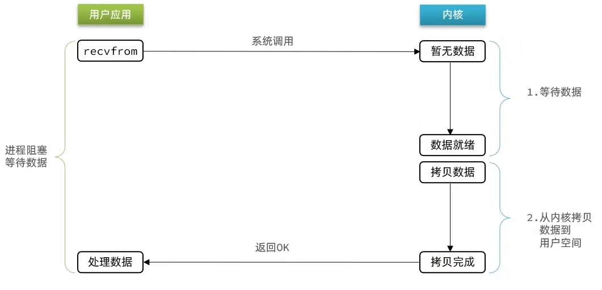
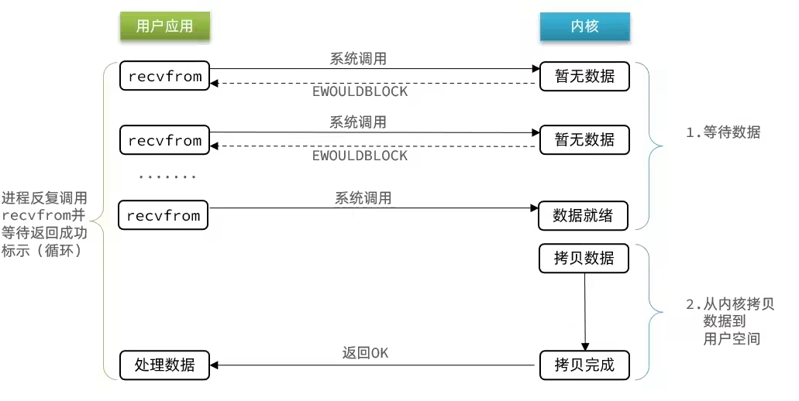
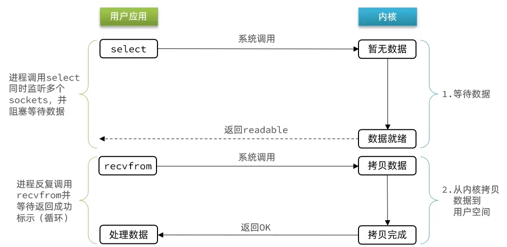

# 网络模型

## 1、用户空间和内核态空间

服务器大多都采用Linux系统，这里我们以Linux为例来讲解:

ubuntu和Centos 都是Linux的发行版，发行版可以看成对linux包了一层壳，任何Linux发行版，其系统内核都是Linux。我们的应用都需要通过Linux内核与硬件交互。

用户的应用，比如redis，mysql等其实是没有办法去执行访问我们操作系统的硬件的，所以我们可以通过发行版的这个壳子去访问内核，再通过内核去访问计算机硬件。

计算机硬件包括，如cpu，内存，网卡等等，内核（通过寻址空间）可以操作硬件的，但是内核需要不同设备的驱动，有了这些驱动之后，内核就可以去对计算机硬件去进行 内存管理，文件系统的管理，进程的管理等等。

为了避免用户应用导致冲突甚至内核崩溃，用户应用与内核是分离的：

- 进程的寻址空间划分成两部分：**内核空间、用户空间**
- **用户空间**只能执行受限的命令（Ring3），而且不能直接调用系统资源，必须通过内核提供的接口来访问
- **内核空间**可以执行特权命令（Ring0），调用一切系统资源

**什么是寻址空间呢？**

我们的应用程序也好，还是内核空间也好，都是没有办法直接去物理内存的，而是通过分配一些虚拟内存映射到物理内存中，我们的内核和应用程序去访问虚拟内存的时候，就需要一个虚拟地址，这个地址是一个无符号的整数，比如一个32位的操作系统，他的带宽就是32，他的虚拟地址就是2的32次方，也就是说他寻址的范围就是0~2的32次方， 这片寻址空间对应的就是2的32个字节，就是4GB，这个4GB，会有3个GB分给用户空间，会有1GB给内核系统。

在linux中，他们权限分成两个等级，0和3，用户空间只能执行受限的命令（Ring3），而且不能直接调用系统资源，必须通过内核提供的接口来访问。内核空间可以执行特权命令（Ring0），调用一切系统资源，所以一般情况下，用户的操作是运行在用户空间，而内核运行的数据是在内核空间的，而有的情况下，一个应用程序需要去调用一些特权资源，去调用一些内核空间的操作，所以此时他俩需要在用户态和内核态之间进行切换。

**例如**：

Linux系统为了提高IO效率，会在用户空间和内核空间都加入缓冲区：

- 写数据时，要把用户缓冲数据拷贝到内核缓冲区，然后写入设备

- 读数据时，要从设备读取数据到内核缓冲区，然后拷贝到用户缓冲区

针对这个操作：我们的用户在写读数据时，会去向内核态申请，想要读取内核的数据，而内核数据要去等待驱动程序从硬件上读取数据，当从磁盘上加载到数据之后，内核会将数据写入到内核的缓冲区中，然后再将数据拷贝到用户态的buffer中，然后再返回给应用程序。

整体而言，影响IO效率主要在两个地方，一是wait for data，另一个就是内核空间与用户空间的数据拷贝。

## 2、阻塞IO

在《UNIX网络编程》一书中，总结归纳了5种IO模型：

* 阻塞IO（Blocking IO）
* 非阻塞IO（Nonblocking IO）
* IO多路复用（IO Multiplexing）
* 信号驱动IO（Signal Driven IO）
* 异步IO（Asynchronous IO）

应用程序想要去读取数据，他是无法直接去读取磁盘数据的，他需要先到内核里边去等待内核操作硬件拿到数据，这个过程就是1，是需要等待的，等到内核从磁盘上把数据加载出来之后，再把这个数据写给用户的缓存区，这个过程是2，如果是阻塞IO，那么整个过程中，用户从发起读请求开始，一直到读取到数据，都是一个阻塞状态。

具体流程如下图：

用户去读取数据时，会去先发起recvform一个命令，去尝试从内核上加载数据，如果内核没有数据，那么用户就会等待，此时内核会去从硬件上读取数据，内核读取数据之后，会把数据拷贝到用户态，并且返回ok，整个过程，都是阻塞等待的，这就是阻塞IO。

顾名思义，阻塞IO就是两个阶段都必须阻塞等待：

**阶段一：**

- 用户进程尝试读取数据（比如网卡数据）
- 此时数据尚未到达，内核需要等待数据
- 此时用户进程也处于阻塞状态

**阶段二**：

* 数据到达并拷贝到内核缓冲区，代表已就绪
* 将内核数据拷贝到用户缓冲区
* 拷贝过程中，用户进程依然阻塞等待
* 拷贝完成，用户进程解除阻塞，处理数据

可以看到，阻塞IO模型中，用户进程在两个阶段都是阻塞状态。

## 3、非阻塞IO

顾名思义，非阻塞IO的recvfrom操作会立即返回结果而不是阻塞用户进程。

**阶段一**：

* 用户进程尝试读取数据（比如网卡数据）
* 此时数据尚未到达，内核需要等待数据
* 返回异常给用户进程
* 用户进程拿到error后，再次尝试读取
* 循环往复，直到数据就绪

**阶段二**：

* 将内核数据拷贝到用户缓冲区
* 拷贝过程中，用户进程依然阻塞等待
* 拷贝完成，用户进程解除阻塞，处理数据
* 可以看到，非阻塞IO模型中，用户进程在第一个阶段是非阻塞，第二个阶段是阻塞状态。虽然是非阻塞，但性能并没有得到提高。而且忙等机制会导致CPU空转，CPU使用率暴增。

## 4、IO多路复用

无论是阻塞IO还是非阻塞IO，用户应用在一阶段都需要调用recvfrom来获取数据，差别在于无数据时的处理方案：

- 如果调用recvfrom时，恰好没有数据，阻塞IO会使CPU阻塞，非阻塞IO使CPU空转，都不能充分发挥CPU的作用。
- 如果调用recvfrom时，恰好有数据，则用户进程可以直接进入第二阶段，读取并处理数据

所以怎么看起来以上两种方式性能都不好，而在单线程情况下，只能依次处理IO事件，如果正在处理的IO事件恰好未就绪（数据不可读或不可写），线程就会被阻塞，所有IO事件都必须等待，性能自然会很差。

就比如服务员给顾客点餐，**分两步**：

* 顾客思考要吃什么（等待数据就绪）
* 顾客想好了，开始点餐（读取数据）

要提高效率有几种办法？

- 方案一：增加更多服务员（多线程）
- 方案二：不排队，谁想好了吃什么（数据就绪了），服务员就给谁点餐（用户应用就去读取数据）

那么问题来了：用户进程如何知道内核中数据是否就绪呢？

所以接下来就需要详细的来解决多路复用模型是如何知道到底怎么知道内核数据是否就绪的问题了

这个问题的解决依赖于提出的

**文件描述符（File Descriptor）**：简称FD，是一个从0 开始的无符号整数，用来关联Linux中的一个文件。在Linux中，一切皆文件，例如常规文件、视频、硬件设备等，当然也包括网络套接字（Socket）。

**IO多路复用**：通过FD，我们的网络模型可以利用一个线程监听多个FD，并在某个FD可读、可写时得到通知，从而避免无效的等待，充分利用CPU资源。

**阶段一**：

* 用户进程调用select，指定要监听的FD集合
* 核监听FD对应的多个socket
* 任意一个或多个socket数据就绪则返回readable
* 此过程中用户进程阻塞

**阶段二**：

* 用户进程找到就绪的socket
* 依次调用recvfrom读取数据
* 内核将数据拷贝到用户空间
* 用户进程处理数据

当用户去读取数据的时候，不再去直接调用recvfrom了，而是调用select的函数，select函数会将需要监听的数据交给内核，由内核去检查这些数据是否就绪了，如果说这个数据就绪了，就会通知应用程序数据就绪，然后来读取数据，再从内核中把数据拷贝给用户态，完成数据处理，如果N多个FD一个都没处理完，此时就进行等待。

用IO复用模式，可以确保去读数据的时候，数据是一定存在的，他的效率比原来的阻塞IO和非阻塞IO性能都要高。

**IO多路复用**：是利用单个线程来同时监听多个FD，并在某个FD可读、可写时得到通知，从而避免无效的等待，充分利用CPU资源。不过监听FD的方式、通知的方式又有多种实现，常见的有：

- select
- poll
- epoll

**差异**：

- select和pool相当于是当被监听的数据准备好之后，他会把你监听的FD整个数据都发给你，你需要到整个FD中去找，哪些是处理好了的，需要通过遍历的方式，所以性能也并不是那么好
- epoll则会在通知用户进程FD就绪的同时，把已就绪的FD写入用户空间
- epoll则相当于内核准备好了之后，他会把准备好的数据，直接发给你，咱们就省去了遍历的动作。

