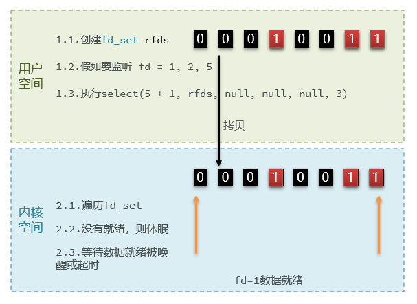
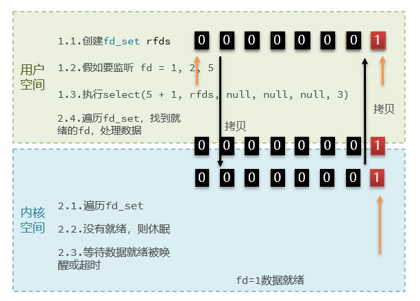
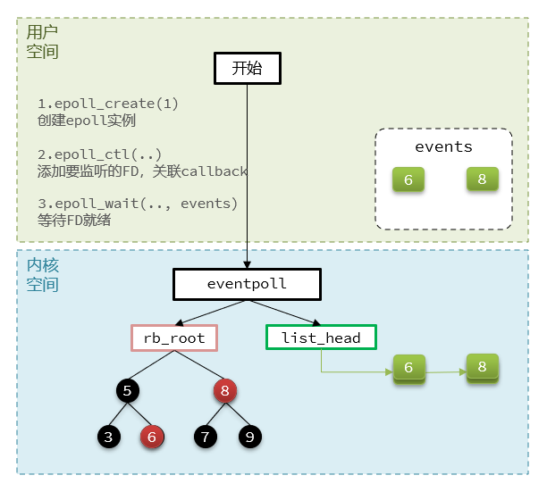
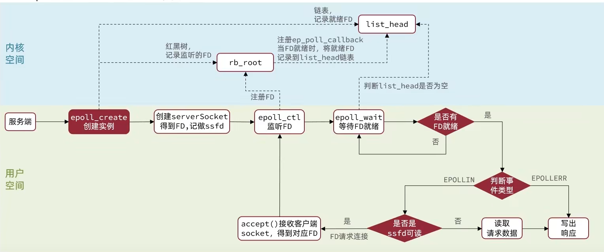
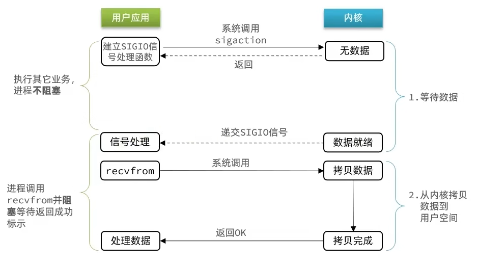
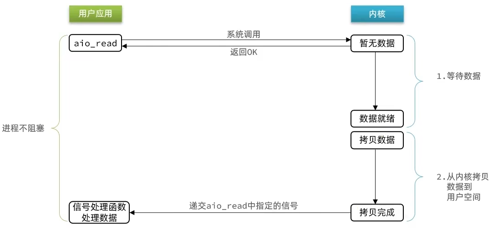
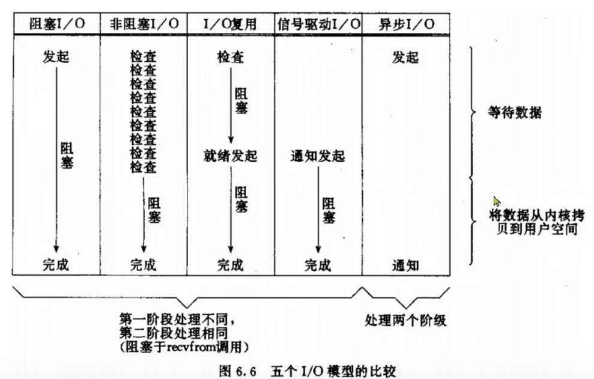

# 网络模型

## 1、用户空间和内核态空间

服务器大多都采用Linux系统，这里我们以Linux为例来讲解:

ubuntu和Centos 都是Linux的发行版，发行版可以看成对linux包了一层壳，任何Linux发行版，其系统内核都是Linux。我们的应用都需要通过Linux内核与硬件交互。

用户的应用，比如redis，mysql等其实是没有办法去执行访问我们操作系统的硬件的，所以我们可以通过发行版的这个壳子去访问内核，再通过内核去访问计算机硬件。

计算机硬件包括，如cpu，内存，网卡等等，内核（通过寻址空间）可以操作硬件的，但是内核需要不同设备的驱动，有了这些驱动之后，内核就可以去对计算机硬件去进行 内存管理，文件系统的管理，进程的管理等等。


为了避免用户应用导致冲突甚至内核崩溃，用户应用与内核是分离的：

- 进程的寻址空间划分成两部分：**内核空间、用户空间**
- **用户空间**只能执行受限的命令（Ring3），而且不能直接调用系统资源，必须通过内核提供的接口来访问
- **内核空间**可以执行特权命令（Ring0），调用一切系统资源


**什么是寻址空间呢？**

我们的应用程序也好，还是内核空间也好，都是没有办法直接去物理内存的，而是通过分配一些虚拟内存映射到物理内存中，我们的内核和应用程序去访问虚拟内存的时候，就需要一个虚拟地址，这个地址是一个无符号的整数，比如一个32位的操作系统，他的带宽就是32，他的虚拟地址就是2的32次方，也就是说他寻址的范围就是0~2的32次方， 这片寻址空间对应的就是2的32个字节，就是4GB，这个4GB，会有3个GB分给用户空间，会有1GB给内核系统。

在linux中，他们权限分成两个等级，0和3，用户空间只能执行受限的命令（Ring3），而且不能直接调用系统资源，必须通过内核提供的接口来访问。内核空间可以执行特权命令（Ring0），调用一切系统资源，所以一般情况下，用户的操作是运行在用户空间，而内核运行的数据是在内核空间的，而有的情况下，一个应用程序需要去调用一些特权资源，去调用一些内核空间的操作，所以此时他俩需要在用户态和内核态之间进行切换。

**例如**：

Linux系统为了提高IO效率，会在用户空间和内核空间都加入缓冲区：

- 写数据时，要把用户缓冲数据拷贝到内核缓冲区，然后写入设备

- 读数据时，要从设备读取数据到内核缓冲区，然后拷贝到用户缓冲区

针对这个操作：我们的用户在写读数据时，会去向内核态申请，想要读取内核的数据，而内核数据要去等待驱动程序从硬件上读取数据，当从磁盘上加载到数据之后，内核会将数据写入到内核的缓冲区中，然后再将数据拷贝到用户态的buffer中，然后再返回给应用程序。

整体而言，影响IO效率主要在两个地方，一是wait for data，另一个就是内核空间与用户空间的数据拷贝。


## 2、阻塞IO

在《UNIX网络编程》一书中，总结归纳了5种IO模型：

* 阻塞IO（Blocking IO）
* 非阻塞IO（Nonblocking IO）
* IO多路复用（IO Multiplexing）
* 信号驱动IO（Signal Driven IO）
* 异步IO（Asynchronous IO）


应用程序想要去读取数据，他是无法直接去读取磁盘数据的，他需要先到内核里边去等待内核操作硬件拿到数据，这个过程就是1，是需要等待的，等到内核从磁盘上把数据加载出来之后，再把这个数据写给用户的缓存区，这个过程是2，如果是阻塞IO，那么整个过程中，用户从发起读请求开始，一直到读取到数据，都是一个阻塞状态。

具体流程如下图：


用户去读取数据时，会去先发起recvform一个命令，去尝试从内核上加载数据，如果内核没有数据，那么用户就会等待，此时内核会去从硬件上读取数据，内核读取数据之后，会把数据拷贝到用户态，并且返回ok，整个过程，都是阻塞等待的，这就是阻塞IO。

顾名思义，阻塞IO就是两个阶段都必须阻塞等待：

**阶段一：**

- 用户进程尝试读取数据（比如网卡数据）
- 此时数据尚未到达，内核需要等待数据
- 此时用户进程也处于阻塞状态

**阶段二**：

* 数据到达并拷贝到内核缓冲区，代表已就绪
* 将内核数据拷贝到用户缓冲区
* 拷贝过程中，用户进程依然阻塞等待
* 拷贝完成，用户进程解除阻塞，处理数据

可以看到，阻塞IO模型中，用户进程在两个阶段都是阻塞状态。

## 3、非阻塞IO


顾名思义，非阻塞IO的recvfrom操作会立即返回结果而不是阻塞用户进程。

**阶段一**：

* 用户进程尝试读取数据（比如网卡数据）
* 此时数据尚未到达，内核需要等待数据
* 返回异常给用户进程
* 用户进程拿到error后，再次尝试读取
* 循环往复，直到数据就绪

**阶段二**：

* 将内核数据拷贝到用户缓冲区
* 拷贝过程中，用户进程依然阻塞等待
* 拷贝完成，用户进程解除阻塞，处理数据
* 可以看到，非阻塞IO模型中，用户进程在第一个阶段是非阻塞，第二个阶段是阻塞状态。虽然是非阻塞，但性能并没有得到提高。而且忙等机制会导致CPU空转，CPU使用率暴增。

## 4、IO多路复用

无论是阻塞IO还是非阻塞IO，用户应用在一阶段都需要调用recvfrom来获取数据，差别在于无数据时的处理方案：

- 如果调用recvfrom时，恰好没有数据，阻塞IO会使CPU阻塞，非阻塞IO使CPU空转，都不能充分发挥CPU的作用。
- 如果调用recvfrom时，恰好有数据，则用户进程可以直接进入第二阶段，读取并处理数据

所以怎么看起来以上两种方式性能都不好，而在单线程情况下，只能依次处理IO事件，如果正在处理的IO事件恰好未就绪（数据不可读或不可写），线程就会被阻塞，所有IO事件都必须等待，性能自然会很差。


就比如服务员给顾客点餐，**分两步**：

* 顾客思考要吃什么（等待数据就绪）
* 顾客想好了，开始点餐（读取数据）

要提高效率有几种办法？

- 方案一：增加更多服务员（多线程）
- 方案二：不排队，谁想好了吃什么（数据就绪了），服务员就给谁点餐（用户应用就去读取数据）

那么问题来了：用户进程如何知道内核中数据是否就绪呢？

所以接下来就需要详细的来解决多路复用模型是如何知道到底怎么知道内核数据是否就绪的问题了

这个问题的解决依赖于提出的**文件描述符概念**。

**文件描述符（File Descriptor）**：简称FD，是一个从0 开始的无符号整数，用来关联Linux中的一个文件。在Linux中，一切皆文件，例如常规文件、视频、硬件设备等，当然也包括网络套接字（Socket）。

**IO多路复用**：通过FD，我们的网络模型可以利用一个线程监听多个FD，并在某个FD可读、可写时得到通知，从而避免无效的等待，充分利用CPU资源。


**阶段一**：

* 用户进程调用select，指定要监听的FD集合
* 内核监听FD对应的多个socket
* 任意一个或多个socket数据就绪则返回readable
* 此过程中用户进程阻塞

**阶段二**：

* 用户进程找到就绪的socket
* 依次调用recvfrom读取数据
* 内核将数据拷贝到用户空间
* 用户进程处理数据

当用户去读取数据的时候，不再去直接调用recvfrom了，而是调用select的函数，select函数会将需要监听的数据交给内核，由内核去检查这些数据是否就绪了，如果说这个数据就绪了，就会通知应用程序数据就绪，然后来读取数据，再从内核中把数据拷贝给用户态，完成数据处理，如果N多个FD一个都没处理完，此时就进行等待。

用IO复用模式，可以确保去读数据的时候，数据是一定存在的，他的效率比原来的阻塞IO和非阻塞IO性能都要高。

**IO多路复用**：是利用单个线程来同时监听多个FD，并在某个FD可读、可写时得到通知，从而避免无效的等待，充分利用CPU资源。不过监听FD的方式、通知的方式又有多种实现，常见的有：

- select
- poll
- epoll

**差异**：

- select和pool相当于是当被监听的数据准备好之后，他会把你监听的FD整个数据都发给你，你需要到整个FD中去找，哪些是处理好了的，需要通过遍历的方式，所以性能也并不是那么好
- epoll则会在通知用户进程FD就绪的同时，把已就绪的FD写入用户空间

## 5、IO多路复用-select

select是Linux最早是由的I/O多路复用技术：

```c
// 定义类型别名 __fd_mask，本质是 long int
typedef long int __fd_mask;

/* fd_set 记录要监听的fd集合，及其对应状态 */
typedef struct {
    // fds_bits是long类型数组，长度为 1024/32 = 32
    // 共1024个bit位，每个bit位代表一个fd，0代表未就绪，1代表就绪
    __fd_mask fds_bits[__FD_SETSIZE / __NFDBITS];
    // ...
} fd_set;

// select函数，用于监听fd_set，也就是多个fd的集合
int select(
    int nfds, // 要监视的fd_set的最大fd + 1
    fd_set *readfds, // 要监听读事件的fd集合
    fd_set *writefds,// 要监听写事件的fd集合
    fd_set *exceptfds, // // 要监听异常事件的fd集合
    // 超时时间，null-用不超时；0-不阻塞等待；大于0-固定等待时间
    struct timeval *timeout
);
```





简单说，就是我们把需要处理的数据封装成FD，然后在用户态时创建一个fd的集合（这个集合的大小是要监听的那个FD的最大值+1，但是大小整体是有限制的 ），这个集合的长度大小是有限制的，同时在这个集合中，标明出来我们要控制哪些数据，

比如要监听的数据，是1,2,5三个数据，此时会执行select函数，然后将整个fd发给内核态，内核态会去遍历用户态传递过来的数据，如果发现这里边都数据都没有就绪，就休眠，直到有数据准备好时，就会被唤醒，唤醒之后，再次遍历一遍，看看谁准备好了，然后再将处理掉没有准备好的数据，最后再将这个FD集合写回到用户态中去，此时用户态就知道了，奥，有人准备好了，但是对于用户态而言，并不知道谁处理好了，所以用户态也需要去进行遍历，然后找到对应准备好数据的节点，再去发起读请求。

**select模式存在的问题**：

- 需要将整个fd_set从用户空间拷贝到内核空间，select结束还要再次拷贝回用户空间
- select无法得知具体是哪个fd就绪，需要遍历整个fd_set
- fd_set监听的fd数量不能超过1024

## 6、IO多路复用-poll

poll模式对select模式做了简单改进，但性能提升不明显，部分关键代码如下：

```c
// pollfd 中的事件类型
#define POLLIN     //可读事件
#define POLLOUT    //可写事件
#define POLLERR    //错误事件
#define POLLNVAL   //fd未打开

// pollfd结构
struct pollfd {
    int fd;     	  /* 要监听的fd  */
    short int events; /* 要监听的事件类型：读、写、异常 */
    short int revents;/* 实际发生的事件类型 */
};

// poll函数
int poll(
    struct pollfd *fds, // pollfd数组，可以自定义大小
    nfds_t nfds, // 数组元素个数
    int timeout // 超时时间
);
```

**IO流程**：

1. 创建pollfd数组，向其中添加关注的fd信息，数组大小自定义
2. 调用poll函数，将pollfd数组拷贝到内核空间，转链表存储，无上限
3. 内核遍历fd，判断是否就绪
4. 数据就绪或超时后，拷贝pollfd数组到用户空间，返回就绪fd数量n
5. 用户进程判断n是否大于0
6. 大于0则遍历pollfd数组，找到就绪的fd

**与select对比：**

* select模式中的fd_set大小固定为1024，而pollfd在内核中采用链表，理论上无上限
* 监听FD越多，每次遍历消耗时间也越久，性能反而会下降

## 7、IO多路复用-epoll

epoll模式是对select和poll的改进，它提供了三个函数：

```c
struct eventpoll {
    //...
    struct rb_root  rbr; // 一颗红黑树，记录要监听的FD
    struct list_head rdlist;// 一个链表，记录就绪的FD
    //...
};

// 1.创建一个epoll实例,内部是event poll，返回对应的句柄epfd
int epoll_create(int size);

// 2.将一个FD添加到epoll的红黑树中，并设置ep_poll_callback
// callback触发时，就把对应的FD加入到rdlist这个就绪列表中
int epoll_ctl(
    int epfd,  // epoll实例的句柄
    int op,    // 要执行的操作，包括：ADD、MOD、DEL
    int fd,    // 要监听的FD
    struct epoll_event *event // 要监听的事件类型：读、写、异常等
);

// 3.检查rdlist列表是否为空，不为空则返回就绪的FD的数量
int epoll_wait(
    int epfd,                   // epoll实例的句柄
    struct epoll_event *events, // 空event数组，用于接收就绪的FD
    int maxevents,              // events数组的最大长度
    int timeout   // 超时时间，-1用不超时；0不阻塞；大于0为阻塞时间
);
```



eventpoll结构体内部包含两个东西:

1、红黑树-> 记录的事要监听的FD

2、一个是链表->记录的是就绪的FD

**epoll_ctl函数**：

将要监听的数据添加到红黑树上去，并且给每个fd设置一个监听函数，这个函数会在fd数据就绪时触发，就是准备好了，现在就把fd把数据添加到list_head中去。

**epoll_wait函数**：

就去等待，在用户态创建一个空的events数组，当fd数据主备就绪之后，我们的回调函数会把数据添加到list_head中去，当调用这个函数的时候，会去检查list_head，当然这个过程需要参考配置的等待时间，可以等一定时间，也可以一直等， 如果在此过程中，检查到了list_head中有数据会将数据添加到链表中，此时将数据放入到events数组中，并且返回对应的操作的数量，用户态的此时收到响应后，从events中拿到对应准备好的数据的节点，再去调用方法去拿数据。

**小总结**：

select模式存在的三个问题：

* 能监听的FD最大不超过1024
* 每次select都需要把所有要监听的FD都拷贝到内核空间
* 每次都要遍历所有FD来判断就绪状态

poll模式的问题：

* poll利用链表解决了select中监听FD上限的问题，但依然要遍历所有FD，如果监听较多，性能会下降

epoll模式中如何解决这些问题的？

* 基于epoll实例中的红黑树保存要监听的FD，理论上无上限，而且增删改查效率都非常高
* 每个FD只需要执行一次epoll_ctl添加到红黑树，以后每次epol_wait无需传递任何参数，无需重复拷贝FD到内核空间
* 利用ep_poll_callback机制来监听FD状态，无需遍历所有FD，因此性能不会随监听的FD数量增多而下降

## 8、epoll中的ET和LT

当FD有数据可读时，我们调用epoll_wait就可以得到通知。但是事件通知的模式有两种：

* LevelTriggered：简称LT。当FD有数据可读时，会重复通知多次，直至数据处理完成。是Epoll的默认模式
* EdgeTriggered：简称ET。当FD有数据可读时，只会被通知一次，不管数据是否处理完成。

举个栗子：

1. 假设一个客户端socket对应的FD已经注册到了epoll实例中
2. 客户端socket发送了2kb的数据
3. 服务端调用epoll_wait，得到通知说FD就绪
4. 服务端从FD读取了1kb数据
5. 回到步骤3（再次调用epoll_wait，形成循环）

如果我们采用LT模式，因为FD中仍有1kb数据，则第⑤步依然会返回结果，并且得到通知，继续读取数据。

如果我们采用ET模式，因为第3步已经消费了FD可读事件，第5步FD状态没有变化，因此epoll_wait不会返回，数据无法读取，客户端响应超时。


在FD数据准备就绪后，将list_head中FD数据拷贝到events之前，会将FD从list_head(就绪链表)断开，也就是把指针移除，然后在拷贝到events中，这样用户就可以去处理数据了。

假设我们数据没有处理完成，这两个就绪的FD还有数据，这时我们的内核会判断事件通知模式是LT还是ET，如果是ET模式，那这两个FD就直接断开了，移除队列了，再次调用epoll_wait函数的时候，list_head就是空的了。如果采用的是LT模式，并且FD还有数据，会将FD重新添加进list_head，再次调用epoll_wait函数的时候，会继续将FD拷贝到events，这样就实现了重复的读取数据。

如果我们想用ET模式，可以在数据的读取方式上进行一些改变：

- 在第一次从FD读取数据后，如果数据没有读取完成，我们可以手动调用epoll_ctl函数的将FD再添加到list_head中

- 一次性读取所有数据，在读取数据的时候循环的尝试从这个FD读数据，直到数据读取完成。在while true循环的读取数据的时候，千万不能用阻塞io模式来读，因为阻塞io在读到FD已经没有数据的时候，它不是返回一个错误，而是一直卡在这里，等到下一次再来数据为止。这就导致陷入了第4步出不来了，进而导致整个进程阻塞。如果我们想在一次通知中把所有数据读完，一定要采用非阻塞io，非阻塞io在有数据的时候返回，在没有数据的时候返回一个标识，告诉我们没有数据了，这时候就可以跳出循环了，进而避免阻塞。

LT模式存在的问题：

- 这种重复的通知对于性能和效率都是有影响的。
- 可能会出现惊群现象：假设有n个不同的进程同时监听eventpoll中的一个FD，并且他们都在调用epoll_wait尝试获取就绪的FD，如果FD就绪就会通知我们的进程。如果我们采用LT模式，在一个进程接收到通知之后，因为FD还在list_head中，所有的进程都会接受到通知。在真正进行数据处理的时候可能前一两个进程就能够后把数据处理完成了，后续唤醒的进程没有必要去唤醒了。ET的模式就不会出现这样的问题，第一个进程接收到通知后，FD就被移除了，后续的进程不会再被唤醒。

**结论**:

- ET模式避免了LT模式可能出现的惊群现象
- ET模式最好结合非阻塞IO读取FD数据，相比LT会复杂一些

## 9、基于epoll的服务器端流程



服务器启动以后，服务端会去调用epoll_create，创建一个epoll实例，epoll实例中包含两个数据：

- 红黑树（为空）：rb_root 用来去记录需要被监听的FD

- 链表（为空）：list_head，用来存放已经就绪的FD

初始化serverSocket，因为我们这里是一个web服务，web服务都是基于tcp协议，在tcp协议里，服务端就是一个serverSocket。serverSocket在linux系统里同样会被看成是一个文件，有自己的这个文件描述符ssfd。

serverSocket创建好了之后，会去调用epoll_ctl函数，此函数会会将需要监听的数据添加到rb_root中去，并且对当前这些存在于红黑树的节点设置回调函数，当这些被监听的数据一旦准备完成，就会被调用，而调用的结果就是将红黑树的fd添加到list_head中去(但是此时并没有完成)。

监听完成之后，会去调用epoll_wait函数，判断list_head是否为空，也就是去校验是否有数据准备完毕，如果有直接返回，如果没有等待指定的时间。

判断是否有FD就绪，如果没有，重新执行epoll_wait函数，直到数据就绪为止。

那么什么时候FD就绪？作为serverSocket只有一种情况是FD就绪，那就是有客户端在向它申请连接。因为serverSocket的唯一目的就是接收客户端请求，一旦有客户端的Socket尝试跟他建立连接，这时候serverSocket上就产生了fd的事件了。而且是读事件。

随着程序的运行，epoll实例上监听的fd越来越多，事件的类型也会越来越多，所以在fd就绪之后判断一下事件类型，如果是epollin，表明是读事件，还要判断是否是ssfd可读，如果是ssfd可读，那就证明是客户端准备连接了，因此我们要去调用accept接口客户端socket，得到对应的fd。然后再次调用epoll_ctl函数，将fd注册到红黑树上去，设置回调函数。如果再用客户端注册进来，再次重复同样的流程。

随着时间的推移，我们连接到服务端的客户端越来越多，监听的fd也就越来越多，那么接下来客户端可能就要发送请求了给服务端了，客户端发请求过来后就有请求参数，也就会触发fd事件，也是读事件，这个时候要判断是不是ssfd可读，如果是ssfd可读，那判断是新客户端来了，如果不是，那就证明当前读的是一个普通的客户端socket，代表它有请求参数来了，此时我们应该去读取它里面的请求参数，去处理业务，返回相应结果，直接写到客户端socket。

## 10、信号驱动IO

信号驱动IO是与内核建立SIGIO的信号关联并设置回调，当内核有FD就绪时，会发出SIGIO信号通知用户，期间用户应用可以执行其它业务，无需阻塞等待。



阶段一：

* 用户进程调用sigaction，注册信号处理函数
* 内核返回成功，开始监听FD
* 用户进程不阻塞等待，可以执行其它业务
* 当内核数据就绪后，回调用户进程的SIGIO处理函数

阶段二：

* 收到SIGIO回调信号
* 调用recvfrom，读取
* 内核将数据拷贝到用户空间
* 用户进程处理数据

**问题**：

- 当有大量IO操作时，信号较多，SIGIO处理函数不能及时处理可能导致信号队列溢出
- 而且内核空间与用户空间的频繁信号交互性能也较低。

## 11、异步IO



阶段一：

- 用户进程调用aio_read，创建信号回调函数
- 内核等待数据就绪
- 用户进程无需阻塞，可以做任何事情

阶段二：

- 内核数据就绪
- 内核数据拷贝到用户缓冲区
- 拷贝完成，内核递交信号触发aio_read中的回调函数
- 用户进程处理数据

这种方式，不仅仅是用户态在试图读取数据后，不阻塞，而且当内核的数据准备完成后，也不会阻塞。

他会由内核将所有数据处理完成后，由内核将数据写入到用户态中，然后才算完成，所以性能极高，不会有任何阻塞，全部都由内核完成，可以看到，异步IO模型中，用户进程在两个阶段都是非阻塞状态。

## 12、同步与异步




IO操作是同步还是异步，关键看数据在内核空间与用户空间的拷贝过程（数据读写的IO操作），也就是阶段二是同步还是异步。

## 13、Redis是单线程的吗？

**Redis到底是单线程还是多线程？**

* 如果仅仅聊Redis的核心业务部分（命令处理），答案是单线程
* 如果是聊整个Redis，那么答案就是多线程

在Redis版本迭代过程中，在两个重要的时间节点上引入了多线程的支持：

* Redis v4.0：引入多线程异步处理一些耗时较旧的任务，例如异步删除命令unlink
* Redis v6.0：在核心网络模型中引入 多线程，进一步提高对于多核CPU的利用率

因此，对于Redis的核心网络模型，在Redis 6.0之前确实都是单线程。是利用epoll（Linux系统）这样的IO多路复用技术在事件循环中不断处理客户端情况。

**为什么Redis要选择单线程？**

* 抛开持久化不谈，Redis是纯  内存操作，执行速度非常快，它的性能瓶颈是网络延迟而不是执行速度，因此多线程并不会带来巨大的性能提升。
* 多线程会导致过多的上下文切换，带来不必要的开销
* 引入多线程会面临线程安全问题，必然要引入线程锁这样的安全手段，实现复杂度增高，而且性能也会大打折扣

## 14、Redis单线程和多线程网络模型变更


