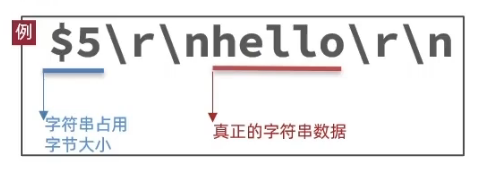
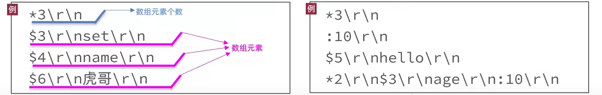
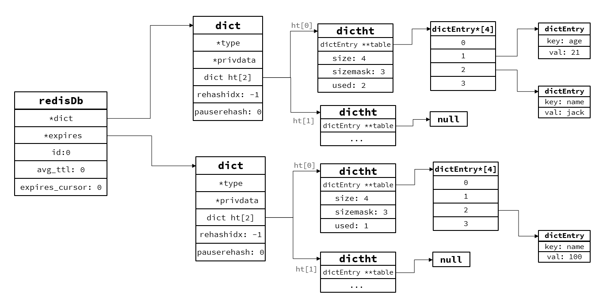
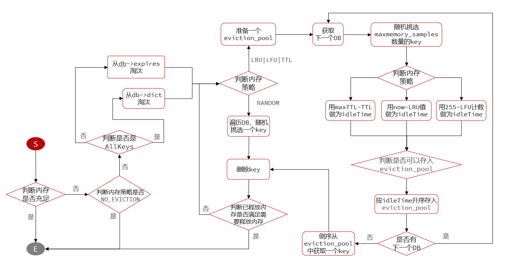

# RESP协议

Redis是一个CS架构的软件，通信一般分两步（不包括pipeline和PubSub）：

1. 客户端（client）向服务端（server）发送一条命令

2. 服务端解析并执行命令，返回响应结果给客户端


因此客户端发送命令的格式、服务端响应结果的格式必须有一个规范，这个规范就是通信协议。


而在Redis中采用的是**RESP**（Redis Serialization Protocol）协议：

- Redis 1.2版本引入了RESP协议

- Redis 2.0版本中成为与Redis服务端通信的标准，称为RESP2

- Redis 6.0版本中，从RESP2升级到了RESP3协议，增加了更多数据类型并且支持6.0的新特性--客户端缓存


但目前，默认使用的依然是RESP2协议，也是我们要学习的协议版本（以下简称RESP）。


在RESP中，通过首字节的字符来区分不同数据类型，常用的数据类型包括5种：

- 单行字符串：首字节是 ‘+’ ，后面跟上单行字符串，以CRLF（ "\r\n" ）结尾。例如返回"OK"： "+OK\r\n"


- 错误（Errors）：首字节是 ‘-’ ，与单行字符串格式一样，只是字符串是异常信息，例如："-Error message\r\n"


- 数值：首字节是 ‘:’ ，后面跟上数字格式的字符串，以CRLF结尾。例如：":10\r\n"


- 多行字符串：首字节是 ‘$’ ，表示二进制安全的字符串，最大支持512MB：

  

  - 如果大小为0，则代表空字符串："$0\r\n\r\n"


  - 如果大小为-1，则代表不存在："$-1\r\n"

- 数组：首字节是 ‘*’，后面跟上数组元素个数，再跟上元素，元素数据类型不限:



## 1、基于Socket自定义Redis的客户端

Redis支持TCP通信，因此我们可以使用Socket来模拟客户端，与Redis服务端建立连接：

```java
public class Main {

    static Socket s;
    static PrintWriter writer;
    static BufferedReader reader;

    public static void main(String[] args) {
        try {
            // 1.建立连接
            String host = "192.168.150.101";
            int port = 6379;
            s = new Socket(host, port);
            // 2.获取输出流、输入流
            writer = new PrintWriter(new OutputStreamWriter(s.getOutputStream(), StandardCharsets.UTF_8));
            reader = new BufferedReader(new InputStreamReader(s.getInputStream(), StandardCharsets.UTF_8));

            // 3.发出请求
            // 3.1.获取授权 auth 123321
            sendRequest("auth", "123321");
            Object obj = handleResponse();
            System.out.println("obj = " + obj);

            // 3.2.set name 虎哥
            sendRequest("set", "name", "虎哥");
            // 4.解析响应
            obj = handleResponse();
            System.out.println("obj = " + obj);

            // 3.2.set name 虎哥
            sendRequest("get", "name");
            // 4.解析响应
            obj = handleResponse();
            System.out.println("obj = " + obj);

            // 3.2.set name 虎哥
            sendRequest("mget", "name", "num", "msg");
            // 4.解析响应
            obj = handleResponse();
            System.out.println("obj = " + obj);
        } catch (IOException e) {
            e.printStackTrace();
        } finally {
            // 5.释放连接
            try {
                if (reader != null) reader.close();
                if (writer != null) writer.close();
                if (s != null) s.close();
            } catch (IOException e) {
                e.printStackTrace();
            }
        }
    }

    private static Object handleResponse() throws IOException {
        // 读取首字节
        int prefix = reader.read();
        // 判断数据类型标示
        switch (prefix) {
            case '+': // 单行字符串，直接读一行
                return reader.readLine();
            case '-': // 异常，也读一行
                throw new RuntimeException(reader.readLine());
            case ':': // 数字
                return Long.parseLong(reader.readLine());
            case '$': // 多行字符串
                // 先读长度
                int len = Integer.parseInt(reader.readLine());
                if (len == -1) {
                    return null;
                }
                if (len == 0) {
                    return "";
                }
                // 再读数据,读len个字节。我们假设没有特殊字符，所以读一行（简化）
                return reader.readLine();
            case '*':
                return readBulkString();
            default:
                throw new RuntimeException("错误的数据格式！");
        }
    }

    private static Object readBulkString() throws IOException {
        // 获取数组大小
        int len = Integer.parseInt(reader.readLine());
        if (len <= 0) {
            return null;
        }
        // 定义集合，接收多个元素
        List<Object> list = new ArrayList<>(len);
        // 遍历，依次读取每个元素
        for (int i = 0; i < len; i++) {
            list.add(handleResponse());
        }
        return list;
    }

    // set name 虎哥
    private static void sendRequest(String ... args) {
        writer.println("*" + args.length);
        for (String arg : args) {
            writer.println("$" + arg.getBytes(StandardCharsets.UTF_8).length);
            writer.println(arg);
        }
        writer.flush();
    }
}

```

## 2、Redis内存回收-过期key处理

Redis之所以性能强，最主要的原因就是基于内存存储。然而单节点的Redis其内存大小不宜过大，会影响持久化或主从同步性能。

我们可以通过修改配置文件来设置Redis的最大内存：

```sh
# 格式：
# maxmemory <bytes>
# 例如：
maxmemory 1gb
```

当内存使用达到上限时，就无法存储更多数据了。为了解决这个问题，Redis提供了一些策略实现内存回收：

- 内存过期策略
- 内存淘汰策略

### 2.1、内存过期策略

在学习Redis缓存的时候我们说过，可以通过expire命令给Redis的key设置TTL（存活时间）：

```sh
127.0.0.1:6379> set name jack
OK
127.0.0.1:6379> expire name 5 #设置ttl为5秒
(integer) 1
127.0.0.1:6379> get name #立即访问
"jack"
127.0.0.1:6379> get name #5秒后访问
(nil)
```

可以发现，当key的TTL到期以后，再次访问name返回的是nil，说明这个key已经不存在了，对应的内存也得到释放。从而起到内存回收的目的。


**这里有两个问题需要我们思考**：

Redis是如何知道一个key是否过期呢？

- 利用两个Dict分别记录key-value对及key-ttl对

是不是TTL到期就立即删除了呢？

- 惰性删除
- 周期删除


**DB结构**:

Redis本身是一个典型的key-value内存存储数据库，因此所有的key、value都保存在之前学习过的Dict结构中。不过在其database结构体中，有两个Dict：一个用来记录key-value；另一个用来记录key-TTL。

```c
typedef struct redisDb {
    dict *dict;                 /* 存放所有key及value的地方，也被称为keyspace*/
    dict *expires;              /* 存放每一个key及其对应的TTL存活时间，只包含设置了TTL的key*/
    dict *blocking_keys;        /* Keys with clients waiting for data (BLPOP)*/
    dict *ready_keys;           /* Blocked keys that received a PUSH */
    dict *watched_keys;         /* WATCHED keys for MULTI/EXEC CAS */
    int id;                     /* Database ID，0~15 */
    long long avg_ttl;          /* 记录平均TTL时长 */
    unsigned long expires_cursor; /* expire检查时在dict中抽样的索引位置. */
    list *defrag_later;         /* 等待碎片整理的key列表. */
} redisDb;
```



**惰性删除**

惰性删除：顾明思议并不是在TTL到期后就立刻删除，而是在访问一个key的时候，检查该key的存活时间，如果已经过期才执行删除。

```c
// 查找一个key执行写操作
robj *lookupKeyWriteWithFlags(redisDb *db, robj *key, int flags) {
    // 检查key是否过期
    expireIfNeeded(db,key);
    return lookupKey(db,key,flags);
}
// 查找一个key执行读操作
robj *lookupKeyReadWithFlags(redisDb *db, robj *key, int flags) {
    robj *val;
    // 检查key是否过期
    if (expireIfNeeded(db,key) == 1) {
        // ...略
    }
    return NULL;
}

```

```c
int expireIfNeeded(redisDb *db, robj *key) {
    // 判断是否过期，如果未过期直接结束并返回0
    if (!keyIsExpired(db,key)) return 0;
    // ... 略
    // 删除过期key
    deleteExpiredKeyAndPropagate(db,key);
    return 1;
}
```

**周期删除**

周期删除：顾明思议是通过一个定时任务，周期性的抽样部分过期的key，然后执行删除。执行周期有两种：

- Redis服务初始化函数initServer()中设置定时任务，按照server.hz的频率来执行过期key清理，模式为SLOW
- Redis的每个事件循环前会调用beforeSleep()函数，执行过期key清理，模式为FAST

```c
// server.c
void initServer(void){
    // ...
    // 创建定时器，关联回调函数serverCron，处理周期取决于server.hz，默认10
    aeCreateTimeEvent(server.el, 1, serverCron, NULL, NULL) 
}
```

```c
// server.c
int serverCron(struct aeEventLoop *eventLoop, long long id, void *clientData) {
    // 更新lruclock到当前时间，为后期的LRU和LFU做准备
    unsigned int lruclock = getLRUClock();
    atomicSet(server.lruclock,lruclock);
    // 执行database的数据清理，例如过期key处理
    databasesCron();
    return 1000/server.hz;
}
```

```c
void databasesCron(void) {
    // 尝试清理部分过期key，清理模式默认为SLOW
    activeExpireCycle(
          ACTIVE_EXPIRE_CYCLE_SLOW);
}
```

```c
void beforeSleep(struct aeEventLoop *eventLoop){
    // ...
    // 尝试清理部分过期key，清理模式默认为FAST
    activeExpireCycle(
         ACTIVE_EXPIRE_CYCLE_FAST);
}
```

**SLOW模式规则：**

1. 执行频率受server.hz影响，默认为10，即每秒执行10次，每个执行周期100ms。
2. 执行清理耗时不超过一次执行周期的25%.默认slow模式耗时不超过25ms
3. 逐个遍历db，逐个遍历db中的bucket，抽取20个key判断是否过期
4. 如果没达到时间上限（25ms）并且过期key比例大于10%，再进行一次抽样，否则结束

**FAST模式规则（过期key比例小于10%不执行 ）：**

1. 执行频率受beforeSleep()调用频率影响，但两次FAST模式间隔不低于2ms
2. 执行清理耗时不超过1ms
3. 逐个遍历db，逐个遍历db中的bucket，抽取20个key判断是否过期
4. 如果没达到时间上限（1ms）并且过期key比例大于10%，再进行一次抽样，否则结束

**小总结**：

RedisKey的TTL记录方式：

- 在RedisDB中通过一个Dict记录每个Key的TTL时间


过期key的删除策略：

- 惰性清理：每次查找key时判断是否过期，如果过期则删除

- 定期清理：定期抽样部分key，判断是否过期，如果过期则删除。

定期清理的两种模式：

- SLOW模式执行频率默认为10，每次不超过25ms

- FAST模式执行频率不固定，但两次间隔不低于2ms，每次耗时不超过1ms

### 2.2、内存淘汰策略

**内存淘汰**：就是当Redis内存使用达到设置的上限时，主动挑选部分key删除以释放更多内存的流程。

Redis会在处理客户端命令的方法processCommand()中尝试做内存淘汰：

```c
int processCommand(client *c) {
    // 如果服务器设置了server.maxmemory属性，并且并未有执行lua脚本
    if (server.maxmemory && !server.lua_timedout) {
        // 尝试进行内存淘汰performEvictions
        int out_of_memory = (performEvictions() == EVICT_FAIL);
        // ...
        if (out_of_memory && reject_cmd_on_oom) {
            rejectCommand(c, shared.oomerr);
            return C_OK;
        }
        // ....
    }
}
```

**淘汰策略**

Redis支持8种不同策略来选择要删除的key：

* noeviction： 不淘汰任何key，但是内存满时不允许写入新数据，默认就是这种策略。
* volatile-ttl： 对设置了TTL的key，比较key的剩余TTL值，TTL越小越先被淘汰
* allkeys-random：对全体key ，随机进行淘汰。也就是直接从db->dict中随机挑选
* volatile-random：对设置了TTL的key ，随机进行淘汰。也就是从db->expires中随机挑选。
* allkeys-lru： 对全体key，基于LRU算法进行淘汰
* volatile-lru： 对设置了TTL的key，基于LRU算法进行淘汰
* allkeys-lfu： 对全体key，基于LFU算法进行淘汰
* volatile-lfu： 对设置了TTL的key，基于LFI算法进行淘汰

比较容易混淆的有两个：

* LRU（Least Recently Used），最少最近使用。用当前时间减去最后一次访问时间，这个值越大则淘汰优先级越高。
* LFU（Least Frequently Used），最少频率使用。会统计每个key的访问频率，值越小淘汰优先级越高。

```sh
#
# The default is:
#
# maxmemory-policy noeviction
```


Redis的数据都会被封装为RedisObject结构：

```c
typedef struct redisObject {
    unsigned type:4;        // 对象类型
    unsigned encoding:4;    // 编码方式
    unsigned lru:LRU_BITS;  // LRU：以秒为单位记录最近一次访问时间，长度24bit
			  				// LFU：高16位以分钟为单位记录最近一次访问时间，低8位记录逻辑访问次数
    int refcount;           // 引用计数，计数为0则可以回收
    void *ptr;              // 数据指针，指向真实数据
} robj;
```

LFU的访问次数之所以叫做逻辑访问次数，是因为并不是每次key被访问都计数，而是通过运算：

* 生成0~1之间的随机数R
* 计算1/ (旧次数 * lfu_log_factor + 1)，记录为P，lfu_log_factor 默认为10
* 如果 R < P ，则计数器 + 1，且最大不超过255
* 访问次数会随时间衰减，距离上一次访问时间每隔 lfu_decay_time 分钟，计数器 -1

最后用一副图来描述当前的这个流程:




