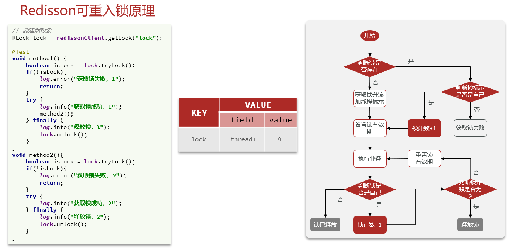
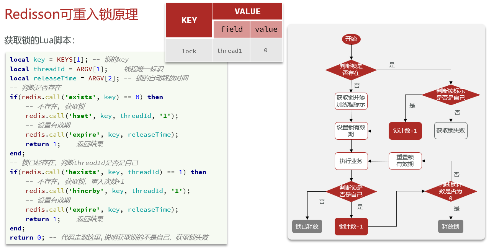
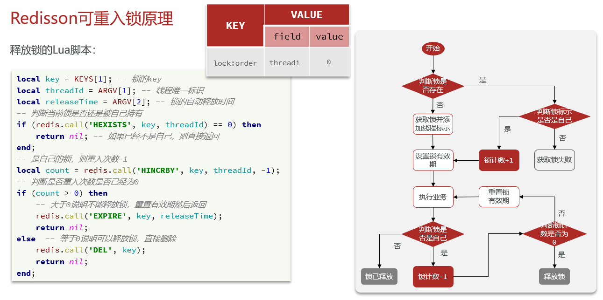
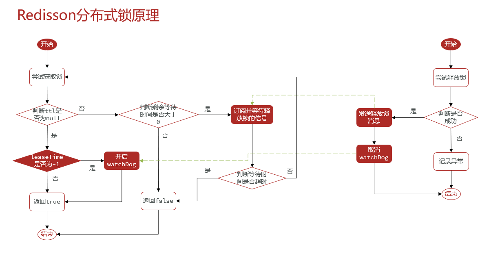
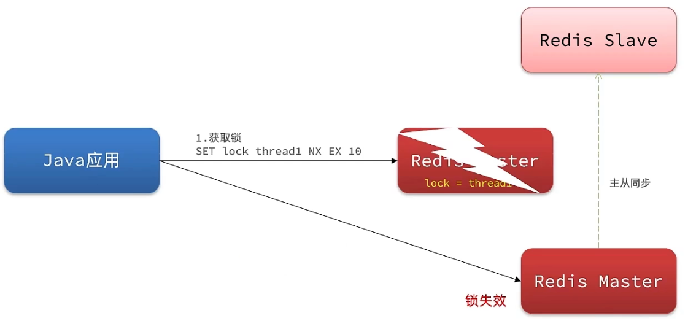
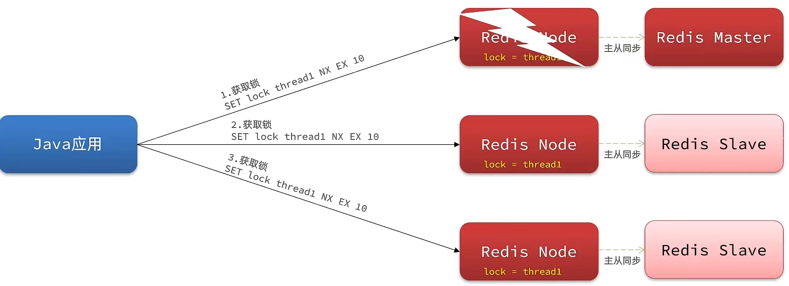

# 5 分布式锁-redission

### 5.1 分布式锁-redission功能介绍

基于setnx实现的分布式锁存在下面的问题：

**不可重入**：重入问题是指 获得锁的线程可以再次进入到相同的锁的代码块中，可重入锁的意义在于防止死锁，比如HashTable这样的代码中，他的方法都是使用synchronized修饰的，假如他在一个方法内，调用另一个方法，那么此时如果是不可重入的，不就死锁了吗？所以可重入锁他的主要意义是防止死锁，我们的synchronized和Lock锁都是可重入的。

**不可重试**：是指目前的分布式只能尝试一次，没有重试机制我们认为合理的情况是：当线程在获得锁失败后，他应该能再次尝试获得锁。

**超时释放：**我们在加锁时增加了过期时间，这样的我们可以防止死锁，但是如果卡顿的时间超长，虽然我们采用了lua表达式防止删锁的时候，误删别人的锁，但是毕竟没有锁住，有安全隐患

**主从一致性：** 如果Redis提供了主从集群，当我们向集群写数据时，主机需要异步的将数据同步给从机，而万一在同步过去之前，主机宕机了，就会出现死锁问题。

那么什么是Redission呢

Redisson是一个在Redis的基础上实现的Java驻内存数据网格（In-Memory Data Grid）。它不仅提供了一系列的分布式的Java常用对象，还提供了许多分布式服务，其中就包含了各种分布式锁的实现。

Redission提供了分布式锁的多种多样的功能

- 可重入锁
- 公平锁
- 联锁
- 红锁
- 读写锁
- 信号量
- 可过期性信号量
- 闭锁

### 5.2 分布式锁-Redission快速入门

引入依赖：

```java
<dependency>
	<groupId>org.redisson</groupId>
	<artifactId>redisson</artifactId>
	<version>3.13.6</version>
</dependency>
```

配置Redisson客户端：

```java
@Configuration
public class RedissonConfig {

    @Bean
    public RedissonClient redissonClient(){
        // 配置
        Config config = new Config();
        // 添加redis地址，这里添加了单点的地址，也可以使用config.useClusterServers()添加集群地址 
        config.useSingleServer().setAddress("redis://192.168.150.101:6379")
            .setPassword("123321");
        // 创建RedissonClient对象
        return Redisson.create(config);
    }
}
```

如何使用Redission的分布式锁

```java
@Resource
private RedissionClient redissonClient;

@Test
void testRedisson() throws Exception{
    //获取锁(可重入)，指定锁的名称
    RLock lock = redissonClient.getLock("anyLock");
    //尝试获取锁，参数分别是：获取锁的最大等待时间(期间会重试)，锁自动释放时间，时间单位
    boolean isLock = lock.tryLock(1,10,TimeUnit.SECONDS);
    //判断获取锁成功
    if(isLock){
        try{
            System.out.println("执行业务");          
        }finally{
            //释放锁
            lock.unlock();
        }        
    }    
}
```

在 VoucherOrderServiceImpl注入RedissonClient

```java
@Resource
private RedissonClient redissonClient;

@Override
public Result seckillVoucher(Long voucherId) {
        // 1.查询优惠券
        SeckillVoucher voucher = seckillVoucherService.getById(voucherId);
        // 2.判断秒杀是否开始
        if (voucher.getBeginTime().isAfter(LocalDateTime.now())) {
            // 尚未开始
            return Result.fail("秒杀尚未开始！");
        }
        // 3.判断秒杀是否已经结束
        if (voucher.getEndTime().isBefore(LocalDateTime.now())) {
            // 尚未开始
            return Result.fail("秒杀已经结束！");
        }
        // 4.判断库存是否充足
        if (voucher.getStock() < 1) {
            // 库存不足
            return Result.fail("库存不足！");
        }
        Long userId = UserHolder.getUser().getId();
        //创建锁对象 这个代码不用了，因为我们现在要使用分布式锁
        //SimpleRedisLock lock = new SimpleRedisLock("order:" + userId, stringRedisTemplate);
        RLock lock = redissonClient.getLock("lock:order:" + userId);
        //获取锁对象
        boolean isLock = lock.tryLock();
       
		//加锁失败
        if (!isLock) {
            return Result.fail("不允许重复下单");
        }
        try {
            //获取代理对象(事务)
            IVoucherOrderService proxy = (IVoucherOrderService) AopContext.currentProxy();
            return proxy.createVoucherOrder(voucherId);
        } finally {
            //释放锁
            lock.unlock();
        }
 }
```

### 5.3 分布式锁-redission可重入锁原理

在Lock锁中，他是借助于底层的一个voaltile的一个state变量来记录重入的状态的，比如当前没有人持有这把锁，那么state=0，假如有人持有这把锁，那么state=1，如果持有这把锁的人再次持有这把锁，那么state就会+1 ，如果是对于synchronized而言，他在c语言代码中会有一个count，原理和state类似，也是重入一次就加一，释放一次就-1 ，直到减少成0 时，表示当前这把锁没有被人持有。  

在redission中，我们的也支持支持可重入锁。







**获取锁的lua脚本**

```java
                "if (redis.call('exists', KEYS[1]) == 0) then " +
                        "redis.call('hincrby', KEYS[1], ARGV[2], 1); " +
                        "redis.call('pexpire', KEYS[1], ARGV[1]); " +
                        "return nil; " +
                        "end; " +
                        "if (redis.call('hexists', KEYS[1], ARGV[2]) == 1) then " +
                        "redis.call('hincrby', KEYS[1], ARGV[2], 1); " +
                        "redis.call('pexpire', KEYS[1], ARGV[1]); " +
                        "return nil; " +
                        "end; " +
                        "return redis.call('pttl', KEYS[1]);",
```

在分布式锁中，他采用hash结构用来存储锁，其中大key表示表示这把锁是否存在，用小key表示当前这把锁被哪个线程持有，所以接下来我们一起分析一下当前的这个lua表达式。

这个地方一共有3个参数：

KEYS[1]：锁名称

ARGV[1]：锁失效时间

ARGV[2]：锁的小key（id + ":" + threadId）

exists: 判断数据是否存在 ，也就是判断是锁是否存在，如果==0，就表示当前这把锁不存在。

```sh
redis.call('hset', KEYS[1], ARGV[2], 1);
```

此时他就开始往redis里边去写数据 ，写成一个hash结构。

```sh
Lock{
	id + ":" + threadId :  1
}
```

如果当前这把锁存在，则第一个条件不满足，再进行下边的判断。

```sh
redis.call('hexists', KEYS[1], ARGV[2]) == 1
```

此时需要通过大key+小key判断当前这把锁是否是属于自己的，如果是自己的，则将当前这个锁的value进行+1

```sh
redis.call('hincrby', KEYS[1], ARGV[2], 1)
```

然后再对其设置过期时间，如果以上两个条件都不满足，则表示当前这把锁抢锁失败，最后返回pttl，即为当前这把锁的失效时间。

```sh
redis.call('pexpire', KEYS[1], ARGV[1]); 
```

如果小伙帮们看了前边的源码， 你会发现他会去判断当前这个方法的返回值是否为null，如果是null，则对应则前两个if对应的条件，抢锁成功，退出抢锁逻辑，如果返回的不是null，抢锁失败，即走了第三个分支，在源码处会进行while(true)的自旋抢锁。

**释放锁的lua脚本**

```java
"if (redis.call('hexists', KEYS[1], ARGV[3]) == 0) then " +
    "return nil;" +
    "end; " +
    "local counter = redis.call('hincrby', KEYS[1], ARGV[3], -1); " +
    "if (counter > 0) then " +
    "redis.call('pexpire', KEYS[1], ARGV[2]); " +
    "return 0; " +
    "else " +
    "redis.call('del', KEYS[1]); " +
    "redis.call('publish', KEYS[2], ARGV[1]); " +
    "return 1; " +
    "end; " +
    "return nil;",
```

### 5.4 分布式锁-redission锁重试和WatchDog机制

**获取锁的方法**

```java
    boolean tryLock(long waitTime, long leaseTime, TimeUnit unit) throws InterruptedException;
```

**waitTime**：获取锁的最大等待时间，在第一次获取锁失败之后不会立即返回，而是在等待时间内不断的尝试获取锁，直至等待时间结束才返回false。

**leaseTime**：锁自动释放的时间

该下放方法查看源码：

```java
	boolean isLock = lock.tryLock(1L, TimeUnit.SECONDS);
```

接口：

```java
    boolean tryLock(long time, TimeUnit unit) throws InterruptedException;
```

实现类选择RedissionLock：leaseTime没有传值的话，默认是-1

```java
    @Override
    public boolean tryLock(long waitTime, TimeUnit unit) throws InterruptedException {
        return tryLock(waitTime, -1, unit);
    }
```

进入tryLock()方法

```java
@Override
    public boolean tryLock(long waitTime, long leaseTime, TimeUnit unit) throws InterruptedException {
        long time = unit.toMillis(waitTime);
        long current = System.currentTimeMillis();
        long threadId = Thread.currentThread().getId();
        // 尝试获取锁，成功返回null，失败返回锁剩余时间
        Long ttl = tryAcquire(waitTime, leaseTime, unit, threadId);
        // lock acquired
        if (ttl == null) {
            return true;
        }
        // 计算剩余等待时间
        time -= System.currentTimeMillis() - current;
        if (time <= 0) {
            // 无剩余时间，获取锁失败
            acquireFailed(waitTime, unit, threadId);
            return false;
        }
        
        current = System.currentTimeMillis();
        // 订阅释放锁的消息，释放锁的脚本中有一条publish的语句就是在发送释放锁的消息，
        RFuture<RedissonLockEntry> subscribeFuture = subscribe(threadId);
        // 在剩余等待时间内等待释放锁的消息，如果没有等到消息，取消订阅，获取锁失败
        if (!subscribeFuture.await(time, TimeUnit.MILLISECONDS)) {
            if (!subscribeFuture.cancel(false)) {
                subscribeFuture.onComplete((res, e) -> {
                    if (e == null) {
                        unsubscribe(subscribeFuture, threadId);
                    }
                });
            }
            acquireFailed(waitTime, unit, threadId);
            return false;
        }

        try {
            // 计算剩余等待时间
            time -= System.currentTimeMillis() - current;
            if (time <= 0) {
                acquireFailed(waitTime, unit, threadId);
                return false;
            }
        
            while (true) {
                long currentTime = System.currentTimeMillis();
                // 第一次尝试重新获取锁
                ttl = tryAcquire(waitTime, leaseTime, unit, threadId);
                // lock acquired
                if (ttl == null) {
                    return true;
                }
				// 计算剩余等待时间
                time -= System.currentTimeMillis() - currentTime;
                if (time <= 0) {
                    acquireFailed(waitTime, unit, threadId);
                    return false;
                }

                // waiting for message
                currentTime = System.currentTimeMillis();
                if (ttl >= 0 && ttl < time) {
                    // 这里采用信号量的方式，等待锁释放的消息，ttl为等待时间
                    subscribeFuture.getNow().getLatch().tryAcquire(ttl, TimeUnit.MILLISECONDS);
                } else {
                    subscribeFuture.getNow().getLatch().tryAcquire(time, TimeUnit.MILLISECONDS);
                }

                time -= System.currentTimeMillis() - currentTime;
                if (time <= 0) {
                    acquireFailed(waitTime, unit, threadId);
                    return false;
                }
            }
        } finally {
            // 取消订阅
            unsubscribe(subscribeFuture, threadId);
        }
//        return get(tryLockAsync(waitTime, leaseTime, unit));
    }
```

进入tryAcquire()方法

```java
    private Long tryAcquire(long waitTime, long leaseTime, TimeUnit unit, long threadId) {
        return get(tryAcquireAsync(waitTime, leaseTime, unit, threadId));
    }

    private <T> RFuture<Long> tryAcquireAsync(long waitTime, long leaseTime, TimeUnit unit, long threadId) {
        if (leaseTime != -1) {
            // 如果leaseTime有值，进入这个方法执行脚本获取锁，获取锁成功返回null,失败返回锁剩余时间
            return tryLockInnerAsync(waitTime, leaseTime, unit, threadId, RedisCommands.EVAL_LONG);
        }
        // 如果leaseTime无值，默认-1，进入这个方法执行脚本获取锁，获取锁成功返回null,失败返回锁剩余时间
        RFuture<Long> ttlRemainingFuture = tryLockInnerAsync(waitTime,
                                                // 如果没有设置超时时间，会默认赋值看门狗的超时时间30*1000
                                                commandExecutor.getConnectionManager().getCfg().getLockWatchdogTimeout(),
                                                TimeUnit.MILLISECONDS, threadId, RedisCommands.EVAL_LONG);
        // 当ttlRemainingFuture完成以后执行，ttlRemaining执行脚本的返回值
        ttlRemainingFuture.onComplete((ttlRemaining, e) -> {
            if (e != null) {
                return;
            }

            // 获取锁成功
            if (ttlRemaining == null) {
                // 定时任务更新锁的释放时间
                scheduleExpirationRenewal(threadId);
            }
        });
        return ttlRemainingFuture;
    }
```

进入scheduleExpirationRenewal()方法

```java
    private void scheduleExpirationRenewal(long threadId) {
        ExpirationEntry entry = new ExpirationEntry();
        // 将当前锁放到一个静态的ConcurrentMap中
        ExpirationEntry oldEntry = EXPIRATION_RENEWAL_MAP.putIfAbsent(getEntryName(), entry);
        if (oldEntry != null) {
            oldEntry.addThreadId(threadId);
        } else {
            entry.addThreadId(threadId);
            // 第一次进来更新有效期
            renewExpiration();
        }
    }
```

进入 renewExpiration()方法

```java
    private void renewExpiration() {
        ExpirationEntry ee = EXPIRATION_RENEWAL_MAP.get(getEntryName());
        if (ee == null) {
            return;
        }
        // 定时任务：延时一定时间后执行定时任务
        // 要执行的任务：new TimerTask()，
        // 延时时间：internalLockLeaseTime / 3 = 看门狗时间/3=10秒 
        Timeout task = commandExecutor.getConnectionManager().newTimeout(new TimerTask() {
            @Override
            public void run(Timeout timeout) throws Exception {
                ExpirationEntry ent = EXPIRATION_RENEWAL_MAP.get(getEntryName());
                if (ent == null) {
                    return;
                }
                Long threadId = ent.getFirstThreadId();
                if (threadId == null) {
                    return;
                }
                // 执行脚本刷新锁的自动释放时间
                RFuture<Boolean> future = renewExpirationAsync(threadId);
                future.onComplete((res, e) -> {
                    if (e != null) {
                        log.error("Can't update lock " + getName() + " expiration", e);
                        return;
                    }
                    
                    if (res) {
                        // 递归更新锁的剩余时间，直到释放锁
                        renewExpiration();
                    }
                });
            }
        }, internalLockLeaseTime / 3, TimeUnit.MILLISECONDS);
        
        ee.setTimeout(task);
    }
```

进入renewExpirationAsync()方法：判断锁是否存在，更新锁剩余时间

```java
    protected RFuture<Boolean> renewExpirationAsync(long threadId) {
        return evalWriteAsync(getName(), LongCodec.INSTANCE, RedisCommands.EVAL_BOOLEAN,
                "if (redis.call('hexists', KEYS[1], ARGV[2]) == 1) then " +
                        "redis.call('pexpire', KEYS[1], ARGV[1]); " +
                        "return 1; " +
                        "end; " +
                        "return 0;",
                Collections.singletonList(getName()),
                internalLockLeaseTime, getLockName(threadId));
    }
```

释放锁方法

```java
lock.unlock();
```

接口：

```java
    void unlock();
```

实现类选择RedissionLock：

```java
    @Override
    public void unlock() {
        try {
            // 释放锁
            get(unlockAsync(Thread.currentThread().getId()));
        } catch (RedisException e) {
            if (e.getCause() instanceof IllegalMonitorStateException) {
                throw (IllegalMonitorStateException) e.getCause();
            } else {
                throw e;
            }
        }
    }

    @Override
    public RFuture<Void> unlockAsync(long threadId) {
        RPromise<Void> result = new RedissonPromise<Void>();
        RFuture<Boolean> future = unlockInnerAsync(threadId);

        future.onComplete((opStatus, e) -> {
            //取消更新锁的到期时间
            cancelExpirationRenewal(threadId);
			·····
        });

        return result;
    }

    void cancelExpirationRenewal(Long threadId) {
        // 取出锁的定时任务
        ExpirationEntry task = EXPIRATION_RENEWAL_MAP.get(getEntryName());
        if (task == null) {
            return;
        }
        
        if (threadId != null) {
            // 移除锁的id
            task.removeThreadId(threadId);
        }

        if (threadId == null || task.hasNoThreads()) {
            Timeout timeout = task.getTimeout();
            if (timeout != null) {
                // 取消定时任务
                timeout.cancel();
            }
            // 删除定时任务
            EXPIRATION_RENEWAL_MAP.remove(getEntryName());
        }
    }
```



**Redisson分布式锁原理：**

- **可重入**：利用hash结构记录线程id和重入次数
- **可重试**：利用信号量和PubSub功能实现等待、唤醒，获取锁失败的重试机制
- **超时续约**：利用watchDog，每隔一段时间（releaseTime / 3），重置超时时间

### 5.5 分布式锁-redission锁的MutiLock原理

为了提高redis的可用性，我们会搭建集群或者主从，现在以主从为例

此时我们去写命令，写在主机上， 主机会将数据同步给从机，但是假设在主机还没有来得及把数据写入到从机去的时候，此时主机宕机，哨兵会发现主机宕机，并且选举一个slave变成master，而此时新的master中实际上并没有锁信息，此时锁信息就已经丢掉了。



为了解决这个问题，redission提出来了MutiLock锁，使用这把锁咱们就不使用主从了，每个节点的地位都是一样的， 这把锁加锁的逻辑需要写入到每一个主丛节点上，只有所有的服务器都写入成功，此时才是加锁成功，假设现在某个节点挂了，那么他去获得锁的时候，只要有一个节点拿不到，都不能算是加锁成功，就保证了加锁的可靠性。



RedissonMultiLock的tryLock方法

```java
    @Override
    public boolean tryLock(long waitTime, TimeUnit unit) throws InterruptedException {
        return tryLock(waitTime, -1, unit);
    }

    @Override
    public boolean tryLock(long waitTime, long leaseTime, TimeUnit unit) throws InterruptedException {
        long newLeaseTime = -1;
        if (leaseTime != -1) {
            if (waitTime == -1) {
                // 没设置waitTime，只获取一次锁，
                newLeaseTime = unit.toMillis(leaseTime);
            } else {
                // 多次获取锁，释放时间是等待时间*2
                newLeaseTime = unit.toMillis(waitTime)*2;
            }
        }
        
        long time = System.currentTimeMillis();
        long remainTime = -1;
        if (waitTime != -1) {
            remainTime = unit.toMillis(waitTime);
        }
        // lockWaitTime = remainTime
        long lockWaitTime = calcLockWaitTime(remainTime);
        // 锁失败的限制是0
        int failedLocksLimit = failedLocksLimit();
        // 获取锁成功的集合
        List<RLock> acquiredLocks = new ArrayList<>(locks.size());
        // 遍历redis客户端获取锁
        for (ListIterator<RLock> iterator = locks.listIterator(); iterator.hasNext();) {
            RLock lock = iterator.next();
            boolean lockAcquired;
            try {
                if (waitTime == -1 && leaseTime == -1) {
                    // 无等待时间，只获取一次锁
                    lockAcquired = lock.tryLock();
                } else {
                    // 多次获取锁
                    long awaitTime = Math.min(lockWaitTime, remainTime);
                    lockAcquired = lock.tryLock(awaitTime, newLeaseTime, TimeUnit.MILLISECONDS);
                }
            } catch (RedisResponseTimeoutException e) {
                unlockInner(Arrays.asList(lock));
                lockAcquired = false;
            } catch (Exception e) {
                lockAcquired = false;
            }
            
            if (lockAcquired) {
                // 成功之后把锁放入集合
                acquiredLocks.add(lock);
            } else {
                // 获取锁失败
                if (locks.size() - acquiredLocks.size() == failedLocksLimit()) {
                    // redis客户端的数量 - 获取成功的锁的数量 = 0，跳出循环
                    break;
                }

                if (failedLocksLimit == 0) {
                    // 释放获得的锁
                    unlockInner(acquiredLocks);
                    if (waitTime == -1) {
                        // 无等待时间，直接返回获取锁失败
                        return false;
                    }
                    failedLocksLimit = failedLocksLimit();
                    // 清空集合，重新遍历获取锁
                    acquiredLocks.clear();
                    // reset iterator
                    while (iterator.hasPrevious()) {
                        iterator.previous();
                    }
                } else {
                    failedLocksLimit--;
                }
            }
            
            if (remainTime != -1) {
                remainTime -= System.currentTimeMillis() - time;
                time = System.currentTimeMillis();
                if (remainTime <= 0) {
                    // 如果获取锁的时间超过了等待的时间，那么会释放已经成功获取的锁
                    unlockInner(acquiredLocks);
                    return false;
                }
            }
        }
		// 指定了锁的释放时间，在获取了所有的锁之后，重置所有锁的释放时间
        if (leaseTime != -1) {
            List<RFuture<Boolean>> futures = new ArrayList<>(acquiredLocks.size());
            for (RLock rLock : acquiredLocks) {
                RFuture<Boolean> future = ((RedissonLock) rLock).expireAsync(unit.toMillis(leaseTime), TimeUnit.MILLISECONDS);
                futures.add(future);
            }
            
            for (RFuture<Boolean> rFuture : futures) {
                rFuture.syncUninterruptibly();
            }
        }
        
        return true;
    }
```

**总结**：

不可重入**Redis**分布式锁：

- 原理：利用setnx的互斥性；利用ex避免死锁；释放锁时判断线程标示
- 缺陷：不可重入、无法重试、锁超时失效

可重入的**Redis**分布式锁：

- 原理：利用hash结构，记录线程标示和重入次数；利用watchDog延续锁时间；利用信号量控制锁重试等待
- 缺陷：redis宕机引起锁失效问题

**RedissonmultiLock**：

- 原理：多个独立的Redis节点，必须在所有节点都获取重入锁，才算获取锁成功
- 缺陷：运维成本高、实现复杂