# 分布式缓存

基于Redis集群解决单机Redis存在的问题

**单机的Redis存在四大问题**：

- 数据丢失问题：实现Redis数据持久化
- 并发能力问题：搭建主从集群，实现读写分离
- 故障恢复问题：利用Redis哨兵，实现健康检测和自动恢复
- 存储能力问题：搭建分片集群，利用插槽机制实现动态扩容

## 1 Redis持久化

Redis有两种持久化方案：

- RDB持久化
- AOF持久化

### 1.1 RDB持久化

RDB全称Redis Database Backup file（Redis数据备份文件），也被叫做Redis数据快照。简单来说就是把内存中的所有数据都记录到磁盘中。当Redis实例故障重启后，从磁盘读取快照文件，恢复数据。快照文件称为RDB文件，默认是保存在当前运行目录。

#### 1.1.1 执行时机

RDB持久化在四种情况下会执行：

- 执行save命令
- 执行bgsave命令
- Redis停机时
- 触发RDB条件时

**1）save命令**

执行下面的命令，可以立即执行一次RDB：

```sh
[root@192 ~]# redis-cli
127.0.0.1:6379> save	#由Redis主进程来执行RDB，会阻塞所有命令
OK
```

save命令会导致主进程执行RDB，这个过程中其它所有命令都会被阻塞。只有在数据迁移时可能用到。

**2）bgsave命令**

下面的命令可以异步执行RDB：

```sh
127.0.0.1:6379> bgsave		#开启子进程执行RDB，避免主进程受到影响
Background saving started
```

个命令执行后会开启独立进程完成RDB，主进程可以持续处理用户请求，不受影响。

**3）停机时**

Redis停机时会执行一次save命令，实现RDB持久化。

**4）触发RDB条件**

Redis内部有触发RDB的机制，可以在redis.conf文件中找到，格式如下：

```properties
# 900秒内，如果至少有1个key被修改，则执行bgsave ， 如果是save "" 则表示禁用RDB
save 900 1  
save 300 10  
save 60 10000 
```

RDB的其它配置也可以在redis.conf文件中设置：

```properties
# 是否压缩 ,建议不开启，压缩也会消耗cpu，磁盘的话不值钱
rdbcompression yes

# RDB文件名称
dbfilename dump.rdb  

# 文件保存的路径目录
dir ./ 
```


#### 1.1.2 RDB原理

bgsave开始时会fork主进程得到子进程，子进程共享主进程的内存数据。完成fork后读取内存数据并写入 RDB 文件。

**子进程fork主进程的过程是阻塞的**

fork的过程：

linux系统中所有的进程都没有办法直接操作物理内存，而是有操作系统给每个进程分配一个虚拟的内存，主进程只能操作虚拟内存，操作系统会维护一个虚拟内存与物理内存之间的映射关系表，这个表称为页表。所以主进程操作虚拟内存，而虚拟内存基于页表的映射关系映射到真正的物理内存，实现对物理内存数据的读写。

执行fork的时候，会先创建一个子进程，fork的不是把内存数据做拷贝，仅仅是把页表做拷贝，也就是把内存的映射关系拷贝给子进程，因为子进程与主进程了有了相同的内存映射关系，子进程在操作自己的虚拟内存的时候，最终一定能够映射到与主进程相同的物理内存区域，这样就实现了主进程与子进程内存空间的共享。这样就无需拷贝内存数据，直接实现了数据共享，这个过程是非常快的，阻塞的时间也就非常短了。

这样子进程就能读取内存数据，将数据写入到新的RDB文件中，写完之后替换旧的RDB文件。

在fork的过程中，会把共享内存标记为只读模式，任何进程只能读数据。当主线程要进行写操作的时候，会将数据从共享内存中拷贝一份出来进行写操作，后续对该数据的读操作也在拷贝数据上进行。

fork采用的是copy-on-write技术：

- 当主进程执行读操作时，访问共享内存；
- 当主进程执行写操作时，则会拷贝一份数据，执行写操作。


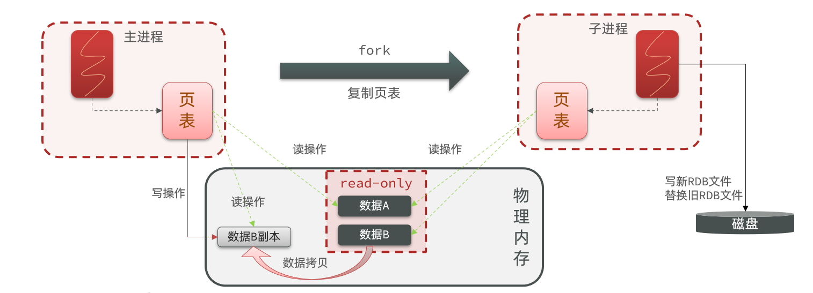

#### 1.1.3 小结

RDB方式bgsave的基本流程？

- fork主进程得到一个子进程，共享内存空间
- 子进程读取内存数据并写入新的RDB文件
- 用新RDB文件替换旧的RDB文件

RDB会在什么时候执行？save 60 1000代表什么含义？

- 默认是服务停止时
- 代表60秒内至少执行1000次修改则触发RDB

RDB的缺点？

- RDB执行间隔时间长，两次RDB之间写入数据有丢失的风险
- fork子进程、压缩、写出RDB文件都比较耗时

### 1.2 AOF持久化

#### 1.2.1 AOF原理

AOF全称为Append Only File（追加文件）。Redis处理的每一个写命令都会记录在AOF文件，可以看做是命令日志文件。

#### 1.2.2 AOF配置

AOF默认是关闭的，需要修改redis.conf配置文件来开启AOF：

```properties
# 是否开启AOF功能，默认是no
appendonly yes
# AOF文件的名称
appendfilename "appendonly.aof"
```

AOF的命令记录的频率也可以通过redis.conf文件来配：

```properties
# 表示每执行一次写命令，立即记录到AOF文件
appendfsync always 
# 写命令执行完先放入AOF缓冲区，然后表示每隔1秒将缓冲区数据写到AOF文件，是默认方案
appendfsync everysec 
# 写命令执行完先放入AOF缓冲区，由操作系统决定何时将缓冲区内容写回磁盘
appendfsync no
```

| **配置项** | **刷盘时机** | **优点**               | **缺点**                     |
| ---------- | ------------ | ---------------------- | ---------------------------- |
| Always     | 同步刷盘     | 可靠性高，几乎不丢数据 | 性能影响大                   |
| everysec   | 每秒刷盘     | 性能适中               | 最多丢失1秒数据              |
| no         | 操作系统控制 | 性能最好               | 可靠性较差，可能丢失大量数据 |

#### 1.2.3 AOF文件重写

因为是记录命令，AOF文件会比RDB文件大的多。而且AOF会记录对同一个key的多次写操作，但只有最后一次写操作才有意义。通过执行bgrewriteaof命令，可以让AOF文件执行重写功能，用最少的命令达到相同效果。


如图，AOF原本有三个命令，但是`set num 123 和 set num 666`都是对num的操作，第二次会覆盖第一次的值，因此第一个命令记录下来没有意义。

所以重写命令后，AOF文件内容就是：`mset name jack num 666`


Redis也会在触发阈值时自动去重写AOF文件。阈值也可以在redis.conf中配置：

```properties
# AOF文件比上次文件 增长超过多少百分比则触发重写
auto-aof-rewrite-percentage 100
# AOF文件体积最小多大以上才触发重写 
auto-aof-rewrite-min-size 64mb 
```

### 1.3 RDB与AOF对比

RDB和AOF各有自己的优缺点，如果对数据安全性要求较高，在实际开发中往往会**结合**两者来使用。

|                | **RDB**                                      | **AOF**                                                  |
| -------------- | -------------------------------------------- | -------------------------------------------------------- |
| 持久化方式     | 定时对整个内存做快照                         | 记录每一次执行的命令                                     |
| 数据完整性     | 不完整，两次备份之间会丢失                   | 相对完整，取决于刷盘策略                                 |
| 文件大小       | 会有压缩，文件体积小                         | 记录命令，文件体积很大                                   |
| 宕机恢复速度   | 很快                                         | 慢                                                       |
| 数据恢复优先级 | 低，因为数据完整性不如AOF                    | 高，因为数据完整性更高                                   |
| 系统资源占用   | 高，大量CPU和内存消耗                        | 低，主要是磁盘IO资源  但AOF重写时会占用大量CPU和内存资源 |
| 使用场景       | 可以容忍数分钟的数据丢失，追求更快的启动速度 | 对数据安全性要求较高常见                                 |

## 2 Redis主从

### 2.1 搭建主从架构

#### 2.1.1 集群结构

我们搭建的主从集群结构如图：

单节点Redis的并发能力是有上限的，要进一步提高Redis的并发能力，就需要搭建主从集群，实现读写分离。

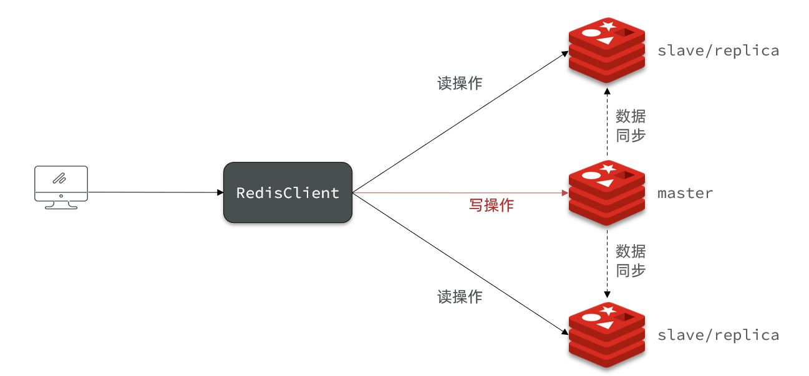

共包含三个节点，一个主节点，两个从节点。

这里我们会在同一台虚拟机中开启3个redis实例，模拟主从集群，信息如下：

|       IP       | PORT |  角色  |
| :------------: | :--: | :----: |
| 192.168.11.132 | 7001 | master |
| 192.168.11.132 | 7002 | slave  |
| 192.168.11.132 | 7003 | slave  |

#### 2.1.2 准备实例和配置

要在同一台虚拟机开启3个实例，必须准备三份不同的配置文件和目录，配置文件所在目录也就是工作目录。

1）创建目录

我们创建三个文件夹，名字分别叫7001、7002、7003：

```sh
# 进入/tmp目录
cd /tmp
# 创建目录
mkdir 7001 7002 7003
```

```sh
[root@192 tmp]# pwd
/tmp
[root@192 tmp]# ll
总用量 16
drwxr-xr-x. 2 root root 4096 11月  9 21:29 7001
drwxr-xr-x. 2 root root 4096 11月  9 21:29 7002
drwxr-xr-x. 2 root root 4096 11月  9 21:29 7003
drwxrwxr-x. 7 root root 4096 10月 29 23:59 redis-6.2.6
```

2）恢复原始配置

修改redis-6.2.4/redis.conf文件，将其中的持久化模式改为默认的RDB模式，AOF保持关闭状态。

```properties
# 开启RDB
# save ""
save 3600 1
save 300 100
save 60 10000

# 关闭AOF
appendonly no
```

3）拷贝配置文件到每个实例目录

然后将redis-6.2.4/redis.conf文件拷贝到三个目录中（在/tmp目录执行下列命令）：

```sh
# 方式一：逐个拷贝
cp redis-6.2.4/redis.conf 7001
cp redis-6.2.4/redis.conf 7002
cp redis-6.2.4/redis.conf 7003

# 方式二：管道组合命令，一键拷贝
echo 7001 7002 7003 | xargs -t -n 1 cp redis-6.2.4/redis.conf
```

4）修改每个实例的端口、工作目录

修改每个文件夹内的配置文件，将端口分别修改为7001、7002、7003，将rdb文件保存位置都修改为自己所在目录（在/tmp目录执行下列命令）：

```sh
sed -i -e 's/6379/7001/g' -e 's/dir .\//dir \/tmp\/7001\//g' 7001/redis.conf
sed -i -e 's/6379/7002/g' -e 's/dir .\//dir \/tmp\/7002\//g' 7002/redis.conf
sed -i -e 's/6379/7003/g' -e 's/dir .\//dir \/tmp\/7003\//g' 7003/redis.conf
```

5）修改每个实例的声明IP

虚拟机本身有多个IP，为了避免将来混乱，我们需要在redis.conf文件中指定每一个实例的绑定ip信息，格式如下：

```properties
# redis实例的声明 IP
replica-announce-ip 192.168.11.132
```

每个目录都要改，我们一键完成修改（在/tmp目录执行下列命令）：

```sh
# 逐一执行
sed -i '1a replica-announce-ip 192.168.11.132' 7001/redis.conf
sed -i '1a replica-announce-ip 192.168.11.132' 7002/redis.conf
sed -i '1a replica-announce-ip 192.168.11.132' 7003/redis.conf

# 或者一键修改
printf '%s\n' 7001 7002 7003 | xargs -I{} -t sed -i '1a replica-announce-ip 192.168.11.132' {}/redis.conf
```

#### 2.1.3 启动

为了方便查看日志，我们打开3个ssh窗口，分别启动3个redis实例，启动命令：

```sh
# 第1个
redis-server 7001/redis.conf
# 第2个
redis-server 7002/redis.conf
# 第3个
redis-server 7003/redis.conf
```

启动后如果要一键停止，可以运行下面命令：

```sh
printf '%s\n' 7001 7002 7003 | xargs -I{} -t redis-cli -p {} shutdown
```

#### 2.1.4 开启主从关系

现在三个实例还没有任何关系，要配置主从可以使用replicaof 或者slaveof（5.0以前）命令。

有临时和永久两种模式：

- 修改配置文件（永久生效）

  - 在redis.conf中添加一行配置：```slaveof <masterip> <masterport>```

- 使用redis-cli客户端连接到redis服务，执行slaveof命令（重启后失效）：

  ```sh
  slaveof <masterip> <masterport>
  ```


<strong><font color='red'>注意</font></strong>：在5.0以后新增命令replicaof，与salveof效果一致。

这里我们为了演示方便，使用方式二。

通过redis-cli命令连接7002，执行下面命令：

```sh
# 连接 7002
redis-cli -p 7002
# 执行slaveof
slaveof 192.168.11.132 7001
```

通过redis-cli命令连接7003，执行下面命令：

```sh
# 连接 7003
redis-cli -p 7003
# 执行slaveof
slaveof 192.168.11.132 7001
```

然后连接 7001节点，查看集群状态：

```sh
# 连接 7001
redis-cli -p 7001
# 查看状态
info replication
```

结果：

```sh
127.0.0.1:7001> info replication
# Replication
role:master
connected_slaves:2
slave0:ip=192.168.11.132,port=7002,state=online,offset=70,lag=0
slave1:ip=192.168.11.132,port=7003,state=online,offset=70,lag=0
master_failover_state:no-failover
master_replid:a8565738499963a18a9270c6b25c38cf3db2d3f4
master_replid2:0000000000000000000000000000000000000000
master_repl_offset:70
second_repl_offset:-1
repl_backlog_active:1
repl_backlog_size:1048576
repl_backlog_first_byte_offset:1
repl_backlog_histlen:70
```

#### 2.1.5 测试

执行下列操作以测试：

- 利用redis-cli连接7001，执行```set num 123```

- 利用redis-cli连接7002，执行```get num```，再执行```set num 666```

- 利用redis-cli连接7003，执行```get num```，再执行```set num 888```


可以发现，只有在7001这个master节点上可以执行写操作，7002和7003这两个slave节点只能执行读操作。

```sh
127.0.0.1:7001> set num 123
OK
127.0.0.1:7001>
[root@192 tmp]# redis-cli -p 7002
127.0.0.1:7002> get num
"123"
127.0.0.1:7002> set num 666
(error) READONLY You can't write against a read only replica.
127.0.0.1:7002>
[root@192 tmp]# redis-cli -p 7003
127.0.0.1:7003> get num
"123"
127.0.0.1:7003> set num 888
(error) READONLY You can't write against a read only replica.
```

### 2.2 主从数据同步原理

#### 2.2.1 全量同步

主从第一次建立连接时，会执行**全量同步**，将master节点的所有数据都拷贝给slave节点，流程：

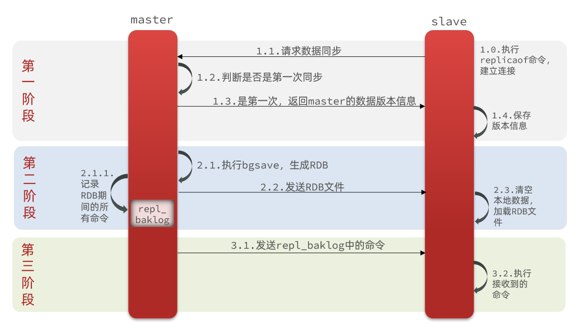

这里有一个问题，master如何得知salve是第一次来连接呢？？

有几个概念，可以作为判断依据：

- **Replication Id**：简称replid，是数据集的标记，id一致则说明是同一数据集。每一个master都有唯一的replid，slave则会继承master节点的replid
- **offset**：偏移量，随着记录在repl_baklog中的数据增多而逐渐增大。slave完成同步时也会记录当前同步的offset。如果slave的offset小于master的offset，说明slave数据落后于master，需要更新。

因此slave做数据同步，必须向master声明自己的replication id 和offset，master才可以判断到底需要同步哪些数据。


因为slave原本也是一个master，有自己的replid和offset，当第一次变成slave，与master建立连接时，发送的replid和offset是自己的replid和offset。

master判断发现slave发送来的replid与自己的不一致，说明这是一个全新的slave，就知道要做全量同步了。

master会将自己的replid和offset都发送给这个slave，slave保存这些信息。以后slave的replid就与master一致了。

因此，**master判断一个节点是否是第一次同步的依据，就是看replid是否一致**。

如图：

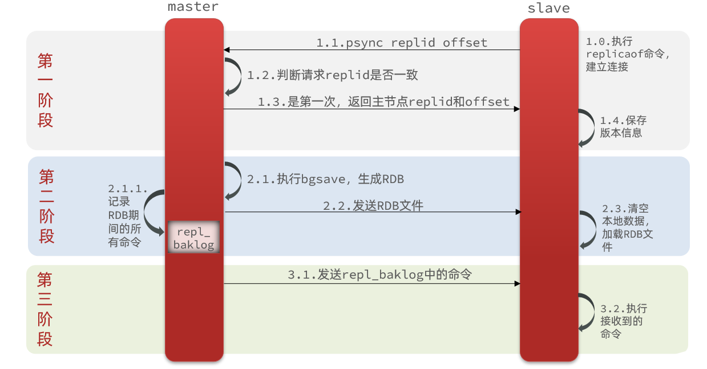

完整流程描述：

- slave节点请求增量同步
- master节点判断replid，发现不一致，拒绝增量同步
- master将完整内存数据生成RDB，发送RDB到slave
- slave清空本地数据，加载master的RDB
- master将RDB期间的命令记录在repl_baklog，并持续将log中的命令发送给slave
- slave执行接收到的命令，保持与master之间的同步

#### 2.2.2 增量同步

全量同步需要先做RDB，然后将RDB文件通过网络传输个slave，成本太高了。因此除了第一次做全量同步，其它大多数时候slave与master都是做**增量同步**。

什么是增量同步？就是只更新slave与master存在差异的部分数据。如图：

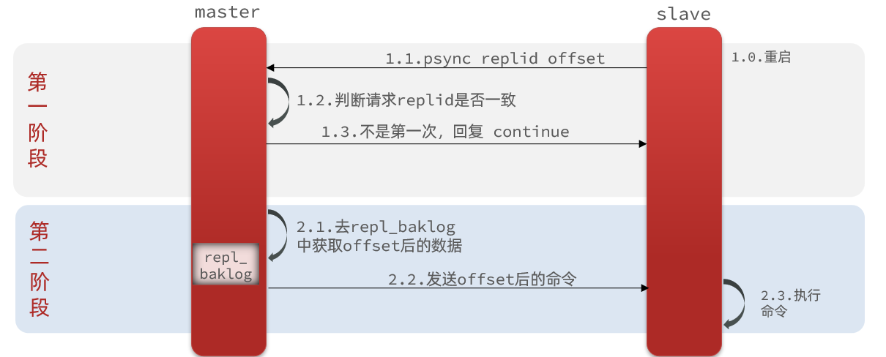

那么master怎么知道slave与自己的数据差异在哪里呢?


#### 2.2.3 repl_backlog原理

master怎么知道slave与自己的数据差异在哪里呢?

这就要说到全量同步时的repl_baklog文件了。

这个文件是一个固定大小的数组，只不过数组是环形，也就是说**角标到达数组末尾后，会再次从0开始读写**，这样数组头部的数据就会被覆盖。

repl_baklog中会记录Redis处理过的命令日志及offset，包括master当前的offset，和slave已经拷贝到的offset：


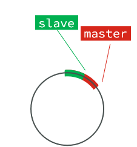


slave与master的offset之间的差异，就是salve需要增量拷贝的数据了。

随着不断有数据写入，master的offset逐渐变大，slave也不断的拷贝，追赶master的offset：

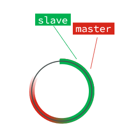

直到数组被填满：

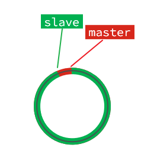

此时，如果有新的数据写入，就会覆盖数组中的旧数据。不过，旧的数据只要是绿色的，说明是已经被同步到slave的数据，即便被覆盖了也没什么影响。因为未同步的仅仅是红色部分。


但是，如果slave出现网络阻塞，导致master的offset远远超过了slave的offset： 

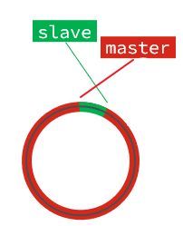

如果master继续写入新数据，其offset就会覆盖旧的数据，直到将slave现在的offset也覆盖：

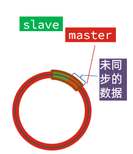 

棕色框中的红色部分，就是尚未同步，但是却已经被覆盖的数据。此时如果slave恢复，需要同步，却发现自己的offset都没有了，无法完成增量同步了。只能做全量同步。

**注意**：repl_baklog大小有上限，写满后会覆盖最早的数据。如果slave断开时间过久，导致尚未备份的数据被覆盖，则无法基于log做增量同步，只能再次全量同步。

### 2.3 主从同步优化

主从同步可以保证主从数据的一致性，非常重要。

可以从以下几个方面来优化Redis主从就集群：

- 在master中配置repl-diskless-sync yes启用无磁盘复制，避免全量同步时的磁盘IO。
- Redis单节点上的内存占用不要太大，减少RDB导致的过多磁盘IO
- 适当提高repl_baklog的大小，发现slave宕机时尽快实现故障恢复，尽可能避免全量同步
- 限制一个master上的slave节点数量，如果实在是太多slave，则可以采用主-从-从链式结构，减少master压力

主从从架构图：

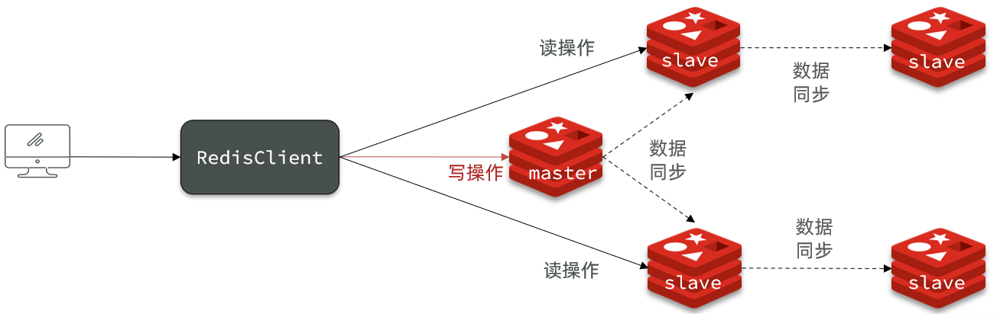

### 2.4 小结

简述全量同步和增量同步区别？

- 全量同步：master将完整内存数据生成RDB，发送RDB到slave。后续命令则记录在repl_baklog，逐个发送给slave。
- 增量同步：slave提交自己的offset到master，master获取repl_baklog中从offset之后的命令给slave

什么时候执行全量同步？

- slave节点第一次连接master节点时
- slave节点断开时间太久，repl_baklog中的offset已经被覆盖时

什么时候执行增量同步？

- slave节点断开又恢复，并且在repl_baklog中能找到offset时

## 3 Redis哨兵

Redis提供了哨兵（Sentinel）机制来实现主从集群的自动故障恢复。

### 3.1 哨兵原理

#### 3.1.1 集群结构和作用

哨兵的结构如图：

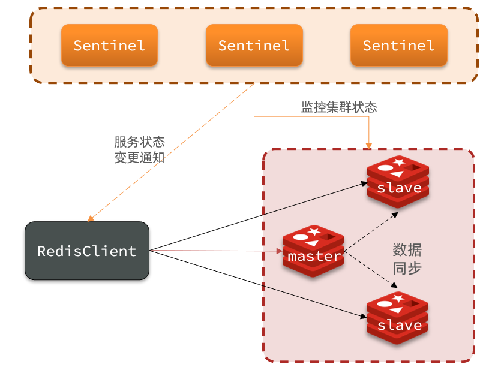

哨兵的作用如下：

- **监控**：Sentinel 会不断检查您的master和slave是否按预期工作
- **自动故障恢复**：如果master故障，Sentinel会将一个slave提升为master。当故障实例恢复后也以新的master为主
- **通知**：Sentinel充当Redis客户端的服务发现来源，当集群发生故障转移时，会将最新信息推送给Redis的客户端

#### 3.1.2 集群监控原理

Sentinel基于心跳机制监测服务状态，每隔1秒向集群的每个实例发送ping命令：

- 主观下线：如果某sentinel节点发现某实例未在规定时间响应，则认为该实例**主观下线**。

- 客观下线：若超过指定数量（quorum）的sentinel都认为该实例主观下线，则该实例**客观下线**。quorum值最好超过Sentinel实例数量的一半。

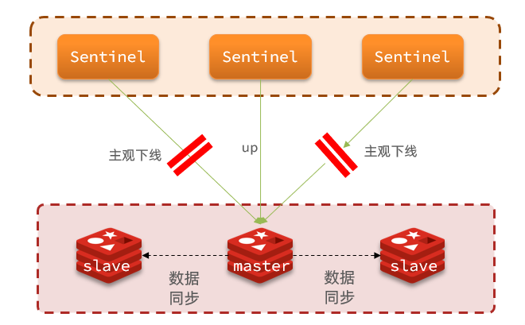


#### 3.1.3 集群故障恢复原理

一旦发现master故障，sentinel需要在salve中选择一个作为新的master，选择依据是这样的：

- 首先会判断slave节点与master节点断开时间长短，如果超过指定值（down-after-milliseconds * 10）则会排除该slave节点
- 然后判断slave节点的slave-priority值，越小优先级越高，如果是0则永不参与选举
- 如果slave-prority一样，则判断slave节点的offset值，越大说明数据越新，优先级越高
- 最后是判断slave节点的运行id大小，越小优先级越高。


当选出一个新的master后，该如何实现切换呢？

流程如下：

- sentinel给备选的slave1节点发送slaveof no one命令，让该节点成为master
- sentinel给所有其它slave发送slaveof 192.168.150.101 7002 命令，让这些slave成为新master的从节点，开始从新的master上同步数据。
- 最后，sentinel将故障节点标记为slave，当故障节点恢复后会自动成为新的master的slave节点


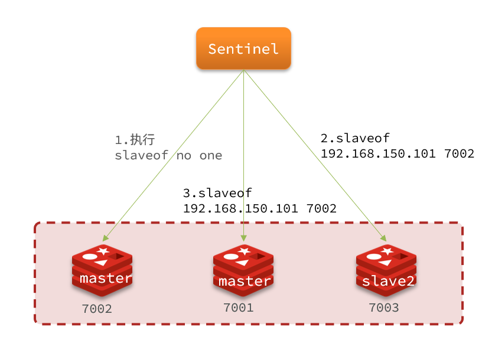

#### 3.1.4 小结

Sentinel的三个作用是什么？

- 监控
- 故障转移
- 通知

Sentinel如何判断一个redis实例是否健康？

- 每隔1秒发送一次ping命令，如果超过一定时间没有相向则认为是主观下线
- 如果大多数sentinel都认为实例主观下线，则判定服务下线

故障转移步骤有哪些？

- 首先选定一个slave作为新的master，执行slaveof no one
- 然后让所有节点都执行slaveof 新master
- 修改故障节点配置，添加slaveof 新master

### 3.2 搭建哨兵集群

#### 3.2.1 集群结构

这里我们搭建一个三节点形成的Sentinel集群，来监管之前的Redis主从集群。如图：


三个sentinel实例信息如下：

| 节点 |       IP       | PORT  |
| ---- | :------------: | :---: |
| s1   | 192.168.11.132 | 27001 |
| s2   | 192.168.11.132 | 27002 |
| s3   | 192.168.11.132 | 27003 |

#### 3.2.2 准备实例和配置

要在同一台虚拟机开启3个实例，必须准备三份不同的配置文件和目录，配置文件所在目录也就是工作目录。

我们创建三个文件夹，名字分别叫s1、s2、s3：

```sh
# 进入/tmp目录
cd /tmp
# 创建目录
mkdir s1 s2 s3
```

如下：

```sh
[root@192 tmp]# ll
总用量 28
drwxr-xr-x. 2 root root 4096 11月  9 22:55 7001
drwxr-xr-x. 2 root root 4096 11月  9 22:55 7002
drwxr-xr-x. 2 root root 4096 11月  9 22:55 7003
drwxrwxr-x. 7 root root 4096 10月 29 23:59 redis-6.2.6
-rw-r--r--. 1 root root    0 11月  9 21:44 redis.log
drwxr-xr-x. 2 root root 4096 11月  9 23:32 s1
drwxr-xr-x. 2 root root 4096 11月  9 23:32 s2
drwxr-xr-x. 2 root root 4096 11月  9 23:32 s3
```

然后我们在s1目录创建一个sentinel.conf文件，添加下面的内容：

```ini
port 27001
sentinel announce-ip 192.168.11.132
sentinel monitor mymaster 192.168.11.132 7001 2
sentinel down-after-milliseconds mymaster 5000
sentinel failover-timeout mymaster 60000
dir "/tmp/s1"
```

解读：

- `port 27001`：是当前sentinel实例的端口
- `sentinel monitor mymaster 192.168.11.132 7001 2`：指定主节点信息
  - `mymaster`：主节点名称，自定义，任意写
  - `192.168.150.11.132`：主节点的ip和端口
  - `2`：选举master时的quorum值

然后将s1/sentinel.conf文件拷贝到s2、s3两个目录中（在/tmp目录执行下列命令）：

```sh
# 方式一：逐个拷贝
cp s1/sentinel.conf s2
cp s1/sentinel.conf s3
# 方式二：管道组合命令，一键拷贝
echo s2 s3 | xargs -t -n 1 cp s1/sentinel.conf
```

修改s2、s3两个文件夹内的配置文件，将端口分别修改为27002、27003：

```sh
sed -i -e 's/27001/27002/g' -e 's/s1/s2/g' s2/sentinel.conf
sed -i -e 's/27001/27003/g' -e 's/s1/s3/g' s3/sentinel.conf
```

#### 3.2.3 启动

为了方便查看日志，我们打开3个ssh窗口，分别启动3个redis实例，启动命令：

```sh
# 第1个
redis-sentinel s1/sentinel.conf
# 第2个
redis-sentinel s2/sentinel.conf
# 第3个
redis-sentinel s3/sentinel.conf
```

启动后：

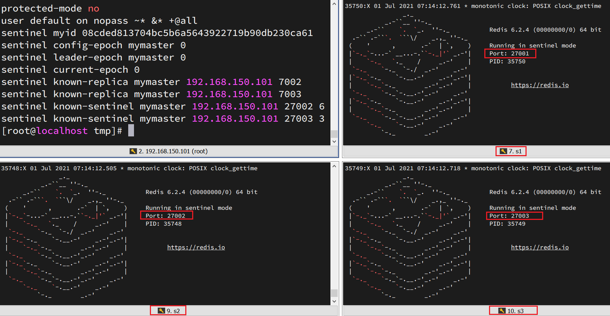

#### 3.2.4 测试

尝试让master节点7001宕机，查看sentinel日志：

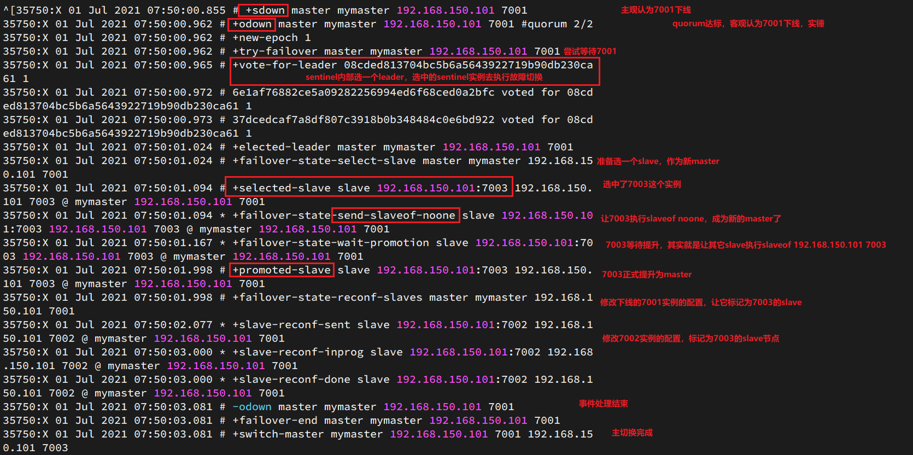

查看7003的日志：

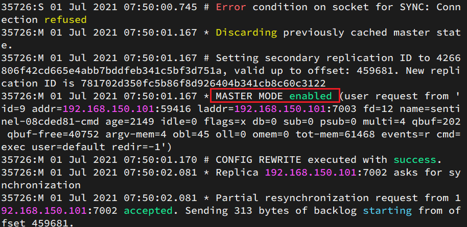

查看7002的日志：

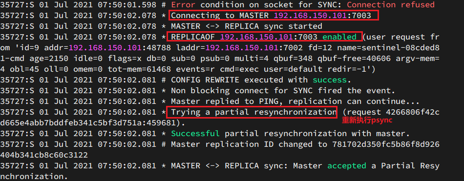


### 3.3 RedisTemplate

在Sentinel集群监管下的Redis主从集群，其节点会因为自动故障转移而发生变化，Redis的客户端必须感知这种变化，及时更新连接信息。Spring的RedisTemplate底层利用lettuce实现了节点的感知和自动切换。

下面，我们通过一个测试来实现RedisTemplate集成哨兵机制。

#### 3.3.1 导入Demo工程

首先，我们引入课前资料提供的Demo工程：redis-demo

#### 3.3.2 引入依赖

在项目的pom文件中引入依赖：

```xml
<dependency>
    <groupId>org.springframework.boot</groupId>
    <artifactId>spring-boot-starter-data-redis</artifactId>
</dependency>
```

#### 3.3.3 配置Redis地址

然后在配置文件application.yml中指定redis的sentinel相关信息：

```yaml
spring:
  redis:
    sentinel:
      master: mymaster # 指定master名称
      nodes: # 指定redis-sentinel集群信息 
        - 192.168.11.132:27001
        - 192.168.11.132:27002
        - 192.168.11.132:27003
```

#### 3.3.4 配置读写分离

在项目的启动类中，添加一个新的bean：

```java
@Bean
public LettuceClientConfigurationBuilderCustomizer clientConfigurationBuilderCustomizer(){
    return clientConfigurationBuilder -> clientConfigurationBuilder.readFrom(ReadFrom.REPLICA_PREFERRED);
}
```

这个bean中配置的就是读写策略，包括四种：

- MASTER：从主节点读取
- MASTER_PREFERRED：优先从master节点读取，master不可用才读取replica
- REPLICA：从slave（replica）节点读取
- REPLICA _PREFERRED：优先从slave（replica）节点读取，所有的slave都不可用才读取master


## 4 Redis分片集群

主从和哨兵可以解决高可用、高并发读的问题。但是依然有两个问题没有解决：

- 海量数据存储问题

- 高并发写的问题

使用分片集群可以解决上述问题，如图:

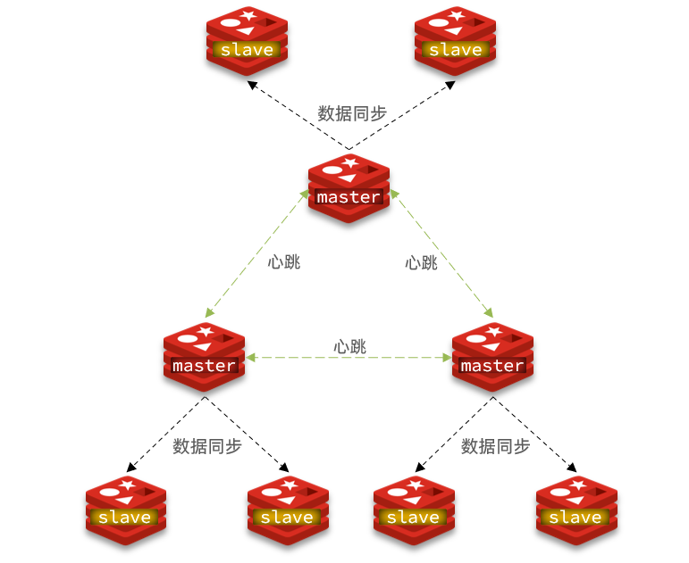

分片集群特征：

- 集群中有多个master，每个master保存不同数据

- 每个master都可以有多个slave节点

- master之间通过ping监测彼此健康状态

- 客户端请求可以访问集群任意节点，最终都会被转发到正确节点

### 4.1 搭建分片集群

#### 4.1.1 集群结构

分片集群需要的节点数量较多，这里我们搭建一个最小的分片集群，包含3个master节点，每个master包含一个slave节点，结构如下：

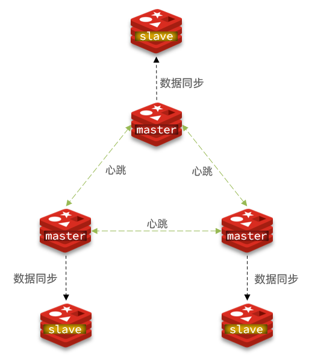


这里我们会在同一台虚拟机中开启6个redis实例，模拟分片集群，信息如下：

|       IP       | PORT |  角色  |
| :------------: | :--: | :----: |
| 192.168.11.132 | 7001 | master |
| 192.168.11.132 | 7002 | master |
| 192.168.11.132 | 7003 | master |
| 192.168.11.132 | 8001 | slave  |
| 192.168.11.132 | 8002 | slave  |
| 192.168.11.132 | 8003 | slave  |

#### 4.1.2 准备实例和配置

删除之前的7001、7002、7003这几个目录，重新创建出7001、7002、7003、8001、8002、8003目录：

```sh
# 进入/tmp目录
cd /tmp
# 删除旧的，避免配置干扰
rm -rf 7001 7002 7003
# 创建目录
mkdir 7001 7002 7003 8001 8002 8003
```

在/tmp下准备一个新的redis.conf文件，内容如下：

```ini
port 6379
# 开启集群功能
cluster-enabled yes
# 集群的配置文件名称，不需要我们创建，由redis自己维护
cluster-config-file /tmp/6379/nodes.conf
# 节点心跳失败的超时时间
cluster-node-timeout 5000
# 持久化文件存放目录
dir /tmp/6379
# 绑定地址
bind 0.0.0.0
# 让redis后台运行
daemonize yes
# 注册的实例ip
replica-announce-ip 192.168.11.132
# 保护模式
protected-mode no
# 数据库数量
databases 1
# 日志
logfile /tmp/6379/run.log
```

将这个文件拷贝到每个目录下：

```sh
# 进入/tmp目录
cd /tmp
# 执行拷贝
echo 7001 7002 7003 8001 8002 8003 | xargs -t -n 1 cp redis.conf
```

修改每个目录下的redis.conf，将其中的6379修改为与所在目录一致：

```sh
# 进入/tmp目录
cd /tmp
# 修改配置文件
printf '%s\n' 7001 7002 7003 8001 8002 8003 | xargs -I{} -t sed -i 's/6379/{}/g' {}/redis.conf
```

#### 4.1.3 启动

因为已经配置了后台启动模式，所以可以直接启动服务：

```sh
# 进入/tmp目录
cd /tmp
# 一键启动所有服务
printf '%s\n' 7001 7002 7003 8001 8002 8003 | xargs -I{} -t redis-server {}/redis.conf
```

通过ps查看状态：

```sh
ps -ef | grep redis
```

发现服务都已经正常启动：

```sh
[root@192 tmp]# ps -ef | grep redis
root      88570      1  0 00:21 ?        00:00:00 redis-server 0.0.0.0:7001 [cluster]
root      88572      1  0 00:21 ?        00:00:00 redis-server 0.0.0.0:7002 [cluster]
root      88582      1  0 00:21 ?        00:00:00 redis-server 0.0.0.0:7003 [cluster]
root      88588      1  0 00:21 ?        00:00:00 redis-server 0.0.0.0:8001 [cluster]
root      88594      1  0 00:21 ?        00:00:00 redis-server 0.0.0.0:8002 [cluster]
root      88600      1  0 00:21 ?        00:00:00 redis-server 0.0.0.0:8003 [cluster]
root      88642   1771  0 00:21 pts/0    00:00:00 grep --color=auto redis
```

如果要关闭所有进程，可以执行命令：

```sh
ps -ef | grep redis | awk '{print $2}' | xargs kill
```

或者（推荐这种方式）：

```sh
printf '%s\n' 7001 7002 7003 8001 8002 8003 | xargs -I{} -t redis-cli -p {} shutdown
```

#### 4.1.4 创建集群

虽然服务启动了，但是目前每个服务之间都是独立的，没有任何关联。

我们需要执行命令来创建集群，在Redis5.0之前创建集群比较麻烦，5.0之后集群管理命令都集成到了redis-cli中。

1）Redis5.0之前

Redis5.0之前集群命令都是用redis安装包下的src/redis-trib.rb来实现的。因为redis-trib.rb是有ruby语言编写的所以需要安装ruby环境。

 ```sh
# 安装依赖
yum -y install zlib ruby rubygems
gem install redis
 ```

然后通过命令来管理集群：

```sh
# 进入redis的src目录
cd /tmp/redis-6.2.4/src
# 创建集群
./redis-trib.rb create --replicas 1 192.168.11.132:7001 192.168.11.132:7002 192.168.11.132:7003 192.168.11.132:8001 192.168.11.132:8002 192.168.11.132:8003
```

2）Redis5.0以后

我们使用的是Redis6.2.4版本，集群管理以及集成到了redis-cli中，格式如下：

```sh
redis-cli --cluster create --cluster-replicas 1 192.168.11.132:7001 192.168.11.132:7002 192.168.11.132:7003 192.168.11.132:8001 192.168.11.132:8002 192.168.11.132:8003
```

命令说明：

- `redis-cli --cluster`或者`./redis-trib.rb`：代表集群操作命令
- `create`：代表是创建集群
- `--replicas 1`或者`--cluster-replicas 1` ：指定集群中每个master的副本个数为1，此时`节点总数 ÷ (replicas + 1)` 得到的就是master的数量。因此节点列表中的前n个就是master，其它节点都是slave节点，随机分配到不同master

运行后的样子：

```sh
[root@192 tmp]# redis-cli --cluster create --cluster-replicas 1 192.168.11.132:7001 192.168.11.132:7002 192.168.11.132:7003 192.168.11.132:8001 192.168.11.132:8002 192.168.11.132:8003
>>> Performing hash slots allocation on 6 nodes...
Master[0] -> Slots 0 - 5460
Master[1] -> Slots 5461 - 10922
Master[2] -> Slots 10923 - 16383
Adding replica 192.168.11.132:8002 to 192.168.11.132:7001
Adding replica 192.168.11.132:8003 to 192.168.11.132:7002
Adding replica 192.168.11.132:8001 to 192.168.11.132:7003
>>> Trying to optimize slaves allocation for anti-affinity
[WARNING] Some slaves are in the same host as their master
M: 2d993bc44fbded5cf78e0c6df782f18990129846 192.168.11.132:7001
   slots:[0-5460] (5461 slots) master
M: b5fdec742cb31b33cce83a0da47285e50b996534 192.168.11.132:7002
   slots:[5461-10922] (5462 slots) master
M: 75e3bd723b21659c7a1c3b68b235b7b5488feda0 192.168.11.132:7003
   slots:[10923-16383] (5461 slots) master
S: 0d49ccdbfa54d3dc3657321ec7579d908ed1c582 192.168.11.132:8001
   replicates b5fdec742cb31b33cce83a0da47285e50b996534
S: d427dca6cbe695531adc05dd0f5daafbe6bdeb51 192.168.11.132:8002
   replicates 75e3bd723b21659c7a1c3b68b235b7b5488feda0
S: ee956e624586656024d0049920450432a6d7061e 192.168.11.132:8003
   replicates 2d993bc44fbded5cf78e0c6df782f18990129846
Can I set the above configuration? (type 'yes' to accept):
```

这里输入yes，则集群开始创建：

```sh
Can I set the above configuration? (type 'yes' to accept): yes
>>> Nodes configuration updated
>>> Assign a different config epoch to each node
>>> Sending CLUSTER MEET messages to join the cluster
Waiting for the cluster to join
..
>>> Performing Cluster Check (using node 192.168.11.132:7001)
M: 2d993bc44fbded5cf78e0c6df782f18990129846 192.168.11.132:7001
   slots:[0-5460] (5461 slots) master
   1 additional replica(s)
S: 0d49ccdbfa54d3dc3657321ec7579d908ed1c582 192.168.11.132:8001
   slots: (0 slots) slave
   replicates b5fdec742cb31b33cce83a0da47285e50b996534
S: d427dca6cbe695531adc05dd0f5daafbe6bdeb51 192.168.11.132:8002
   slots: (0 slots) slave
   replicates 75e3bd723b21659c7a1c3b68b235b7b5488feda0
M: 75e3bd723b21659c7a1c3b68b235b7b5488feda0 192.168.11.132:7003
   slots:[10923-16383] (5461 slots) master
   1 additional replica(s)
S: ee956e624586656024d0049920450432a6d7061e 192.168.11.132:8003
   slots: (0 slots) slave
   replicates 2d993bc44fbded5cf78e0c6df782f18990129846
M: b5fdec742cb31b33cce83a0da47285e50b996534 192.168.11.132:7002
   slots:[5461-10922] (5462 slots) master
   1 additional replica(s)
[OK] All nodes agree about slots configuration.
>>> Check for open slots...
>>> Check slots coverage...
[OK] All 16384 slots covered.

```

通过命令可以查看集群状态：

```sh
redis-cli -p 7001 cluster nodes
```

```sh
[root@192 tmp]# redis-cli -p 7001 cluster nodes
2d993bc44fbded5cf78e0c6df782f18990129846 192.168.11.132:7001@17001 myself,master - 0 1699547095000 1 connected 0-5460
0d49ccdbfa54d3dc3657321ec7579d908ed1c582 192.168.11.132:8001@18001 slave b5fdec742cb31b33cce83a0da47285e50b996534 0 1699547094000 2 connected
d427dca6cbe695531adc05dd0f5daafbe6bdeb51 192.168.11.132:8002@18002 slave 75e3bd723b21659c7a1c3b68b235b7b5488feda0 0 1699547093823 3 connected
75e3bd723b21659c7a1c3b68b235b7b5488feda0 192.168.11.132:7003@17003 master - 0 1699547095555 3 connected 10923-16383
ee956e624586656024d0049920450432a6d7061e 192.168.11.132:8003@18003 slave 2d993bc44fbded5cf78e0c6df782f18990129846 0 1699547094843 1 connected
b5fdec742cb31b33cce83a0da47285e50b996534 192.168.11.132:7002@17002 master - 0 1699547094538 2 connected 5461-10922

```

#### 4.1.5 测试

尝试连接7001节点，存储一个数据：

```sh
# 连接
redis-cli -p 7001
# 存储数据
set num 123
# 读取数据
get num
# 再次存储
set a 1
```

结果悲剧了：

```sh
[root@192 tmp]# redis-cli -p 7001
127.0.0.1:7001> set num 123
OK
127.0.0.1:7001> get num
"123"
127.0.0.1:7001> set a 1
(error) MOVED 15495 192.168.11.132:7003
```

集群操作时，需要给`redis-cli`加上`-c`参数才可以：

```sh
redis-cli -c -p 7001
```

这次可以了：

```sh
[root@192 tmp]# redis-cli -c -p 7001
127.0.0.1:7001> get num
"123"
127.0.0.1:7001> set a 1
-> Redirected to slot [15495] located at 192.168.11.132:7003
OK
```

### 4.2 散列插槽

#### 4.2.1 插槽原理

Redis会把每一个master节点映射到0~16383共16384个插槽（hash slot）上，查看集群信息时就能看到：

```sh
M: 2d993bc44fbded5cf78e0c6df782f18990129846 192.168.11.132:7001
   slots:[0-5460] (5461 slots) master
M: b5fdec742cb31b33cce83a0da47285e50b996534 192.168.11.132:7002
   slots:[5461-10922] (5462 slots) master
M: 75e3bd723b21659c7a1c3b68b235b7b5488feda0 192.168.11.132:7003
   slots:[10923-16383] (5461 slots) master
```

数据key不是与节点绑定，而是与插槽绑定。redis会根据key的有效部分计算插槽值，分两种情况：

- key中包含"{}"，且“{}”中至少包含1个字符，“{}”中的部分是有效部分
- key中不包含“{}”，整个key都是有效部分

例如：key是num，那么就根据num计算，如果是{itcast}num，则根据itcast计算。计算方式是利用CRC16算法得到一个hash值，然后对16384取余，得到的结果就是slot值。

```sh
127.0.0.1:7001> set a 1
-> Redirected to slot [15495] located at 192.168.11.132:7003
OK
192.168.11.132:7003> get num
-> Redirected to slot [2765] located at 192.168.11.132:7001
"123"
```

如图，在7001这个节点执行set a 1时，对a做hash运算，对16384取余，得到的结果是15495，因此要存储到7003节点。

到了7003后，执行`get num`时，对num做hash运算，对16384取余，得到的结果是2765，因此需要切换到7001节点。

#### 4.2.2 小结

Redis如何判断某个key应该在哪个实例？

- 将16384个插槽分配到不同的实例
- 根据key的有效部分计算哈希值，对16384取余
- 余数作为插槽，寻找插槽所在实例即可

如何将同一类数据固定的保存在同一个Redis实例？

- 这一类数据使用相同的有效部分，例如key都以{typeId}为前缀


### 4.3 集群伸缩

redis-cli --cluster提供了很多操作集群的命令，可以通过下面方式查看：

```sh
[root@192 tmp]# redis-cli --cluster help
Cluster Manager Commands:
  create         host1:port1 ... hostN:portN   #创建集群
                 --cluster-replicas <arg>      #从节点个数
  check          host:port                     #检查集群
                 --cluster-search-multiple-owners #检查是否有槽同时被分配给了多个节点
  info           host:port                     #查看集群状态
  fix            host:port                     #修复集群
                 --cluster-search-multiple-owners #修复槽的重复分配问题
  reshard        host:port                     #指定集群的任意一节点进行迁移slot，重新分slots
                 --cluster-from <arg>          #需要从哪些源节点上迁移slot，可从多个源节点完成迁移，以逗号隔开，传递的是节点的node id，还可以直接传递--from all，这样源节点就是集群的所有节点，不传递该参数的话，则会在迁移过程中提示用户输入
                 --cluster-to <arg>            #slot需要迁移的目的节点的node id，目的节点只能填写一个，不传递该参数的话，则会在迁移过程中提示用户输入
                 --cluster-slots <arg>         #需要迁移的slot数量，不传递该参数的话，则会在迁移过程中提示用户输入。
                 --cluster-yes                 #指定迁移时的确认输入
                 --cluster-timeout <arg>       #设置migrate命令的超时时间
                 --cluster-pipeline <arg>      #定义cluster getkeysinslot命令一次取出的key数量，不传的话使用默认值为10
                 --cluster-replace             #是否直接replace到目标节点
  rebalance      host:port                                      #指定集群的任意一节点进行平衡集群节点slot数量 
                 --cluster-weight <node1=w1...nodeN=wN>         #指定集群节点的权重
                 --cluster-use-empty-masters                    #设置可以让没有分配slot的主节点参与，默认不允许
                 --cluster-timeout <arg>                        #设置migrate命令的超时时间
                 --cluster-simulate                             #模拟rebalance操作，不会真正执行迁移操作
                 --cluster-pipeline <arg>                       #定义cluster getkeysinslot命令一次取出的key数量，默认值为10
                 --cluster-threshold <arg>                      #迁移的slot阈值超过threshold，执行rebalance操作
                 --cluster-replace                              #是否直接replace到目标节点
  add-node       new_host:new_port existing_host:existing_port  #添加节点，把新节点加入到指定的集群，默认添加主节点
                 --cluster-slave                                #新节点作为从节点，默认随机一个主节点
                 --cluster-master-id <arg>                      #给新节点指定主节点
  del-node       host:port node_id                              #删除给定的一个节点，成功后关闭该节点服务
  call           host:port command arg arg .. arg               #在集群的所有节点执行相关命令
  set-timeout    host:port milliseconds                         #设置cluster-node-timeout
  import         host:port                                      #将外部redis数据导入集群
                 --cluster-from <arg>                           #将指定实例的数据导入到集群
                 --cluster-copy                                 #migrate时指定copy
                 --cluster-replace                              #migrate时指定replace
  help           
 
For check, fix, reshard, del-node, set-timeout you can specify the host and port of any working node in the cluster.
```

添加节点的命令：

```sh
  add-node       new_host:new_port existing_host:existing_port
                 --cluster-slave
                 --cluster-master-id <arg>
```

#### 4.3.1 需求分析

需求：向集群中添加一个新的master节点，并向其中存储 num = 10

- 启动一个新的redis实例，端口为7004
- 添加7004到之前的集群，并作为一个master节点
- 给7004节点分配插槽，使得num这个key可以存储到7004实例


这里需要两个新的功能：

- 添加一个节点到集群中
- 将部分插槽分配到新插槽

#### 4.3.2 创建新的redis实例

创建一个文件夹：

```sh
mkdir 7004
```

拷贝配置文件：

```sh
cp redis.conf ./7004
```

修改配置文件：

```sh
sed -i s/6379/7004/g 7004/redis.conf
```

启动

```sh
redis-server 7004/redis.conf
```

#### 4.3.3 添加新节点到redis

添加节点的语法如下：

```sh
  add-node       new_host:new_port existing_host:existing_port
                 --cluster-slave
                 --cluster-master-id <arg>
```

执行命令：

```sh
redis-cli --cluster add-node  192.168.11.132:7004 192.168.11.132:7001
```

通过命令查看集群状态：

```sh
redis-cli -p 7001 cluster nodes
```

如图，7004加入了集群，并且默认是一个master节点：

```sh
[root@192 tmp]# redis-cli -p 7001 cluster nodes
2d993bc44fbded5cf78e0c6df782f18990129846 192.168.11.132:7001@17001 myself,master - 0 1699548750000 1 connected 0-5460
0d49ccdbfa54d3dc3657321ec7579d908ed1c582 192.168.11.132:8001@18001 slave b5fdec742cb31b33cce83a0da47285e50b996534 0 1699548751094 2 connected
9a7b1c5925dfd553a850e17d0ae0ba23ae849999 192.168.11.132:7004@17004 master - 0 1699548751000 0 connected
d427dca6cbe695531adc05dd0f5daafbe6bdeb51 192.168.11.132:8002@18002 slave 75e3bd723b21659c7a1c3b68b235b7b5488feda0 0 1699548751000 3 connected
75e3bd723b21659c7a1c3b68b235b7b5488feda0 192.168.11.132:7003@17003 master - 0 1699548751505 3 connected 10923-16383
ee956e624586656024d0049920450432a6d7061e 192.168.11.132:8003@18003 slave 2d993bc44fbded5cf78e0c6df782f18990129846 0 1699548752117 1 connected
b5fdec742cb31b33cce83a0da47285e50b996534 192.168.11.132:7002@17002 master - 0 1699548751505 2 connected 5461-10922
```

但是，可以看到7004节点的插槽数量为0，因此没有任何数据可以存储到7004上

#### 4.3.4 转移插槽

我们要将num存储到7004节点，因此需要先看看num的插槽是多少：

```sh
192.168.11.132:7003> get num
-> Redirected to slot [2765] located at 192.168.11.132:7001
"123"
```

如上图所示，num的插槽为2765。

我们可以将0~3000的插槽从7001转移到7004，命令格式如下：

```sh
  reshard        host:port
                 --cluster-from <arg>
                 --cluster-to <arg>
                 --cluster-slots <arg>
                 --cluster-yes
                 --cluster-timeout <arg>
                 --cluster-pipeline <arg>
                 --cluster-replace
```

具体命令如下：

建立连接：

```sh
redis-cli --cluster reshard 192.168.11.132:7001
```

得到下面的反馈：

```sh
[root@192 tmp]# redis-cli --cluster reshard 192.168.11.132:7001
>>> Performing Cluster Check (using node 192.168.11.132:7001)
M: 2d993bc44fbded5cf78e0c6df782f18990129846 192.168.11.132:7001
   slots:[0-5460] (5461 slots) master
   1 additional replica(s)
S: 0d49ccdbfa54d3dc3657321ec7579d908ed1c582 192.168.11.132:8001
   slots: (0 slots) slave
   replicates b5fdec742cb31b33cce83a0da47285e50b996534
M: 9a7b1c5925dfd553a850e17d0ae0ba23ae849999 192.168.11.132:7004
   slots: (0 slots) master
S: d427dca6cbe695531adc05dd0f5daafbe6bdeb51 192.168.11.132:8002
   slots: (0 slots) slave
   replicates 75e3bd723b21659c7a1c3b68b235b7b5488feda0
M: 75e3bd723b21659c7a1c3b68b235b7b5488feda0 192.168.11.132:7003
   slots:[10923-16383] (5461 slots) master
   1 additional replica(s)
S: ee956e624586656024d0049920450432a6d7061e 192.168.11.132:8003
   slots: (0 slots) slave
   replicates 2d993bc44fbded5cf78e0c6df782f18990129846
M: b5fdec742cb31b33cce83a0da47285e50b996534 192.168.11.132:7002
   slots:[5461-10922] (5462 slots) master
   1 additional replica(s)
[OK] All nodes agree about slots configuration.
>>> Check for open slots...
>>> Check slots coverage...
[OK] All 16384 slots covered.
How many slots do you want to move (from 1 to 16384)?
```

询问要移动多少个插槽，我们计划是3000个：

```sh
[OK] All nodes agree about slots configuration.
>>> Check for open slots...
>>> Check slots coverage...
[OK] All 16384 slots covered.
How many slots do you want to move (from 1 to 16384)? 3000
What is the receiving node ID?
```

那个node来接收这些插槽？？

显然是7004，那么7004节点的id是多少呢？

```
M: 9a7b1c5925dfd553a850e17d0ae0ba23ae849999 192.168.11.132:7004
   slots: (0 slots) master
```

```sh
[OK] All nodes agree about slots configuration.
>>> Check for open slots...
>>> Check slots coverage...
[OK] All 16384 slots covered.
How many slots do you want to move (from 1 to 16384)? 3000
What is the receiving node ID? 9a7b1c5925dfd553a850e17d0ae0ba23ae849999
Please enter all the source node IDs.
  Type 'all' to use all the nodes as source nodes for the hash slots.
  Type 'done' once you entered all the source nodes IDs.
Source node #1:
```

这里询问，你的插槽是从哪里移动过来的？

- all：代表全部，也就是三个节点各转移一部分
- 具体的id：目标节点的id
- done：没有了

这里我们要从7001获取，因此填写7001的id：

```sh
[OK] All nodes agree about slots configuration.
>>> Check for open slots...
>>> Check slots coverage...
[OK] All 16384 slots covered.
How many slots do you want to move (from 1 to 16384)? 3000
What is the receiving node ID? 9a7b1c5925dfd553a850e17d0ae0ba23ae849999
Please enter all the source node IDs.
  Type 'all' to use all the nodes as source nodes for the hash slots.
  Type 'done' once you entered all the source nodes IDs.
Source node #1: 2d993bc44fbded5cf78e0c6df782f18990129846
Source node #2: done

Ready to move 3000 slots.
  Source nodes:
    M: 2d993bc44fbded5cf78e0c6df782f18990129846 192.168.11.132:7001
       slots:[0-5460] (5461 slots) master
       1 additional replica(s)
  Destination node:
    M: 9a7b1c5925dfd553a850e17d0ae0ba23ae849999 192.168.11.132:7004
       slots: (0 slots) master
  Resharding plan:
    Moving slot 0 from 2d993bc44fbded5cf78e0c6df782f18990129846
    Moving slot 1 from 2d993bc44fbded5cf78e0c6df782f18990129846
	......
    Moving slot 2998 from 2d993bc44fbded5cf78e0c6df782f18990129846
    Moving slot 2999 from 2d993bc44fbded5cf78e0c6df782f18990129846
Do you want to proceed with the proposed reshard plan (yes/no)?
```

确认要转移吗？输入yes：

然后，通过命令查看结果：

```sh
[root@192 tmp]# redis-cli -p 7001 cluster nodes
2d993bc44fbded5cf78e0c6df782f18990129846 192.168.11.132:7001@17001 myself,master - 0 1699549475000 1 connected 3000-5460
0d49ccdbfa54d3dc3657321ec7579d908ed1c582 192.168.11.132:8001@18001 slave b5fdec742cb31b33cce83a0da47285e50b996534 0 1699549475000 2 connected
9a7b1c5925dfd553a850e17d0ae0ba23ae849999 192.168.11.132:7004@17004 master - 0 1699549474000 7 connected 0-2999
d427dca6cbe695531adc05dd0f5daafbe6bdeb51 192.168.11.132:8002@18002 slave 75e3bd723b21659c7a1c3b68b235b7b5488feda0 0 1699549475000 3 connected
75e3bd723b21659c7a1c3b68b235b7b5488feda0 192.168.11.132:7003@17003 master - 0 1699549475566 3 connected 10923-16383
ee956e624586656024d0049920450432a6d7061e 192.168.11.132:8003@18003 slave 2d993bc44fbded5cf78e0c6df782f18990129846 0 1699549475667 1 connected
b5fdec742cb31b33cce83a0da47285e50b996534 192.168.11.132:7002@17002 master - 0 1699549474551 2 connected 5461-10922
```

测试

```sh
[root@192 tmp]# redis-cli -c -p 7001
127.0.0.1:7001> set num 10
-> Redirected to slot [2765] located at 192.168.11.132:7004
OK
```

#### 4.3.5 添加从节点

新建8004节点，添加该节点为7004节点的从节点。

创建一个文件夹：

```sh
mkdir 8004
```

拷贝配置文件：

```sh
cp redis.conf ./8004
```

修改配置文件：

```sh
sed -i s/6379/8004/g 8004/redis.conf
```

启动

```sh
redis-server 8004/redis.conf
```

添加从节点

```sh
redis-cli --cluster add-node --cluster-slave --cluster-master-id 9a7b1c5925dfd553a850e17d0ae0ba23ae849999 192.168.11.132:8004 192.168.11.132:7001
```

通过命令查看集群状态：

```sh
redis-cli -p 7001 cluster nodes
```

集群四主四从：

```sh
[root@192 tmp]# redis-cli -p 7001 cluster nodes
d0e290d9dbb7616bfcae59f0832ec94be1c9623f 192.168.11.132:8004@18004 slave 9a7b1c5925dfd553a850e17d0ae0ba23ae849999 0 1699551357000 7 connected
2d993bc44fbded5cf78e0c6df782f18990129846 192.168.11.132:7001@17001 myself,master - 0 1699551358000 1 connected 3000-5460
0d49ccdbfa54d3dc3657321ec7579d908ed1c582 192.168.11.132:8001@18001 slave b5fdec742cb31b33cce83a0da47285e50b996534 0 1699551358112 2 connected
9a7b1c5925dfd553a850e17d0ae0ba23ae849999 192.168.11.132:7004@17004 master - 0 1699551357605 7 connected 0-2999
d427dca6cbe695531adc05dd0f5daafbe6bdeb51 192.168.11.132:8002@18002 slave 75e3bd723b21659c7a1c3b68b235b7b5488feda0 0 1699551357095 3 connected
75e3bd723b21659c7a1c3b68b235b7b5488feda0 192.168.11.132:7003@17003 master - 0 1699551357605 3 connected 10923-16383
ee956e624586656024d0049920450432a6d7061e 192.168.11.132:8003@18003 slave 2d993bc44fbded5cf78e0c6df782f18990129846 0 1699551358519 1 connected
b5fdec742cb31b33cce83a0da47285e50b996534 192.168.11.132:7002@17002 master - 0 1699551357000 2 connected 5461-10922
```

#### 4.5.6 删除节点

删除从节点8004

执行命令：

```sh
[root@192 tmp]# redis-cli --cluster del-node 192.168.11.132:8004 d0e290d9dbb7616bfcae59f0832ec94be1c9623f
>>> Removing node d0e290d9dbb7616bfcae59f0832ec94be1c9623f from cluster 192.168.11.132:8004
>>> Sending CLUSTER FORGET messages to the cluster...
>>> Sending CLUSTER RESET SOFT to the deleted node.
```

查询集群状态：

```sh
[root@192 tmp]# redis-cli -p 7001 cluster nodes
2d993bc44fbded5cf78e0c6df782f18990129846 192.168.11.132:7001@17001 myself,master - 0 1699551684000 1 connected 3000-5460
0d49ccdbfa54d3dc3657321ec7579d908ed1c582 192.168.11.132:8001@18001 slave b5fdec742cb31b33cce83a0da47285e50b996534 0 1699551684065 2 connected
9a7b1c5925dfd553a850e17d0ae0ba23ae849999 192.168.11.132:7004@17004 master - 0 1699551685604 7 connected 0-2999
d427dca6cbe695531adc05dd0f5daafbe6bdeb51 192.168.11.132:8002@18002 slave 75e3bd723b21659c7a1c3b68b235b7b5488feda0 0 1699551685502 3 connected
75e3bd723b21659c7a1c3b68b235b7b5488feda0 192.168.11.132:7003@17003 master - 0 1699551684580 3 connected 10923-16383
ee956e624586656024d0049920450432a6d7061e 192.168.11.132:8003@18003 slave 2d993bc44fbded5cf78e0c6df782f18990129846 0 1699551686117 1 connected
b5fdec742cb31b33cce83a0da47285e50b996534 192.168.11.132:7002@17002 master - 0 1699551685502 2 connected 5461-10922
```

删除主节点7004，执行命令：

```sh
[root@192 tmp]# redis-cli --cluster del-node 192.168.11.132:7004 9a7b1c5925dfd553a850e17d0ae0ba23ae849999
>>> Removing node 9a7b1c5925dfd553a850e17d0ae0ba23ae849999 from cluster 192.168.11.132:7004
[ERR] Node 192.168.11.132:7004 is not empty! Reshard data away and try again.
```

报错7004节点不为空，需要先进行Reshard，把7004节点的hash槽分配出去。

执行命令，确定转移插槽的数量、接收方ID、来源方ID：

```sh
redis-cli --cluster reshard 192.168.11.132:7001
```

查询集群状态：

```sh
[root@192 tmp]#  redis-cli -p 7001 cluster nodes
2d993bc44fbded5cf78e0c6df782f18990129846 192.168.11.132:7001@17001 myself,master - 0 1699552149000 8 connected 0-5460
0d49ccdbfa54d3dc3657321ec7579d908ed1c582 192.168.11.132:8001@18001 slave b5fdec742cb31b33cce83a0da47285e50b996534 0 1699552148870 2 connected
9a7b1c5925dfd553a850e17d0ae0ba23ae849999 192.168.11.132:7004@17004 master - 0 1699552150514 7 connected
d427dca6cbe695531adc05dd0f5daafbe6bdeb51 192.168.11.132:8002@18002 slave 75e3bd723b21659c7a1c3b68b235b7b5488feda0 0 1699552150000 3 connected
75e3bd723b21659c7a1c3b68b235b7b5488feda0 192.168.11.132:7003@17003 master - 0 1699552149000 3 connected 10923-16383
ee956e624586656024d0049920450432a6d7061e 192.168.11.132:8003@18003 slave 2d993bc44fbded5cf78e0c6df782f18990129846 0 1699552149900 8 connected
b5fdec742cb31b33cce83a0da47285e50b996534 192.168.11.132:7002@17002 master - 0 1699552149000 2 connected 5461-10922

```

再次删除主节点7004，执行命令：

```sh
[root@192 tmp]# redis-cli --cluster del-node 192.168.11.132:7004 9a7b1c5925dfd553a850e17d0ae0ba23ae849999
>>> Removing node 9a7b1c5925dfd553a850e17d0ae0ba23ae849999 from cluster 192.168.11.132:7004
>>> Sending CLUSTER FORGET messages to the cluster...
>>> Sending CLUSTER RESET SOFT to the deleted node.
```

查询集群状态（变为三主三从）：

```sh
[root@192 tmp]# redis-cli -p 7001 cluster nodes
2d993bc44fbded5cf78e0c6df782f18990129846 192.168.11.132:7001@17001 myself,master - 0 1699552226000 8 connected 0-5460
0d49ccdbfa54d3dc3657321ec7579d908ed1c582 192.168.11.132:8001@18001 slave b5fdec742cb31b33cce83a0da47285e50b996534 0 1699552227000 2 connected
d427dca6cbe695531adc05dd0f5daafbe6bdeb51 192.168.11.132:8002@18002 slave 75e3bd723b21659c7a1c3b68b235b7b5488feda0 0 1699552228500 3 connected
75e3bd723b21659c7a1c3b68b235b7b5488feda0 192.168.11.132:7003@17003 master - 0 1699552227000 3 connected 10923-16383
ee956e624586656024d0049920450432a6d7061e 192.168.11.132:8003@18003 slave 2d993bc44fbded5cf78e0c6df782f18990129846 0 1699552227485 8 connected
b5fdec742cb31b33cce83a0da47285e50b996534 192.168.11.132:7002@17002 master - 0 1699552227078 2 connected 5461-10922
```

### 4.4 故障转移

监控集群状态命令：

```sh
watch redis-cli -p 7001 cluster nodes
```

集群初识状态是这样的：

```sh
2d993bc44fbded5cf78e0c6df782f18990129846 192.168.11.132:7001@17001 myself,master - 0 1699552404000 8 connected 0-5460
0d49ccdbfa54d3dc3657321ec7579d908ed1c582 192.168.11.132:8001@18001 slave b5fdec742cb31b33cce83a0da47285e50b996534 0 1699552405975 2 connected
d427dca6cbe695531adc05dd0f5daafbe6bdeb51 192.168.11.132:8002@18002 slave 75e3bd723b21659c7a1c3b68b235b7b5488feda0 0 1699552406000 3 connected
75e3bd723b21659c7a1c3b68b235b7b5488feda0 192.168.11.132:7003@17003 master - 0 1699552407000 3 connected 10923-16383
ee956e624586656024d0049920450432a6d7061e 192.168.11.132:8003@18003 slave 2d993bc44fbded5cf78e0c6df782f18990129846 0 1699552405000 8 connected
b5fdec742cb31b33cce83a0da47285e50b996534 192.168.11.132:7002@17002 master - 0 1699552406000 2 connected 5461-10922
```

其中7001、7002、7003都是master，我们计划让7002宕机。

#### 4.4.1 自动故障转移

当集群中有一个master宕机会发生什么呢？

直接停止一个redis实例，例如7002：

```sh
redis-cli -p 7002 shutdown
```

1）首先是该实例与其它实例失去连接

2）然后是疑似宕机：

```sh
2d993bc44fbded5cf78e0c6df782f18990129846 192.168.11.132:7001@17001 myself,master - 0 1699552530000 8 connected 0-5460
0d49ccdbfa54d3dc3657321ec7579d908ed1c582 192.168.11.132:8001@18001 master - 0 1699552532586 9 connected 5461-10922
d427dca6cbe695531adc05dd0f5daafbe6bdeb51 192.168.11.132:8002@18002 slave 75e3bd723b21659c7a1c3b68b235b7b5488feda0 0 1699552532000 3 connected
75e3bd723b21659c7a1c3b68b235b7b5488feda0 192.168.11.132:7003@17003 master - 0 1699552531564 3 connected 10923-16383
ee956e624586656024d0049920450432a6d7061e 192.168.11.132:8003@18003 slave 2d993bc44fbded5cf78e0c6df782f18990129846 0 1699552531000 8 connected
b5fdec742cb31b33cce83a0da47285e50b996534 192.168.11.132:7002@17002 master,fail? - 1699552524513 1699552522000 2 disconnected
```

3）最后是确定下线，自动提升一个slave为新的master：

```sh
2d993bc44fbded5cf78e0c6df782f18990129846 192.168.11.132:7001@17001 myself,master - 0 1699552530000 8 connected 0-5460
0d49ccdbfa54d3dc3657321ec7579d908ed1c582 192.168.11.132:8001@18001 master - 0 1699552532586 9 connected 5461-10922
d427dca6cbe695531adc05dd0f5daafbe6bdeb51 192.168.11.132:8002@18002 slave 75e3bd723b21659c7a1c3b68b235b7b5488feda0 0 1699552532000 3 connected
75e3bd723b21659c7a1c3b68b235b7b5488feda0 192.168.11.132:7003@17003 master - 0 1699552531564 3 connected 10923-16383
ee956e624586656024d0049920450432a6d7061e 192.168.11.132:8003@18003 slave 2d993bc44fbded5cf78e0c6df782f18990129846 0 1699552531000 8 connected
b5fdec742cb31b33cce83a0da47285e50b996534 192.168.11.132:7002@17002 master,fail - 1699552524513 1699552522000 2 disconnected
```

4）当7002再次启动，就会变为一个slave节点了：

```sh
2d993bc44fbded5cf78e0c6df782f18990129846 192.168.11.132:7001@17001 myself,master - 0 1699552673000 8 connected 0-5460
0d49ccdbfa54d3dc3657321ec7579d908ed1c582 192.168.11.132:8001@18001 master - 0 1699552673351 9 connected 5461-10922
d427dca6cbe695531adc05dd0f5daafbe6bdeb51 192.168.11.132:8002@18002 slave 75e3bd723b21659c7a1c3b68b235b7b5488feda0 0 1699552673555 3 connected
75e3bd723b21659c7a1c3b68b235b7b5488feda0 192.168.11.132:7003@17003 master - 0 1699552674370 3 connected 10923-16383
ee956e624586656024d0049920450432a6d7061e 192.168.11.132:8003@18003 slave 2d993bc44fbded5cf78e0c6df782f18990129846 0 1699552675388 8 connected
b5fdec742cb31b33cce83a0da47285e50b996534 192.168.11.132:7002@17002 slave 0d49ccdbfa54d3dc3657321ec7579d908ed1c582 0 1699552674573 9 connected
```

#### 4.4.2 手动故障转移

利用cluster failover命令可以手动让集群中的某个master宕机，切换到执行cluster failover命令的这个slave节点，实现无感知的数据迁移。其流程如下：

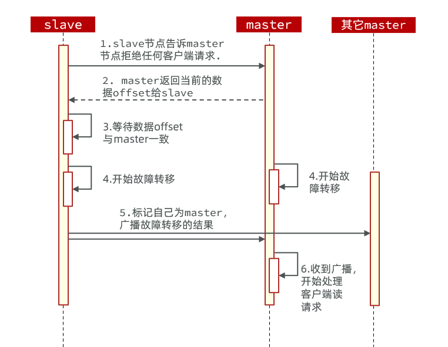

这种failover命令可以指定三种模式：

- 缺省：默认的流程，如图1~6歩
- force：省略了对offset的一致性校验
- takeover：直接执行第5歩，忽略数据一致性、忽略master状态和其它master的意见


**案例需求**：在7002这个slave节点执行手动故障转移，重新夺回master地位

步骤如下：

1）利用redis-cli连接7002这个节点

2）执行cluster failover命令

```sh
[root@192 tmp]# redis-cli -p 7002
127.0.0.1:7002> cluster failover
OK
```

查询集群状态:

```sh
2d993bc44fbded5cf78e0c6df782f18990129846 192.168.11.132:7001@17001 myself,master - 0 1699553307000 8 connected 0-5460
0d49ccdbfa54d3dc3657321ec7579d908ed1c582 192.168.11.132:8001@18001 slave b5fdec742cb31b33cce83a0da47285e50b996534 0 1699553309540 10 connected
d427dca6cbe695531adc05dd0f5daafbe6bdeb51 192.168.11.132:8002@18002 slave,fail 75e3bd723b21659c7a1c3b68b235b7b5488feda0 1699552702588 1699552700000 3 disconnected
75e3bd723b21659c7a1c3b68b235b7b5488feda0 192.168.11.132:7003@17003 master - 0 1699553308314 3 connected 10923-16383
ee956e624586656024d0049920450432a6d7061e 192.168.11.132:8003@18003 slave 2d993bc44fbded5cf78e0c6df782f18990129846 0 1699553309844 8 connected
b5fdec742cb31b33cce83a0da47285e50b996534 192.168.11.132:7002@17002 master - 0 1699553308822 10 connected 5461-10922
```

### 4.5 RedisTemplate访问分片集群

RedisTemplate底层同样基于lettuce实现了分片集群的支持，而使用的步骤与哨兵模式基本一致：

1）引入redis的starter依赖

2）配置分片集群地址

3）配置读写分离

与哨兵模式相比，其中只有分片集群的配置方式略有差异，如下：

```yaml
spring:
  redis:
    cluster:
      nodes:
        - 192.168.150.101:7001
        - 192.168.150.101:7002
        - 192.168.150.101:7003
        - 192.168.150.101:8001
        - 192.168.150.101:8002
        - 192.168.150.101:8003
```
