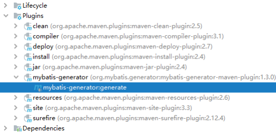
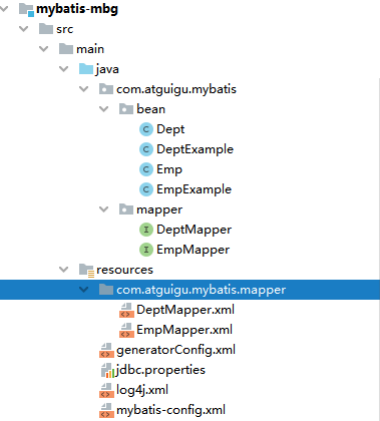

# MyBatis（二）

## 8、自定义映射resultMap

### 8.1、resultMap处理字段和属性的映射关系

若字段名和实体类中的属性名不一致，则可以通过resultMap设置自定义映射  

```xml
<!--
resultMap：设置自定义映射
属性：
id：表示自定义映射的唯一标识
type：查询的数据要映射的实体类的类型
子标签：
id：设置主键的映射关系
result：设置普通字段的映射关系
association：设置多对一的映射关系
collection：设置一对多的映射关系
属性：
property：设置映射关系中实体类中的属性名
column：设置映射关系中表中的字段名
-->
<resultMap id="userMap" type="User">
  <id property="id" column="id"></id>
  <result property="userName" column="user_name"></result>
  <result property="password" column="password"></result>
  <result property="age" column="age"></result>
  <result property="sex" column="sex"></result>
</resultMap>
<!--List<User> testMohu(@Param("mohu") String mohu);-->
<select id="testMohu" resultMap="userMap">
  <!--select * from t_user where username like '%${mohu}%'-->
  select id,user_name,password,age,sex from t_user where user_name like
  concat('%',#{mohu},'%')
</select>
```

若字段名和实体类中的属性名不一致，但是字段名符合数据库的规则（使用_），实体类中的属性名符合Java的规则（使用驼峰）

此时也可通过以下两种方式处理字段名和实体类中的属性的映射关系

a>可以通过为字段起别名的方式，保证和实体类中的属性名保持一致

b>可以在MyBatis的核心配置文件中设置一个全局配置信息mapUnderscoreToCamelCase，可以在查询表中数据时，自动将_类型的字段名转换为驼峰

例如：字段名user_name，设置了mapUnderscoreToCamelCase，此时字段名就会转换为userName

### 8.2、多对一映射处理

场景模拟：

查询员工信息以及员工所对应的部门信息

### 8.2.1、级联方式处理映射关系

```xml
<resultMap id="empDeptMap" type="Emp">
  <id column="eid" property="eid"></id>
  <result column="ename" property="ename"></result>
  <result column="age" property="age"></result>
  <result column="sex" property="sex"></result>
  <result column="did" property="dept.did"></result>
  <result column="dname" property="dept.dname"></result>
</resultMap>
<!--Emp getEmpAndDeptByEid(@Param("eid") int eid);-->
<select id="getEmpAndDeptByEid" resultMap="empDeptMap">
  select emp.*,dept.* from t_emp emp left join t_dept dept on emp.did =
  dept.did where emp.eid = #{eid}
</select>
```

### 8.2.2、使用association处理映射关系 

```xml
<resultMap id="empDeptMap" type="Emp">
  <id column="eid" property="eid"></id>
  <result column="ename" property="ename"></result>
  <result column="age" property="age"></result>
  <result column="sex" property="sex"></result>
  <association property="dept" javaType="Dept">
    <id column="did" property="did"></id>
    <result column="dname" property="dname"></result>
  </association>
</resultMap>
<!--Emp getEmpAndDeptByEid(@Param("eid") int eid);-->
<select id="getEmpAndDeptByEid" resultMap="empDeptMap">
  select emp.*,dept.* from t_emp emp left join t_dept dept on emp.did =
  dept.did where emp.eid = #{eid}
</select>
```

### 8.2.3、分步查询

①查询员工信息 

```java
/**
* 通过分步查询查询员工信息
* @param eid
* @return
*/
Emp getEmpByStep(@Param("eid") int eid);
<resultMap id="empDeptStepMap" type="Emp">
  <id column="eid" property="eid"></id>
  <result column="ename" property="ename"></result>
  <result column="age" property="age"></result>
  <result column="sex" property="sex"></result>
  <!--
  select：设置分步查询，查询某个属性的值的sql的标识（namespace.sqlId）
  column：将sql以及查询结果中的某个字段设置为分步查询的条件
  -->
  <association property="dept"
    select="com.atguigu.MyBatis.mapper.DeptMapper.getEmpDeptByStep" column="did">
  </association>
</resultMap>
<!--Emp getEmpByStep(@Param("eid") int eid);-->
<select id="getEmpByStep" resultMap="empDeptStepMap">
  select * from t_emp where eid = #{eid}
</select>
```

②根据员工所对应的部门id查询部门信息 

```java
/**
* 分步查询的第二步： 根据员工所对应的did查询部门信息
* @param did
* @return
*/
Dept getEmpDeptByStep(@Param("did") int did);
<!--Dept getEmpDeptByStep(@Param("did") int did);-->
<select id="getEmpDeptByStep" resultType="Dept">
  select * from t_dept where did = #{did}
</select>
```

## 8.3、一对多映射处理

### 8.3.1、collection  

```java
/**
* 根据部门id查新部门以及部门中的员工信息
* @param did
* @return
*/
Dept getDeptEmpByDid(@Param("did") int did);
<resultMap id="deptEmpMap" type="Dept">
  <id property="did" column="did"></id>
  <result property="dname" column="dname"></result>
  <!--
  ofType：设置collection标签所处理的集合属性中存储数据的类型
  -->
  <collection property="emps" ofType="Emp">
    <id property="eid" column="eid"></id>
    <result property="ename" column="ename"></result>
    <result property="age" column="age"></result>
    <result property="sex" column="sex"></result>
  </collection>
</resultMap>
<!--Dept getDeptEmpByDid(@Param("did") int did);-->
<select id="getDeptEmpByDid" resultMap="deptEmpMap">
  select dept.*,emp.* from t_dept dept left join t_emp emp on dept.did =
  emp.did where dept.did = #{did}
</select>
```

### 8.3.2、分步查询

①查询部门信息  

```java
/**
* 分步查询部门和部门中的员工
* @param did
* @return
*/
Dept getDeptByStep(@Param("did") int did);
<resultMap id="deptEmpStep" type="Dept">
  <id property="did" column="did"></id>
  <result property="dname" column="dname"></result>
  <collection property="emps" fetchType="eager"
    select="com.atguigu.MyBatis.mapper.EmpMapper.getEmpListByDid" column="did">
  </collection>
</resultMap>
<!--Dept getDeptByStep(@Param("did") int did);-->
<select id="getDeptByStep" resultMap="deptEmpStep">
  select * from t_dept where did = #{did}
</select>
```

②根据部门id查询部门中的所有员工 

```java
/**
* 根据部门id查询员工信息
* @param did
* @return
*/
List<Emp> getEmpListByDid(@Param("did") int did);
<!--List<Emp> getEmpListByDid(@Param("did") int did);-->
<select id="getEmpListByDid" resultType="Emp">
  select * from t_emp where did = #{did}
</select>
```

分步查询的优点：可以实现延迟加载

但是必须在核心配置文件中设置全局配置信息：

lazyLoadingEnabled：延迟加载的全局开关。当开启时，所有关联对象都会延迟加载

aggressiveLazyLoading：当开启时，任何方法的调用都会加载该对象的所有属性。否则，每个属性会按需加载

此时就可以实现按需加载，获取的数据是什么，就只会执行相应的sql。此时可通过association和collection中的fetchType属性设置当前的分步查询是否使用延迟加载， fetchType="lazy(延迟加载)|eager(立即加载)" 

### 案例代码

```xml
<?xml version="1.0" encoding="UTF-8" ?>
<!DOCTYPE configuration
        PUBLIC "-//mybatis.org//DTD Config 3.0//EN"
        "http://mybatis.org/dtd/mybatis-3-config.dtd">

<configuration>

    <!--
        MyBatis核心配置文件中的标签必须要按照指定的顺序配置：
        properties?,settings?,typeAliases?,typeHandlers?,
        objectFactory?,objectWrapperFactory?,reflectorFactory?,
        plugins?,environments?,databaseIdProvider?,mappers?
    -->

    <properties resource="jdbc.properties"/>
    
    <settings>
        <!--将下划线映射为驼峰-->
        <setting name="mapUnderscoreToCamelCase" value="true"/>
        <!--开启延迟加载-->
        <setting name="lazyLoadingEnabled" value="true"/>
        <!--按需加载-->
        <setting name="aggressiveLazyLoading" value="false"/>
    </settings>

    <typeAliases>
        <package name="com.atguigu.mybatis.pojo"/>
    </typeAliases>

    <environments default="development">
        <environment id="development">
            <transactionManager type="JDBC"/>
            <dataSource type="POOLED">
                <property name="driver" value="${jdbc.driver}"/>
                <property name="url" value="${jdbc.url}"/>
                <property name="username" value="${jdbc.username}"/>
                <property name="password" value="${jdbc.password}"/>
            </dataSource>
        </environment>
    </environments>

    <!--引入mybatis的映射文件-->
    <mappers>
        <package name="com.atguigu.mybatis.mapper"/>
    </mappers>
</configuration>
package com.atguigu.mybatis.pojo;

public class Emp {

    private Integer empId;

    private String empName;

    private Integer age;

    private String gender;

    private Dept dept;

	···
}
package com.atguigu.mybatis.pojo;

import java.util.List;

public class Dept {

    private Integer deptId;

    private String deptName;

    private List<Emp> emps;

    ···
}
package com.atguigu.mybatis.mapper;

import com.atguigu.mybatis.pojo.Emp;
import org.apache.ibatis.annotations.Param;

import java.util.List;

public interface EmpMapper {

    /**
     * 根据id查询员工信息
     *
     * @param empId
     * @return
     */
    Emp getEmpByEmpId(@Param("empId") Integer empId);

    /**
     * 获取员工以及所对应的部门信息
     *
     * @param empId
     * @return
     */
    Emp getEmpAndDeptByEmpId(@Param("empId") Integer empId);

    /**
     * 通过分步查询查询员工以及所对应的部门信息的第一步
     *
     * @param empId
     * @return
     */
    Emp getEmpAndDeptByStepOne(@Param("empId") Integer empId);

    /**
     * 通过分步查询查询部门以及部门中的员工信息的第二步
     *
     * @param deptId
     * @return
     */
    List<Emp> getDeptAndEmpByStepTwo(@Param("deptId") Integer deptId);

}
package com.atguigu.mybatis.mapper;

import com.atguigu.mybatis.pojo.Dept;
import org.apache.ibatis.annotations.Param;

public interface DeptMapper {

    /**
     * 通过分步查询查询员工以及所对应的部门信息的第二步
     *
     * @return
     */
    Dept getEmpAndDeptByStepTwo(@Param("deptId") Integer deptId);

    /**
     * 查询部门以及部门中的员工信息
     *
     * @param deptId
     * @return
     */
    Dept getDeptAndEmpByDeptId(@Param("deptId") Integer deptId);

    /**
     * 通过分步查询查询部门以及部门中的员工信息的第一步
     *
     * @param deptId
     * @return
     */
    Dept getDeptAndEmpByStepOne(@Param("deptId") Integer deptId);

}
<?xml version="1.0" encoding="UTF-8" ?>
<!DOCTYPE mapper
        PUBLIC "-//mybatis.org//DTD Mapper 3.0//EN"
        "http://mybatis.org/dtd/mybatis-3-mapper.dtd">

<mapper namespace="com.atguigu.mybatis.mapper.EmpMapper">

    <!--
        字段名和属性名不一致的情况，如何处理映射关系
        1、为查询的字段设置别名，和属性名保持一致
        2、当字段符合MySQL的要求使用_，而属性符合java的要求使用驼峰
        此时可以在MyBatis的核心配置文件中设置一个全局配置，可以自动将下划线映射为驼峰
        emp_id:empId,emp_name:empName
        3、使用resultMap自定义映射处理
        处理多对一的映射关系：
        1、级联方式处理
        2、association
        3、分步查询

        处理一对多的映射关系：
        1、collection
        2、分步查询
    -->

    <!--
        resultMap：设置自定义的映射关系
        id：唯一标识
        type：处理映射关系的实体类的类型
        常用的标签：
        id：处理主键和实体类中属性的映射关系
        result：处理普通字段和实体类中属性的映射关系
        association：处理多对一的映射关系（处理实体类类型的属性）
        collection：处理一对多的映射关系（处理集合类型的属性）
        column：设置映射关系中的字段名，必须是sql查询出的某个字段
        property：设置映射关系中的属性的属性名，必须是处理的实体类类型中的属性名
    -->
    <resultMap id="empResultMap" type="Emp">
        <id column="emp_id" property="empId"></id>
        <result column="emp_name" property="empName"></result>
        <result column="age" property="age"></result>
        <result column="gender" property="gender"></result>
    </resultMap>

    <!--Emp getEmpByEmpId(@Param("empId") Integer empId);-->
    <select id="getEmpByEmpId" resultMap="empResultMap">
        select *
        from t_emp
        where emp_id = #{empId}
    </select>

    <select id="getEmpByEmpIdOld" resultType="Emp">
        <!--select emp_id empId,emp_name empName,age,gender from t_emp where emp_id = #{empId}-->
        select * from t_emp where emp_id = #{empId}
    </select>

    <resultMap id="empAndDeptResultMapOne" type="Emp">
        <id column="emp_id" property="empId"></id>
        <result column="emp_name" property="empName"></result>
        <result column="age" property="age"></result>
        <result column="gender" property="gender"></result>
        <result column="dept_id" property="dept.deptId"></result>
        <result column="dept_name" property="dept.deptName"></result>
    </resultMap>

    <resultMap id="empAndDeptResultMap" type="Emp">
        <id column="emp_id" property="empId"></id>
        <result column="emp_name" property="empName"></result>
        <result column="age" property="age"></result>
        <result column="gender" property="gender"></result>
        <!--
            association：处理多对一的映射关系（处理实体类类型的属性）
            property：设置需要处理映射关系的属性的属性名
            javaType：设置要处理的属性的类型
        -->
        <association property="dept" javaType="Dept">
            <id column="dept_id" property="deptId"></id>
            <result column="dept_name" property="deptName"></result>
        </association>
    </resultMap>

    <!--Emp getEmpAndDeptByEmpId(@Param("empId") Integer empId);-->
    <select id="getEmpAndDeptByEmpId" resultMap="empAndDeptResultMap">
        select t_emp.*,
               t_dept.*
        from t_emp
                 left join t_dept
                           on t_emp.dept_id = t_dept.dept_id
        where t_emp.emp_id = #{empId}
    </select>

    <resultMap id="empAndDeptByStepResultMap" type="Emp">
        <id column="emp_id" property="empId"></id>
        <result column="emp_name" property="empName"></result>
        <result column="age" property="age"></result>
        <result column="gender" property="gender"></result>
        <!--
            property：设置需要处理映射关系的属性的属性名
            select：设置分步查询的sql的唯一标识
            column：将查询出的某个字段作为分步查询的sql的条件
            fetchType：在开启了延迟加载的环境中，通过该属性设置当前的分步查询是否使用延迟加载
            fetchType="eager(立即加载)|lazy(延迟加载)"
        -->
        <association property="dept" fetchType="eager"
                     select="com.atguigu.mybatis.mapper.DeptMapper.getEmpAndDeptByStepTwo"
                     column="dept_id"></association>
    </resultMap>

    <!--Emp getEmpAndDeptByStepOne(@Param("empId") Integer empId);-->
    <select id="getEmpAndDeptByStepOne" resultMap="empAndDeptByStepResultMap">
        select *
        from t_emp
        where emp_id = #{empId}
    </select>

    <!--List<Emp> getDeptAndEmpByStepTwo(@Param("deptId") Integer deptId);-->
    <select id="getDeptAndEmpByStepTwo" resultType="Emp">
        select *
        from t_emp
        where dept_id = #{deptId}
    </select>

</mapper>
<?xml version="1.0" encoding="UTF-8" ?>
<!DOCTYPE mapper
        PUBLIC "-//mybatis.org//DTD Mapper 3.0//EN"
        "http://mybatis.org/dtd/mybatis-3-mapper.dtd">

<mapper namespace="com.atguigu.mybatis.mapper.DeptMapper">

    <!--Dept getEmpAndDeptByStepTwo(@Param("deptId") Integer deptId);-->
    <select id="getEmpAndDeptByStepTwo" resultType="Dept">
        select *
        from t_dept
        where dept_id = #{deptId}
    </select>

    <resultMap id="deptAndEmpResultMap" type="Dept">
        <id column="dept_id" property="deptId"></id>
        <result column="dept_name" property="deptName"></result>
        <!--
            ofType：设置集合类型的属性中存储的数据的类型
        -->
        <collection property="emps" ofType="Emp">
            <id column="emp_id" property="empId"></id>
            <result column="emp_name" property="empName"></result>
            <result column="age" property="age"></result>
            <result column="gender" property="gender"></result>
        </collection>
    </resultMap>

    <!--Dept getDeptAndEmpByDeptId(@Param("deptId") Integer deptId);-->
    <select id="getDeptAndEmpByDeptId" resultMap="deptAndEmpResultMap">
        SELECT *
        FROM t_dept
                 LEFT JOIN t_emp
                           ON t_dept.dept_id = t_emp.dept_id
        WHERE t_dept.dept_id = #{deptId}
    </select>

    <resultMap id="deptAndEmpResultMapByStep" type="Dept">
        <id column="dept_id" property="deptId"></id>
        <result column="dept_name" property="deptName"></result>
        <collection property="emps"
                    select="com.atguigu.mybatis.mapper.EmpMapper.getDeptAndEmpByStepTwo"
                    column="dept_id"></collection>
    </resultMap>

    <!--Dept getDeptAndEmpByStepOne(@Param("deptId") Integer deptId);-->
    <select id="getDeptAndEmpByStepOne" resultMap="deptAndEmpResultMapByStep">
        select *
        from t_dept
        where dept_id = #{deptId}
    </select>

</mapper>
```

## 9、动态SQL

Mybatis框架的动态SQL技术是一种根据特定条件动态拼装SQL语句的功能，它存在的意义是为了解决 拼接SQL语句字符串时的痛点问题。

### 9.1、if

if标签可通过test属性的表达式进行判断，若表达式的结果为true，则标签中的内容会执行；反之标签中的内容不会执行 

```xml
<!--List<Emp> getEmpListByCondition(Emp emp);-->
<select id="getEmpListByMoreTJ" resultType="Emp">
  select * from t_emp where 1=1
  <if test="ename != '' and ename != null">
    and ename = #{ename}
  </if>
  <if test="age != '' and age != null">
    and age = #{age}
  </if>
  <if test="sex != '' and sex != null">
    and sex = #{sex}
  </if>
</select>
```

### 9.2、where

where和if一般结合使用：

a>若where标签中的if条件都不满足，则where标签没有任何功能，即不会添加where关键字

b>若where标签中的if条件满足，则where标签会自动添加where关键字，并将条件最前方多余的and去掉

注意：where标签不能去掉条件最后多余的and 

```xml
<select id="getEmpListByMoreTJ2" resultType="Emp">
  select * from t_emp
  <where>
    <if test="ename != '' and ename != null">
      ename = #{ename}
    </if>
    <if test="age != '' and age != null">
      and age = #{age}
    </if>
    <if test="sex != '' and sex != null">
      and sex = #{sex}
    </if>
  </where>
</select>
```

### 9.3、trim

trim用于去掉或添加标签中的内容

常用属性：

prefix：在trim标签中的内容的前面添加某些内容

prefixOverrides：在trim标签中的内容的前面去掉某些内容

suffix：在trim标签中的内容的后面添加某些内容

suffixOverrides：在trim标签中的内容的后面去掉某些内容 

```xml
<select id="getEmpListByMoreTJ" resultType="Emp">
  select * from t_emp
  <trim prefix="where" suffixOverrides="and">
    <if test="ename != '' and ename != null">
      ename = #{ename} and
    </if>
    <if test="age != '' and age != null">
      age = #{age} and
    </if>
    <if test="sex != '' and sex != null">
      sex = #{sex}
    </if>
  </trim>
</select>
```

### 9.4、choose、when、otherwise

choose、when、 otherwise相当于if...else if..else 

```xml
<!--List<Emp> getEmpListByChoose(Emp emp);-->
<select id="getEmpListByChoose" resultType="Emp">
  select <include refid="empColumns"></include> from t_emp
  <where>
    <choose>
      <when test="ename != '' and ename != null">
        ename = #{ename}
      </when>
      <when test="age != '' and age != null">
        age = #{age}
      </when>
      <when test="sex != '' and sex != null">
        sex = #{sex}
      </when>
      <when test="email != '' and email != null">
        email = #{email}
      </when>
    </choose>
  </where>
</select>
```

### 9.5、foreach 

```xml
<!--int insertMoreEmp(List<Emp> emps);-->
<insert id="insertMoreEmp">
  insert into t_emp values
  <foreach collection="emps" item="emp" separator=",">
    (null,#{emp.ename},#{emp.age},#{emp.sex},#{emp.email},null)
  </foreach>
</insert>
<!--int deleteMoreByArray(int[] eids);-->
<delete id="deleteMoreByArray">
  delete from t_emp where
  <foreach collection="eids" item="eid" separator="or">
    eid = #{eid}
  </foreach>
</delete>
<!--int deleteMoreByArray(int[] eids);-->
<delete id="deleteMoreByArray">
  delete from t_emp where eid in
  <foreach collection="eids" item="eid" separator="," open="(" close=")">
    #{eid}
  </foreach>
</delete>
```

### 9.6、SQL片段

sql片段，可以记录一段公共sql片段，在使用的地方通过include标签进行引入 

```xml
<sql id="empColumns">
  eid,ename,age,sex,did
</sql>
select <include refid="empColumns"></include> from t_emp
```

### 案例代码

```java
package com.atguigu.mybatis.mapper;

import com.atguigu.mybatis.pojo.Emp;
import org.apache.ibatis.annotations.Param;

import java.util.List;

public interface DynamicSQLMapper {

    /**
     * 根据条件查询员工信息
     *
     * @param emp
     * @return
     */
    List<Emp> getEmpByCondition(Emp emp);

    /**
     * 使用choose查询员工信息
     *
     * @param emp
     * @return
     */
    List<Emp> getEmpByChoose(Emp emp);

    /**
     * 批量添加员工信息
     *
     * @param emps
     */
    void insertMoreEmp(@Param("emps") List<Emp> emps);

    /**
     * 批量删除
     *
     * @param empIds
     */
    void deleteMoreEmp(@Param("empIds") Integer[] empIds);

}
<?xml version="1.0" encoding="UTF-8" ?>
<!DOCTYPE mapper
        PUBLIC "-//mybatis.org//DTD Mapper 3.0//EN"
        "http://mybatis.org/dtd/mybatis-3-mapper.dtd">

<mapper namespace="com.atguigu.mybatis.mapper.DynamicSQLMapper">

    <!--
        动态SQL：
        1、if，通过test属性中的表达式判断标签中的内容是否有效（是否会拼接到sql中）
        2、where
        a.若where标签中有条件成立，会自动生成where关键字
        b.会自动将where标签中内容前多余的and去掉，但是其中内容后多余的and无法去掉
        c.若where标签中没有任何一个条件成立，则where没有任何功能
        3、trim
        prefix、suffix：在标签中内容前面或后面添加指定内容
        prefixOverrides、suffixOverrides：在标签中内容前面或后面去掉指定内容
        4、choose、when、otherwise
        相当于java中的if...else if...else
        when至少设置一个，otherwise最多设置一个
        5、foreach
        collection：设置要循环的数组或集合
        item：用一个字符串表示数组或集合中的每一个数据
        separator：设置每次循环的数据之间的分隔符
        open：循环的所有内容以什么开始
        close：循环的所有内容以什么结束
        6、sql片段
        可以记录一段sql，在需要用的地方使用include标签进行引用
        <sql id="empColumns">
            emp_id,emp_name,age,gender,dept_id
        </sql>
        <include refid="empColumns"></include>
    -->

    <sql id="empColumns">
        emp_id
        ,emp_name,age,gender,dept_id
    </sql>

    <!--List<Emp> getEmpByCondition(Emp emp);-->
    <select id="getEmpByCondition" resultType="Emp">
        select <include refid="empColumns"></include> from t_emp
        <trim prefix="where" suffixOverrides="and">
            <if test="empName != null and empName != ''">
                emp_name = #{empName} and
            </if>
            <if test="age != null and age != ''">
                age = #{age} and
            </if>
            <if test="gender != null and gender != ''">
                gender = #{gender}
            </if>
        </trim>
    </select>
    <select id="getEmpByConditionTwo" resultType="Emp">
        select * from t_emp
        <where>
            <if test="empName != null and empName != ''">
                emp_name = #{empName}
            </if>
            <if test="age != null and age != ''">
                and age = #{age}
            </if>
            <if test="gender != null and gender != ''">
                and gender = #{gender}
            </if>
        </where>
    </select>
    <select id="getEmpByConditionOne" resultType="Emp">
        select * from t_emp where 1=1
        <if test="empName != null and empName != ''">
            and emp_name = #{empName}
        </if>
        <if test="age != null and age != ''">
            and age = #{age}
        </if>
        <if test="gender != null and gender != ''">
            and gender = #{gender}
        </if>
    </select>

    <!--List<Emp> getEmpByChoose(Emp emp);-->
    <select id="getEmpByChoose" resultType="Emp">
        select * from t_emp
        <where>
            <choose>
                <when test="empName != null and empName != ''">
                    emp_name = #{empName}
                </when>
                <when test="age != null and age != ''">
                    age = #{age}
                </when>
                <when test="gender != null and gender != ''">
                    gender = #{gender}
                </when>
            </choose>
        </where>
    </select>

    <!--void insertMoreEmp(@Param("emps") List<Emp> emps);-->
    <insert id="insertMoreEmp">
        insert into t_emp values
        <foreach collection="emps" item="emp" separator=",">
            (null,#{emp.empName},#{emp.age},#{emp.gender},null)
        </foreach>
    </insert>

    <!--void deleteMoreEmp(@Param("empIds") Integer[] empIds);-->
    <delete id="deleteMoreEmp">
        <!--delete from t_emp where emp_id in
        <foreach collection="empIds" item="empId" separator="," open="(" close=")">
            #{empId}
        </foreach>-->
        delete from t_emp where
        <foreach collection="empIds" item="empId" separator="or">
            emp_id = #{empId}
        </foreach>
    </delete>

</mapper>
package com.atguigu.mybatis.test;

import com.atguigu.mybatis.mapper.DynamicSQLMapper;
import com.atguigu.mybatis.pojo.Emp;
import com.atguigu.mybatis.utils.SqlSessionUtil;
import org.apache.ibatis.session.SqlSession;
import org.junit.Test;

import java.util.Arrays;
import java.util.List;

public class DynamicMapperTest {

    @Test
    public void testGetEmpByCondition() {
        SqlSession sqlSession = SqlSessionUtil.getSqlSession();
        DynamicSQLMapper mapper = sqlSession.getMapper(DynamicSQLMapper.class);
        Emp emp = new Emp(null, "张三", 20, "");
        List<Emp> list = mapper.getEmpByCondition(emp);
        list.forEach(System.out::println);
    }

    @Test
    public void testGetEmpByChoose() {
        SqlSession sqlSession = SqlSessionUtil.getSqlSession();
        DynamicSQLMapper mapper = sqlSession.getMapper(DynamicSQLMapper.class);
        Emp emp = new Emp(null, "张三", 20, "");
        List<Emp> list = mapper.getEmpByChoose(emp);
        list.forEach(System.out::println);
    }

    @Test
    public void testInsertMoreEmp() {
        SqlSession sqlSession = SqlSessionUtil.getSqlSession();
        DynamicSQLMapper mapper = sqlSession.getMapper(DynamicSQLMapper.class);
        Emp emp1 = new Emp(null, "小明1", 20, "男");
        Emp emp2 = new Emp(null, "小明2", 20, "男");
        Emp emp3 = new Emp(null, "小明3", 20, "男");
        List<Emp> list = Arrays.asList(emp1, emp2, emp3);
        mapper.insertMoreEmp(list);
    }

    @Test
    public void testDeleteMoreEmp() {
        SqlSession sqlSession = SqlSessionUtil.getSqlSession();
        DynamicSQLMapper mapper = sqlSession.getMapper(DynamicSQLMapper.class);
        Integer[] empIds = new Integer[]{6, 7};
        mapper.deleteMoreEmp(empIds);
    }
    
}
```

## 10、MyBatis的缓存 

### 10.1、MyBatis的一级缓存

一级缓存是SqlSession级别的，通过同一个SqlSession查询的数据会被缓存，下次查询相同的数据，就会从缓存中直接获取，不会从数据库重新访问

使一级缓存失效的四种情况：

\1) 不同的SqlSession对应不同的一级缓存

\2) 同一个SqlSession但是查询条件不同

\3) 同一个SqlSession两次查询期间执行了任何一次增删改操作

\4) 同一个SqlSession两次查询期间手动清空了缓存

### 10.2、MyBatis的二级缓存

二级缓存是SqlSessionFactory级别，通过同一个SqlSessionFactory创建的SqlSession查询的结果会被缓存；此后若再次执行相同的查询语句，结果就会从缓存中获取

二级缓存开启的条件：

a>在核心配置文件中，设置全局配置属性cacheEnabled="true"，默认为true，不需要设置

b>在映射文件中设置标签`<cache/>`

c>二级缓存必须在SqlSession关闭或提交之后有效

d>查询的数据所转换的实体类类型必须实现序列化的接口

使二级缓存失效的情况：

两次查询之间执行了任意的增删改，会使一级和二级缓存同时失效

### 10.3、二级缓存的相关配置

在mapper配置文件中添加的cache标签可以设置一些属性：

①eviction属性：缓存回收策略，默认的是 LRU。

LRU（Least Recently Used） – 最近最少使用的：移除最长时间不被使用的对象。

FIFO（First in First out） – 先进先出：按对象进入缓存的顺序来移除它们。

SOFT – 软引用：移除基于垃圾回收器状态和软引用规则的对象。 

 WEAK – 弱引用：更积极地移除基于垃圾收集器状态和弱引用规则的对象。

②flushInterval属性：刷新间隔，单位毫秒

默认情况是不设置，也就是没有刷新间隔，缓存仅仅调用语句时刷新

③size属性：引用数目，正整数

代表缓存最多可以存储多少个对象，太大容易导致内存溢出

④readOnly属性：只读， true/false

true：只读缓存；会给所有调用者返回缓存对象的相同实例。因此这些对象不能被修改。这提供了 很重要的性能优势。

false：读写缓存；会返回缓存对象的拷贝（通过序列化）。这会慢一些，但是安全，因此默认是false。

### 10.4、MyBatis缓存查询的顺序

先查询二级缓存，因为二级缓存中可能会有其他程序已经查出来的数据，可以拿来直接使用。

如果二级缓存没有命中，再查询一级缓存

如果一级缓存也没有命中，则查询数据库

SqlSession关闭之后，一级缓存中的数据会写入二级缓存

### 10.5、整合第三方缓存EHCache

#### 10.5.1、添加依赖  

```xml
<!-- Mybatis EHCache整合包 -->
<dependency>
  <groupId>org.mybatis.caches</groupId>
  <artifactId>mybatis-ehcache</artifactId>
  <version>1.2.1</version>
</dependency>
<!-- slf4j日志门面的一个具体实现 -->
<dependency>
  <groupId>ch.qos.logback</groupId>
  <artifactId>logback-classic</artifactId>
  <version>1.2.3</version>
</dependency>
```

#### 10.5.2、各jar包功能 

| mybatis-ehcache | Mybatis和EHCache的整合包        |
| --------------- | ------------------------------- |
| ehcache         | EHCache核心包                   |
| slf4j-api       | SLF4J日志门面包                 |
| logback-classic | 支持SLF4J门面接口的一个具体实现 |

#### 10.5.3、创建EHCache的配置文件ehcache.xml 

```xml
<?xml version="1.0" encoding="utf-8" ?>
<ehcache xmlns:xsi="http://www.w3.org/2001/XMLSchema-instance"
         xsi:noNamespaceSchemaLocation="../config/ehcache.xsd">
    <!-- 磁盘保存路径 -->
    <diskStore path="D:\atguigu\ehcache"/>
    <defaultCache
            maxElementsInMemory="1000"
            maxElementsOnDisk="10000000"
            eternal="false"
            overflowToDisk="true"
            timeToIdleSeconds="120"
            timeToLiveSeconds="120"
            diskExpiryThreadIntervalSeconds="120"
            memoryStoreEvictionPolicy="LRU">
    </defaultCache>
</ehcache>
```

#### 10.5.4、设置二级缓存的类型 

```xml
<cache type="org.mybatis.caches.ehcache.EhcacheCache"/>
```

#### 10.5.5、加入logback日志

存在SLF4J时，作为简易日志的log4j将失效，此时我们需要借助SLF4J的具体实现logback来打印日志。 创建logback的配置文件logback.xml

```xml
<?xml version="1.0" encoding="UTF-8"?>
<configuration debug="true">
    <!-- 指定日志输出的位置 -->
    <appender name="STDOUT" class="ch.qos.logback.core.ConsoleAppender">
        <encoder>
            <!-- 日志输出的格式 -->
            <!-- 按照顺序分别是： 时间、日志级别、线程名称、打印日志的类、日志主体内容、换行 -->
            <pattern>[%d{HH:mm:ss.SSS}] [%-5level] [%thread] [%logger] [%msg]%n</pattern>
        </encoder>
    </appender>

    <!-- 设置全局日志级别。日志级别按顺序分别是： DEBUG、INFO、WARN、ERROR -->
    <!-- 指定任何一个日志级别都只打印当前级别和后面级别的日志。 -->
    <root level="DEBUG">
        <!-- 指定打印日志的appender，这里通过“STDOUT”引用了前面配置的appender -->
        <appender-ref ref="STDOUT" />
    </root>

    <!-- 根据特殊需求指定局部日志级别 -->
    <logger name="com.atguigu.mybatis.mapper" level="DEBUG"/>
</configuration>
```

#### 10.5.6、EHCache配置文件说明 

| 属性名                          | 是否必须 | 作用                                                         |
| ------------------------------- | -------- | ------------------------------------------------------------ |
| maxElementsInMemory             | 是       | 在内存中缓存的element的最大数目                              |
| maxElementsOnDisk               | 是       | 在磁盘上缓存的element的最大数目，若是0表示无穷大             |
| eternal                         | 是       | 设定缓存的elements是否永远不过期。 如果为true，则缓存的数据始终有效， 如果为false那么还要根据timeToIdleSeconds、timeToLiveSeconds判断 |
| overflowToDisk                  | 是       | 设定当内存缓存溢出的时候是否将过期的element缓存到磁盘上      |
| timeToIdleSeconds               | 否       | 当缓存在EhCache中的数据前后两次访问的时间超过timeToIdleSeconds的属性取值时， 这些数据便会删除，默认值是0,也就是可闲置时间无穷大 |
| timeToLiveSeconds               | 否       | 缓存element的有效生命期，默认是0.,也就是element存活时间无穷大 |
| diskSpoolBufferSizeMB           | 否       | DiskStore(磁盘缓存)的缓存区大小。默认是30MB。每个Cache都应该有自己的一个缓冲区 |
| diskPersistent                  | 否       | 在VM重启的时候是否启用磁盘保存EhCache中的数据，默认是false。 |
| diskExpiryThreadIntervalSeconds | 否       | 磁盘缓存的清理线程运行间隔，默认是120秒。每个120s， 相应的线程会进行一次EhCache中数据的清理工作 |
| memoryStoreEvictionPolicy       | 否       | 当内存缓存达到最大，有新的element加入的时候， 移除缓存中element的策略。 默认是LRU （最近最少使用），可选的有LFU （最不常使用）和FIFO （先进先出） |

### 案例代码

```java
package com.atguigu.mybatis.pojo;

import java.io.Serializable;

public class Emp implements Serializable {

    private Integer empId;

    private String empName;

    private Integer age;

    private String gender;
    
	···
}
package com.atguigu.mybatis.mapper;

import com.atguigu.mybatis.pojo.Emp;
import org.apache.ibatis.annotations.Param;

public interface CacheMapper {

    /**
     * 根据员工id查询员工信息
     *
     * @param empId
     * @return
     */
    Emp getEmpById(@Param("empId") Integer empId);

    /**
     * 添加员工信息
     *
     * @param emp
     */
    void insertEmp(Emp emp);

}
<?xml version="1.0" encoding="UTF-8" ?>
<!DOCTYPE mapper
        PUBLIC "-//mybatis.org//DTD Mapper 3.0//EN"
        "http://mybatis.org/dtd/mybatis-3-mapper.dtd">

<mapper namespace="com.atguigu.mybatis.mapper.CacheMapper">

    <cache type="org.mybatis.caches.ehcache.EhcacheCache"/>

    <!--Emp getEmpById(@Param("empId") Integer empId);-->
    <select id="getEmpById" resultType="Emp">
        select *
        from t_emp
        where emp_id = #{empId}
    </select>

    <!--void insertEmp(Emp emp);-->
    <insert id="insertEmp">
        insert into t_emp
        values (null, #{empName}, #{age}, #{gender}, null)
    </insert>

</mapper>
import com.atguigu.mybatis.mapper.CacheMapper;
import com.atguigu.mybatis.pojo.Emp;
import com.atguigu.mybatis.utils.SqlSessionUtil;
import org.apache.ibatis.io.Resources;
import org.apache.ibatis.session.SqlSession;
import org.apache.ibatis.session.SqlSessionFactory;
import org.apache.ibatis.session.SqlSessionFactoryBuilder;
import org.junit.Test;

import java.io.IOException;
import java.io.InputStream;

/**
 * Date:2022/6/30
 * Author:ybc
 * Description:
 */
public class CacheMapperTest {

    /**
     * MyBatis的一级缓存：
     * MyBatis的一级缓存是SqlSession级别的，即通过同一个SqlSession查询的数据会被缓存
     * 再次使用同一个SqlSession查询同一条数据，会从缓存中获取
     * 使一级缓存失效的四种情况：
     * 1) 不同的SqlSession对应不同的一级缓存
     * 2) 同一个SqlSession但是查询条件不同
     * 3) 同一个SqlSession两次查询期间执行了任何一次增删改操作
     * 4) 同一个SqlSession两次查询期间手动清空了缓存
     * <p>
     * MyBatis的二级缓存：
     * MyBatis的二级缓存是SqlSessionFactory级别的，即通过同一个SqlSessionFactory所获取的SqlSession对象
     * 查询的数据会被缓存，在通过同一个SqlSessionFactory所获取的SqlSession查询相同的数据会从缓存中获取
     * MyBatis二级缓存开启的条件：
     * a>在核心配置文件中，设置全局配置属性cacheEnabled="true"，默认为true，不需要设置
     * b>在映射文件中设置标签<cache/>
     * c>二级缓存必须在SqlSession关闭或提交之后有效
     * d>查询的数据所转换的实体类类型必须实现序列化的接口
     * 使二级缓存失效的情况：
     * 两次查询之间执行了任意的增删改，会使一级和二级缓存同时失效
     */

    @Test
    public void testCache() throws IOException {
        InputStream is = Resources.getResourceAsStream("mybatis-config.xml");
        SqlSessionFactory sqlSessionFactory = new SqlSessionFactoryBuilder().build(is);
        SqlSession sqlSession1 = sqlSessionFactory.openSession(true);
        CacheMapper mapper1 = sqlSession1.getMapper(CacheMapper.class);
        Emp emp1 = mapper1.getEmpById(1);
        System.out.println(emp1);
        sqlSession1.close();
        SqlSession sqlSession2 = sqlSessionFactory.openSession(true);
        CacheMapper mapper2 = sqlSession2.getMapper(CacheMapper.class);
        Emp emp2 = mapper2.getEmpById(1);
        System.out.println(emp2);
        sqlSession2.close();
    }

    @Test
    public void testGetEmpById() {
        SqlSession sqlSession1 = SqlSessionUtil.getSqlSession();
        CacheMapper mapper1 = sqlSession1.getMapper(CacheMapper.class);
        Emp emp1 = mapper1.getEmpById(1);
        System.out.println(emp1);
        sqlSession1.clearCache();
        //mapper1.insertEmp(new Emp(null, "小红", 25, "男"));
        Emp emp2 = mapper1.getEmpById(1);
        System.out.println(emp2);
        /*SqlSession sqlSession2 = SqlSessionUtil.getSqlSession();
        CacheMapper mapper2 = sqlSession2.getMapper(CacheMapper.class);
        Emp emp3 = mapper2.getEmpById(1);
        System.out.println(emp3);*/
    }

}
```

## 11、MyBatis的逆向工程

正向工程：先创建Java实体类，由框架负责根据实体类生成数据库表。 Hibernate是支持正向工程的。

逆向工程：先创建数据库表，由框架负责根据数据库表，反向生成如下资源：

- Java实体类
- Mapper接口
- Mapper映射文件 

### 11.1、创建逆向工程的步骤

#### ①添加依赖和插件

```xml
<?xml version="1.0" encoding="UTF-8"?>
<project xmlns="http://maven.apache.org/POM/4.0.0"
         xmlns:xsi="http://www.w3.org/2001/XMLSchema-instance"
         xsi:schemaLocation="http://maven.apache.org/POM/4.0.0 http://maven.apache.org/xsd/maven-4.0.0.xsd">
    <modelVersion>4.0.0</modelVersion>

    <groupId>com.atguigu.mybatis</groupId>
    <artifactId>mybatis_mbg</artifactId>
    <version>1.0-SNAPSHOT</version>
    <packaging>jar</packaging>

    <!-- 依赖MyBatis核心包 -->
    <dependencies>
        <dependency>
            <groupId>org.mybatis</groupId>
            <artifactId>mybatis</artifactId>
            <version>3.5.7</version>
        </dependency>
        <!-- junit测试 -->
        <dependency>
            <groupId>junit</groupId>
            <artifactId>junit</artifactId>
            <version>4.12</version>
            <scope>test</scope>
        </dependency>

        <!-- log4j日志 -->
        <dependency>
            <groupId>log4j</groupId>
            <artifactId>log4j</artifactId>
            <version>1.2.17</version>
        </dependency>

        <dependency>
            <groupId>mysql</groupId>
            <artifactId>mysql-connector-java</artifactId>
            <version>8.0.16</version>
        </dependency>
    </dependencies>

    <!-- 控制Maven在构建过程中相关配置 -->
    <build>

        <!-- 构建过程中用到的插件 -->
        <plugins>

            <!-- 具体插件，逆向工程的操作是以构建过程中插件形式出现的 -->
            <plugin>
                <groupId>org.mybatis.generator</groupId>
                <artifactId>mybatis-generator-maven-plugin</artifactId>
                <version>1.3.0</version>

                <!-- 插件的依赖 -->
                <dependencies>

                    <!-- 逆向工程的核心依赖 -->
                    <dependency>
                        <groupId>org.mybatis.generator</groupId>
                        <artifactId>mybatis-generator-core</artifactId>
                        <version>1.3.2</version>
                    </dependency>

                    <!-- MySQL驱动 -->
                    <dependency>
                        <groupId>mysql</groupId>
                        <artifactId>mysql-connector-java</artifactId>
                        <version>8.0.16</version>
                    </dependency>
                </dependencies>
            </plugin>
        </plugins>
    </build>
</project>
```

#### ②创建MyBatis的核心配置文件

```xml
<?xml version="1.0" encoding="UTF-8" ?>
<!DOCTYPE configuration
        PUBLIC "-//mybatis.org//DTD Config 3.0//EN"
        "http://mybatis.org/dtd/mybatis-3-config.dtd">

<configuration>

    <!--
        MyBatis核心配置文件中的标签必须要按照指定的顺序配置：
        properties?,settings?,typeAliases?,typeHandlers?,
        objectFactory?,objectWrapperFactory?,reflectorFactory?,
        plugins?,environments?,databaseIdProvider?,mappers?
    -->

    <properties resource="jdbc.properties"/>

    <settings>
        <!--将下划线映射为驼峰-->
        <setting name="mapUnderscoreToCamelCase" value="true"/>
    </settings>

    <typeAliases>
        <package name="com.atguigu.mybatis.pojo"/>
    </typeAliases>

    <environments default="development">
        <environment id="development">
            <transactionManager type="JDBC"/>
            <dataSource type="POOLED">
                <property name="driver" value="${jdbc.driver}"/>
                <property name="url" value="${jdbc.url}"/>
                <property name="username" value="${jdbc.username}"/>
                <property name="password" value="${jdbc.password}"/>
            </dataSource>
        </environment>
    </environments>

    <!--引入mybatis的映射文件-->
    <mappers>
        <package name="com.atguigu.mybatis.mapper"/>
    </mappers>
</configuration>
```

#### ③创建逆向工程的配置文件

文件名必须是：generatorConfig.xml 

```xml
<?xml version="1.0" encoding="UTF-8"?>
<!DOCTYPE generatorConfiguration
        PUBLIC "-//mybatis.org//DTD MyBatis Generator Configuration 1.0//EN"
        "http://mybatis.org/dtd/mybatis-generator-config_1_0.dtd">
<generatorConfiguration>
    <!--
            targetRuntime: 执行生成的逆向工程的版本
                    MyBatis3Simple: 生成基本的CRUD（清新简洁版）
                    MyBatis3: 生成带条件的CRUD（奢华尊享版）
     -->
    <context id="DB2Tables" targetRuntime="MyBatis3">
        <!-- 数据库的连接信息 -->
        <jdbcConnection driverClass="com.mysql.cj.jdbc.Driver"
                        connectionURL="jdbc:mysql://localhost:3306/ssm?serverTimezone=UTC"
                        userId="root"
                        password="123456">
        </jdbcConnection>
        <!-- javaBean的生成策略-->
        <javaModelGenerator targetPackage="com.atguigu.mybatis.pojo" targetProject=".\src\main\java">
            <property name="enableSubPackages" value="true"/>
            <property name="trimStrings" value="true"/>
        </javaModelGenerator>
        <!-- SQL映射文件的生成策略 -->
        <sqlMapGenerator targetPackage="com.atguigu.mybatis.mapper" targetProject=".\src\main\resources">
            <property name="enableSubPackages" value="true"/>
        </sqlMapGenerator>
        <!-- Mapper接口的生成策略 -->
        <javaClientGenerator type="XMLMAPPER" targetPackage="com.atguigu.mybatis.mapper"
                             targetProject=".\src\main\java">
            <property name="enableSubPackages" value="true"/>
        </javaClientGenerator>
        <!-- 逆向分析的表 -->
        <!-- tableName设置为*号，可以对应所有表，此时不写domainObjectName -->
        <!-- domainObjectName属性指定生成出来的实体类的类名 -->
        <table tableName="t_emp" domainObjectName="Emp"/>
        <table tableName="t_dept" domainObjectName="Dept"/>
    </context>
</generatorConfiguration>
```

##### ④执行MBG插件的generate目标 



#### ⑤效果 



### 11.2、QBC查询 

```java
package com.atguigu.mybatis.test;

import com.atguigu.mybatis.mapper.EmpMapper;
import com.atguigu.mybatis.pojo.Emp;
import com.atguigu.mybatis.pojo.EmpExample;
import com.atguigu.mybatis.utils.SqlSessionUtil;
import org.apache.ibatis.session.SqlSession;
import org.junit.Test;

import java.util.List;

public class MBGTest {

    @Test
    public void testMBG() {
        SqlSession sqlSession = SqlSessionUtil.getSqlSession();
        EmpMapper mapper = sqlSession.getMapper(EmpMapper.class);
        //根据id查询数据
        /*Emp emp = mapper.selectByPrimaryKey(1);
        System.out.println(emp);*/
        //查询所有数据
        /*List<Emp> list = mapper.selectByExample(null);
        list.forEach(System.out::println);*/
        //根据条件查询数据
        /*EmpExample example = new EmpExample();
        example.createCriteria().andEmpNameEqualTo("张三").andAgeGreaterThanOrEqualTo(20);
        example.or().andGenderEqualTo("男");
        List<Emp> list = mapper.selectByExample(example);
        list.forEach(System.out::println);*/
        Emp emp = new Emp(1, "小黑", null, "女");
        //测试普通修改功能
        //mapper.updateByPrimaryKey(emp);
        //测试选择性修改
        mapper.updateByPrimaryKeySelective(emp);
    }

}
```

## 12、分页插件

limit index,pageSize

pageSize：每页显示的条数

pageNum：当前页的页码

index：当前页的起始索引，index=(pageNum-1)*pageSize

count：总记录数

totalPage：总页数

totalPage = count / pageSize;

if(count % pageSize != 0){

totalPage += 1;

}

pageSize=4，pageNum=1，index=0 limit 0,4

pageSize=4，pageNum=3，index=8 limit 8,4

pageSize=4，pageNum=6，index=20 limit 8,4

首页 上一页 2 3 4 5 6 下一页 末页

### 12.1、分页插件的使用步骤

#### ①添加依赖 

```xml
        <dependency>
            <groupId>com.github.pagehelper</groupId>
            <artifactId>pagehelper</artifactId>
            <version>5.2.0</version>
        </dependency>
```

#### ②配置分页插件

在MyBatis的核心配置文件中配置插件 

```xml
<plugins>
  <!--设置分页插件-->
  <plugin interceptor="com.github.pagehelper.PageInterceptor"></plugin>
</plugins>
```

### 12.2、分页插件的使用

a>在查询功能之前使用PageHelper.startPage(int pageNum, int pageSize)开启分页功能

pageNum：当前页的页码

pageSize：每页显示的条数

b>在查询获取list集合之后，使用`PageInfo<T> pageInfo = new PageInfo<>(List<T> list, int navigatePages)`获取分页相关数据

list：分页之后的数据

navigatePages：导航分页的页码数

c>分页相关数据

PageInfo{

pageNum=8, pageSize=4, size=2, startRow=29, endRow=30, total=30, pages=8,

list=Page{count=true, pageNum=8, pageSize=4, startRow=28, endRow=32, total=30,

pages=8, reasonable=false, pageSizeZero=false},

prePage=7, nextPage=0, isFirstPage=false, isLastPage=true, hasPreviousPage=true,

hasNextPage=false, navigatePages=5, navigateFirstPage4, navigateLastPage8,

navigatepageNums=[4, 5, 6, 7, 8]

}

pageNum：当前页的页码

pageSize：每页显示的条数

size：当前页显示的真实条数

total：总记录数

pages：总页数

prePage：上一页的页码

nextPage：下一页的页码

isFirstPage/isLastPage：是否为第一页/最后一页

hasPreviousPage/hasNextPage：是否存在上一页/下一页

navigatePages：导航分页的页码数

navigatepageNums：导航分页的页码，[1,2,3,4,5] 

### 测试代码

```java
package com.atguigu.mybatis.test;

import com.atguigu.mybatis.mapper.EmpMapper;
import com.atguigu.mybatis.pojo.Emp;
import com.atguigu.mybatis.utils.SqlSessionUtil;
import com.github.pagehelper.Page;
import com.github.pagehelper.PageHelper;
import com.github.pagehelper.PageInfo;
import org.apache.ibatis.session.SqlSession;
import org.junit.Test;

import java.util.List;

public class PageTest {

    /**
     * PageInfo{
     * pageNum=1, pageSize=4, size=4,
     * startRow=1, endRow=4, total=30,
     * pages=8,
     * list=Page{count=true, pageNum=1, pageSize=4, startRow=0, endRow=4, total=30, pages=8, reasonable=false, pageSizeZero=false}[Emp{empId=1, empName='aaa', age=null, gender='null', deptId=null}, Emp{empId=2, empName='a', age=null, gender='null', deptId=null}, Emp{empId=3, empName='a', age=null, gender='null', deptId=null}, Emp{empId=4, empName='a', age=null, gender='null', deptId=null}],
     * prePage=0, nextPage=2, isFirstPage=true,
     * isLastPage=false, hasPreviousPage=false,
     * hasNextPage=true, navigatePages=5,
     * navigateFirstPage=1, navigateLastPage=5, navigatepageNums=[1, 2, 3, 4, 5]}
     */

    @Test
    public void testPage() {
        SqlSession sqlSession = SqlSessionUtil.getSqlSession();
        EmpMapper mapper = sqlSession.getMapper(EmpMapper.class);
        //查询功能之前开启分页功能
        Page<Object> page = PageHelper.startPage(5, 4);
        List<Emp> list = mapper.selectByExample(null);
        //查询功能之后可以获取分页相关的所有数据
        PageInfo<Emp> pageInfo = new PageInfo<>(list, 5);
        list.forEach(System.out::println);
        System.out.println(pageInfo);
    }

}
```

