# MyBatis-Plus（一）

## 一、MyBatis-Plus简介 

### 1、简介

MyBatis-Plus（简称 MP）是一个 MyBatis的增强工具，在 MyBatis 的基础上只做增强不做改变，为简化开发、提高效率而生。

愿景

我们的愿景是成为 MyBatis 最好的搭档，就像魂斗罗中的 1P、2P，基友搭配，效率翻倍  

### 2、特性

- **无侵入**：只做增强不做改变，引入它不会对现有工程产生影响，如丝般顺滑
- **损耗小**：启动即会自动注入基本 CURD，性能基本无损耗，直接面向对象操作
- **强大的 CRUD 操作**：内置通用 Mapper、通用 Service，仅仅通过少量配置即可实现单表大部分CRUD 操作，更有强大的条件构造器，满足各类使用需求
- **支持 Lambda 形式调用**：通过 Lambda 表达式，方便的编写各类查询条件，无需再担心字段写错
- **支持主键自动生成**：支持多达 4 种主键策略（内含分布式唯一 ID 生成器 - Sequence），可自由配置，完美解决主键问题
- **支持 ActiveRecord 模式**：支持 ActiveRecord 形式调用，实体类只需继承 Model 类即可进行强大的 CRUD 操作
- **支持自定义全局通用操作**：支持全局通用方法注入（ Write once, use anywhere ）
- **内置代码生成器**：采用代码或者 Maven 插件可快速生成 Mapper 、 Model 、 Service 、Controller 层代码，支持模板引擎，更有超多自定义配置等您来使用
- **内置分页插件**：基于 MyBatis 物理分页，开发者无需关心具体操作，配置好插件之后，写分页等同于普通 List 查询
- **分页插件支持多种数据库**：支持 MySQL、MariaDB、Oracle、DB2、H2、HSQL、SQLite、Postgre、SQLServer 等多种数据库
- **内置性能分析插件**：可输出 SQL 语句以及其执行时间，建议开发测试时启用该功能，能快速揪出慢查询
- **内置全局拦截插件**：提供全表 delete 、 update 操作智能分析阻断，也可自定义拦截规则，预防误操作  

### 3、支持数据库 

任何能使用MyBatis进行 CRUD, 并且支持标准 SQL 的数据库，具体支持情况如下 

- MySQL，Oracle，DB2，H2，HSQL，SQLite，PostgreSQL，SQLServer，Phoenix，Gauss ，ClickHouse，Sybase，OceanBase，Firebird，Cubrid，Goldilocks，csiidb
- 达梦数据库，虚谷数据库，人大金仓数据库，南大通用(华库)数据库，南大通用数据库，神通数据库，瀚高数据库  

### 4、框架结构 

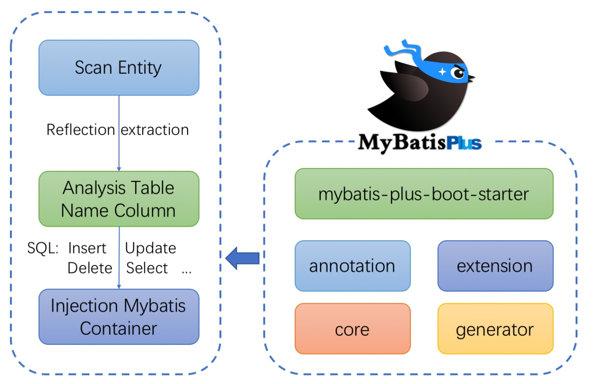

### 5、代码及文档地址

官方地址: http://mp.baomidou.com

代码发布地址:

Github: https://github.combaomidou/mybatis-plus

Gitee: https://gitee.com/baomidou/mybatis-plus

文档发布地址: https://baomidou.com/pages/24112f  

## 二、入门案例 

### 1、开发环境

IDE：idea 2019.2

JDK：JDK8+

构建工具：maven 3.5.4

MySQL版本：MySQL 5.7 

Spring Boot：2.6.3

MyBatis-Plus：3.5.1 

### 2、创建数据库及表

a.创建表 

```sql
CREATE DATABASE `mybatis_plus` /*!40100 DEFAULT CHARACTER SET utf8mb4 */;
use `mybatis_plus`;
CREATE TABLE `user` (
`id` bigint(20) NOT NULL COMMENT '主键ID',
`name` varchar(30) DEFAULT NULL COMMENT '姓名',
`age` int(11) DEFAULT NULL COMMENT '年龄',
`email` varchar(50) DEFAULT NULL COMMENT '邮箱',
PRIMARY KEY (`id`)
) ENGINE=InnoDB DEFAULT CHARSET=utf8;
```

b.添加数据 

```sql
INSERT INTO user (id, name, age, email) VALUES
(1, 'Jone', 18, 'test1@baomidou.com'),
(2, 'Jack', 20, 'test2@baomidou.com'),
(3, 'Tom', 28, 'test3@baomidou.com'),
(4, 'Sandy', 21, 'test4@baomidou.com'),
(5, 'Billie', 24, 'test5@baomidou.com');
```

### 3、创建Spring Boot工程 

a.初始化工程

使用 Spring Initializr 快速初始化一个 Spring Boot 工程 

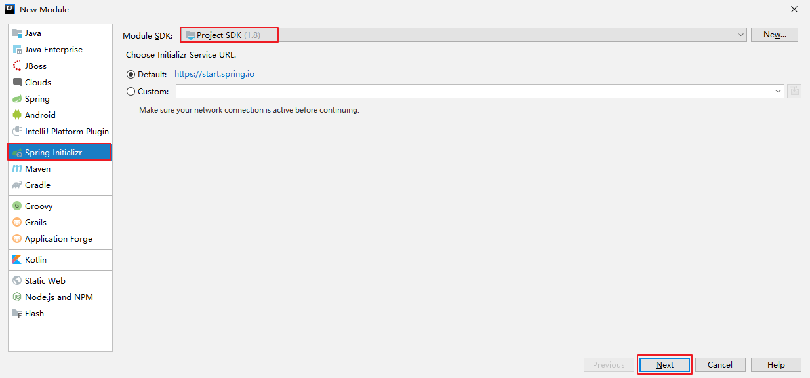

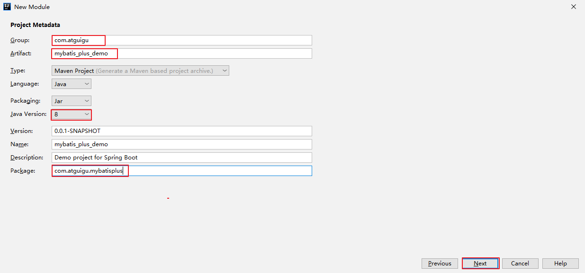

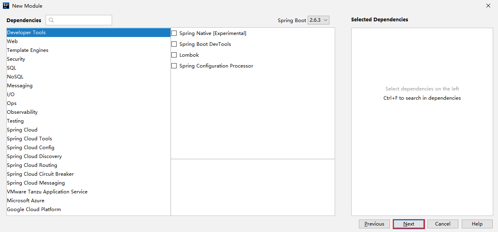

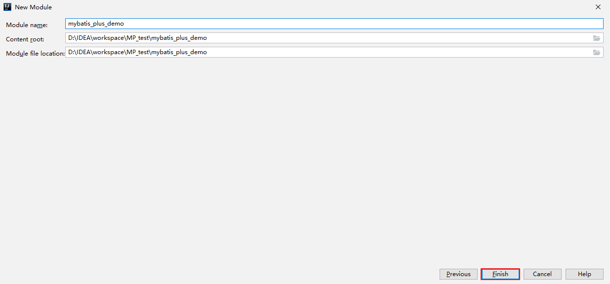

b.引入依赖 

```xml
<dependencies>
  <dependency>
    <groupId>org.springframework.boot</groupId>
    <artifactId>spring-boot-starter</artifactId>
  </dependency>
  <dependency>
    <groupId>org.springframework.boot</groupId>
    <artifactId>spring-boot-starter-test</artifactId>
    <scope>test</scope>
  </dependency>
  <dependency>
    <groupId>com.baomidou</groupId>
    <artifactId>mybatis-plus-boot-starter</artifactId>
    <version>3.5.1</version>
  </dependency>
  <dependency>
    <groupId>org.projectlombok</groupId>
    <artifactId>lombok</artifactId>
    <optional>true</optional>
  </dependency>
  <dependency>
    <groupId>mysql</groupId>
    <artifactId>mysql-connector-java</artifactId>
    <scope>runtime</scope>
  </dependency>
</dependencies>
```

c.idea中安装lombok插件 

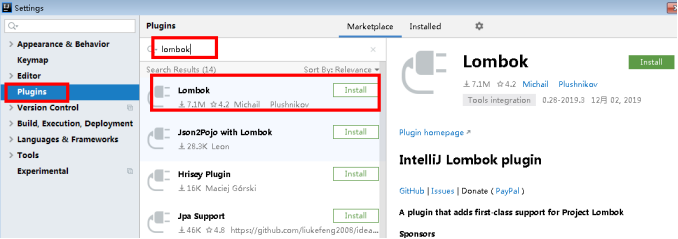

### 4、编写代码

**a.配置application.yml**  

```yaml
spring:
  # 配置数据源信息
  datasource:
    # 配置数据源类型
    type: com.zaxxer.hikari.HikariDataSource
    # 配置连接数据库的各个信息
    driver-class-name: com.mysql.cj.jdbc.Driver
    url: jdbc:mysql://192.168.11.130:3306/mybatis_plus?serverTimezone=GMT%2B8&characterEncoding=utf-8&useSSL=false
    username: root
    password: root
```

注意： 

1、驱动类driver-class-name

spring boot 2.0（内置jdbc5驱动），驱动类使用：  

driver-class-name: com.mysql.jdbc.Driver

spring boot 2.1及以上（内置jdbc8驱动），驱动类使用：

driver-class-name: com.mysql.cj.jdbc.Driver

否则运行测试用例的时候会有 WARN 信息

2、连接地址url

MySQL5.7版本的url：

jdbc:mysql://localhost:3306/mybatis_plus?characterEncoding=utf-8&useSSL=false

MySQL8.0版本的url：

jdbc:mysql://localhost:3306/mybatis_plus?serverTimezone=GMT%2B8&characterEncoding=utf-8&useSSL=false

否则运行测试用例报告如下错误：

java.sql.SQLException: The server time zone value 'Öйú±ê׼ʱ¼ä' is unrecognized or represents more  

**b.启动类** 

在Spring Boot启动类中添加@MapperScan注解，扫描mapper包 

```java
@SpringBootApplication
@MapperScan("com.atguigu.mybatisplus.mapper")
public class MybatisplusApplication {
    public static void main(String[] args) {
        SpringApplication.run(MybatisplusApplication.class, args);
    }
}
```

**c.添加实体** 

```java
@Data //lombok注解
public class User {
    private Long id;
    private String name;
    private Integer age;
    private String email;
}
```

User类编译之后的结果： 

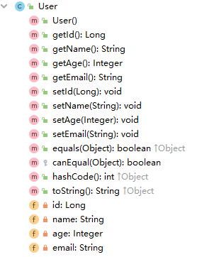

**d.添加mapper** 

BaseMapper是MyBatis-Plus提供的模板mapper，其中包含了基本的CRUD方法，泛型为操作的实体类型 

```java
@Repository
public interface UserMapper extends BaseMapper<User> {
}
```

**e.测试** 

```java
@SpringBootTest
public class MybatisPlusTest {
    @Autowired
    private UserMapper userMapper;
    @Test
    public void testSelectList(){
        //selectList()根据MP内置的条件构造器查询一个list集合，null表示没有条件，即查询所有
        userMapper.selectList(null).forEach(System.out::println);
    }
}
```

**结果：** 

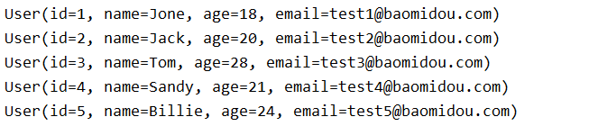

**注意：** 

IDEA在 userMapper 处报错，因为找不到注入的对象，因为类是动态创建的，但是程序可以正确的执行。

为了避免报错，可以在mapper接口上添加 @Repository 注解  

**f.添加日志**

在application.yml中配置日志输出 

```yaml
# 配置MyBatis日志
mybatis-plus:
  configuration:
    log-impl: org.apache.ibatis.logging.stdout.StdOutImpl
```

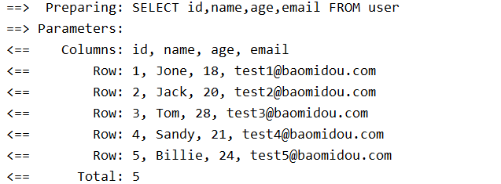

## 三、基本CRUD 

### 1、BaseMapper

MyBatis-Plus中的基本CRUD在内置的BaseMapper中都已得到了实现，我们可以直接使用，接口如下： 

```java
package com.baomidou.mybatisplus.core.mapper;
/**
 * Mapper 继承该接口后，无需编写 mapper.xml 文件，即可获得CRUD功能
 * <p>这个 Mapper 支持 id 泛型</p>
 *
 * @author hubin
 * @since 2016-01-23
 */
public interface BaseMapper<T> extends Mapper<T> {

    /**
     * 插入一条记录
     *
     * @param entity 实体对象
     */
    int insert(T entity);

    /**
     * 根据 ID 删除
     *
     * @param id 主键ID
     */
    int deleteById(Serializable id);

    /**
     * 根据实体(ID)删除
     *
     * @param entity 实体对象
     * @since 3.4.4
     */
    int deleteById(T entity);

    /**
     * 根据 columnMap 条件，删除记录
     *
     * @param columnMap 表字段 map 对象
     */
    int deleteByMap(@Param(Constants.COLUMN_MAP) Map<String, Object> columnMap);

    /**
     * 根据 entity 条件，删除记录
     *
     * @param queryWrapper 实体对象封装操作类（可以为 null,里面的 entity 用于生成 where 语句）
     */
    int delete(@Param(Constants.WRAPPER) Wrapper<T> queryWrapper);

    /**
     * 删除（根据ID或实体 批量删除）
     *
     * @param idList 主键ID列表或实体列表(不能为 null 以及 empty)
     */
    int deleteBatchIds(@Param(Constants.COLLECTION) Collection<?> idList);

    /**
     * 根据 ID 修改
     *
     * @param entity 实体对象
     */
    int updateById(@Param(Constants.ENTITY) T entity);

    /**
     * 根据 whereEntity 条件，更新记录
     *
     * @param entity        实体对象 (set 条件值,可以为 null)
     * @param updateWrapper 实体对象封装操作类（可以为 null,里面的 entity 用于生成 where 语句）
     */
    int update(@Param(Constants.ENTITY) T entity, @Param(Constants.WRAPPER) Wrapper<T> updateWrapper);

    /**
     * 根据 ID 查询
     *
     * @param id 主键ID
     */
    T selectById(Serializable id);

    /**
     * 查询（根据ID 批量查询）
     *
     * @param idList 主键ID列表(不能为 null 以及 empty)
     */
    List<T> selectBatchIds(@Param(Constants.COLLECTION) Collection<? extends Serializable> idList);

    /**
     * 查询（根据 columnMap 条件）
     *
     * @param columnMap 表字段 map 对象
     */
    List<T> selectByMap(@Param(Constants.COLUMN_MAP) Map<String, Object> columnMap);

    /**
     * 根据 entity 条件，查询一条记录
     * <p>查询一条记录，例如 qw.last("limit 1") 限制取一条记录, 注意：多条数据会报异常</p>
     *
     * @param queryWrapper 实体对象封装操作类（可以为 null）
     */
    default T selectOne(@Param(Constants.WRAPPER) Wrapper<T> queryWrapper) {
        List<T> ts = this.selectList(queryWrapper);
        if (CollectionUtils.isNotEmpty(ts)) {
            if (ts.size() != 1) {
                throw ExceptionUtils.mpe("One record is expected, but the query result is multiple records");
            }
            return ts.get(0);
        }
        return null;
    }

    /**
     * 根据 Wrapper 条件，判断是否存在记录
     *
     * @param queryWrapper 实体对象封装操作类
     * @return
     */
    default boolean exists(Wrapper<T> queryWrapper) {
        Long count = this.selectCount(queryWrapper);
        return null != count && count > 0;
    }

    /**
     * 根据 Wrapper 条件，查询总记录数
     *
     * @param queryWrapper 实体对象封装操作类（可以为 null）
     */
    Long selectCount(@Param(Constants.WRAPPER) Wrapper<T> queryWrapper);

    /**
     * 根据 entity 条件，查询全部记录
     *
     * @param queryWrapper 实体对象封装操作类（可以为 null）
     */
    List<T> selectList(@Param(Constants.WRAPPER) Wrapper<T> queryWrapper);

    /**
     * 根据 Wrapper 条件，查询全部记录
     *
     * @param queryWrapper 实体对象封装操作类（可以为 null）
     */
    List<Map<String, Object>> selectMaps(@Param(Constants.WRAPPER) Wrapper<T> queryWrapper);

    /**
     * 根据 Wrapper 条件，查询全部记录
     * <p>注意： 只返回第一个字段的值</p>
     *
     * @param queryWrapper 实体对象封装操作类（可以为 null）
     */
    List<Object> selectObjs(@Param(Constants.WRAPPER) Wrapper<T> queryWrapper);

    /**
     * 根据 entity 条件，查询全部记录（并翻页）
     *
     * @param page         分页查询条件（可以为 RowBounds.DEFAULT）
     * @param queryWrapper 实体对象封装操作类（可以为 null）
     */
    <P extends IPage<T>> P selectPage(P page, @Param(Constants.WRAPPER) Wrapper<T> queryWrapper);

    /**
     * 根据 Wrapper 条件，查询全部记录（并翻页）
     *
     * @param page         分页查询条件
     * @param queryWrapper 实体对象封装操作类
     */
    <P extends IPage<Map<String, Object>>> P selectMapsPage(P page, @Param(Constants.WRAPPER) Wrapper<T> queryWrapper);
}
```

### 2、插入 

```java
@Test
public void testInsert(){
    User user = new User(null, "张三", 23, "zhangsan@atguigu.com");
    //INSERT INTO user ( id, name, age, email ) VALUES ( ?, ?, ?, ? )
    int result = userMapper.insert(user);
    System.out.println("受影响行数："+result);
    //1475754982694199298
    System.out.println("id自动获取："+user.getId());
}
```

最终执行的结果，所获取的id为1475754982694199298

这是因为MyBatis-Plus在实现插入数据时，会默认基于雪花算法的策略生成id  

### 3、删除

#### a>通过id删除记录  

```java
@Test
public void testDeleteById(){
    //通过id删除用户信息
    //DELETE FROM user WHERE id=?
    int result = userMapper.deleteById(1475754982694199298L);
    System.out.println("受影响行数："+result);
}
```

#### b>通过id批量删除记录 

```java
@Test
public void testDeleteBatchIds(){
    //通过多个id批量删除
    //DELETE FROM user WHERE id IN ( ? , ? , ? )
    List<Long> idList = Arrays.asList(1L, 2L, 3L);
    int result = userMapper.deleteBatchIds(idList);
    System.out.println("受影响行数："+result);
}
```

#### c>通过map条件删除记录 

```java
@Test
public void testDeleteByMap(){
    //根据map集合中所设置的条件删除记录
    //DELETE FROM user WHERE name = ? AND age = ?
    Map<String, Object> map = new HashMap<>();
    map.put("age", 23);
    map.put("name", "张三");
    int result = userMapper.deleteByMap(map);
    System.out.println("受影响行数："+result);
}
```

### 4、修改 

```java
@Test
public void testUpdateById(){
    User user = new User(4L, "admin", 22, null);
    //UPDATE user SET name=?, age=? WHERE id=?
    int result = userMapper.updateById(user);
    System.out.println("受影响行数："+result);
}
```

### 5、查询

#### a>根据id查询用户信息 

```java
@Test
public void testSelectById(){
    //根据id查询用户信息
    //SELECT id,name,age,email FROM user WHERE id=?
    User user = userMapper.selectById(4L);
    System.out.println(user);
}
```

#### b>根据多个id查询多个用户信息 

```java
@Test
public void testSelectBatchIds(){
    //根据多个id查询多个用户信息
    //SELECT id,name,age,email FROM user WHERE id IN ( ? , ? )
    List<Long> idList = Arrays.asList(4L, 5L);
    List<User> list = userMapper.selectBatchIds(idList);
    list.forEach(System.out::println);
}
```

#### c>通过map条件查询用户信息 

```java
@Test
public void testSelectByMap(){
    //通过map条件查询用户信息
    //SELECT id,name,age,email FROM user WHERE name = ? AND age = ?
    Map<String, Object> map = new HashMap<>();
    map.put("age", 22);
    map.put("name", "admin");
    List<User> list = userMapper.selectByMap(map);
    list.forEach(System.out::println);
}
```

#### d>查询所有数据 

```java
@Test
public void testSelectList(){
    //查询所有用户信息
    //SELECT id,name,age,email FROM user
    List<User> list = userMapper.selectList(null);
    list.forEach(System.out::println);
}
```

通过观察BaseMapper中的方法，大多方法中都有Wrapper类型的形参，此为条件构造器，可针对于SQL语句设置不同的条件，若没有条件，则可以为该形参赋值null，即查询（删除/修改）所有数据  

### 6、自定义功能

配置mapper.xml文件地址

默认地址：classpath*:/mapper/**/*.xml（可以不写）

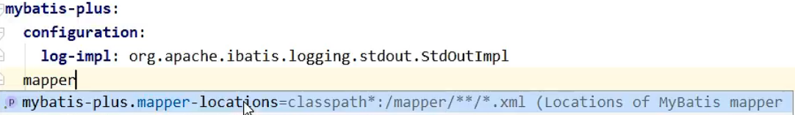

创建mapper文件夹、创建UserMapper.xml映射文件


```java
@Repository
public interface UserMapper extends BaseMapper<User> {

    /**
     * 根据id查询用户信息为map集合
     *
     * @param id
     * @return
     */
    Map<String, Object> selectMapById(Long id);
}
<?xml version="1.0" encoding="UTF-8" ?>
<!DOCTYPE mapper
        PUBLIC "-//mybatis.org//DTD Mapper 3.0//EN"
        "http://mybatis.org/dtd/mybatis-3-mapper.dtd">
<mapper namespace="com.atguigu.mybatisplus.mapper.UserMapper">

    <!--Map<String, Object> selectMapById(Long id);-->
    <select id="selectMapById" resultType="map">
        select id, name, age, email
        from user
        where id = #{id}
    </select>
</mapper>
@Test
public void testSelect(){
    Map<String, Object> map = userMapper.selectMapById(1L);
    System.out.println(map);
}
```

### 7、通用Service 

说明:

通用 Service CRUD 封装IService接口，进一步封装 CRUD 采用 get 查询单行 remove 删除 list 查询集合 page 分页 前缀命名方式区分 Mapper 层避免混淆，泛型 T 为任意实体对象

建议如果存在自定义通用 Service 方法的可能，请创建自己的 IBaseService 继承Mybatis-Plus 提供的基类

官网地址：https://baomidou.com/pages/49cc81/#service-crud-%E6%8E%A5%E5%8F%A3 

#### a>IService

MyBatis-Plus中有一个接口 IService和其实现类 ServiceImpl，封装了常见的业务层逻辑详情查看源码IService和ServiceImpl 

#### b>创建Service接口和实现类 

```java
/**
* UserService继承IService模板提供的基础功能
*/
public interface UserService extends IService<User> {
}
/**
* ServiceImpl实现了IService，提供了IService中基础功能的实现
* 若ServiceImpl无法满足业务需求，则可以使用自定的UserService定义方法，并在实现类中实现
*/
@Service
public class UserServiceImpl extends ServiceImpl<UserMapper, User> implements UserService {
}
```

#### c>测试查询记录数 

```java
@Autowired
private UserService userService;

@Test
public void testGetCount(){
    long count = userService.count();
    System.out.println("总记录数：" + count);
}
```

#### d>测试批量插入 

```java
@Test
public void testSaveBatch(){
    // SQL长度有限制，海量数据插入单条SQL无法实行，
    // 因此MP将批量插入放在了通用Service中实现，而不是通用Mapper
    ArrayList<User> users = new ArrayList<>();
    for (int i = 0; i < 5; i++) {
        User user = new User();
        user.setName("ybc" + i);
        user.setAge(20 + i);
        users.add(user);
    } 
    //SQL:INSERT INTO t_user ( username, age ) VALUES ( ?, ? )
    userService.saveBatch(users);
}
```

## 四、常用注解 

### 1、@TableName 

经过以上的测试，在使用MyBatis-Plus实现基本的CRUD时，我们并没有指定要操作的表，只是在Mapper接口继承BaseMapper时，设置了泛型User，而操作的表为user表

由此得出结论，MyBatis-Plus在确定操作的表时，由BaseMapper的泛型决定，即实体类型决定，且默认操作的表名和实体类型的类名一致  

#### a>问题 

若实体类类型的类名和要操作的表的表名不一致，会出现什么问题？ 

我们将表user更名为t_user，测试查询功能

程序抛出异常，Table 'mybatis_plus.user' doesn't exist，因为现在的表名为t_user，而默认操作的表名和实体类型的类名一致，即user表  

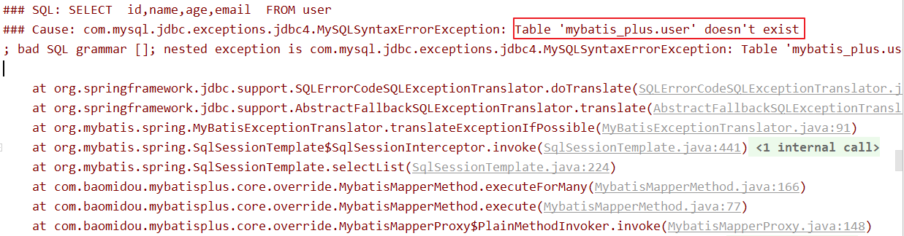

#### b>通过@TableName解决问题 

在实体类类型上添加@TableName("t_user")，标识实体类对应的表，即可成功执行SQL语句 

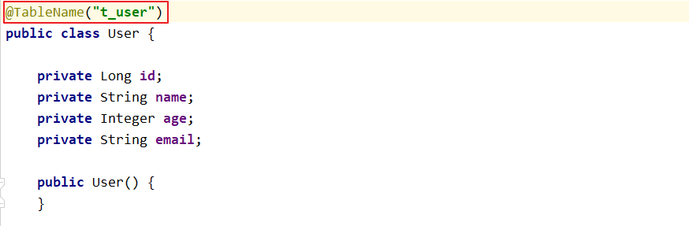

#### c>通过全局配置解决问题 

在开发的过程中，我们经常遇到以上的问题，即实体类所对应的表都有固定的前缀，例如t_或tbl_

此时，可以使用MyBatis-Plus提供的全局配置，为实体类所对应的表名设置默认的前缀，那么就不需要在每个实体类上通过@TableName标识实体类对应的表  

```yaml
mybatis-plus:
  configuration:
    log-impl: org.apache.ibatis.logging.stdout.StdOutImpl
  # 设置MyBatis-Plus的全局配置
  global-config:
    db-config:
      # 设置实体类所对应的表的统一前缀
      table-prefix: t_
```

### 2、@TableId 

经过以上的测试，MyBatis-Plus在实现CRUD时，会默认将id作为主键列，并在插入数据时，默认基于雪花算法的策略生成id  

#### a>问题 

若实体类和表中表示主键的不是id，而是其他字段，例如uid，MyBatis-Plus会自动识别uid为主键列吗？

我们实体类中的属性id改为uid，将表中的字段id也改为uid，测试添加功能  

程序抛出异常，Field 'uid' doesn't have a default value，说明MyBatis-Plus没有将uid作为主键赋值 

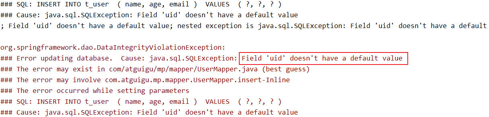

#### b>通过@TableId解决问题 

在实体类中uid属性上通过@TableId将其标识为主键，即可成功执行SQL语句 

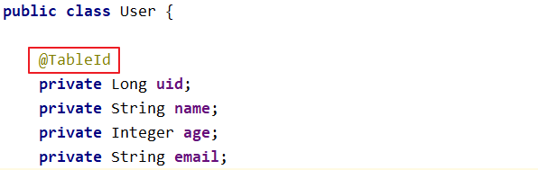

#### c>@TableId的value属性 

若实体类中主键对应的属性为id，而表中表示主键的字段为uid，此时若只在属性id上添加注解@TableId，则抛出异常Unknown column 'id' in 'field list'，即MyBatis-Plus仍然会将id作为表的主键操作，而表中表示主键的是字段uid

此时需要通过@TableId注解的value属性，指定表中的主键字段，@TableId("uid")或@TableId(value="uid") 

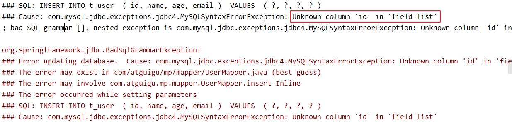

#### d>@TableId的type属性 

type属性用来定义主键策略 

**常用的主键策略：** 

| 值                       | 描述                                                         |
| ------------------------ | ------------------------------------------------------------ |
| IdType.ASSIGN_ID（默认） | 基于雪花算法的策略生成数据id，与数据库id是否设置自增无关     |
| IdType.AUTO              | 使用数据库的自增策略，注意，该类型请确保数据库设置了id自增，否则无效 |

**配置全局主键策略：**  

```yaml
mybatis-plus:
  configuration:
    log-impl: org.apache.ibatis.logging.stdout.StdOutImpl
  # 设置MyBatis-Plus的全局配置
  global-config:
    db-config:
      # 设置实体类所对应的表的统一前缀
      table-prefix: t_
      # 设置统一的主键生成策略
      id-type: auto
```

**注意**：如果在插入的数据的时候主键已经设置的对应的值，就不会在使用主键策略重新赋值。

#### e>雪花算法

- **背景**

需要选择合适的方案去应对数据规模的增长，以应对逐渐增长的访问压力和数据量。

数据库的扩展方式主要包括：业务分库、主从复制，数据库分表。

- **数据库分表**

将不同业务数据分散存储到不同的数据库服务器，能够支撑百万甚至千万用户规模的业务，但如果业务继续发展，同一业务的单表数据也会达到单台数据库服务器的处理瓶颈。例如，淘宝的几亿用户数据，如果全部存放在一台数据库服务器的一张表中，肯定是无法满足性能要求的，此时就需要对单表数据进行拆分。

单表数据拆分有两种方式：垂直分表和水平分表。示意图如下： 

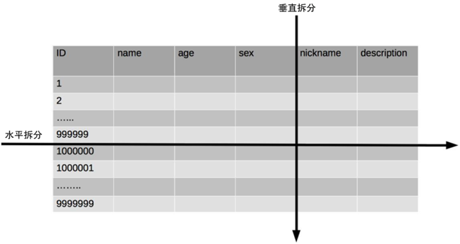

- **垂直分表**

垂直分表适合将表中某些不常用且占了大量空间的列拆分出去。

例如，前面示意图中的 nickname 和 description 字段，假设我们是一个婚恋网站，用户在筛选其他用户的时候，主要是用 age 和 sex 两个字段进行查询，而 nickname 和 description 两个字段主要用于展示，一般不会在业务查询中用到。description 本身又比较长，因此我们可以将这两个字段独立到另外一张表中，这样在查询 age 和 sex 时，就能带来一定的性能提升。

- **水平分表** 

水平分表适合表行数特别大的表，有的公司要求单表行数超过 5000 万就必须进行分表，这个数字可以作为参考，但并不是绝对标准，关键还是要看表的访问性能。对于一些比较复杂的表，可能超过 1000万就要分表了；而对于一些简单的表，即使存储数据超过 1 亿行，也可以不分表。

但不管怎样，当看到表的数据量达到千万级别时，作为架构师就要警觉起来，因为这很可能是架构的性能瓶颈或者隐患。

水平分表相比垂直分表，会引入更多的复杂性，例如要求全局唯一的数据id该如何处理 

主键自增 

①以最常见的用户 ID 为例，可以按照 1000000 的范围大小进行分段，1 ~ 999999 放到表 1中，1000000 ~ 1999999 放到表2中，以此类推。

②复杂点：分段大小的选取。分段太小会导致切分后子表数量过多，增加维护复杂度；分段太大可能会导致单表依然存在性能问题，一般建议分段大小在 100 万至 2000 万之间，具体需要根据业务选取合适的分段大小。

③优点：可以随着数据的增加平滑地扩充新的表。例如，现在的用户是 100 万，如果增加到 1000 万，只需要增加新的表就可以了，原有的数据不需要动。

④缺点：分布不均匀。假如按照 1000 万来进行分表，有可能某个分段实际存储的数据量只有 1 条，而另外一个分段实际存储的数据量有 1000 万条。 

取模 

①同样以用户 ID 为例，假如我们一开始就规划了 10 个数据库表，可以简单地用 user_id % 10 的值来表示数据所属的数据库表编号，ID 为 985 的用户放到编号为 5 的子表中，ID 为 10086 的用户放到编号为 6 的子表中。

②复杂点：初始表数量的确定。表数量太多维护比较麻烦，表数量太少又可能导致单表性能存在问题。

③优点：表分布比较均匀。

④缺点：扩充新的表很麻烦，所有数据都要重分布 

雪花算法

雪花算法是由Twitter公布的分布式主键生成算法，它能够保证不同表的主键的不重复性，以及相同表的主键的有序性。

①核心思想：

长度共64bit（一个long型）。

首先是一个符号位，1bit标识，由于long基本类型在Java中是带符号的，最高位是符号位，正数是0，负数是1，所以id一般是正数，最高位是0。

41bit时间截(毫秒级)，存储的是时间截的差值（当前时间截 - 开始时间截)，结果约等于69.73年。

10bit作为机器的ID（5个bit是数据中心，5个bit的机器ID，可以部署在1024个节点）。

12bit作为毫秒内的流水号（意味着每个节点在每毫秒可以产生 4096 个 ID）。  

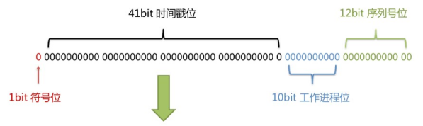

②优点：整体上按照时间自增排序，并且整个分布式系统内不会产生ID碰撞，并且效率较高。 

### 3、@TableField 

经过以上的测试，我们可以发现，MyBatis-Plus在执行SQL语句时，要保证实体类中的属性名和表中的字段名一致

如果实体类中的属性名和字段名不一致的情况，会出现什么问题呢？  

#### a>情况1

若实体类中的属性使用的是驼峰命名风格，而表中的字段使用的是下划线命名风格

例如实体类属性userName，表中字段user_name

此时MyBatis-Plus会自动将下划线命名风格转化为驼峰命名风格

相当于在MyBatis中配置

#### b>情况2

若实体类中的属性和表中的字段不满足情况1

例如实体类属性name，表中字段username

此时需要在实体类属性上使用@TableField("username")设置属性所对应的字段名 

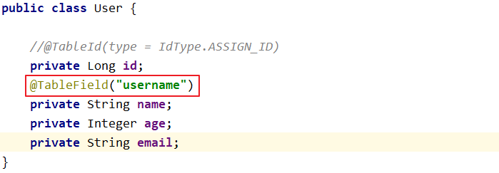

### 4、@TableLogic

#### a>逻辑删除

- 物理删除：真实删除，将对应数据从数据库中删除，之后查询不到此条被删除的数据
- 逻辑删除：假删除，将对应数据中代表是否被删除字段的状态修改为“被删除状态”，之后在数据库中仍旧能看到此条数据记录
- 使用场景：可以进行数据恢复 

#### b>实现逻辑删除 

step1：数据库中创建逻辑删除状态列，设置默认值为0 

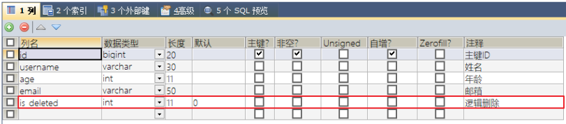

step2：实体类中添加逻辑删除属性 

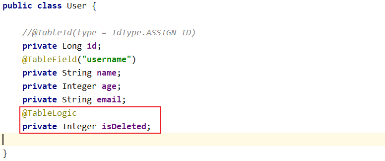

step3：测试

测试删除功能，真正执行的是修改

UPDATE t_user SET is_deleted=1 WHERE id=? AND is_deleted=0

测试查询功能，被逻辑删除的数据默认不会被查询

SELECT id,username AS name,age,email,is_deleted FROM t_user WHERE is_deleted=0  

