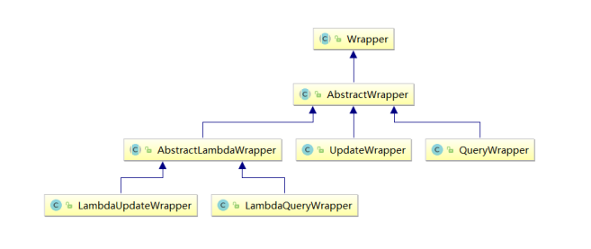
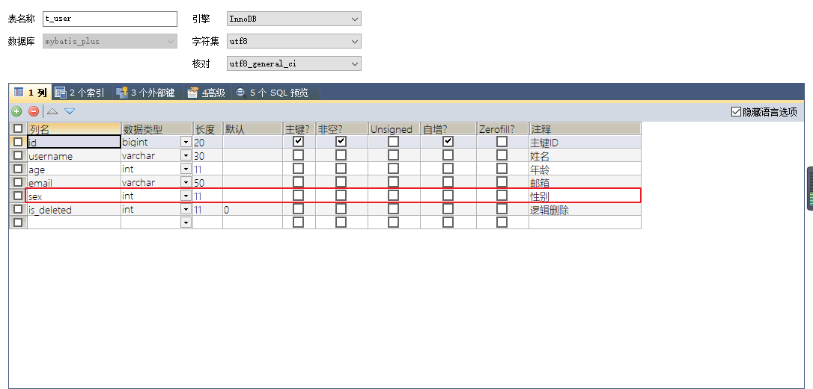

# MyBatis-Plus（二）

## 五、条件构造器和常用接口

### 1、wapper介绍 



- Wrapper ： 条件构造抽象类，最顶端父类

- - AbstractWrapper ： 用于查询条件封装，生成 sql 的 where 条件

- - - QueryWrapper ： 查询条件封装
    - UpdateWrapper ： Update 条件封装
    - AbstractLambdaWrapper ： 使用Lambda 语法

- - - - LambdaQueryWrapper ：用于Lambda语法使用的查询Wrapper
      - LambdaUpdateWrapper ： Lambda 更新封装Wrapper  

### 2、QueryWrapper

#### a>例1：组装查询条件 

```java
@Test
public void test01(){
    //查询用户名包含a，年龄在20到30之间，并且邮箱不为null的用户信息
    //SELECT id,username AS name,age,email,is_deleted FROM t_user WHERE is_deleted=0 AND (username LIKE ? AND age BETWEEN ? AND ? AND email IS NOT NULL)
    QueryWrapper<User> queryWrapper = new QueryWrapper<>();
    queryWrapper.like("username", "a")
        .between("age", 20, 30)
        .isNotNull("email");
    List<User> list = userMapper.selectList(queryWrapper);
    list.forEach(System.out::println);
}
```

#### b>例2：组装排序条件 

```java
@Test
public void test02(){
    //按年龄降序查询用户，如果年龄相同则按id升序排列
    //SELECT id,username AS name,age,email,is_deleted FROM t_user WHERE is_deleted=0 ORDER BY age DESC,id ASC
    QueryWrapper<User> queryWrapper = new QueryWrapper<>();
        queryWrapper
        .orderByDesc("age")
        .orderByAsc("id");
    List<User> users = userMapper.selectList(queryWrapper);
    users.forEach(System.out::println);
}
```

#### c>例3：组装删除条件 

```java
@Test
public void test03(){
    //删除email为空的用户
    //DELETE FROM t_user WHERE (email IS NULL)
    QueryWrapper<User> queryWrapper = new QueryWrapper<>();
    queryWrapper.isNull("email");
    //条件构造器也可以构建删除语句的条件
    int result = userMapper.delete(queryWrapper);
    System.out.println("受影响的行数：" + result);
}
```

#### d>例4：条件的优先级 

```java
@Test
public void test04() {
    QueryWrapper<User> queryWrapper = new QueryWrapper<>();
    //将（年龄大于20并且用户名中包含有a）或邮箱为null的用户信息修改
    //UPDATE t_user SET age=?, email=? WHERE (username LIKE ? AND age > ? OR email IS NULL)
    queryWrapper
        .like("username", "a")
        .gt("age", 20)
        .or()
        .isNull("email");
    User user = new User();
    user.setAge(18);
    user.setEmail("user@atguigu.com");
    int result = userMapper.update(user, queryWrapper);
    System.out.println("受影响的行数：" + result);
}
@Test
public void test04() {
    QueryWrapper<User> queryWrapper = new QueryWrapper<>();
    //将用户名中包含有a并且（年龄大于20或邮箱为null）的用户信息修改
    //UPDATE t_user SET age=?, email=? WHERE (username LIKE ? AND (age > ? OR email IS NULL))
    //lambda表达式内的逻辑优先运算
    queryWrapper
        .like("username", "a")
        .and(i -> i.gt("age", 20).or().isNull("email"));
    User user = new User();
    user.setAge(18);
    user.setEmail("user@atguigu.com");
    int result = userMapper.update(user, queryWrapper);
    System.out.println("受影响的行数：" + result);
}
```

#### e>例5：组装select子句 

```java
@Test
public void test05() {
    //查询用户信息的username和age字段
    //SELECT username,age FROM t_user
    QueryWrapper<User> queryWrapper = new QueryWrapper<>();
    queryWrapper.select("username", "age");
    //selectMaps()返回Map集合列表，通常配合select()使用，避免User对象中没有被查询到的列值为null
    List<Map<String, Object>> maps = userMapper.selectMaps(queryWrapper);
    maps.forEach(System.out::println);
}
```

#### f>例6：实现子查询 

```java
@Test
public void test06() {
    //查询id小于等于3的用户信息
    //SELECT id,username AS name,age,email,is_deleted FROM t_user WHERE (id IN(select id from t_user where id <= 3))
    QueryWrapper<User> queryWrapper = new QueryWrapper<>();
    queryWrapper.inSql("id", "select id from t_user where id <= 3");
    List<User> list = userMapper.selectList(queryWrapper);
    list.forEach(System.out::println);
}
```

### 3、UpdateWrapper 

```java
@Test
public void test07() {
    //将（年龄大于20或邮箱为null）并且用户名中包含有a的用户信息修改
    //组装set子句以及修改条件
    UpdateWrapper<User> updateWrapper = new UpdateWrapper<>();
    //lambda表达式内的逻辑优先运算
    updateWrapper
        .set("age", 18)
        .set("email", "user@atguigu.com")
        .like("username", "a")
        .and(i -> i.gt("age", 20).or().isNull("email"));
    //这里必须要创建User对象，否则无法应用自动填充。如果没有自动填充，可以设置为null
    //UPDATE t_user SET username=?, age=?,email=? WHERE (username LIKE ? AND (age > ? OR email IS NULL))
    //User user = new User();
    //user.setName("张三");
    //int result = userMapper.update(user, updateWrapper);
    //UPDATE t_user SET age=?,email=? WHERE (username LIKE ? AND (age > ? OR email IS NULL))
    int result = userMapper.update(null, updateWrapper);
    System.out.println(result);
}
```

### 4、condition

在真正开发的过程中，组装条件是常见的功能，而这些条件数据来源于用户输入，是可选的，因此我们在组装这些条件时，必须先判断用户是否选择了这些条件，若选择则需要组装该条件，若没有选择则一定不能组装，以免影响SQL执行的结果

#### 思路一： 

```java
@Test
public void test08() {
    //定义查询条件，有可能为null（用户未输入或未选择）
    String username = null;
    Integer ageBegin = 10;
    Integer ageEnd = 24;
    QueryWrapper<User> queryWrapper = new QueryWrapper<>();
    //StringUtils.isNotBlank()判断某字符串是否不为空且长度不为0且不由空白符(whitespace)构成
    if(StringUtils.isNotBlank(username)){
        queryWrapper.like("username","a");
    } 
    if(ageBegin != null){
        queryWrapper.ge("age", ageBegin);
    } 
    if(ageEnd != null){
        queryWrapper.le("age", ageEnd);
    } 
    //SELECT id,username AS name,age,email,is_deleted FROM t_user WHERE (age >=? AND age <= ?)
    List<User> users = userMapper.selectList(queryWrapper);
    users.forEach(System.out::println);
}
```

#### 思路二：

上面的实现方案没有问题，但是代码比较复杂，我们可以使用带condition参数的重载方法构建查询条件，简化代码的编写 

```java
@Test
public void test08UseCondition() {
    //定义查询条件，有可能为null（用户未输入或未选择）
    String username = null;
    Integer ageBegin = 10;
    Integer ageEnd = 24;
    QueryWrapper<User> queryWrapper = new QueryWrapper<>();
    //StringUtils.isNotBlank()判断某字符串是否不为空且长度不为0且不由空白符(whitespace)构成
    queryWrapper
        .like(StringUtils.isNotBlank(username), "username", "a")
        .ge(ageBegin != null, "age", ageBegin)
        .le(ageEnd != null, "age", ageEnd);
    //SELECT id,username AS name,age,email,is_deleted FROM t_user WHERE (age >= ? AND age <= ?)
    List<User> users = userMapper.selectList(queryWrapper);
    users.forEach(System.out::println);
}
```

### 5、LambdaQueryWrapper 

```java
@Test
public void test09() {
    //定义查询条件，有可能为null（用户未输入）
    String username = "a";
    Integer ageBegin = 10;
    Integer ageEnd = 24;
    LambdaQueryWrapper<User> queryWrapper = new LambdaQueryWrapper<>();
    //避免使用字符串表示字段，防止运行时错误
    queryWrapper
        .like(StringUtils.isNotBlank(username), User::getName, username)
        .ge(ageBegin != null, User::getAge, ageBegin)
        .le(ageEnd != null, User::getAge, ageEnd);
    List<User> users = userMapper.selectList(queryWrapper);
    users.forEach(System.out::println);
}
```

### 6、LambdaUpdateWrapper 

```java
@Test
public void test10() {
    //组装set子句
    LambdaUpdateWrapper<User> updateWrapper = new LambdaUpdateWrapper<>();
    updateWrapper
        .set(User::getAge, 18)
        .set(User::getEmail, "user@atguigu.com")
        .like(User::getName, "a")
        .and(i -> i.lt(User::getAge, 24).or().isNull(User::getEmail)); //lambda表达式内的逻辑优先运算
    User user = new User();
    int result = userMapper.update(user, updateWrapper);
    System.out.println("受影响的行数：" + result);
}
```

## 六、插件

### 1、分页插件

MyBatis Plus自带分页插件，只要简单的配置即可实现分页功能

#### a>添加配置类 

```java
@Configuration
@MapperScan("com.atguigu.mybatisplus.mapper") //可以将主类中的注解移到此处
public class MybatisPlusConfig {
    @Bean
    public MybatisPlusInterceptor mybatisPlusInterceptor() {
        MybatisPlusInterceptor interceptor = new MybatisPlusInterceptor();
        interceptor.addInnerInterceptor(new PaginationInnerInterceptor(DbType.MYSQL));
        return interceptor;
    }
}
```

#### b>测试 

```java
@Test
public void testPage(){
    //设置分页参数
    Page<User> page = new Page<>(1, 5);
    userMapper.selectPage(page, null);
    //获取分页数据
    List<User> list = page.getRecords();
    list.forEach(System.out::println);
    System.out.println("当前页："+page.getCurrent());
    System.out.println("每页显示的条数："+page.getSize());
    System.out.println("总记录数："+page.getTotal());
    System.out.println("总页数："+page.getPages());
    System.out.println("是否有上一页："+page.hasPrevious());
    System.out.println("是否有下一页："+page.hasNext());
}
```

测试结果：

User(id=1, name=Jone, age=18, email=test1@baomidou.com, isDeleted=0) 

User(id=2,name=Jack, age=20, email=test2@baomidou.com, isDeleted=0)

User(id=3, name=Tom,age=28, email=test3@baomidou.com, isDeleted=0) 

User(id=4, name=Sandy, age=21,email=test4@baomidou.com, isDeleted=0) 

User(id=5, name=Billie, age=24, email=test5@baomidou.com, isDeleted=0) 

当前页：1 

每页显示的条数：5 

总记录数：17 

总页数：4 

是否有上一页：false 

是否有下一页：true  

### 2、xml自定义分页

#### a>UserMapper中定义接口方法 

```java
/**
* 根据年龄查询用户列表，分页显示
* @param page 分页对象,xml中可以从里面进行取值,传递参数 Page 即自动分页,必须放在第一位
* @param age 年龄
* @return
*/
IPage<User> selectPageVo(@Param("page") Page<User> page, @Param("age")Integer age);
```

#### b>UserMapper.xml中编写SQL 

```xml
<!--SQL片段，记录基础字段-->
<sql id="BaseColumns">id,username,age,email</sql>

<!--IPage<User> selectPageVo(Page<User> page, Integer age);-->
<select id="selectPageVo" resultType="User">
  SELECT <include refid="BaseColumns"></include> FROM t_user WHERE age > #{age}
</select>
```

#### c>测试 

```java
@Test
public void testSelectPageVo(){
    //设置分页参数
    Page<User> page = new Page<>(1, 5);
    userMapper.selectPageVo(page, 20);
    //获取分页数据
    List<User> list = page.getRecords();
    list.forEach(System.out::println);
    System.out.println("当前页："+page.getCurrent());
    System.out.println("每页显示的条数："+page.getSize());
    System.out.println("总记录数："+page.getTotal());
    System.out.println("总页数："+page.getPages());
    System.out.println("是否有上一页："+page.hasPrevious());
    System.out.println("是否有下一页："+page.hasNext());
}
```

结果：

User(id=3, name=Tom, age=28, email=test3@baomidou.com, isDeleted=null)

 User(id=4,name=Sandy, age=21, email=test4@baomidou.com, isDeleted=null)

 User(id=5, name=Billie,age=24, email=test5@baomidou.com, isDeleted=null)

 User(id=8, name=ybc1, age=21,email=null, isDeleted=null)

 User(id=9, name=ybc2, age=22, email=null, isDeleted=null) 

当前页：1 

每页显示的条数：5 

总记录数：12 

总页数：3 

是否有上一页：false 

是否有下一页：true  

### 3、乐观锁 

#### a>场景

一件商品，成本价是80元，售价是100元。老板先是通知小李，说你去把商品价格增加50元。小李正在玩游戏，耽搁了一个小时。正好一个小时后，老板觉得商品价格增加到150元，价格太高，可能会影响销量。又通知小王，你把商品价格降低30元。

此时，小李和小王同时操作商品后台系统。小李操作的时候，系统先取出商品价格100元；小王也在操作，取出的商品价格也是100元。小李将价格加了50元，并将100+50=150元存入了数据库；小王将商品减了30元，并将100-30=70元存入了数据库。是的，如果没有锁，小李的操作就完全被小王的覆盖了。

现在商品价格是70元，比成本价低10元。几分钟后，这个商品很快出售了1千多件商品，老板亏1万多。

#### b>乐观锁与悲观锁 

上面的故事，如果是乐观锁，小王保存价格前，会检查下价格是否被人修改过了。如果被修改过了，则重新取出的被修改后的价格，150元，这样他会将120元存入数据库。

如果是悲观锁，小李取出数据后，小王只能等小李操作完之后，才能对价格进行操作，也会保证最终的价格是120元。 

#### c>模拟修改冲突

##### 数据库中增加商品表 

```sql
CREATE TABLE t_product
(
  id BIGINT(20) NOT NULL COMMENT '主键ID',
  NAME VARCHAR(30) NULL DEFAULT NULL COMMENT '商品名称',
  price INT(11) DEFAULT 0 COMMENT '价格',
  VERSION INT(11) DEFAULT 0 COMMENT '乐观锁版本号',
  PRIMARY KEY (id)
);
```

##### 添加数据 

```sql
INSERT INTO t_product (id, NAME, price) VALUES (1, '外星人笔记本', 100);
```

##### 添加实体 

```java
package com.atguigu.mybatisplus.entity;

import lombok.Data;

@Data
public class Product {
    private Long id;
    private String name;
    private Integer price;
    private Integer version;
}
```

##### 添加mapper 

```java
public interface ProductMapper extends BaseMapper<Product> {
}
```

##### 测试 

```java
@Test
public void testConcurrentUpdate() {
    //1、小李
    Product p1 = productMapper.selectById(1L);
    System.out.println("小李取出的价格：" + p1.getPrice());
    //2、小王
    Product p2 = productMapper.selectById(1L);
    System.out.println("小王取出的价格：" + p2.getPrice());
    //3、小李将价格加了50元，存入了数据库
    p1.setPrice(p1.getPrice() + 50);
    int result1 = productMapper.updateById(p1);
    System.out.println("小李修改结果：" + result1);
    //4、小王将商品减了30元，存入了数据库
    p2.setPrice(p2.getPrice() - 30);
    int result2 = productMapper.updateById(p2);
    System.out.println("小王修改结果：" + result2);
    //最后的结果
    Product p3 = productMapper.selectById(1L);
    //价格覆盖，最后的结果：70
    System.out.println("最后的结果：" + p3.getPrice());
}
```

#### d>乐观锁实现流程

数据库中添加version字段

取出记录时，获取当前version 

```sql
SELECT id,`name`,price,`version` FROM product WHERE id=1
```

更新时，version + 1，如果where语句中的version版本不对，则更新失败 

```sql
UPDATE product SET price=price+50, `version`=`version` + 1 WHERE id=1 AND `version`=1
```

#### e>Mybatis-Plus实现乐观锁

##### 修改实体类  

```java
package com.atguigu.mybatisplus.entity;
import com.baomidou.mybatisplus.annotation.Version;
import lombok.Data;
@Data
public class Product {
    private Long id;
    private String name;
    private Integer price;
    @Version
    private Integer version;
}
```

##### 添加乐观锁插件配置 

```java
@Bean
public MybatisPlusInterceptor mybatisPlusInterceptor(){
    MybatisPlusInterceptor interceptor = new MybatisPlusInterceptor();
    //添加分页插件
    interceptor.addInnerInterceptor(new PaginationInnerInterceptor(DbType.MYSQL));
    //添加乐观锁插件
    interceptor.addInnerInterceptor(new OptimisticLockerInnerInterceptor());
    return interceptor;
}
```

##### 测试修改冲突  

小李查询商品信息：

SELECT id,name,price,version FROM t_product WHERE id=?

小王查询商品信息：

SELECT id,name,price,version FROM t_product WHERE id=?

小李修改商品价格，自动将version+1

UPDATE t_product SET name=?, price=?, version=? WHERE id=? AND version=?

Parameters: 外星人笔记本(String), 150(Integer), 1(Integer), 1(Long), 0(Integer)

小王修改商品价格，此时version已更新，条件不成立，修改失败

UPDATE t_product SET name=?, price=?, version=? WHERE id=? AND version=?

Parameters: 外星人笔记本(String), 70(Integer), 1(Integer), 1(Long), 0(Integer)

最终，小王修改失败，查询价格：150

SELECT id,name,price,version FROM t_product WHERE id=? 

##### 优化流程 

```java
@Test
public void testConcurrentVersionUpdate() {
    //小李取数据
    Product p1 = productMapper.selectById(1L);
    //小王取数据
    Product p2 = productMapper.selectById(1L);
    //小李修改 + 50
    p1.setPrice(p1.getPrice() + 50);
    int result1 = productMapper.updateById(p1);
    System.out.println("小李修改的结果：" + result1);
    //小王修改 - 30
    p2.setPrice(p2.getPrice() - 30);
    int result2 = productMapper.updateById(p2);
    System.out.println("小王修改的结果：" + result2);
    if(result2 == 0){
        //失败重试，重新获取version并更新
        p2 = productMapper.selectById(1L);
        p2.setPrice(p2.getPrice() - 30);
        result2 = productMapper.updateById(p2);
    } 
    System.out.println("小王修改重试的结果：" + result2);
    //老板看价格
    Product p3 = productMapper.selectById(1L);
    System.out.println("老板看价格：" + p3.getPrice());
}
```

## 七、通用枚举 

表中的有些字段值是固定的，例如性别（男或女），此时我们可以使用MyBatis-Plus的通用枚举来实现  

### a>数据库表添加字段sex 

### b>创建通用枚举类型 

```java
package com.atguigu.mp.enums;
import com.baomidou.mybatisplus.annotation.EnumValue;
import lombok.Getter;
@Getter
public enum SexEnum {
    MALE(1, "男"),
    FEMALE(2, "女");
    @EnumValue //将注解所标识的属性的值存储到数据库中
    private Integer sex;
    private String sexName;
    SexEnum(Integer sex, String sexName) {
        this.sex = sex;
        this.sexName = sexName;
    }
}
```

### c>配置扫描通用枚举 

```yaml
mybatis-plus:
  configuration:
    log-impl: org.apache.ibatis.logging.stdout.StdOutImpl
  # 设置MyBatis-Plus的全局配置
  global-config:
    db-config:
      # 设置实体类所对应的表的统一前缀
      table-prefix: t_
      # 设置统一的主键生成策略
      id-type: auto
  # 配置类型别名所对应的包
  type-aliases-package: com.atguigu.mybatisplus.pojo
  # 扫描通用枚举的包
  type-enums-package: com.atguigu.mybatisplus.enums
```

### d>测试 

```java
@Test
public void testSexEnum(){
    User user = new User();
    user.setName("Enum");
    user.setAge(20);
    //设置性别信息为枚举项，会将@EnumValue注解所标识的属性值存储到数据库
    user.setSex(SexEnum.MALE);
    //INSERT INTO t_user ( username, age, sex ) VALUES ( ?, ?, ? )
    //Parameters: Enum(String), 20(Integer), 1(Integer)
    userMapper.insert(user);
}
```

## 八、代码生成器

### 1、引入依赖 

```xml
<dependency>
  <groupId>com.baomidou</groupId>
  <artifactId>mybatis-plus-generator</artifactId>
  <version>3.5.1</version>
</dependency>
<dependency>
  <groupId>org.freemarker</groupId>
  <artifactId>freemarker</artifactId>
  <version>2.3.31</version>
</dependency>
```

### 2、快速生成 

```java
public class FastAutoGeneratorTest {
    public static void main(String[] args) {
        FastAutoGenerator.create("jdbc:mysql://127.0.0.1:3306/mybatis_plus?characterEncoding=utf-8&userSSL=false", "root", "123456")
            .globalConfig(builder -> {
                builder.author("atguigu") // 设置作者
                    //.enableSwagger() // 开启 swagger 模式
                    .fileOverride() // 覆盖已生成文件
                    .outputDir("D://mybatis_plus"); // 指定输出目录
            })
            .packageConfig(builder -> {
                builder.parent("com.atguigu") // 设置父包名
                    .moduleName("mybatisplus") // 设置父包模块名
                    .pathInfo(Collections.singletonMap(OutputFile.mapperXml, "D://mybatis_plus"));// 设置mapperXml生成路径
            })
            .strategyConfig(builder -> {
                builder.addInclude("t_user") // 设置需要生成的表名
                    .addTablePrefix("t_", "c_"); // 设置过滤表前缀
            })
            .templateEngine(new FreemarkerTemplateEngine()) // 使用Freemarker引擎模板，默认的是Velocity引擎模板
            .execute();
    }
}
```

## 九、多数据源 

适用于多种场景：纯粹多库、 读写分离、 一主多从、 混合模式等

目前我们就来模拟一个纯粹多库的一个场景，其他场景类似

场景说明：

我们创建两个库，分别为：mybatis_plus（以前的库不动）与mybatis_plus_1（新建），将mybatis_plus库的product表移动到mybatis_plus_1库，这样每个库一张表，通过一个测试用例
分别获取用户数据与商品数据，如果获取到说明多库模拟成功

### 1、创建数据库及表

创建数据库mybatis_plus_1和表product  

```plsql
CREATE DATABASE `mybatis_plus_1` /*!40100 DEFAULT CHARACTER SET utf8mb4 */;
use `mybatis_plus_1`;
CREATE TABLE product
(
      id BIGINT(20) NOT NULL COMMENT '主键ID',
      name VARCHAR(30) NULL DEFAULT NULL COMMENT '商品名称',
      price INT(11) DEFAULT 0 COMMENT '价格',
      version INT(11) DEFAULT 0 COMMENT '乐观锁版本号',
      PRIMARY KEY (id)
    );
```

添加测试数据 

```plsql
INSERT INTO product (id, NAME, price) VALUES (1, '外星人笔记本', 100);
```

删除mybatis_plus库product表 

```plsql
use mybatis_plus;
DROP TABLE IF EXISTS product;
```

### 2、引入依赖 

```xml
<dependency>
  <groupId>com.baomidou</groupId>
  <artifactId>dynamic-datasource-spring-boot-starter</artifactId>
  <version>3.5.0</version>
</dependency>
```

### 3、配置多数据源

说明：注释掉之前的数据库连接，添加新配置 

```yaml
spring:
  # 配置数据源信息
  datasource:
    dynamic:
      # 设置默认的数据源或者数据源组,默认值即为master
      primary: master
      # 严格匹配数据源,默认false.true未匹配到指定数据源时抛异常,false使用默认数据源
      strict: false
      datasource:
        master:
          url: jdbc:mysql://localhost:3306/mybatis_plus?characterEncoding=utf-8&useSSL=false
          driver-class-name: com.mysql.cj.jdbc.Driver
          username: root
          password: 123456
        slave_1:
          url: jdbc:mysql://localhost:3306/mybatis_plus_1?characterEncoding=utf-8&useSSL=false
          driver-class-name: com.mysql.cj.jdbc.Driver
          username: root
          password: 123456
```

### 4、创建用户service 

```java
public interface UserService extends IService<User> {
}
@DS("master") //指定所操作的数据源
@Service
public class UserServiceImpl extends ServiceImpl<UserMapper, User> implements UserService {
}
```

### 5、创建商品service 

```java
public interface ProductService extends IService<Product> {
}
@DS("slave_1")
@Service
public class ProductServiceImpl extends ServiceImpl<ProductMapper, Product> implements ProductService {
}
```

### 6、测试 

```java
@Autowired
private UserService userService;
@Autowired
private ProductService productService;
@Test
public void testDynamicDataSource(){
    System.out.println(userService.getById(1L));
    System.out.println(productService.getById(1L));
}
```

结果：

1、都能顺利获取对象，则测试成功

2、如果我们实现读写分离，将写操作方法加上主库数据源，读操作方法加上从库数据源，自动切换，是不是就能实现读写分离？

## 十、MyBatisX插件

MyBatis-Plus为我们提供了强大的mapper和service模板，能够大大的提高开发效率

但是在真正开发过程中，MyBatis-Plus并不能为我们解决所有问题，例如一些复杂的SQL，多表联查，我们就需要自己去编写代码和SQL语句，我们该如何快速的解决这个问题呢，这个时候可
以使用MyBatisX插件

MyBatisX一款基于 IDEA 的快速开发插件，为效率而生。

MyBatisX插件用法：https://baomidou.com/pages/ba5b24/ 