# 日本蜡烛图技术

## 一、绘制蜡烛图的方法

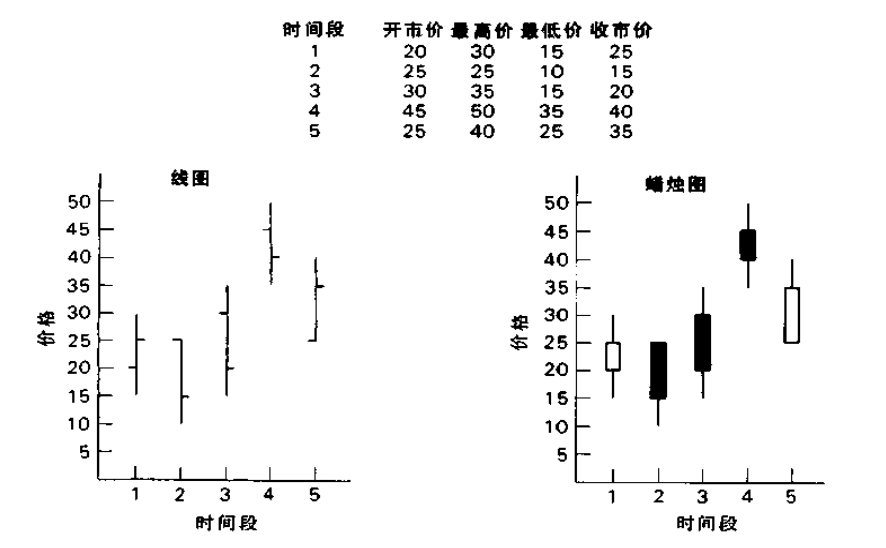

在绘制日线图的时候，每根图线需要开市价、最高价、最低价和收市价四种价格。线图的图线主要由若干竖直的线段组成，它们表示了各个对应时间段的最高价和最低价之间的范围。从每根竖直线段上，向左伸出一小段横线头，表示对应时间段内的开市价(最初价)。从每根图线上向右伸出一小段横线头，代表对应时间段内的收市价(最后价)。

在蜡烛图的图线内部，有一段胖鼓鼓的部分，称为实体。它表示了相应交易日的开市价与收市价之间的价格范围。如果实体是黑色的(即，将之涂满黑色)，则代表当日的收市价低于开市价。如果实体是白色的(即，将它保留为空白)，则表示当日收市价高于开市价。

在实体的上方和下方，各有一条瘦瘦的竖直线段，称为影线。这两条影线分别表示当日市场曾经向上和向下运动的极端价格。实体上方的影线称为上影线。实体下方的影线称为下影线。相应地，上影线的顶端代表了当日的最高价，下影线的底端代表了当日的最低价。

如果某根蜡烛图线没有上影线，那么这就是所谓的秃头蜡烛线。

如果某根蜡烛线没有下影线，那么它就是所谓的秃脚蜡烛线。

对日本人来说，在每根蜡烛线上，实体的部分代表了实质性的价格运动，而上下影线通常仅仅意味着无关宏旨的附属性价格变化。

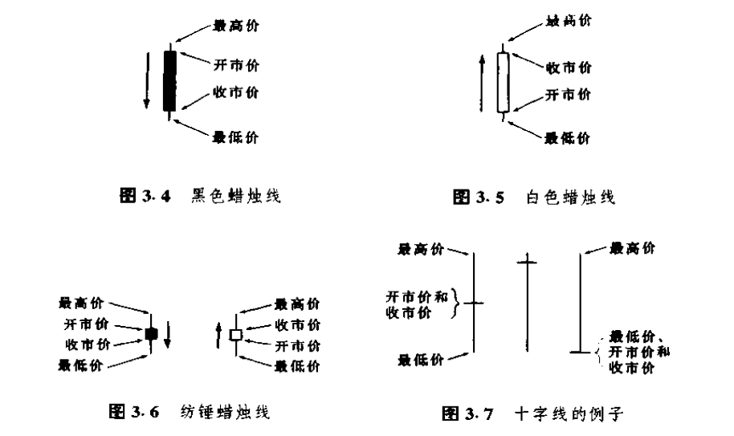

图3.4是一根具有长长的黑色实体的蜡烛线，它表示市场的开市价接近当日最高价，收市价接近当日最低价，这是一段疲弱的行情。

图3.5与图3.4恰好相反，因此，它表示的是一段坚挺的行情，当日的价格波动幅度很大，而且开市价接近最低价，收市价接近最高价。

图3.6所示的蜡烛图线的实体较短，说明熊方与牛方正处于胶着状态，一时难分高下，这类蜡烛线称为纺锤线。

图3.7中的蜡烛图线甚至没有实体。在这种极端情况下，蜡烛线的实体实际上缩小为一根水平的横线了。该图所示的几种例子就成为十字线。

日本人认为,在每个交易日里,开市和收市两个时刻,承载着最沉重的市场情绪。因此,开市价与收市价之间的相对高低具有非同小可的重要意义。

有时候,大户交易商在开市时执行一笔数额巨大的买进或者卖出指令,企图左右市场方向。日本人把这种情形形容为拂晓袭击。

如果在收市那一刻,或者在临近收市的时候,有人在市场上打出巨额买进指令或卖出指令,企图影响收市价格的水平,日本人就把这类行为称为夜袭。

## 二、反转形态

### 反转形态

在西方技术分析理论中,反转信号包括双重顶和双重底、反转日、头肩形、岛形反转顶和岛形反转底等各种价格形态。

“反转形态”往往使人误以为现有趋势将会突兀地结束，立即反转为新的趋势。实际上,这种情况很少发生。趋势的逆转，一般都是伴随着市场心理的逐渐改变进行的,通常需要经过一个缓慢的、分阶段的演变过程。

确切地说,趋势反转信号的出现,意味着之前的市场趋势可能发生变化,但是市场并不一定就此逆转到相反的方向上。

图4.1到图4.3分别显示的是,当同一种顶部反转形态出现后，市场可能会经历的各种不同的变化过程。

图4.1情况是,市场从之前的上升趋势先转化为一段横向调整的行情,然后再开始形成方向相反的新趋势。

在图4.2中,市场后来重新恢复到原先的上升趋势之中。

在图4.3中,市场原先的上升趋势突然掉转为下降趋势。

**把反转形态理解成趋势变化形态,才是慎重可取的考虑。**

**这里有一条重要原则:仅当反转信号所指的方向与市场的主要趋势方向一致时,我们才可以依据这个反转信号来开立新头寸。**

举个例子,假定在牛市的发展过程中,出现了一个顶部反转形态。虽然这是一个看跌的信号,却并不能保证卖出做空是有把握的。这是因为，市场当前的主要趋势依然是上升的。无论如何,就这个反转形态的实质意义来说,它构成了了结既有多头头寸的交易信号。如果当前主要趋势为下降趋势,那么,虽然还是这个顶部反转形态,但是它就足以构成卖出做空的凭据了。

### 锤子线和上吊线

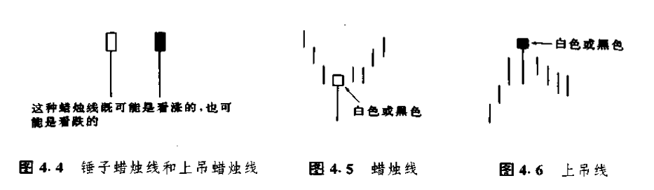

如图4.4所示的蜡烛图线具有明显特点。它们的下影线较长，而实体较小,并且在其全天价格区间里,实体处在接近顶端的位置上。在本图上,我们同时列出了黑白两种蜡烛线。这两条蜡烛线都既可能是看涨的,也可能是看跌的,具体情况要由它们在趋势中所处的位置来决定。

在这两种蜡烛线中,不管是哪一个,只要它出现在下降趋势中,那么,它就是下降趋势即将结束的信号。在这种情况下,这种蜡烛线称为锤子线,意思是说“市场正用锤子夯砸底部”。请看图 4.5。在日语里,这类蜡烛线原来的名称是“探水竿”。这个词在日文中大体的意思是“试一下水的深浅。”

在图4.4所示的两种蜡烛线中,无论哪一种,如果出现在上冲行情之后,就表明之前的市场运动也许已经结束。显而易见,这类蜡烛线就称为上吊线(如图4.6所示)。上吊线的名字是从它的形状得来的,这类蜡烛线看上去就像吊在绞刑架上双腿晃荡的一个死人。

我们可以根据三个方面的标准来识别锤子线和上吊线。

1.实体处于整个价格区间的上端。而实体本身的颜色是无所谓的。

2.下影线的长度至少达到实体高度的2倍。

3.在这类蜡烛线中,应当没有上影线,即使有上影线,其长度也是极短的。

在看涨的锤子线的情况下，或者在看跌的上吊线的情况下，其下影线越长、上影线越短、实体越小，这类蜡烛线就越有意义。虽然锤子线或者上吊线的颜色既可以是白的，也可以是黑的，但是，如果锤子线的实体是白色的，其看涨的意义则更坚挺几分；如果上吊线的实体是黑的，其看跌的意义则更疲软一点。

从上吊线的价格演化过程本身看来，未必令人联想到顶部反转形态。然而,这个价格变化过程预示着一旦市场遭到空方的打压，就会不堪一击，迅速引发市场的向下突破。

**当上吊线出现时，一定要等待其它看跌信号的证实，这一点特别重要。**

**上吊线的一条普遍原则：**上吊线的实体与上吊线次日的开市价之间向下的缺口越大，那么上吊线就越有可能构成市场的顶部。在上吊线之后，如果市场形成了一条黑色的实体，并且它的收市价低于上吊线的收市价，那么，这也可以看作上吊线成立的一种佐证。

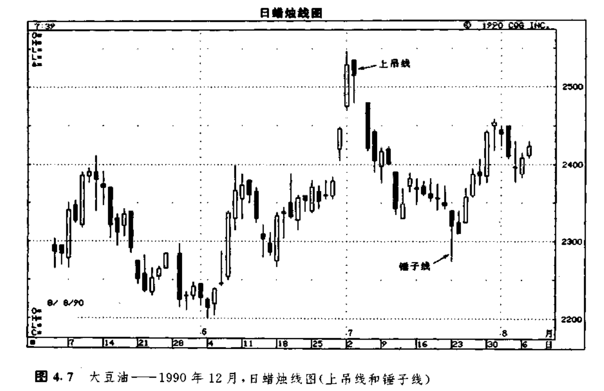

图4.7所示的实例颇精采，从中我们可以看到，同样一种蜡烛线，既可以是看跌的（如7月3日的上吊线），也可以是看涨的（如7月23日的锤子线）。尽管在这个实例中，上吊线和锤子线的实体都是黑色的，但是它们实体的颜色并没有太大意义。

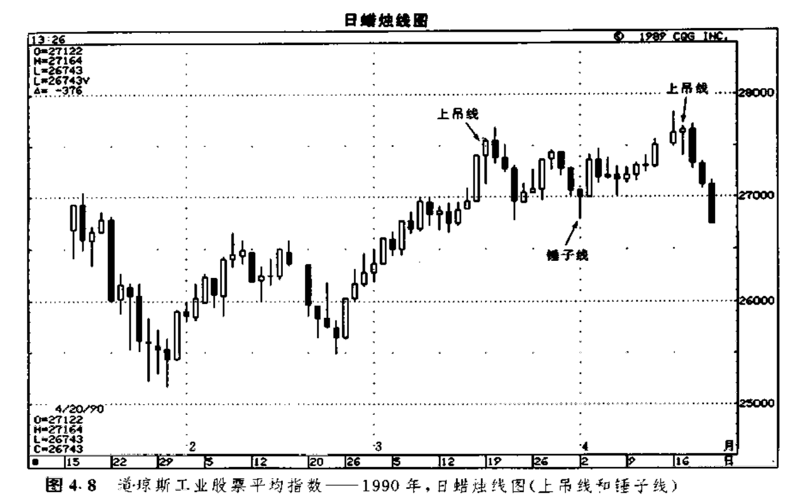

图4.8是另一个实例，也显示出了这类蜡烛线的双重特性。如图所示，4月中旬有一个看跌的上吊线，它标志着市场先前的上涨行情的终止，而且这轮上涨行情是从4月2日的一条看涨的锤子线开始的。3月中旬，出现了另一个上吊线的变体。虽然这条变体上吊线的下影线也比较长，但未能达到实体高度的2倍。不过，另外两项标准它还是满足的（即它的实体位于当日价格区间的上端，并且它几乎没有上影线）。再往后看，**次日的收市价低于这根蜡烛线的收市价，因而构成了它的验证信号**。综台起来，尽管这条蜡烛线不是理想的上吊线，但它也是成立的。

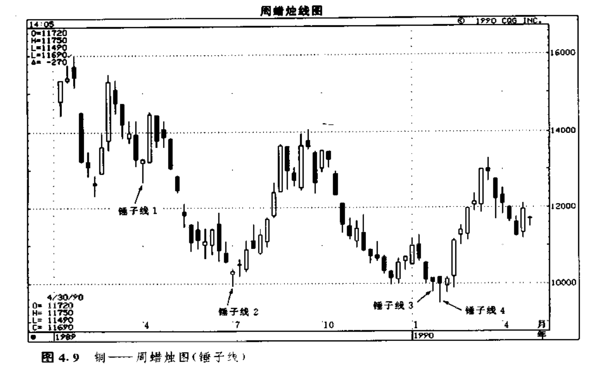

在图4.9所示的实例中，出现了一系列的看涨锤子线，我们用从1到4的数字给它们作了记号（锤子线2虽然有一段小小的上影线，但我们还是把它看作一根锤子线）。本例的有趣之处是这张图表于1990年初发出的那个买入信号。在锤子线3和锤子线4上，市场曾经两度向下越过了锤子线2处的7月份的低点，两度创出新的低价位（新低）。然而，熊方没能乘机扩大战果，继续把球控制在己方脚下。他们失了手，球丢了。这两条锤子线（3和4）表明，牛方重新执掌了市场的主动权。锤子线3并不是一条理想的锤子线，因为它的下影线达不到实体高度的2倍。但是，这条蜡烛线确确实实地显示，熊方没有能力维持新低价格水平。紧接着，下一周又是一根锤子蜡烛线，这就再度强调了如下的结论：很可能即将发生底部反转过程。

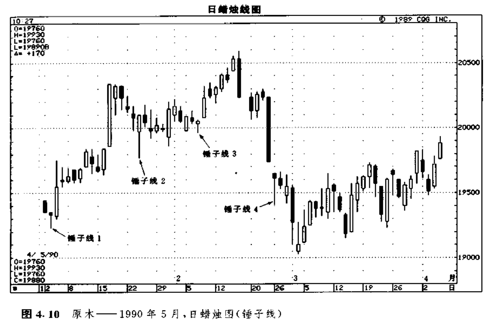

在图4.10中，锤子线1和3都属于底部形态。锤子线2标志着先前的下降趋势的结束，于是市场趋势从下降转为横向延伸。锤子线4未起作用。这条锤子线就引出了关于锤子线形态分析的一项重要的注意事项（其实，这也是我将讨论的所有其它形态的一个关键点）。

**只有把价格形态与它之前的价格变化相结合，进行通盘的考虑，才能准确把握价格形态的意义。**

带着这样的全局观，再来观察一下锤子线4。我们注意到，在这条锤子线的前一天，市场走出了一条极其疲软的蜡烛线。这是一条长长的、黑色的秃头秃脚蜡烛线（全秃蜡烛线，就是说，开市价位于当日最高处，收市价位于当日最低处）。这条蜡烛线清晰地说明市场具有强劲的向下动力。此外，锤子线4也向下穿透了市场过去在1月24日建立起来的支撑水平。再考虑到前面所分析的看跌因素，那么，当锤子线4出现时，稳妥的做法是，先等一等其它验证信号，看看牛方是否确实已经重新占据了上风，然后见机而作。比如说，如果在锤子线4之后，再出现一根白色的蜡烛线，并且它的收市价高于锤子线4的收市价，那么，后来的这条蜡烛线就可以看作是一个验证信号。

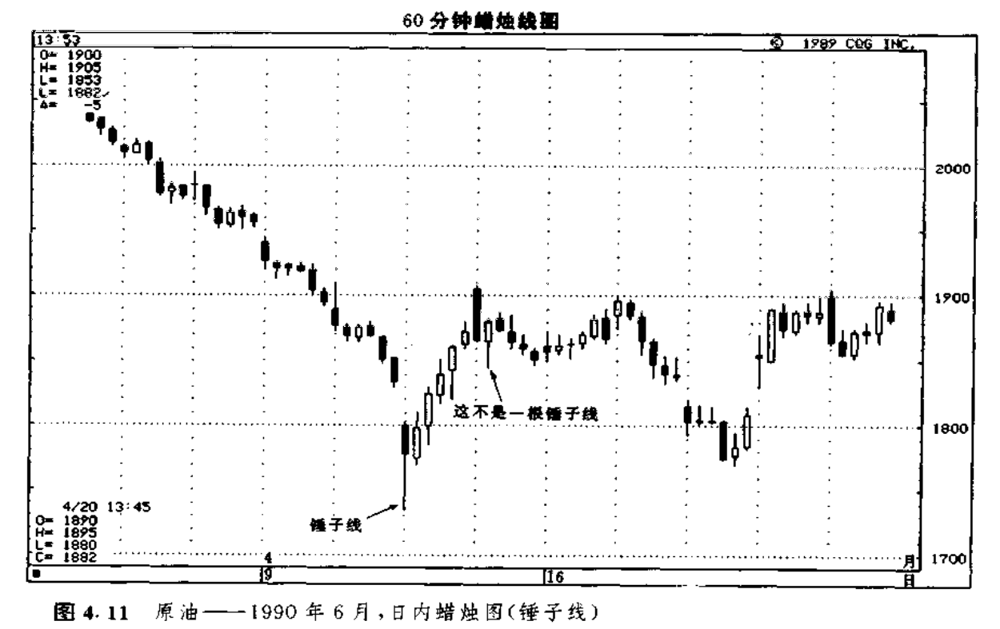

我们也可以采用蜡烛图形式来绘制日内时间单位的图表。在这种情况下，蜡烛线显示的是相应时间段内的最高价、最低价、最初价和最后价（如图4.11所示）。举例来看，如果我们以小时为基本时间单位，那么，每根蜡烛图线将采用相应一小时的最初价和最后价来绘制其实体，而用这一小时的最高价和最低价来绘制上下影线。如果我们仔细地观察这张图表，就会看到，在4月11日的头一个小时，市场形成了一根锤子线。与图4.10中的锤子线4一样，在这根锤子线处，市场也形成了一个向下的价格跳空。但是与之不同的是，在本锤子线之后，跟随着一根白色的蜡烛线，并且这根白色蜡烛线的收市价高于本锤子线的收市价。这对证实市场底部的形成是很有帮助的。再看4月12日的第二根小时蜡烛线。虽然它的外形同锤子线有相似之处，但它并不是一根真正的锤子蜡烛线。**锤子线属于底部反转形态。在锤子线的判别准则中，其中有一条是，在锤子线之前，必定先有一段下降趋势（哪怕是较小规模的下降趋势），这样锤子线才能够逆转这个趋势。这条蜡烛线也不是上吊线，因为上吊线必须出现在一段上升趋势之后。**在本图所示的情况下，如果把这根蜡烛线提高到前一根黑色蜡烛线的顶部附近，那么，我们就可以将它判定为上吊线了。

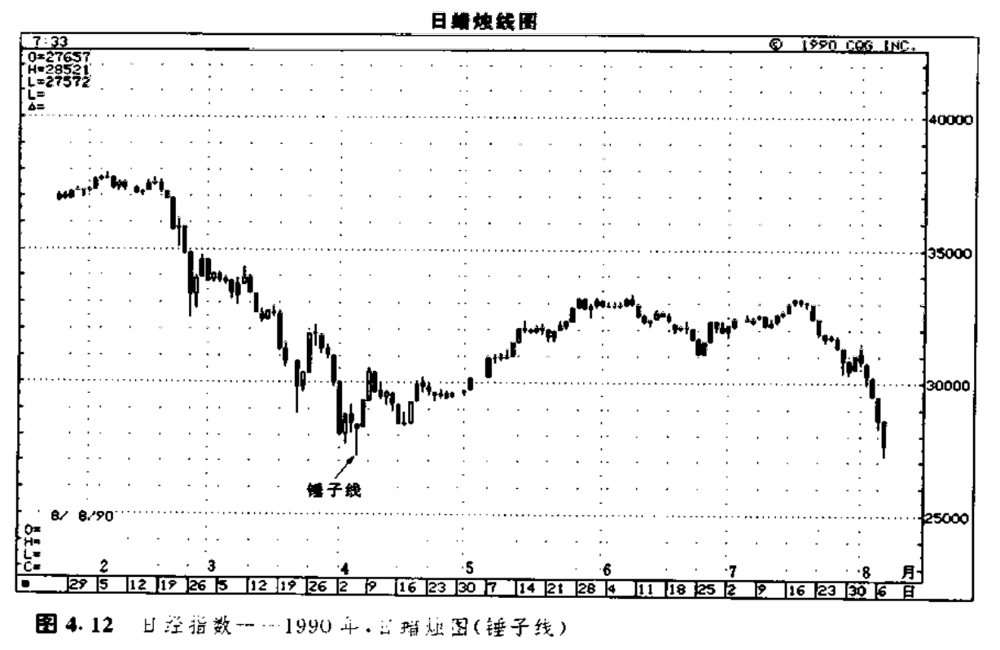

在图4.12中，4月初有一根锤子线，它成功地预示了一轮持续数月的主要下降行情的终结。这根蜡烛线下影线很长（其长度是实体高度的许多倍），实体很小，又没有上影线，于是就成了一条经典的锤子线。

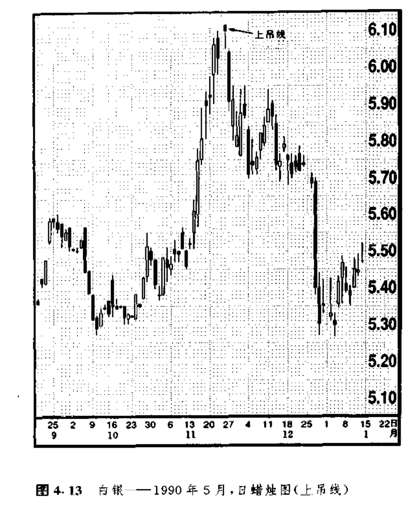

图4.13显示的是一例经典的上吊线形态。在上吊线出现的这一天，市场向上跳空开市，并由此创出了新的高价位（新高）。第二天，市场向下跳空，于是凡是在上吊线的开市或收市时买进的新多头，都被高高“吊起”，处于亏损状态。

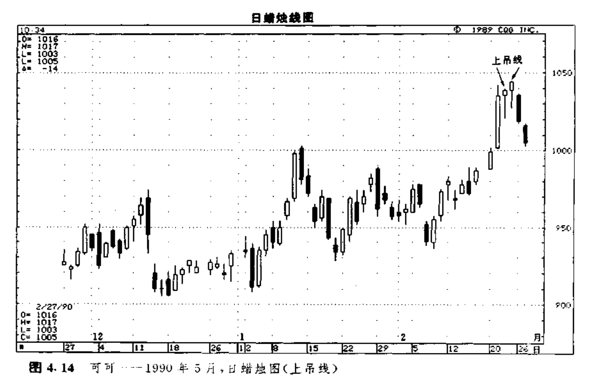

在图4.14 中我们看到，自2月初开始的上升行情随着两条连续的上吊线的到来而宣告破产。**在上吊线出现后，还需要其它看跌信号的验证。**这一原则的重要性，在本图例中也得到了体现。**在上吊线的看跌验证信号中，有一种情况是，次日的开市价低于上吊线的实体**。这是为上吊线求得证实的第一个办法。请注意，当第一根上吊线出现后，次日市场是以较高的价格开市的。但是，在第二根上吊线之后，第二天市场终于开市在这条上吊线的实体之下，于是，市场便掉头下行了。

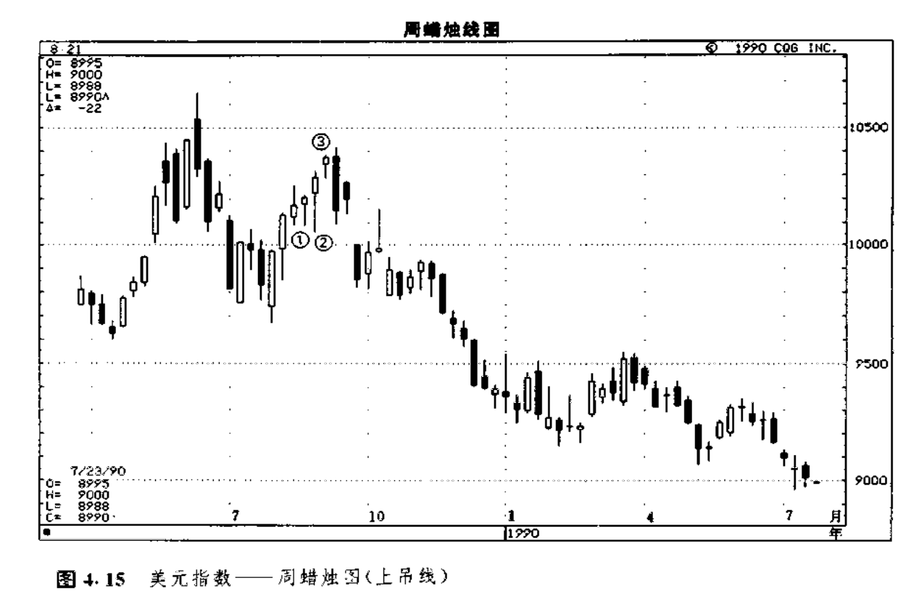

如图4.15所示，**如果在上吊线之后，是一条具有黑色实体的蜡烛线，并且它的收市价低于上吊线的收市价，那么，这种情况也构成了上吊线的看跌验证信号。**这是我们为上吊线求得证实的第二个办法。在本图例中，蜡烛线1、2和3形成了一系列上吊线。在上吊线1和2之后。均没有发生看跌验证信号，这就意味着在这两处，上升趋势依然处在照常发展的状态之下。

请注意上吊线3。接踵而至的那条黑色蜡烛线，为这条上吊线提供了看跌验证信号。在上吊线3的次日。虽然市场的开市价几乎没有变化，但是到收市的时候，那些在上吊线的开市或收市时买进的多头，已经统统给“上吊”在亏损状态了（在本例中，在次日这根长长的黑色蜡烛线上，市场的抛售过程激烈到了白热化的程度，以致于凡是在上吊线当日买进的人，不仅仅是那些在开市和收市买进的人，统统被套牢在亏损头寸里）。

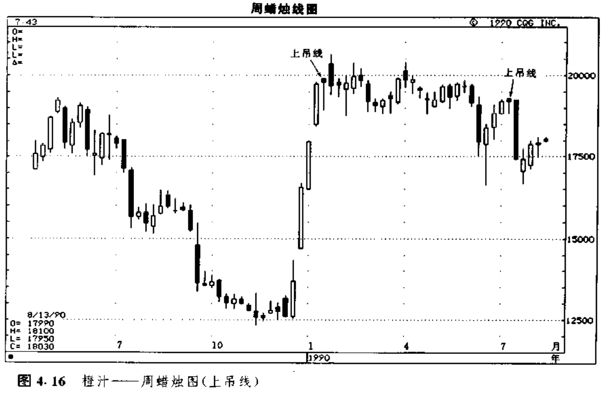

图4.16所示，是橙汁市场的一个实例。从1989年底到1990年初，在本图上出现了一段触目惊心的上涨行情。请注意这场上升行情是在何处结束的。1990年的第三周是一根上吊线，挡住了上述涨势。本实例充分说明了下面这个要点：**反转形态的出现，并不意味着市场必定向相反的方向逆转**。**准确地说，反转形态的出现，预示着之前的趋势即将发生变化**。本图例中的情形，正是上述分析的现实体现。在图示的上吊线反转形态形成后，之前的上升趋势就结束了，市场演变成了新的横向延伸趋势。

在本图例中，7月里出现了另一条上吊线。这一次，市场很快就从上升反转为下降。但是，正如我们前面曾经反复强调的，当遇上顶部反转形态时，我们不应当总是期待这种情景的出现。

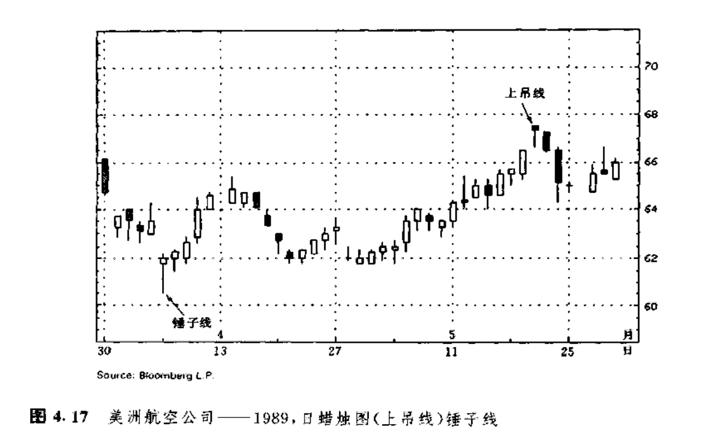

在图4.17中，5月里显示出了一个经典的上吊线形态。从这个蜡烛线的形状来看，其实体极小、没有上影线、下影线很长。次日的黑色实体证实了这根上吊线的可靠性，提示我们，现在是出清多头头寸的时候了〈请注意，在本图上，4月初有一个看涨的锤子线）。

### 吞没形态(抱线形态）

在绝大多数情况下，蜡烛图技术信号都是由数根蜡烛线组合在一起形成的。吞没形态（或者说，抱线形态）是我们将介绍的第一类由数根蜡烛线组成的复合形态。吞没形态属于主要反转形态，是由两根颜色相反的蜡烛线实体所构成的。

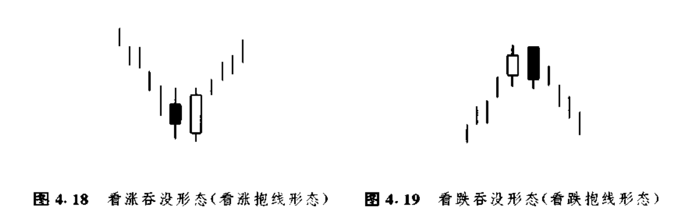

### 乌云盖顶形态(乌云线形态)

### 刺透形态(斩回线形态)

## 三、星线

### 启明星形态

### 黄昏星形态

### 十字启明星形态和十字黄昏星形态

### 流星形态与倒锤子形态

### 倒锤子线

## 四、其它反转形态

### 孕线形态

### 十字孕线形态

### 平头顶部形态和平头底部形态

### 捉腰带线

### 向上跳空两只乌鸦

### 三只乌鸦

### 反击线形态(约会线形态)

### 三山形态和三川形态

### 数字3在蜡烛图技术中的重要性

### 圆形顶部形态和平底锅底部形态(圆形底部形态)

### 塔形顶部形态和塔形底部形态

## 五、持续形态

### 窗口

### 向上跳空和向下跳空并列阴阳线形态

### 高价位和低价位跳空突破形态

### 跳空并列白色蜡烛线形态

### 上升三法和下降三法形态

### 前进白色三兵形态

### 分手蜡烛线形态

## 六、神奇的十字线

### 十字线的重要性

### 市场顶部的十字线

### 出现在长长的白色蜡烛线之后的十字线

### 长腿十字线和黄包车夫

### 墓碑十字线

### 构成支撑水平和阻挡水平的十字线

### 三星形态

## 七、蜡烛图技术汇总

## 八、蜡烛图信号的汇聚

## 九、蜡烛图与趋势线

### 蜡烛线图的支撑线和阻挡线

### 破低反涨形态与破高反跌形态

### 极性转换原则

## 十、蜡烛图与百分比回撤水平

## 十一、蜡烛图与移动平均线

### 简单移动平均线

### 加权移动平均线

### 指数加权移动平均线与MACD摆动指数

### 移动平均线的用法

### 双移动平均线

## 十二、蜡烛图与摆动指数

### 摆动指数

### 相对力度指数

### 如何计算RSI

### 如何运用RSI

### 随机指数

### 如何计算随机指数

### 如何应用随机指数

### 动力指数

## 十三、蜡烛图与交易量、持仓量

### 交易量与蜡烛图

### 权衡交易量（OBV）

### OBV与蜡烛图

### 即时交易量（TM）

### 即时交易量（TM）与蜡烛图

### 持仓量

### 持仓量与蜡烛图

## 十四、蜡烛图与艾略特波浪理论

### 艾略特波浪理论的基本概念

### 艾略特波浪理论与蜡烛图

## 十五、蜡烛图与市场剖面图

## 十六、蜡烛图与期权交易

### 期权的基础知识

### 期权交易与蜡烛图

## 十七、利用蜡烛图进行保值交易

## 十八、我是如何应用蜡烛图的

