# 星线

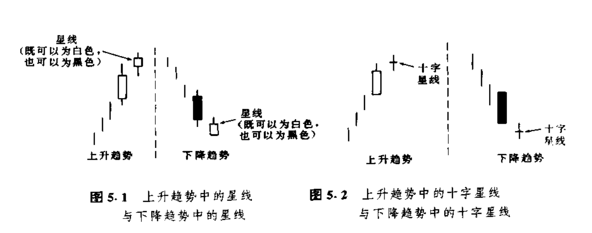

本章要讨论另一群有趣的反转形态，它们的共同点是都包含星蜡烛线。如图5.1所示，**星蜡烛线（简称星线）的实体较小，并且在它的实体与它前面的较大的蜡烛线的实体之间形成了价格跳空。只要星线的实体与前一个实体没有任何重叠，那么这个星蜡烛线就是成立的**。星线本身的颜色并不重要。星线既可能出现在市场的顶部，也可能出现在市场的底部（有时候，人们又把下降趋势中的星线称为雨滴）。如果星线的实体已经缩小为十字线，则称之为十字星线（如图5.2所示）。

当星线，尤其是十字星线出现时，就是一个**警告信号**，表明当前的趋势或许好景不长了。星线的较小的实体显示，熊方和牛方的较量已经转入僵持状态。在强劲的上升趋势中，牛方一直占握主导地位。如果在一根长长的白色蜡烛线之后出现了一根星线，则构成了警告信号：因为市场原来受买方的控制，现在转变为买方与卖方势均力敌的僵持状态。这一僵局的发生，既可能是由于买方力量的衰减所造成的，也可能是由于卖方力量的增长所造成的。但不论出于哪一个原因，星线都能告诉我们，当前上升趋势的驱动力已经瓦解，市场容易遭到卖方的攻击而向下回落。

如果在下降趋势中出现了星线，也是同样的道理，只是方向与上述相反。具体地说，在下降趋势中，如果在一根长长的黑色蜡烛线之后出现了星线，就反映出市场氛围的改变。举例而言，在下降趋势中，熊方一直占据主动，但是随着星线的出现，事情就发生了变化，此时。牛、熊双方的力量对比已经变得较为平衡了。如此一来，市场向下的能量也就减退了。这种局而当然不利于熊市的继续发展。在下列4种反转形态中，星线都是其中的一项重要组成成分。这四种反转形态分别是：

**1.黄昏星形态；**

**2.启明星形态；**

**3.十字星形态；**

**4.流星形态;**

在这4种星形态中、星线实体的颜色都是无关紧要的，既可以是白色的，也可以是黑色的。

## 启明星形态

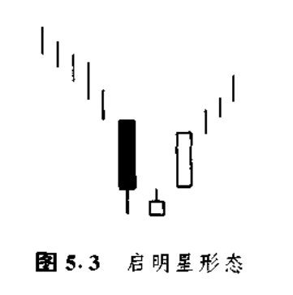

启明星形态属于底部反转形态（如图5.3所示）。它的名称的由来是，这个形态预示着价格的上涨，就像启明星（水星）预示着太阳的升起一样。在本形态中，先是一根长长的黑色实体，随后是一根小小的实体，并且在这两个实体之间形成了一个向下跳空（这两条蜡烛线组成了基本的星线形态）。第三天是一根白色实体，它明显地向上推进到了第一天的黑色实体之内。本形态发出的信号是，牛方已经重新夺回了主导权。为了交代清楚本形态的理论背景，我打算把这个形态分解开来，对其中的三根蜡烛线逐一加以研究。

当第一条黑色实体蜡烛线出现时，市场正处于下降趋势中。到此时为止，熊方还占着上风。随后的一天，是一个较小的实体。这就意味着，卖方已经失去了将市场进一步压低的能量。第三天，市场形成了一根坚挺的白色实体，这就证明牛方已经夺取了统治权。**在理想的启明星形态中，中间蜡烛线（即星线）的实体，与它前、后两个实体之间均有价格跳空。**后面的那个价格跳空较为少见，不过，即使没有后面这个价格跳空，似乎也不会削减启明星形态的技术效力。

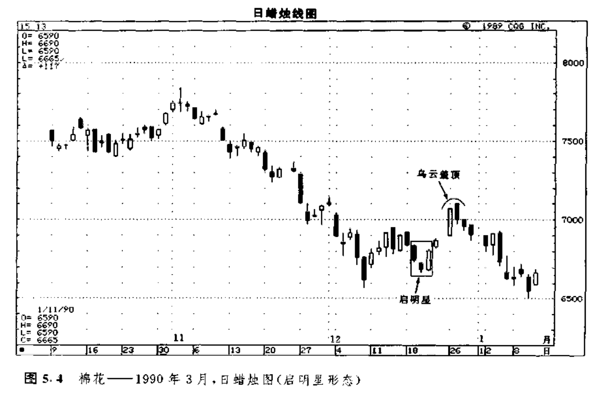

如图5.4所示，从12月19日到21日，市场上形成了一个看涨的启明星形态。从这个形态开始，市场酿成了一轮上涨行情。这轮上涨行情在遇上12月26日和27日的乌云盖顶形态以后，就失去了上升的动力。

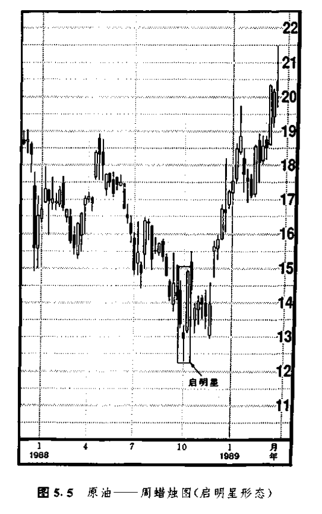

在图5.5中，10月里的低点是市场以星线的形式创造出来的（即，10月头一个星期的小实体〉。在这条星线的下一周，市场形成了一根强劲的白色实体。这条白色实体完成了图示的启明星形态。跟着这条白色蜡烛线的，是一条黑色的蜡烛线，两者一起组成了一个乌云盖顶形态。随后，市场暂时向下回落。尽管如此，该启明星形态还是构成了一个主要的底部。

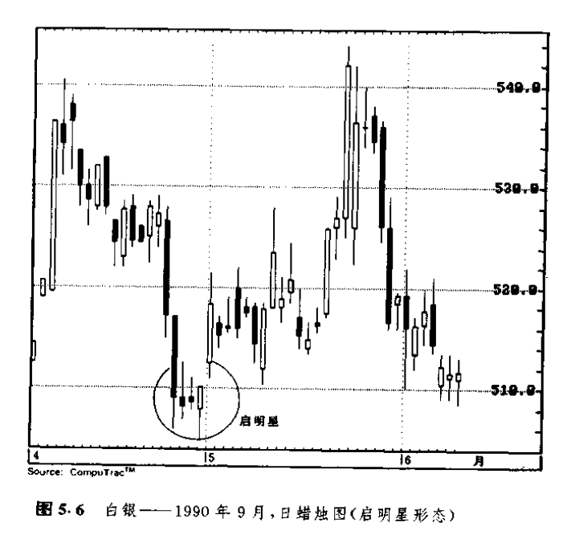

如图5.6所示，是一个启明垦形态的变体，其中包含了好几条小星线（在本例中，是三颗“星星”）。请注意，其中第三根小实体（即第三根星线）既是一根锤子线，同时也是一根看涨的抱线。

## 黄昏星形态

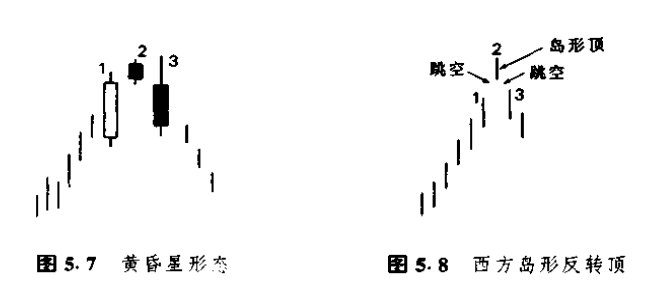

黄昏星是启明星的顶部对等形态，是看跌的。它的名称的由来也是显而易见的，因为黄昏星（金星）恰好出现在夜幕即将降临之际。既然黄昏星是顶部反转形态，那么，它只有出现在上升趋势之后，才能发挥其技术效力。黄昏星形态是由三根蜡烛线组成的（如图5.7所示）。在前两根蜡烛线中，第一根是一根长长的白色实体，后一根是一根星线。星线的出现，是顶部形态的第一个征兆。第三根蜡烛线证实了顶部过程的发生，完成了这个三线形态的黄昏星形态。第三根蜡烛线具有黑色实体，它剧烈地向下扎入第一天的白色实体的内部。我喜欢把黄昏星比喻为交通指挥信号灯。交通信号灯从绿色（对应于坚挺的白色实体>变成黄色（对应于星线的警告信号），再从黄色变成红色（对应于黑色实体，证实先前的上升趋势已告结束）。

**从原则上说，在黄昏星形态中，首先在第一根实体与第二根实体之间，应当形成价格跳空；然后在第二根实体与第三根实体之间，再形成另一个价格跳空。**话说回来，根据我的经验，第二个价格跳空并不常见，而且对于本形态的成功来说，可有可无，不是必要条件。本**形态的关键之处在于第三天的黑色实体向下穿入第一天的白色实体的深浅程度。**

图5.7乍一看去。像是西方技术分析理论中的岛形反转形态。但仔细分析一下就会发现，这个黄昏星形态所提供的反转信号，岛形反转形态是提供不来的（参见图5.8）。在岛形反转顶部形态中，交易时段2的最低点必须同时居于交易时段1和交易时段3的最高点之上。然而，在黄昏星形态中，仅仅要求实体2的低点高于实体1的高点，就可以构成反转信号了。

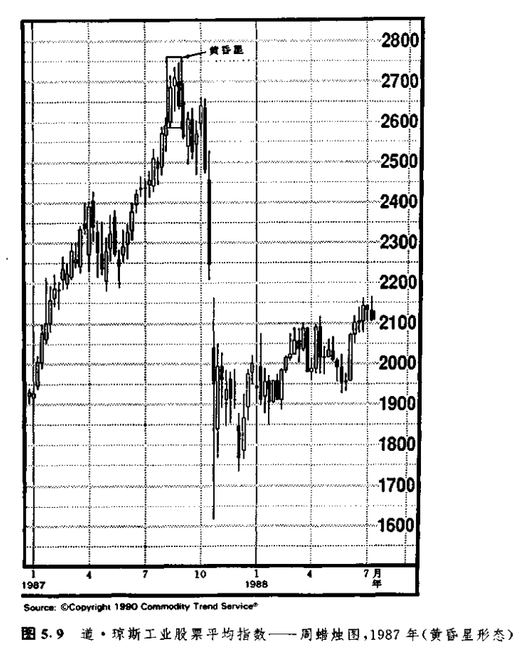

如图5.9所示的黄昏星形态，出现在1987年夏的道・琼斯指数市场上，该形态标志着道・琼斯指数在当年那场暴跌之前的最高点（我很想知道，采用蜡烛图的日本技术分析师当时是否看出了这个图形！）。

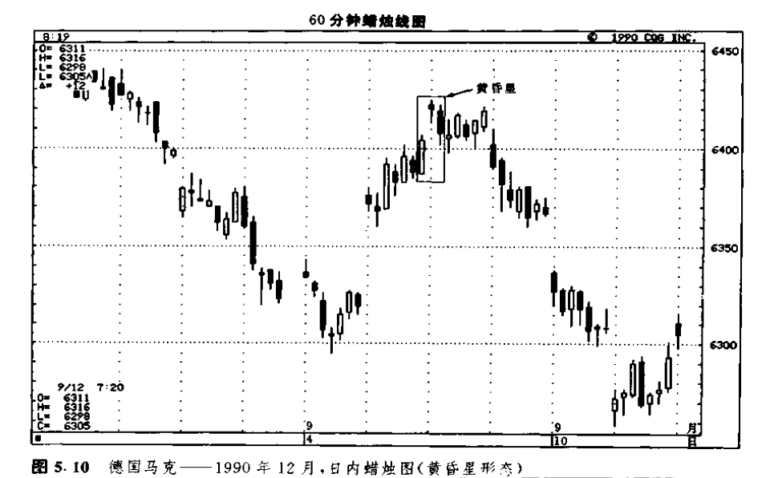

图5.10是一个很好的实例，说明了蜡烛图技术如何发出这样一个顶部反转信号，如果借助于西方技术分析工具，是不容易得到这个顶部反转信号的。9月5日的最后一小时，与次日的头两个小时一起，构成一个黄昏星形态。按照前面曾提到的西方理论，这个黄昏星形态的星线部分并不符合岛形反转顶的条件。在本例的情况下，蜡烛图就提供了一个西方岛形反转顶概念不能识别的顶部反转信号。另外，请注意这个黄昏星形态所结束的上涨行情，是从9月4日的启明星形态开始的。

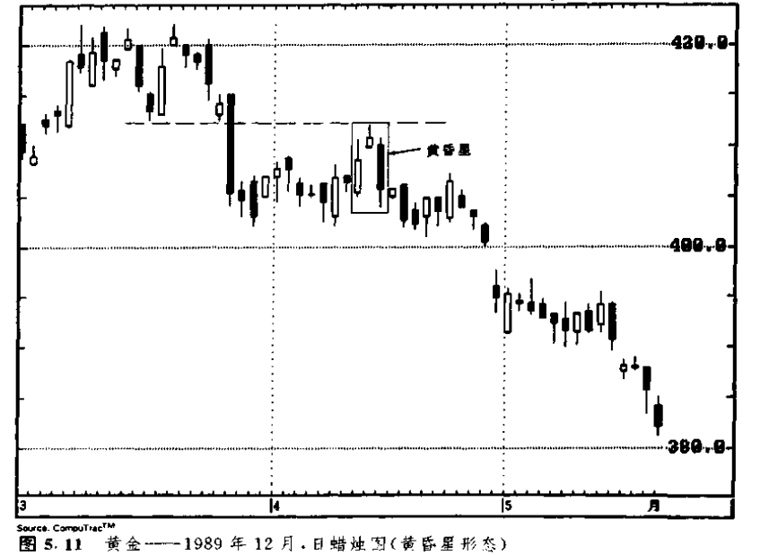

虽然黄昏星形态在上升趋势后更为重要，但是如果它处在横向巩固区间的顶部，那么，在其它看跌信号得到确认的条件下，也可能具有重要意义（如图5.11所示）。在本例中，4月中旬所发生的正是这种情况。在这个黄昏星形态中，星线的部分（即第二天）正与一个阻挡区不约而同地重合。阻挡区底部所处的水平为413美元，这里原本是3月里的支撑水平。**过去的支撑水平常常转化为新的阻挡水平。这一点，请牢记于心！这是一条很有实用价值的交易规则。**413美元附近的阻挡水平恰巧与这个黄昏星形态不期而遇，由此增强了本形态的疲弱意义。

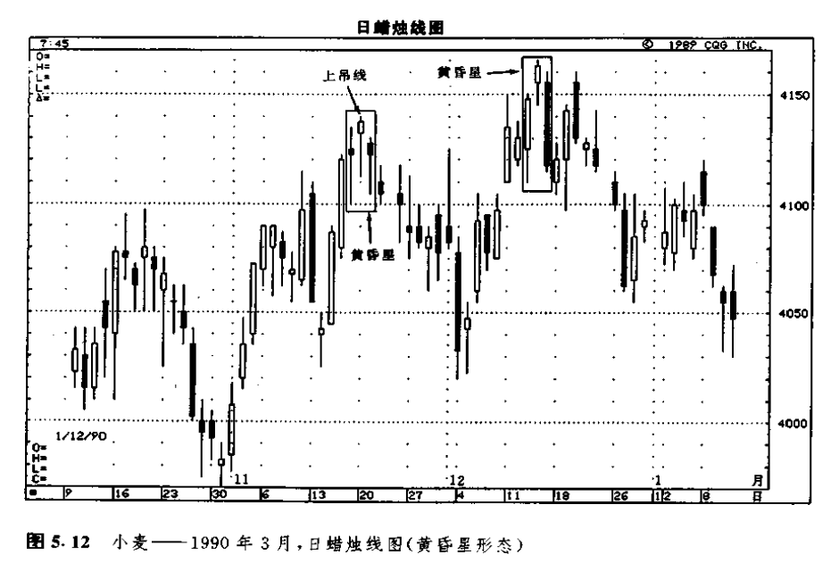

在图5.12中，12月中旬出现了一个构造良好的黄昏星形态。在星线的前面，是一根坚挺的白色实体，在星线的后面，是一根疲软的黑色实体。11月中旬，出现了一个黄昏星形态的变体。之所以称之为变体，是因为在黄昏星形态中，星线之前通常包含一根长长的白色实体，星线之后是长长的黑色实体。可是在这里，我们既没有看到长长的白色实体，也没有看到长长的黑色实体。但是，我们毕竟还是将它判断为顶部形态，这不仅因为它的外观与黄昏星形态稍有相似之处，而且因为11月21日是一根上吊线（这根线就是这个黄昏星形态的“星”）。上吊线的次日，市场开市于上吊线的实体之下，确认了顶部形态的完成。

下面开列了一些参考性因素，如果黄昏星形态或启明星形态兼具这样的特征，则有助于增加它们构成反转信号的机会。这些因素包括：

1.如果在第一根蜡烛线的实体与星蜡烛线的实体之间存在价格跳空，并且在星线的实体与第三根蜡烛线的实体之间也存在价格跳空；

2.如果第三根蜡烛线的收市价深深地向下扎入第一根蜡烛线的实体之内；

3.如果第一根蜡烛线的交易量较轻，而第三根蜡烛线的交易量较重。这一点表明了原先趋势力量的衰减，，以及新趋势力量的增长。

## 十字启明星形态和十字黄昏星形态

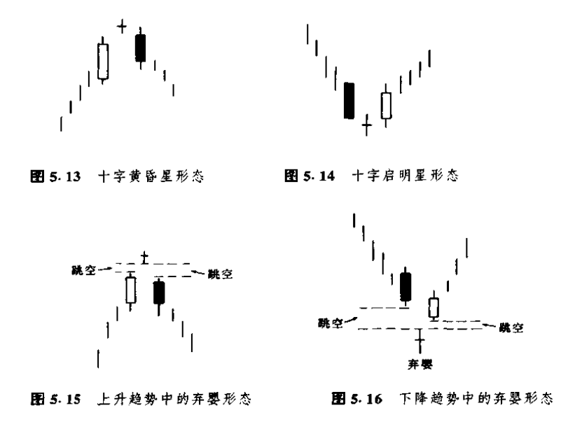

## 流星形态与倒锤子形态

## 倒锤子线

