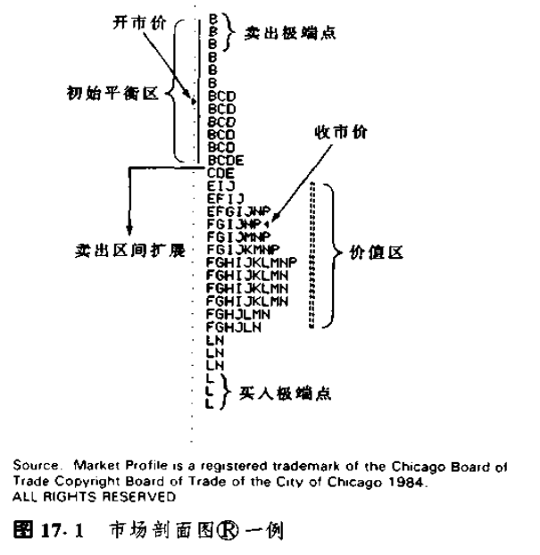
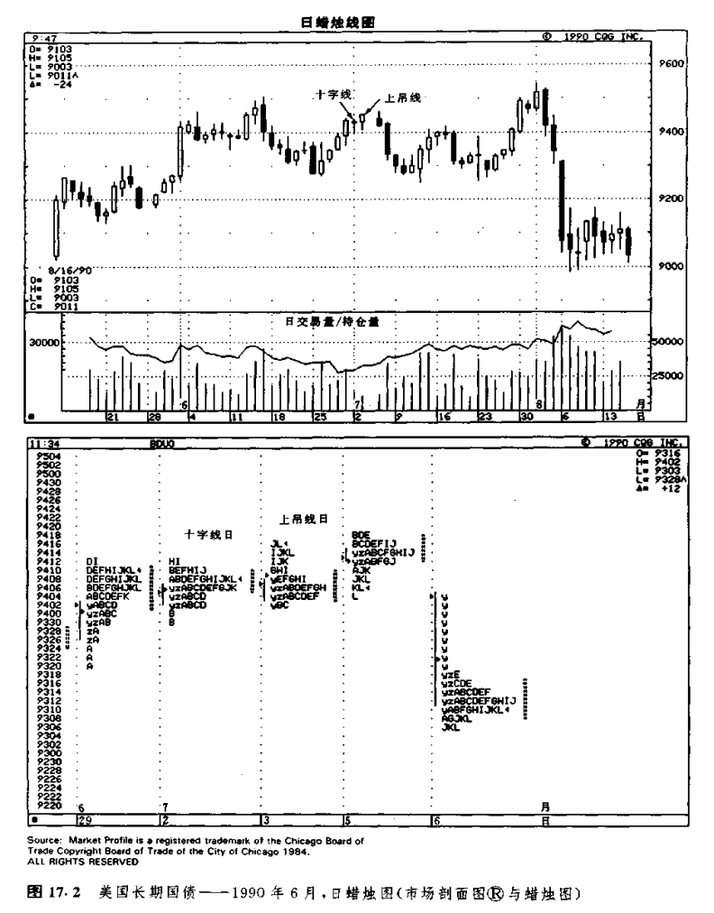
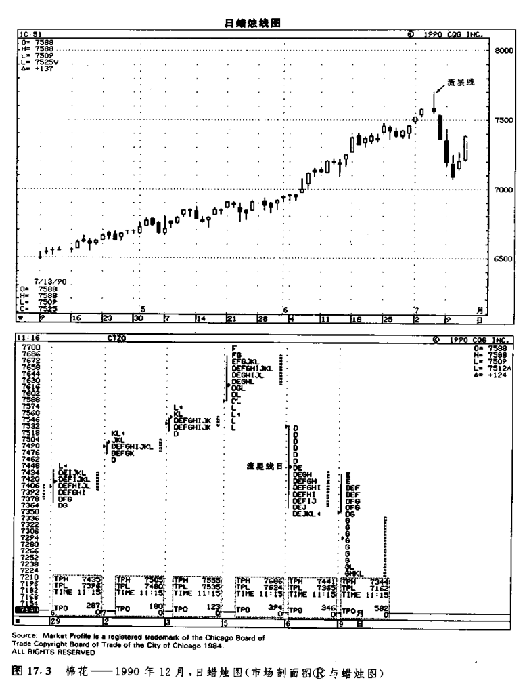

# 蜡烛图与市场剖面图

在期货市场上，很多市场参与者使用市场剖面图。以前，只有亲临交易所内交易现场的人才能得到这种图表所提供的市场信息。市场剖面图有助于技术分析者理解市场的内在结构。它为我们分析市场的价格、时间、交易量三要素，提供了一种符合逻辑的、以统计科学为基础的研究方式。在市场剖面图上，人们采用了各种各样的分析工具。本部分，我们只准备探讨其中少数几种方法。关于不同类型的剖面图日（即所谓常规日、趋势日、中性日、长期市场活动图等情况），以及市场流动性资料库 方面的题目，这里就不打算讨论了。我们的目的是提醒读者朋友，注意市场剖面图独特的市场分析视角，以及如何将它同蜡烛图相互参照。

下列几项基本要素构筑了市场剖面图的理论基础：

1.所有市场都是以便利和促进交易活动为目的的。

2.市场有一套自我调节机制。这种内在调节机制制约着价格、时间、交易量的相互关系。

3.市场为了便利和促进交易活动，往往以价格作为探针，尽力招揽卖出者和买进者。市场参与者对价格探针的反应，为我们判断市场的坚挺程度或疲弱程度，提供了极有价值的线索。

市场剖面图将每个交易日划分为以半小时为单位的若干时段，每个时段分配一个不同的字母，以组织每日的价格活动。因此，“A”所代表的，就是从上午8：00到8：30的交易时段（芝加哥时间），“B”代表的就是从上午8：30到9：00的交易时段，依此类推。对于那些开市时间早于上午8：00的市场（比如长期国债市场、货币市场、金属市场等〉，它们的头半个小时通常用“y”、"z”表示。每一个字母称为一个TPO（即一个时间一价格机会点）。每个半小时时段的字母，代表了这半小时市场的价格区间。上述情况如图17.1所示。

我们把每个交易日头一个小时所形成的价格区间标为初始平衡区。正是在这个时间段里，市场初步探索了当日的交易区间。换句话说，这是市场为了发现价值而进行的最初尝试。在头一个小时的初始平衡区之后，如果市场又形成了新的高点或新的低点，则将它们称为区间扩展。如图17.1所示，市场形成了卖出区间扩展，但由于在初始平衡区之后没有出现新高，本例没有形成买入区间扩展。

对于市场剖面图B的分析者来说，价值的定义是，在一定时间范围内市场所接受的价格水平，市场接受的程度反映在有关的价格水平上成交量的多寡。由此一来，在决定价值的因素中，时间和交易量就成了两项关键的成分。如果市场在某一价格水平仅仅有短暂的交易，则表明市场排斥这一价格水平。也就是说，市场在这里没有发现“价值”。如是市场在某一价格水平持续了相对充分的交易时间。并且达成了较多的交易量，就意味着市场接受了这一价格水平。在这种情况下，市场就发现了价值。市场所接受的价格，处于一个交易量之和占据全日交易量70%的价格区间之内（对于熟悉统计学的朋友来说，这是一种取值范圃为70%的标准分布）。这样的价格区间就定义为当日的价值区。举例来说，如果某日小麦市场70%的交易量发生在从3.30美元到3.33美元的区间中，那么这个区间就是当日的价值区。

所谓价格探针是指市场探求价值区范围的行为。从投机商到投资者，市场参与者群体对这种价格探针的反应，为市场剖面图的应用者提供了重要的信息来源。每当市场伸出一个价格探针后，都可能发生某种变化。一种可能性是，市场重新返回到既定价值区之内去；另一种可能性是，市场在这个新的价格水平重新确定价值区。市场对这一新价格是否接受，是否使之构成新的价值，可以通过这一价格水平上的交易量的增长情况，以及市场在这一价格水平处维持的时间长短来加以验证。

如果价格重新返回到既定的价值区，则表明市场否决了这一新的价格，认为这是一个不公平的过高水平或过低水平。在市场很快便否决某一价格水平的情况下，结果可能造成了一个极端点。我们把极端点定义为位于当日市场剖面图（除了最后半小时的时段之外）顶部或底部的2个或更多的TPO。一般地，市场剖面图顶部的极端点，是由于卖出者受到此处高价位的吸引而竞相卖出、但同时买进者数量不足所造成的。底部的极端点，则是由于买进者受到此处低价位的吸引蜂拥而至、但同时卖出者数量缺乏所遣成的。在图17.1中，我们分别标出了买进极端点和卖出极端点。

另一方面，当日价值区与前一日价值区的相对位置，也为我们提供了极有意义的市场信息。市场剖面图艮的信奉者密切监视是否出现了所谓的发起性买进或卖出信号，还是出现了所谓回应性买进或卖出信号。这些信号是通过比较当日极端点和区间扩展发生的位置同前一日价值区的关系来判定的。具体说来，在前一日价值区之下发生的买进行为，就称为回应性买进。因为此处价格低于既定的价值买入者判断这是低于价值的价格，并且采取了回应性行动。这些买入者预期价格将返回到价值上来。

在前一日价值区之下卖出的行为被说成是发起性卖出。因为这些卖出者愿意在低于既定价值的价格水平卖出，这就说明他们是大胆、积极的。这种情况意味着，他们相信价值区将向下运动。在前一日价值区之上的买进行为，属于发起性买进。这些大胆、积极的买入者断定，价值区将向上运动到新的价格水平。否则，为什么要在现存的价值区之上买进呢？在前一日价值区之上的价格水平卖出者，称为回应性卖出者。他们预期价格将返回既定价值区，因此对偏高的价格水平采取了回应性行动。

我们应当顺着发起性买进或发起性卖出的方向交易，除非此处的价格很快将为市场否定。因此，如果在前一日的价值区之下，市场上出现了发起性卖出活动（即形成了极端点或者区间扩展），并且此处的交易量呈上升态势，这样的局面就具备看跌的意味。

## 市场剖面图袋与蜡烛图

如图17.2所示，7月2日是一根十字线，下一天是一根上吊线，这是蜡烛图的顶部警告信号。那么，在同一期间，市场剖面图⑧发出了什么样的信号呢？7月2日的剖面图同前一天相比，具有较小的价值区。而且，这一天的交易量也比较轻（当天的交易量为32000张合约，而前一天为303000张合约）。这一情形暗示，这里的价格水平过高，难以为市场所接受。换个说法，这样的价格水平对交易活动缺乏促进作用。另一方面。，这一天的剖面图在上下两个方向均发生了区间扩展。这就显示出牛方和熊方的拔河赛正僵持不下。

7月3日也是一个交易量较轻的交易日（109000张合约）。这就给当日市场种种坚挺的表现打了很大的折扣一-这一天，不仅发生了向上的区间扩展，而且收市价位于全日的最高点。下一天，即7月5日，市场的疲弱性质表露无遗。在当日较早的交易时间中，市场曾经为当前趋势创出了新高。在这个过程中，也形成了向上的区间扩展。市场通过这一区间扩展过程，试图吸引卖出者入市。结果，他们果然来了。在当日较晚的几个时段中（J、K、L时段），市场上形成了一段抛售行悄，使得收市价接近全日的最低点。7月6日，当市场开市时就出现了发起性卖出，因为当日的开市价处在前一日的价值区之下。这就表明，当日的抛售活动自开市即刻开始。另一方面，7月6日的交易量呈现出增长的态势，并且在“y”时段内，形成了发起性卖出极端点（也就是说，位于当日剖面图顶部的单个的TPO）。这就证实当前市场已经陷入困境。

通过本实例，我们也能够看出上吊线的一个重要方面，有关内容我们过去有过介绍。仅在上吊线之后出现了看跌验证信号的条件下，上吊线才真正构成一个看跌信号。7月3日，是一根上吊线。从这一天的市场剖面图来看，它甚至还为市场发出了一些正面的信号。只有通过之后的几个交易日，即7月5日和7月6日，特别是7月6日的早晨，我们才从市场剖面图⑧上得到了这个市场顶部的确认信号。

如图17.3所示，7月5日是一根赫然醒目的流星线。在这根蜡烛线出现后，本图所示的棉花市场连续狂跌了三个交易日。那么，在这根流星线出现之前，市场剖面图是否发出了什么明显的不良征兆呢？是的，的确如此。从6月29日到7月3日，虽然价格一路上涨，但是价值区却一路收窄。这就意味在当前的较高价位上，市场对交易活动的便利，促进作用有所减弱。市场在将这些高的价格水平接受为价值的过程中。遇上了困难。另一方面，如果我们统计每一天的TPO总数，以此衡量当日的交易量的话，那么，这几天的交易量也呈现出日益下降的态势（这些交易日的真实交易量也是小的。无论如何，因为交易量的数据要迟一天才公布，所以我们需要统计TPO的总数，以估算当日的交易量）。请注意，7月5日的流星线标志着一个市场顶部。在当日的市场剖面图B上，价值区接近当日价格范围的上端，但是未能招徕跟进买入者。相反，由于受到这些高价位的吸引，卖出者纷纷入市，驱使市场下跌。结果，形成了图示的向下的区间扩展，以及一-个疲软的收市价。这些情况构成了看跌的信号。

如果您觉得还需要更多的证据才能说明问题，那么，只要等到7月6日一开市，就真相大白了。在这一天开市时，市场在前一日的价值区之下形成了发起性卖出极端点。这就证实卖出者已经登台。市场前景堪忧。综上所述，通过市场剖面图⑧的各种工具，图示流星线的看跌意义得到了验证，

在市场剖面图移的思路与蜡烛图技术之间，存在着某些有趣的相似之处。如果市场剖面图的价值区较宽，则通常代表着市场对交易活动的促进，因此，这就增加了当前价格趋势持续发展的可能性。由此看来，在上升趋势中，我们期望看到逐步扩张的价值区。与此相似的是，在蜡烛图上，我们希望在上涨行情中看到一系列越来越长的白色实体，以证实当前价格运动背后的市场力量。

如果市场剖面图的价值区呈现出逐步收窄的局面则反映了市场对交易活动的促进作用的减小。因此，判断当前价格运动能否持续发展，就少了几分把握。在蜡烛图的前方受阻形态和停顿形态中，情况与上述也是一样的。在这两种蜡烛图形态中，虽然价格趋势依然是上升的，但是在此过程中，白色实体的高度却在逐步缩小。这两类形态显示，当前的市场动力正在逐步衰减。

至于蜡烛图的星线，情况又怎么样呢？这是出现在上升趋势或下降趋势中的一种短实体的蜡烛线。它的出现，标志着牛方（上升趋势中的星线>斗志的消退，或者熊方（下降趋势中的星线）动力的减弱。在市场剖面图⑧上，如果在一轮强烈的上涨行情（或下跌行情）之后，出现了一个小价值区，则说明了与上述相同的道理。这里的小价值区反映出市场对交易活动缺乏促进作用。这种情况可能是趋势即将生变的先兆。再看蜡烛图的锤子线。在剖面图上，由于低价位吸引了大量的买入者，从而产生了买入极端点，这种情况反应在蜡烛图上，可能就形成了一根锤子线长长的下影线。流星线呢？由于高价位吸引了强烈的抛售行为，造成了卖出极端点，这种情况反映在蜡烛图上，可能构成某个流星线长长的上影线。