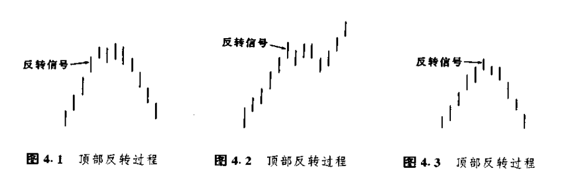

# 读书总结

## 绘制蜡烛图

在绘制日线图的时候，每根图线需要开市价、最高价、最低价和收市价四种价格。线图的图线主要由若干竖直的线段组成，它们表示了各个对应时间段的最高价和最低价之间的范围。从每根竖直线段上，向左伸出一小段横线头，表示对应时间段内的开市价(最初价)。从每根图线上向右伸出一小段横线头，代表对应时间段内的收市价(最后价)。

在蜡烛图的图线内部，有一段胖鼓鼓的部分，称为实体。它表示了相应交易日的开市价与收市价之间的价格范围。如果实体是黑色的(即，将之涂满黑色)，则代表当日的收市价低于开市价。如果实体是白色的(即，将它保留为空白)，则表示当日收市价高于开市价。

在实体的上方和下方，各有一条瘦瘦的竖直线段，称为影线。这两条影线分别表示当日市场曾经向上和向下运动的极端价格。实体上方的影线称为上影线。实体下方的影线称为下影线。相应地，上影线的顶端代表了当日的最高价，下影线的底端代表了当日的最低价。

如果某根蜡烛图线没有上影线，那么这就是所谓的秃头蜡烛线。

如果某根蜡烛线没有下影线，那么它就是所谓的秃脚蜡烛线。

图3.4是一根具有长长的黑色实体的蜡烛线，它表示市场的开市价接近当日最高价，收市价接近当日最低价，这是一段疲弱的行情。

图3.5与图3.4恰好相反，因此，它表示的是一段坚挺的行情，当日的价格波动幅度很大，而且开市价接近最低价，收市价接近最高价。

图3.6所示的蜡烛图线的实体较短，说明熊方与牛方正处于胶着状态，一时难分高下，这类蜡烛线称为纺锤线。

图3.7中的蜡烛图线甚至没有实体。在这种极端情况下，蜡烛线的实体实际上缩小为一根水平的横线了，就成为了十字线。

## 反转形态

趋势反转信号的出现,意味着之前的市场趋势可能发生变化,但是市场并不一定就此逆转到相反的方向上。

**重要原则:仅当反转信号所指的方向与市场的主要趋势方向一致时,我们才可以依据这个反转信号来开立新头寸。**

### 锤子线和上吊线

锤子线、上吊线：它们下影线较长，实体较小，在其全天价格区间里，实体处在接近顶端的位置上。在下降趋势中，它可能是下降趋势即将结束的信号，这种蜡烛线称为锤子线。如果出现在上涨行情之后，表明之前的市场运动也许已经结束，这类蜡烛线称为上吊线。

**判别标识：**

1.实体处于整个价格区间的上端，而实体本身的颜色是无所谓的。

2.下影线的长度至少达到实体高度的2倍。

3.在这类蜡烛线中，应当没有上影线，即使有上影线，其长度也是极短的。

看涨的锤子线或者看跌的上吊线，其下影线越长、上影线越短、实体越小，这类蜡烛线就越有意义。如果锤子线的实体是白色的，看涨的意义更强；如果上吊线的实体是黑的，其看跌的意义更强。

**当上吊线出现时，一定要等待其它看跌信号的证实，这一点特别重要。**

**上吊线验证原则：**

1.上吊线的实体与上吊线次日的开市价之间向下的缺口越大，那么上吊线就越有可能构成市场的顶部。

2.在上吊线之后，如果市场形成了一条黑色的实体，并且它的收市价低于上吊线的收市价，这也可以看作上吊线成立的一种佐证。

**实战经验：**

1.有时候蜡烛线不是理想的上吊线，比如下影线未达到实体高度的2倍，但是次日蜡烛线构成了它的验证信号，所以认为它还是成立的。

2.**只有把价格形态与它之前的价格变化相结合，进行通盘的考虑，才能准确把握价格形态的意义。**

3.当锤子线出现的时候也可以等一等验证信号，比如再出现一跟白色的蜡烛线，并且收市价格高于锤子线的收市价格，那么这个跟蜡烛线可以看作是一个验证信号。

4.锤子线属于底部反转形态。在锤子线的判别准则中，其中有一条是，在锤子线之前，必定先有一段下降趋势（哪怕是较小规模的下降趋势），这样锤子线才能够逆转这个趋势。同样上吊线必须出现在一段上升趋势之后。

### 吞没形态(抱线形态）

吞没形态属于主要**反转形态**，是由两根颜色相反的蜡烛线实体所构成的。

