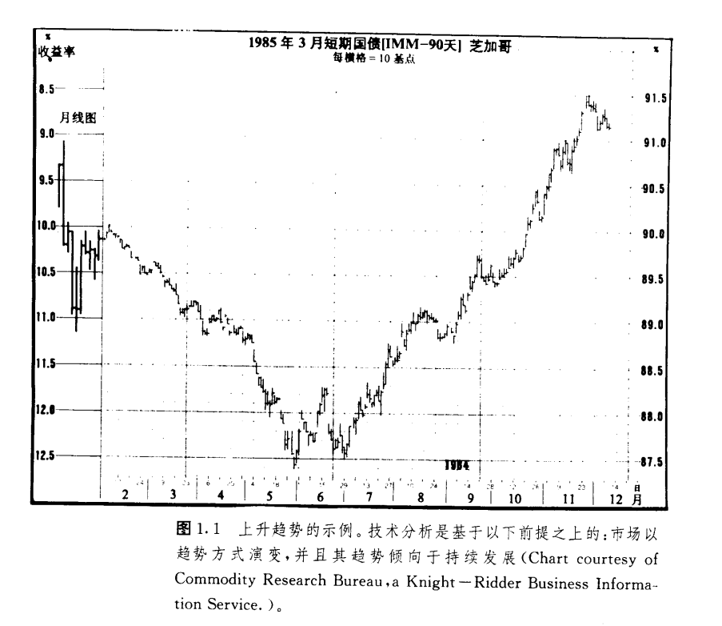
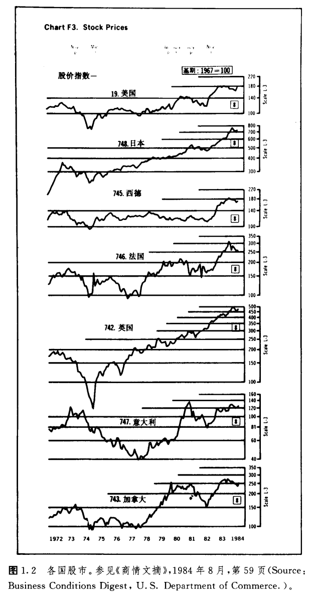
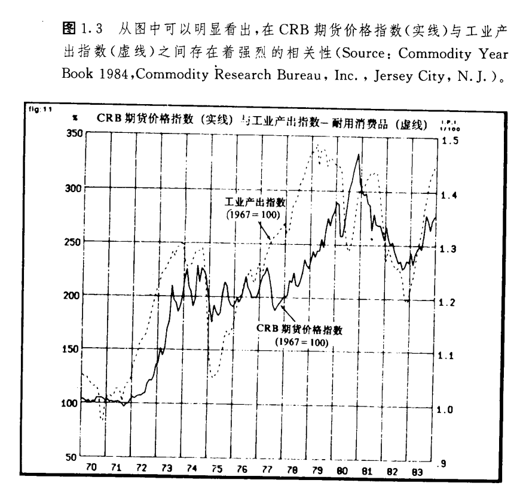
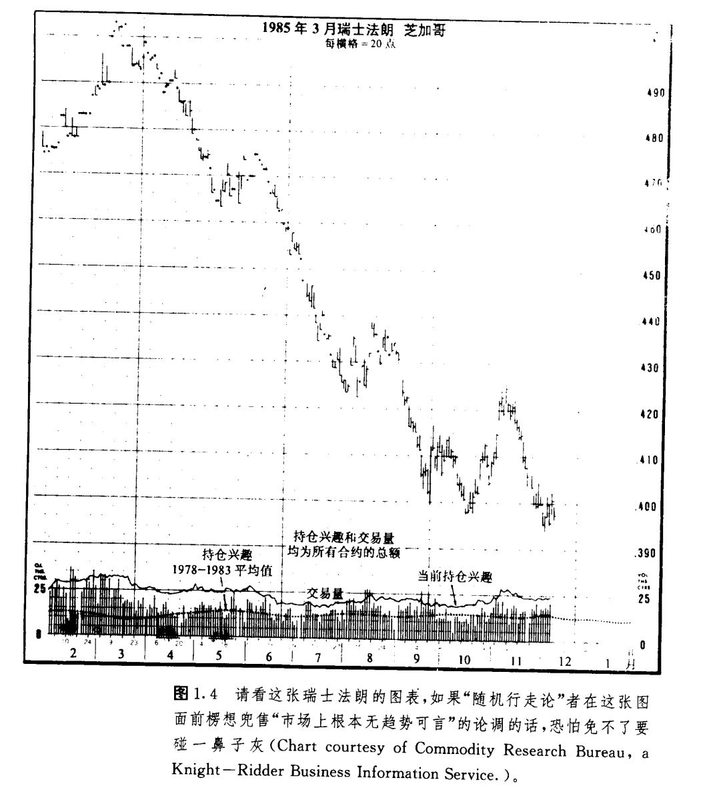

# 技术分析理论基础

## 引言

这一章我们先来做四个事情。第一，给技术分析下个定义，其二，讨论一下技术分析赖以成立的哲学前提或者说基本原理，接下来把技术分析同基础分析分出个子丑寅卯来，最后谈谈几种常见的反对技术分析的意见。

我坚信，只有先弄清楚了技术分析的所作所为，特别是它的理论基础之后，才谈得上全面理解和掌握它。

首先，我们下定义。技术分析是以预测市场价格变化的未来趋势为目的，以图表为主要手段对市场行为进行的研究。“市场行为”有三方面的含义—价格、交易量和持仓兴趣，它们是分析者通常能够获得的信息来源。另一个概念“价格变化”虽然也常用，但好象太狭窄了，因为大多数分析者也把交易量和持仓兴趣用作分析资料的一部分。在以后的讨论中，“价格变化”和“市场行为”就按这两种意义区别使用。

## 理论基础

技术分析有三个基本假定或者说前提条件:

1.市场行为包容消化一切。

2.价格以趋势方式演变。

3.厉史会重演。

### 市场行为包容消化一切

“市场行为包容消化一切”构成了技术分析的基础。除非您已经完全理解和接收这个前提条件，否则以下的讨论毫无意义。技术分析者认为，能够影响某种商品期货价格的任何因素——基础的、政治的，心理的或任何其它方面的——实际上都反映在其价格之中。由此推论，研究价格变化就是我们必须做的事情。这个断语乍听也许过于武断，但是花功夫推敲推敲，就确实没话可说。

这个前提的实质含义其实就是价格变化必定反映供求关系，如果需求大于供给，价格必然上涨；如果供给过于需求，价格必然下跌。这个供求规律是所有经济的、基础的预测方法的出发点。把它掉过来，那么，只要价格上涨，不论是因为什么具体的原因，需求一定超过供给，从经济基础上说必定看好；如果价格下跌，从经济基础上说必定看淡。您瞧，这段话基础分析的味道多么浓，不过大可不必为它出现在我们这篇纯粹关于技术分析的文章中而惊讶。归根结底，技术分析者不过是通过价格间接地研究经济基础。大多数技术派人士也会同意，正是根本的供求关系，即某种商品的经济基础决定了该商品的市场看涨或者看跌。图表本身并不能导致市场的升跌，只是简明地显示了市场上流行的乐观或悲观的心态。

图表派通常不理会价格涨落的原因，而且在价格趋势形成的早期或者市场正处在关键转折点的时候，往往没人确切了解市场为什么如此这般古怪地动作。恰恰是在这种至关紧要的时刻。技术分析者常常独辟蹊径，一语中的。所以随着您市场经验日益丰富，遇上这种情况越多，“市场行为包容消化一切”这一点就越发显出不可抗拒的能力。

顺理成章，既然影响市场价格的所有因素最终必定要通过市场价格反映出来，那么研究价格就足够了。实际上图表分析师只不过是通过研究价格图表及大量的辅助技术指标，让市场自己揭示它最可能的走势，而并不是分析师凭他的精明“征服”了市场。今后讨论的所有技术工具只不过是市场分析的辅助手段。技术派当然知道市场起落肯定有缘故，但他们认为这些原因对于分析预测无关痛痒。

### 价格以趋势方式演变

“趋势”概念是技术分析的核心。还是那句话，除非您也接受这第二个前提，否则就不必再读下去。研究价格图表的全部意义，就是要在一个趋势发生发展的早期及时准确地把它揭示出来，从而达到顺着趋势交易的目的。事实上，本书绝大部分理论在本质上就是顺应趋势，即以判定和追随既成趋势为目的(见图1.1)。

从“价格以趋势方式演变”可以自然而然地推断，对于一个既成的趋势来说，下一步常常是沿着现存趋势方向继续演变，而掉头反向的可能性要小得多。这当然也是牛顿惯性定律的应用。还可以换个说法:当前趋势将一直持续到掉头反向为止。虽然这几句差不多是车轴辘话，但反复强调的无非只有一个意思:坚定不移地顺应一个既成趋势，直至有反向的征兆为止。这就是趋势顺应理论的源头。

### 历史会重演

技术分析和市场行为学与人类心理学有着千丝万缕的联系。比如价格形态，它们通过一些待定的价格图表形状表现出来，而这些图形表示了人们对某市场看好或看淡的心理。其实这些图形在过去的一百多年里早已广为人知、并被分门别类了。既然它们在过去很管用，就不妨认为它们在未来同样有效。因为它们是以人类心理为根据的，而人类心理从来就是“江山易改本性难移”。“历史会重演”说得具体点就是，打开未来之门的钥匙隐藏在历史里，或者说将来是过去的翻版。

## 技术分析与基础分析之辨

技术分析主要研究市场行为，基础分析则集中考察导致价格涨、落或持平的供求关系。基础分析者为了确定某商品的内在价值，需要考虑影响价格的所有相关因素。所谓内在价值就是根据供求规律确定的某商品的实际价值，它是基础分析派的基本概念。如果某商品内在价值小于市场价格，称为价格偏高.就应该卖出这种商品，如果市价小于内在价值，叫做价格偏低，就应买入。

两派都试图解决同样的问题，即预测价格变化的方向，只不过着眼点不同。基础派追究市场运动的前因，而技术派则是研究其后果。技术派理所当然地认为“后果”就是所需的全部资料，而理由、原因等无关紧要。基础派则非得刨根究底不可。

 大多期货商要么说自己是技术派，要么说自己是基础派。实际上不少人两手兼备。绝大部分基础分析师对图表分析的基本立场有实用的了解，同时，绝大部分技术分析师对经济基础也至少有个走马观花的印象(不过也有的技术分析者不遗余力地拒绝知道任何经济信息，人称“技术癖”)。成问题的是，在很多场合，图表的预测和基础的分析南辕北辙。当一场重要的市场运动初露端倪的时候，市场常常表现得颇为奇特，从基础方面找不出理由。恰恰是在这种趋势萌生的关键时刻，两条道路分歧最大。等趋势发展过一段之后，两者对市场的理解又协调起来.可这个时候往往来得太迟，交易者已经无法下手了。

 两种方法貌合神离，而市场价格的变化总要超前于哪怕是最新获得的经济情报。换言之，市场价格是经济基础的超前指标，也可以说是大众常识的超前指标。经济基础的新发展在被统计报告等资料揭示之前，早已在市场上实际发生作用，已经被市场消化吸收了。因此，当前的价格实际上是当前尚来不及为人所知的经济基础因素作用的结果。历史上一些最为剧烈的牛市或熊市在开始的时候，几乎找不到表明经济基础已改变了的资料，等到好消息或坏消息纷纷出笼的时候，新趋势早已滚滚向前了。

 而技术派往往非常自信，当大众常识同市场变化牛头不对马嘴的时候，也能够“众人皆醉而我独醒”，应付自如。他们乐于领先一步，当少数派，因为他们明白，个中原因迟早会大白于天下，不过那肯定是事后诸葛亮，他们既不愿意也没必要坐等，丧失良机。

 有了上面的分析，您就不难理解何以技术派总觉得他们的一套比基础派的强。要是一个交易商非得从二者之中挑一个不可，那么，合乎逻辑的抉择必然是技术分析。因为从定义上说，技术分析已经容纳了基础性因素。如果经济基础已经反映在价格之中.那么再研究有关的基础性资料就多余了。图表分析抄了基础分析的近道，反过来却不然。基础分析里不包括价格的变化。如果说单纯利用技术分析从事商品期贷交易还可以的话，要是某人毫不理会市场的技术特点，试图单单利用基础分析来做交易，那就大为可疑了。

## 技术分析与出、入市时机选择

为把上面最后一句话讲得更清楚，我们把决策过程分为前后两个阶段；先分析市场，而后选择出入市时机。期货市场的杠杆作用注定了时机是交易成败的关键。诸注意，即使您在把握大趋势上没有出问题，仍然很可能赔钱。因为期货交易所要求的保证金实在太少(通常少于交易额的10％)，价格朝不利的方向即使变化得并不大，交易商也可能被扫地出门，损失大部分乃至全部保证金。在股票市场上，情况不一样，如果股价跌了，则不妨先拿着股票等等看，但愿总有涨回来的一天。不少股票交易商就这么着，从投机转变成投资。

 期货交易商可占不到这个便宜。“买了走着瞧”这一直行不通。在市场预测阶段，技术分析或基础分析都可采用，但到了选择具体出入市时机的时候，就只能仰仗技术分析了。这就是说，只要做交易，就得按步就班地完成这两个步骤；哪怕您在第一个阶段用的只是基础分析，在第二阶段也还是非用技术分析不可。

## 技术分析的灵活性和适应性

技术分析有一个了不起的长处，它适用于任何交易媒介和任何时间尺度。不管是做股票交易，还是做商品交易，没有用不上的地方。
做商品期货，图表派可以随心所欲地同时限踪许多种类，而基础派往往顾此失彼。经济基础方面的资料太繁杂了，大多数基础分析师只好从一而终，专门研究某种或某类商品.比如谷物或者金属类。我们绝不可忽视这个差别。

就说这一桩吧，市场有时平平淡谈，有时候高潮迭起，既有趋势明朗的情况，也有杂乱无章的阶段。技术派就不妨集中精力和资源，专门对付趋势良好的市场，暂且不理会其它趋势不明者。这样.在市场上各种商品轮流做庄，交替活跃，技术派跟着把注意力和资金转移到最行时的对象上去。不同的时候总有不同的商品最火爆，趋势漂漂亮亮，而且往往此起彼伏。技术分析师大得其宜，随机应变地轮换新宠。而基础派多是“专家”，常常享受不到这份灵活性。即使他们要东施效颦，也非得付出许多额外的时间去把握新对象不可，缺了图表派那份潇洒。

技术派的另一个优势是“既见树木又见森林。”他们能同时跟踪所有市场，对商品市场在总体上有很好的把握，避免了从一而终所致的管窥蠡测、坐井观天的毛病。而且许多期货之间存在着内在的联系，对类似的经济因素也会作出相互关联的反映，因此它们之间在价格变化上可以互为线索、相互参照。

## 技术分析适用于各种交易媒介

图表分析原则既适用于期货，也适用于股市。它实际上起源于股市分析，后来才移植到期货市场，如今股票指数期货已经上市，两个市场之间的界限正飞快地消失。正如图1.2所示，各国股票市场也引入了图表及其分析原理。

10年来，金融期货，包括利率和汇率期货大行其道，图表分析理论在这些市场上如鱼得水。

技术分析原则在套头交易(差价交易)和期权交易中也有用武之地。另外，商业保值也需要考虑价格未来走向，因而技术分析同样能发挥所长。

## 技术分析适用于各种时间尺度

图表分析的另一个优点是它能应用在不同的时间尺度之下。无论是研究一天以内的价格变化做当日交易，还是顺应趋势做中等期限的跟势交易，都可以采用相同的原理。目前较长期技术预测还往往被忽视。有人说图表分析只适合短时间域，这是无稽之谈。也有人和稀泥，说基础分析适合做长期预测，而技术分析用于短线的时机选择更好。实践证明，使用周线图或月线图解决长期预报问题也毫不逊色。

只要您完全领会了本书所讨论的技术原理，就能在各种交易工具中、在各种时间尺度上左右逢源。

## 经济预测

许多人以为技术分析相对冷僻狭隘，或者把它理解成专门对付股票、期货的高度专业化的工具。实际上它的基本理论完全能够应用到经济形势的预测上来，只不过迄今为止这方面的前景还没有被充分地认识。

技术分析预测的是金融市场的未来轨迹。这些预测对预测经济有价值吗?请看几年前华尔街日报刊登的这篇文章：《近来债券价格快步上涨，而它历来是经济转折的优良先行指标》(1982年9月28日)。文章通过广泛的历史纪录有力地表明，债券价格是经济滑坡或回升之前的显著征兆。作者写道：“它作为征兆明显优于股票价格，就事论事，也大大胜过官方公布的各种先行指标。”

我们注意到引文中也提起了股票价格。标准普尔氏500种股票平均价格指数是商业部随时关注的12种经济先行指标之一。文章引用了马萨诸塞州国立经济研究院的一份研究报告，证明该股票指数在这12种先行指标中表现最佳。我想强调的是，现在我们既有债券期货，也有标准普尔氏500种指数的期货，而技术分析在研究这两种期货时都能游刃有余，那么，不论您意识到与否，当我们对它们进行技术分析时，也同时成功地分析了经济。有个最生动的例证。1982年夏季，股票指数和债券市场同时爆发了—轮剧烈的牛市，及时地宣告一场自二次大战以来为时最长、痛苦最深的大衰退就此终结——然而经济学界对如此重大的转折当时差不多毫无觉察。

纽约咖啡、糖和可可交易所(CSCE)已经申请开设四种经济指标的期货合约，其中包括住房开工率和工薪消费者物价指数(CPI—W)，估计商品研究局期货价格指数(CRB指数)也即将上市。而CRB指数早就被看成是显示通货膨胀压力的晴雨表。但这个指数的用途远不止于此。1984年商品年鉴(商品研究公司，新泽西城)中有篇文章，对照研究了自1970年以来CRB指数同各种经济指标的相互关系(见图1.3)。

该研究表明，cRB指数同工业产出指标有很强的相关性，而且商品价格指数一般领先于后者的变化。有原文为证：“cRB指数同工业产出指标有很高的相关性，表明cRB是一个非常可靠的一般经济指标。”(期蒂芬·W·麦克，《作为一般经济指标的cRB指数——有27个品种的一篮子商品，一种新期货》，第46页)，不妨加一句，我们用图表分析cRB指数有年头了，干得相当漂亮。

综合上述可以清楚地看出，技术分析这一预测工具价值不菲，研究瞥如黄金或大豆价格走向等等问题只是牛刀小试而已。当然，也要清楚，技术分析在预测一般经济趋势上前景虽然广阔，但还有待开发利用。CSCE最近推出的消费者物价指数(CPI—w)期货可谓这方面的好榜样。

## 技术分析师?图表分析师?

对从事技术分析者有好几种称呼，比如技术分析师、技术师、图表分析师、市场分析家等等。这些说法以前其实是一个意思，如今技术分析的专业分工越来越细，就有必要讲究讲究，仔细地区分。十年前，所有的技术分析都是围绕图表开展的，技术分析、图表分析是一码事。现在不行了。

随着技术分析领域的不断拓展，采用传统图表分析方法的人仍自成一派。即所谓技术分析派，则往往借助统计科学和计算机工具。当然这种区分有许多重复之处，而且大多数人在一定程度上两边都沾得上，但正如技术派同基础派的分别一样，他们毕竟有所不同。

传统的图表分析师无论是否利用计算机辅助工作，图表依然占首要地位，其余统统是参考。而研究图表必定具有一定的主观色彩，在绝大多效场合，分析成功与否取决于分析者自身的素质。所以研读图表确实需要技艺，图表分析师又常被称为“图表艺术家”倒也并非“浪得虚名。”

反过来，技术分析应用了统计科学，以计算机为工具，力求客观地定量测试和改进其自动交易系统。他们把这种系统或者交易模式编成软件，由计算机计算出“买”、‘卖”信号。其中有的简单，有的极为复杂，不过总的一条，就是要尽量减少甚至完全排除人的主观影响，把交易变成科学实践。图表在这些统计学家那里可有可无。但是只要他们的工作不超出研究市场变化这个大范围，就仍算是技术分析师。

另外，使用计算机的分析者也可以划分成两类。一类人倾心研制自动交易系统，又称“黑箱技术”，另一种人则致力于利用计算机开发新的技术信号，对这些技术指标的解释及其实际应用他们自己了然于心。

所有的图表分析师都是技术分析者，可是并非所有的技术分析师都是图表分析师。这也是区分两者的一个办法。本书不打算刻意区别使用这两种说法，不过应该清楚，图表分析只是广阔的技术分析领域中的一部分。职业技术分析人员宁愿人际“技术分析师”而不喜欢“图表分析师”这个头衔，就好比一个是“千里马”，一个是“驽马”，前者听起来俨然更加造诣不凡。

## 技术分析在股市和期货市场应用上的简要比较

常常有人问技术分析在股市和期货市场上的用法是不是一样，答案为既是也不是。

基本原理是共同的，使用的基本工具也一样，比如线图、点数图、价格形态、交易量、趋势线、移动平均线和摆动指数等等。只要在一个市场上学会运用这些基本知识，就能轻车熟路地适应另外一个市场。当然股票市场和期货市场毕竟有本质区别，要说技术分析在它们那里的差别，也就是由两个市场本身的先天特征造成的一般意义上的不同，工具本身是没有什么分别的。

### 标价方式

商品的标价方法比股票复杂很多。每种商品都按特定的单位标价并制定价格增减的最基本幅度。举例来说，谷物市场上的报价方式是每蒲式耳若干美分，金银是每盎司若干美元，利率是基本点数等等。交易商必须明了每个市场的具体情况：在哪间交易所上市，合约如何标价，最大和最少的价格变化单位是多少，每张合约每基本单位价格变化相当于多少钱的出入等等。

### 具有一定的有效期限

商品期货合约都有失效日期，股票则不然。比如美国长期国库券1985年3月份合约在1985年3月到期。购货一般在到期前有大约一年半的交易时间，所以在任何时候同一商品在市场上至少同时流通着6种到期月份不同的合约。交易商事先必须清楚哪一种值得买卖，哪种则应避开(以后解释这一点)。有效期特点给长期价格预测增加了难度。每当旧合约期满新合约上市，总不得不相应地从头开始画图，而且过期合约的旧图表用处不大，新图表连同各项新的技术参数都得重砌炉灶。市场上推陈出新不要紧，但要想维持一个长期图表就实在棘手。即使有计算机帮忙，也必须从零开始，花费可观的人力物力来刷新资料。

### 较低的保证金水平

恐怕要数这个区别最要紧了。所有的期货都以保证金方式交易，大多数期货所要求的保证金少于交易量的10％。较低的保证金水平导致了很高的杠杆效应。价格不管朝哪个方向只变化一点点，就会影响总的交易成绩。正因如此，在期货市场上可能在很短的时间内赚或者赔一大笔钱。既然交易者只拿出10％的押金，却做了l00％的交易，那么10％的价格变化就能或者让他本金翻倍，或者让他血本无归。时间也不一定长，吃早饭开头寸，也许不到午饭时分，整个过程就结束了。期货市场的杠杆效应放大了市场动作，使之看起来比实际上更反复无常。要是有人扬言自己在期贷市场上被“洗劫一空”，您请记着他起先是拿10％搏100％的。

从技术分析的角度看，杠杆效应使选择出入市时机这一步骤在期货市场比在股票市场大为重要。正确地选择入市和出市的时机一方面是交易成败的关键，另一方面也是市场分析面对的一大课题。正是这样，以技术分析为中心的交易策赂才成为期货交易成败攸关、不可或缺的关键。

### 时间域大为缩小

在杠杆效应作用下，期货商必须密切关注市场的一举一动，因此所关心的时间域必然也细致入微。与此不同，股市分析者喜欢更长时间的图表，研究更长时间的问题.他们也许要预测的是3个月或半年后的市场。期货商想知道的则是下周、明天乃至下半天的形势如何，所以所提炼出的一些具有即时效用的工具，股市分析师或许闻所末闻。移动平均线便是一例。在股市分析中用得最广泛的是30周或者200天的平均线，而在期货市场，绝大多数在40天以下，其中流行的移动平均线组合是4天、9天和18天。

### 时机更为紧要

对期货商而言，时机决定一切。正确判别市场方向仅仅是问题答案的一小部分。入市时间相差一天，有时甚至仅几分钟，结果可能就是成与败，截然不同。弄错了市场趋势而赔了钱固然糟糕，然而大方向没错却依然损兵折将才是期货交易最令人沮丧、畏缩的地方。基础性因素很少一天一变，所以毋庸置疑，时机抉择问题实质上纯粹是技术性的。

### 广泛商品价格平均指数用得较少

股票平均价格指数的变化是极为引人注目的，比如道·琼斯工业股票指数或者标准普尔氏500种股票指数。实际上这是所有股市分析的起点。期货市场一般并非如此。尽管也有一些代表商品市场总体价格方向的指数，比如商品研究局期货价格指数(CRB)也广受注意，但它们没有股票指数那样显要。

### 广泛性技术信号在期货市场用得较少

股市分析中广泛性技术信号很重要，例如涨跌线、新高新低指数、空头动向比等，但它们在期货市场不流行。这倒不是因为它们的理论和实践压根不适合期货，也许有一天期货种类大为增加，就有必要借助这些广泛性指标来判断市场总体运动了，只是迄今为止还用不着它们。

### 具体的技术工具

大多数起源于股市分析的技术工具也能适用在商品市场，不过用法不完全一样。

举个例子，期货的图表形态往往不象在段市里那样走得那么完整，移动平均线的天数也少好多，传统的点数图也用得不广泛。这是因为很难获得每天的价格数据的细节，所以主要是场内交易商使用点数图。本书后面还将进一步讨论上述分别以及其余用法上的差别。

最后我们谈谈股市同期货之间另一个重要区别。在进行股市技术分析时，非常看重情绪指数和资金动向。情绪指数用来跟踪显示散户、共同基金、场内交易商等各个群体的表现。根据“真理往往在少数人一边”的原则，情绪指数是判断市场在总体上看好或看淡的极为重要的依据。资金动向用来考察不同群体的现金头寸情况，比如共同基金或大机构交易商的帐户。它的基本理论是现金头寸越大，就越有购买股票的潜力。就技术分析本身而言，两者都属于辅助性质，但股市分析者对它们的重视程度比对传统的市场分析要大些。

在我个人看来，期货市场中的技术分析是更为纯粹的价格研究。虽然相反意见理论在一定范围内不无长处，但基本趋势分析和传统技术指标的应用更为关键。

## 技术分析的一些反面意见

在讨论技术分析时，常常出现一些大同小异的疑问。所谓“预言自我应验”就听得不少。还有“到底能否用过去的价格资料来预测下一步价格方向?”等等。反对者总是强调“图表记录了市场价格的来龙，却说不出它的去脉”。很显然，如果您不会读图，当然从图表上看不出门道来。这一点姑且不论。随机行走理论认为价格毫无趋势可言，言下之意是什么样的预测技术也不比简简单单地“买了拿在手里等着”这一招高明。这就值得理论理论。

### “一语成谶”论

“一语成谶”论也可以说成“预言自我应验”。是不是真管用?这个问题问得太多了，说明很多人心存疑惑。这种说法肯定不是无中生有，不过大可不必如此耿耿于怀。下面我们引用一段话，也是讨论期货交易的，从几个方面批评了图表形态，这也许是表述上述问题的最好方法。

> a.近年来绝大部分图表形态流传广泛。许多交易商把它们牢记于心，常常根据图形不约而同地行动。于是乎每当图形发出“看涨”或“看跌”的信号时，买者或卖者一涌而上，结果产生了“预言自我应验”的现象。
>
> b.图表形态的辩认几乎纯粹出自主观判断。迄今没有任何图形可以用数学方法科学地定量研究。要说它们是读图者心中的臆想，一点也不夸张……(理查德·J·塔韦尔斯，查尔斯·v·哈洛，赫伯特.L·斯通，《商品期货游戏》，p.176，麦格劳一希尔出版社，1971年)。

上面两段批评自相矛盾，后语抹杀了前言。既然图表形态“出自主观判断”，是“读图者心中的臆想”，那么许多人在同时看出同样的信号这事就实在不可思议了，而这恰恰是“自我应验”论的基础。看来批评家们只好割爱，不可以一边说图表形态是板上钉钉，既客观又容易判定，每个人都能同时看出同样的图形，采取同样的行动，使图表形态自动应验；一边又批评图表分析过分地主观、人见人殊。

事实上图表形态很客观，而研读图表是门艺术(或者说是“技巧”更恰当)。图表形态几乎从来没有清楚得能让有经验的分析师们意见一致的时候。疑虑重重、困惑不解或者仁者见仁智者见智才是家常便饭。正如本书将要说明的那样，技术分析有许多种选择，各种选择相互之间经常合不上榫。有条条大路，但不全通罗马。

即便大多数分析者预测一致，所见略同，他们也不一定在同时以同样的方式入市。有些也许预计到图表信号将会出现便“先下手为强”。还有人也许等到图形或指标突破后在市场回撤时才下手。有些交易商大胆积极，有些人谨慎保守。有些人在入市时同时发出止损指令，有些则留下预定水平指令或限价交易指令做交易。因此所有人在同一时刻以同一方式入市的可能性甚微。

即使“预言自我应验”果有其事，那么它天生也会“自我修正”。换句话说，在交易商们不谋而合的行为扭曲市场之前，大家都仰仗图表，而一旦“自我应验”发生之后，他们要么把图表扔到一边，要么更改交易策略。比如他们可能力图在众人之前或者等到市场进一步证实时才作反应。就这样，即使短时间内预言自动应验现象惹出问题，这种机制本身也将自动地修正自己。

请记住，唯有供求规律才能决定牛市或熊市的发生、发展。技术分析师势单力簿，绝不能凭白无故地靠他们自己的买进或者卖出引发市场的重要变化。要是他们能做到这一点，早就该发大财了。

一些规模庞大的交易商越来越多地借助计算机化的自动交易系统，它们带来的问题其实比图表分析师招惹的麻烦重大得多。设计这些系统都是为了辨识和顺应大趋势，本质上属于“因势利导”。十多年来在期货行业中，置于职业化管理之下的资金急剧膨胀，公共和私人基金动辄上亿美元地买卖。它们又大多采用此类技术性系统，结果是庞大的资金高度集中，在为数不多的几个趋势性市场“迫势逐利”。因为期贷市场总的容量尚有限，这些系统短期内对价格产生破坏性影响的危险性与日俱增。然而哪怕万一出现了这种偏差，也注定为时短暂，不会引起重要的运动。（注1）

> ①原著者注：附带说一句，多年来每当市场发生出人意料的动作，不容易找到基础方面的原因的时候，新闻界往往用“图表招致的抢购(或抛售)”等等说法搪塞一番。最近，什么“图表加计算机招致的抢购(或抛售)”的说法也时有耳闻了。不管什么场合，只要金融新闻界技穷，找不出市场变化的缘由，他们就拿技术分析师垫背，除此之外，他们还能指望什么？可恶。

我们再次强调，甚至由于高度集中的巨额资金采用技术性系统引致的向题也会自我修正。如果所有的系统同时做同样的操作，交易商就会调整系统，使之更迟钝或更灵敏。

 我们一般把预言自我应验论看成是对图表分析的反对意见，其实说它是赞誊或许更为拾当。要是有哪种预测技术如此广受欢迎，以致于能够影响市场，那它非得出类拔萃不行。您不妨琢磨琢磨，为什么提起基础分析时，很少有人会顾虑它也出现自我应验的问题呢?

### 过去能否预测未来?

用过去的价格资料能否有效地预测未来，这是另一个引起争议的问题。很奇怪为什么反对技术分析的人总是拿出这个法宝来，大家都明白，每一种预测方法，从气象预报到基础分析，都是建筑在对历史资料的研究之上的。除此之外，还有什么资料可供选择呢?

统计学理论划分成描述统计学和推导统计学两部分。描述统计学指用图表达资料数据，比如用一张标准的线图来展示价格历史。推导统计学则指从资料推导出概括的、预测的或推延性的结论。所以价格图表属于前者的范畴，而针对价格图表进行的技术分析则属于推导统计学的范畴。

正如一本统计学教科书所说：“商业或经济预测的第一个步聚就是搜集历史观测资料”(约翰·E·弗罗因德和弗兰克·J·威廉斯，《现代商用统计学》，P383，普伦蒂斯一霍尔出版社，1969年)。图表分析只是时间序列分析的一种形式，正如所有的时间序列分析一样，也是以历史为依据的。无论谁，唯一能获得的资料或者数据，只是过去的记录。只有把过去的经历投影到未来，我们才能估计未来。再从这本书中引用一段：

> 人口预测、工业预测等等，在很大程度上是基于对过去发生的事物的研究。正如在日常生活中一样，在商业和科学上，我们也都是依赖过去的经验展望难以捉摸的未来的(《现代商用统计学》，p383)。

综合起来，技术分析以过去的价格数据预测未来，有充分的统计学根据。要有人执意怀疑技术分析在这个方面的立足点，那么他只好把所有以过去研究未来的学问一古脑儿推翻，当然其中免不了所有的经济分析、基础分析。

## 随机行走理论

随机行走理论原本在高知识阶层发端并流行。它认为价格变化在顺序上互相独立.因而价格历史并不是未来价格方向的可取线索。简而言之，价格变化是随机而不可预测的。这个理论借着《股票市场的随机行走特点》一书到处“行走”，名噪一时。该书编者是保罗.H·库特纳，由麻省理工学院出版社1964年出版。从此赞成和反对两派纷纷著书立说，论战不休。该理论根据有效市场假定，认为价格在内在价值上下随机波动。同时还推论，最好的市场策略就是简简单单地“买了等着”，反对“战胜市场”的企图。

所有的市场确实都具备一定的随机性，或者说“噪音”，但以为所有价格变化都是随机而来却并非实情。断这个官司恐怕凭经验和实践更靠得住，而复杂高深的统计学方法要么似乎能证明研究者预先设想的一切，要么什么也否定不了。满目随机其实只是无力辩识系统性价格变化形态的代名词，您不妨把这话记在心里。许多学者没有能力揭示价格形态，可这并不能证明价格形态不存在(见图1.4)。

当市场趋势明朗时，趋势对一般的市场分析人员或实际交易人员到底有无价值呢?学院派争论不休。要是您对这一点也有疑惑，随便翻翻哪本图表书(随机地挑出来)，就可以很直观地看到趋势确实客观存在。如果价格变化前后无关，也就等于昨天或者上星期的事儿在今天或明天全无痕迹，那么试问随机行走派诸君，如何解释触目可见的趋势呢?不少顺应趋势系统在现实交易中战果辉煌，利润丰厚，又该作何解释呢?在期货市场选择时机是个关键，“买了等着”如何行得通呢？应该在熊市中拿着这些头寸坐等吗?要是前后价格相互无关，价格变化既没有趋势也无从预测，交易商如何能知道牛市和熊市的分别呢？事实上“买了等着”就等于是个上升趋势，那么熊市如何能存在呢？

统计学证据能否最终肯定或彻底推翻随机行走理论，天晓得，不过随机理论在技术分析界毫无市场。如果市场果真随机，那么没有什么预测技术靠得住。有效市场假定恰恰同技术分析的前提之一“市场包容消化一切”异曲同工，而不是否定了技术分析的可取性。学院派也发觉市场很快地消化一切信息，想靠消息灵通来发财没门儿。在这里他们总算摸着技术分析理论基础的一点边，即重要的市场信息在其广为人知之前，早已为市场价格所包容消化。学院派弄巧成拙，反而清清楚楚地证明了密切关注价格变化的重要性，试图利用基础性情报渔利至少对短时期而言是缘木求鱼。

最后我们必须承认，要是不理解具体的过程进行规则，任何过程都会显得杂乱无章。比方说一张心电图，在外行看来，活象一长串杂乱无章的噪音，可在一个训练有素的医生眼中，其中每个小波折都充满了意义，肯定不是随机而来。对没有花功夫研究期货市场行为规律的人来说，市场动作也可能是随机的。随着读图技能的提高，随机的错觉逐渐消失。相信读者在逐步深入学习本书各章节的过程中，会亲身体验这种现象。

如果有兴趣进一步了解随机行走理论，这儿有一份自从70年代早期以来商品期货市场研究的摘要名为《期货市场问题——一份调查报告》，作者阿夫拉哈姆·卡玛拉，刊载在《期货市场学报》1982年卷，第275—278页，约翰·威利父子公司与哥伦比亚大学期货研究中心联合出版。卡玛拉摘录了几份认为期货价格具有连续性、反对随机理论的文章，也选入了另一派的意见，使学院派的这场争论有来有去。这些出版物学究气很浓。其它讨论随机理论的文章偶尔可见。另一本书叫《在华尔街上随机走走》，作者是伯领·G·马尔基尔，纽约w.w·诺顿公司1973年版。

下面，我想引用市场技术分析师协会会员大会上的“主席致辞”，来结束对随机行走理论的讨论。这次会议是应学院派研究者为增进同各行业技术分析业者的交流的要求而召开的。

> 我注意到学院派研究者有一个重要的转变。他们现在终于意识到，尽管近年来学院派出版物上各种批评不绝于耳，分析家和投资者们依然非常成功(弗雷德·迪克森，协会主席，市场技术分析师协会通讯，1984年2月)。

## 结论

现在我们已经为技术分析打好了理论基础，也澄清了一些有关技术分析吵常见疑间，可以言归正传了·我们选择源远流长的最著名的技术分析理论—道氏理论作起点。
