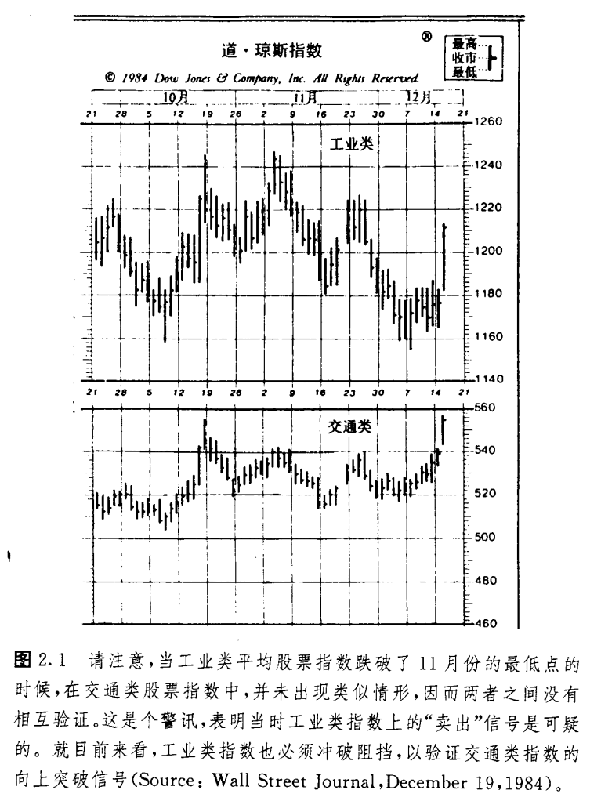
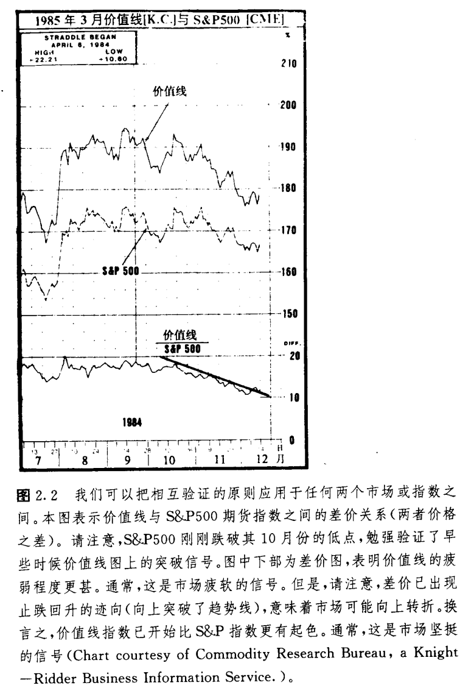
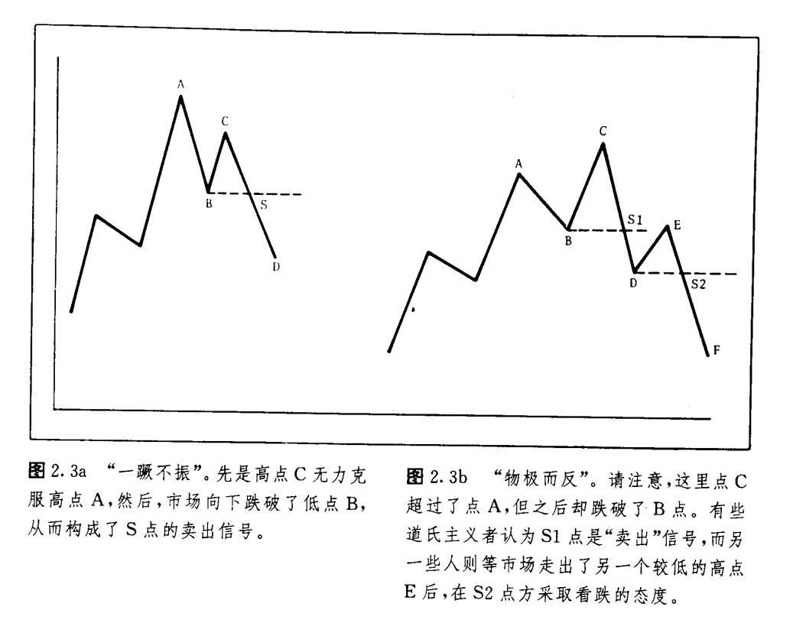
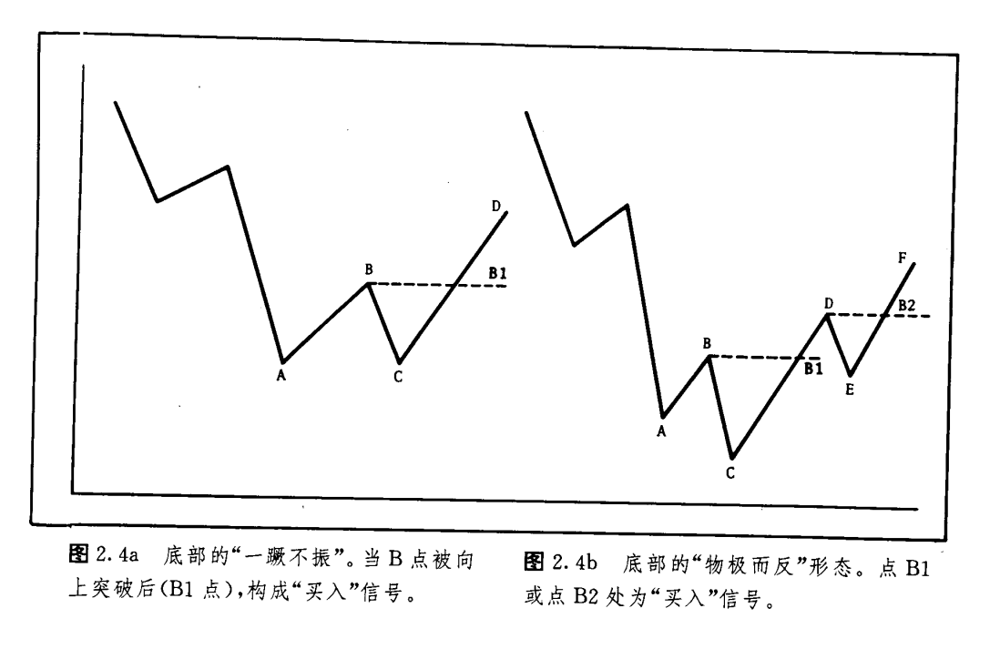

# 道氏理论

## 引言

1984年7月3日，华尔街日报发表了题为《卓越的查尔斯·道指数百年诞辰》的文章。同一星期，在华尔街日报的姐妹出版物——巴伦氏周刊上，也登载了《百年来道氏理论为投资者立下汗马功劳》。查尔斯·H·道于1884年7月3日首创股票市场平均价格指数，上述文章便是为纪念他这一创举一百周年而撰写的。该指数涎生时只包含十一种股票，其中有九家是铁路公司。直到1897年，原始的股票指数才衍生为二，一个是工业股票价格指数，由12种股票组成；另一个是铁路股票价格指数，包含20种成分。到1928年，工业股指的股票覆盖面扩大到30种，1929年又添加了公用事业股票价格指数。虽说新的指数日益增加，但道氏1884年的首创却是它们共同的鼻祖。

逢此盛时，市场技术分析师协会(MTA)也向道·琼斯公司颁赠了高汉默银碗奖，以表纪念之情。该公司是道氏与爱德华·琼斯在1882年共同创办的。MTA在致辞中这样写道：“特以本奖授予查尔斯·道，表彰他对投资研究领域做出的名彪青史的贡献。在其逝世80多年后的今天，他所创立的指数仍然是市场技术分析者不可或缺的有力工具。同时，他的创造也为各种现有的指数奠定了基础。这些指数是股票市场活动的晴雨表，受到了广泛的重视。”

道氏从未为其理论著书立说，这是我们的一大损失。上世纪末，他在华尔街日报上发表了一系列社论，表达了他对股票市场行为的研究心得。直到1903年，也就是他逝世一年后，这些文章才被收编在S·A·纳尔逊所著的《股市投机常识》一书中，得以集中出版(1978年弗雷泽出版公司重印此书)。正是这本著作首次使用了“道氏理论”。在理查德·罗素为该书撰写的序言中，把道氏对股票市场理论的贡献同弗洛伊德对精神病学的影响相媲美。

为什么我们要不厌其烦地介绍上述背景?为什么道氏理论如此引入注目？答案是现成的。迄今大多数广为使用的技术分析理论都起源于道氏理论，都是其各种形式的发扬光大。道氏是技术分析的开山祖师爷。虽然现在已经是计算机的天下，大量崭新的、而且据说更有效的技术指标层出不穷，但道氏理论仍然拥有一席之地。很多技术分析师也许不清楚他们这些“现代化”工具在多大程度上继承了道氏发现的基本原则。所以，我以为很有必要先简要地介绍一下道氏理论，然后才开始研究技术分析。

如上所述，道氏的理念起先包含在一系列评论文章中。后来，由道氏在华尔街日报的助手和传人威廉·彼得·汉密尔顿归纳整理了道氏的理论，发表在1922年出版的《股票市场睛雨表》(纽约哈普兄弟公司出版)中。罗伯持·雷又把道氏理论进一步加以提炼，在1932年出版了《道氏理论》一书(巴伦氏出版公司，纽约)。

道氏的研究是针对他发明的股市平均价格，即工业股指和铁路股指所进行的，但是其绝大部分理论在商品期货市场也游刃有余。本章将介绍道氏理论的基本原则，同时着手表明这些基本原理同本书后面各章内容的联系。这里要讲到六条基本原则，其中大部分内容对期货技术分析师来说都不会耳生。当然，更深入的探讨要留待后面各章节分别进行。

## 基本原则

1.**平均价格包容消化一切因素**。挺耳熟吧?这正是第一章所介绍的技术分析理论的基本前提之一，只是这里用平均价格代替了个别对象的价格。这个原则表明，所有可能影响供求关系的因素都必得由平均市场价格来表现，就连‘天灾’，比方说地震或者其它自然灾难也不例外。当然这些灾相事先谁都难以料到，但是一旦发生，就会很快被市场通过价格变化消化吸收掉。

2.**市场具有三种趋势**。道氏的趋势定义是，只要相继的上冲价格波海和波谷都对应地高过前一个波峰、波谷，那么市场就处在上升趋势之中。换言之，上升趋势必须体现在依次上升的蜂和谷上。相反，下降趋势则以依次下降的峰和谷为特征。正如将在第四章所讲的，这仍是趋势的基本定义，仍是所有趋势分析的起点。

道氏把趋势分成三类——主要趋势、次要趋势和短暂趋势。其最关心者为主要趋势(或称大趋势)，通常持续一年以上，有时甚至好几年。他坚信，大部分股市投资者钟情于市场的主要方向。道氏用大海来比喻这三种趋势，把它们分别对应于潮汐、浪涛和波纹。

主要趋势如同海潮，次要趋势(或称中趋势)是潮汐中的浪涛，而短暂趋势则是浪涛上泛着的波纹。从堤岸标尺上，我们可以读出每次浪涛卷及的最高位置，然后通过挨次地比较这些最高位置的相对高低就能测定海潮到底是涨还是落。如果读数依次递增，那么潮水依然在向陆地推进。只有当浪涛峰值逐步递减的时候，观测者才能确知潮水已经开始退却。

次要趋势(或中趋势)代表主要趋势中的调整，通常持续三个星期到三个月。这类中等规模的调整通常可回撤到界乎先前趋势整个进程的三分之一到三分之二之间的位置。常见的回撤约为一半，即百分之五十。

短暂趋势(或小趋势)通常持续不到三个星期，系中趋势中较短线的波动。我们在第四章讨论趋势概念时，将采用与这里几乎一致的术语，以及差不多的回撤比例。

3.**大趋势可分为三个阶段**。大趋势通常包括三个阶段。第一阶段又称积累阶段。以熊市末尾牛市开端为例，此时所有经济方面的所谓坏消息已经最终地为市场所包容消化，于是那些最机敏的投资商开始精明地逐步买进。第二阶段，商业新闻趋暖还阳，绝大多数技术性的顺应趋势的投资人开始跟进买入，从而价格快步上扬。第三阶段，即最后一个阶段，报纸上好消息连篇累牍，经济新闻捷报频传，大众投资者积极入市，活跃地买卖，投机性交易量日益增长。正是在这个最后阶段，从市面上看起来谁也不想卖出，但是那些当初在熊市的底部别人谁也不愿买进的时候乘机“积累”、步步吃进的精明人，开始“消散”，逐步抛出平仓。

熟悉艾略特波浪理论的读者肯定不会对上述关于大趋势的三部曲式、各具特色的划分感到陌生。在30年代出版的雷氏的《道氏理论》的基础上，艾略特构造了他自己的波浪理论。艾略特也认识到牛市有三个主要上涨阶段。在本书的“艾略特波浪理论”一章中，我们将表明，道氏的牛市三部曲同波浪理论的分浪特色惊人地相似。艾略特理论和道氏理论的主要分歧在于相互验证原则，下面我们就要讲到。

4.**各种平均价格必须相互验证**。具体而言，道氏是指工业股指同铁路股指应相互验证，意思是除非两个平均价格都同样发出看涨或看跌的信号，否则就不可能发生大规模的牛市或熊市。换句话说，为了标志牛市的发生，两种平均价格都必须涨过各自的前一轮浪涛(中趋势)的峰值。如果只有一个平均价格突破了前一个高峰，那还不是牛市。两个市场倒也不必同时发出上涨信号，不过在时间上越近越好。如果两个平均价格的表现相互背离，那么我们就认为原先的趋势依然有效(参见图2.1)。艾略特波浪理论在这一点上与道氏理论不同，只要求单个平均价格给出信号就足够了。关于相互验证和相互背离原则我们以后还要详细解说(见图2.2)。

5.**交易量必须验证趋势**。道氏认为交易量分析是第二位的，但作为验证价格图表信号的旁证具有重要价值。简而言之，当价格在顺着大趋势发展的时候，交易量也应该相应递增。如果大趋势向上，那么在价格上涨的同时，交易量应该日益增加，而当价格下跌时，交易量应该日益减少。在一个下降趋势中，情况正好相反，当价格下跌时，交易量扩张，而当价格上涨时交易量则萎缩。当然，我们必须强调，交易量是第二位的参照指标，道氏理论实际使用的买卖信号完全是以收市价格为依据的。在第七章我们将更深入地讨论交易量问题。不过届时您会发现其基本原则与此处如出一辙。即使是某些更复杂的交易量信号，其目的也主要是确认交易量增减的方向，然后同价格变化加以参照。

6.**唯有发生了确凿无疑的反转信号之后，我们才能判断一个既定的趋势已经终结**。在第一章我们也曾涉及到这条基本原则，它是目前广泛使用的顺应趋势方法的主要基础。这句话其实也就是说，一个既成趋势具有惯性，通常要继续发展。话说回头，要判别反转信号说起来容易，行起来困难。研究诸如支撑和阻挡价格水平、价格形态、趋势线和移动平均线等等倒也是几个实用的办法，我们或许从中能获得关于现行趋势发生变故的信号。摆动指数甚至能够更及时地发出现行趋势动力衰竭的警讯。不过，通常总是选择“趋势还将继续”这一边，把握更大些。拿捏这个小小秘诀，就能令您成多败少，大有胜算(见图2.3a和b)。

对信奉道氏理论者或者“因势导利”者来说，最困难之处就在于要有能力把大趋势中常见的次要调整，同掉头反转的新趋势的第一轮冲锋区分清楚。关于什么样的情形才是真正的反转信号，这一点在顺应趋势派中还有争议，图2.3a和2.3b均为衰竭形态，显示了两幅格局。在图2.3a中，我们注意到c点的上涨未能达到相邻的前一个高峰A点的高度，此后价格又回过头跌破了前一个低谷B点的水平。在这种情况下，就存在着两个依次下降的峰和两个依次下降的谷，表明当前一个低点B被跌破时，s点是一个清晰的卖出信号。这种反转形态常常被称为“一蹶不振”。

在图2.3b中，我们注意到这一轮上冲所达的高点已经打破了前一个峰值A点，然后价格才滑破前一个低点B。尽管在s1点，B点价位的支撑显然已经崩溃，有些道氏主义者并不认为这是一个良好的卖出信号，理由是这里只有依次降低的低点，却没有依次降低的高点。他们宁可看到价格再次回到E点而无力达到c点的高度，然后再加上随之而来的下跃又低于D点之后，才认为这时的s2点是真正的卖出信号。因为此处既有依次下降的峰又有依次下降的谷。图2.3b所示的反转形态称为“物极而反”。图2.3a所示的“一蹶不振”的形态要比“物极而反”的形态疲软好多。图2.4a和2.4b显示了市场在底部时对应于上面两种形态的镜像情形(见图2.4a和2.4b)。

## 收市价格的使用和辅助直线的引入

道氏在股市平均价格图表中纯粹依赖收市价格，其信号是以收市价格对前一个高峰或低谷的穿越为标志的。除了收市价格之外，其余日内价格变化即使穿越了上述高、低点也是无效的。他在平均价格图上所使用的辅助直线，就是在某一段时间内界定价格上下变化范围的水平直线。其描述的横向延伸的波动常常出现在调整状态中，也可以在顶部或底部的反转过程中见到，在现代术语中，这种形态称为矩形。

## 对道氏理论的某些批评

实事求是地说，多年来道氏理论在辨别主要牛市和熊市上是成功的。不过即使如此，它也难逃求全之苛。最常见的批评可能是嫌信号来得太迟。通常道氏理论的买入信号发生在上升趋势的第二阶段，即当市场向上穿越了从底部弹起的第一个峰值的时候。一般来说，在信号发生之前，我们大约错过了新趋势全部价格变化的20％一25％。顺便说一句，绝大部分顺应趋势的技术系统也是在此时确认和投入新趋势。

奉行因势导利者对这种批评恐怕很熟悉。请切记，道氏理论从来不是企图抢在趋势前头，而是力求及时揭示大牛市或大熊市的降临。根据现有的记录，它在这方面的表现应当说是相当优良的。本章引言中提到的巴伦氏周刊上的那篇文章曾引用了一些统计材料，表明从1920年到1975年，道氏理论成功地揭示了工业股指和运输股指的所有大幅运动中的68％、标准普尔氏500种段指大动作的67％。

正如绝大多致顺应趋势系统的设计精神一样，道氏理论的目的是捕获市场重要运动中幅度最大的中间阶段。就这种意义上说，上述批评是不能成立的。另一方面，这种责难本身也表明批评者对顺应趋势理论缺乏了解。实质上没有那个顺应趋势系统试图抓住底或顶。想抄底或压顶的人很少如愿以偿。

还有一种指责由来已久，说没人能真正买卖平均价格指数，而道氏理论并未说明何种股票当买或何种股票当卖。不过现在股票指数期货已顺利上市，交易商确实可以毫不关心个别股票而一心一意地“买卖指数”了；随着股票指数的日益盛行，也许道氏理论将来能为期货技术分析充当更为有力的工具。

道氏理论肯定也不会绝无谬误。它也有错误倍号频频发生的糟糕日子。不过任何优良的信号系统也都有缺点和不足。要知道，道氏甚至不曾打算用他的理论去预测股市方向。他觉得，其真正价值在于利用股市方向来作为一般商业活动的晴雨表。道氏的洞察力令人惊叹不巳，他不但为我们今天处处运用的预测方法奠定了基础，而且竟然在那时就已经认识到，股价指数是很好的经济先行指标。

## 总结

本章相当简要地概括了道氏理论中较重要的各个方面。随着对本书的深入学习，您将充分认识到.理解和接受道氏理论可以为学习技术分析打下坚实的基础。同时您也会越来越清楚，今后各章中所讲解的内容代表着道氏理论的各种发展。诸如趋势概念的标准定义、趋势三类型和趋势三阶段的划分、相互验证原则和相互背离原则、交易量的诠释、以及百分比回撤的用法等等，都是从道氏理论中衍生出来的。

## 结语

在结束对道氏理论的讨论之前，我们还必须指出，虽说道氏理论的绝大部分内容在期货市场均有一定的应用，但也存在着某些重要区别。举例来说，道氏认为大多数投资人只做大趋势，而中等的调整被用作入市时机的选择，短暂趋势则置而不理。很显然，在期货市场情况并非如此。

绝大多数期货商追逐的是中等趋势而不是大趋势。小幅度价格波动对选择时机意义极为重大。这就是说，在一个预计持续数月的中等上升趋势中，顺应趋势者会利用短暂的价格下跌买进。而在一个中等下降趋势中，短暂的价格上弹是卖出的好机会。这样，短暂趋势在期货交易中就显得极为重要。许多短线交易商在非常短的时间内开仓和平仓，他们更致力于把握日内的价格变化。

除了本章有关介绍以外，《股市趋势的技术分析》一书对道氏理论的基本原则也有很精彩的概括。该书作者是罗伯特·D·爱得华兹和约翰·马吉，由约翰·马吉公司l966年出版。
