# 交易量和持仓兴趣

## 引言

大部分期货市场技术分析者同时跟踪三组数字—价格、交易量和持仓兴趣，以使自己的分析手段具备三度空间。在第三章介绍线图的作法时，我们讲解了如何把上述三类资料展现在图表上。我们强调指出，尽管在商品市场上对应于敏个交割月份的个别交易量和持仓兴趣都可以得到，但是，我们一般只使用同一商品的总额进行预测。当然。我们也建议朋友们关注各个交割月份的个别持仓兴趣，以把自己的交易活动集中到最活跃的(或者说是流动性最好的)合约上。

到目前为止，我们关于图表分析理论的讨论主要是围绕着价格进行的，顺带着才提及交易量等。在本章中，我们将进一步，介绍交易量和持仓兴趣在预测过程中的作用，从而引入第二度和第三度空间。

## 交易量和持仓兴趣是次要指标

首先，我们要给交易里和持仓兴趣赋予恰当的地位。价格显然是最重要的因素。交易量和持仓兴趣是次要的，主要作为验证性指标使用。而在这两者之中，交易量又更重要些。持仓兴趣居末位。如果我们把三类信息按照从1到10的比例排列出来，那么，价格为5，交易量为3，持仓兴趣为2。有些分析者或许不同意上述安排，那么，我只能说这是基于我个人的市场经验的一点看法。

有些职业人员完全忽略了交易量和持仓兴趣，而有些人则对它们过于重视。依据我的个人经验，我宁愿采取某种折衷的立场。我发现，如果在研究价格变化的同时，也追踪交易量和持仓兴趣的轨迹，有时能发现市场方向的重要线索。但有时价值也不大。不过，严谨的技术分析者应该把这两方面纳入自己的考察之中，并且随时留意它们发出的重要信息。

### 交易量

现在.我们给它们重新定义。交易量是指在我们所研究的基本时间单位内成交的合约总额。因为我们主要研究的是日线图，所以，我们最关心的是每日的交易量。每日交易量在图表下部、价格变化之下，以一条竖直线段表示，如图7.1所示。请注意，交易量的比例尺标在图表右侧价格刻度的下方。

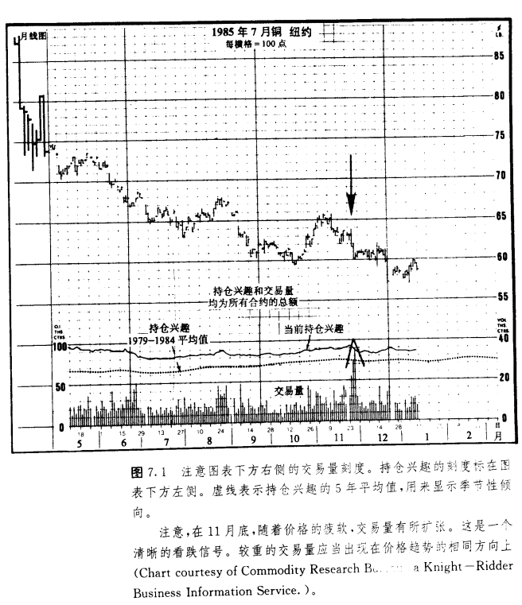

在周线图上，我们同样可以作出交易量。这里，我们在价格图下方对应于每一周的位置上。画出这一周的交易量之和。不过，在月线图上.通常不再采用交易量。还请朋友们注意，只有交易量和持仓兴趣的全额才被用于预测。

### 持仓兴趣

到某日收市时为止，所有未平仓了结的合约的总数就是当日的持仓兴趣，如图7.1所示。也请注意，持仓兴趣的刻度标在图表下部左侧，持仓兴趣也描画在对应日期的价格之下，但其位置高于交易量。请记着，在商品市场上，交易所顺延一天发布正式的交易量和持仓兴趣的报告.从而在图表上，也相应地出现一天延迟的情况(每天我们只能获得上一个交易日这两种信息的估计数字)。这就是说，图表师每天可以作出最近一个交易日的高、低和收市价的价格线段，但只能作出这一日的前一个交易日的正式交易量和持仓兴趣。

持仓兴趣代表市场上多头一边或空头一边的未平仓合约的总数，而不是两方的总和。持仓兴趣以合约张数为单位。只有两个市场参与者—买方和卖方—会同起来才能创生一张合约。在每日公布的持仓兴趣数字后，总跟着一个正数或者一个负数，分别表示这一天相应的合约张数的增加或者减少。正是持仓兴趣水平的变化(或者上升或者下降)，为图表师分析入市行为的变化特点提供了线索，从而使持仓兴趣具备了预测价值。

持仓兴趋的季节性变化我们对图7.1多作一点解释。前面我们介绍了价格线段、交易量线段以及持仓兴趣曲线。沿着图表底部还剩下一条虚线，它表示持仓兴趣5年的平均值的情况。我们用这条平均线来显示持仓兴趣的季节性倾向。如同价格变化一样，持仓兴趣具有非常明确的季节性倾向，我们应当把这种情况也考虑进来。

举例来说，仅当持仓兴趣的增加超过了其季节性的增长之后，这个变化才具重要意义。在图表上，我们通过两条曲线的比较来剔除季节性倾向，由此得出的持仓兴趣的净变化的效果更优越。正是持仓兴趣的实际变化(实线)同通常的季节性变化(虚线)之间的差异，给两条持仓兴趣曲线增添了意义。

持仓兴越的变化如何发生持仓兴趣数值的变化意味深长，为了掌握其中的奥妙，我们必须首先理解每笔交易如何对该数字发生影响。

每当交易所大厅内一笔交易完成后，持仓兴趣就有三种变化的可能性:增加、减少、或不变。下面我们看看这些变化是如何发生的。

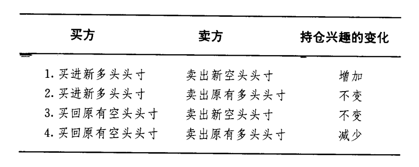

在第一种情况下，买方和卖方均开立了新头寸，产生了新的合约。在第二种情况下，买方建立新的多头头寸，但卖方只是平仓了结原有的多头头寸。一方入市交易，另一方退出市场，结果双方扯平，合约总数没有变化。在第三种情况下，情况也一样，只是此处卖方开立了新的空头头寸，而买方只是平仓了结原有空头头寸。也是一方入市，一方退出，合约总数不会有任何变化。在第四种情况下，交易双方都平仓了结原有头寸，从而持仓兴趣减少。

综合上述，如果买卖双方均建立了新的头寸，则持仓兴趣增加。如果双方均是平仓了结原有头寸，则持仓兴趣减少。如果一方开立新的交易，而另一方平仓了结原有交易，那么持仓兴趣维持不变。在每个交易日结束之后，图表师通过考察总的持仓兴趣的净变化，就能确定资金到底是流入市场，还是流出市场。根据这个信息，分析者能够就当前市场趋势的坚挺或疲软程度做出一些推测。

### 交易量和持仓兴趣的一般解释规则

市场技术分析者一般把交易量和持仓兴趣的信息综合应用于市场分析之中。因为交易量和持仓兴趣两者颇为相似，所以，我们把它们的解读规则合起来介绍。不过，两者之间毕竟有所不同。我们首先叙述一下两者共同的一般规则，然后分开讨论，最后再把它们综合起来(见下表)。

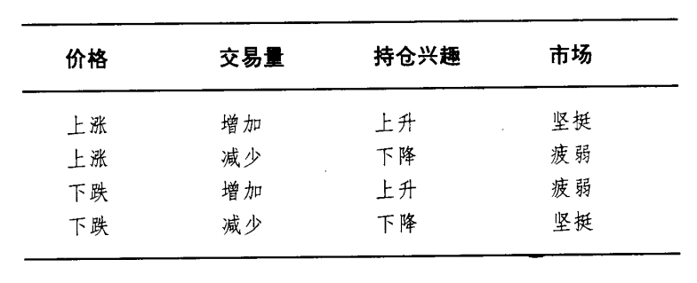

如果交易量和持仓兴趣均上升，那么，当前趋势很可能按照现有方向继续发展(无论是上涨还是下跌)。如果交易量和持仓兴趣都下降，那么，我们就把这种变化本身视为当前趋势或许即将终结的警讯(见图7.2)。下面我们来分别考察交易量和持仓兴趣。

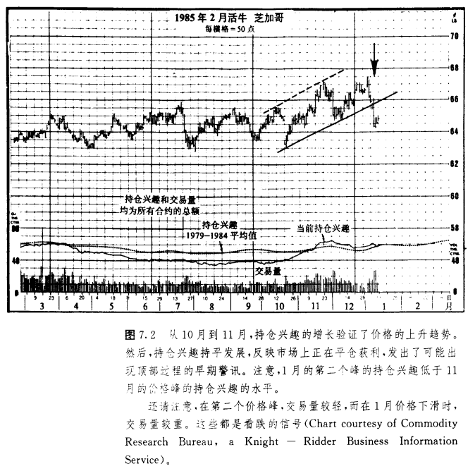

## 交易量的解释

交易量水平是对价格运动背后的市场的强度或迫切性的估价。交易量越高，则反应出的市场的强烈程度和压力就越甚。技术师通过观察配合价格变化的交易量的水平能够较好地估量市场运动背后买入或卖出的压力。我们也可以利用这项资料来验证价格运动，或者作为识别价格变化可靠与否的警讯(见图7.3和7.4)。

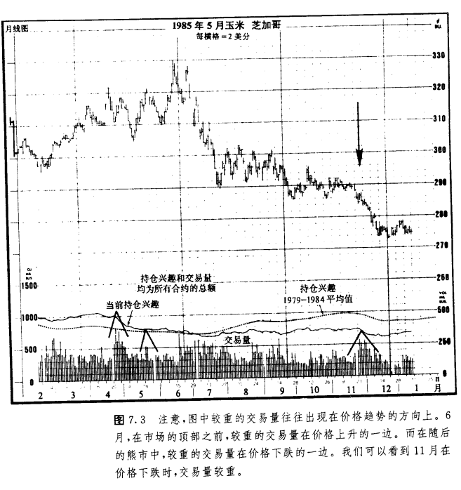

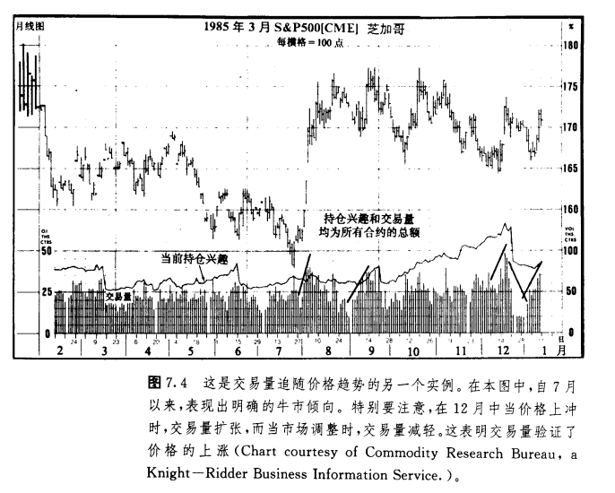

如果把这个规则表达得更简明些，那么，交易量应当在现有价格趋势的方向上，相应地增加或扩张。在上升趋势中，当价格上升时，交易量应较重，而在价格回跌时，交易量则应减少或收缩。只要上述情形仍在持续，那就说明交易量正在验证价格趋势。

同时，图表师也会密切注意相互背离现象的迹象(这里又碰上这个既念了)二如果在上升价格趋势中，前一个峰被向上穿越，而与之同时交易量反而有所下降，那么就发生了背离现象。这就警告图表师，市场的买入压力正在减轻。如果交易量在价格下跌时还变本加厉，倾向于有所增加的话，那么分析者就要注意上升趋势即将发生变故了。

### 交易量验证价格形态

在第五章和第六章我们讨价格形态时，曾数次提及交易量.把它看作重要的验证指标。头肩形顶成立的预兆之一就是，在头部形成过程中，当价格冲到新高点时交易量较轻，而在随后跌向颈线时交易量却较重。在双重顶和三重顶中，在价格上冲到每个后继的峰时，交易量都较轻，而在随后的回落中，交易量却较重。在持续形态形成过程中。如三角形.与夕伴随的交易量逐渐下降。一般地，所有价格形态在完结(突破点)时，只要这个突破信号是成立的，那么它就应当伴有较重的交易活动(见图7.5)。

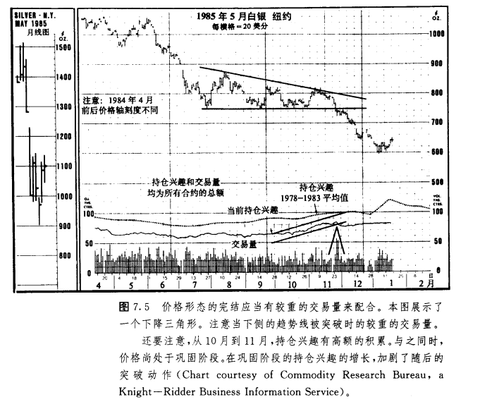

在下降趋势中，当价格下跌时交易量应较重，而在价格上弹时较轻。只要交易量的变化保持上述特点，那么就说明卖出压力大于买进压力，下降趋势也将持续下去。仅当这种情形发生了变化后，图表师才会着手探究市场的底部信号。

### 交易量领先于价格

在对价格和交易量的对照研究中，我们实际上是使用两种不同的工具来估价同一对象—市场力量。仅仅根据价格趋向于上升这一事实，我们就可以判断市场上的买进压力大于卖出压力。我们不妨推论，较重的交易量应当发生在与市场的流行趋势一致的方向上。如果说技术分析者认为交易量预测了价格，那么他其实是说，无论是在七升趋势中价格上涨压力的减少，还是在下降趋势中价格下跌压力的减小，都通过交易量资料预先反应出来了。而就价格本身来说，这一点要等到价格趋势实际反转时才能体现出来。

### 权衡交易量(OBV)法

技术分析者尝试过许多种交易量指标，以定量表示市场的买压或卖压(见图7.6a到7.8b)。要知道，即使我们竭尽能事，仔细察看图表底部的交易量线段，也并不总能准确地揭示交易量的重要变化。在这些交易量指标中，最简单的也最著名的是所谓权衡交易量，或称OBV法。这种方法系约瑟夫·格兰维尔创立的，并通过他的《格兰维尔氏股市获利新秘诀》(普伦蒂斯·霍尔版，1963年)而广为流行。OBV法实际上沿着价格图表的底部添了一条交易量的曲线。我们既可以用这条曲线来验证当前价格趋势的可靠性，也可以通过它与价格变化的相互背离现象，来获得趋势即将反转的警讯。

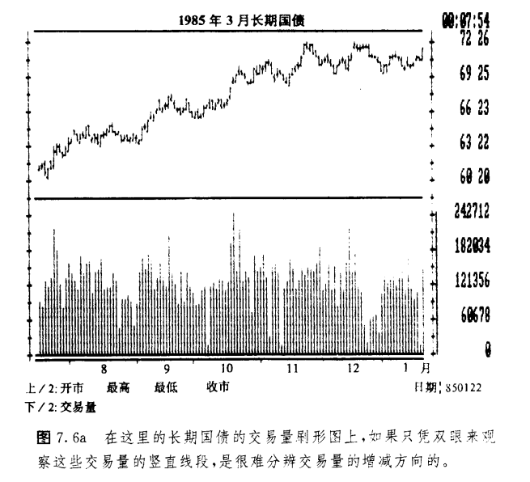

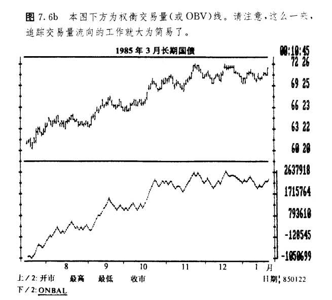

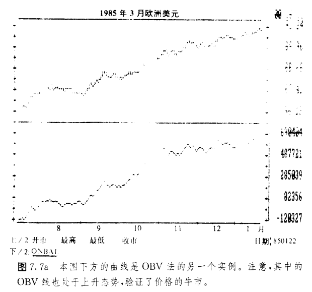

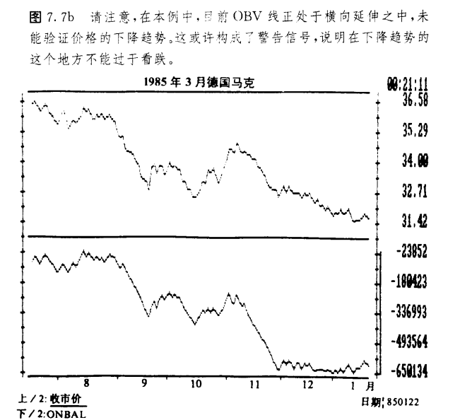

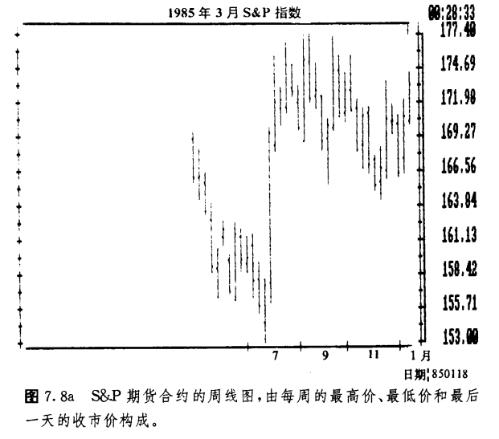

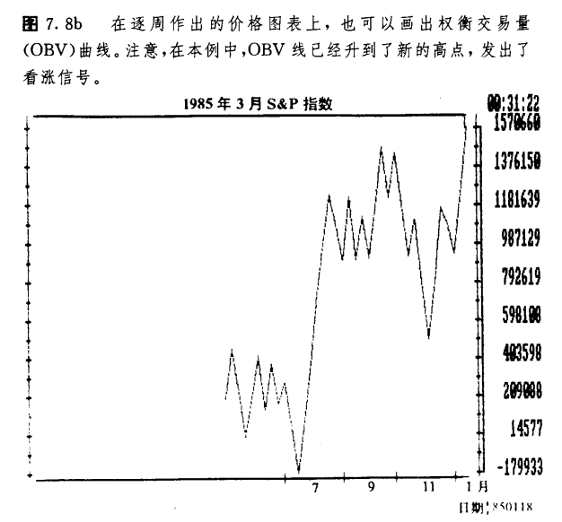

图7.6a展示了一张标准的日线图，其中既有价格线条，也有交易量线条。分析者或许可以通过仔细地审察交易量的刷形图，来判别交易量的重要变化。图7.6b与上图相同，但沿着图表底部，我们用OBV线替代了交易量的图线。请注意，在这里，OBV线大大简化了跟踪交易量趋势的工作。

OBV线的构造方法很简单。我们先把每一个交易日的收市价格与相邻的前一个交易日的收市价格相比较，得出其相对高低，然后，在当日的交易量数值前，对应地添加一个正号或负号。如果当日的收市价格有所上升，那么，当日交易量数值的符号为正，反之，若当日的收市价有所下降，则符号为负。下一步，再选定一个基准日，从基准日起到当日止，逐日地按照上述方法得出每日的交易量数值，然后把它们进行简单的算术累加，即根据每天的收市价格的增减方向，从前一日的累计总值中，相应地加上或减去当日的交易量，最后就得到当日的累计总值—OBV值。

在这种方法中，具备重要意义的是OBV线的方向(其趋势)，而不是该数字本身的实际水平。然而，为了防止OBV值滑人负数区域，我们一般不是从零开始，而是在基准日选择一个成整的大数字，作为起算值。当然，这只是为了使OBV线维持在正数区而易于描画。我们一般选择如10000这样的数字作起算值。实际上，OBV值到底是正还是负并无意义。

权衡交易量线应当与价格趋势方向一致。如果在价格图上反映出一系列依次上升的峰和谷(上升趋势)，那么OBV线也应当如此。而如果价格趋势向下，则OBV线的趋势也应当向下。恰恰是在权衡交易量线与价格趋势不协调一致的情况下，构成了相互背离现象，警告我们趋势有可能要反转。

针对OBV线，我们也可以如同对价格所进行的趋势分析那样，采用各种技术指标进行分析。在权衡交易量线上，峰(阻挡)和谷(支撑)也是显而易见的。同时，我们也可以把趋势线分析和移动平均线方法移植过来，用于辨别OBV值的趋势反转。另外，摆动指数分析也完全适用于权衡交易量线。在这里所附的图例中，有一些充分显示了OBV法的妙用。

### 交易量累积(VA)法:OBV法之外的另一个选择

利用权衡交易量，我们能够相当有效地达到上述目的，但它也有一些缺点。举例来说，仅仅根据当天的收市价格的大小，我们就把全天的交易量添上了正号或负号，这看起来并没有充分的依据。试想，如果市场的收市价格只比前一天高出某个小量，比如一二个点子，我们就在全天的交易活动量前标上正号合理吗?或者考虑这种情形，市场当天大部分时间处于前一收市价之上，只在收市时才稍稍低一些。我们是否应该把当天全部交易萤都标上负号呢?为了解决这些问题，技术师尝试了许多种OBV法的变通办法，以求发现真正的向上的交易量和向下的交易量。

变通办法之一是，给趋势较强的日子赋予较大的权重。比如，在价格上升的日子，就用价格的涨幅乘以交易量。本方法虽然依旧采用正负号，但我们把价格变化较大的日子给予了较大的权重，从而减少了价格实际变化较小的日子的影响。

另一种对格兰维尔的权衡交易量法的变通办法，是马克·蔡金设计的，称为交易量累积(VA法)。蔡金的交易量累积法利用日内价格变化来估价当日的交易量。一般认为.这种方法在股市中更有用，但是它也同样地适用于商品期货，特别是具有大量公众参予的期货市场。OBV法给全天的交易量都标上正号或负号，但交易量累积法只为当日交易量中的一定百分比例计人正负符号。根据收市价格同当日平均价格的相对高低，也就是说，如果市场收市于全日平均价格或全日价格区间的中点之上，则当日交易量的一定百分比例便标正号。如果价格收市于中点之下，则当日交易量值的一定百分比例就标为负号(见图7.9a到7.10b)。

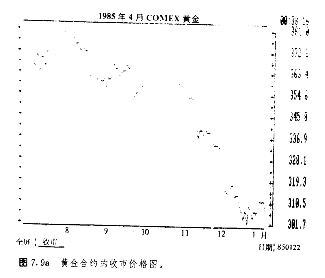

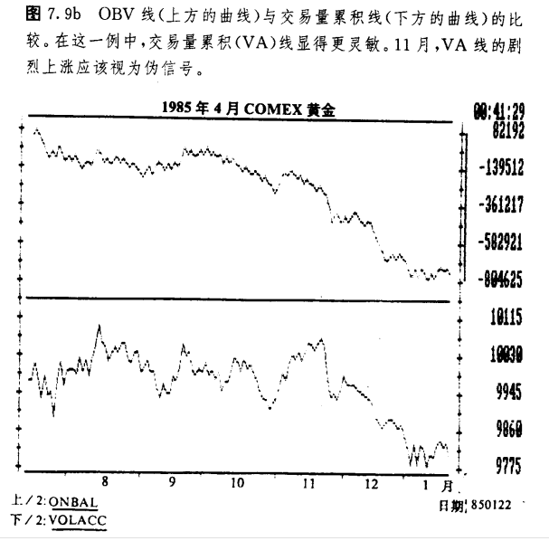

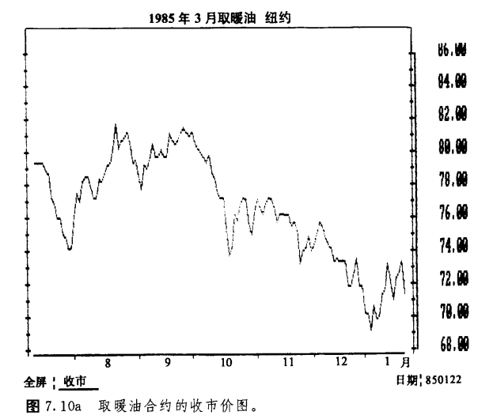

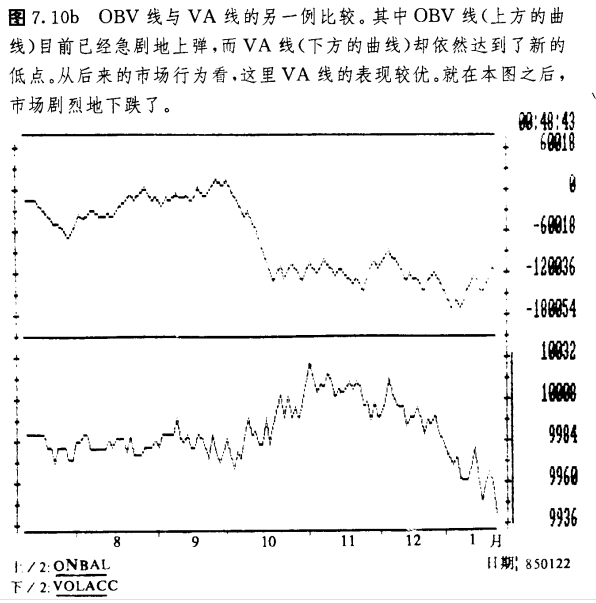

仅当收市价格与当日最高价相同时，我们才把全天的交易量都计为正值。如果情况正好相反，即收市价格恰好位于当日最低价，那么，我们把当日所有的交易量均计为负值。

我们假定基准日的起算值为10000，并通过以下公式来构造图线:

VA={[(C - L) - (H - C)] / (H-L)} × V

其中H为当日最高价，C为收市价，L，为最低价，V为交易量。

交易量累积线与价格变化的配合使用方法，与OBV线完全一致，它或者同价格变化相互验证，或者与之相互背离。为了跟踪VA线的趋势，我们也可以采用各种技术工具。当然也可以利用摆动指数来考察VA线，我们将在第十章讨论这个问题。

关于价格和交易量的参照使用方法，还有其它更复杂的公式。加利福尼亚的詹姆斯·西贝特创立的所谓需求指数就是其中的一例。上述三种交种交易量指标的计算机软件均已有售，为我们省却了构造和维持其图表的冗长乏味的繁杂负担.在新奥尔良的CompuTray集团的技术分析软件中，涵盖了上述三种方法。在今后各章中，我们还将采用更多CornpuTrac的图例。

话说回来，即便采用厂更为复杂的OBV法的变体，我们的目的始终一也是一致的—力图确定较重的交易量到底发生在价格向上的一边(看涨的)还是价格向下的一边(看跌的)。因为OBV法很是简明实用，所以，在我们跟踪市场的交易量变化时大有用武之地。根据不同的环境。我们可以把它用作价格运动的李生指标(验证指标)或者先行指标。OBV线更形象地展示厂交易量的变化，更易于观察和分析，所以它(及其某些变体)能够成为图表师非常有用的新式武器。

### 在期货市场中交易量分析不十分有用

我们认为，交易量分析在商品期货上不如在股市上有用。首先，在期货市场上交易量报告有个一天延迟的问题。再者.如果采用所有合约的交易量的总额，而不是具体合约的个别的交易量数额来研究这个具体合约，相对说来，有点不伦不类。正如前面所指出，我们是有充分理由选用交易量总额来研究市场的。但是，当在同一种商品的不同合约中，有些收市价格有所上升，而另外一些反而有所下降的时候，我们怎么办呢?另外，涨跌限价规定也造成了其它问题。在市场因为受到交易所涨停板的限制而被锁定的交易日中,交易量通常极轻。这是市场坚挺的情况，买方的需求量压倒性地超出了卖方的供给量，价格很快上升到当日的上限，于是交易活动实际上陷于停滞。根据通常的解释规则，在上冲时伴随着较轻的交易量就是看跌信号。而这种在限价日出现的较轻的交易量.显然就不符合__L述通行规则，它们有可能歪曲OBV的数值。

还有个间题。在股票市场上，关于平均股价指数，我们可以获得与其上涨或下跌分别相对应的交易量，对于个别股票，也可以获得分别对应)几价格上涨或下跌的成交股数。但在商品期货市场，我们却缺乏相应的资料，没有这些有用的信息。

无论如何，尽管交易蛾分析在期货市场中有上述局限，但它仍然大有用武之地。技术型交易商如果注意观察交易量的指标的话，那是很明智的。

## 对持仓兴趣的解释

持仓兴趣的解释规则同交易量大体类似，这里作一些进一步的说明。

1.在上升趋势中.如果当价格上涨时，持仓兴趣总额的增加超过其季节性平均值的增加((5年平均值)，就说明新的资金正在流入市场，反映出新的买方行动大胆积极，所以，这是一个看涨信号。

2.反过来，如果当价格上涨的时候，持仓兴趣的下降超过了其季节性的下降，那么就说明这种价格上冲主要来自空头者买进斩仓的行为(这就是说，正日益蒙受损失的空头头寸持有者们终于缴械投降，被迫平仓了结空头头寸)。这时候，资金从市场流出而不是流入。在这种情况下，一旦上述被迫平仓了结空头头寸的过程完成之后。上升趋势很可能就要失去上涨的推动力。因此这是一个看跌信号。

3.在下降趋势中，如果当价格下跌时，持仓兴趣总额的增加超过了其季节性平均值的增加，那么就说明新的资金正流入市场，反映出新的卖方行动大胆积极。这就表明下降趋势将持续下去的可能性有所增加，从而这是一个看跌信号。

4.反过来，如果价格下跌时，持仓兴趣总额的减少超过了其季节性的减少。那么这种价格下跌主要是由于日益蒙受损受的多头者最终不得不卖次斩仓的行为所引起的。在这种情况下，一旦持仓兴趣减少得足够低，上述大多数多头交易者已经完成了卖出平仓的过程，下降趋势很可能即将终结.因此这是表明市场逐渐坚挺的技术信号。

下面我们把上述四点归纳一下:

1.在_L升趋势中，持仓兴趣增加是看涨信号。

2.在上升趋势中，持仓兴趣减少是看跌信号。

3.在下降趋势中，持仓兴趣增加是看跌信号。

4.在下降趋势中。持仓兴趣减少是看涨信号、

### 持仓兴趣具备重要意义的其它情形

除了上述倾向性以外，还有其它一些市场环境，如果我们研究一下持仓兴趣也能有所助益。

1.当一场主要的市场运动接近尾声时，持仓兴趣已经随着价格趋势的整个过程增加到一定的高度了，那么，一旦持仓兴趣不再继续增加乃至开始减少，这经常就是趋势即将生变的先期警讯(见图7.11)。

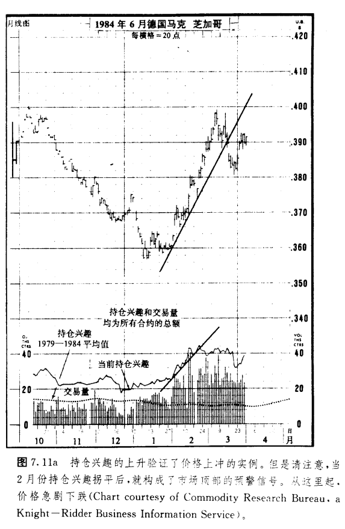

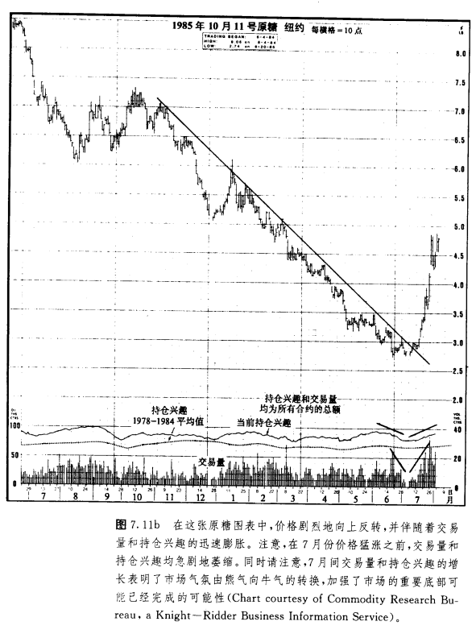

2.如果在市场顶部，持仓兴趣处在高水平，而价格下跌义突如其来，那么这是一个看跌信号。这种情况就意味着，在卜升趋势接近尾声时建立多头头寸的所有多头交易者均处于损失之中。因为他们被迫卖出斩仓，所以使价格遭到了压力。这种情况·直将维持到持仓兴趣减少到足够大幅度之后。下而举个例子。假设一个上升趋势已经进行过一段时间后，上一个月持仓兴趣曾经有显著的增加。请记住，在持仓兴趣中，每增加一张合约，就意味着市场同时出现了一张多头合约，一张空头合约。突然，价格开始剧烈地下跌，跌到上个月所经历的最低价格之下。那么，在上个月建立的每一张新的多头合约均处于亏损状态。

于是，这些多头合约的持有者就被追卖出斩仓，从而使价格遭到很大的压力，这种情况一直持续到他们的亏损头寸全部被平仓了结为止。更糟糕的是，他们这种被迫卖出斩仓的行为，自我反馈、恶性循环。价格被压迫得越低，则有更多的处于边际的多头合约持有者加入被迫卖出平仓的行列，于是反回来进一步加剧新的价格下跌。这种现象有一个最为触目惊心的实例，发生在1980年年底，商品市场在登峰造极之后，经历了为时5年的下滑历程。好几个市场一路进入了创历史纪录的高额持仓兴趣的状态中，而这个窘境又在接踵而来的价格崩溃中助封为虐。我们把这里所阐述的第2点推论如下:在牛市中.不同寻常的高额持仓兴趣是个危险信号(见图7.12)。

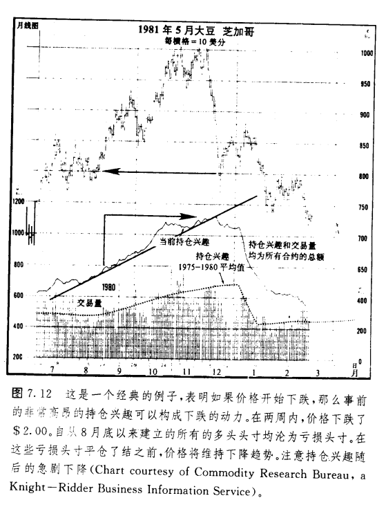

3.如果在市场横向延伸的调整期间。或者处于水平交易区间之中时，持仓兴趣逐渐积累增加，那么一旦发生向上或向下的价格突破，随后而来的价格运动将会抓剧。这完全是顺理成章的事情。当市场处于犹豫不决的状态时，没人能够确切地知道新趋势即将向哪个方向突破。但是，持仓兴趣的增加表明，许多交易商已预期突破的降临，并相应地建立了头寸。一旦突破果然发生，那么许多交易商(其中的一半)将陷于市场对自己不利的一边(请回头考察图7.5，图中白银市场的向下突破展示了这种现象)。

我们假设市场上出了一个为期三个月的横向交易区间，与此同时，持仓兴趣快步上升了10000张合约。这个数字意味着，在这个时期内，市场上新增开了10000个多头头寸和、l0000个空头头寸。现在价格向上突破，开创了三个月来的新的最高价。因为此时价格处在三个月来的最高点，原先在这段时间里开立的每一个空头头寸(所有的l0000个)均处于亏损状态中了。于是，那些蒙受损失的空头持有者，争相买进平仓，市场上一片混乱。如此一来，自然进一步加强了价格上涨的推动力，反过来，甚至造成了更大的恐慌。一直到所有的10000个空头头寸或其中绝大部分均已买进平仓之后，这股力量才会平息，而在此期间，价格将保持坚挺。如果当初的突破方向向下，那么就该多头持有者手忙脚乱地争相卖出平仓了，而空头持有者就会开开心心地坐收渔利了。

每当突破发生、新趋势初露端倪的时候，市场通常都处在巨大的恐慌之中，而这种局面正是那些陷足于市场的错误一边的交易商急于平仓了结其损失头寸的慌乱行为所造成的。陷足于错误一边的交易商越多(这一点通过高额的持仓兴趣可以体现出来)，那么他们对突如其来的不利的市场运动的反应就越激烈。说起来，也真是几家欢乐几家愁。那些选择了市场正确一边的交易商(心机明敏的人或走运的人)为新趋势推波助澜，因为事实证明他们的判断是正确的，他们现在可以利用其累积的帐面盈利为资本增开新的头寸了(这里有一点，值得我们冷静地思索一下。只要持仓兴趣每增加一张合约。则必定有人犯了一个错误)。由上述讨论可见，在一个交易区间中(实际上对于任何市场状况都是同样的道理)，持仓兴趣增加得越多，那么在突破发生后。价格运动的潜力就越大。

4.在价格形态完成时，持仓兴趣的增加可视为新趋势信号可靠程度的旁证。举例来说，在头肩底形态中，当颈线被向上突破时，如果在交易量增长的同时，持仓兴趣也相应增加，那么该底部形态就更为可靠。不过。在这里分析者必须留神。因为当新趋势产生的初始信号出现之后，随之而来的跟风性市场动力往往来自失陷于市场错误一边的交易商的斩仓行为，所以，在有的情况下，当新趋势初生时，持仓兴趣可能稍有减少。在这种情况下，持仓兴趣这种初始性的稍减，有可能使那些不谨慎的朋友误入歧途。因此，从这种现象可以看出，我们不应该对持仓兴趣在极短时期内的变化过分拘泥。

## 交易量和持仓兴趣规则举要

以下我们归纳一下关于价格、交易量以及持仓兴趣的几个较为重要的方面。

1.只能以交易量和持仓兴趣的总额作为预测依据。

2.对持仓兴趣必须做季度性修正。

3.如果交易量和持仓兴趣增长，就意味着当前价格趋势可能持续发展。

4.如果交易量和持仓兴趣萎缩，就表明当前价格趋势或许要生变。

5.交易量超前于价格。从交易量的变化可以判断买方或卖方力量的消长，因而它领先于实际价格的变化。

6.OBV法或者其它类似的方法，可以更为明了地揭示交易量压力的方向。

7.在上升趋势中，如果持仓兴趣突然停止增长，甚至开始下降，那么经常是趋势生变的警讯。

8.如果在市场顶部，持仓兴趣不同寻常地高昂，那就非常危险，因为这种情况大大增加了市场向下的压力。

9.在调整期间，如果持仓兴趣积累地增长，那么就强化了市场随后的突破。

10.交易量和持仓兴趣的增长有助于验证价格形态的确定，也有助于验证其它各种预示新趋势即将发生的重要图表信号。

## 胀爆和抛售高潮

关干交易量和持仓兴趣，还剩下最后一种典型情况。值得说一说。这是两种经常发生在市场顶部或底部的剧烈变化—所谓胀爆和抛售高潮。胀爆出现在市场顶部，抛售高潮则在市场的底部。在市场顶部发生胀爆的具体情况是，价格经过长期上涨后，突然急剧上冲，与之同时，交易量也大为增加，持仓兴趣却显著地下降。在抛售高潮中，价格则在长期下跌的基础上，突然急剧地坠落，与之同时，交易量大大加重，而持仓兴趣则大幅下降(见图7.13)

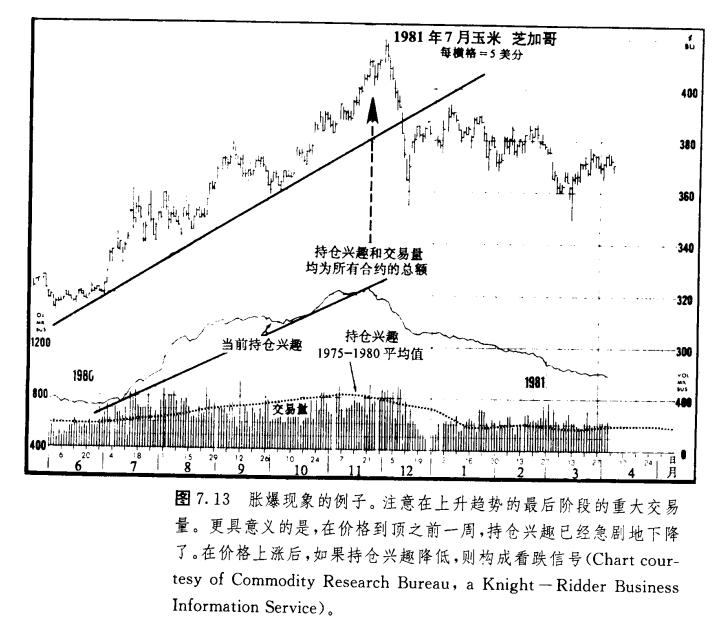

在两种情况下，我们都必须密切注意两点，一是交易量的陡然膨涨，一是持仓兴趣的急剧萎缩。在价格向上或向下过分伸展的情况下，如果两个因素一齐出现，就表明当时在市场_上正发生着大规模的平仓活动，从而警告我们风雨即将来临，趋势很可能就要突然变化了。

## 交易商分类报告

为了完成关于持仓兴趣的讨论，我们还得介绍一下交易商分类报告，以及如何利用它作为我们的技术分析工具.该报告由商品期货委员会(CFTC)在每月的第11个工作日公布，其中的数据是截止到上月底的持仓兴趣的统计资料。在这份月报里，把持仓兴趣的数字划分成二类来源——大户保值商、大户投机商和散户。只要期货商的交易规模达到了各个市场的规定水平，就必须向CFIC报告。CFIC把这些来自大户交易商的报告编排归总之后，就形成了交易商分类报告中关于大户保值商和大户投机商的统计数字。然后，CFIC再从总的持仓兴趣中减去上述两项，余额便算作散户的持仓量。

上述分类的几种数字当然自有用场。我们的理论依据是，一般认为，大户属于“投注能手”。而我们通常所说的小户，信息较不灵通，而且从交易技术上说也较不机敏。同时，如果小户成熟起来后，也就不再成其为小户，而是跨入到大户的行列了。另一方面，如果大户败落了，也就不再成其为大户，而是很快地退居小户的地位。

这种类型的分析在股市技术师中间早就盛行。他们认为，股票买卖专家对市场方向的判断通常是正确的，因此他们密切关注这些专家的一举一动。相反地，他们认为散户(即大众投资者)对市场方向的判别，在绝大部分时候是错误的，所以常常轻蔑地称散户为“小鬼头”。

从一些期货市场的研究结果来看，在上述二类交易商中，大户保值商在预期市场转折点这一方面最为成功，其次数大户投机商，小户屈陪末座(见图7.14)。

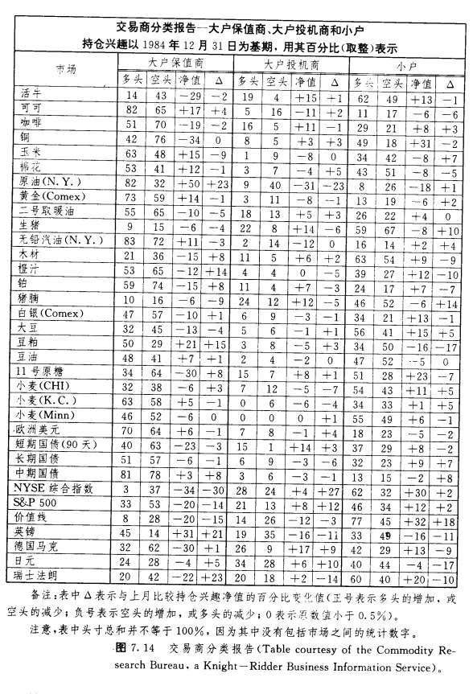

我们如何恰当地利用这些统计数字呢?说白了，就是要加盟“投注能手”的一边，而避免陷入其余不太如意的行列。图7.14是一份交易商分类报告的实例，引自CRB期货图表服务，其中每类都分成四个小栏目——多头百分比、空头百分比、持仓兴趣净值、△。△表示同上一个月相比较的持仓兴趣净值的增减额.例如在本表中，1984年12月31日在活牛市场上，大户保值商中有14%为多头，43%为空头。第三栏的“—29”的意思是净空头比数为29%(43%—14%)。在第四栏中，“—2表示活牛市场的大户保值商当月的净空头数比上月净空头数增加了2%。

在表格底部的备注中，解释了表中数据的理解方法。请注意，其中有条说明，表中相应的百分数之和并不总为100%。这是因为本表并未包括市场之间交叉套利交易的统计资料。如果我们把活牛这一行的所有三类多头百分比的数字加起来——14%属于大户保值商，19%属于大户投机商，62%属于小户-一我们只得到95%的总数。市场之间交叉套利的交易就占据了剩下的5%。

## 季节性修正

在进一步研究图7.14中的数据之前，我们必须首先考虑它们的一个重要特征:季节性变化。表中每个群体都表现出特定的季节性倾向。只有超出这种季节特征的变化才揭示了交易商对市场的态度.在1985

年的《商品年鉴》中，发表了一篇文章(威廉"L·吉勒，商品研究局，1985年)，其中对这家机构利用这些统计数字的方式作了介绍，也讨论了他自己在该领域的一些独到的研究成果。

当前净持仓兴翅同季节性的净持仓兴趣的正常值之差，在某种程度上.为市场的牛气或熊气的程度提供了直观的百分比度量(分析GFTC的交易商分类报告有助于预浏期货价格，吉勒，第52T页)。

随后，文章交代了一些普遍的要领:

最牛气的市场格局是:大户保值商的净持仓兴趣为多头，且其数量大大地超出了季节性正常值;大户投机商明显地持有净多头头寸;而小户的净头寸为空头，且其数量也大大地超过季节性正常值。这种情况代表了一个极端。另一个极端则是市场最熊气的格局，情况与上面正好相反——大户保值商净持仓兴趣为空头，且数额庞大，等等。朋友们务请注意净持仓兴趣偏禹长期平均值达40%以上的情形，同时也要忽略偏离程度小于5%的情形。

CRB商品研究局)的这项研究表明，两种大户的成绩记录均属上乘，但大户保值商的成绩优于大户投机商。在三者之中，小户的表现最差。

图7.15是几张样图，显示了CRB研究出的上述三类交易商的季节性倾向(引自前述同一文章)。这里的诀窍是，我们应当比较表中的实际数值同图中的所谓季节性正常值之间的差异。下面我们还是以图7.14那份报告为例，从中得出一些结论。

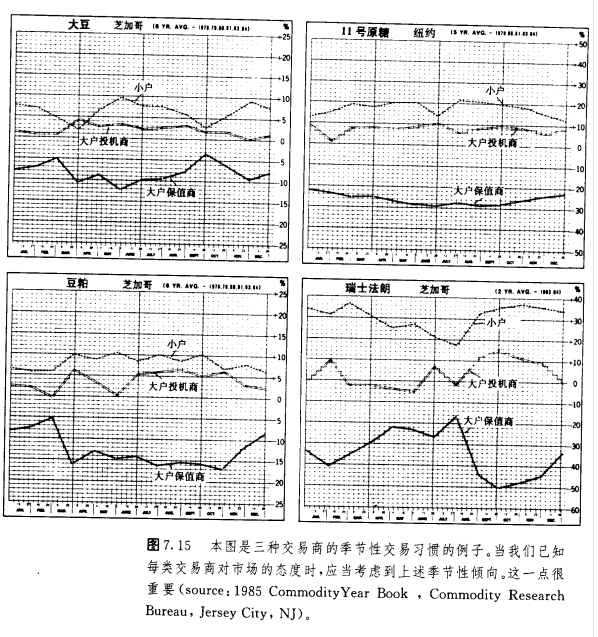

请看有关豆粕的统计数字。在1985年1月18日的《CRB期货图表服务》的技术性评论部分，本作者曾指出，“交易商分类报告揭示了该市场一个异乎寻常的看好的态势”。为什么这么说呢?报告中说，大户保值商为净多头，其百分比为21%，比上一个月增加了15%。小户则为净空头，百分比为16%，比前一个月增加了17%。因此，大户保值商是看好者，并且日益牛气;小户是看淡者，并且日益熊气。

现在再来看豆粕的CRB季节性图表。到12月底，大户保值商的正常情况是8%的净空头，而小户则大约为6%的净多头。这就意味着，有关的差额甚至比当前的实际数值更加倾向于看涨这一边。大户以29%的比例比正常情况更为牛气(从—8%到十21%)，同时小户以29%的比例比正常情况更为熊气(从十6%到—16%)。表面看来，大户为看好者，小户为看淡者，这已经是牛气性质的了。而实际上经过季节性修正后，从有关数据来看，形势还更加牛气。

要是我们随意看看其余一典数字，还有儿点也便呼之欲出了。我们来扫一眼三个类别的最后一列.找一找其中的较大变化。请注意在大户保值者名下那些较大的正数变化:原油为+23%,橙汁为+14%,英镑为+21%,瑞士法朗为+23%。也许我们应该留意这些市场上的看涨态势的出现，在小户名下的△列中，生猪和猪腩各为+10%和+14%，呈现日渐增强的正面态度。或许这种情况对这些市场来说，倒是看跌的信号。小户对橙汁以及外币表现出较强的负面态度(一10%),也可能形成了这些市场看好的信号。

我们还有一个运用这些数字的方法，即在小户名下的多头一栏或空头一栏中，搜求不同寻常的大幅变化(70%以上为“大幅”)。因为小户这一群体通常被认为是错误的，那么他们在某市场对哪个方向的强烈倾向就是个警告信号，表明市场将向相反的方向变化(这正是前面那个“‘理论基础’，之所以成立的原因了)。

在这份报告中，在小户名下的多头一栏中，有大幅变化(潜在的看跌信号)的是活牛(62%)和木材(63%)。也可以在NYSE综合指数(62%)和价值线股价指数(77%)中看到这种情况。不过从股价指数近来的动作来看，小户的判断似乎得到了验证。所以，我们必须说明，本领域的绝大部分研究是针对传统的农产品市场进行的。朋友们务请注意，不要在历史较短的金融期货市场上，过分倚重交易商分类报告，我们不妨拭目等待对这个方面的更多的研究。

我们也可以对交易商分类报告进行逐月的分析，以从各项持仓兴趣资料中揭示三类交易者的所作所为。不过，本方法有一个重要缺陷。可供分析的有关统汁资料至少都是两周以前的情况，可能因为这一延迟而丧失部分价值。

在期货市场上，上面介绍的这种技术分析手段并没有受到足够重视。它在股票市场仁倒是大行其道，但在期货分析者中却“曲高和寡”。无论如何，这正是一个颇具潜力的领域。由于我们能够利用它来检测市场情绪，因此，我们必须对它引起重视，并进一步加以研究利用(在第十章讨论相反意见理论的时候，我们将进一步探讨市场情绪)。在任何情况下，交易商分类报告都是重要的技术分析领域，分析者至少必须对之有所了解，并且时常关心关心。有一本书，《商品市场价格行为的图表分析》〔第二版，1.·迪伊·贝尔维尔，道·琼斯一欧文出版公司，1985年〕，花了很大的力气来讨论“持仓兴趣”这个题目。

## 结论

现在，我们就完成了对交易量和持仓兴趣的研究。从本书开头到这里为止，我们已经讲完了商品期货市场的技术分析理沦的一个重要的组成部分。我们交代了技术分析的理论基础，讨论了技术分析的基本砖石，介绍了图表的构造方法，研究了价格形态，也阐明了技术分析者的三条信息渠道—价格、交易量和持仓兴趣。

但是，我们的研究还仅仅局限于日线图。下一步，我们就该拓展时间视野，把前面这些富有价值的分析手段应用到长期性质的周线图和月线图中，来进行长期趋势分析。与此同时，也要补充一些关于较广泛的商品价格指数和各种市场群类指数的研究。这些便是下一章的任务。