# 第一部分

## 第一集

江恩理论（甘氏理论）

Willian Delbert Gann

### 著作

1.股票行情真理

2.江恩选股方略

3.江恩测市法则

4.面对真实的美国（经济大萧条时代的著作）

5.如何在商品交易中获利

6.华尔街45年（最为耳熟）

7.如何在选择权买卖中获利

8.时光隧道（海悦本人的最爱^^）

9.神奇的字句

### 江恩名言

一、进行交易必须根据一套既定的交易规则去操作，而不能随意的买卖，盲目的猜测市场的发展情况，随著时间的转变，市场的条件也会跟随转变，投资者必须学会跟随市场的转变而转变，而不能认死道理。

二、在你投资之前请先细心研究市场，因为你可能会做出与市场完全相反的错误的买卖决定，同时你必须学会如何处理这些错误，一个成功的投资者并不是不犯错误，因为在证券市场中面对千变万化、捉摸不定的市场，任何一个人都可能犯错、甚至是最重的错误，但成败的关键是成功者懂得如何去处理错误，不使其持续扩大、而失败者因犹豫不决，优柔寡断让错误发展，并造成更大的损失。

三、会亏损主要原因有三

1.在有限资本上过度买卖

2.投资者未设定S.L.O以控制亏损

3.缺乏市场知识

四、会让我赚钱是因为我的十二规则、二一守则

### 著作引导

江恩：股票市场和期货市场的价格起伏中呈现周期性循环，根据这种现象我得出结论、自然法则是，市场运动的基础。

引导：自然法则主要是根据周期现象总结出来的，因此把握了自然法则也就把握了股市周期。

江恩：我发现波动法则使我能够精准的确定某些位置，在这些位置股市和期货市场价格将会在一定时间内上升和下降。

引导：行情必须由时间和空间两个因素决定，但波动法则则可能把握一定时间。

江恩：波动法则是无线电波、无线电话和照相技术所依据的基本法则。

引导：波动法则具有上述三点的某种共同性质。

江恩：我所用的法则不仅定义这些长期循环，而且也定义了每一个交易曰甚至股价以小时为单位的波动。

引导：波动法则是自然规则，不受时间空间影响。

江恩：所有市场行为的奥秘是很明显的，用我的方法，可以确定每个股票价格的波动。

引导：江恩可以确定价格的波动，但价格怎麽变动并不能完全确定。

江恩：确定市场趋势的能力来至于我对每倜股票特性的了解、以及对某类股票恰当的波动率掌握。

引导：江恩暗示我们市场的波动率不是唯一一种，掌握大势须找到恰当的波动率、也就是波动率是会变化的。

江恩：如果希望在投机市场中改变失败的状况，我们必须探究原因，每一种存在都是以准确的比例和完美的关系为基础的，在自然中没有选择，因为做为最高准则的数学原理为世间万物奠定了基石。法拉第说，除了数学的力量以外、宇宙间在无其力量。

引导：江恩认为朝数学的方向去努力是了解自然规则的路径。

### 遗世问号

一、成交量的分析

江恩在著作中对于成交量的定义与分析方法并无白话解析，后代学者仍对于江恩成交量的定义有多诸不同见解。

二、为何钟爱3、7、8这三数

江恩认为7此数融合了自然、天文、宗教的理念，但没解释为何。

江恩认为价格与时间是具有对应关系的，江恩线的以3、8为单位进行划分。

### 波动率

共振共鸣现象

一、一次世界大战中，德国士兵整齐的步伐通过一座桥，因为节奏一致、结果在齐力的作用下桥墩倒塌。

二、当钢琴的低音与高音出现倍数的关系时，也会产生鸣声。

三、每年8月18日，钱塘江大潮就是因为太阳、月亮、地球处于一直线时才能发生大潮。

江恩著作中解释波动率出现过的线索：循环、和谐、韵律、比例。

同时具备循环、和谐、韵律、比例须从何著手？

### 江恩的实验

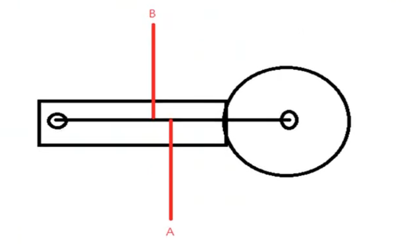

A 总弦长度的1/2位置可弹出高八度音、与材质和总长度无关

B 总弦长度的4比3位置可弹出四度音、与材质和总长度无关

八度音：Do Re Mi Fa So La Si Do 

高音Do的音频是Do的2倍。

高音Re的音頻是Re的2倍。

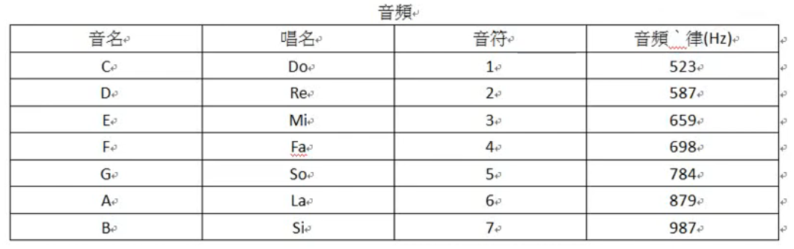

比例：

1.D大约是C的1又1/8倍

2.E大约是C的1又1/4倍

3.F大约是C的1又1/3倍

4.G大约是C的1又1/2倍

5.A大约是C的1又2/3倍

6.B大约是C的1又7/8倍

7.高八度C是C的2倍

江恩发现：当音阶达1/2倍与2倍的倍数皆会产生共鸣现象。

近期欧元走势图：

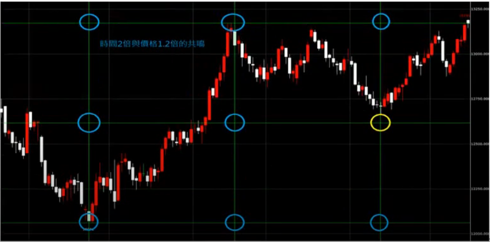

共鸣：

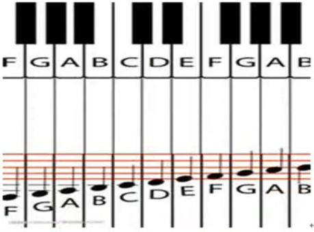

1.一组八度音被分成12个半音

2.十二平均律（明朝朱戴佾）

3.十二平均律构成的音阶以5个全音+2个半音

4.1个全音=2个半音，这12个半音之间的音频比完全相同的。

5.一组八度音为2倍，一组八度音食12个半音，每个半音之间音频比完全相同

6.音频比的12次方 = 2倍，音频比 = 2 的开根号12次=**1.059463094**

音频：262  277  293  311  329  349  370  392  415  440  466  493  523

既然每一个音阶之间的音频比是完全相同的，试算如下：

现象：

1.若277与262的音频比为277/262

293与277的音频比为293/277

若每一个音阶之间的音频比是相同则：277/262应该等于 293/277

277/292=1.057251

293/277=1.057761.

2.若370与349的音频比为370/349

349与329的音频比为349/329

若每一个音阶之间的音频比是相同则：370/349应该等于 349/329

370/349=1.060171

349/329=1.060790

3.以知目前手中若有资料音频顺序如下：370  392   XXX

若求XXX的音频为何？

以知 392与370的音频比会与XXX与392的音频比相同

则392/370 = XXX/392

XXX= 392*392/370=415.3081081

下一个音频果然是415

短结：艾略特的波浪理论中提到，菲波纳吉数列公式中的根号定律既然会与音频比相同

1 2 3 5 8 13 21 34 55 89 144 XXX

55/34 = 34/21

XXX = 144*144/89= 232.9887（实际上下一个数列为233）

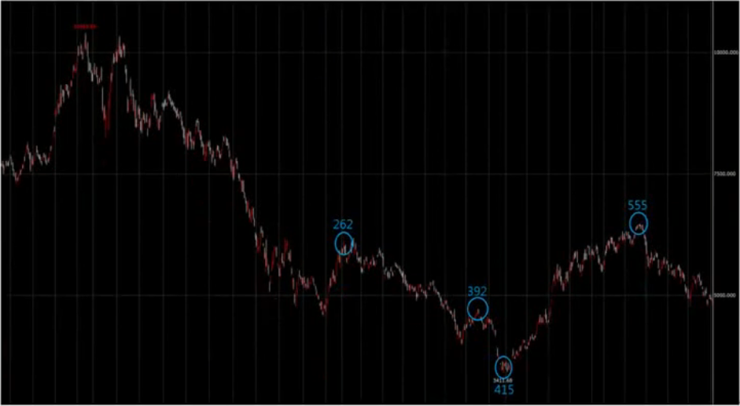

音频：**262**  277  293  311  329  349  370  **392**  **415**  440  466  493  523  **555**

2000年02月18日大盘的历史第二高点10393开始起崩走两年空头

该日起算后的第262 日（2001年02月08日）大盘出现第一次反弹高点6104

该日起算后的第392 日（2001年08月16日）大盘出现第二次反弹高点4715

该日起算后的第415 日（2001年09月21日）大盘出现最低点3411

该日起算后的第555 日（2002年04月23日）大盘出现反弹的最高点6484

发生共鸣的音频日期圈起来，发现是呈时间1倍与价格1倍的共鸣

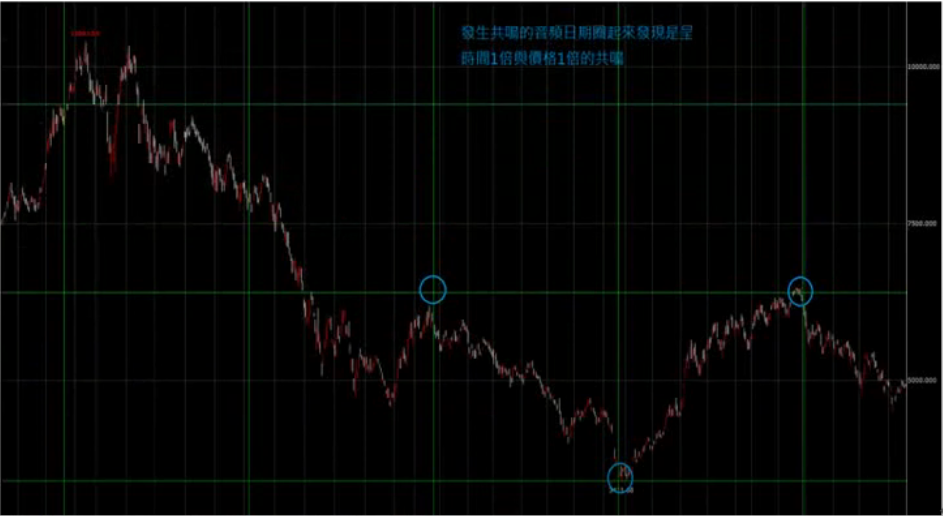

起算后第262日~起算后第415 日的时间间隔

约等于

起算后第415日~起算后第555日的时间间隔

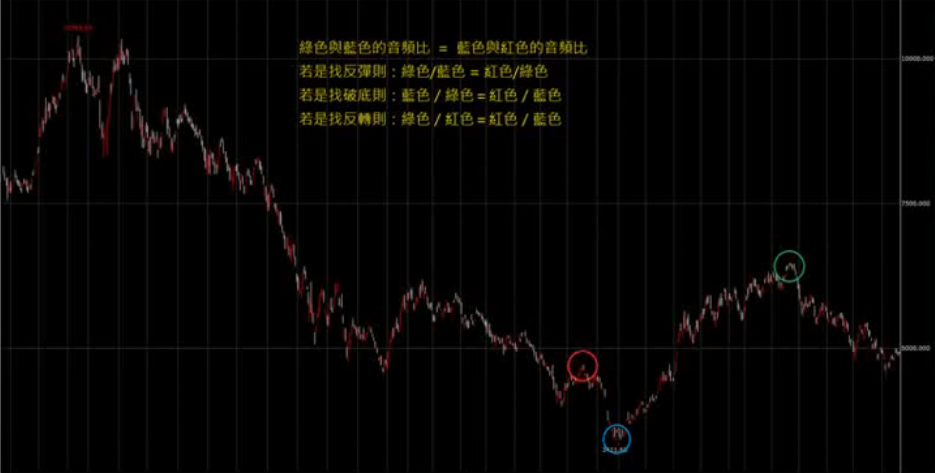

绿色与蓝色的音频比 = 蓝色与红色的音频比

若是找反弹则：绿色/蓝色=红色/绿色

若是找破底则：蓝色/绿色=红色/蓝色

若是找反转则：绿色/红色=红色/蓝色

起算后的第392 日（2001年08月 16日）大盘出现第二次反弹高点4715

起算后的第415 日（2001年09月21日）大盘出现最低点3411

起算后的第555 日（2002年04月 23日）大盘出现反弹的最高点 6484

若是找反弹 =4715\*3411之后开根号=4010

若是找破底=3411*3411/4715= 2467

若是找反转 =4715*4715/3411 =6517

而绿色点位后来是反转的点位，最高点打到 6484距离波动率计算出来的结果只差33点。

### 再谈波动率

一、市场的变化的确存在彼此价格关系的波动比例。

二、市场变化波动率跟著变化，那要如何得知目前应该使用何种波动率计算。

三、江恩在解释波动率上反覆的强调：寻找到正确的起点才能计算延伸波动，就是主宰因数。

四、江恩告诉我们当时间与空间发生共鸣，则转势的机率就会大增

意思是说：当时间产生共鸣，相对空间（价格）也会产生共鸣。

意思又是：若时间彼此共鸣则会有波动率可以计算出下一个空间（价格）。

五、找寻时间的共鸣是预测价格的基础，找寻价格的共鸣是预测时间的基础。

### 预测的可能性

人真的能未卜先知吗？

中国五术

山：茅山  练气  风水  地理

医：医术  中医  针灸

命：命理  紫薇  八字

相：面相  手相  骨相  足相

ト：ト卦  测字  岛挂  米卦  梅花易数。

紫微斗数的起源：

大多数学者认为是末朝的陈希夷所发明，但也有学者比对紫微斗数与印度占星术中十二宫是相同的只是位置不同。

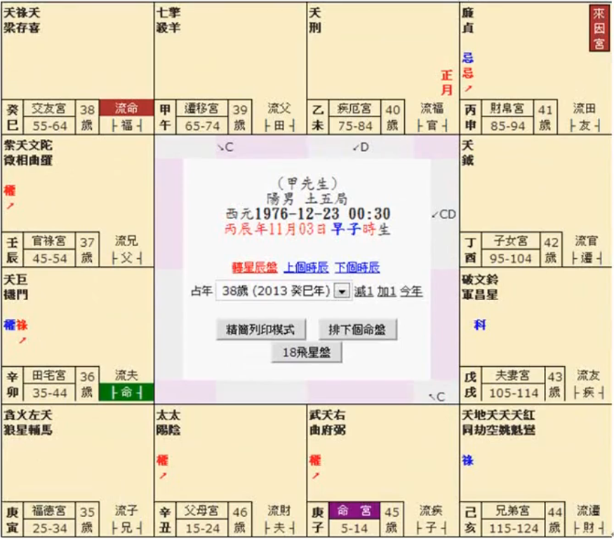

### 问题研讨

一、命理若是不准确亡为何流传千年仍被多人所依赖

若解释为：一定有其准确度但不是百分百准确是合理的。

二、为何命理学可以具备一定的准确度？

若解释为：是万物间自然的现象，一种极高深的统计学。

三、紫微斗数若是陈希夷发明或发现的，光是斗数中会认列的主星14颗、副星18颗、乙级27颗、丁级6颗、戊级16颗，更包含了12宫，若星与星搭配有差异也会影响到命理结果，若星落的宫位不同也会影响到命理的结果，若要细分总共存在几种不同结果的，命盘高达6956兆以上，在宋那个没有电脑的时代中，要如何靠人力可以统计出这天文数字般的命理数量结果？

若解释为：他是神~.~。

四、就算可以统计出来，那要找多少人去了解他们的人生才可以统计出，若是哪个出生的时间，会是哪种结果的人生，进而还要统计设计出排列表格的方式，并且要经得起印证的结果，一个人只有几十年的生命如何办的到？。

若解释为：所以我说他是神~.~.

五、若这世上真的存有输入数据资料（例如一个人的生辰），经过高机率的统计学原理，可以带出预测的人生结果、而这样的结果经过几千年来又经得起后代人的考验，那代表一件事情。

输入发生过的历史纪录行情，可以带出预测的未来市场价格，相较于紫微斗数而言是轻而易举的事情‘江恩大师的领悟境界是可能达的到的，未来是可以推算出来的，存乎有无找到紫微斗数那样高深统计学的钥匙。

别急着否定那些迷信的人们

研究的精神在于探讨是与否

去了解为何人们会信命理

去了解为何人们不信命理

重点不在于命理到底对或错

重要的是在于你去了解的过程

如果真是天下皆醉唯我独醒

所有人都是笨蛋

那麽为何

郭台铭也要信风水？

正因为研究困难。

所以百年来只有一位江恩

无法有第二位

### 海悦的研究

推理：若江恩所言为真，宇宙间存在著自然的定律与循环，为有数学科学的力量为基石、再无其他。那麽我们进而思考、市场价格的规律变化只有波动率，而无其他吗？

相对论公式：E=MC2

E=能量

M=质量。C=光速。

若我转换思考成

E=能量=成交量能=市场市值=某种数据

M=质量=价格变化=价格与价格之间的比值=某整数据

C=光速=波动率=黄金比例=某种规律性

我在将市场的各项数据资料带入相对论公式，则会产生何种结果？

## 第二集

### 自然数的巧合

江恩为何笃定认为音频比为自然界中的最基本波动率

黄金分割率1.618、0.618

菲波纳吉数列中的波动率

1  2  3  5  8  13  21  34  55  89 144  233....

后者数/前者数=后者数/前者数=约等于1.618

前者数/后者数=前者数/后者数=约等于0.618

或许你已经承认1.618与0.618此二数为自然规则中产生的数值

那么请你继续理解下去。

江恩认为A、B、C三数之中，当C=2A或A=1/2C时，A与C会产生共鸣，且A与B之间的波动率=B与C之间的波动率。

请问B为多少数？这三数之间的波动率为何？

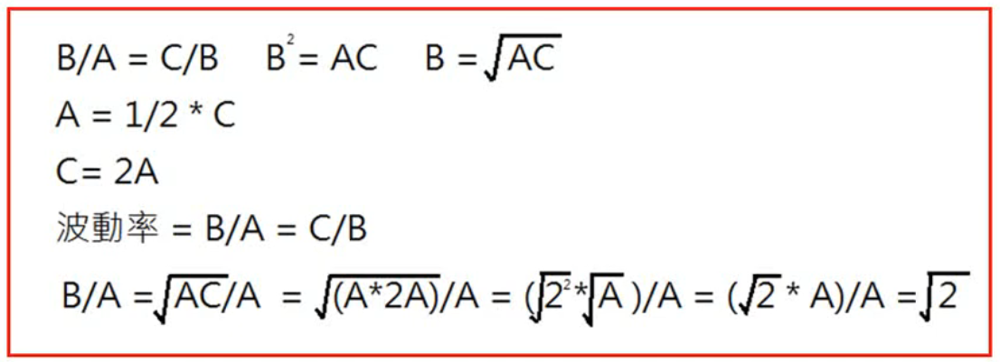

江恩认为在最原始的1/2倍与2倍的共鸣数之间，他们存在的波动率为根号2=1.414

波动的特性：循环、和谐、韵律、比例

1.618与1之间的波动率为0.618（1/1.618=0.618）

0.618与1之间的波动率为1.618（1/0.618=1.618）

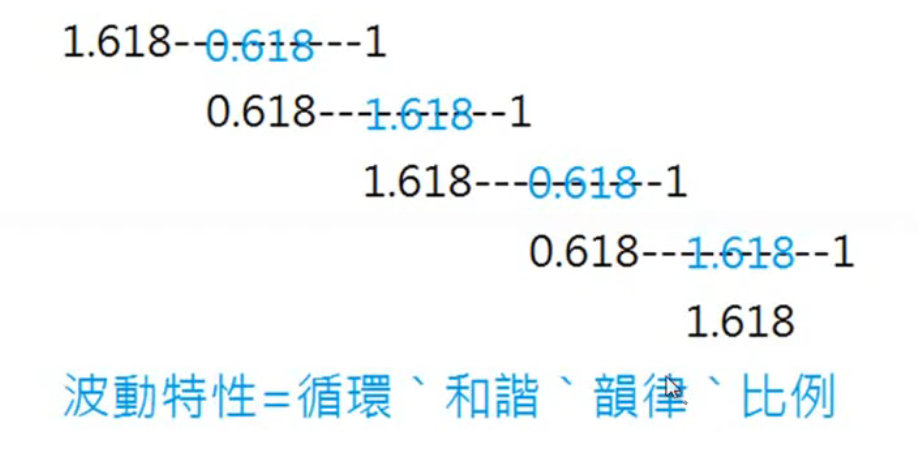

若两数相乘=1，表示两数为波动关系数

若两数相乘除=2，表示两数为共鸣关系数

若波动率=1.414（根号2）

有AB两数，B=1.618，若两数之间波动率为1.414，求A？

A=1.618/1.414=1.144

若波动率具有和谐、循环、韵律、比例的关系

若有A1、B1两数，B1=1.414、若两数之间波动率为1.144，求A1？

A1=1.414/1.144=1.236

初始由1.618经过两次的波动率折算产生1.236此数

则1.618与1.236两数必为共鸣关系数

验算：1.618*1.236 约等于2

公式图：1.618经过1.414波动率拆解得出1.236此共鸣关系数

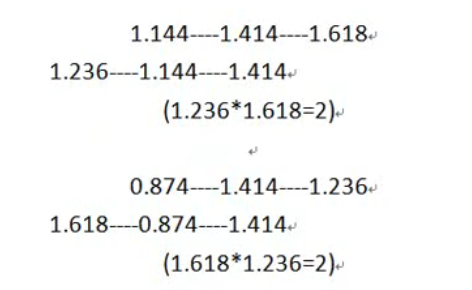

公式图：1.618经过1.144波动率拆解得出0.809此共鸣关系数。

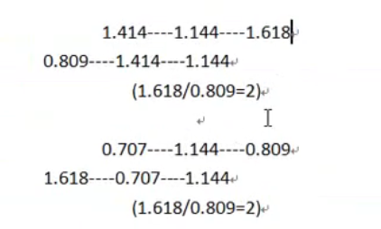

从以上得知，波动率之间存有两个固定变化的波动率为1.144与1.414此两变化，

此两波动率数值去拆解都可得出两个共鸣关系数，

但是江恩说过：波动率是变化的、必须找到怡当的波动率才可以推演预测，

那么波动率还隐藏在哪些地方？

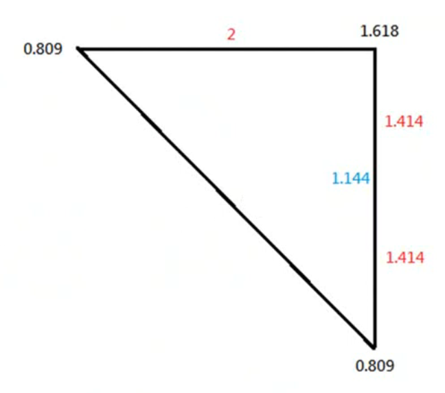

从1.618以拆解得知1.144与1.414为两个重要的波动率数值。

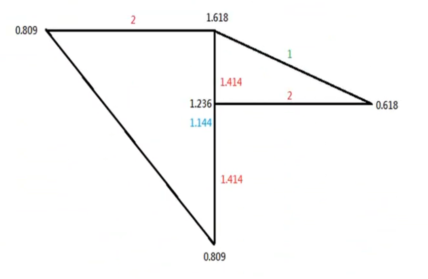

从1.414与1.144之间可以得知波动率为1.236

而1.236的2倍共鸣关系数为0.618

而巧妙的1.618与0.618又成波动关系数，

那到底江恩认为所有波动率的最基本值1.059到底躲在哪？

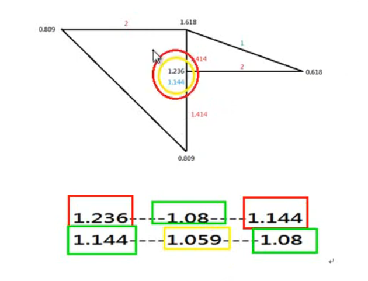

如果还是体会不到的话。那麽请看以下这张图~

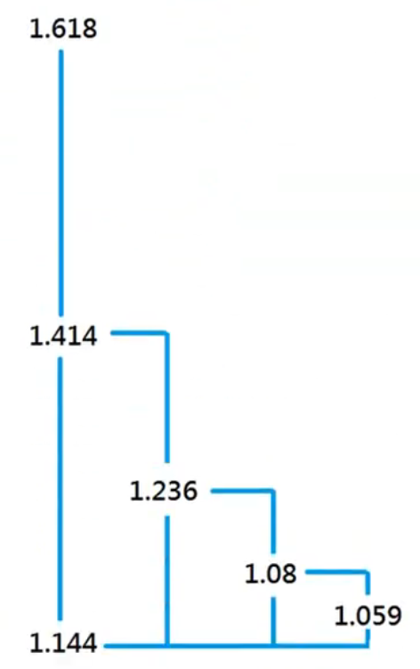

**江恩认为：**

所有潜在的波动率数值最小单位为1.059开始衍生，

而1.059与1.144两数波动率之间存在为1.08，

1.059为最小之波动率，

因为1.059与1.144之间的波动率为1.081，（1.144/1.059=1.08）

而1.144与1.08之间的波动率为1.059

因而最小值的波动率单位为1.059

也就是音律比

**最小单位波动率：**

A---波动率---B

A---根号2----1.618

1.144----1.414---1618  =  1.0595*1.08----1.414--1.618

### 波动关系图一

蓝线两端相乘=1

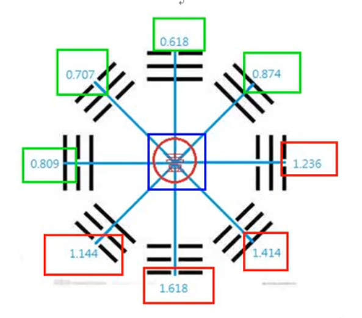

**江恩所有波动率：**

0.618

0.707

0.809

0.874

1

1.0595

1.08

1.144

1.236

1.414

1.618

2

### 波动关系图二

红线之间波动率=1.144

绿线之间波动率=1.414

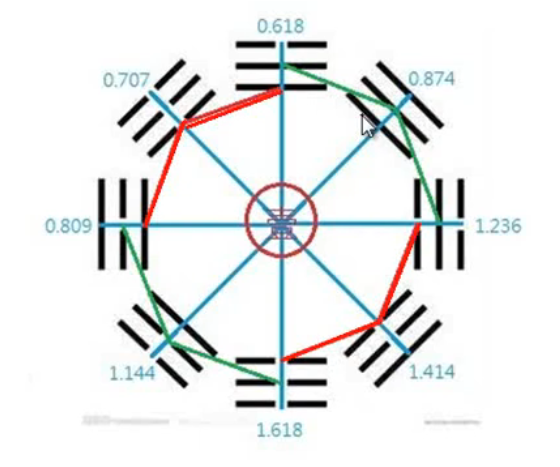

### 波浪结构

江恩认为从一个起点开始起算，总共会有八个方向八种波动率的走法，而构成了螺旋扩张的定律。

上升：当盘势的方向在螺旋结构图往

1.左下角的1.144波动率成长

2.正下方的1.618波动率成长

3.右下角的1.414波动率成长

4.正右方的1.236波动率成长

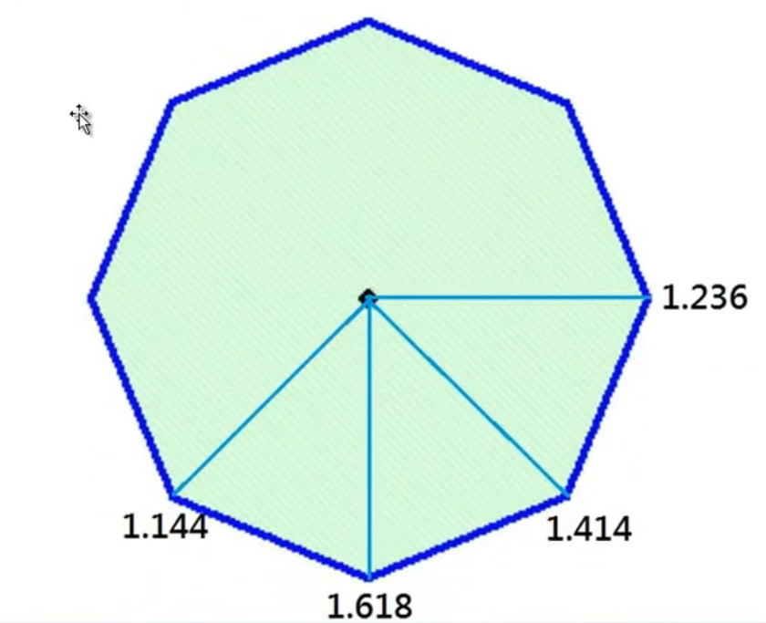

下降：

1.正左方的0.809波动率下降

2.左上方的0.707波动率下降

3.正上方的0.618波动率下降

4.右上方的0.874波动率下降。

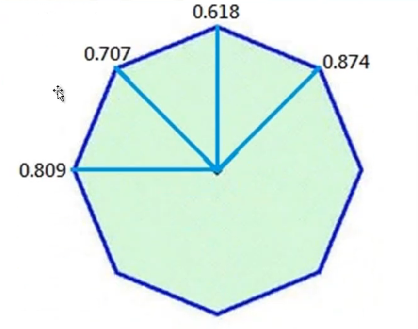

### 江恩螺旋结构图

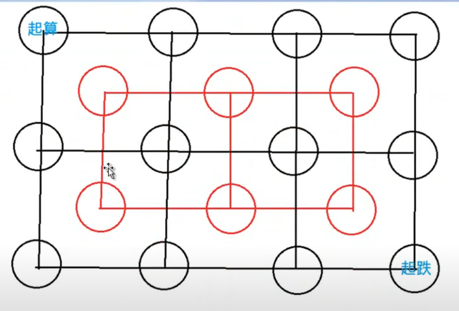

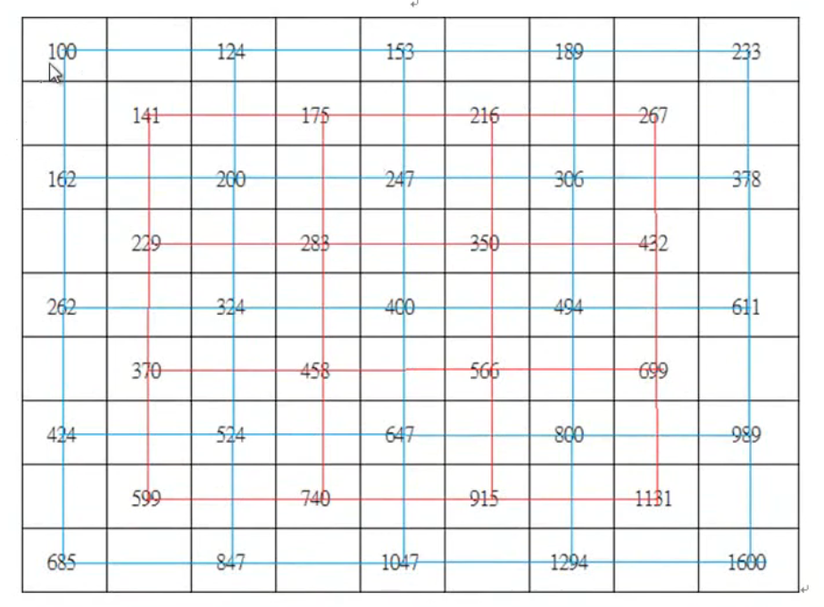

假設目前台股走势如下：

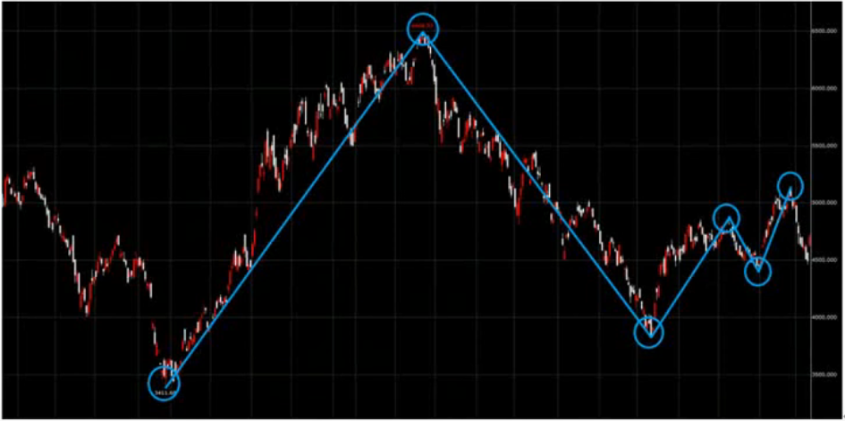

已知历史数据如下：

2001年09月26日低点3411起涨

2002年04月26日高点6484

2002年10月 11日低点3845

2002年12月09日高点4867

2002年12月31日低点4413

2003年01月 24日高点5141

求下一个低点的大约日期为何？

2001年09月26日低点3411起涨

2002年04月26日高点6484

第一个高点为起涨之后第136日

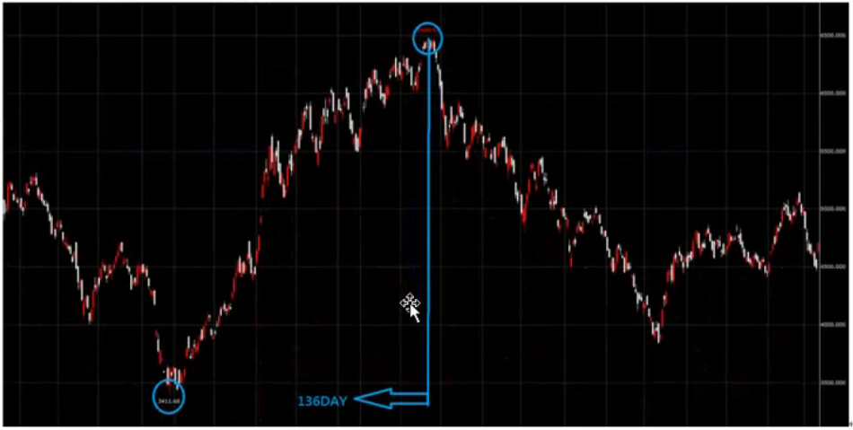

排列江恩螺旋结构图如下

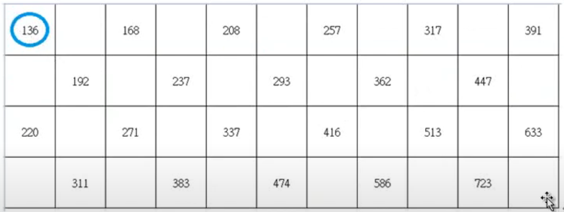

2002年10月11日低点3845，此低点距离起涨日为257日

此可知起涨之后的第一个低点波动方向为螺旋图之1.236波动率方向

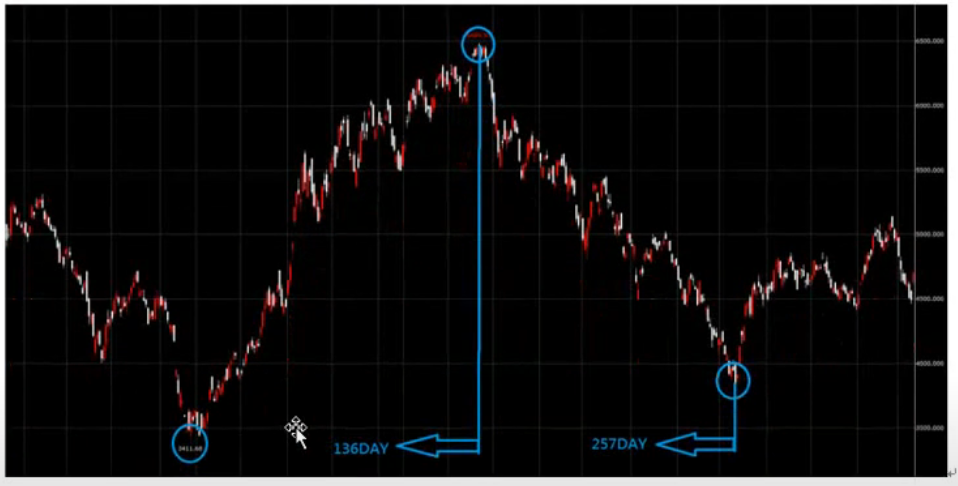

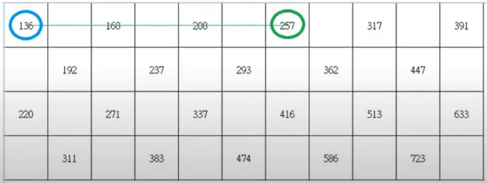

2002年12月09日高点4867此高点距离起涨日为298日

由此可知高点的波动率为257处往螺旋图之 1.144波动率方向移动

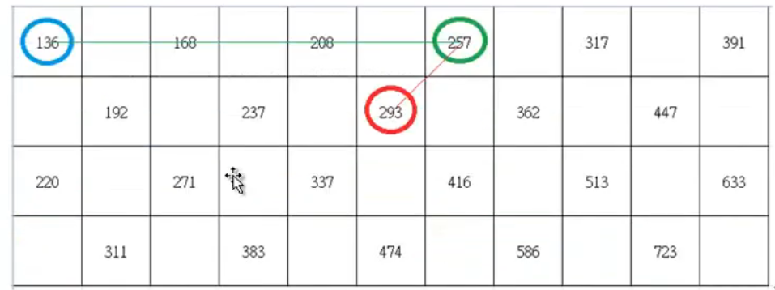

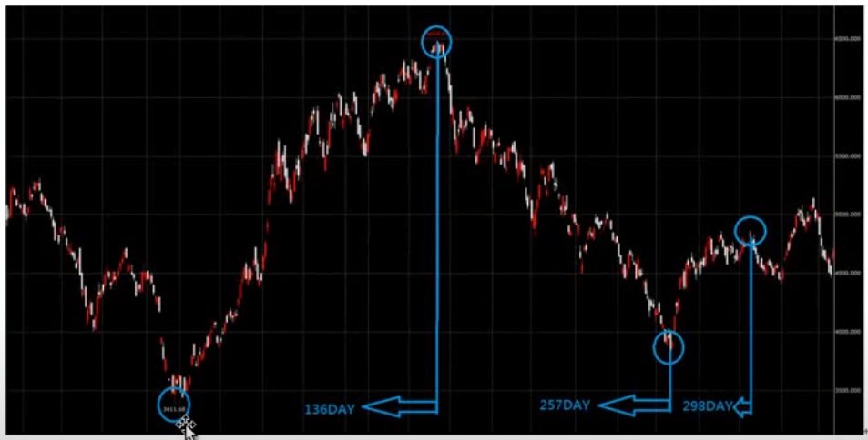

若波动方向并未改变，则

下一个低点预估为317或391天的时间点上

下一个高点预估为337或383天的时间点上

2002年12月31日低点4413，此低点距离起涨日为314日

由此可知目前低点波动方向仍维持136日起涨之后的1.236波动率方向进行

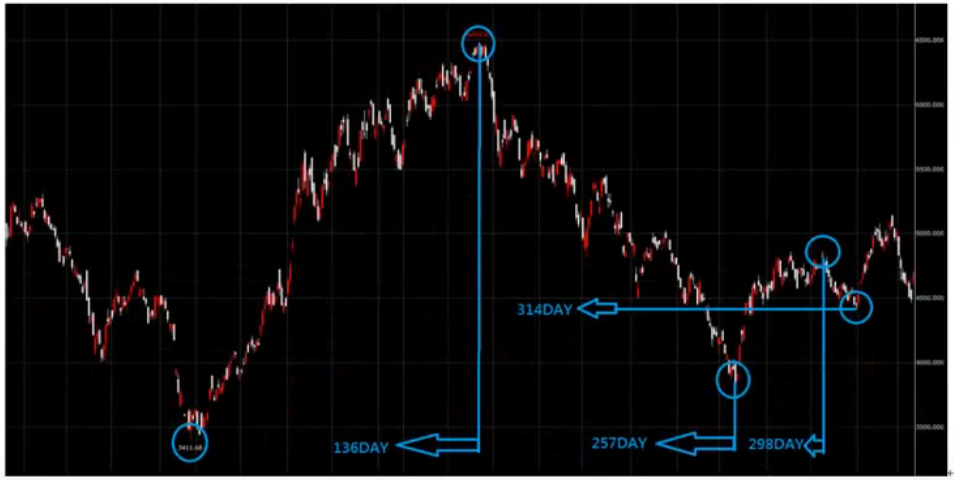

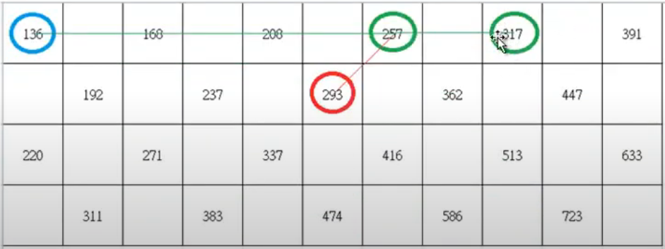

若波动方向并未改变，则

下一个低点预估为391天的时间点上。

下一个高点预估为337或383天的时间点上

2003年01月24日高点5141、此高点距离起涨日为331日

由此可知，目前高点波动方向仍维持257处的1.144波动率方向进行

2003年04月28日低点4044（与螺旋图差距一日）

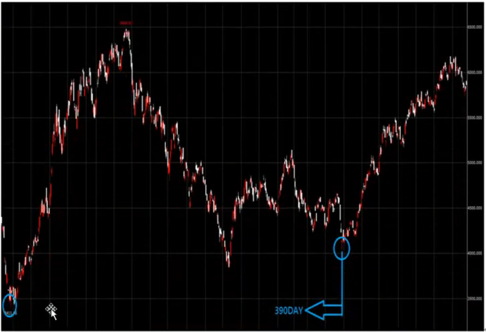

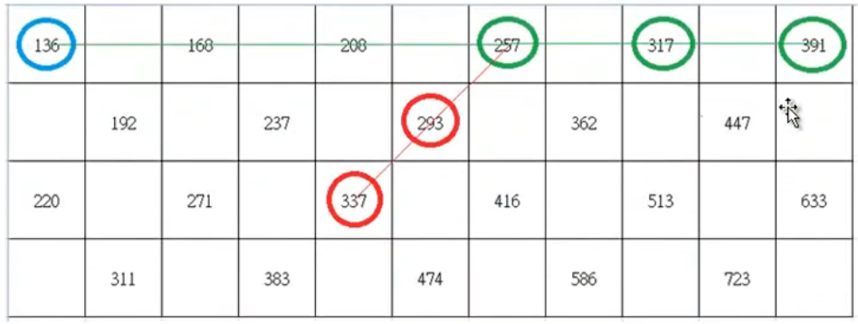
