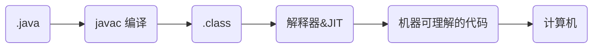
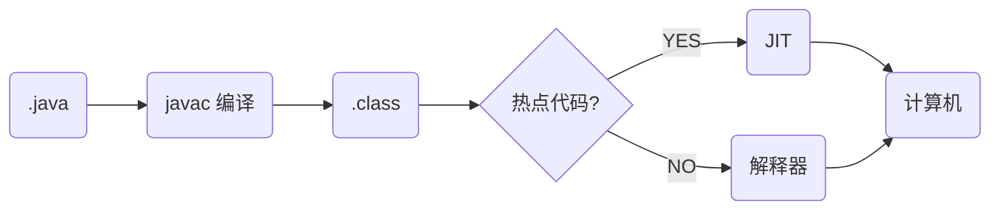
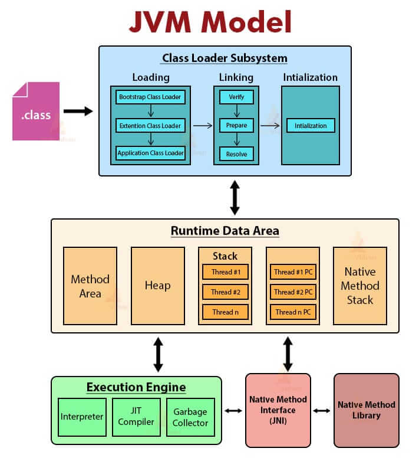

# Java基础

## 基础概念与常识

### Java语言有哪些特点？

1. 简单易学；
2. 面向对象（封装，继承，多态）；
3. 平台无关性（ Java 虚拟机实现平台无关性）；
4. 支持多线程；
5. 可靠性（具备异常处理和自动内存管理机制）；
6. 安全性（Java 语言本身的设计就提供了多重安全防护机制如访问权限修饰符、限制程序直接访问操作系统资源）；
7. 高效性（通过 Just In Time（JIT） 编译器等技术的优化，Java 语言的运行效率还是非常不错的）；
8. 支持网络编程并且很方便；
9. 编译与解释并存；
10. Java强大的生态

### Java SE vs Java EE 

- Java SE（Java Platform，Standard Edition）: Java 平台标准版，Java 编程语言的基础，它包含了支持 Java 应用程序开发和运行的核心类库以及虚拟机等核心组件。Java SE 可以用于构建桌面应用程序或简单的服务器应用程序。
- Java EE（Java Platform, Enterprise Edition ）：Java 平台企业版，建立在 Java SE 的基础上，包含了支持企业级应用程序开发和部署的标准和规范（比如 Servlet、JSP、EJB、JDBC、JPA、JTA、JavaMail、JMS）。 Java EE 可以用于构建分布式、可移植、健壮、可伸缩和安全的服务端 Java 应用程序，例如 Web 应用程序。
- Java ME（Java Platform，Micro Edition）：Java ME 是 Java 的微型版本，主要用于开发嵌入式消费电子设备的应用程序，例如手机、PDA、机顶盒、冰箱、空调等。

简单来说，Java SE 是 Java 的基础版本，Java EE 是 Java 的高级版本。Java SE 更适合开发桌面应用程序或简单的服务器应用程序，Java EE 更适合开发复杂的企业级应用程序或 Web 应用程序。

### JVM vs JDK vs JRE

#### JVM

Java 虚拟机（JVM）是运行 Java 字节码的虚拟机。JVM 有针对不同系统的特定实现（Windows，Linux，macOS），目的是使用相同的字节码，它们都会给出相同的结果。字节码和不同系统的 JVM 实现是 Java 语言“一次编译，随处可以运行”的关键所在。

#### JRE

JRE（Java Runtime Environment） 是 Java 运行时环境。它是运行已编译 Java 程序所需的所有内容的集合，主要包括 Java 虚拟机（JVM）、Java 基础类库（Class Library）。

#### JDK

JDK（Java Development Kit），它是功能齐全的 Java SDK，是提供给开发者使用的，能够创建和编译 Java 程序。他包含了 JRE，同时还包含了编译 java 源码的编译器 javac 以及一些其他工具比如 javadoc（文档注释工具）、jdb（调试器）、jconsole（基于 JMX 的可视化监控⼯具）、javap（反编译工具）等等。

也就是说，JRE 是 Java 运行时环境，仅包含 Java 应用程序的运行时环境和必要的类库。而 JDK 则包含了 JRE，同时还包括了 javac、javadoc、jdb、jconsole、javap 等工具，可以用于 Java 应用程序的开发和调试。如果需要进行 Java 编程工作，比如编写和编译 Java 程序、使用 Java API 文档等，就需要安装 JDK。而对于某些需要使用 Java 特性的应用程序，如 JSP 转换为 Java Servlet、使用反射等，也需要 JDK 来编译和运行 Java 代码。因此，即使不打算进行 Java 应用程序的开发工作，也有可能需要安装 JDK。

### 什么是字节码?采用字节码的好处是什么?

在 Java 中，JVM 可以理解的代码就叫做字节码（即扩展名为 `.class` 的文件），它不面向任何特定的处理器，只面向虚拟机。Java 语言通过字节码的方式，在一定程度上解决了传统解释型语言执行效率低的问题，同时又保留了解释型语言可移植的特点。所以， Java 程序运行时相对来说还是高效的（不过，和 C、 C++，Rust，Go 等语言还是有一定差距的），而且，由于字节码并不针对一种特定的机器，因此，Java 程序无须重新编译便可在多种不同操作系统的计算机上运行。

**Java 程序从源代码到运行的过程如下图所示**：

我们需要格外注意的是 `.class->机器码` 这一步。在这一步 JVM 类加载器首先加载字节码文件，然后通过解释器逐行解释执行，这种方式的执行速度会相对比较慢。而且，有些方法和代码块是经常需要被调用的(也就是所谓的热点代码)，所以后面引进了 **JIT（Just in Time Compilation）** 编译器，而 JIT 属于运行时编译。当 JIT 编译器完成第一次编译后，其会将字节码对应的机器码保存下来，下次可以直接使用。而我们知道，机器码的运行效率肯定是高于 Java 解释器的。这也解释了我们为什么经常会说 **Java 是编译与解释共存的语言** 。

> HotSpot 采用了惰性评估(Lazy Evaluation)的做法，根据二八定律，消耗大部分系统资源的只有那一小部分的代码（热点代码），而这也就是 JIT 所需要编译的部分。JVM 会根据代码每次被执行的情况收集信息并相应地做出一些优化，因此执行的次数越多，它的速度就越快。
>

 JVM 的大致结构模型

